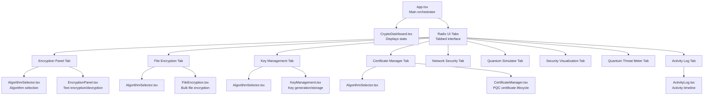
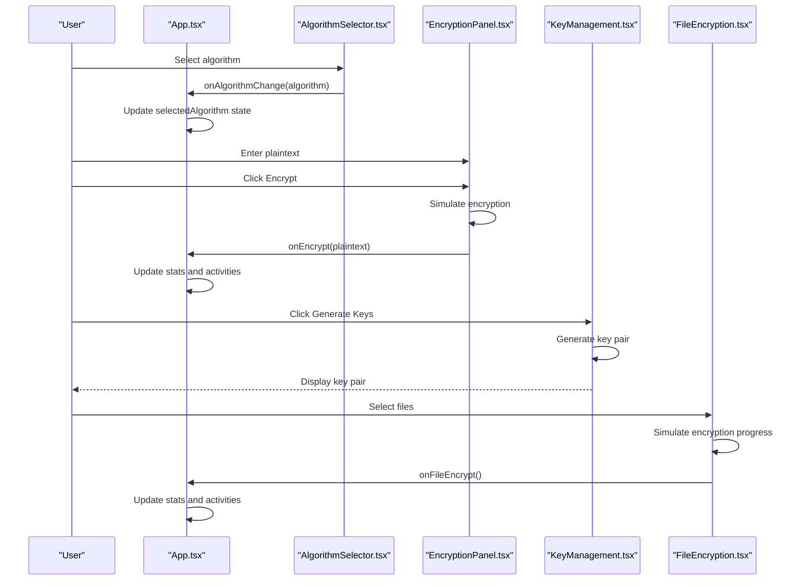
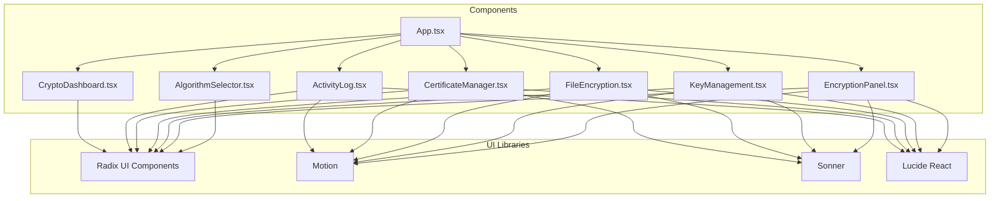

# API Reference

<cite>
**Referenced Files in This Document**
- [App.tsx](file://Design/src/app/App.tsx)
- [algorithm-selector.tsx](file://Design/src/app/components/algorithm-selector.tsx)
- [encryption-panel.tsx](file://Design/src/app/components/encryption-panel.tsx)
- [key-management.tsx](file://Design/src/app/components/key-management.tsx)
- [file-encryption.tsx](file://Design/src/app/components/file-encryption.tsx)
- [crypto-dashboard.tsx](file://Design/src/app/components/crypto-dashboard.tsx)
- [activity-log.tsx](file://Design/src/app/components/activity-log.tsx)
- [certificate-manager.tsx](file://Design/src/app/components/certificate-manager.tsx)
- [README.md](file://Design/README.md)
- [package.json](file://Design/package.json)
</cite>

## Table of Contents
1. [Introduction](#introduction)
2. [Project Structure](#project-structure)
3. [Core Components](#core-components)
4. [Architecture Overview](#architecture-overview)
5. [Detailed Component Analysis](#detailed-component-analysis)
6. [Dependency Analysis](#dependency-analysis)
7. [Performance Considerations](#performance-considerations)
8. [Troubleshooting Guide](#troubleshooting-guide)
9. [Conclusion](#conclusion)

## Introduction
This API reference documents the public interfaces and component APIs of the Post-Quantum Cryptography Educational Platform. It focuses on the main App component’s props, state management, and event handlers, along with the AlgorithmSelector, EncryptionPanel, KeyManagement, FileEncryption, CryptoDashboard, ActivityLog, and CertificateManager components. The documentation includes TypeScript interface definitions, parameter specifications, return value documentation, and examples of programmatic usage and integration patterns.

## Project Structure
The platform is organized around a central App component that orchestrates multiple specialized components. The App component manages shared state (selected algorithm, activity log, statistics) and coordinates child components through props and callbacks.

**Diagram sources**
- [App.tsx](file://Design/src/app/App.tsx#L26-L360)
- [algorithm-selector.tsx](file://Design/src/app/components/algorithm-selector.tsx#L68-L121)
- [encryption-panel.tsx](file://Design/src/app/components/encryption-panel.tsx#L10-L238)
- [file-encryption.tsx](file://Design/src/app/components/file-encryption.tsx#L19-L229)
- [key-management.tsx](file://Design/src/app/components/key-management.tsx#L18-L221)
- [crypto-dashboard.tsx](file://Design/src/app/components/crypto-dashboard.tsx#L4-L70)
- [activity-log.tsx](file://Design/src/app/components/activity-log.tsx#L15-L117)
- [certificate-manager.tsx](file://Design/src/app/components/certificate-manager.tsx#L23-L295)

**Section sources**
- [App.tsx](file://Design/src/app/App.tsx#L26-L360)
- [README.md](file://Design/README.md#L1-L11)

## Core Components
This section documents the primary components and their public APIs.

### App Component
The App component is the central orchestrator managing:
- Selected algorithm state
- Activity log state
- Statistics state
- Event handlers for encryption and file encryption

Key responsibilities:
- Initialize and maintain shared state
- Render the main UI with tabbed sections
- Coordinate child components via props and callbacks
- Manage animations and layout

Props and state:
- selectedAlgorithm: AlgorithmType
- activities: Activity[]
- stats: { totalEncryptions: number; activeKeys: number; dataEncapsulated: string; securityLevel: number }

Callbacks:
- handleEncrypt(data: string): void
- handleFileEncrypt(): void

Integration patterns:
- Pass selectedAlgorithm to AlgorithmSelector and EncryptionPanel
- Pass onEncrypt to EncryptionPanel
- Pass onFileEncrypt to FileEncryption
- Pass activities to ActivityLog

**Section sources**
- [App.tsx](file://Design/src/app/App.tsx#L26-L91)
- [App.tsx](file://Design/src/app/App.tsx#L250-L316)

### AlgorithmSelector Component
Purpose:
- Allow users to select a post-quantum algorithm from a predefined list
- Display algorithm metadata (security level, speed, type)
- Synchronize selection with parent via callback

Props:
- selectedAlgorithm: AlgorithmType
- onAlgorithmChange: (algorithm: AlgorithmType) => void

AlgorithmType:
- "CRYSTALS-Kyber" | "CRYSTALS-Dilithium" | "SPHINCS+" | "NTRU" | "SABER" | "FrodoKEM"

Algorithm metadata:
- id: AlgorithmType
- name: string
- type: string ("KEM" or "Digital Signature")
- security: string (NIST level)
- speed: string (performance indicator)
- description: string

Behavior:
- Renders a select dropdown with algorithm options
- Displays badges for security, speed, and type
- Calls onAlgorithmChange when selection changes

**Section sources**
- [algorithm-selector.tsx](file://Design/src/app/components/algorithm-selector.tsx#L6-L121)

### EncryptionPanel Component
Purpose:
- Provide a UI for encrypting and decrypting text using the selected algorithm
- Simulate cryptographic operations
- Handle result presentation and user actions

Props:
- algorithm: AlgorithmType
- onEncrypt: (data: string) => void

Internal state:
- plaintext: string
- ciphertext: string
- isEncrypting: boolean
- isDecrypting: boolean
- copied: boolean

Callbacks:
- handleEncrypt(): Promise<void>
- handleDecrypt(): Promise<void>
- copyToClipboard(text: string): void
- downloadCiphertext(): void

Behavior:
- Encrypts plaintext to simulated ciphertext with algorithm prefix and random padding
- Decrypts ciphertext by extracting base64 portion
- Updates parent via onEncrypt callback
- Provides copy-to-clipboard and download functionality

**Section sources**
- [encryption-panel.tsx](file://Design/src/app/components/encryption-panel.tsx#L10-L238)

### KeyManagement Component
Purpose:
- Generate, display, and manage quantum-resistant key pairs
- Provide key visibility toggling and export capabilities

Props:
- algorithm: AlgorithmType

Internal state:
- keys: KeyPair[]
- isGenerating: boolean
- visibleKeys: Set<string>

KeyPair structure:
- id: string
- algorithm: AlgorithmType
- publicKey: string
- privateKey: string
- created: Date

Callbacks:
- generateKeyPair(): Promise<void>
- deleteKey(id: string): void
- toggleKeyVisibility(id: string): void
- exportKeys(keyPair: KeyPair): void

Behavior:
- Generates randomized public/private key pairs with algorithm-specific prefixes
- Allows toggling visibility of private keys
- Exports key pairs as JSON files
- Truncates long keys for display

**Section sources**
- [key-management.tsx](file://Design/src/app/components/key-management.tsx#L10-L221)

### FileEncryption Component
Purpose:
- Encrypt files using the selected algorithm with progress indication
- Provide bulk file processing simulation

Props:
- algorithm: AlgorithmType
- onFileEncrypt: () => void

Internal state:
- files: EncryptedFile[]
- fileInputRef: React.RefObject<HTMLInputElement>

EncryptedFile structure:
- id: string
- name: string
- size: number
- type: string
- status: "encrypting" | "encrypted" | "failed"
- progress: number

Callbacks:
- handleFileSelect(event: React.ChangeEvent<HTMLInputElement>): void
- simulateEncryption(fileId: string): Promise<void>
- downloadEncryptedFile(file: EncryptedFile): void
- removeFile(fileId: string): void
- encryptAll(): void

Behavior:
- Processes multiple files with progress bars
- Simulates encryption progress with periodic updates
- Invokes onFileEncrypt callback upon completion
- Provides download and removal actions

**Section sources**
- [file-encryption.tsx](file://Design/src/app/components/file-encryption.tsx#L10-L229)

### CryptoDashboard Component
Purpose:
- Display key statistics about cryptographic operations
- Present security metrics in a dashboard layout

Props:
- stats: {
  - totalEncryptions: number
  - activeKeys: number
  - dataEncapsulated: string
  - securityLevel: number
}

Behavior:
- Renders four cards with icons and trend indicators
- Shows totals and descriptions for encryptions, keys, data secured, and security level

**Section sources**
- [crypto-dashboard.tsx](file://Design/src/app/components/crypto-dashboard.tsx#L4-L70)

### ActivityLog Component
Purpose:
- Display recent cryptographic operations in a scrollable timeline
- Show timestamps and statuses

Props:
- activities: Activity[]

Activity structure:
- id: string
- type: "encryption" | "decryption" | "keygen" | "verify"
- algorithm: string
- timestamp: Date
- status: "success" | "failed"

Behavior:
- Formats relative timestamps (seconds/minutes/hours ago)
- Displays colored badges for operation types
- Supports scrollable area for long lists

**Section sources**
- [activity-log.tsx](file://Design/src/app/components/activity-log.tsx#L7-L117)

### CertificateManager Component
Purpose:
- Create and manage post-quantum certificates
- Export and revoke certificates

Props:
- algorithm: AlgorithmType

Internal state:
- certificates: CertificateData[]
- isCreating: boolean
- formData: { commonName: string; organization: string; validityDays: string }

CertificateData structure:
- id: string
- commonName: string
- organization: string
- algorithm: AlgorithmType
- validFrom: Date
- validUntil: Date
- serialNumber: string
- status: "valid" | "expiring" | "expired"

Callbacks:
- createCertificate(): Promise<void>
- exportCertificate(cert: CertificateData): void
- revokeCertificate(certId: string): void

Behavior:
- Creates certificates with randomized serial numbers and validity periods
- Determines status based on expiration
- Exports certificates as text files
- Provides creation form with validation

**Section sources**
- [certificate-manager.tsx](file://Design/src/app/components/certificate-manager.tsx#L12-L295)

## Architecture Overview
The platform follows a unidirectional data flow pattern:
- App maintains global state and passes it down to child components
- Child components trigger callbacks to update App state
- UI components render based on props and local state

**Diagram sources**
- [App.tsx](file://Design/src/app/App.tsx#L26-L91)
- [algorithm-selector.tsx](file://Design/src/app/components/algorithm-selector.tsx#L68-L121)
- [encryption-panel.tsx](file://Design/src/app/components/encryption-panel.tsx#L45-L78)
- [key-management.tsx](file://Design/src/app/components/key-management.tsx#L32-L49)
- [file-encryption.tsx](file://Design/src/app/components/file-encryption.tsx#L69-L87)

## Detailed Component Analysis

### App Component API
State management:
- selectedAlgorithm: AlgorithmType
  - Type: "CRYSTALS-Kyber" | "CRYSTALS-Dilithium" | "SPHINCS+" | "NTRU" | "SABER" | "FrodoKEM"
  - Purpose: Controls which algorithm is active across panels
  - Default: "CRYSTALS-Kyber"

- activities: Activity[]
  - Type: Array of Activity objects
  - Purpose: Maintains recent operations history
  - Behavior: Limits to last 50 entries

- stats: {
  - totalEncryptions: number
  - activeKeys: number
  - dataEncapsulated: string
  - securityLevel: number
  }

Event handlers:
- handleEncrypt(data: string): void
  - Increments totalEncryptions
  - Updates dataEncapsulated based on input length
  - Adds encryption activity entry

- handleFileEncrypt(): void
  - Increments totalEncryptions
  - Adds fixed amount to dataEncapsulated
  - Adds encryption activity entry

Lifecycle:
- Initial activities loaded via useEffect on mount

Integration:
- Passes selectedAlgorithm to AlgorithmSelector, EncryptionPanel, FileEncryption, KeyManagement, and CertificateManager
- Passes onEncrypt to EncryptionPanel and onFileEncrypt to FileEncryption
- Passes activities to ActivityLog

**Section sources**
- [App.tsx](file://Design/src/app/App.tsx#L26-L91)
- [App.tsx](file://Design/src/app/App.tsx#L250-L316)

### AlgorithmSelector API
Props:
- selectedAlgorithm: AlgorithmType
- onAlgorithmChange: (algorithm: AlgorithmType) => void

Behavior:
- Renders a dropdown with six supported algorithms
- Displays algorithm metadata (security level, speed, type)
- Updates parent via callback when selection changes

Integration:
- Used in Encryption Panel, File Encryption, Key Management, and Certificate Manager tabs
- Ensures consistent algorithm selection across the platform

**Section sources**
- [algorithm-selector.tsx](file://Design/src/app/components/algorithm-selector.tsx#L68-L121)

### EncryptionPanel API
Props:
- algorithm: AlgorithmType
- onEncrypt: (data: string) => void

State:
- plaintext: string
- ciphertext: string
- isEncrypting: boolean
- isDecrypting: boolean
- copied: boolean

Methods:
- handleEncrypt(): Promise<void>
  - Validates input
  - Simulates encryption process
  - Calls onEncrypt callback
  - Displays success/error notifications

- handleDecrypt(): Promise<void>
  - Validates input
  - Simulates decryption process
  - Displays success notification

- copyToClipboard(text: string): void
  - Copies text to clipboard
  - Shows temporary feedback

- downloadCiphertext(): void
  - Downloads ciphertext as .pqc file

Integration:
- Receives algorithm from parent
- Emits onEncrypt to parent for analytics/statistics
- Manages local UI state for user feedback

**Section sources**
- [encryption-panel.tsx](file://Design/src/app/components/encryption-panel.tsx#L10-L238)

### KeyManagement API
Props:
- algorithm: AlgorithmType

State:
- keys: KeyPair[]
- isGenerating: boolean
- visibleKeys: Set<string>

Methods:
- generateKeyPair(): Promise<void>
  - Generates randomized key pair with algorithm-specific prefixes
  - Updates state and shows success notification

- deleteKey(id: string): void
  - Removes key pair from state
  - Clears visibility state for the key

- toggleKeyVisibility(id: string): void
  - Toggles visibility of private key

- exportKeys(keyPair: KeyPair): void
  - Exports key pair as JSON file

Integration:
- Uses algorithm to prefix generated keys
- Manages visibility locally to prevent accidental exposure

**Section sources**
- [key-management.tsx](file://Design/src/app/components/key-management.tsx#L18-L221)

### FileEncryption API
Props:
- algorithm: AlgorithmType
- onFileEncrypt: () => void

State:
- files: EncryptedFile[]
- fileInputRef: React.RefObject<HTMLInputElement>

Methods:
- handleFileSelect(event: React.ChangeEvent<HTMLInputElement>): void
  - Processes selected files
  - Starts encryption simulation for each file

- simulateEncryption(fileId: string): Promise<void>
  - Updates progress periodically
  - Marks file as encrypted
  - Calls onFileEncrypt

- downloadEncryptedFile(file: EncryptedFile): void
  - Downloads encrypted file with .pqc.encrypted extension

- removeFile(fileId: string): void
  - Removes file from processing list

Integration:
- Integrates with App for statistics and activity logging
- Provides visual progress feedback

**Section sources**
- [file-encryption.tsx](file://Design/src/app/components/file-encryption.tsx#L19-L229)

### CryptoDashboard API
Props:
- stats: {
  - totalEncryptions: number
  - activeKeys: number
  - dataEncapsulated: string
  - securityLevel: number
}

Behavior:
- Renders four metric cards with icons
- Displays trends and descriptions
- Responsive grid layout

**Section sources**
- [crypto-dashboard.tsx](file://Design/src/app/components/crypto-dashboard.tsx#L4-L70)

### ActivityLog API
Props:
- activities: Activity[]

Behavior:
- Renders scrollable timeline of activities
- Formats relative timestamps
- Shows colored badges for operation types
- Supports empty state messaging

**Section sources**
- [activity-log.tsx](file://Design/src/app/components/activity-log.tsx#L15-L117)

### CertificateManager API
Props:
- algorithm: AlgorithmType

State:
- certificates: CertificateData[]
- isCreating: boolean
- formData: { commonName: string; organization: string; validityDays: string }

Methods:
- createCertificate(): Promise<void>
  - Validates form
  - Generates certificate with randomized serial number
  - Sets validity period based on input
  - Adds to certificate list

- exportCertificate(cert: CertificateData): void
  - Exports certificate details as text file

- revokeCertificate(certId: string): void
  - Removes certificate from list

Integration:
- Uses algorithm to determine signature/public key algorithm
- Manages certificate status based on validity dates

**Section sources**
- [certificate-manager.tsx](file://Design/src/app/components/certificate-manager.tsx#L23-L295)

## Dependency Analysis
External dependencies relevant to component APIs:
- Radix UI: Tabs, Select, Card, Button, Badge, Progress, ScrollArea
- Motion: Animation primitives for transitions and loaders
- Sonner: Toast notifications
- Lucide React: Icons for UI elements

**Diagram sources**
- [package.json](file://Design/package.json#L10-L68)
- [App.tsx](file://Design/src/app/App.tsx#L1-L16)
- [algorithm-selector.tsx](file://Design/src/app/components/algorithm-selector.tsx#L1-L4)
- [encryption-panel.tsx](file://Design/src/app/components/encryption-panel.tsx#L1-L8)
- [key-management.tsx](file://Design/src/app/components/key-management.tsx#L1-L8)
- [file-encryption.tsx](file://Design/src/app/components/file-encryption.tsx#L1-L8)
- [certificate-manager.tsx](file://Design/src/app/components/certificate-manager.tsx#L1-L10)
- [activity-log.tsx](file://Design/src/app/components/activity-log.tsx#L1-L5)
- [crypto-dashboard.tsx](file://Design/src/app/components/crypto-dashboard.tsx#L1-L2)

**Section sources**
- [package.json](file://Design/package.json#L10-L68)

## Performance Considerations
- Simulation delays: Encryption/decryption and key generation include artificial delays to mimic real cryptographic operations. These can be adjusted for production environments.
- State updates: Activities are capped at 50 entries to prevent memory growth.
- Rendering: Components use motion animations judiciously; disabling animations may improve performance on lower-end devices.
- File processing: Progress updates occur at fixed intervals; adjust interval length for different performance targets.

## Troubleshooting Guide
Common issues and resolutions:
- Empty input validation:
  - EncryptionPanel displays error when plaintext is empty
  - FileEncryption validates file selection before processing
  - CertificateManager requires common name and organization

- Clipboard operations:
  - copyToClipboard uses browser clipboard API; ensure HTTPS context for permission prompts

- File downloads:
  - downloadCiphertext creates Blob URLs; ensure cleanup via URL.revokeObjectURL
  - downloadEncryptedFile uses dynamic filenames with timestamps

- State synchronization:
  - AlgorithmSelector updates parent state via onAlgorithmChange
  - EncryptionPanel triggers onEncrypt callback after successful encryption
  - FileEncryption triggers onFileEncrypt after progress completes

**Section sources**
- [encryption-panel.tsx](file://Design/src/app/components/encryption-panel.tsx#L45-L96)
- [file-encryption.tsx](file://Design/src/app/components/file-encryption.tsx#L43-L111)
- [certificate-manager.tsx](file://Design/src/app/components/certificate-manager.tsx#L51-L80)

## Conclusion
The Post-Quantum Cryptography Educational Platform provides a cohesive set of APIs for algorithm selection, encryption/decryption, key management, file processing, certificate lifecycle, and activity tracking. The App component serves as a central coordinator, passing props and callbacks to specialized components while maintaining shared state. The documented interfaces enable predictable integration patterns and facilitate educational demonstrations of post-quantum cryptographic concepts.