# Component APIs

<cite>
**Referenced Files in This Document**
- [button.tsx](file://Design/src/app/components/ui/button.tsx)
- [input.tsx](file://Design/src/app/components/ui/input.tsx)
- [dialog.tsx](file://Design/src/app/components/ui/dialog.tsx)
- [card.tsx](file://Design/src/app/components/ui/card.tsx)
- [form.tsx](file://Design/src/app/components/ui/form.tsx)
- [select.tsx](file://Design/src/app/components/ui/select.tsx)
- [tabs.tsx](file://Design/src/app/components/ui/tabs.tsx)
- [table.tsx](file://Design/src/app/components/ui/table.tsx)
- [alert.tsx](file://Design/src/app/components/ui/alert.tsx)
- [badge.tsx](file://Design/src/app/components/ui/badge.tsx)
- [switch.tsx](file://Design/src/app/components/ui/switch.tsx)
- [slider.tsx](file://Design/src/app/components/ui/slider.tsx)
- [tooltip.tsx](file://Design/src/app/components/ui/tooltip.tsx)
- [avatar.tsx](file://Design/src/app/components/ui/avatar.tsx)
- [utils.ts](file://Design/src/app/components/ui/utils.ts)
</cite>

## Table of Contents
1. [Introduction](#introduction)
2. [Project Structure](#project-structure)
3. [Core Components](#core-components)
4. [Architecture Overview](#architecture-overview)
5. [Detailed Component Analysis](#detailed-component-analysis)
6. [Dependency Analysis](#dependency-analysis)
7. [Performance Considerations](#performance-considerations)
8. [Troubleshooting Guide](#troubleshooting-guide)
9. [Conclusion](#conclusion)
10. [Appendices](#appendices)

## Introduction
This document provides comprehensive API documentation for the UI components in the Post-Quantum Cryptography Platform. It covers each component’s props interface, state management, event handlers, lifecycle methods, TypeScript definitions, default values, validation rules, behavior, user interactions, callbacks, usage examples, composition patterns, customization options, styling hooks, accessibility features, and ref-related utilities. The goal is to enable developers to integrate and customize components effectively while maintaining consistent UX and accessibility standards.

## Project Structure
The UI components are organized under a single module path and share a common utility for merging Tailwind classes. Each component is a small, focused React element that composes Radix UI primitives and Tailwind classes.

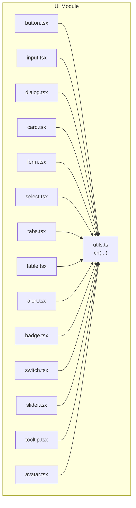

**Diagram sources**
- [utils.ts](file://Design/src/app/components/ui/utils.ts#L1-L7)
- [button.tsx](file://Design/src/app/components/ui/button.tsx#L1-L58)
- [input.tsx](file://Design/src/app/components/ui/input.tsx#L1-L22)
- [dialog.tsx](file://Design/src/app/components/ui/dialog.tsx#L1-L136)
- [card.tsx](file://Design/src/app/components/ui/card.tsx#L1-L93)
- [form.tsx](file://Design/src/app/components/ui/form.tsx#L1-L169)
- [select.tsx](file://Design/src/app/components/ui/select.tsx#L1-L190)
- [tabs.tsx](file://Design/src/app/components/ui/tabs.tsx#L1-L67)
- [table.tsx](file://Design/src/app/components/ui/table.tsx#L1-L117)
- [alert.tsx](file://Design/src/app/components/ui/alert.tsx#L1-L67)
- [badge.tsx](file://Design/src/app/components/ui/badge.tsx#L1-L47)
- [switch.tsx](file://Design/src/app/components/ui/switch.tsx#L1-L32)
- [slider.tsx](file://Design/src/app/components/ui/slider.tsx#L1-L64)
- [tooltip.tsx](file://Design/src/app/components/ui/tooltip.tsx#L1-L62)
- [avatar.tsx](file://Design/src/app/components/ui/avatar.tsx#L1-L54)

**Section sources**
- [utils.ts](file://Design/src/app/components/ui/utils.ts#L1-L7)

## Core Components
This section summarizes the primary UI components and their roles. Each component’s props, defaults, and behavior are described below.

- Button
  - Purpose: Renders interactive buttons with variants and sizes.
  - Props: Inherits base button props; adds variant, size, and asChild.
  - Defaults: variant default, size default.
  - Accessibility: Focus-visible ring, aria-invalid support via parent context.
  - Events: Standard onClick and other button events.
  - Lifecycle: Stateless functional component.
  - Refs: None exposed; uses a slot wrapper when asChild is true.
  - Customization: Variants and sizes via variant props; className for overrides.

- Input
  - Purpose: Text input with focus-visible ring and invalid state styling.
  - Props: Inherits base input props; className optional.
  - Defaults: None.
  - Accessibility: Focus-visible ring, aria-invalid support.
  - Events: onChange, onBlur, onFocus, etc.
  - Lifecycle: Stateless functional component.
  - Refs: None exposed.
  - Customization: className for additional styling.

- Dialog
  - Purpose: Modal overlay with close controls and portal rendering.
  - Subcomponents: Root, Trigger, Portal, Close, Overlay, Content, Header, Footer, Title, Description.
  - Props: Each subcomponent mirrors the underlying Radix UI primitive props.
  - Defaults: None.
  - Accessibility: Proper ARIA roles and focus management via Radix UI.
  - Events: Controlled via Radix UI triggers and state.
  - Lifecycle: Client-side component; uses portals for overlay rendering.
  - Refs: None exposed.
  - Customization: className per subcomponent; animation classes applied conditionally.

- Card
  - Purpose: Container layout with header, title, description, action, content, footer.
  - Subcomponents: Card, CardHeader, CardTitle, CardDescription, CardAction, CardContent, CardFooter.
  - Props: className for each subcomponent.
  - Defaults: None.
  - Accessibility: Structural semantics via divs and headings.
  - Events: None.
  - Lifecycle: Stateless functional components.
  - Refs: None exposed.
  - Customization: className per subcomponent.

- Form
  - Purpose: Integration with react-hook-form using Radix UI labels and slots.
  - Subcomponents: Form (FormProvider), FormField, FormItem, FormLabel, FormControl, FormDescription, FormMessage; hook useFormField.
  - Props: FormField accepts ControllerProps; others accept standard div/p element props.
  - Defaults: None.
  - Accessibility: ARIA-describedby and aria-invalid managed automatically; labels linked to controls.
  - Events: None (managed by react-hook-form).
  - Lifecycle: Uses React contexts and hooks; client-side.
  - Refs: None exposed.
  - Customization: className per subcomponent; error-aware label styling.

- Select
  - Purpose: Dropdown selection with trigger, content, items, and scrolling helpers.
  - Subcomponents: Select, SelectGroup, SelectValue, SelectTrigger, SelectContent, SelectLabel, SelectItem, SelectSeparator, SelectScrollUpButton, SelectScrollDownButton.
  - Props: SelectTrigger supports size; SelectContent supports position; others mirror Radix UI.
  - Defaults: size default, position default.
  - Accessibility: Keyboard navigation, ARIA attributes via Radix UI.
  - Events: Controlled via Radix UI state.
  - Lifecycle: Client-side; uses portals for content.
  - Refs: None exposed.
  - Customization: className per subcomponent; size and position options.

- Tabs
  - Purpose: Tabbed interface with list, triggers, and content panes.
  - Subcomponents: Tabs, TabsList, TabsTrigger, TabsContent.
  - Props: className for each subcomponent.
  - Defaults: None.
  - Accessibility: Active state management via Radix UI.
  - Events: Controlled via Radix UI.
  - Lifecycle: Client-side.
  - Refs: None exposed.
  - Customization: className per subcomponent.

- Table
  - Purpose: Scrollable table container with semantic table parts.
  - Subcomponents: Table, TableHeader, TableBody, TableFooter, TableRow, TableHead, TableCell, TableCaption.
  - Props: className for each subcomponent.
  - Defaults: None.
  - Accessibility: Semantic HTML table structure.
  - Events: None.
  - Lifecycle: Stateless functional components.
  - Refs: None exposed.
  - Customization: className per subcomponent.

- Alert
  - Purpose: Notification container with title and description.
  - Subcomponents: Alert, AlertTitle, AlertDescription.
  - Props: variant (default or destructive).
  - Defaults: variant default.
  - Accessibility: role="alert".
  - Events: None.
  - Lifecycle: Stateless functional components.
  - Refs: None exposed.
  - Customization: variant and className.

- Badge
  - Purpose: Label or indicator with variants.
  - Subcomponents: Badge.
  - Props: Inherits span props; variant, asChild.
  - Defaults: variant default, asChild false.
  - Accessibility: Focus-visible ring, aria-invalid support via parent context.
  - Events: None.
  - Lifecycle: Stateless functional component.
  - Refs: None exposed.
  - Customization: variant and className; asChild for semantic nesting.

- Switch
  - Purpose: Toggle switch with checked/unchecked states.
  - Subcomponents: Switch.
  - Props: Inherits Radix UI Switch props.
  - Defaults: None.
  - Accessibility: Checked state via data-state; focus-visible ring.
  - Events: Controlled via Radix UI.
  - Lifecycle: Client-side.
  - Refs: None exposed.
  - Customization: className.

- Slider
  - Purpose: Range slider supporting single and multi-value sliders.
  - Subcomponents: Slider.
  - Props: Inherits Radix UI Slider props; defaultValue, value, min, max.
  - Defaults: min 0, max 100; single thumb when no arrays provided.
  - Accessibility: Thumb positioning and keyboard navigation via Radix UI.
  - Events: Controlled via Radix UI.
  - Lifecycle: Client-side; computes internal values.
  - Refs: None exposed.
  - Customization: className.

- Tooltip
  - Purpose: Tooltip provider, trigger, and content with arrow.
  - Subcomponents: TooltipProvider, Tooltip, TooltipTrigger, TooltipContent.
  - Props: TooltipProvider supports delayDuration; TooltipContent supports sideOffset.
  - Defaults: delayDuration 0, sideOffset 0.
  - Accessibility: Portal rendering and arrow via Radix UI.
  - Events: Controlled via Radix UI.
  - Lifecycle: Client-side; wraps TooltipRoot.
  - Refs: None exposed.
  - Customization: className per subcomponent.

- Avatar
  - Purpose: User avatar with image and fallback.
  - Subcomponents: Avatar, AvatarImage, AvatarFallback.
  - Props: Inherits respective Radix UI props.
  - Defaults: None.
  - Accessibility: Structural semantics via divs and img.
  - Events: None.
  - Lifecycle: Client-side.
  - Refs: None exposed.
  - Customization: className per subcomponent.

**Section sources**
- [button.tsx](file://Design/src/app/components/ui/button.tsx#L1-L58)
- [input.tsx](file://Design/src/app/components/ui/input.tsx#L1-L22)
- [dialog.tsx](file://Design/src/app/components/ui/dialog.tsx#L1-L136)
- [card.tsx](file://Design/src/app/components/ui/card.tsx#L1-L93)
- [form.tsx](file://Design/src/app/components/ui/form.tsx#L1-L169)
- [select.tsx](file://Design/src/app/components/ui/select.tsx#L1-L190)
- [tabs.tsx](file://Design/src/app/components/ui/tabs.tsx#L1-L67)
- [table.tsx](file://Design/src/app/components/ui/table.tsx#L1-L117)
- [alert.tsx](file://Design/src/app/components/ui/alert.tsx#L1-L67)
- [badge.tsx](file://Design/src/app/components/ui/badge.tsx#L1-L47)
- [switch.tsx](file://Design/src/app/components/ui/switch.tsx#L1-L32)
- [slider.tsx](file://Design/src/app/components/ui/slider.tsx#L1-L64)
- [tooltip.tsx](file://Design/src/app/components/ui/tooltip.tsx#L1-L62)
- [avatar.tsx](file://Design/src/app/components/ui/avatar.tsx#L1-L54)

## Architecture Overview
The components follow a consistent pattern:
- Compose Radix UI primitives for behavior and accessibility.
- Apply Tailwind classes via a shared cn(...) utility.
- Expose subcomponents for composite widgets (Dialog, Form, Select, Tabs, Table, Tooltip, Avatar).
- Support className overrides and variant props for customization.

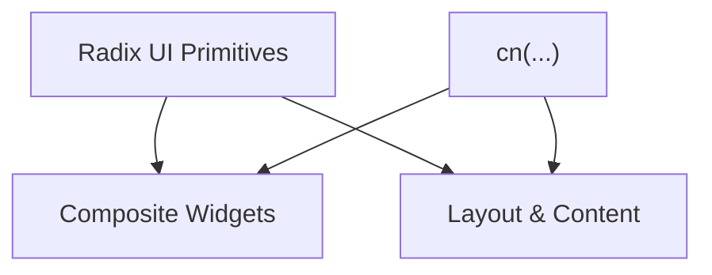

[No sources needed since this diagram shows conceptual workflow, not actual code structure]

## Detailed Component Analysis

### Button
- Props
  - Inherits: Base button element props.
  - variant: "default" | "destructive" | "outline" | "secondary" | "ghost" | "link".
  - size: "default" | "sm" | "lg" | "icon".
  - asChild: boolean (wraps with a slot when true).
  - className: string.
- Defaults
  - variant: "default"
  - size: "default"
- Validation
  - variant and size constrained to union types.
- Behavior
  - Renders a button or a slot wrapper depending on asChild.
  - Applies variant and size classes via a variant factory.
  - Adds focus-visible ring and aria-invalid support.
- User Interactions
  - Standard button click; hover/active states apply transitions and shadows.
- Callbacks
  - onClick and other button events passthrough.
- Composition
  - Can wrap icons; supports SVG sizing via selectors.
- Customization
  - className merges with computed variants; variant props control appearance.
- Accessibility
  - Focus-visible ring; outline-none focus-visible; aria-invalid integration.
- Refs
  - No ref export; uses forwardRef internally via slot wrapper.

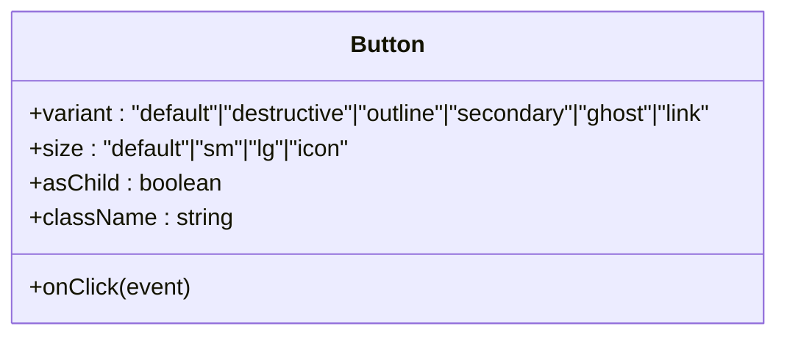

**Diagram sources**
- [button.tsx](file://Design/src/app/components/ui/button.tsx#L37-L56)

**Section sources**
- [button.tsx](file://Design/src/app/components/ui/button.tsx#L1-L58)

### Input
- Props
  - Inherits: Base input element props.
  - className: string.
- Defaults
  - None.
- Validation
  - Inherits browser validation via input type.
- Behavior
  - Focus-visible ring and invalid state styling.
- User Interactions
  - onChange, onBlur, onFocus passthrough.
- Callbacks
  - Event handlers passthrough.
- Composition
  - Intended to be wrapped by Form components for validation.
- Customization
  - className override supported.
- Accessibility
  - Focus-visible ring; aria-invalid integration.
- Refs
  - No ref export.

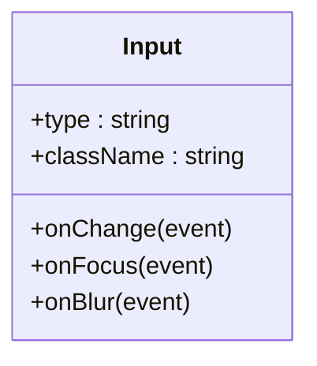

**Diagram sources**
- [input.tsx](file://Design/src/app/components/ui/input.tsx#L5-L19)

**Section sources**
- [input.tsx](file://Design/src/app/components/ui/input.tsx#L1-L22)

### Dialog
- Subcomponents and Props
  - Dialog: Root props.
  - DialogTrigger: Trigger props.
  - DialogPortal: Portal props.
  - DialogClose: Close props.
  - DialogOverlay: className optional.
  - DialogContent: className optional; renders children and a close button.
  - DialogHeader: className optional.
  - DialogFooter: className optional.
  - DialogTitle: className optional.
  - DialogDescription: className optional.
- Defaults
  - None.
- Behavior
  - Overlay fades in/out; content zooms and fades; close button with screen reader text.
- User Interactions
  - Controlled by Radix UI; open/close via triggers.
- Callbacks
  - Passthrough to Radix UI primitives.
- Composition
  - Typical pattern: Dialog > DialogTrigger > DialogPortal > DialogOverlay > DialogContent > DialogHeader/DialogFooter > DialogTitle/DialogDescription/DialogClose.
- Customization
  - className per subcomponent; animations applied conditionally.
- Accessibility
  - Proper ARIA roles and focus trapping via Radix UI.
- Refs
  - No ref export.

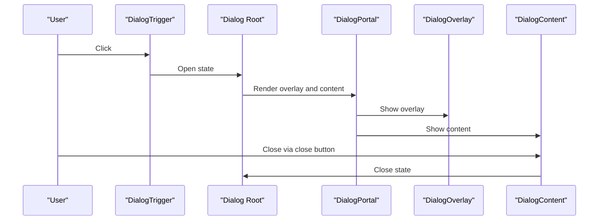

**Diagram sources**
- [dialog.tsx](file://Design/src/app/components/ui/dialog.tsx#L9-L73)

**Section sources**
- [dialog.tsx](file://Design/src/app/components/ui/dialog.tsx#L1-L136)

### Card
- Subcomponents and Props
  - Card: className optional.
  - CardHeader: className optional.
  - CardTitle: className optional.
  - CardDescription: className optional.
  - CardAction: className optional.
  - CardContent: className optional.
  - CardFooter: className optional.
- Defaults
  - None.
- Behavior
  - Structured layout with optional action column.
- User Interactions
  - None.
- Callbacks
  - None.
- Composition
  - Typical pattern: Card > CardHeader > CardTitle/CardDescription/CardAction > CardContent > CardFooter.
- Customization
  - className per subcomponent.
- Accessibility
  - Structural semantics via divs and headings.
- Refs
  - No ref export.

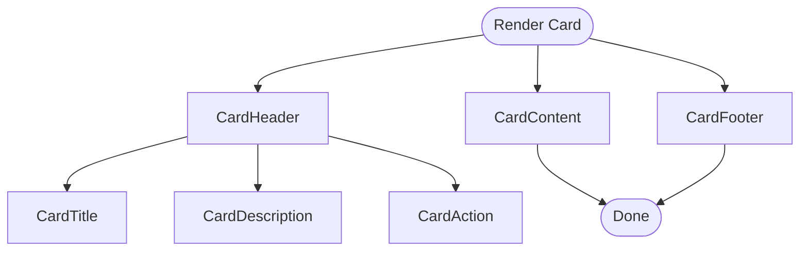

**Diagram sources**
- [card.tsx](file://Design/src/app/components/ui/card.tsx#L5-L82)

**Section sources**
- [card.tsx](file://Design/src/app/components/ui/card.tsx#L1-L93)

### Form
- Subcomponents and Props
  - Form: Alias of FormProvider.
  - FormField: Accepts ControllerProps<TFieldValues, TName>.
  - FormItem: className optional; manages unique id.
  - FormLabel: className optional; links to control; marks error state.
  - FormControl: className optional; sets aria-describedby and aria-invalid.
  - FormDescription: className optional.
  - FormMessage: className optional; displays error message or children.
  - Hook: useFormField returns id, name, formItemId, formDescriptionId, formMessageId, and field state.
- Defaults
  - None.
- Behavior
  - Provides context for field identification and error display.
- User Interactions
  - None (managed by react-hook-form).
- Callbacks
  - None.
- Composition
  - Typical pattern: Form > FormField > FormItem > FormLabel/FormControl/FormDescription > FormMessage.
- Customization
  - className per subcomponent; error-aware label styling.
- Accessibility
  - ARIA-describedby and aria-invalid set automatically; labels linked to controls.
- Refs
  - No ref export.

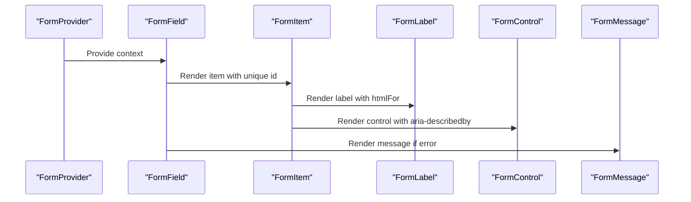

**Diagram sources**
- [form.tsx](file://Design/src/app/components/ui/form.tsx#L19-L157)

**Section sources**
- [form.tsx](file://Design/src/app/components/ui/form.tsx#L1-L169)

### Select
- Subcomponents and Props
  - Select: Root props.
  - SelectGroup: Group props.
  - SelectValue: Value props.
  - SelectTrigger: className optional; size "sm" | "default".
  - SelectContent: className optional; position "popper" | "item-aligned".
  - SelectLabel: className optional.
  - SelectItem: className optional; renders item with indicator.
  - SelectSeparator: className optional.
  - SelectScrollUpButton: className optional.
  - SelectScrollDownButton: className optional.
- Defaults
  - size default, position default.
- Behavior
  - Popover-like content with viewport and scroll buttons.
- User Interactions
  - Controlled by Radix UI; supports keyboard navigation.
- Callbacks
  - Passthrough to Radix UI.
- Composition
  - Typical pattern: Select > SelectTrigger > SelectContent > SelectViewport > SelectItem(s) > SelectLabel/SelectSeparator.
- Customization
  - className per subcomponent; size and position options.
- Accessibility
  - ARIA attributes and keyboard navigation via Radix UI.
- Refs
  - No ref export.

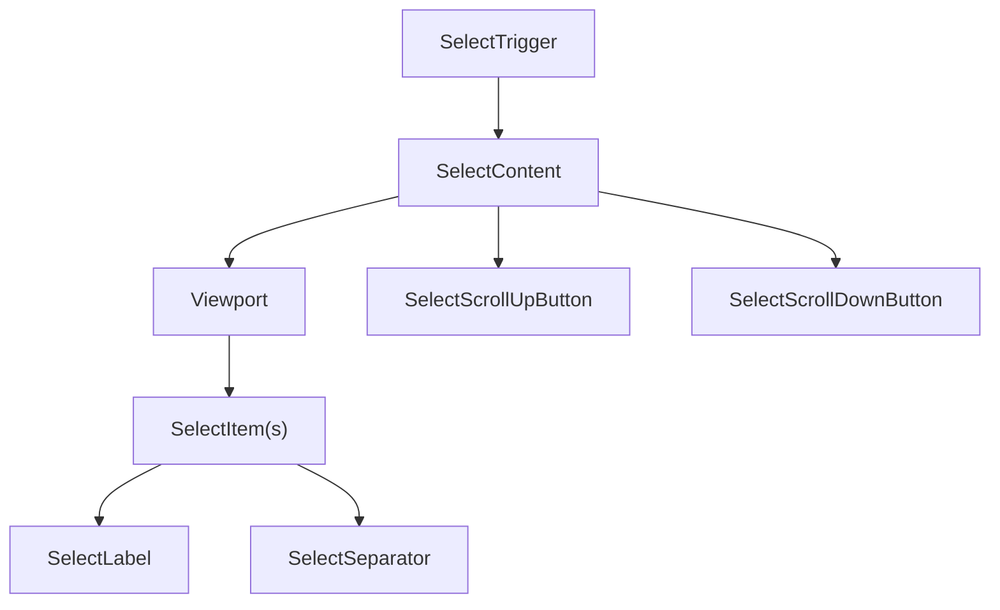

**Diagram sources**
- [select.tsx](file://Design/src/app/components/ui/select.tsx#L13-L89)

**Section sources**
- [select.tsx](file://Design/src/app/components/ui/select.tsx#L1-L190)

### Tabs
- Subcomponents and Props
  - Tabs: className optional.
  - TabsList: className optional.
  - TabsTrigger: className optional.
  - TabsContent: className optional.
- Defaults
  - None.
- Behavior
  - Active state managed by Radix UI; triggers update content.
- User Interactions
  - Controlled by Radix UI; supports keyboard navigation.
- Callbacks
  - Passthrough to Radix UI.
- Composition
  - Typical pattern: Tabs > TabsList > TabsTrigger(s) > TabsContent(s).
- Customization
  - className per subcomponent.
- Accessibility
  - Active state and keyboard navigation via Radix UI.
- Refs
  - No ref export.

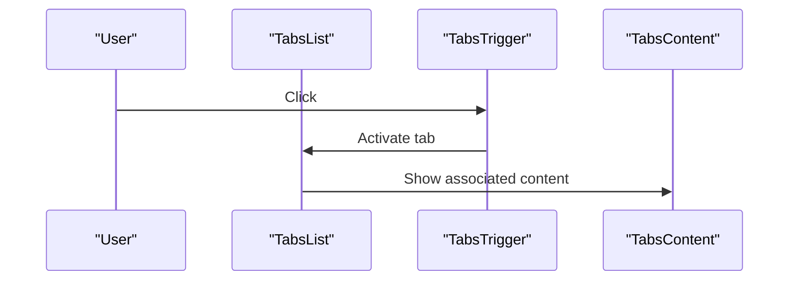

**Diagram sources**
- [tabs.tsx](file://Design/src/app/components/ui/tabs.tsx#L8-L64)

**Section sources**
- [tabs.tsx](file://Design/src/app/components/ui/tabs.tsx#L1-L67)

### Table
- Subcomponents and Props
  - Table: className optional.
  - TableHeader: className optional.
  - TableBody: className optional.
  - TableFooter: className optional.
  - TableRow: className optional.
  - TableHead: className optional.
  - TableCell: className optional.
  - TableCaption: className optional.
- Defaults
  - None.
- Behavior
  - Scrollable container; hover and selected states.
- User Interactions
  - None.
- Callbacks
  - None.
- Composition
  - Typical pattern: Table > TableHeader/TableBody/TableFooter > TableRow > TableHead/TableCell.
- Customization
  - className per subcomponent.
- Accessibility
  - Semantic table structure.
- Refs
  - No ref export.

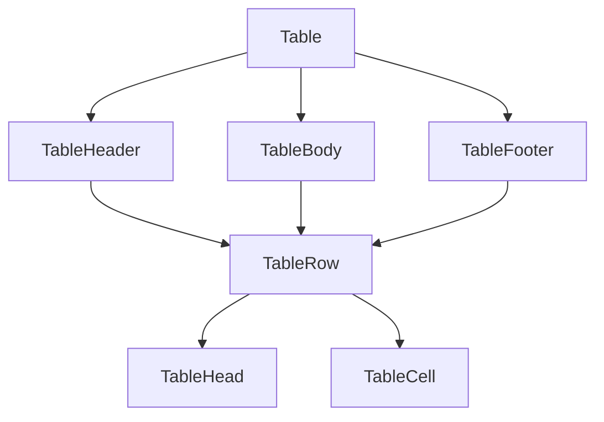

**Diagram sources**
- [table.tsx](file://Design/src/app/components/ui/table.tsx#L7-L105)

**Section sources**
- [table.tsx](file://Design/src/app/components/ui/table.tsx#L1-L117)

### Alert
- Subcomponents and Props
  - Alert: className optional; variant "default" | "destructive".
  - AlertTitle: className optional.
  - AlertDescription: className optional.
- Defaults
  - variant default.
- Behavior
  - Role="alert"; variant styling.
- User Interactions
  - None.
- Callbacks
  - None.
- Composition
  - Typical pattern: Alert > AlertTitle > AlertDescription.
- Customization
  - variant and className.
- Accessibility
  - role="alert".
- Refs
  - No ref export.

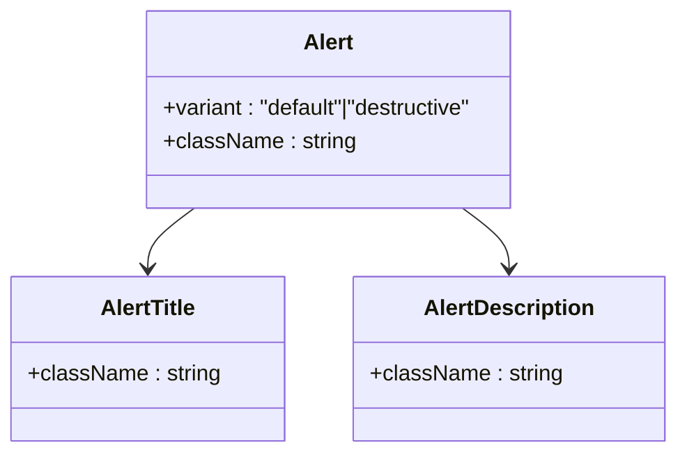

**Diagram sources**
- [alert.tsx](file://Design/src/app/components/ui/alert.tsx#L22-L64)

**Section sources**
- [alert.tsx](file://Design/src/app/components/ui/alert.tsx#L1-L67)

### Badge
- Props
  - Inherits: Base span props.
  - variant: "default" | "secondary" | "destructive" | "outline".
  - asChild: boolean.
  - className: string.
- Defaults
  - variant default, asChild false.
- Behavior
  - Renders a span or slot wrapper; variant classes applied.
- User Interactions
  - None.
- Callbacks
  - None.
- Composition
  - asChild allows semantic nesting.
- Customization
  - variant and className; asChild for semantics.
- Accessibility
  - Focus-visible ring, aria-invalid support via parent context.
- Refs
  - No ref export.

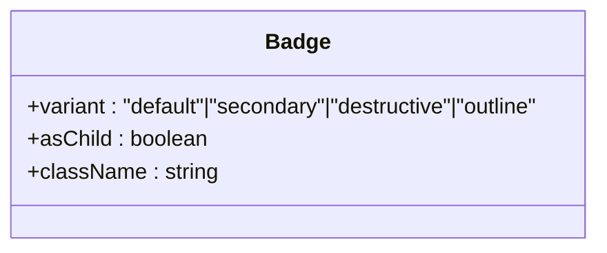

**Diagram sources**
- [badge.tsx](file://Design/src/app/components/ui/badge.tsx#L28-L44)

**Section sources**
- [badge.tsx](file://Design/src/app/components/ui/badge.tsx#L1-L47)

### Switch
- Subcomponents and Props
  - Switch: Inherits Radix UI Switch props.
- Defaults
  - None.
- Behavior
  - Checked/unchecked states; focus-visible ring.
- User Interactions
  - Controlled by Radix UI; supports keyboard activation.
- Callbacks
  - Passthrough to Radix UI.
- Composition
  - Typical pattern: Switch > SwitchThumb.
- Customization
  - className.
- Accessibility
  - data-state attributes; focus-visible ring.
- Refs
  - No ref export.

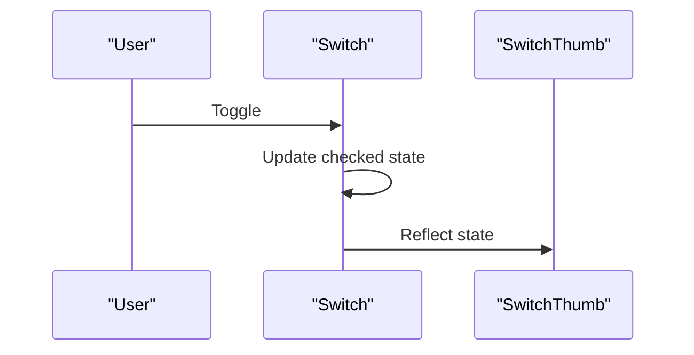

**Diagram sources**
- [switch.tsx](file://Design/src/app/components/ui/switch.tsx#L8-L29)

**Section sources**
- [switch.tsx](file://Design/src/app/components/ui/switch.tsx#L1-L32)

### Slider
- Props
  - Inherits: Base Slider root props.
  - defaultValue: number | number[].
  - value: number | number[].
  - min: number (default 0).
  - max: number (default 100).
  - className: string.
- Defaults
  - min 0, max 100; single thumb when no arrays provided.
- Behavior
  - Computes internal values memoized; renders track, range, and thumbs.
- User Interactions
  - Controlled by Radix UI; supports keyboard and mouse.
- Callbacks
  - Passthrough to Radix UI.
- Composition
  - Single or multi-thumb depending on value/defaultValue arrays.
- Customization
  - className.
- Accessibility
  - Thumb positioning and keyboard navigation via Radix UI.
- Refs
  - No ref export.

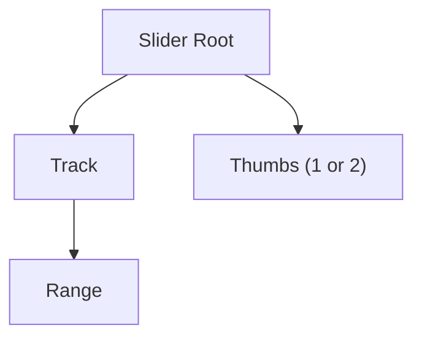

**Diagram sources**
- [slider.tsx](file://Design/src/app/components/ui/slider.tsx#L8-L61)

**Section sources**
- [slider.tsx](file://Design/src/app/components/ui/slider.tsx#L1-L64)

### Tooltip
- Subcomponents and Props
  - TooltipProvider: delayDuration number.
  - Tooltip: Root props.
  - TooltipTrigger: Trigger props.
  - TooltipContent: className optional; sideOffset number.
- Defaults
  - delayDuration 0, sideOffset 0.
- Behavior
  - Provider configures delay; content animates in/out with arrow.
- User Interactions
  - Controlled by Radix UI; supports keyboard activation.
- Callbacks
  - Passthrough to Radix UI.
- Composition
  - Typical pattern: TooltipProvider > Tooltip > TooltipTrigger > TooltipContent > TooltipArrow.
- Customization
  - className per subcomponent; sideOffset and delayDuration.
- Accessibility
  - Portal rendering and arrow via Radix UI.
- Refs
  - No ref export.

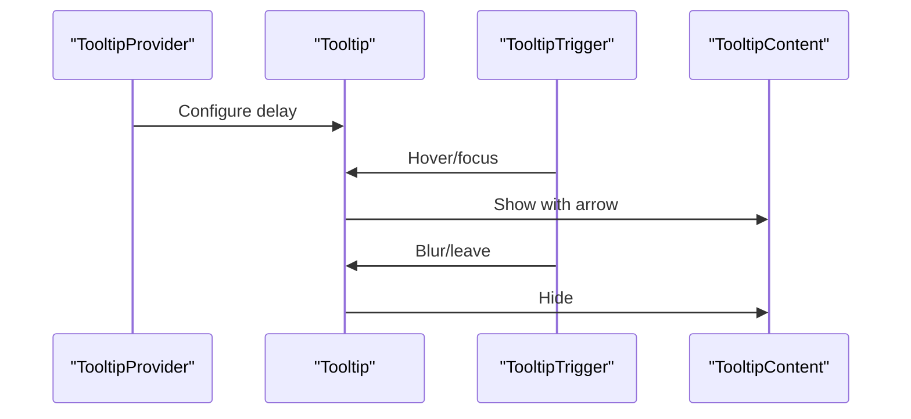

**Diagram sources**
- [tooltip.tsx](file://Design/src/app/components/ui/tooltip.tsx#L8-L59)

**Section sources**
- [tooltip.tsx](file://Design/src/app/components/ui/tooltip.tsx#L1-L62)

### Avatar
- Subcomponents and Props
  - Avatar: className optional.
  - AvatarImage: className optional.
  - AvatarFallback: className optional.
- Defaults
  - None.
- Behavior
  - Image with fallback; structural semantics.
- User Interactions
  - None.
- Callbacks
  - None.
- Composition
  - Typical pattern: Avatar > AvatarImage > AvatarFallback.
- Customization
  - className per subcomponent.
- Accessibility
  - Structural semantics via divs and img.
- Refs
  - No ref export.

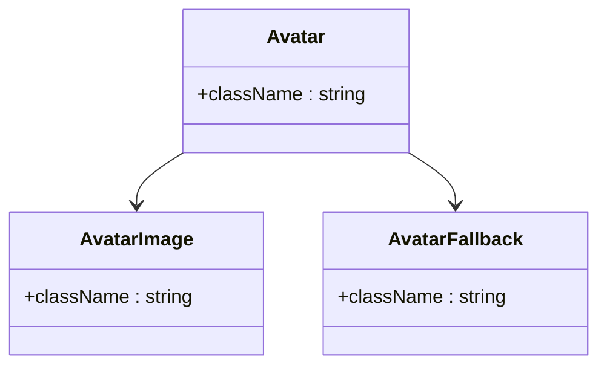

**Diagram sources**
- [avatar.tsx](file://Design/src/app/components/ui/avatar.tsx#L8-L51)

**Section sources**
- [avatar.tsx](file://Design/src/app/components/ui/avatar.tsx#L1-L54)

## Dependency Analysis
All components depend on a shared utility for merging Tailwind classes and compose Radix UI primitives. Composite components also rely on react-hook-form for forms.

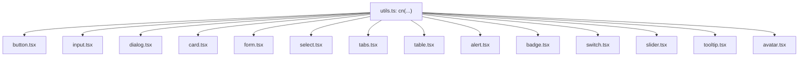

**Diagram sources**
- [utils.ts](file://Design/src/app/components/ui/utils.ts#L1-L7)
- [button.tsx](file://Design/src/app/components/ui/button.tsx#L1-L58)
- [input.tsx](file://Design/src/app/components/ui/input.tsx#L1-L22)
- [dialog.tsx](file://Design/src/app/components/ui/dialog.tsx#L1-L136)
- [card.tsx](file://Design/src/app/components/ui/card.tsx#L1-L93)
- [form.tsx](file://Design/src/app/components/ui/form.tsx#L1-L169)
- [select.tsx](file://Design/src/app/components/ui/select.tsx#L1-L190)
- [tabs.tsx](file://Design/src/app/components/ui/tabs.tsx#L1-L67)
- [table.tsx](file://Design/src/app/components/ui/table.tsx#L1-L117)
- [alert.tsx](file://Design/src/app/components/ui/alert.tsx#L1-L67)
- [badge.tsx](file://Design/src/app/components/ui/badge.tsx#L1-L47)
- [switch.tsx](file://Design/src/app/components/ui/switch.tsx#L1-L32)
- [slider.tsx](file://Design/src/app/components/ui/slider.tsx#L1-L64)
- [tooltip.tsx](file://Design/src/app/components/ui/tooltip.tsx#L1-L62)
- [avatar.tsx](file://Design/src/app/components/ui/avatar.tsx#L1-L54)

**Section sources**
- [utils.ts](file://Design/src/app/components/ui/utils.ts#L1-L7)

## Performance Considerations
- Prefer className overrides over deep nesting to minimize DOM nodes.
- Use memoization for complex computations inside components (already handled in Slider).
- Avoid unnecessary re-renders by passing stable refs and avoiding inline prop objects.
- Keep animation durations reasonable to prevent layout thrashing.
- Use portals judiciously (Dialog, Select, Tooltip) to avoid stacking context issues.

[No sources needed since this section provides general guidance]

## Troubleshooting Guide
- Dialog does not close
  - Ensure a DialogClose child exists inside DialogContent or a trigger is bound to the Dialog root.
- Form validation not reflected
  - Wrap fields with FormField and ensure useFormField is called within FormItem.
- Select items not visible
  - Confirm SelectContent is rendered inside a DialogPortal or page portal; check position and viewport sizing.
- Tooltip not appearing
  - Verify TooltipProvider delayDuration and TooltipContent sideOffset are configured; ensure TooltipTrigger is present.
- Slider value not updating
  - Pass value or defaultValue consistently; ensure min/max bounds are appropriate.
- Accessibility issues
  - Ensure labels are associated with inputs via FormLabel; use aria-invalid where applicable.

**Section sources**
- [dialog.tsx](file://Design/src/app/components/ui/dialog.tsx#L54-L70)
- [form.tsx](file://Design/src/app/components/ui/form.tsx#L90-L124)
- [select.tsx](file://Design/src/app/components/ui/select.tsx#L63-L89)
- [tooltip.tsx](file://Design/src/app/components/ui/tooltip.tsx#L44-L58)
- [slider.tsx](file://Design/src/app/components/ui/slider.tsx#L16-L24)

## Conclusion
The UI component library offers a cohesive, accessible, and customizable set of building blocks for the Post-Quantum Cryptography Platform. By leveraging Radix UI primitives, a shared utility for styling, and clear composition patterns, developers can assemble robust interfaces while maintaining consistent behavior and accessibility.

[No sources needed since this section summarizes without analyzing specific files]

## Appendices

### Usage Examples (by reference)
- Button
  - Instantiate: [button.tsx](file://Design/src/app/components/ui/button.tsx#L37-L56)
  - Props: variant, size, asChild, className
- Input
  - Instantiate: [input.tsx](file://Design/src/app/components/ui/input.tsx#L5-L19)
  - Props: type, className
- Dialog
  - Instantiate: [dialog.tsx](file://Design/src/app/components/ui/dialog.tsx#L9-L73)
  - Props: subcomponents expose className and primitive props
- Card
  - Instantiate: [card.tsx](file://Design/src/app/components/ui/card.tsx#L5-L82)
  - Props: className for each subcomponent
- Form
  - Instantiate: [form.tsx](file://Design/src/app/components/ui/form.tsx#L19-L157)
  - Props: FormField ControllerProps, FormItem className, FormLabel className, FormControl className, FormDescription className, FormMessage className
- Select
  - Instantiate: [select.tsx](file://Design/src/app/components/ui/select.tsx#L13-L89)
  - Props: SelectTrigger size, SelectContent position, className for subcomponents
- Tabs
  - Instantiate: [tabs.tsx](file://Design/src/app/components/ui/tabs.tsx#L8-L64)
  - Props: className for each subcomponent
- Table
  - Instantiate: [table.tsx](file://Design/src/app/components/ui/table.tsx#L7-L105)
  - Props: className for each subcomponent
- Alert
  - Instantiate: [alert.tsx](file://Design/src/app/components/ui/alert.tsx#L22-L64)
  - Props: variant, className for subcomponents
- Badge
  - Instantiate: [badge.tsx](file://Design/src/app/components/ui/badge.tsx#L28-L44)
  - Props: variant, asChild, className
- Switch
  - Instantiate: [switch.tsx](file://Design/src/app/components/ui/switch.tsx#L8-L29)
  - Props: className
- Slider
  - Instantiate: [slider.tsx](file://Design/src/app/components/ui/slider.tsx#L8-L61)
  - Props: defaultValue, value, min, max, className
- Tooltip
  - Instantiate: [tooltip.tsx](file://Design/src/app/components/ui/tooltip.tsx#L8-L59)
  - Props: TooltipProvider delayDuration, TooltipContent sideOffset, className for subcomponents
- Avatar
  - Instantiate: [avatar.tsx](file://Design/src/app/components/ui/avatar.tsx#L8-L51)
  - Props: className for subcomponents

**Section sources**
- [button.tsx](file://Design/src/app/components/ui/button.tsx#L37-L56)
- [input.tsx](file://Design/src/app/components/ui/input.tsx#L5-L19)
- [dialog.tsx](file://Design/src/app/components/ui/dialog.tsx#L9-L73)
- [card.tsx](file://Design/src/app/components/ui/card.tsx#L5-L82)
- [form.tsx](file://Design/src/app/components/ui/form.tsx#L19-L157)
- [select.tsx](file://Design/src/app/components/ui/select.tsx#L13-L89)
- [tabs.tsx](file://Design/src/app/components/ui/tabs.tsx#L8-L64)
- [table.tsx](file://Design/src/app/components/ui/table.tsx#L7-L105)
- [alert.tsx](file://Design/src/app/components/ui/alert.tsx#L22-L64)
- [badge.tsx](file://Design/src/app/components/ui/badge.tsx#L28-L44)
- [switch.tsx](file://Design/src/app/components/ui/switch.tsx#L8-L29)
- [slider.tsx](file://Design/src/app/components/ui/slider.tsx#L8-L61)
- [tooltip.tsx](file://Design/src/app/components/ui/tooltip.tsx#L8-L59)
- [avatar.tsx](file://Design/src/app/components/ui/avatar.tsx#L8-L51)