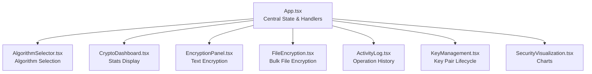
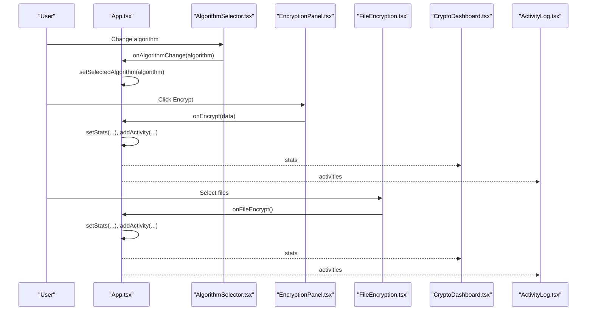
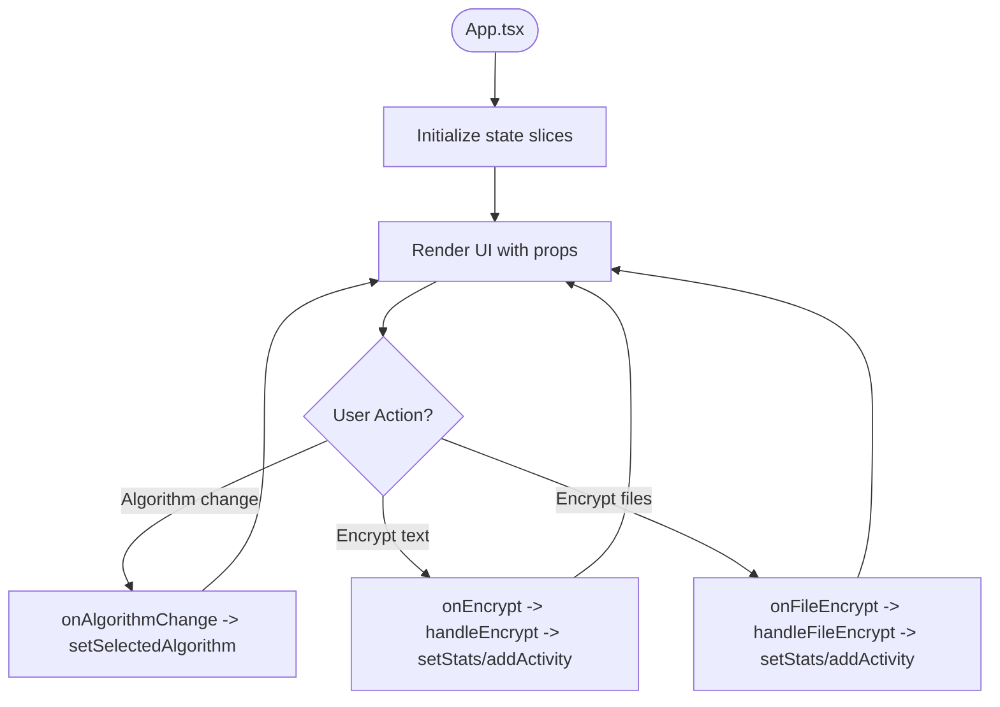
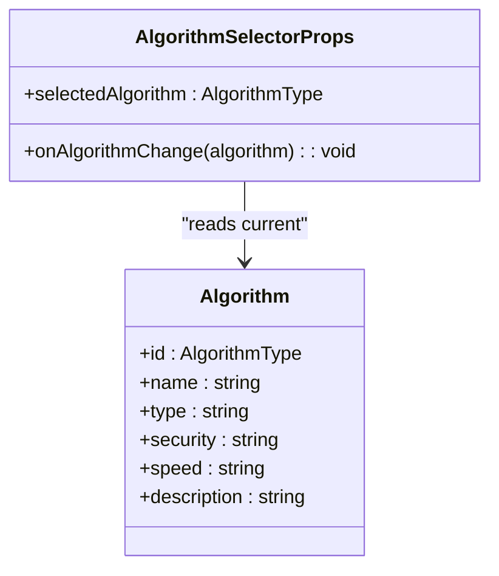
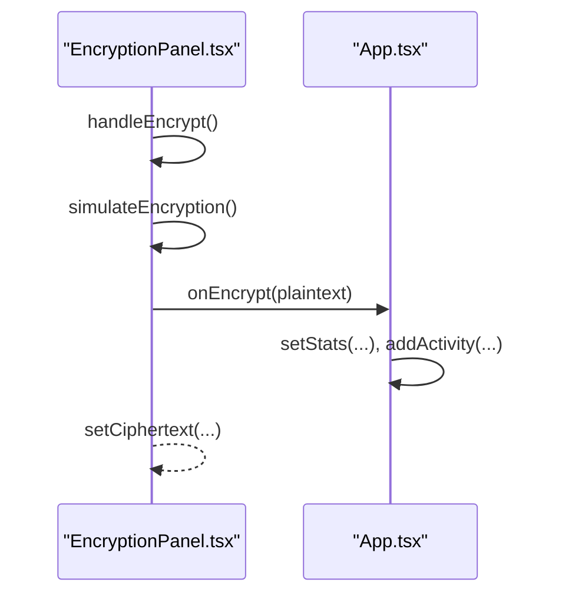
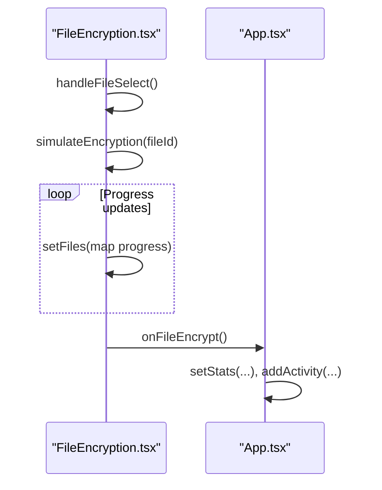
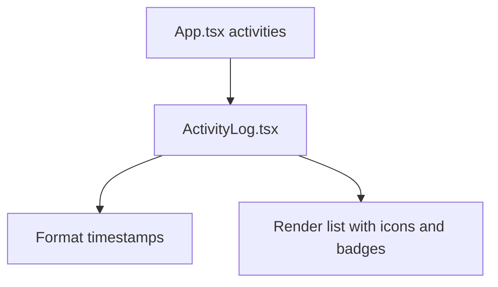
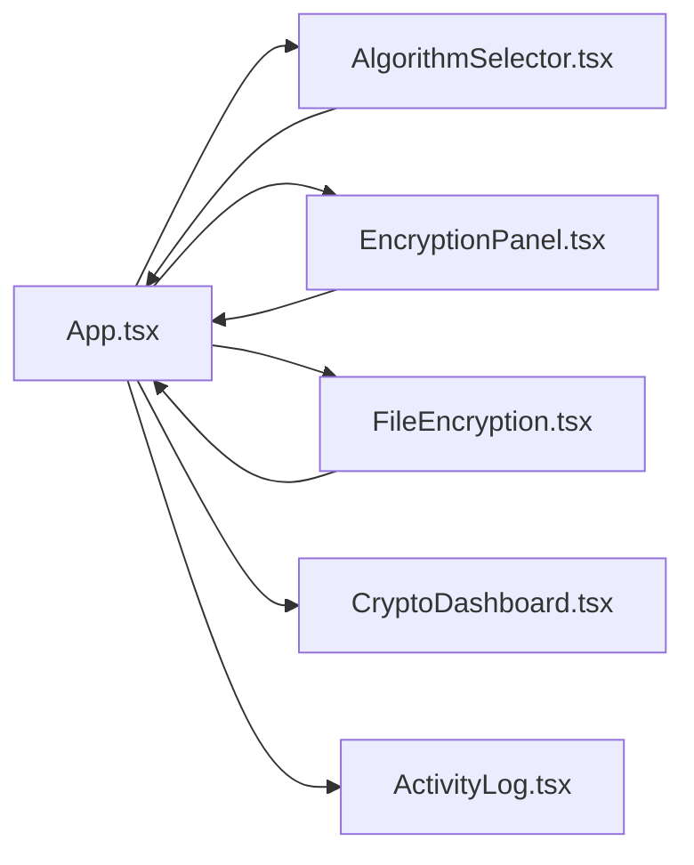

# State Management APIs

<cite>
**Referenced Files in This Document**
- [App.tsx](file://src/app/App.tsx)
- [algorithm-selector.tsx](file://src/app/components/algorithm-selector.tsx)
- [crypto-dashboard.tsx](file://src/app/components/crypto-dashboard.tsx)
- [encryption-panel.tsx](file://src/app/components/encryption-panel.tsx)
- [file-encryption.tsx](file://src/app/components/file-encryption.tsx)
- [activity-log.tsx](file://src/app/components/activity-log.tsx)
- [key-management.tsx](file://src/app/components/key-management.tsx)
- [security-visualization.tsx](file://src/app/components/security-visualization.tsx)
- [main.tsx](file://src/main.tsx)
</cite>

## Table of Contents
1. [Introduction](#introduction)
2. [Project Structure](#project-structure)
3. [Core Components](#core-components)
4. [Architecture Overview](#architecture-overview)
5. [Detailed Component Analysis](#detailed-component-analysis)
6. [Dependency Analysis](#dependency-analysis)
7. [Performance Considerations](#performance-considerations)
8. [Troubleshooting Guide](#troubleshooting-guide)
9. [Conclusion](#conclusion)

## Introduction
This document describes the centralized state management model used by the Post-Quantum Cryptography Platform. The platform is a React application that orchestrates cryptographic operations across multiple functional areas. State is managed centrally in the root application component and coordinated through a single algorithm selector that influences the behavior of multiple panels and utilities.

The state model is intentionally minimalistic and built on React’s native hooks to keep the system approachable while enabling clear data flow and predictable updates. The AlgorithmSelector plays a central role in coordinating algorithm selection and ensuring consistent state propagation across components.

## Project Structure
The state management spans the root application and several feature components. The root component holds global state and passes it down to child components. Algorithm selection is coordinated via a shared prop interface, and derived statistics and activity logs are computed from the central state.

**Diagram sources**
- [App.tsx](file://src/app/App.tsx#L26-L91)
- [algorithm-selector.tsx](file://src/app/components/algorithm-selector.tsx#L68-L71)
- [crypto-dashboard.tsx](file://src/app/components/crypto-dashboard.tsx#L4-L11)
- [encryption-panel.tsx](file://src/app/components/encryption-panel.tsx#L10-L13)
- [file-encryption.tsx](file://src/app/components/file-encryption.tsx#L19-L22)
- [activity-log.tsx](file://src/app/components/activity-log.tsx#L15-L17)
- [key-management.tsx](file://src/app/components/key-management.tsx#L18-L20)
- [security-visualization.tsx](file://src/app/components/security-visualization.tsx#L24-L26)

**Section sources**
- [App.tsx](file://src/app/App.tsx#L1-L362)
- [main.tsx](file://src/main.tsx#L1-L7)

## Core Components
This section documents the central state structure, update functions, and subscription patterns used across the platform.

- Central state shape
  - selectedAlgorithm: AlgorithmType
  - activities: Activity[]
  - stats: {
      totalEncryptions: number
      activeKeys: number
      dataEncapsulated: string
      securityLevel: number
    }

- State update functions
  - setSelectedAlgorithm: Updates the globally selected algorithm
  - setActivities: Adds new activity entries and maintains a capped history
  - setStats: Updates dashboard metrics (encryptions, data volume, security level)

- Subscription patterns
  - AlgorithmSelector subscribes to selectedAlgorithm and onAlgorithmChange
  - EncryptionPanel subscribes to algorithm and onEncrypt
  - FileEncryption subscribes to algorithm and onFileEncrypt
  - ActivityLog subscribes to activities
  - CryptoDashboard subscribes to stats
  - KeyManagement subscribes to algorithm

- AlgorithmType and Algorithm metadata
  - AlgorithmType is a union of supported post-quantum algorithms
  - AlgorithmSelector exposes metadata (type, security, speed) for the currently selected algorithm

- Derived computations
  - Activity timestamps are formatted for display
  - Data volume is accumulated as strings with MB units
  - Security level is maintained as a percentage

**Section sources**
- [App.tsx](file://src/app/App.tsx#L26-L91)
- [algorithm-selector.tsx](file://src/app/components/algorithm-selector.tsx#L6-L66)
- [crypto-dashboard.tsx](file://src/app/components/crypto-dashboard.tsx#L4-L11)
- [activity-log.tsx](file://src/app/components/activity-log.tsx#L15-L38)

## Architecture Overview
The state architecture follows a unidirectional data flow:
- App holds the central state and exposes handlers to mutate it
- AlgorithmSelector reads the selected algorithm and invokes a change handler
- Panels and utilities read the current algorithm and trigger state updates via callbacks
- Derived views (dashboard, activity log) subscribe to state slices and render accordingly

**Diagram sources**
- [App.tsx](file://src/app/App.tsx#L26-L91)
- [algorithm-selector.tsx](file://src/app/components/algorithm-selector.tsx#L68-L71)
- [encryption-panel.tsx](file://src/app/components/encryption-panel.tsx#L10-L13)
- [file-encryption.tsx](file://src/app/components/file-encryption.tsx#L19-L22)
- [crypto-dashboard.tsx](file://src/app/components/crypto-dashboard.tsx#L4-L11)
- [activity-log.tsx](file://src/app/components/activity-log.tsx#L15-L17)

## Detailed Component Analysis

### Central App State and Handlers
- Responsibilities
  - Maintains selectedAlgorithm, activities, and stats
  - Provides mutation handlers for state updates
  - Initializes a small activity history
- Key mutation handlers
  - setSelectedAlgorithm: Updates the algorithm globally
  - addActivity: Creates a new activity entry and caps the list to a fixed size
  - handleEncrypt: Increments counters and appends an encryption activity
  - handleFileEncrypt: Increments counters and appends a file encryption activity

**Diagram sources**
- [App.tsx](file://src/app/App.tsx#L26-L91)

**Section sources**
- [App.tsx](file://src/app/App.tsx#L26-L91)

### AlgorithmSelector
- Role
  - Displays algorithm metadata for the currently selected algorithm
  - Propagates algorithm changes to the parent via onAlgorithmChange
- Data model
  - AlgorithmType union defines supported algorithms
  - Algorithm interface defines metadata for each algorithm

**Diagram sources**
- [algorithm-selector.tsx](file://src/app/components/algorithm-selector.tsx#L6-L71)
- [algorithm-selector.tsx](file://src/app/components/algorithm-selector.tsx#L17-L66)

**Section sources**
- [algorithm-selector.tsx](file://src/app/components/algorithm-selector.tsx#L6-L71)
- [algorithm-selector.tsx](file://src/app/components/algorithm-selector.tsx#L17-L66)

### EncryptionPanel
- Role
  - Accepts plaintext, simulates encryption/decryption, and surfaces results
  - Invokes onEncrypt callback to update central state
- State and behavior
  - Manages local UI state for plaintext, ciphertext, and loading flags
  - Uses algorithm prop to annotate operations

**Diagram sources**
- [encryption-panel.tsx](file://src/app/components/encryption-panel.tsx#L45-L61)
- [App.tsx](file://src/app/App.tsx#L47-L54)

**Section sources**
- [encryption-panel.tsx](file://src/app/components/encryption-panel.tsx#L10-L13)
- [encryption-panel.tsx](file://src/app/components/encryption-panel.tsx#L45-L61)
- [App.tsx](file://src/app/App.tsx#L47-L54)

### FileEncryption
- Role
  - Manages a list of files to encrypt, simulates progress, and triggers onFileEncrypt
- State and behavior
  - Tracks per-file status and progress
  - Caps the number of tracked files and clears them after completion

**Diagram sources**
- [file-encryption.tsx](file://src/app/components/file-encryption.tsx#L43-L87)
- [App.tsx](file://src/app/App.tsx#L56-L63)

**Section sources**
- [file-encryption.tsx](file://src/app/components/file-encryption.tsx#L19-L22)
- [file-encryption.tsx](file://src/app/components/file-encryption.tsx#L43-L87)
- [App.tsx](file://src/app/App.tsx#L56-L63)

### ActivityLog
- Role
  - Renders a capped, formatted history of cryptographic operations
  - Computes relative timestamps for each activity

**Diagram sources**
- [activity-log.tsx](file://src/app/components/activity-log.tsx#L40-L52)
- [App.tsx](file://src/app/App.tsx#L65-L91)

**Section sources**
- [activity-log.tsx](file://src/app/components/activity-log.tsx#L15-L38)
- [activity-log.tsx](file://src/app/components/activity-log.tsx#L40-L52)
- [App.tsx](file://src/app/App.tsx#L65-L91)

### CryptoDashboard
- Role
  - Displays aggregated metrics derived from central stats
- Data model
  - Expects stats with totalEncryptions, activeKeys, dataEncapsulated, securityLevel

**Section sources**
- [crypto-dashboard.tsx](file://src/app/components/crypto-dashboard.tsx#L4-L11)

### KeyManagement
- Role
  - Generates, displays, exports, and deletes key pairs
  - Uses algorithm prop to annotate key pairs
- Notes
  - Local component state manages key pairs and visibility toggles
  - Does not directly mutate central state

**Section sources**
- [key-management.tsx](file://src/app/components/key-management.tsx#L18-L20)
- [key-management.tsx](file://src/app/components/key-management.tsx#L32-L49)

### SecurityVisualization
- Role
  - Renders static charts for security trends and algorithm comparisons
- Notes
  - Consumes static datasets for visualization

**Section sources**
- [security-visualization.tsx](file://src/app/components/security-visualization.tsx#L24-L26)

## Dependency Analysis
The state dependencies are primarily unidirectional:
- App depends on AlgorithmSelector for algorithm updates
- App depends on EncryptionPanel and FileEncryption for state mutations via callbacks
- App feeds derived data to CryptoDashboard and ActivityLog
- KeyManagement operates independently with its own local state

**Diagram sources**
- [App.tsx](file://src/app/App.tsx#L26-L91)
- [algorithm-selector.tsx](file://src/app/components/algorithm-selector.tsx#L68-L71)
- [encryption-panel.tsx](file://src/app/components/encryption-panel.tsx#L10-L13)
- [file-encryption.tsx](file://src/app/components/file-encryption.tsx#L19-L22)
- [crypto-dashboard.tsx](file://src/app/components/crypto-dashboard.tsx#L4-L11)
- [activity-log.tsx](file://src/app/components/activity-log.tsx#L15-L17)

**Section sources**
- [App.tsx](file://src/app/App.tsx#L26-L91)

## Performance Considerations
- State updates are batched per user action; avoid unnecessary renders by keeping state slices minimal
- Activity history is capped to a small fixed size to prevent memory growth
- Simulated operations use timeouts; real implementations should leverage asynchronous workers to avoid blocking the UI thread
- Chart rendering is static; consider virtualization or lazy loading for very large datasets

## Troubleshooting Guide
- Symptom: Algorithm does not update across components
  - Verify that AlgorithmSelector’s onAlgorithmChange is wired to App’s setSelectedAlgorithm
  - Confirm that downstream components read the algorithm prop correctly
- Symptom: Stats do not increment after encryption
  - Ensure EncryptionPanel and FileEncryption invoke their respective onEncrypt/onFileEncrypt callbacks
  - Confirm App’s handlers update stats and append activities
- Symptom: Activity log appears empty
  - Check initial activities initialization and that App sets activities correctly
- Symptom: UI flickers during bulk operations
  - Use controlled components and avoid frequent re-renders by batching updates

**Section sources**
- [App.tsx](file://src/app/App.tsx#L26-L91)
- [algorithm-selector.tsx](file://src/app/components/algorithm-selector.tsx#L68-L71)
- [encryption-panel.tsx](file://src/app/components/encryption-panel.tsx#L45-L61)
- [file-encryption.tsx](file://src/app/components/file-encryption.tsx#L43-L87)
- [activity-log.tsx](file://src/app/components/activity-log.tsx#L40-L52)

## Conclusion
The Post-Quantum Cryptography Platform employs a straightforward, centralized state model built on React hooks. The AlgorithmSelector coordinates algorithm selection, while the App component orchestrates state updates triggered by user actions across encryption panels, file encryption, and key management. Derived views consume the central state to present dashboards and activity logs. The design emphasizes simplicity, predictability, and clear data flow, making it easy to extend with additional state slices or integrate external state libraries if needed.