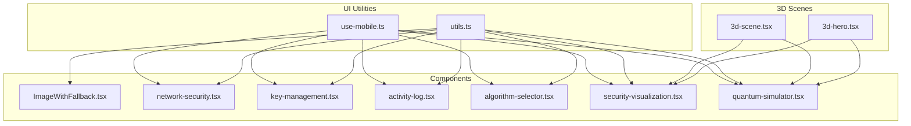
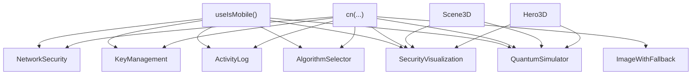
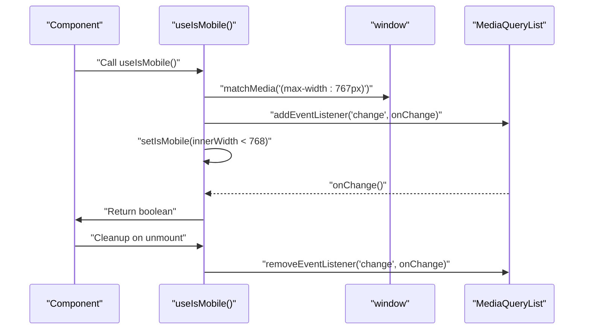
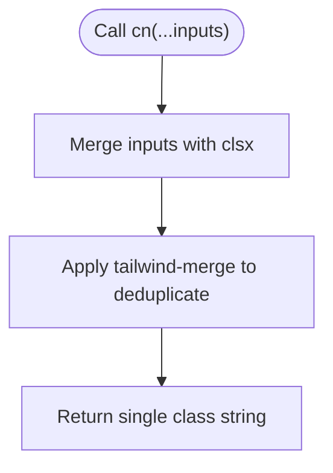
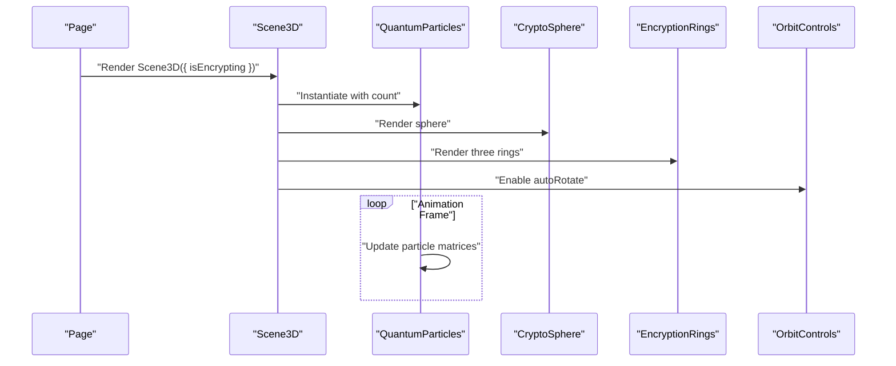
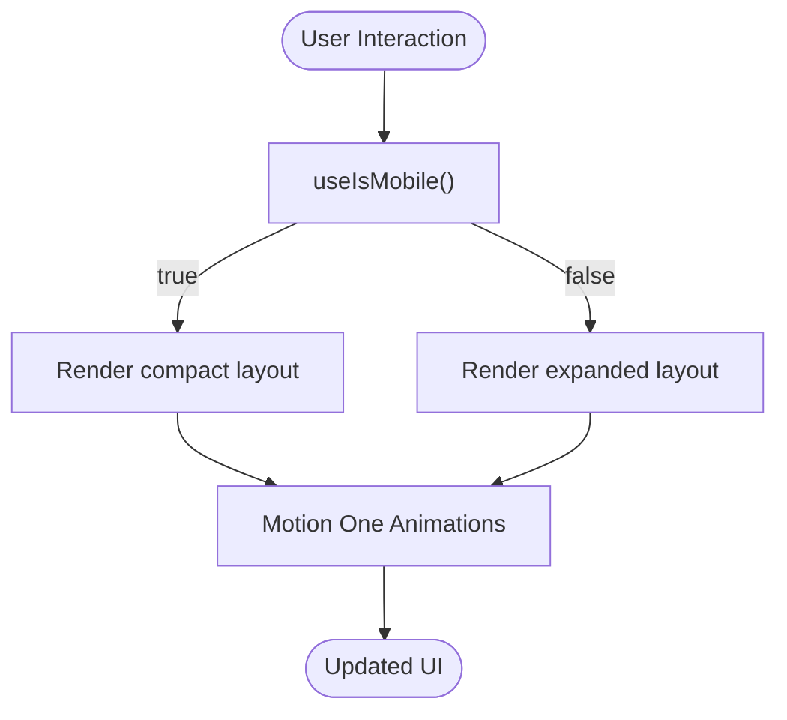
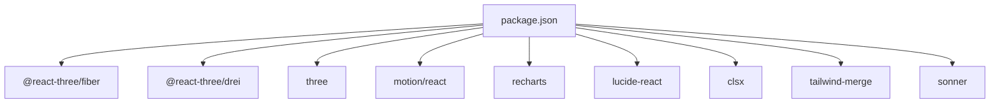

# Utility APIs

<cite>
**Referenced Files in This Document**
- [use-mobile.ts](file://src/app/components/ui/use-mobile.ts)
- [utils.ts](file://src/app/components/ui/utils.ts)
- [3d-scene.tsx](file://src/app/components/3d-scene.tsx)
- [3d-hero.tsx](file://src/app/components/3d-hero.tsx)
- [ImageWithFallback.tsx](file://src/app/components/figma/ImageWithFallback.tsx)
- [network-security.tsx](file://src/app/components/network-security.tsx)
- [key-management.tsx](file://src/app/components/key-management.tsx)
- [activity-log.tsx](file://src/app/components/activity-log.tsx)
- [algorithm-selector.tsx](file://src/app/components/algorithm-selector.tsx)
- [security-visualization.tsx](file://src/app/components/security-visualization.tsx)
- [quantum-simulator.tsx](file://src/app/components/quantum-simulator.tsx)
- [package.json](file://package.json)
</cite>

## Table of Contents
1. [Introduction](#introduction)
2. [Project Structure](#project-structure)
3. [Core Components](#core-components)
4. [Architecture Overview](#architecture-overview)
5. [Detailed Component Analysis](#detailed-component-analysis)
6. [Dependency Analysis](#dependency-analysis)
7. [Performance Considerations](#performance-considerations)
8. [Troubleshooting Guide](#troubleshooting-guide)
9. [Conclusion](#conclusion)

## Introduction
This document describes the utility APIs and helper modules used across the Post-Quantum Cryptography Platform. It focuses on:
- Mobile detection hook API and its return values
- Tailwind CSS utility helpers
- Three.js and @react-three integration utilities
- Animation helpers powered by Motion One
- Responsive design utilities
- Data formatting and transformation utilities
- Error handling patterns for image fallbacks
- Validation and composition patterns for cryptographic components
- Performance considerations and memoization strategies

## Project Structure
The platform is a React-based UI showcasing post-quantum cryptography concepts. Utilities are primarily located under src/app/components/ui and src/app/components/figma, with Three.js scenes under src/app/components.

**Diagram sources**
- [use-mobile.ts](file://src/app/components/ui/use-mobile.ts#L1-L22)
- [utils.ts](file://src/app/components/ui/utils.ts#L1-L7)
- [3d-scene.tsx](file://src/app/components/3d-scene.tsx#L1-L151)
- [3d-hero.tsx](file://src/app/components/3d-hero.tsx#L1-L76)
- [ImageWithFallback.tsx](file://src/app/components/figma/ImageWithFallback.tsx#L1-L28)
- [network-security.tsx](file://src/app/components/network-security.tsx#L1-L303)
- [key-management.tsx](file://src/app/components/key-management.tsx#L1-L221)
- [activity-log.tsx](file://src/app/components/activity-log.tsx#L1-L117)
- [algorithm-selector.tsx](file://src/app/components/algorithm-selector.tsx#L1-L121)
- [security-visualization.tsx](file://src/app/components/security-visualization.tsx#L1-L107)
- [quantum-simulator.tsx](file://src/app/components/quantum-simulator.tsx#L1-L316)

**Section sources**
- [use-mobile.ts](file://src/app/components/ui/use-mobile.ts#L1-L22)
- [utils.ts](file://src/app/components/ui/utils.ts#L1-L7)
- [3d-scene.tsx](file://src/app/components/3d-scene.tsx#L1-L151)
- [3d-hero.tsx](file://src/app/components/3d-hero.tsx#L1-L76)
- [ImageWithFallback.tsx](file://src/app/components/figma/ImageWithFallback.tsx#L1-L28)
- [network-security.tsx](file://src/app/components/network-security.tsx#L1-L303)
- [key-management.tsx](file://src/app/components/key-management.tsx#L1-L221)
- [activity-log.tsx](file://src/app/components/activity-log.tsx#L1-L117)
- [algorithm-selector.tsx](file://src/app/components/algorithm-selector.tsx#L1-L121)
- [security-visualization.tsx](file://src/app/components/security-visualization.tsx#L1-L107)
- [quantum-simulator.tsx](file://src/app/components/quantum-simulator.tsx#L1-L316)

## Core Components
This section documents the primary utility APIs and helpers.

- Mobile Detection Hook
  - Hook: useIsMobile()
  - Purpose: Detects whether the viewport width is below a mobile breakpoint.
  - Parameters: None
  - Returns: Boolean indicating mobile state
  - Behavior: Initializes to undefined, sets to boolean based on window.innerWidth and matchMedia listener updates on change.
  - Typical usage: Conditional rendering for responsive layouts.

- Tailwind CSS Utility
  - Function: cn(...)
  - Purpose: Merges and deduplicates Tailwind CSS classes using clsx and tailwind-merge.
  - Parameters: Spread of class inputs compatible with clsx
  - Returns: Single merged class string
  - Typical usage: Compose dynamic class names safely.

- Three.js Scene Helpers
  - Scene3D(props): Renders a 3D scene with quantum-themed visuals using @react-three/fiber and @react-three/drei.
  - Props:
    - isEncrypting?: boolean (default: false)
  - Internals:
    - QuantumParticles(count?): Instanced particle system with per-frame updates.
    - CryptoSphere(isEncrypting): Rotating sphere with material color based on encryption state.
    - EncryptionRings(): Three rotating torus rings with emission materials.
    - OrbitControls: Auto-rotation enabled, zoom/pan disabled.
  - Typical usage: Embed in pages to visualize encryption/quantum themes.

- Hero 3D Scene
  - Hero3D(): Lightweight animated 3D hero with rotating cube and glowing sphere.
  - Internals:
    - RotatingCube(): Wireframe transparent box rotating around axes.
    - GlowingSphere(): Metal surface sphere with transparency and emission.
    - OrbitControls: Auto-rotation enabled, zoom/pan disabled.
  - Typical usage: Landing page hero visualization.

- Image Fallback Helper
  - ImageWithFallback(props): Provides a fallback UI when an image fails to load.
  - Props: Standard img attributes (src, alt, style, className, and rest)
  - Behavior: On error, renders a styled container with an embedded error icon and preserves original URL.
  - Typical usage: Replace standard img tags for robust media rendering.

- Network Security Utilities
  - Data model: NetworkNode interface defines node properties including encryption type and threat level.
  - Functions and effects:
    - startScan(): Triggers scanning state and updates statuses after a delay.
    - upgradeNode(nodeId): Upgrades a node’s encryption to post-quantum.
    - getNodeIcon(type): Maps node type to an icon component.
    - getEncryptionBadge(encryption): Maps encryption type to a badge variant.
    - getStatusIcon(status): Maps status to an icon with optional animation.
  - Typical usage: Render network topology with security status and actions.

- Key Management Utilities
  - Data model: KeyPair interface stores algorithm, public/private keys, and creation time.
  - Functions:
    - generateRandomKey(length): Generates a random base64-like string.
    - generateKeyPair(): Simulates key generation and updates state.
    - deleteKey(id): Removes a key pair.
    - toggleKeyVisibility(id): Toggles visibility of a specific key pair.
    - exportKeys(keyPair): Downloads a JSON file containing key data.
    - truncateKey(key, visible): Shortens long keys for display.
  - Typical usage: Manage cryptographic key pairs with visibility controls and exports.

- Activity Log Utilities
  - Data model: Activity interface captures operation type, algorithm, timestamp, and status.
  - Functions:
    - formatTime(date): Humanizes timestamps relative to current time.
  - Typical usage: Display recent cryptographic operations with status badges.

- Algorithm Selector Utilities
  - Type: AlgorithmType union of supported post-quantum algorithms.
  - Data model: Algorithm interface includes id, name, type, security, speed, and description.
  - Functions:
    - AlgorithmSelector({ selectedAlgorithm, onAlgorithmChange }): Renders a selector with metadata for the current selection.
  - Typical usage: Allow users to pick a PQC algorithm with contextual info.

- Security Visualization Utilities
  - Data: securityData and algorithmComparison arrays for charts.
  - Components:
    - AreaChart: Classical vs Post-Quantum security strength over time.
    - BarChart: Algorithm performance comparison across encryption speed and security.
  - Typical usage: Present comparative analytics of PQC algorithms.

- Quantum Simulator Utilities
  - Data model: QuantumAttack interface tracks attack progress and success.
  - Functions:
    - startSimulation(): Initializes attacks for classical and PQC algorithms.
    - pauseSimulation(): Pauses ongoing simulations.
    - resetSimulation(): Clears state and stops simulation.
  - Behavior: Uses intervals to update progress differently for PQC vs classical algorithms.
  - Typical usage: Demonstrate resilience of PQC algorithms against simulated quantum attacks.

**Section sources**
- [use-mobile.ts](file://src/app/components/ui/use-mobile.ts#L1-L22)
- [utils.ts](file://src/app/components/ui/utils.ts#L1-L7)
- [3d-scene.tsx](file://src/app/components/3d-scene.tsx#L1-L151)
- [3d-hero.tsx](file://src/app/components/3d-hero.tsx#L1-L76)
- [ImageWithFallback.tsx](file://src/app/components/figma/ImageWithFallback.tsx#L1-L28)
- [network-security.tsx](file://src/app/components/network-security.tsx#L1-L303)
- [key-management.tsx](file://src/app/components/key-management.tsx#L1-L221)
- [activity-log.tsx](file://src/app/components/activity-log.tsx#L1-L117)
- [algorithm-selector.tsx](file://src/app/components/algorithm-selector.tsx#L1-L121)
- [security-visualization.tsx](file://src/app/components/security-visualization.tsx#L1-L107)
- [quantum-simulator.tsx](file://src/app/components/quantum-simulator.tsx#L1-L316)

## Architecture Overview
The utility layer integrates with UI components and 3D scenes to deliver a cohesive experience:
- Responsive utilities (useIsMobile) inform layout decisions across components.
- Tailwind helper (cn) ensures clean class composition.
- Three.js scenes provide immersive, animated backgrounds and demonstrations.
- Motion One animations enhance interactivity and feedback.
- Data transformation utilities support charts, logs, and selectors.

**Diagram sources**
- [use-mobile.ts](file://src/app/components/ui/use-mobile.ts#L1-L22)
- [utils.ts](file://src/app/components/ui/utils.ts#L1-L7)
- [3d-scene.tsx](file://src/app/components/3d-scene.tsx#L1-L151)
- [3d-hero.tsx](file://src/app/components/3d-hero.tsx#L1-L76)
- [ImageWithFallback.tsx](file://src/app/components/figma/ImageWithFallback.tsx#L1-L28)
- [network-security.tsx](file://src/app/components/network-security.tsx#L1-L303)
- [key-management.tsx](file://src/app/components/key-management.tsx#L1-L221)
- [activity-log.tsx](file://src/app/components/activity-log.tsx#L1-L117)
- [algorithm-selector.tsx](file://src/app/components/algorithm-selector.tsx#L1-L121)
- [security-visualization.tsx](file://src/app/components/security-visualization.tsx#L1-L107)
- [quantum-simulator.tsx](file://src/app/components/quantum-simulator.tsx#L1-L316)

## Detailed Component Analysis

### Mobile Detection Hook API
- Hook: useIsMobile()
- Parameters: None
- Returns: boolean (coerced truthiness)
- Behavior:
  - Initializes internal state to undefined.
  - Subscribes to a MediaQueryList change event for a fixed breakpoint.
  - Updates state on mount and on media query changes.
  - Cleans up listeners on unmount.
- Usage pattern:
  - Wrap components that require responsive behavior.
  - Conditionally render mobile-specific layouts or compact cards.

**Diagram sources**
- [use-mobile.ts](file://src/app/components/ui/use-mobile.ts#L1-L22)

**Section sources**
- [use-mobile.ts](file://src/app/components/ui/use-mobile.ts#L1-L22)

### Tailwind CSS Utility API
- Function: cn(...inputs: ClassValue[])
- Parameters:
  - Spread of inputs compatible with clsx (strings, objects, arrays).
- Returns: string (merged and deduplicated classes via tailwind-merge)
- Usage pattern:
  - Combine conditional classes and dynamic modifiers safely.
  - Prevent duplicate or conflicting Tailwind utilities.

**Diagram sources**
- [utils.ts](file://src/app/components/ui/utils.ts#L1-L7)

**Section sources**
- [utils.ts](file://src/app/components/ui/utils.ts#L1-L7)

### Three.js Integration Helpers
- Scene3D(props)
  - Props:
    - isEncrypting?: boolean (default: false)
  - Internals:
    - QuantumParticles(count?): Creates instanced particles with per-frame matrix updates.
    - CryptoSphere(isEncrypting): Rotates a sphere with material color based on encryption state.
    - EncryptionRings(): Three rotating torus rings with emission materials.
    - OrbitControls: Auto-rotation enabled, pan/zoom disabled.
  - Typical usage: Embed in pages to visualize encryption/quantum themes.

- Hero3D()
  - Internals:
    - RotatingCube(): Wireframe transparent box rotating around axes.
    - GlowingSphere(): Metal surface sphere with transparency and emission.
    - OrbitControls: Auto-rotation enabled, pan/zoom disabled.
  - Typical usage: Landing page hero visualization.

**Diagram sources**
- [3d-scene.tsx](file://src/app/components/3d-scene.tsx#L1-L151)

**Section sources**
- [3d-scene.tsx](file://src/app/components/3d-scene.tsx#L1-L151)
- [3d-hero.tsx](file://src/app/components/3d-hero.tsx#L1-L76)

### Animation Helpers and Responsive Utilities
- Motion One:
  - Used for smooth transitions, staggered lists, and continuous animations.
  - Examples:
    - ActivityLog: Staggered list entries with initial and animate states.
    - NetworkSecurity: Scanning spinner and node animations.
    - QuantumSimulator: Continuous orbital rings and central glow.
- Responsive utilities:
  - useIsMobile(): Enables responsive layouts and component toggles.
  - cn(...): Ensures class composition remains clean and conflict-free.

**Diagram sources**
- [use-mobile.ts](file://src/app/components/ui/use-mobile.ts#L1-L22)
- [activity-log.tsx](file://src/app/components/activity-log.tsx#L1-L117)
- [network-security.tsx](file://src/app/components/network-security.tsx#L1-L303)
- [quantum-simulator.tsx](file://src/app/components/quantum-simulator.tsx#L1-L316)

**Section sources**
- [activity-log.tsx](file://src/app/components/activity-log.tsx#L1-L117)
- [network-security.tsx](file://src/app/components/network-security.tsx#L1-L303)
- [quantum-simulator.tsx](file://src/app/components/quantum-simulator.tsx#L1-L316)
- [use-mobile.ts](file://src/app/components/ui/use-mobile.ts#L1-L22)
- [utils.ts](file://src/app/components/ui/utils.ts#L1-L7)

### Data Formatting and Transformation Utilities
- ImageWithFallback(props):
  - On error, replaces the image with a styled container and an embedded error icon while preserving the original URL.
  - Typical usage: Robust media rendering across components.

- ActivityLog.formatTime(date):
  - Converts absolute timestamps to human-readable relative time (seconds/minutes/hours ago or formatted date).

- KeyManagement.truncateKey(key, visible):
  - Shortens long keys for display when not visible.

- AlgorithmSelector metadata:
  - Provides contextual badges and descriptions for each algorithm.

- SecurityVisualization datasets:
  - Predefined arrays for area and bar charts.

- QuantumSimulator.attack progression:
  - Dynamically updates progress and success states with varying increments for PQC vs classical algorithms.

**Section sources**
- [ImageWithFallback.tsx](file://src/app/components/figma/ImageWithFallback.tsx#L1-L28)
- [activity-log.tsx](file://src/app/components/activity-log.tsx#L1-L117)
- [key-management.tsx](file://src/app/components/key-management.tsx#L1-L221)
- [algorithm-selector.tsx](file://src/app/components/algorithm-selector.tsx#L1-L121)
- [security-visualization.tsx](file://src/app/components/security-visualization.tsx#L1-L107)
- [quantum-simulator.tsx](file://src/app/components/quantum-simulator.tsx#L1-L316)

### Error Handling Patterns
- Image fallback:
  - On image load error, render a fallback UI with an error icon and retain the original URL for accessibility.
- Component-level checks:
  - Empty states for activity log and key management provide user-friendly messaging when no data is present.

**Section sources**
- [ImageWithFallback.tsx](file://src/app/components/figma/ImageWithFallback.tsx#L1-L28)
- [activity-log.tsx](file://src/app/components/activity-log.tsx#L1-L117)
- [key-management.tsx](file://src/app/components/key-management.tsx#L1-L221)

### Validation and Composition Patterns
- AlgorithmType union and Algorithm interface:
  - Enforce type-safe selections and metadata composition.
- NetworkNode interface:
  - Centralized validation of node properties for rendering and actions.
- Data transformation:
  - Transform arrays into chart-ready datasets and compute derived metrics (secure/vulnerable counts, average threat level).

**Section sources**
- [algorithm-selector.tsx](file://src/app/components/algorithm-selector.tsx#L1-L121)
- [network-security.tsx](file://src/app/components/network-security.tsx#L1-L303)
- [security-visualization.tsx](file://src/app/components/security-visualization.tsx#L1-L107)

### Memoization Strategies and Performance Considerations
- Three.js scenes:
  - useMemo for particle arrays and dummy object to avoid recreating objects each render.
  - useFrame for efficient per-frame updates; only update matrices that changed.
- Lists and animations:
  - AnimatePresence and motion primitives minimize layout thrash and optimize DOM updates.
- Responsive hooks:
  - useIsMobile initializes once and listens to media queries to avoid unnecessary re-renders.
- Chart data:
  - Predefined datasets reduce computation overhead during rendering.

**Section sources**
- [3d-scene.tsx](file://src/app/components/3d-scene.tsx#L1-L151)
- [quantum-simulator.tsx](file://src/app/components/quantum-simulator.tsx#L1-L316)
- [use-mobile.ts](file://src/app/components/ui/use-mobile.ts#L1-L22)
- [security-visualization.tsx](file://src/app/components/security-visualization.tsx#L1-L107)

## Dependency Analysis
External libraries leveraged by utilities and components:
- @react-three/fiber and @react-three/drei: 3D rendering and controls.
- three: Core 3D engine.
- motion/react: Animation library for React.
- recharts: Charting library for data visualization.
- lucide-react: Icons used across components.
- clsx and tailwind-merge: Class merging and deduplication.
- sonner: Toast notifications for user feedback.

**Diagram sources**
- [package.json](file://package.json#L10-L68)

**Section sources**
- [package.json](file://package.json#L10-L68)

## Performance Considerations
- Prefer useMemo for expensive computations and object creation in 3D scenes.
- Use useFrame judiciously; batch updates and avoid unnecessary recalculations.
- Leverage AnimatePresence and motion primitives to minimize layout shifts.
- Keep chart datasets static or memoized to prevent re-computation.
- Debounce or throttle media query listeners when extending useIsMobile.

## Troubleshooting Guide
- Images not loading:
  - Use ImageWithFallback to display a fallback UI and preserve the original URL for inspection.
- 3D scene artifacts:
  - Verify instanced mesh counts and matrix updates; ensure instanceMatrix.needsUpdate is set only when necessary.
- Animation stutter:
  - Reduce the number of animated elements or simplify motion configurations.
- Responsive layout issues:
  - Confirm useIsMobile returns the expected boolean and that conditional rendering behaves as intended.

**Section sources**
- [ImageWithFallback.tsx](file://src/app/components/figma/ImageWithFallback.tsx#L1-L28)
- [3d-scene.tsx](file://src/app/components/3d-scene.tsx#L1-L151)
- [use-mobile.ts](file://src/app/components/ui/use-mobile.ts#L1-L22)

## Conclusion
The utility APIs in this project provide a solid foundation for responsive design, 3D visualization, animations, and data presentation. By composing hooks like useIsMobile, helpers like cn, and Three.js scenes, developers can build performant, accessible, and visually compelling post-quantum cryptography experiences. Adhering to memoization and animation best practices ensures optimal runtime performance.