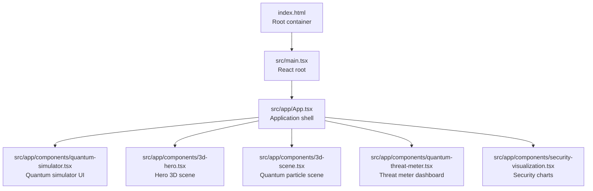
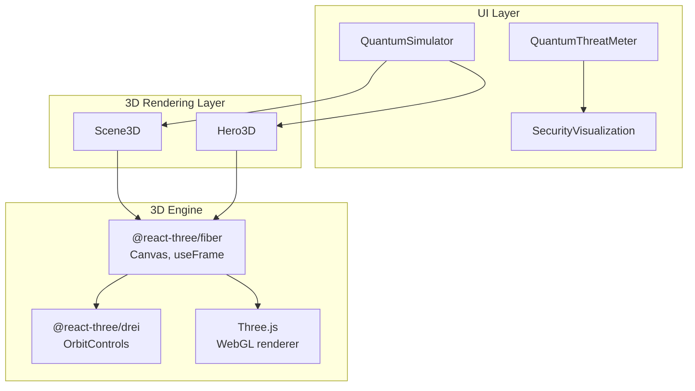
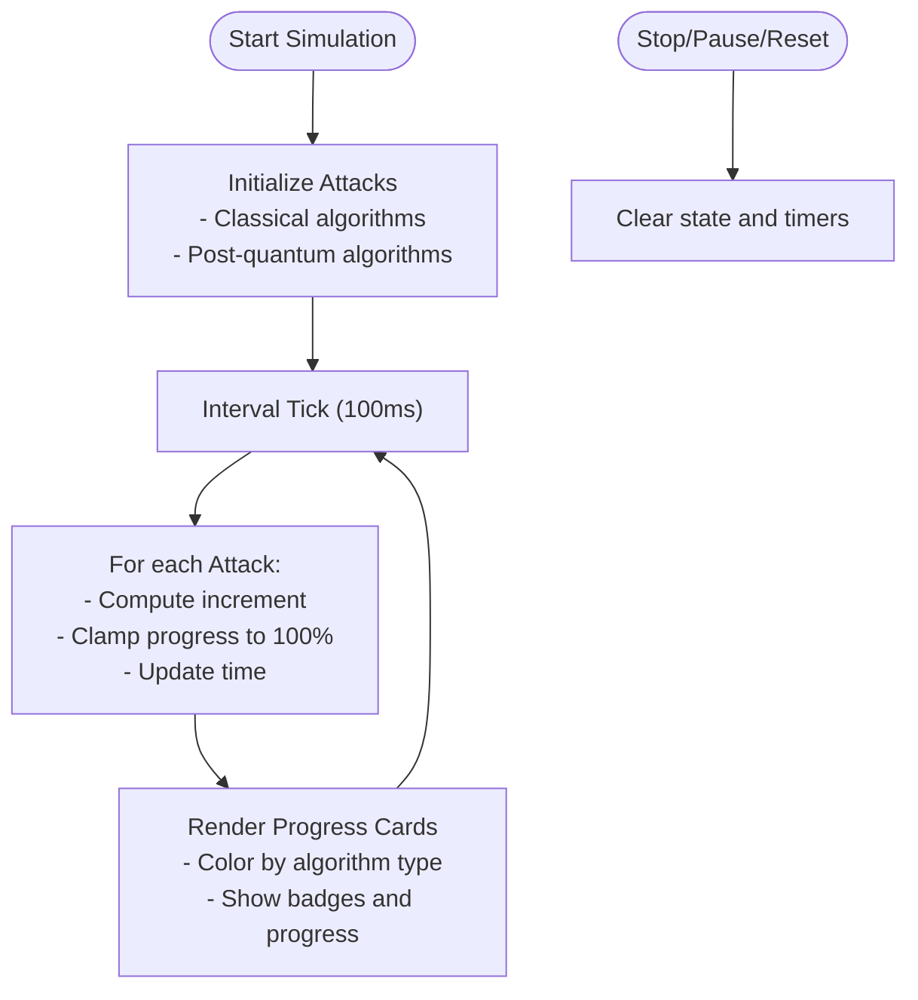
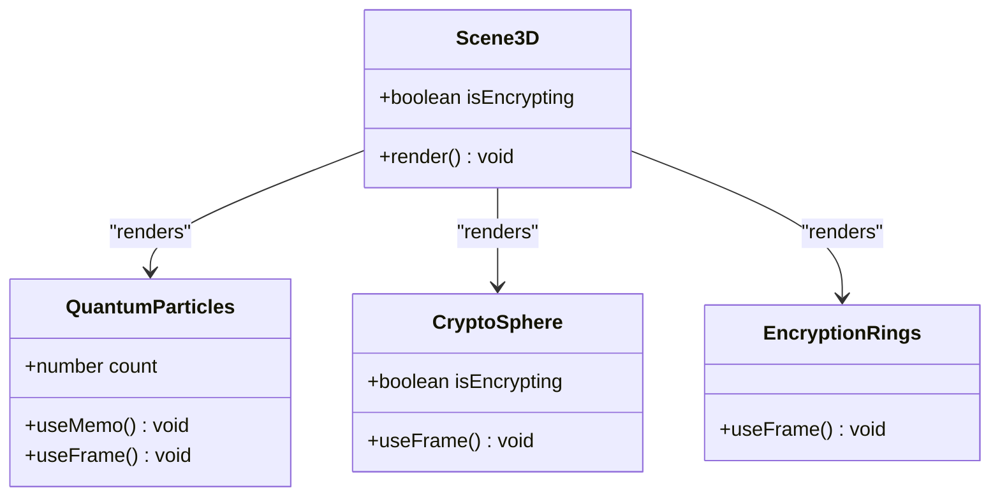
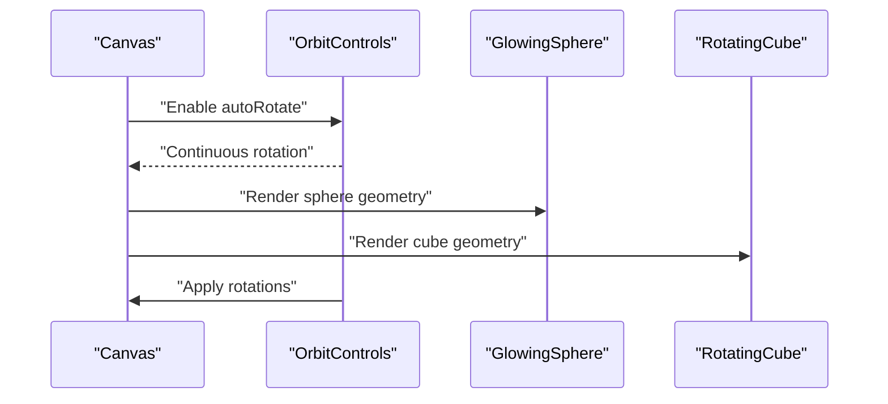
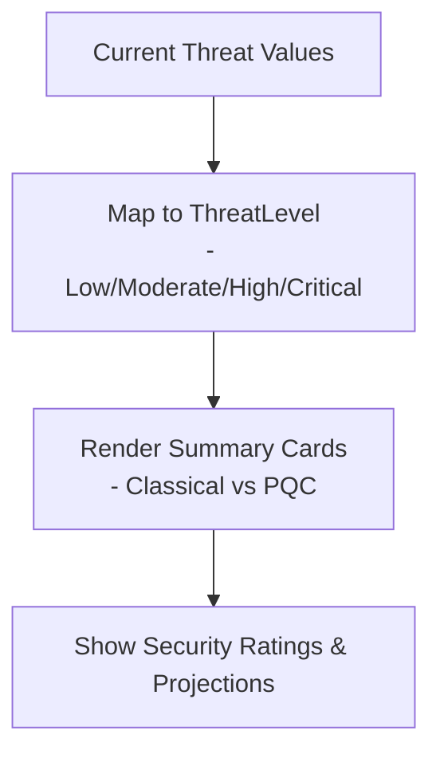
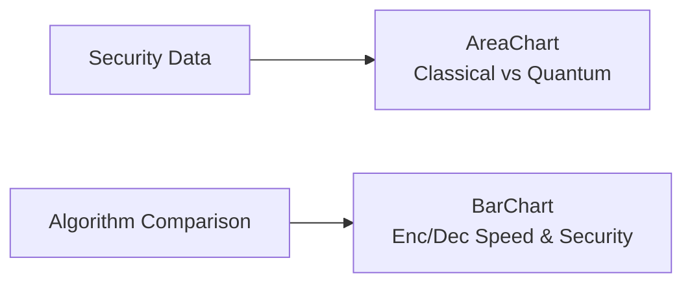
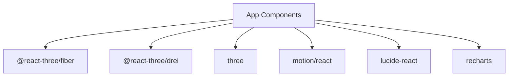

# 3D Quantum Simulator

<cite>
**Referenced Files in This Document**
- [README.md](file://README.md)
- [package.json](file://package.json)
- [index.html](file://index.html)
- [main.tsx](file://src/main.tsx)
- [App.tsx](file://src/app/App.tsx)
- [quantum-simulator.tsx](file://src/app/components/quantum-simulator.tsx)
- [3d-hero.tsx](file://src/app/components/3d-hero.tsx)
- [3d-scene.tsx](file://src/app/components/3d-scene.tsx)
- [quantum-threat-meter.tsx](file://src/app/components/quantum-threat-meter.tsx)
- [security-visualization.tsx](file://src/app/components/security-visualization.tsx)
</cite>

## Table of Contents
1. [Introduction](#introduction)
2. [Project Structure](#project-structure)
3. [Core Components](#core-components)
4. [Architecture Overview](#architecture-overview)
5. [Detailed Component Analysis](#detailed-component-analysis)
6. [Dependency Analysis](#dependency-analysis)
7. [Performance Considerations](#performance-considerations)
8. [Troubleshooting Guide](#troubleshooting-guide)
9. [Conclusion](#conclusion)
10. [Appendices](#appendices)

## Introduction
This document describes the 3D Quantum Simulator component designed to visualize quantum computing threats in an immersive, educational environment. It integrates React-based UI with Three.js and @react-three/fiber to render animated 3D scenes that illustrate quantum attacks against classical and post-quantum cryptographic algorithms. The simulator includes:
- A quantum attack progression model with adjustable qubit counts
- Real-time particle systems representing quantum states
- Interactive 3D scenes with orbit controls and lighting
- Educational dashboards for threat levels and algorithm comparisons
- Performance-conscious rendering and memory management strategies

The goal is to help learners understand how quantum computers could break current cryptographic systems and why post-quantum cryptography matters, while maintaining smooth, responsive visuals across browsers.

## Project Structure
The project is a Vite-powered React application with TypeScript. The 3D visualization stack relies on Three.js and @react-three/fiber for declarative 3D rendering, @react-three/drei for helpers, and Recharts for data visualization. The quantum simulator UI is composed of several modular components that work together to present both quantitative and immersive experiences.

**Diagram sources**
- [index.html](file://index.html#L1-L15)
- [main.tsx](file://src/main.tsx)
- [App.tsx](file://src/app/App.tsx)
- [quantum-simulator.tsx](file://src/app/components/quantum-simulator.tsx#L1-L316)
- [3d-hero.tsx](file://src/app/components/3d-hero.tsx#L1-L76)
- [3d-scene.tsx](file://src/app/components/3d-scene.tsx#L1-L151)
- [quantum-threat-meter.tsx](file://src/app/components/quantum-threat-meter.tsx#L1-L149)
- [security-visualization.tsx](file://src/app/components/security-visualization.tsx#L1-L107)

**Section sources**
- [README.md](file://README.md#L1-L11)
- [package.json](file://package.json#L1-L93)
- [index.html](file://index.html#L1-L15)

## Core Components
This section outlines the primary components that compose the 3D Quantum Simulator and their roles in the educational narrative and visualization pipeline.

- QuantumSimulator (quantum-simulator.tsx)
  - Manages quantum attack simulation state, qubit configuration, and progress visualization.
  - Provides controls to start, pause, and reset simulations.
  - Renders animated quantum progress cards with color-coded threat indicators.

- Scene3D (3d-scene.tsx)
  - Renders a 3D quantum particle field using instanced meshes for performance.
  - Displays a rotating cryptographic sphere and concentric glowing rings.
  - Uses auto-rotation and lighting to create an immersive, low-interaction experience.

- Hero3D (3d-hero.tsx)
  - A lightweight hero scene featuring a glowing sphere and a wireframe cube.
  - Demonstrates basic 3D rendering and automatic rotation for introductory contexts.

- QuantumThreatMeter (quantum-threat-meter.tsx)
  - Presents a comparative dashboard of classical vs post-quantum threat levels.
  - Uses animated cards and progress bars to communicate risk levels.

- SecurityVisualization (security-visualization.tsx)
  - Visualizes security strength trends and algorithm performance metrics.
  - Empowers users to compare encryption speeds and security ratings across PQC algorithms.

**Section sources**
- [quantum-simulator.tsx](file://src/app/components/quantum-simulator.tsx#L1-L316)
- [3d-scene.tsx](file://src/app/components/3d-scene.tsx#L1-L151)
- [3d-hero.tsx](file://src/app/components/3d-hero.tsx#L1-L76)
- [quantum-threat-meter.tsx](file://src/app/components/quantum-threat-meter.tsx#L1-L149)
- [security-visualization.tsx](file://src/app/components/security-visualization.tsx#L1-L107)

## Architecture Overview
The 3D Quantum Simulator architecture blends React UI components with Three.js scenes orchestrated via @react-three/fiber. The system separates concerns into:
- UI orchestration: React components manage state, controls, and layout.
- 3D rendering: @react-three/fiber renders scenes declaratively with efficient updates.
- Data visualization: Recharts presents algorithmic and temporal security insights.
- Educational dashboards: Threat meters and progress indicators reinforce learning outcomes.

**Diagram sources**
- [quantum-simulator.tsx](file://src/app/components/quantum-simulator.tsx#L1-L316)
- [3d-scene.tsx](file://src/app/components/3d-scene.tsx#L1-L151)
- [3d-hero.tsx](file://src/app/components/3d-hero.tsx#L1-L76)
- [quantum-threat-meter.tsx](file://src/app/components/quantum-threat-meter.tsx#L1-L149)
- [security-visualization.tsx](file://src/app/components/security-visualization.tsx#L1-L107)
- [package.json](file://package.json#L42-L66)

## Detailed Component Analysis

### QuantumSimulator Component
The QuantumSimulator component simulates quantum attacks against classical and post-quantum algorithms. It maintains:
- A list of attacks with progress, success state, and elapsed time.
- A qubit configuration slider to adjust simulation complexity.
- A timer-driven loop that increments attack progress at different rates depending on algorithm type.

**Diagram sources**
- [quantum-simulator.tsx](file://src/app/components/quantum-simulator.tsx#L25-L48)
- [quantum-simulator.tsx](file://src/app/components/quantum-simulator.tsx#L50-L80)

Key implementation patterns:
- State-driven animations: The component uses React state to drive progress and visual feedback.
- Algorithm-specific decay rates: Different attack types advance at distinct speeds to reflect cryptographic differences.
- Visual affordances: Color-coded cards, progress bars, and status badges improve comprehension.

Interactive controls:
- Start/Pause/Reset buttons control the simulation lifecycle.
- Qubit slider adjusts the perceived complexity of the quantum computation.

Educational impact:
- Demonstrates the relative resilience of post-quantum algorithms versus classical ones.
- Reinforces the concept that increasing qubits accelerates quantum advantage.

**Section sources**
- [quantum-simulator.tsx](file://src/app/components/quantum-simulator.tsx#L1-L316)

### Scene3D Component
Scene3D composes a 3D quantum visualization using instanced meshes for efficient particle rendering. It includes:
- A central rotating cryptographic sphere whose color indicates encryption state.
- Three orbital rings with emissive materials to simulate quantum fields.
- A dense particle field generated via instanced meshes for thousands of points.

**Diagram sources**
- [3d-scene.tsx](file://src/app/components/3d-scene.tsx#L6-L58)
- [3d-scene.tsx](file://src/app/components/3d-scene.tsx#L60-L80)
- [3d-scene.tsx](file://src/app/components/3d-scene.tsx#L82-L119)
- [3d-scene.tsx](file://src/app/components/3d-scene.tsx#L125-L151)

Rendering optimization highlights:
- Instanced meshes: Particle positions are updated via instance matrices, minimizing geometry duplication.
- Memoization: Particle arrays and dummy objects are memoized to avoid recomputation per frame.
- Lighting and fog: Subtle ambient and directional lighting with exponential fog enhance depth perception without heavy shading.

Animation system:
- useFrame hooks update rotation and particle transforms each frame.
- Auto-rotation provides continuous engagement without user interaction.

**Section sources**
- [3d-scene.tsx](file://src/app/components/3d-scene.tsx#L1-L151)

### Hero3D Component
Hero3D provides a minimal, self-contained 3D scene suitable for hero sections or quick demos. It features:
- A glowing sphere with metallic material properties.
- A wireframe cube with transparent opacity.
- Auto-rotating controls for passive demonstration.

**Diagram sources**
- [3d-hero.tsx](file://src/app/components/3d-hero.tsx#L53-L76)

**Section sources**
- [3d-hero.tsx](file://src/app/components/3d-hero.tsx#L1-L76)

### QuantumThreatMeter Component
QuantumThreatMeter compares classical and post-quantum threat levels using:
- Threshold-based risk categories mapped to color-coded labels.
- Animated summary cards with descriptive messages.
- Progress bars indicating current threat percentages.

**Diagram sources**
- [quantum-threat-meter.tsx](file://src/app/components/quantum-threat-meter.tsx#L13-L38)
- [quantum-threat-meter.tsx](file://src/app/components/quantum-threat-meter.tsx#L40-L149)

**Section sources**
- [quantum-threat-meter.tsx](file://src/app/components/quantum-threat-meter.tsx#L1-L149)

### SecurityVisualization Component
SecurityVisualization presents two complementary charts:
- Area chart showing classical vs post-quantum security trends over time.
- Bar chart comparing encryption speed and security levels across PQC algorithms.

**Diagram sources**
- [security-visualization.tsx](file://src/app/components/security-visualization.tsx#L5-L22)
- [security-visualization.tsx](file://src/app/components/security-visualization.tsx#L24-L107)

**Section sources**
- [security-visualization.tsx](file://src/app/components/security-visualization.tsx#L1-L107)

## Dependency Analysis
External libraries and their roles:
- @react-three/fiber: Declarative Three.js for React, enabling Canvas and useFrame.
- @react-three/drei: Helpers like OrbitControls for camera behavior.
- three: Core WebGL renderer and geometries.
- motion/react: Lightweight animation primitives for UI and 3D elements.
- lucide-react: Icons for controls and status indicators.
- recharts: Charts for security trend and algorithm comparison data.

**Diagram sources**
- [package.json](file://package.json#L42-L66)

**Section sources**
- [package.json](file://package.json#L1-L93)

## Performance Considerations
Rendering optimization strategies:
- Instanced rendering: Scene3D uses instanced meshes for particle systems to reduce draw calls and memory overhead.
- Frame-local computations: Particle positions and transforms are computed per frame with minimal allocations.
- Memoization: Particle arrays and dummy objects are memoized to avoid recreating geometry data each render cycle.
- Lighting simplicity: Ambient and directional lights keep shading costs low while preserving visual quality.
- Fog and background: Exponential fog and dark backgrounds reduce overdraw and improve perceived depth.

Memory management:
- Avoid unnecessary re-creations: Particle data is initialized once and updated in place.
- Controlled instance counts: Adjust particle counts based on device capabilities for optimal performance.

Browser compatibility:
- Three.js targets modern WebGL; ensure devices support WebGL 2 where possible.
- Progressive degradation: Reduce particle counts or disable effects on lower-end devices.
- OrbitControls autoRotate: Prefer auto-rotation to minimize user interaction overhead in constrained environments.

[No sources needed since this section provides general guidance]

## Troubleshooting Guide
Common issues and resolutions:
- Scene not rendering:
  - Verify the root container exists and is mounted.
  - Confirm Canvas is inside the React tree and not wrapped in fragments that block mounting.
- Poor performance:
  - Lower particle count or disable auto-rotation.
  - Disable emissive materials or reduce light count.
- Controls not working:
  - Ensure OrbitControls are enabled and not conflicting with other event handlers.
  - Check for pointer events being blocked by overlays.

**Section sources**
- [index.html](file://index.html#L10-L12)
- [3d-scene.tsx](file://src/app/components/3d-scene.tsx#L141-L146)
- [3d-hero.tsx](file://src/app/components/3d-hero.tsx#L66-L71)

## Conclusion
The 3D Quantum Simulator combines React UI, Three.js, and educational dashboards to create an immersive, instructive experience. By modeling quantum attacks, rendering particle systems efficiently, and presenting comparative security metrics, it helps users grasp the urgency of transitioning to post-quantum cryptography. The modular architecture supports easy extension, performance tuning, and adaptation to diverse educational contexts.

[No sources needed since this section summarizes without analyzing specific files]

## Appendices

### Example Simulation Scenarios
- Scenario A: Small-scale education
  - Use 20–40 qubits; moderate particle count; highlight classical algorithms.
- Scenario B: Advanced presentation
  - Use 60–100 qubits; higher particle density; emphasize post-quantum resilience.
- Scenario C: Live demo
  - Fixed qubit count; auto-rotation; simplified lighting; focus on narrative flow.

[No sources needed since this section provides general guidance]

### Parameter Tuning Guidelines
- Qubit range: 10–100; adjust based on audience and device capability.
- Particle count: 200–1000; balance fidelity with performance.
- Animation speed: Auto-rotation and transition durations; keep smooth but not overwhelming.
- Lighting: Reduce intensity on lower-end devices; maintain contrast for clarity.

[No sources needed since this section provides general guidance]

### Performance Benchmarking Checklist
- Baseline FPS: Measure frames per second with default settings.
- Particle scaling: Test with 50%, 75%, and 100% particle counts.
- Lighting variants: Compare ambient-only vs multiple lights.
- Device categories: Record performance on desktop, mid-tier laptop, and tablet.

[No sources needed since this section provides general guidance]