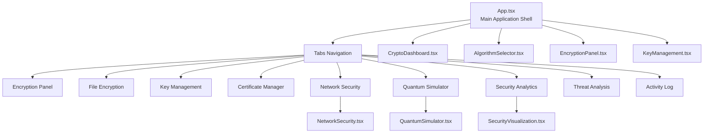
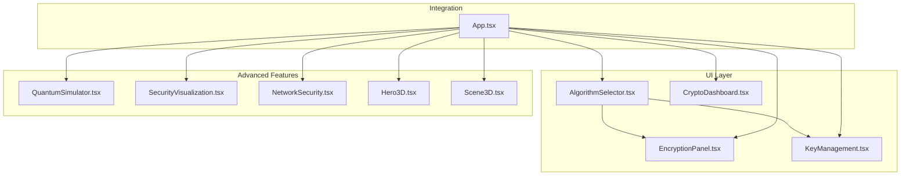
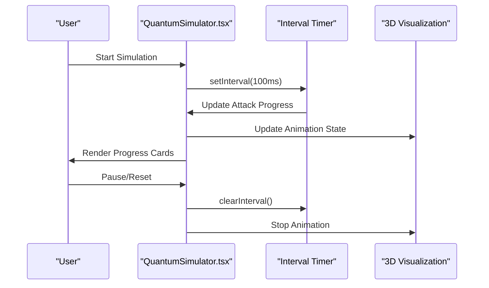
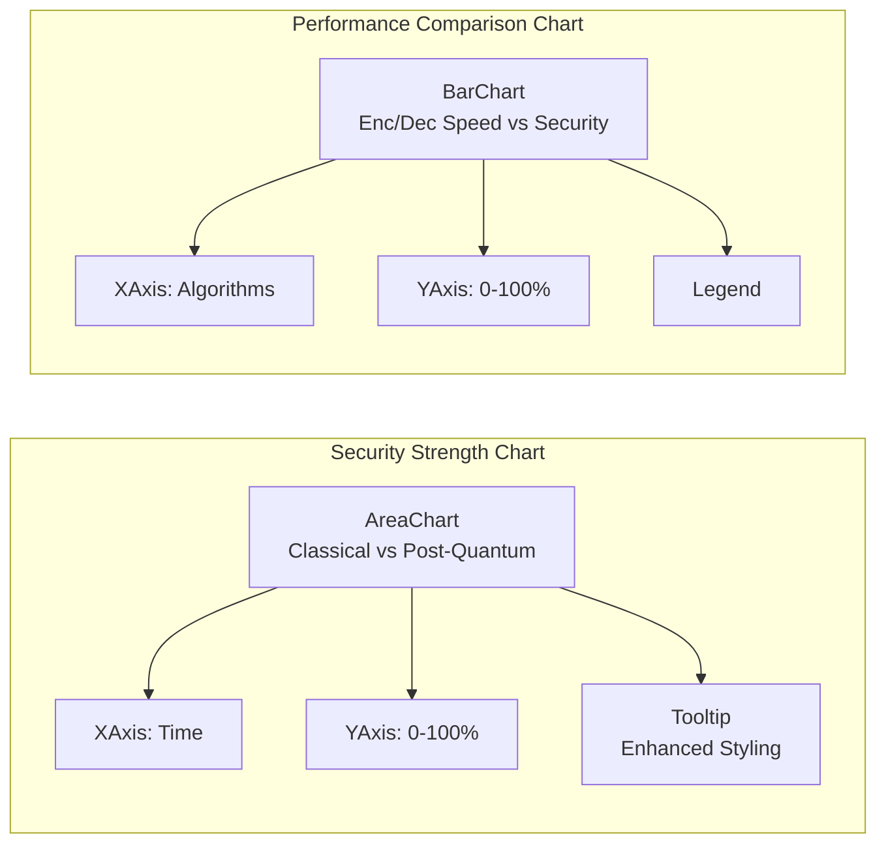
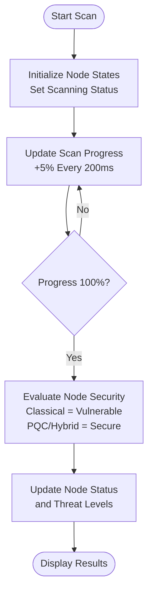
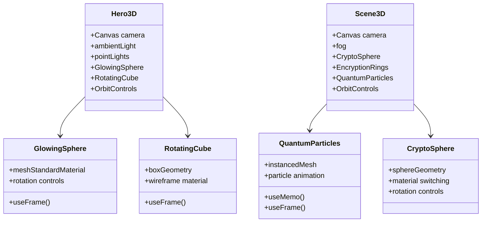
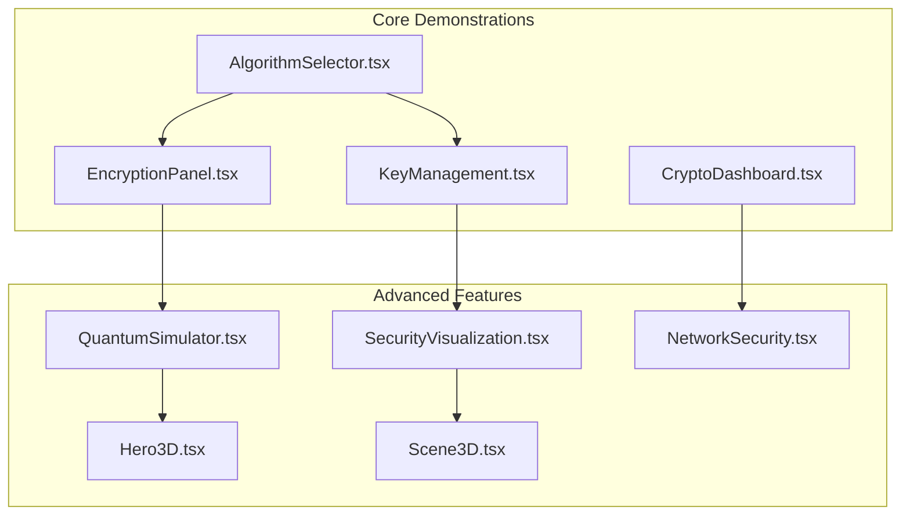
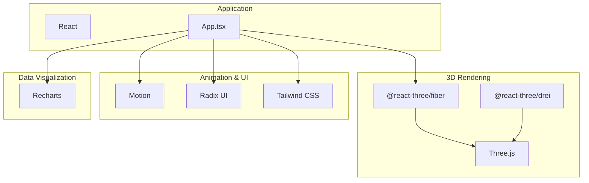

# Advanced Features

<cite>
**Referenced Files in This Document**
- [App.tsx](file://Design/src/app/App.tsx)
- [quantum-simulator.tsx](file://Design/src/app/components/quantum-simulator.tsx)
- [3d-hero.tsx](file://Design/src/app/components/3d-hero.tsx)
- [3d-scene.tsx](file://Design/src/app/components/3d-scene.tsx)
- [security-visualization.tsx](file://Design/src/app/components/security-visualization.tsx)
- [network-security.tsx](file://Design/src/app/components/network-security.tsx)
- [crypto-dashboard.tsx](file://Design/src/app/components/crypto-dashboard.tsx)
- [algorithm-selector.tsx](file://Design/src/app/components/algorithm-selector.tsx)
- [encryption-panel.tsx](file://Design/src/app/components/encryption-panel.tsx)
- [key-management.tsx](file://Design/src/app/components/key-management.tsx)
- [package.json](file://Design/package.json)
</cite>

## Table of Contents
1. [Introduction](#introduction)
2. [Project Structure](#project-structure)
3. [Core Components](#core-components)
4. [Architecture Overview](#architecture-overview)
5. [Detailed Component Analysis](#detailed-component-analysis)
6. [Dependency Analysis](#dependency-analysis)
7. [Performance Considerations](#performance-considerations)
8. [Troubleshooting Guide](#troubleshooting-guide)
9. [Conclusion](#conclusion)

## Introduction
This document details the Advanced Features section of the platform, focusing on sophisticated visualization and analytics capabilities. It covers:
- The 3D Quantum Simulator for immersive quantum threat visualization using Three.js and @react-three/fiber
- The Security Analytics system using Recharts for performance comparison charts and security metrics dashboards
- The Network Security simulation for quantum-resistant protocol demonstration and threat modeling
- The 3D Hero and Scene components for creating engaging educational visualizations
- Integration between these advanced features and the core cryptographic demonstrations

The goal is to provide technical implementation details, performance considerations, optimization strategies, and practical examples of how these features enhance education and research.

## Project Structure
The Advanced Features are implemented as React components integrated into the main application shell. The application uses a tabbed interface to organize features, with dedicated tabs for encryption, files, keys, certificates, network security, simulator, analytics, threat analysis, and activity logs.

**Diagram sources**
- [App.tsx](file://Design/src/app/App.tsx#L208-L316)
- [quantum-simulator.tsx](file://Design/src/app/components/quantum-simulator.tsx#L17-L316)
- [security-visualization.tsx](file://Design/src/app/components/security-visualization.tsx#L24-L107)
- [network-security.tsx](file://Design/src/app/components/network-security.tsx#L19-L303)
- [crypto-dashboard.tsx](file://Design/src/app/components/crypto-dashboard.tsx#L13-L70)
- [algorithm-selector.tsx](file://Design/src/app/components/algorithm-selector.tsx#L73-L121)
- [encryption-panel.tsx](file://Design/src/app/components/encryption-panel.tsx#L15-L238)
- [key-management.tsx](file://Design/src/app/components/key-management.tsx#L22-L221)

**Section sources**
- [App.tsx](file://Design/src/app/App.tsx#L208-L316)

## Core Components
This section highlights the primary advanced feature components and their roles:

- Quantum Simulator: Real-time quantum attack simulation with animated visualization and interactive controls
- Security Analytics: Recharts-based dashboards for security strength over time and algorithm performance comparisons
- Network Security: Interactive network topology with threat assessment and upgrade pathways
- 3D Hero and Scene: Three.js powered educational visualizations for quantum concepts
- Crypto Dashboard: Integration metrics for the core cryptographic demonstrations

These components collectively provide immersive, educational, and research-oriented experiences that demonstrate quantum-resistant cryptography in action.

**Section sources**
- [quantum-simulator.tsx](file://Design/src/app/components/quantum-simulator.tsx#L17-L316)
- [security-visualization.tsx](file://Design/src/app/components/security-visualization.tsx#L24-L107)
- [network-security.tsx](file://Design/src/app/components/network-security.tsx#L19-L303)
- [3d-hero.tsx](file://Design/src/app/components/3d-hero.tsx#L53-L76)
- [3d-scene.tsx](file://Design/src/app/components/3d-scene.tsx#L125-L151)
- [crypto-dashboard.tsx](file://Design/src/app/components/crypto-dashboard.tsx#L13-L70)

## Architecture Overview
The Advanced Features are integrated into the main application through a tabbed interface. Each tab hosts a specialized component that either visualizes quantum concepts, presents analytics, or simulates network security scenarios. The components share common UI primitives and animations for a cohesive user experience.

**Diagram sources**
- [App.tsx](file://Design/src/app/App.tsx#L208-L316)
- [algorithm-selector.tsx](file://Design/src/app/components/algorithm-selector.tsx#L73-L121)
- [encryption-panel.tsx](file://Design/src/app/components/encryption-panel.tsx#L15-L238)
- [key-management.tsx](file://Design/src/app/components/key-management.tsx#L22-L221)
- [crypto-dashboard.tsx](file://Design/src/app/components/crypto-dashboard.tsx#L13-L70)
- [quantum-simulator.tsx](file://Design/src/app/components/quantum-simulator.tsx#L17-L316)
- [security-visualization.tsx](file://Design/src/app/components/security-visualization.tsx#L24-L107)
- [network-security.tsx](file://Design/src/app/components/network-security.tsx#L19-L303)
- [3d-hero.tsx](file://Design/src/app/components/3d-hero.tsx#L53-L76)
- [3d-scene.tsx](file://Design/src/app/components/3d-scene.tsx#L125-L151)

## Detailed Component Analysis

### 3D Quantum Simulator
The Quantum Simulator provides an immersive visualization of quantum attacks on both classical and post-quantum cryptographic algorithms. It combines real-time progress tracking with animated 3D graphics to illustrate quantum computational power.

Key implementation aspects:
- State management for simulation lifecycle (running/paused/reset)
- Algorithm categorization (classical vs post-quantum)
- Dynamic progress calculation with different rates for different algorithm families
- Animated quantum visualization with rotating orbital rings and central core
- Interactive controls for qubit configuration and simulation management

**Diagram sources**
- [quantum-simulator.tsx](file://Design/src/app/components/quantum-simulator.tsx#L25-L48)
- [quantum-simulator.tsx](file://Design/src/app/components/quantum-simulator.tsx#L50-L80)
- [quantum-simulator.tsx](file://Design/src/app/components/quantum-simulator.tsx#L198-L311)

Interactive controls and parameters:
- Qubit configuration slider (10-100 qubits)
- Start/Pause/Reset buttons
- Real-time progress bars with color-coded algorithm categories
- Animated quantum visualization with configurable rotation speeds

Educational impact:
- Demonstrates exponential scaling of quantum computational power
- Visualizes differences between classical and post-quantum algorithm resistance
- Provides immediate feedback on simulation outcomes

**Section sources**
- [quantum-simulator.tsx](file://Design/src/app/components/quantum-simulator.tsx#L17-L316)

### Security Analytics with Recharts
The Security Analytics system presents two complementary visualizations: security strength over time and algorithm performance comparisons. Both charts use Recharts for responsive, interactive data visualization.

**Diagram sources**
- [security-visualization.tsx](file://Design/src/app/components/security-visualization.tsx#L36-L75)
- [security-visualization.tsx](file://Design/src/app/components/security-visualization.tsx#L85-L102)

Implementation details:
- Linear gradients for area charts with custom opacity
- Monotone interpolation for smooth curves
- Responsive containers that adapt to screen size
- Tooltips with themed styling matching the application palette
- Dual-axis bar charts for multi-dimensional algorithm evaluation

Research applications:
- Comparative analysis of PQC algorithm strengths
- Performance benchmarking across different cryptographic families
- Trend analysis of security degradation over time

**Section sources**
- [security-visualization.tsx](file://Design/src/app/components/security-visualization.tsx#L24-L107)

### Network Security Simulation
The Network Security component provides a comprehensive threat assessment for network infrastructure, demonstrating quantum-resistant protocol deployment and risk mitigation strategies.

**Diagram sources**
- [network-security.tsx](file://Design/src/app/components/network-security.tsx#L71-L102)
- [network-security.tsx](file://Design/src/app/components/network-security.tsx#L19-L303)

Key features:
- Interactive network topology with server/router/endpoint nodes
- Real-time scanning with progress indicators
- Color-coded threat levels (green/yellow/red)
- Upgrade pathway from classical to post-quantum encryption
- Automated threat assessment based on encryption type

Integration with core demonstrations:
- Demonstrates practical migration strategies from classical to PQC
- Shows quantifiable security improvements with post-quantum protocols
- Provides actionable insights for network administrators

**Section sources**
- [network-security.tsx](file://Design/src/app/components/network-security.tsx#L19-L303)

### 3D Hero and Scene Components
The 3D visualization components create immersive educational experiences using Three.js and @react-three/fiber, providing intuitive representations of quantum concepts.

**Diagram sources**
- [3d-hero.tsx](file://Design/src/app/components/3d-hero.tsx#L53-L76)
- [3d-scene.tsx](file://Design/src/app/components/3d-scene.tsx#L125-L151)
- [3d-hero.tsx](file://Design/src/app/components/3d-hero.tsx#L6-L27)
- [3d-scene.tsx](file://Design/src/app/components/3d-scene.tsx#L6-L58)

Technical implementation:
- Optimized instanced rendering for large particle systems
- Frame-based animation using useFrame hooks
- Material switching for encryption state visualization
- Auto-rotation controls with configurable speeds
- Responsive fog effects for depth perception

Educational value:
- Visualizes quantum superposition and entanglement concepts
- Demonstrates cryptographic key generation processes
- Provides intuitive understanding of post-quantum security principles

**Section sources**
- [3d-hero.tsx](file://Design/src/app/components/3d-hero.tsx#L53-L76)
- [3d-scene.tsx](file://Design/src/app/components/3d-scene.tsx#L125-L151)

### Integration with Core Cryptographic Demonstrations
The Advanced Features integrate seamlessly with the core cryptographic demonstrations through shared UI components and consistent data flows.

**Diagram sources**
- [algorithm-selector.tsx](file://Design/src/app/components/algorithm-selector.tsx#L73-L121)
- [encryption-panel.tsx](file://Design/src/app/components/encryption-panel.tsx#L15-L238)
- [key-management.tsx](file://Design/src/app/components/key-management.tsx#L22-L221)
- [crypto-dashboard.tsx](file://Design/src/app/components/crypto-dashboard.tsx#L13-L70)
- [quantum-simulator.tsx](file://Design/src/app/components/quantum-simulator.tsx#L17-L316)
- [security-visualization.tsx](file://Design/src/app/components/security-visualization.tsx#L24-L107)
- [network-security.tsx](file://Design/src/app/components/network-security.tsx#L19-L303)
- [3d-hero.tsx](file://Design/src/app/components/3d-hero.tsx#L53-L76)
- [3d-scene.tsx](file://Design/src/app/components/3d-scene.tsx#L125-L151)

Integration mechanisms:
- Shared algorithm selection across all components
- Consistent progress indicators and status displays
- Unified theming and animation framework
- Cross-component data synchronization

**Section sources**
- [App.tsx](file://Design/src/app/App.tsx#L208-L316)
- [algorithm-selector.tsx](file://Design/src/app/components/algorithm-selector.tsx#L73-L121)
- [encryption-panel.tsx](file://Design/src/app/components/encryption-panel.tsx#L15-L238)
- [key-management.tsx](file://Design/src/app/components/key-management.tsx#L22-L221)
- [crypto-dashboard.tsx](file://Design/src/app/components/crypto-dashboard.tsx#L13-L70)

## Dependency Analysis
The Advanced Features rely on several key external libraries for 3D rendering, animation, and data visualization.

**Diagram sources**
- [package.json](file://Design/package.json#L42-L67)
- [App.tsx](file://Design/src/app/App.tsx#L1-L16)

Key dependencies and their roles:
- Three.js: Core 3D rendering engine for quantum visualizations
- @react-three/fiber: React renderer for Three.js scenes
- @react-three/drei: Helpful helpers for 3D scenes (controls, loaders)
- Motion: Animation library for smooth transitions and state changes
- Recharts: Data visualization library for security analytics
- Radix UI: Accessible UI component primitives
- Tailwind CSS: Utility-first styling framework

**Section sources**
- [package.json](file://Design/package.json#L10-L68)

## Performance Considerations
The Advanced Features implement several optimization strategies to ensure smooth performance across different devices and browsers.

### 3D Rendering Optimizations
- Instanced rendering for particle systems to minimize draw calls
- Memoized geometry creation to reduce memory allocation
- Frame-based animation using requestAnimationFrame equivalents
- Conditional rendering based on component visibility
- Optimized material properties for reduced GPU overhead

### Animation Performance
- useFrame hooks for efficient animation loops
- Motion library for hardware-accelerated transitions
- CSS transforms instead of layout-affecting properties
- Reduced animation complexity during intensive operations

### Data Visualization Efficiency
- Responsive containers that adapt to viewport size
- Efficient chart updates using shallow comparison
- Minimal re-renders through proper state management
- Lazy loading for large datasets

### Memory Management
- Proper cleanup of intervals and timeouts
- Cleanup of Three.js resources on component unmount
- Efficient state updates to prevent unnecessary re-renders
- Garbage collection-friendly data structures

Best practices for developers:
- Monitor frame rates using browser dev tools
- Profile memory usage during intensive operations
- Optimize particle counts based on device capabilities
- Implement throttling for frequent state updates
- Use virtualization for large lists of items

## Troubleshooting Guide
Common issues and solutions for the Advanced Features:

### 3D Rendering Issues
**Problem**: Poor performance or dropped frames in 3D components
- Solution: Reduce particle count or disable complex animations
- Verify GPU acceleration is enabled in the browser
- Check for console errors related to WebGL initialization

**Problem**: Components not rendering in older browsers
- Solution: Ensure Three.js polyfills are included
- Verify @react-three/fiber compatibility with the target browser
- Test fallback rendering for unsupported features

### Animation Problems
**Problem**: Jittery or inconsistent animations
- Solution: Use useFrame hooks instead of setInterval
- Ensure consistent frame rates across different devices
- Implement proper cleanup of animation loops

**Problem**: Motion animations not triggering
- Solution: Verify Motion library is properly installed
- Check for conflicting CSS transitions
- Ensure parent container has proper positioning

### Data Visualization Issues
**Problem**: Charts not displaying or showing incorrect data
- Solution: Verify Recharts data structure matches expected format
- Check for responsive container sizing issues
- Ensure proper cleanup of event listeners

**Problem**: Performance degradation with large datasets
- Solution: Implement data sampling or pagination
- Use virtualized lists for long data series
- Optimize chart update frequencies

### Integration Problems
**Problem**: Advanced features not connecting with core demonstrations
- Solution: Verify shared state management is properly configured
- Check for proper prop drilling or context usage
- Ensure component lifecycle methods are correctly implemented

Debugging tips:
- Use browser dev tools to monitor performance metrics
- Implement error boundaries for graceful failure handling
- Add logging for state changes and component mounts
- Test components in isolation before integration

**Section sources**
- [quantum-simulator.tsx](file://Design/src/app/components/quantum-simulator.tsx#L25-L48)
- [3d-scene.tsx](file://Design/src/app/components/3d-scene.tsx#L26-L50)
- [security-visualization.tsx](file://Design/src/app/components/security-visualization.tsx#L36-L75)

## Conclusion
The Advanced Features section provides a comprehensive suite of educational and research tools that demonstrate the practical applications of post-quantum cryptography. Through immersive 3D visualizations, interactive simulations, and data-driven analytics, users can gain deep insights into quantum threats, security assessments, and migration strategies.

The modular architecture ensures scalability and maintainability while the integration with core cryptographic demonstrations provides a cohesive learning experience. The performance optimizations and troubleshooting guidance enable reliable operation across diverse environments.

These features collectively serve both educational institutions seeking to teach quantum-resistant cryptography and research organizations exploring practical deployment strategies for post-quantum security protocols.