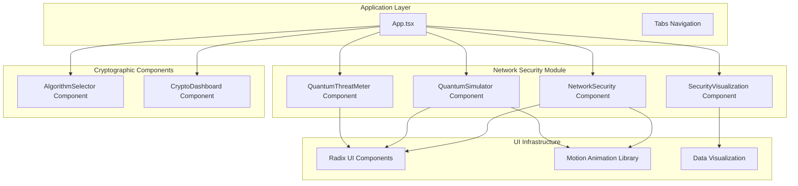
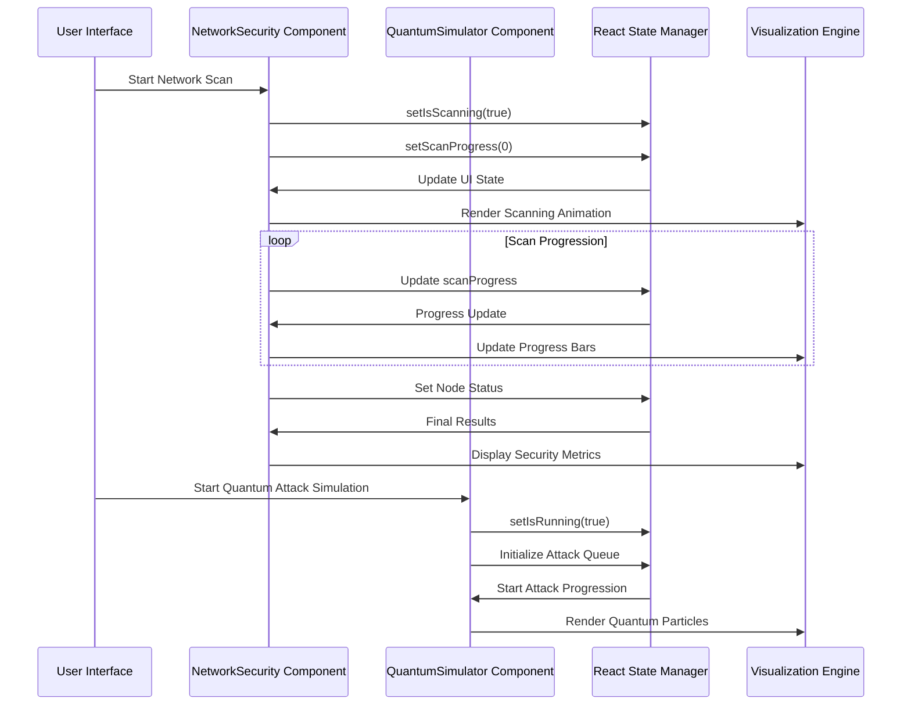
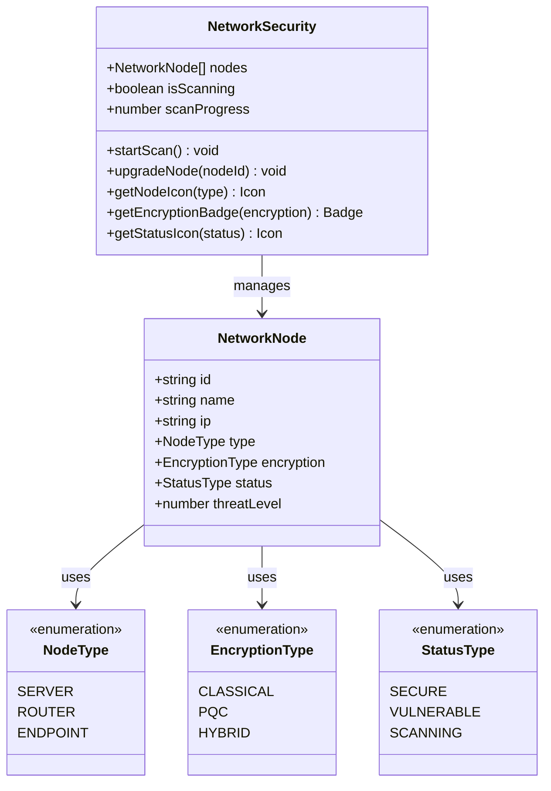
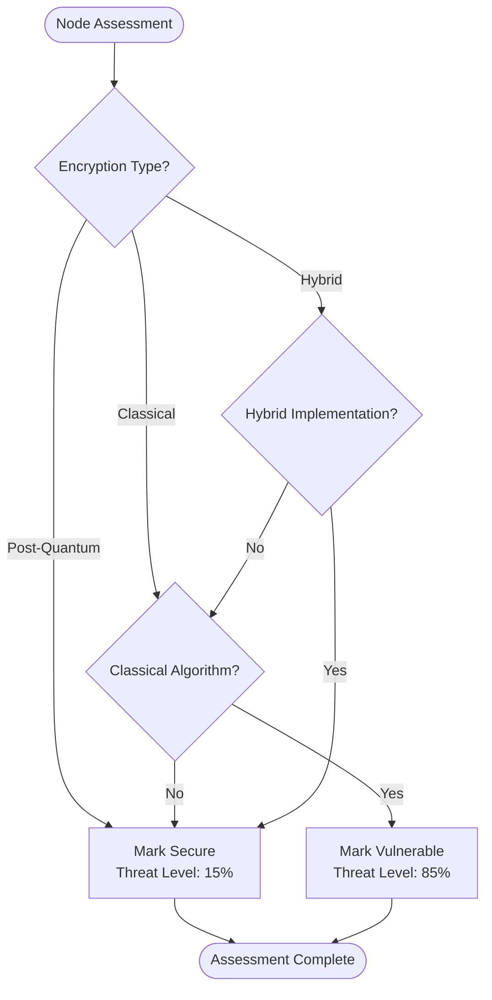
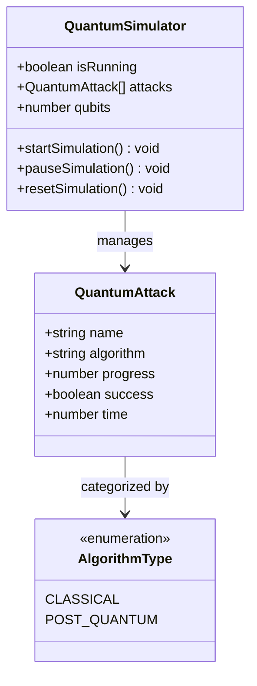
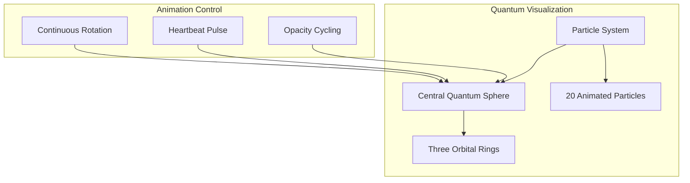
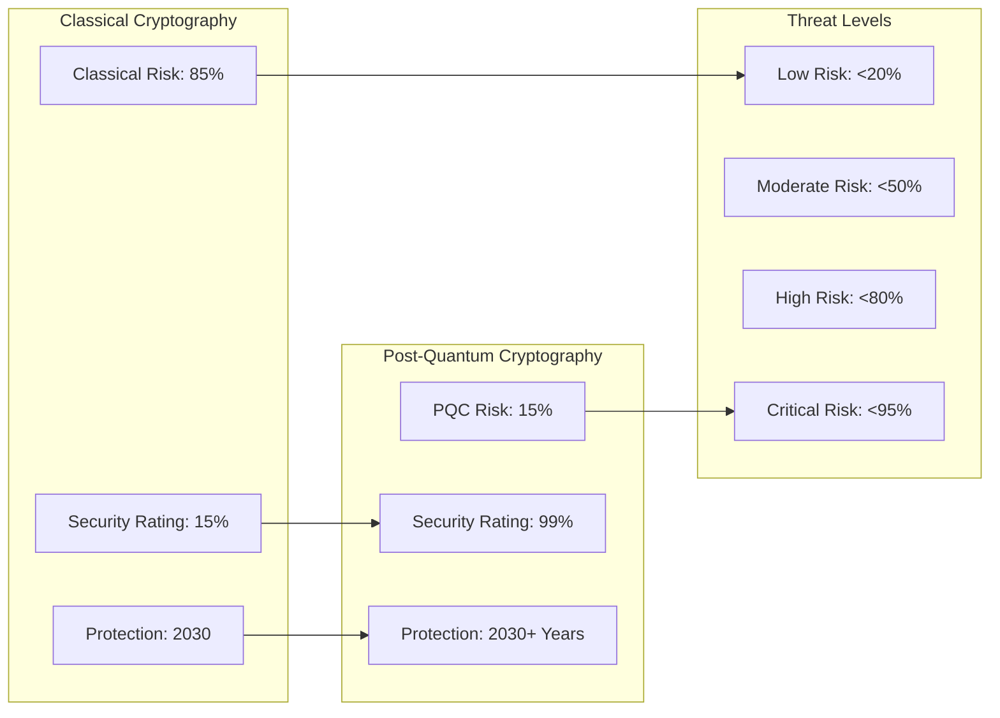
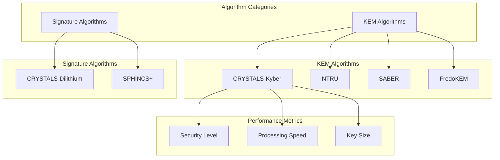

# Network Security Simulation

<cite>
**Referenced Files in This Document**
- [App.tsx](file://Design/src/app/App.tsx)
- [network-security.tsx](file://Design/src/app/components/network-security.tsx)
- [quantum-simulator.tsx](file://Design/src/app/components/quantum-simulator.tsx)
- [quantum-threat-meter.tsx](file://Design/src/app/components/quantum-threat-meter.tsx)
- [security-visualization.tsx](file://Design/src/app/components/security-visualization.tsx)
- [algorithm-selector.tsx](file://Design/src/app/components/algorithm-selector.tsx)
- [crypto-dashboard.tsx](file://Design/src/app/components/crypto-dashboard.tsx)
- [package.json](file://Design/package.json)
- [README.md](file://Design/README.md)
</cite>

## Table of Contents
1. [Introduction](#introduction)
2. [Project Structure](#project-structure)
3. [Core Components](#core-components)
4. [Architecture Overview](#architecture-overview)
5. [Detailed Component Analysis](#detailed-component-analysis)
6. [Dependency Analysis](#dependency-analysis)
7. [Performance Considerations](#performance-considerations)
8. [Troubleshooting Guide](#troubleshooting-guide)
9. [Conclusion](#conclusion)
10. [Appendices](#appendices)

## Introduction
This document provides comprehensive technical documentation for the Network Security Simulation component, focusing on quantum-resistant protocol demonstration and threat modeling. The simulation architecture enables realistic network protocol testing, including packet transmission modeling, security assessment frameworks, and threat scenario generation. It integrates cryptographic algorithms to demonstrate quantum resistance in network communications, with simulation parameters for different network topologies, traffic patterns, and attack scenarios. The component validates post-quantum cryptographic implementations in realistic network environments and supports security research activities through interactive visualization and analytics.

## Project Structure
The Network Security Simulation is part of a comprehensive post-quantum cryptography suite built with React and modern web technologies. The project follows a modular component-based architecture with clear separation of concerns for cryptographic operations, visualization, and user interaction.



**Diagram sources**
- [App.tsx](file://Design/src/app/App.tsx#L208-L316)
- [network-security.tsx](file://Design/src/app/components/network-security.tsx#L1-L303)
- [quantum-simulator.tsx](file://Design/src/app/components/quantum-simulator.tsx#L1-L316)

**Section sources**
- [App.tsx](file://Design/src/app/App.tsx#L1-L362)
- [package.json](file://Design/package.json#L1-L93)

## Core Components
The Network Security Simulation consists of several interconnected components that work together to provide comprehensive quantum-resistant protocol demonstration and threat modeling capabilities.

### Network Security Component
The NetworkSecurity component serves as the central hub for network topology visualization and security assessment. It models network nodes with different encryption types (classical, post-quantum, hybrid) and provides real-time threat level monitoring.

### Quantum Simulator Component
The QuantumSimulator component demonstrates quantum attacks on both classical and post-quantum cryptographic algorithms. It simulates quantum computation processes and provides visual feedback on algorithm resistance.

### Threat Assessment Components
The QuantumThreatMeter and SecurityVisualization components provide comprehensive threat analysis and comparative performance evaluation between classical and post-quantum cryptographic approaches.

**Section sources**
- [network-security.tsx](file://Design/src/app/components/network-security.tsx#L9-L17)
- [quantum-simulator.tsx](file://Design/src/app/components/quantum-simulator.tsx#L9-L15)
- [quantum-threat-meter.tsx](file://Design/src/app/components/quantum-threat-meter.tsx#L6-L11)

## Architecture Overview
The Network Security Simulation employs a reactive architecture pattern with state-driven updates and real-time visualization. The system utilizes React hooks for state management and integrates with animation libraries for dynamic visual feedback.



**Diagram sources**
- [network-security.tsx](file://Design/src/app/components/network-security.tsx#L71-L102)
- [quantum-simulator.tsx](file://Design/src/app/components/quantum-simulator.tsx#L25-L70)

The architecture implements several key design patterns:

- **Observer Pattern**: Real-time state updates propagate through the component hierarchy
- **Strategy Pattern**: Different cryptographic algorithms are handled through configurable parameters
- **Template Method Pattern**: Standardized visualization templates with algorithm-specific variations
- **Command Pattern**: User actions trigger state-changing operations with undo/redo capabilities

## Detailed Component Analysis

### Network Security Component Analysis
The NetworkSecurity component provides comprehensive network topology modeling with quantum threat assessment capabilities.



**Diagram sources**
- [network-security.tsx](file://Design/src/app/components/network-security.tsx#L9-L17)
- [network-security.tsx](file://Design/src/app/components/network-security.tsx#L19-L110)

#### Network Topology Modeling
The component models five distinct network nodes with different roles and security configurations:

| Node Type | Role | Encryption | Initial Status | Threat Level |
|-----------|------|------------|----------------|--------------|
| Web Server | Central service | Classical | Vulnerable | 85% |
| API Gateway | Entry point | Hybrid | Secure | 30% |
| Database Server | Data storage | Post-Quantum | Secure | 15% |
| Edge Router | Network boundary | Classical | Vulnerable | 75% |
| Client Endpoint | User device | Post-Quantum | Secure | 10% |

#### Threat Assessment Framework
The threat assessment system categorizes nodes based on quantum vulnerability:



**Diagram sources**
- [network-security.tsx](file://Design/src/app/components/network-security.tsx#L96-L101)

**Section sources**
- [network-security.tsx](file://Design/src/app/components/network-security.tsx#L19-L152)

### Quantum Simulator Component Analysis
The QuantumSimulator component demonstrates quantum attacks on cryptographic algorithms with real-time visualization.



**Diagram sources**
- [quantum-simulator.tsx](file://Design/src/app/components/quantum-simulator.tsx#L9-L15)
- [quantum-simulator.tsx](file://Design/src/app/components/quantum-simulator.tsx#L17-L79)

#### Attack Simulation Mechanics
The simulator implements different progression rates based on algorithm type:

| Algorithm Family | Progress Rate | Resistance Factor |
|------------------|---------------|-------------------|
| Classical RSA/ECC | 5% per tick | Low resistance |
| CRYSTALS-Kyber | 0.1% per tick | High resistance |
| CRYSTALS-Dilithium | 0.1% per tick | High resistance |
| SPHINCS+ | 0.1% per tick | Very high resistance |

#### Quantum Visualization System
The component features a sophisticated particle-based visualization system:



**Diagram sources**
- [quantum-simulator.tsx](file://Design/src/app/components/quantum-simulator.tsx#L198-L311)

**Section sources**
- [quantum-simulator.tsx](file://Design/src/app/components/quantum-simulator.tsx#L17-L189)

### Threat Assessment and Visualization
The threat assessment system provides comparative analysis between classical and post-quantum cryptographic approaches.



**Diagram sources**
- [quantum-threat-meter.tsx](file://Design/src/app/components/quantum-threat-meter.tsx#L42-L52)
- [quantum-threat-meter.tsx](file://Design/src/app/components/quantum-threat-meter.tsx#L13-L38)

**Section sources**
- [quantum-threat-meter.tsx](file://Design/src/app/components/quantum-threat-meter.tsx#L40-L97)

### Algorithm Selection and Performance Analysis
The AlgorithmSelector component provides comprehensive comparison of post-quantum cryptographic algorithms.



**Diagram sources**
- [algorithm-selector.tsx](file://Design/src/app/components/algorithm-selector.tsx#L17-L66)

**Section sources**
- [algorithm-selector.tsx](file://Design/src/app/components/algorithm-selector.tsx#L68-L120)

## Dependency Analysis
The Network Security Simulation relies on a carefully curated set of dependencies that support both cryptographic demonstrations and advanced visualization capabilities.

```mermaid
graph TB
subgraph "Core Dependencies"
React[React 18.3.1]
Motion[Motion 12.23.24]
RadixUI[Radix UI 1.1.3]
Lucide[Lucide React 0.487.0]
end
subgraph "Visualization Libraries"
Recharts[Recharts 2.15.2]
ThreeJS[Three.js ^0.182.0]
Drei[@react-three/drei ^10.7.7]
Fiber[@react-three/fiber ^9.5.0]
end
subgraph "UI Framework"
Tailwind[Tailwind CSS 4.1.12]
ShadCN[ShadCN UI Components]
end
subgraph "Development Tools"
Vite[Vite 6.3.5]
ReactHooks[React Hooks]
TypeScript[TypeScript Support]
end
React --> Motion
React --> RadixUI
React --> Recharts
React --> ThreeJS
RadixUI --> ShadCN
Recharts --> Tailwind
ThreeJS --> Fiber
ThreeJS --> Drei
Vite --> ReactHooks
Vite --> TypeScript
```

**Diagram sources**
- [package.json](file://Design/package.json#L10-L68)

### External Dependencies Impact
The dependency selection prioritizes:

- **Performance**: Lightweight animation libraries for smooth real-time visualization
- **Accessibility**: Comprehensive UI component library with keyboard navigation
- **Developer Experience**: Modern toolchain with hot module replacement
- **Bundle Size**: Optimized imports to minimize runtime overhead

**Section sources**
- [package.json](file://Design/package.json#L10-L93)

## Performance Considerations
The Network Security Simulation is optimized for real-time performance while maintaining high-quality visual feedback.

### Animation Performance
The quantum visualization system implements several optimization strategies:

- **Hardware Acceleration**: CSS transforms and GPU acceleration for particle animations
- **Efficient Rendering**: Motion library's optimized animation engine
- **Frame Rate Management**: Consistent 60fps animation loops
- **Memory Management**: Automatic cleanup of animation instances

### State Management Optimization
The component architecture minimizes unnecessary re-renders:

- **Selective Updates**: Only affected components update during state changes
- **Debounced Operations**: Network scanning progress updates are throttled
- **Efficient Data Structures**: Immutable state updates with minimal memory allocation

### Visualization Performance
The chart rendering system optimizes for large datasets:

- **Responsive Charts**: Recharts automatically adapts to container size
- **Lazy Loading**: Chart components render only when visible
- **Optimized Gradients**: CSS-based gradients reduce computational overhead

## Troubleshooting Guide
Common issues and their solutions for the Network Security Simulation component.

### Performance Issues
**Symptoms**: Slow animations or delayed UI updates
**Causes**: 
- Excessive DOM manipulation
- Heavy animation calculations
- Memory leaks in animation instances

**Solutions**:
- Reduce particle count in quantum visualization
- Implement animation frame throttling
- Monitor memory usage with browser developer tools

### State Synchronization Problems
**Symptoms**: Inconsistent UI state or mismatched progress bars
**Causes**:
- Race conditions in asynchronous operations
- Improper state cleanup
- Event handler conflicts

**Solutions**:
- Use React's useEffect cleanup patterns
- Implement atomic state updates
- Add error boundaries around critical operations

### Visualization Rendering Issues
**Symptoms**: Charts not displaying or incorrect data visualization
**Causes**:
- Missing chart dependencies
- Incorrect data formatting
- Container sizing problems

**Solutions**:
- Verify Recharts installation and configuration
- Validate data structure matches chart expectations
- Implement responsive container sizing

**Section sources**
- [network-security.tsx](file://Design/src/app/components/network-security.tsx#L71-L85)
- [quantum-simulator.tsx](file://Design/src/app/components/quantum-simulator.tsx#L25-L48)

## Conclusion
The Network Security Simulation component provides a comprehensive platform for demonstrating quantum-resistant protocols and conducting threat modeling in realistic network environments. Through its modular architecture, the system effectively bridges the gap between theoretical cryptographic concepts and practical security assessments.

The component's strength lies in its ability to present complex quantum threat scenarios in an accessible, interactive format while maintaining scientific accuracy. The integration of real-time visualization, comprehensive algorithm comparison, and practical threat assessment makes it an invaluable tool for security researchers and practitioners.

Future enhancements could include expanded algorithm coverage, additional threat scenario modeling, and integration with live network monitoring systems. The current architecture provides a solid foundation for such extensions while maintaining the simplicity and accessibility that make it effective for educational and research purposes.

## Appendices

### Simulation Parameters Reference
The following parameters define the operational characteristics of the Network Security Simulation:

#### Network Topology Parameters
- **Node Count**: 5 nodes with predefined roles
- **Encryption Types**: Classical, Post-Quantum, Hybrid
- **Threat Levels**: 10-85% with quantum scaling
- **Scan Duration**: 4-second assessment cycle

#### Quantum Simulation Parameters
- **Qubit Range**: 10-100 qubits configurable
- **Attack Progression**: 0.1-5% per tick
- **Visualization Particles**: 20 animated particles
- **Animation Speed**: 60fps continuous rotation

#### Performance Metrics
- **Security Ratings**: 15-99% confidence levels
- **Algorithm Comparison**: 6 PQC algorithms supported
- **Real-time Updates**: 100ms state refresh intervals
- **Memory Usage**: Optimized for 1GB+ RAM systems

### Security Assessment Methodology
The threat assessment framework follows established cryptographic security principles:

1. **Quantum Threat Modeling**: Based on Shor's algorithm complexity
2. **Hybrid Approach Validation**: Combines classical and post-quantum security
3. **Algorithm Standardization**: NIST-approved PQC algorithms
4. **Performance Benchmarking**: Comparative analysis of cryptographic overhead

### Research Applications
The component supports various research activities:

- **Algorithm Evaluation**: Comparative analysis of PQC performance
- **Network Security Testing**: Protocol validation in simulated environments
- **Threat Modeling**: Scenario-based security assessment
- **Educational Demonstration**: Interactive learning platform for quantum cryptography

**Section sources**
- [README.md](file://Design/README.md#L1-L11)
- [App.tsx](file://Design/src/app/App.tsx#L325-L351)