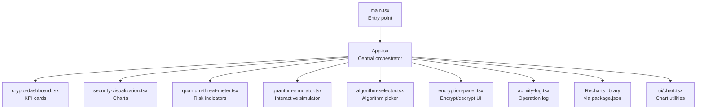
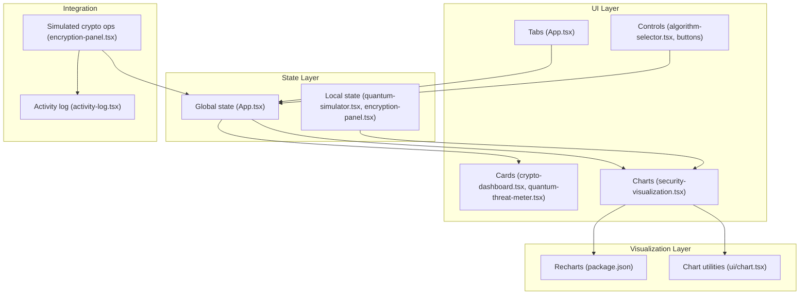
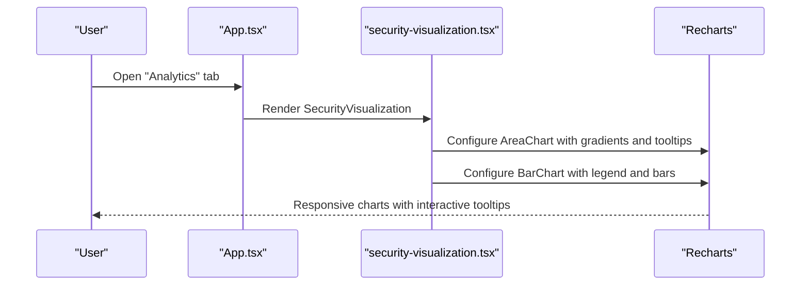
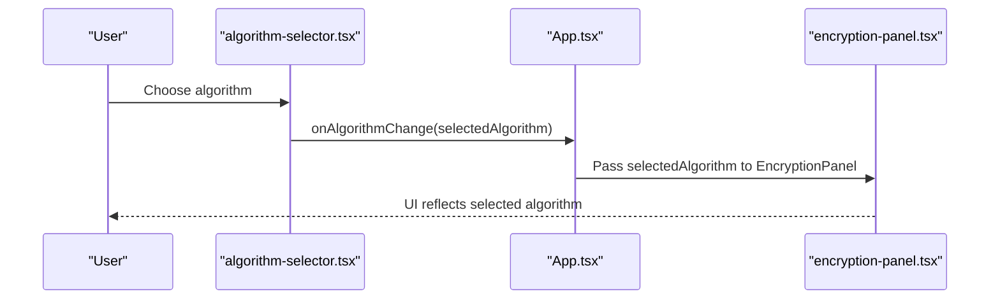
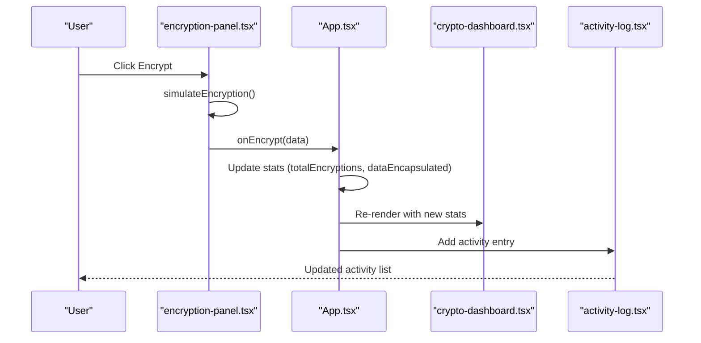
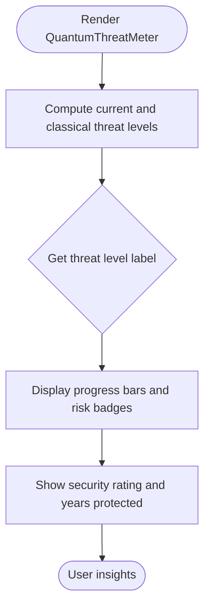
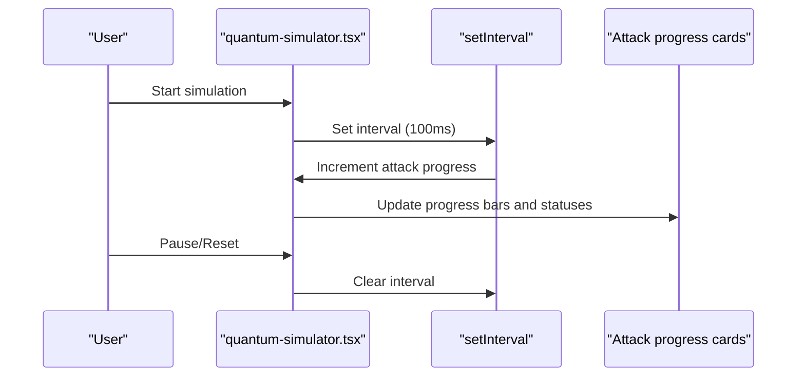
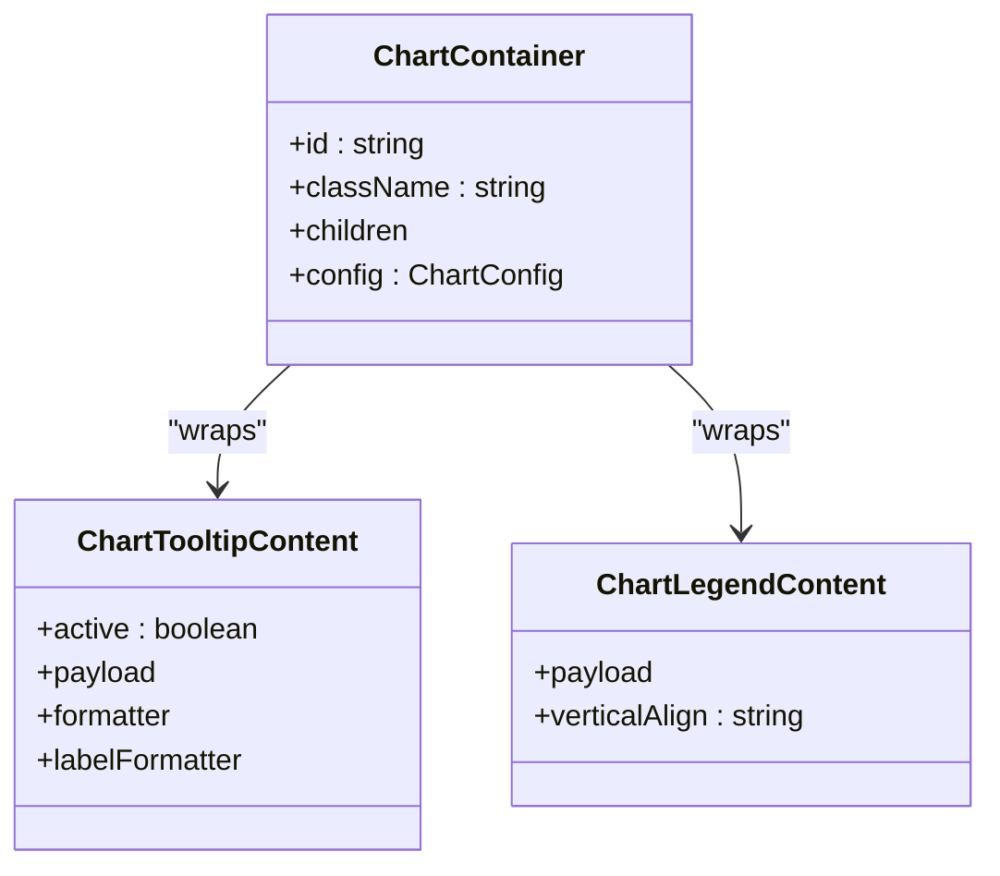
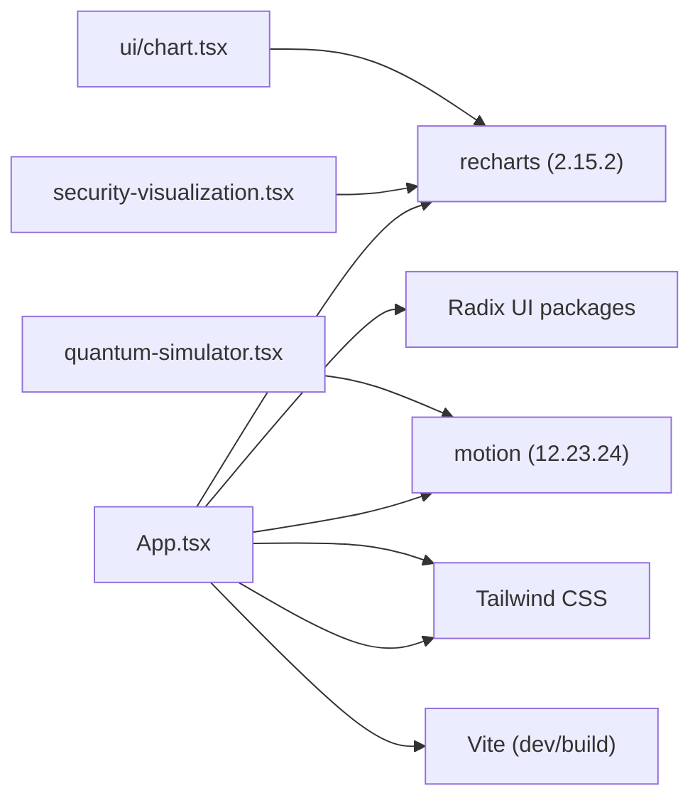

# Security Analytics Dashboard

<cite>
**Referenced Files in This Document**
- [App.tsx](file://src/app/App.tsx)
- [crypto-dashboard.tsx](file://src/app/components/crypto-dashboard.tsx)
- [security-visualization.tsx](file://src/app/components/security-visualization.tsx)
- [algorithm-selector.tsx](file://src/app/components/algorithm-selector.tsx)
- [quantum-threat-meter.tsx](file://src/app/components/quantum-threat-meter.tsx)
- [quantum-simulator.tsx](file://src/app/components/quantum-simulator.tsx)
- [encryption-panel.tsx](file://src/app/components/encryption-panel.tsx)
- [activity-log.tsx](file://src/app/components/activity-log.tsx)
- [chart.tsx](file://src/app/components/ui/chart.tsx)
- [package.json](file://package.json)
- [vite.config.ts](file://vite.config.ts)
- [main.tsx](file://src/main.tsx)
</cite>

## Table of Contents
1. [Introduction](#introduction)
2. [Project Structure](#project-structure)
3. [Core Components](#core-components)
4. [Architecture Overview](#architecture-overview)
5. [Detailed Component Analysis](#detailed-component-analysis)
6. [Dependency Analysis](#dependency-analysis)
7. [Performance Considerations](#performance-considerations)
8. [Troubleshooting Guide](#troubleshooting-guide)
9. [Conclusion](#conclusion)
10. [Appendices](#appendices)

## Introduction
This document describes the Security Analytics Dashboard system designed to visualize post-quantum cryptographic (PQC) performance and security metrics. It focuses on:
- Real-time-like data aggregation and display
- Comparative algorithm performance charts using Recharts
- Interactive controls for cryptographic operations and analytics
- Integration with cryptographic operations to provide meaningful security insights
- Chart types for trend analysis and comparative dashboards
- Data processing pipelines, responsive rendering, and optimization strategies
- Research and decision-making support for PQC selection

## Project Structure
The application is a React-based single-page application bootstrapped with Vite and styled with Tailwind CSS. The dashboard is organized around a central App container that orchestrates multiple functional tabs, each backed by dedicated components.

**Diagram sources**
- [main.tsx](file://src/main.tsx#L1-L7)
- [App.tsx](file://src/app/App.tsx#L1-L362)
- [crypto-dashboard.tsx](file://src/app/components/crypto-dashboard.tsx#L1-L70)
- [security-visualization.tsx](file://src/app/components/security-visualization.tsx#L1-L107)
- [quantum-threat-meter.tsx](file://src/app/components/quantum-threat-meter.tsx#L1-L149)
- [quantum-simulator.tsx](file://src/app/components/quantum-simulator.tsx#L1-L316)
- [algorithm-selector.tsx](file://src/app/components/algorithm-selector.tsx#L1-L121)
- [encryption-panel.tsx](file://src/app/components/encryption-panel.tsx#L1-L238)
- [activity-log.tsx](file://src/app/components/activity-log.tsx#L1-L117)
- [chart.tsx](file://src/app/components/ui/chart.tsx#L1-L354)
- [package.json](file://package.json#L1-L93)

**Section sources**
- [main.tsx](file://src/main.tsx#L1-L7)
- [vite.config.ts](file://vite.config.ts#L1-L23)
- [package.json](file://package.json#L1-L93)

## Core Components
- Central orchestration and state management: App.tsx maintains selected algorithm, activity logs, and dashboard statistics.
- Cryptographic operation panel: encryption-panel.tsx simulates encryption/decryption and updates statistics.
- Algorithm selector: algorithm-selector.tsx provides a curated list of PQC algorithms with metadata.
- Analytics and visualization: security-visualization.tsx displays area charts for security trends and bar charts for comparative performance.
- Threat assessment: quantum-threat-meter.tsx presents risk levels and security ratings.
- Simulator: quantum-simulator.tsx runs animated simulations of quantum attacks with real-time progress updates.
- Activity logging: activity-log.tsx renders recent cryptographic operations with timestamps and statuses.
- Chart utilities: ui/chart.tsx provides a reusable chart container and theme-aware components for Recharts.

**Section sources**
- [App.tsx](file://src/app/App.tsx#L26-L91)
- [encryption-panel.tsx](file://src/app/components/encryption-panel.tsx#L15-L85)
- [algorithm-selector.tsx](file://src/app/components/algorithm-selector.tsx#L68-L120)
- [security-visualization.tsx](file://src/app/components/security-visualization.tsx#L24-L106)
- [quantum-threat-meter.tsx](file://src/app/components/quantum-threat-meter.tsx#L40-L148)
- [quantum-simulator.tsx](file://src/app/components/quantum-simulator.tsx#L17-L80)
- [activity-log.tsx](file://src/app/components/activity-log.tsx#L40-L116)
- [chart.tsx](file://src/app/components/ui/chart.tsx#L37-L70)

## Architecture Overview
The dashboard follows a modular React architecture with:
- A central App component managing global state and routing tabs
- Functional components encapsulating UI, analytics, and cryptographic simulation
- Recharts for visualization with responsive containers
- Motion for animations and transitions
- Radix UI primitives for accessible controls

**Diagram sources**
- [App.tsx](file://src/app/App.tsx#L208-L316)
- [crypto-dashboard.tsx](file://src/app/components/crypto-dashboard.tsx#L13-L69)
- [security-visualization.tsx](file://src/app/components/security-visualization.tsx#L24-L106)
- [algorithm-selector.tsx](file://src/app/components/algorithm-selector.tsx#L73-L120)
- [quantum-simulator.tsx](file://src/app/components/quantum-simulator.tsx#L17-L80)
- [chart.tsx](file://src/app/components/ui/chart.tsx#L37-L70)
- [package.json](file://package.json#L61-L61)

## Detailed Component Analysis

### Security Analytics Visualization
This component provides two primary visualizations:
- Area chart: Security strength over time for classical versus post-quantum cryptography
- Bar chart: Comparative performance across PQC algorithms (encryption speed and security level)

**Diagram sources**
- [App.tsx](file://src/app/App.tsx#L302-L305)
- [security-visualization.tsx](file://src/app/components/security-visualization.tsx#L24-L106)

**Section sources**
- [security-visualization.tsx](file://src/app/components/security-visualization.tsx#L5-L22)
- [security-visualization.tsx](file://src/app/components/security-visualization.tsx#L36-L74)
- [security-visualization.tsx](file://src/app/components/security-visualization.tsx#L85-L101)

### Algorithm Selector and Selection Flow
The algorithm selector enables users to choose among NIST-standardized PQC algorithms. The selection influences encryption operations and analytics.

**Diagram sources**
- [algorithm-selector.tsx](file://src/app/components/algorithm-selector.tsx#L73-L120)
- [App.tsx](file://src/app/App.tsx#L252-L260)
- [encryption-panel.tsx](file://src/app/components/encryption-panel.tsx#L15-L20)

**Section sources**
- [algorithm-selector.tsx](file://src/app/components/algorithm-selector.tsx#L6-L66)
- [algorithm-selector.tsx](file://src/app/components/algorithm-selector.tsx#L73-L120)
- [App.tsx](file://src/app/App.tsx#L27-L34)

### Cryptographic Operations and Statistics
The encryption panel simulates PQC operations and updates dashboard statistics. Activities are logged for audit and trend analysis.

**Diagram sources**
- [encryption-panel.tsx](file://src/app/components/encryption-panel.tsx#L45-L61)
- [App.tsx](file://src/app/App.tsx#L47-L63)
- [crypto-dashboard.tsx](file://src/app/components/crypto-dashboard.tsx#L13-L69)
- [activity-log.tsx](file://src/app/components/activity-log.tsx#L40-L116)

**Section sources**
- [encryption-panel.tsx](file://src/app/components/encryption-panel.tsx#L22-L43)
- [App.tsx](file://src/app/App.tsx#L29-L34)
- [App.tsx](file://src/app/App.tsx#L36-L45)

### Quantum Threat Meter
The threat meter provides a dual view: current post-quantum protection and classical cryptography risk, with progress indicators and risk labels.

**Diagram sources**
- [quantum-threat-meter.tsx](file://src/app/components/quantum-threat-meter.tsx#L40-L52)
- [quantum-threat-meter.tsx](file://src/app/components/quantum-threat-meter.tsx#L55-L97)
- [quantum-threat-meter.tsx](file://src/app/components/quantum-threat-meter.tsx#L100-L145)

**Section sources**
- [quantum-threat-meter.tsx](file://src/app/components/quantum-threat-meter.tsx#L13-L38)
- [quantum-threat-meter.tsx](file://src/app/components/quantum-threat-meter.tsx#L40-L52)
- [quantum-threat-meter.tsx](file://src/app/components/quantum-threat-meter.tsx#L55-L97)

### Quantum Simulator
The simulator animates quantum attack progress across classical and post-quantum algorithms, with adjustable qubit count and real-time updates.

**Diagram sources**
- [quantum-simulator.tsx](file://src/app/components/quantum-simulator.tsx#L17-L48)
- [quantum-simulator.tsx](file://src/app/components/quantum-simulator.tsx#L50-L80)
- [quantum-simulator.tsx](file://src/app/components/quantum-simulator.tsx#L132-L179)

**Section sources**
- [quantum-simulator.tsx](file://src/app/components/quantum-simulator.tsx#L17-L48)
- [quantum-simulator.tsx](file://src/app/components/quantum-simulator.tsx#L50-L80)
- [quantum-simulator.tsx](file://src/app/components/quantum-simulator.tsx#L132-L179)

### Chart Utilities and Theme Integration
The chart utilities provide a theme-aware container and tooltip/legend components for consistent Recharts styling.

**Diagram sources**
- [chart.tsx](file://src/app/components/ui/chart.tsx#L37-L70)
- [chart.tsx](file://src/app/components/ui/chart.tsx#L107-L249)
- [chart.tsx](file://src/app/components/ui/chart.tsx#L253-L305)

**Section sources**
- [chart.tsx](file://src/app/components/ui/chart.tsx#L1-L354)

## Dependency Analysis
External libraries and integrations:
- Recharts: Visualization library for area and bar charts
- Radix UI: Accessible UI primitives for tabs, selects, dialogs, etc.
- Motion: Animation library for smooth transitions and visual feedback
- Tailwind CSS: Utility-first styling framework
- Vite: Build tool and dev server

**Diagram sources**
- [package.json](file://package.json#L10-L68)
- [App.tsx](file://src/app/App.tsx#L1-L16)

**Section sources**
- [package.json](file://package.json#L10-L68)
- [vite.config.ts](file://vite.config.ts#L6-L22)

## Performance Considerations
- Responsive charts: Use ResponsiveContainer to adapt to viewport changes without manual resize handlers.
- Minimal re-renders: Keep chart data normalized and avoid unnecessary prop drilling; pass only required subsets to charts.
- Animation budget: Limit simultaneous Motion animations; throttle frequent updates (as seen in simulator interval).
- Data granularity: For long-running trend analytics, consider downsampling historical data to reduce DOM nodes and layout costs.
- Virtualization: For large activity logs, consider virtualized lists to improve scrolling performance.
- Bundle size: Prefer tree-shaking by importing only used Recharts components and Radix primitives.

[No sources needed since this section provides general guidance]

## Troubleshooting Guide
Common issues and resolutions:
- Charts not rendering: Ensure ResponsiveContainer has explicit width and height; verify Recharts imports are present.
- Tooltip styling inconsistencies: Confirm ChartContainer wraps the chart and theme variables are applied.
- Simulator not updating: Verify interval cleanup and isRunning state transitions.
- Activity log empty: Ensure initial activities are seeded and addActivity appends correctly.
- Build errors: Check Vite aliases and plugin configurations; confirm Tailwind directives are included.

**Section sources**
- [security-visualization.tsx](file://src/app/components/security-visualization.tsx#L36-L74)
- [chart.tsx](file://src/app/components/ui/chart.tsx#L37-L70)
- [quantum-simulator.tsx](file://src/app/components/quantum-simulator.tsx#L25-L48)
- [App.tsx](file://src/app/App.tsx#L66-L91)
- [vite.config.ts](file://vite.config.ts#L6-L22)

## Conclusion
The Security Analytics Dashboard integrates cryptographic operations with insightful visualizations to support research and decision-making for post-quantum cryptographic selection. Its modular architecture, responsive charts, and interactive controls enable stakeholders to compare algorithm performance, track security trends, and assess quantum threats effectively.

[No sources needed since this section summarizes without analyzing specific files]

## Appendices

### Common Analytical Workflows
- Compare algorithm performance: Use the algorithm comparison bar chart to evaluate encryption speed and security level across PQC candidates.
- Track security trends: Observe the area chart for classical versus post-quantum security percentages over time.
- Assess risk posture: Review the threat meter for current protection and classical vulnerability levels.
- Validate selection: Run the quantum simulator to visualize attack progress and resilience of chosen algorithms.

[No sources needed since this section provides general guidance]

### Metric Interpretation Guidelines
- Security percentage: Higher values indicate stronger resistance to quantum attacks.
- Encryption speed: Relative measure aiding throughput planning; consider trade-offs with key sizes and security levels.
- Threat levels: Use risk labels to guide migration timelines and hybrid cryptography strategies.

[No sources needed since this section provides general guidance]