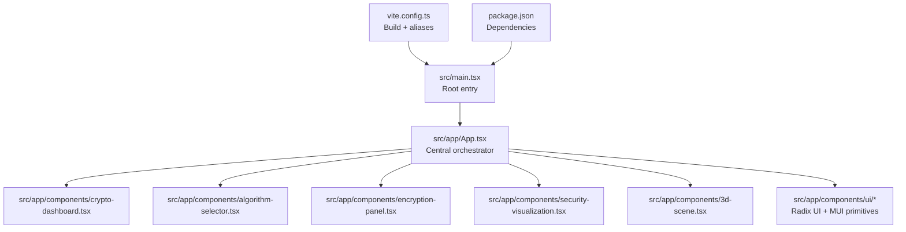
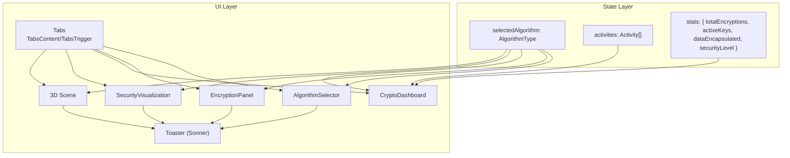
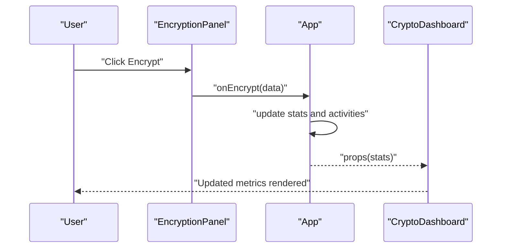
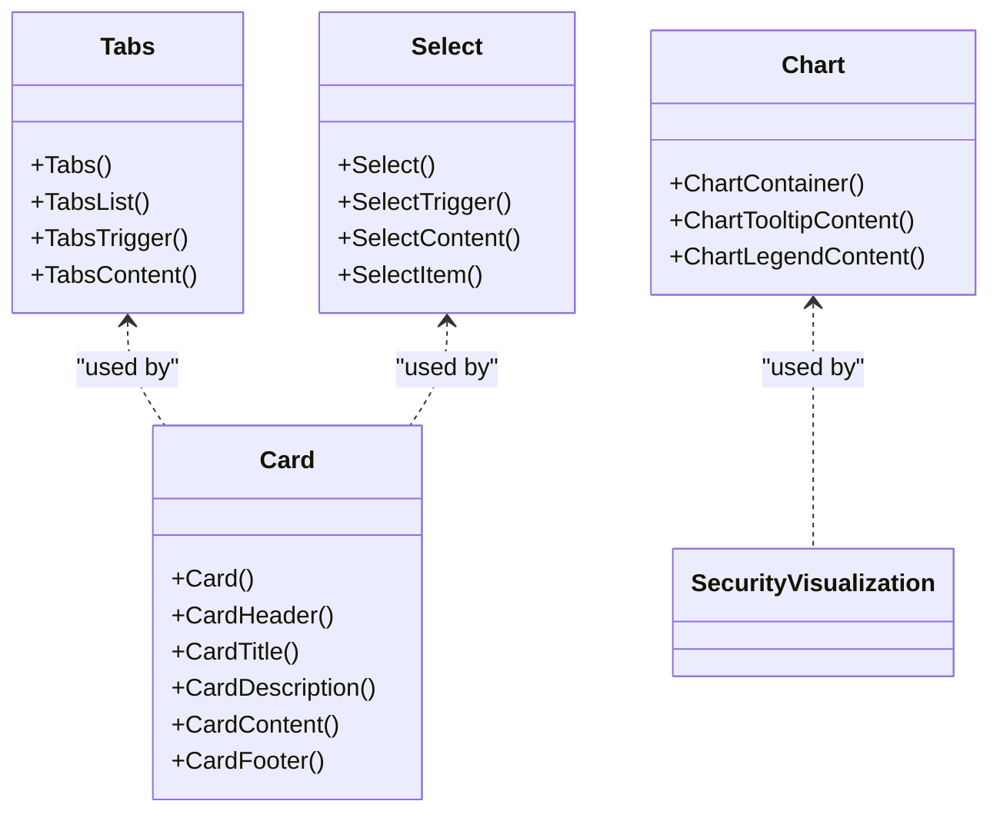
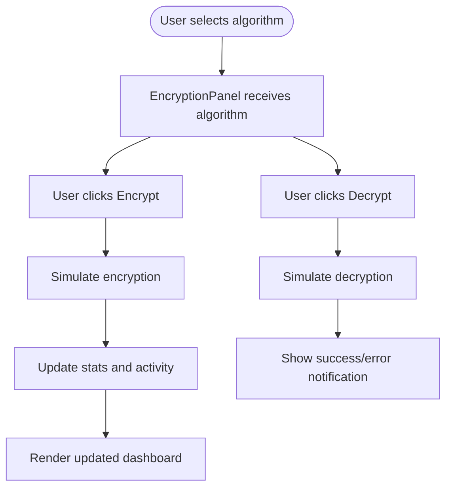
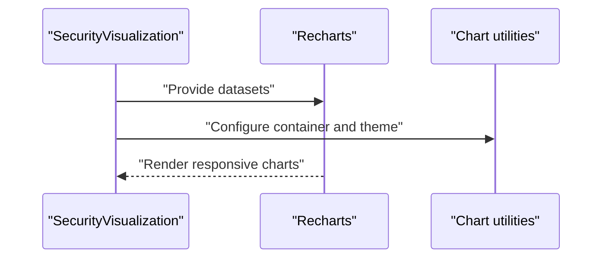
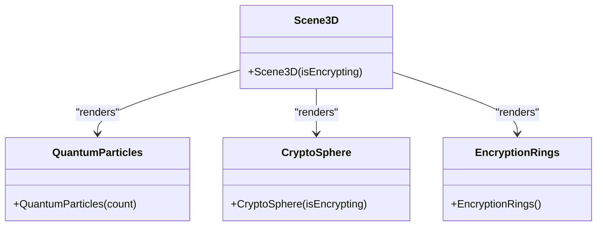
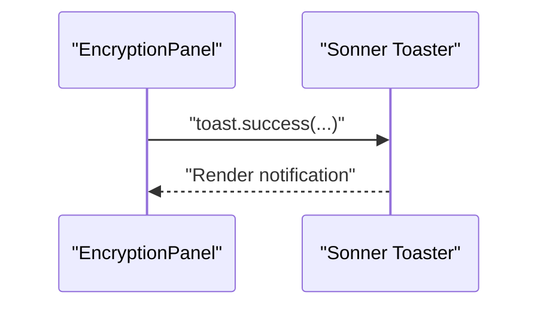
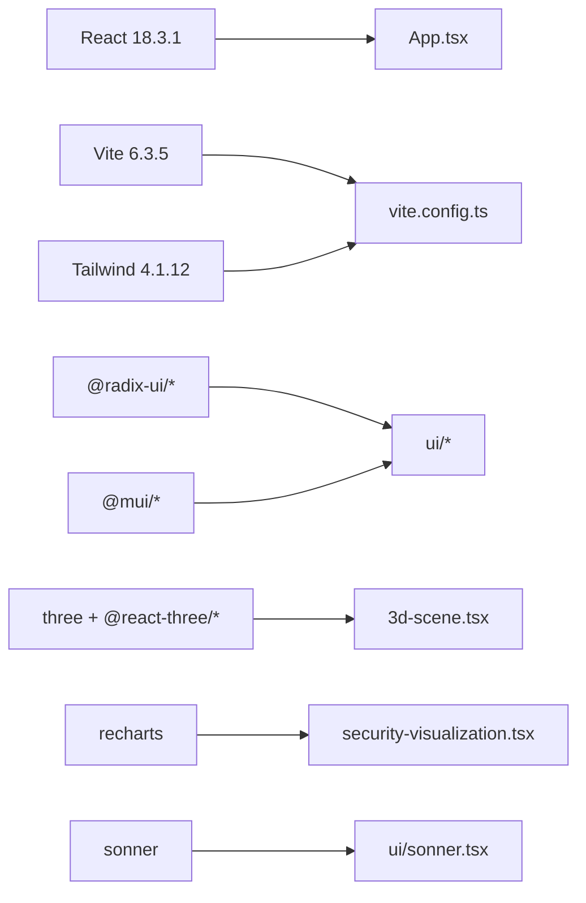

# Architecture Overview

<cite>
**Referenced Files in This Document**
- [App.tsx](file://src/app/App.tsx)
- [main.tsx](file://src/main.tsx)
- [vite.config.ts](file://vite.config.ts)
- [package.json](file://package.json)
- [README.md](file://README.md)
- [crypto-dashboard.tsx](file://src/app/components/crypto-dashboard.tsx)
- [algorithm-selector.tsx](file://src/app/components/algorithm-selector.tsx)
- [encryption-panel.tsx](file://src/app/components/encryption-panel.tsx)
- [security-visualization.tsx](file://src/app/components/security-visualization.tsx)
- [3d-scene.tsx](file://src/app/components/3d-scene.tsx)
- [ui/tabs.tsx](file://src/app/components/ui/tabs.tsx)
- [ui/card.tsx](file://src/app/components/ui/card.tsx)
- [ui/select.tsx](file://src/app/components/ui/select.tsx)
- [ui/chart.tsx](file://src/app/components/ui/chart.tsx)
- [ui/sonner.tsx](file://src/app/components/ui/sonner.tsx)
</cite>

## Table of Contents
1. [Introduction](#introduction)
2. [Project Structure](#project-structure)
3. [Core Components](#core-components)
4. [Architecture Overview](#architecture-overview)
5. [Detailed Component Analysis](#detailed-component-analysis)
6. [Dependency Analysis](#dependency-analysis)
7. [Performance Considerations](#performance-considerations)
8. [Troubleshooting Guide](#troubleshooting-guide)
9. [Conclusion](#conclusion)

## Introduction
This document describes the architecture of the Post-Quantum Cryptography Educational Platform, a React-based application built with Vite. The platform demonstrates quantum-resistant cryptographic algorithms through interactive educational features, including encryption demonstrations, analytics visualization, and immersive 3D experiences. It uses a centralized state management pattern in the root component to coordinate feature areas while maintaining a clean separation between educational content and cryptographic demonstrations.

## Project Structure
The project follows a feature-centric layout under src/app/components, with shared UI primitives in src/app/components/ui. The build pipeline is powered by Vite with Tailwind CSS and React Fast Refresh enabled. The entry point initializes the root React element and mounts the App component.

**Diagram sources**
- [main.tsx](file://src/main.tsx#L1-L7)
- [App.tsx](file://src/app/App.tsx#L1-L362)
- [crypto-dashboard.tsx](file://src/app/components/crypto-dashboard.tsx#L1-L70)
- [algorithm-selector.tsx](file://src/app/components/algorithm-selector.tsx#L1-L121)
- [encryption-panel.tsx](file://src/app/components/encryption-panel.tsx#L1-L238)
- [security-visualization.tsx](file://src/app/components/security-visualization.tsx#L1-L107)
- [3d-scene.tsx](file://src/app/components/3d-scene.tsx#L1-L151)
- [vite.config.ts](file://vite.config.ts#L1-L23)
- [package.json](file://package.json#L1-L93)

**Section sources**
- [main.tsx](file://src/main.tsx#L1-L7)
- [vite.config.ts](file://vite.config.ts#L1-L23)
- [package.json](file://package.json#L1-L93)

## Core Components
- Central orchestrator: App.tsx manages global state (selected algorithm, activity log, dashboard stats) and renders feature tabs. It coordinates cross-cutting UI elements like notifications and animated backgrounds.
- Feature components:
  - AlgorithmSelector: Allows choosing among post-quantum algorithms and displays metadata.
  - EncryptionPanel: Demonstrates encryption/decryption with simulated operations and integrates notifications.
  - CryptoDashboard: Shows aggregated metrics for the session.
  - SecurityVisualization: Renders charts comparing classical and post-quantum security and algorithm performance.
  - 3D Scene: Provides an immersive visualization of quantum encryption concepts using Three.js and React Three Fiber.
- Shared UI primitives: Tabs, Card, Select, and chart utilities built on Radix UI and Recharts, styled with Tailwind and MUI.

**Section sources**
- [App.tsx](file://src/app/App.tsx#L1-L362)
- [algorithm-selector.tsx](file://src/app/components/algorithm-selector.tsx#L1-L121)
- [encryption-panel.tsx](file://src/app/components/encryption-panel.tsx#L1-L238)
- [crypto-dashboard.tsx](file://src/app/components/crypto-dashboard.tsx#L1-L70)
- [security-visualization.tsx](file://src/app/components/security-visualization.tsx#L1-L107)
- [3d-scene.tsx](file://src/app/components/3d-scene.tsx#L1-L151)
- [ui/tabs.tsx](file://src/app/components/ui/tabs.tsx#L1-L67)
- [ui/card.tsx](file://src/app/components/ui/card.tsx#L1-L93)
- [ui/select.tsx](file://src/app/components/ui/select.tsx#L1-L190)
- [ui/chart.tsx](file://src/app/components/ui/chart.tsx#L1-L354)
- [ui/sonner.tsx](file://src/app/components/ui/sonner.tsx#L1-L26)

## Architecture Overview
The platform employs a centralized state management pattern in App.tsx:
- Global state: selectedAlgorithm, activities, and stats.
- Event handlers: handleEncrypt, handleFileEncrypt, and addActivity update state and trigger downstream UI updates.
- Composition: Tabs orchestrate feature-specific panels that receive algorithm context and callbacks.

**Diagram sources**
- [App.tsx](file://src/app/App.tsx#L26-L91)
- [ui/tabs.tsx](file://src/app/components/ui/tabs.tsx#L1-L67)
- [algorithm-selector.tsx](file://src/app/components/algorithm-selector.tsx#L68-L71)
- [encryption-panel.tsx](file://src/app/components/encryption-panel.tsx#L10-L13)
- [crypto-dashboard.tsx](file://src/app/components/crypto-dashboard.tsx#L4-L11)
- [security-visualization.tsx](file://src/app/components/security-visualization.tsx#L24-L22)
- [3d-scene.tsx](file://src/app/components/3d-scene.tsx#L125-L123)
- [ui/sonner.tsx](file://src/app/components/ui/sonner.tsx#L6-L22)

## Detailed Component Analysis

### Centralized State Orchestration (App.tsx)
- Responsibilities:
  - Initialize and maintain selectedAlgorithm, activities, and stats.
  - Provide event handlers to update stats and append activity entries.
  - Render header, animated backgrounds, dashboard, and feature tabs.
  - Integrate notifications via Toaster.
- Patterns:
  - useState for local state.
  - useEffect for initial data seeding.
  - Callback props passed down to child components.

**Diagram sources**
- [App.tsx](file://src/app/App.tsx#L47-L63)
- [encryption-panel.tsx](file://src/app/components/encryption-panel.tsx#L10-L13)
- [crypto-dashboard.tsx](file://src/app/components/crypto-dashboard.tsx#L4-L11)

**Section sources**
- [App.tsx](file://src/app/App.tsx#L18-L91)

### Component Composition with Radix UI and Material-UI
- Radix UI primitives provide accessible, unstyled foundations:
  - Tabs, Select, Dialog, Tooltip, and others are composed into themed cards and forms.
- Material-UI components enhance iconography and theming:
  - Icons from @mui/icons-material integrate with Lucide icons for consistent UX.
- Utility modules:
  - ui/tabs.tsx, ui/card.tsx, ui/select.tsx, ui/chart.tsx encapsulate styling and behavior.

**Diagram sources**
- [ui/tabs.tsx](file://src/app/components/ui/tabs.tsx#L8-L64)
- [ui/card.tsx](file://src/app/components/ui/card.tsx#L5-L92)
- [ui/select.tsx](file://src/app/components/ui/select.tsx#L13-L189)
- [ui/chart.tsx](file://src/app/components/ui/chart.tsx#L37-L353)

**Section sources**
- [ui/tabs.tsx](file://src/app/components/ui/tabs.tsx#L1-L67)
- [ui/card.tsx](file://src/app/components/ui/card.tsx#L1-L93)
- [ui/select.tsx](file://src/app/components/ui/select.tsx#L1-L190)
- [ui/chart.tsx](file://src/app/components/ui/chart.tsx#L1-L354)

### Data Flow: Algorithm Selection to Encryption Demonstration
- AlgorithmSelector feeds selectedAlgorithm to EncryptionPanel and other algorithm-aware components.
- EncryptionPanel simulates encryption/decryption and triggers App-level handlers to update stats and activity logs.
- Notifications surface outcomes via Sonner Toaster.

**Diagram sources**
- [algorithm-selector.tsx](file://src/app/components/algorithm-selector.tsx#L68-L71)
- [encryption-panel.tsx](file://src/app/components/encryption-panel.tsx#L15-L86)
- [App.tsx](file://src/app/App.tsx#L47-L63)
- [ui/sonner.tsx](file://src/app/components/ui/sonner.tsx#L6-L22)

**Section sources**
- [algorithm-selector.tsx](file://src/app/components/algorithm-selector.tsx#L1-L121)
- [encryption-panel.tsx](file://src/app/components/encryption-panel.tsx#L1-L238)
- [App.tsx](file://src/app/App.tsx#L26-L91)
- [ui/sonner.tsx](file://src/app/components/ui/sonner.tsx#L1-L26)

### Analytics Visualization with Recharts
- SecurityVisualization renders two charts:
  - AreaChart: Classical vs Post-Quantum security strength over time.
  - BarChart: Algorithm performance comparison (encryption speed, security level).
- Chart theming and tooltips are handled via ui/chart.tsx utilities.

**Diagram sources**
- [security-visualization.tsx](file://src/app/components/security-visualization.tsx#L24-L103)
- [ui/chart.tsx](file://src/app/components/ui/chart.tsx#L37-L353)

**Section sources**
- [security-visualization.tsx](file://src/app/components/security-visualization.tsx#L1-L107)
- [ui/chart.tsx](file://src/app/components/ui/chart.tsx#L1-L354)

### 3D Visualization with Three.js and React Three Fiber
- Scene3D composes:
  - QuantumParticles: Instanced particle system with per-frame animations.
  - CryptoSphere: Rotating sphere whose color reacts to encryption state.
  - EncryptionRings: Multiple orbiting torus rings with emissive materials.
- Controls and lighting are configured for an immersive experience.

**Diagram sources**
- [3d-scene.tsx](file://src/app/components/3d-scene.tsx#L125-L149)

**Section sources**
- [3d-scene.tsx](file://src/app/components/3d-scene.tsx#L1-L151)

### Notification System with Sonner
- Toaster is integrated at the root level and themed via next-themes.
- Components trigger toast messages for user feedback during encryption/decryption and downloads.

**Diagram sources**
- [encryption-panel.tsx](file://src/app/components/encryption-panel.tsx#L47-L96)
- [ui/sonner.tsx](file://src/app/components/ui/sonner.tsx#L6-L22)

**Section sources**
- [ui/sonner.tsx](file://src/app/components/ui/sonner.tsx#L1-L26)
- [encryption-panel.tsx](file://src/app/components/encryption-panel.tsx#L1-L238)

### System Boundaries: Educational Content vs Demonstrations
- Educational content: AlgorithmSelector metadata, About section, and contextual descriptions.
- Demonstrations: EncryptionPanel simulations, 3D scenes, and analytics charts.
- Boundary enforcement: Components remain focused on either education (metadata, descriptions) or demonstration (interactive UI, visuals), with minimal cross-contamination.

[No sources needed since this section synthesizes boundaries conceptually]

## Dependency Analysis
The project relies on React 18, Vite, Tailwind CSS, and a curated set of UI libraries. Build-time aliases and plugins streamline development and asset handling.

**Diagram sources**
- [package.json](file://package.json#L10-L68)
- [vite.config.ts](file://vite.config.ts#L1-L23)
- [App.tsx](file://src/app/App.tsx#L1-L16)
- [3d-scene.tsx](file://src/app/components/3d-scene.tsx#L1-L4)
- [security-visualization.tsx](file://src/app/components/security-visualization.tsx#L1-L3)
- [ui/sonner.tsx](file://src/app/components/ui/sonner.tsx#L1-L4)

**Section sources**
- [package.json](file://package.json#L1-L93)
- [vite.config.ts](file://vite.config.ts#L1-L23)

## Performance Considerations
- React 18 and concurrent rendering:
  - Enables features like automatic batching and concurrent features that improve responsiveness during state updates.
- Memoization and instancing:
  - useFrame loops and instanced meshes in 3D scenes minimize re-renders and optimize GPU utilization.
- Animations:
  - Motion primitives are used for lightweight UI animations; avoid heavy computations in animation frames.
- Build and bundling:
  - Vite’s fast refresh and optimized plugin chain reduce cold starts and hot updates.
- Chart rendering:
  - Recharts’ responsive containers adapt to viewport changes without manual resize listeners.

[No sources needed since this section provides general guidance]

## Troubleshooting Guide
- Notifications not appearing:
  - Ensure Toaster is present in the root App and theme integration is working.
- Charts not rendering:
  - Verify datasets are properly shaped and ChartContainer wraps the chart components.
- 3D scene not visible:
  - Confirm Canvas is mounted and lighting/controls are configured; check browser console for Three.js errors.
- Algorithm selector not updating:
  - Verify callback prop wiring and that selectedAlgorithm is passed down to dependent components.

**Section sources**
- [ui/sonner.tsx](file://src/app/components/ui/sonner.tsx#L6-L22)
- [ui/chart.tsx](file://src/app/components/ui/chart.tsx#L37-L70)
- [3d-scene.tsx](file://src/app/components/3d-scene.tsx#L125-L149)
- [algorithm-selector.tsx](file://src/app/components/algorithm-selector.tsx#L68-L71)

## Conclusion
The Post-Quantum Cryptography Educational Platform leverages a clean, modular architecture centered on App.tsx for state orchestration. It combines Radix UI and Material-UI primitives with Recharts and Three.js to deliver an engaging, educational experience. The design supports easy expansion of algorithms and features while maintaining strong separation between educational content and interactive demonstrations.