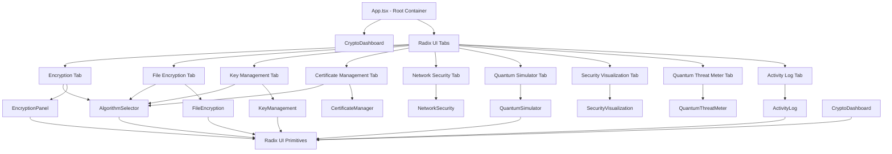
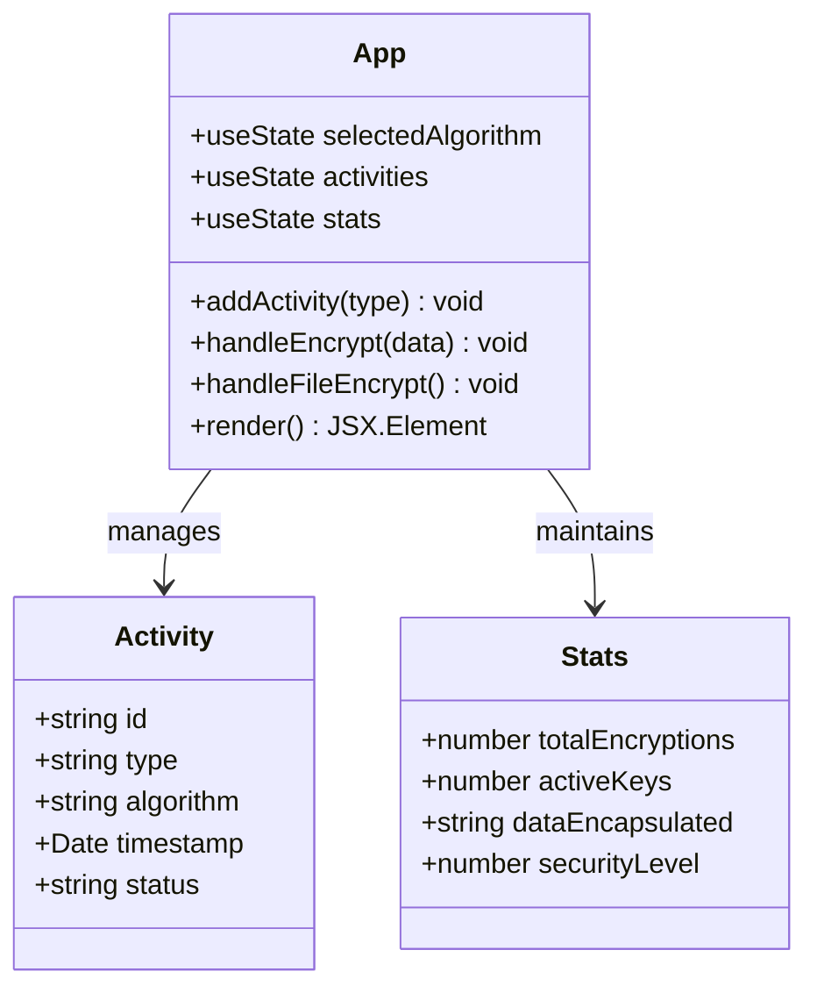
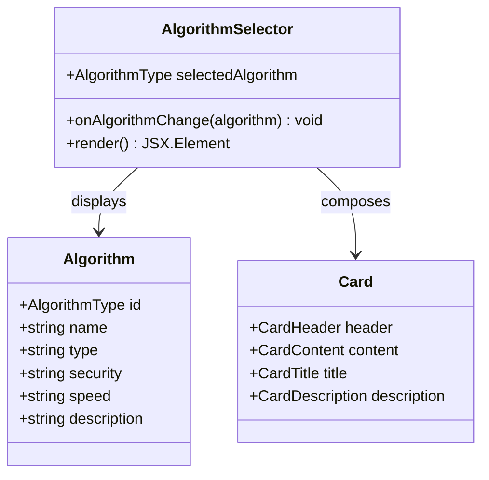
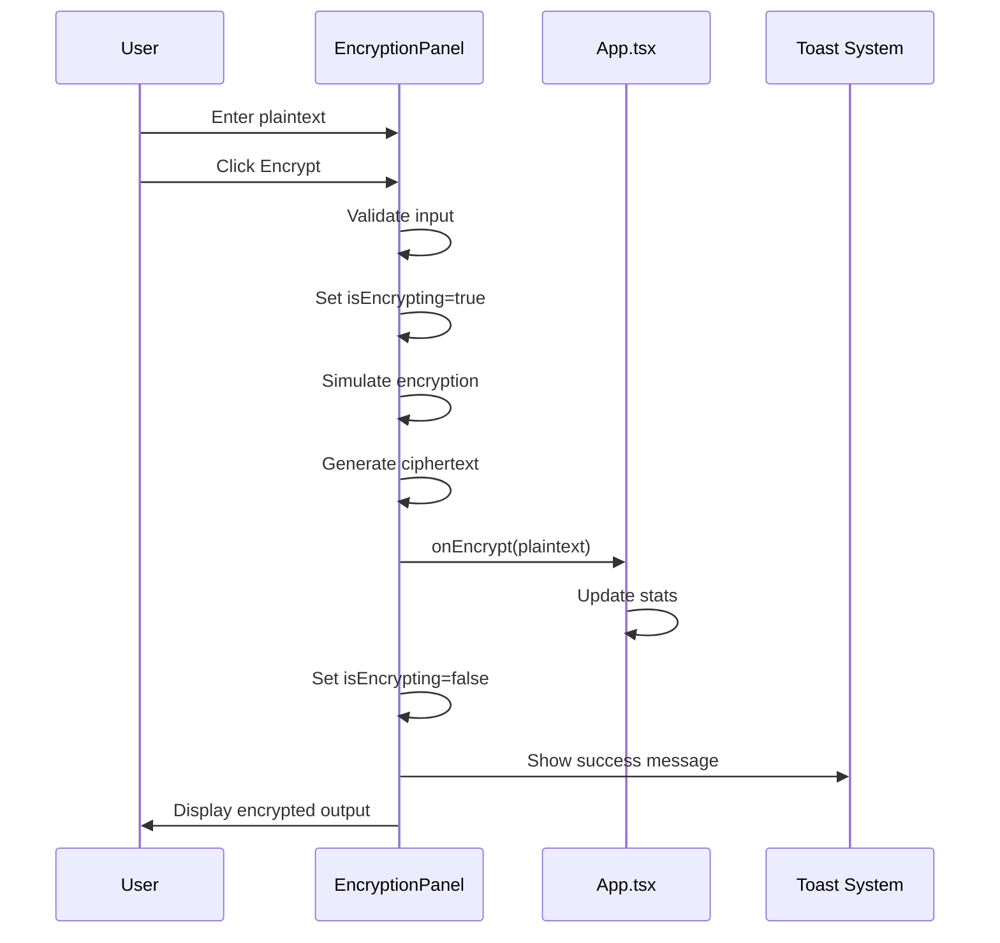
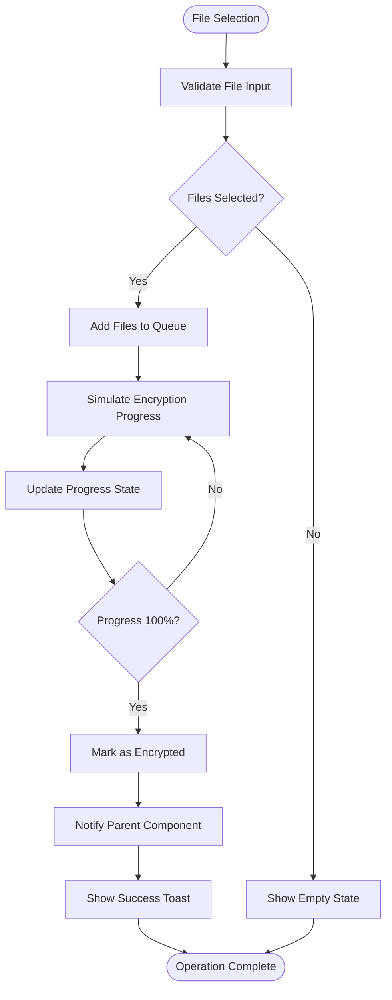
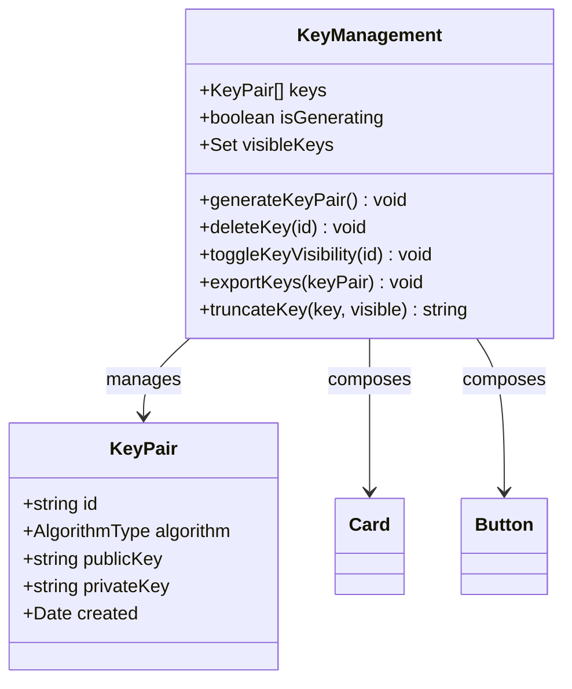
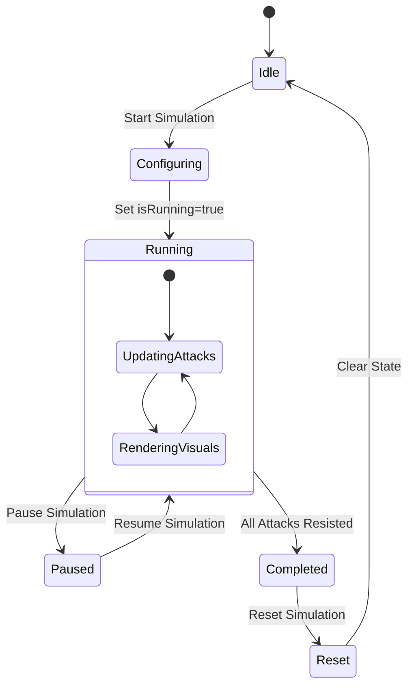
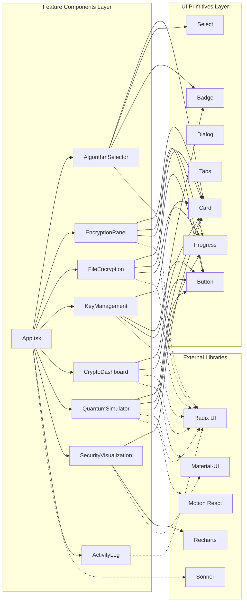

# Component Hierarchy

<cite>
**Referenced Files in This Document**
- [App.tsx](file://Design/src/app/App.tsx)
- [algorithm-selector.tsx](file://Design/src/app/components/algorithm-selector.tsx)
- [encryption-panel.tsx](file://Design/src/app/components/encryption-panel.tsx)
- [file-encryption.tsx](file://Design/src/app/components/file-encryption.tsx)
- [key-management.tsx](file://Design/src/app/components/key-management.tsx)
- [crypto-dashboard.tsx](file://Design/src/app/components/crypto-dashboard.tsx)
- [quantum-simulator.tsx](file://Design/src/app/components/quantum-simulator.tsx)
- [security-visualization.tsx](file://Design/src/app/components/security-visualization.tsx)
- [activity-log.tsx](file://Design/src/app/components/activity-log.tsx)
- [button.tsx](file://Design/src/app/components/ui/button.tsx)
- [card.tsx](file://Design/src/app/components/ui/card.tsx)
- [dialog.tsx](file://Design/src/app/components/ui/dialog.tsx)
- [tabs.tsx](file://Design/src/app/components/ui/tabs.tsx)
- [package.json](file://Design/package.json)
</cite>

## Table of Contents
1. [Introduction](#introduction)
2. [Project Structure](#project-structure)
3. [Core Components](#core-components)
4. [Architecture Overview](#architecture-overview)
5. [Detailed Component Analysis](#detailed-component-analysis)
6. [Dependency Analysis](#dependency-analysis)
7. [Performance Considerations](#performance-considerations)
8. [Troubleshooting Guide](#troubleshooting-guide)
9. [Conclusion](#conclusion)

## Introduction
This document provides a comprehensive component hierarchy analysis for the educational platform's UI architecture. The system centers around App.tsx as the root container, orchestrating algorithm selection, encryption panels, dashboard components, and specialized features like quantum simulators. The architecture leverages Radix UI primitives for accessibility and Material-UI for enhanced components, demonstrating clear component composition patterns and centralized state management.

## Project Structure
The educational platform follows a feature-based organization with a clear separation between UI primitives and feature components:

```mermaid
graph TB
subgraph "Root Container"
App[App.tsx]
end
subgraph "UI Primitives (Radix UI)"
Button[button.tsx]
Card[card.tsx]
Dialog[dialog.tsx]
Tabs[tabs.tsx]
end
subgraph "Feature Components"
AlgorithmSelector[algorithm-selector.tsx]
EncryptionPanel[encryption-panel.tsx]
FileEncryption[file-encryption.tsx]
KeyManagement[key-management.tsx]
CryptoDashboard[crypto-dashboard.tsx]
QuantumSimulator[quantum-simulator.tsx]
SecurityVisualization[security-visualization.tsx]
ActivityLog[activity-log.tsx]
end
subgraph "External Dependencies"
RadixUI[Radix UI Primitives]
MaterialUI[Material-UI Components]
Recharts[Recharts Library]
Motion[Motion React]
end
App --> AlgorithmSelector
App --> EncryptionPanel
App --> FileEncryption
App --> KeyManagement
App --> CryptoDashboard
App --> QuantumSimulator
App --> SecurityVisualization
App --> ActivityLog
AlgorithmSelector --> Card
AlgorithmSelector --> Button
AlgorithmSelector --> Dialog
EncryptionPanel --> Card
EncryptionPanel --> Button
EncryptionPanel --> Dialog
FileEncryption --> Card
FileEncryption --> Button
FileEncryption --> Dialog
KeyManagement --> Card
KeyManagement --> Button
KeyManagement --> Dialog
CryptoDashboard --> Card
CryptoDashboard --> Button
QuantumSimulator --> Card
QuantumSimulator --> Button
QuantumSimulator --> Dialog
SecurityVisualization --> Card
SecurityVisualization --> Recharts
AlgorithmSelector -.-> RadixUI
EncryptionPanel -.-> RadixUI
FileEncryption -.-> RadixUI
KeyManagement -.-> RadixUI
CryptoDashboard -.-> RadixUI
QuantumSimulator -.-> RadixUI
ActivityLog -.-> RadixUI
SecurityVisualization -.-> MaterialUI
CryptoDashboard -.-> MaterialUI
QuantumSimulator -.-> Motion
```

**Diagram sources**
- [App.tsx](file://Design/src/app/App.tsx#L26-L360)
- [algorithm-selector.tsx](file://Design/src/app/components/algorithm-selector.tsx#L1-L121)
- [button.tsx](file://Design/src/app/components/ui/button.tsx#L1-L58)
- [card.tsx](file://Design/src/app/components/ui/card.tsx#L1-L93)
- [dialog.tsx](file://Design/src/app/components/ui/dialog.tsx#L1-L136)
- [tabs.tsx](file://Design/src/app/components/ui/tabs.tsx#L1-L67)

**Section sources**
- [App.tsx](file://Design/src/app/App.tsx#L1-L362)
- [package.json](file://Design/package.json#L10-L68)

## Core Components
The core components form the foundation of the educational platform's UI architecture:

### Centralized State Management in App.tsx
App.tsx serves as the primary state orchestrator, managing:
- Selected algorithm state with AlgorithmType typing
- Activity tracking with timestamped events
- Dashboard statistics including encryption counts and security metrics
- Tab navigation state for feature organization

### Algorithm Selection System
The AlgorithmSelector component provides:
- Comprehensive algorithm catalog with security levels and performance metrics
- Real-time algorithm information display
- Type-safe algorithm switching with proper TypeScript integration

### Encryption Workflow Components
Two complementary encryption systems demonstrate different approaches:
- Text-based encryption panel for direct data manipulation
- File-based encryption for bulk data processing with progress tracking

**Section sources**
- [App.tsx](file://Design/src/app/App.tsx#L26-L91)
- [algorithm-selector.tsx](file://Design/src/app/components/algorithm-selector.tsx#L6-L66)
- [encryption-panel.tsx](file://Design/src/app/components/encryption-panel.tsx#L15-L44)

## Architecture Overview
The system employs a hierarchical component architecture with clear separation of concerns:

**Diagram sources**
- [App.tsx](file://Design/src/app/App.tsx#L208-L316)
- [algorithm-selector.tsx](file://Design/src/app/components/algorithm-selector.tsx#L73-L120)
- [encryption-panel.tsx](file://Design/src/app/components/encryption-panel.tsx#L15-L237)

## Detailed Component Analysis

### App.tsx - Root Container Architecture
App.tsx implements a sophisticated state management pattern with centralized coordination:

**Diagram sources**
- [App.tsx](file://Design/src/app/App.tsx#L18-L34)
- [App.tsx](file://Design/src/app/App.tsx#L26-L63)

The component demonstrates:
- **Centralized State**: All state managed in a single location
- **Event Propagation**: Functions passed down as props to child components
- **Performance Optimization**: Initial data seeding prevents unnecessary re-renders
- **Accessibility**: Radix UI integration ensures screen reader compatibility

### Algorithm Selector Component
The AlgorithmSelector component exemplifies the composition pattern:

**Diagram sources**
- [algorithm-selector.tsx](file://Design/src/app/components/algorithm-selector.tsx#L68-L71)
- [algorithm-selector.tsx](file://Design/src/app/components/algorithm-selector.tsx#L8-L15)

Key implementation patterns:
- **Type Safety**: Strongly typed algorithm selection
- **Composition**: Uses Card primitive for consistent UI
- **Dynamic Content**: Real-time algorithm information display
- **Event Handling**: Bidirectional communication with parent

### Encryption Panel Component
The EncryptionPanel demonstrates complex state management and user interaction patterns:

**Diagram sources**
- [encryption-panel.tsx](file://Design/src/app/components/encryption-panel.tsx#L45-L61)
- [App.tsx](file://Design/src/app/App.tsx#L47-L54)

**Section sources**
- [App.tsx](file://Design/src/app/App.tsx#L26-L91)
- [algorithm-selector.tsx](file://Design/src/app/components/algorithm-selector.tsx#L73-L120)
- [encryption-panel.tsx](file://Design/src/app/components/encryption-panel.tsx#L15-L237)

### File Encryption Component
The FileEncryption component showcases advanced state management for bulk operations:

**Diagram sources**
- [file-encryption.tsx](file://Design/src/app/components/file-encryption.tsx#L69-L87)
- [file-encryption.tsx](file://Design/src/app/components/file-encryption.tsx#L43-L67)

**Section sources**
- [file-encryption.tsx](file://Design/src/app/components/file-encryption.tsx#L24-L228)

### Key Management Component
The KeyManagement component demonstrates secure state handling and user privacy:

**Diagram sources**
- [key-management.tsx](file://Design/src/app/components/key-management.tsx#L18-L20)
- [key-management.tsx](file://Design/src/app/components/key-management.tsx#L10-L16)

**Section sources**
- [key-management.tsx](file://Design/src/app/components/key-management.tsx#L22-L220)

### Quantum Simulator Component
The QuantumSimulator represents the most complex component with real-time animation and simulation:

**Diagram sources**
- [quantum-simulator.tsx](file://Design/src/app/components/quantum-simulator.tsx#L17-L79)
- [quantum-simulator.tsx](file://Design/src/app/components/quantum-simulator.tsx#L25-L48)

**Section sources**
- [quantum-simulator.tsx](file://Design/src/app/components/quantum-simulator.tsx#L17-L316)

## Dependency Analysis
The component hierarchy demonstrates clear dependency relationships and architectural patterns:

**Diagram sources**
- [App.tsx](file://Design/src/app/App.tsx#L1-L16)
- [algorithm-selector.tsx](file://Design/src/app/components/algorithm-selector.tsx#L1-L4)
- [button.tsx](file://Design/src/app/components/ui/button.tsx#L1-L58)

**Section sources**
- [package.json](file://Design/package.json#L10-L68)
- [App.tsx](file://Design/src/app/App.tsx#L1-L16)

## Performance Considerations
The educational platform implements several performance optimization strategies:

### State Management Optimization
- **Centralized State**: Reduces prop drilling by maintaining state in App.tsx
- **Selective Updates**: Child components receive only necessary props
- **Efficient List Rendering**: Activity logs use virtualized scrolling for large datasets

### Animation and Rendering Performance
- **Motion Integration**: Optimized animations using Motion React for smooth transitions
- **Conditional Rendering**: Components render only when needed
- **Debounced Updates**: Algorithm selector updates reactively without excessive re-renders

### Memory Management
- **Cleanup Functions**: Quantum simulator includes proper cleanup for intervals
- **Resource Management**: File encryption properly revokes object URLs
- **State Optimization**: Component-specific state isolated from global state

### Accessibility Features
- **Radix UI Integration**: Ensures screen reader compatibility and keyboard navigation
- **Semantic HTML**: Proper use of HTML semantics for assistive technologies
- **Focus Management**: Controlled focus states for interactive elements

## Troubleshooting Guide
Common issues and solutions within the component hierarchy:

### State Synchronization Issues
**Problem**: Algorithm changes not reflected across components
**Solution**: Verify prop drilling from App.tsx to child components and ensure proper state updates

### Performance Bottlenecks
**Problem**: Slow rendering with large activity logs
**Solution**: Implement virtualization or pagination for activity logs; optimize animation frequencies

### Animation Performance
**Problem**: Stuttering animations in quantum simulator
**Solution**: Adjust animation timing and reduce complexity; consider throttling animation updates

### Memory Leaks
**Problem**: Intervals not cleared in quantum simulator
**Solution**: Ensure proper cleanup in useEffect return functions

### Component Communication
**Problem**: Difficulty passing data between unrelated components
**Solution**: Use centralized state management in App.tsx or implement a lightweight event system

**Section sources**
- [quantum-simulator.tsx](file://Design/src/app/components/quantum-simulator.tsx#L25-L48)
- [file-encryption.tsx](file://Design/src/app/components/file-encryption.tsx#L89-L100)

## Conclusion
The educational platform's UI architecture demonstrates a well-structured component hierarchy with clear separation of concerns and robust state management. The App.tsx root container effectively orchestrates multiple specialized components while maintaining accessibility standards through Radix UI integration. The architecture successfully balances educational value with practical UI patterns, providing a solid foundation for extending the platform with additional cryptographic demonstrations and educational features.

The implementation showcases modern React patterns including centralized state management, component composition, and performance optimization strategies. The integration of Radix UI primitives ensures accessibility compliance while Material-UI components enhance the user experience with sophisticated visualizations and interactions.