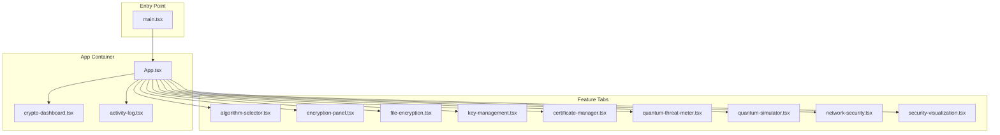
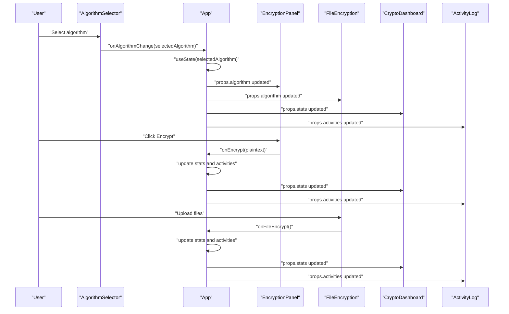
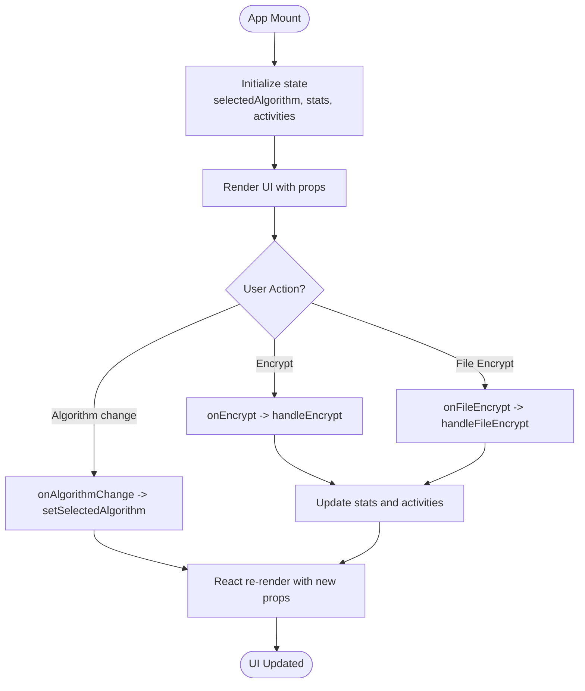
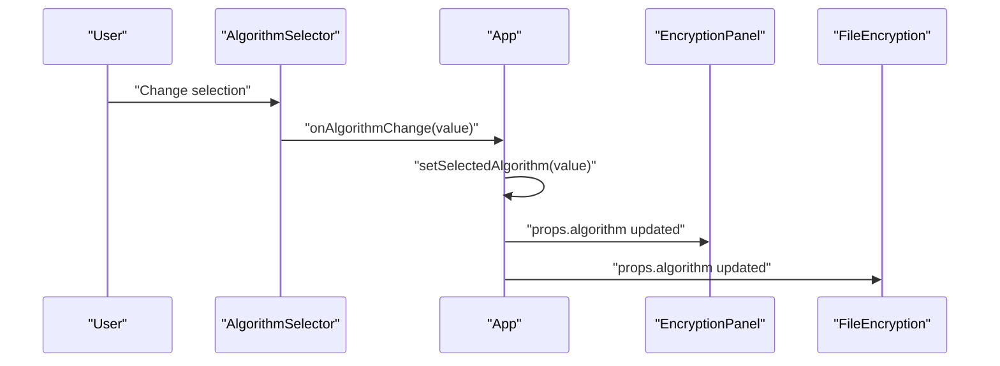
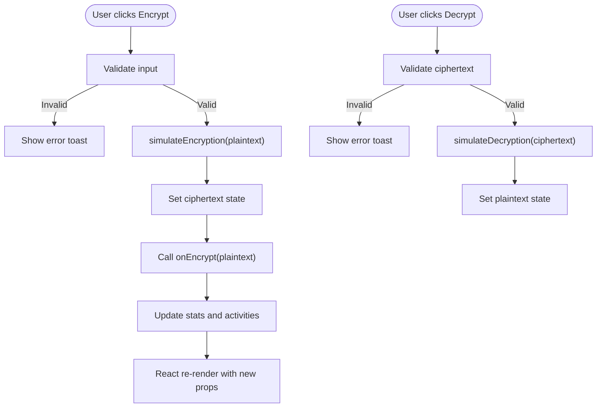
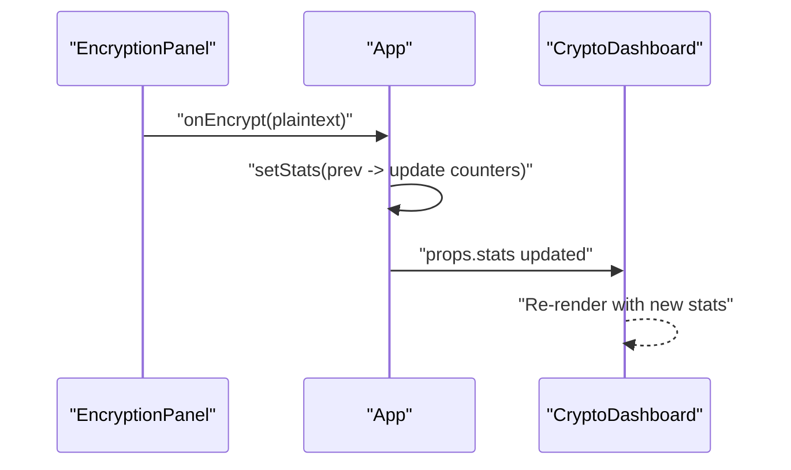
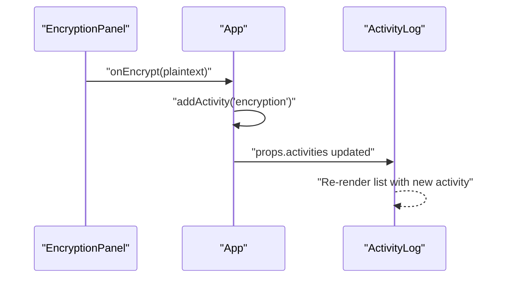
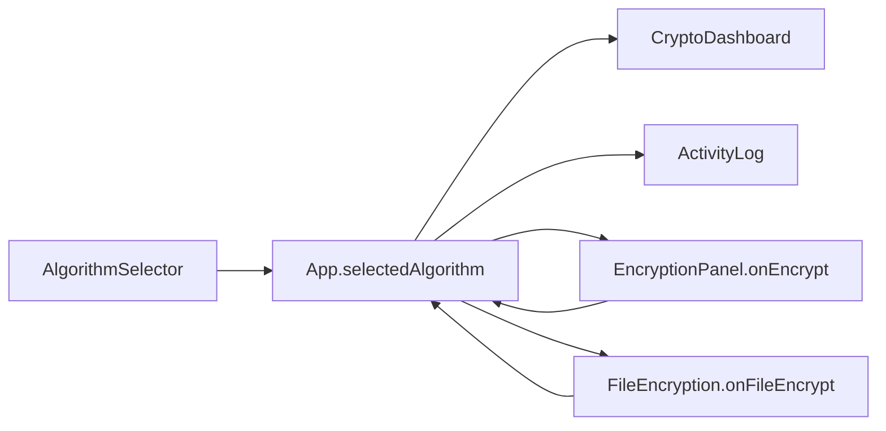
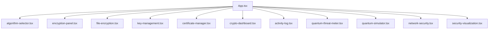

# Data Flow Patterns

<cite>
**Referenced Files in This Document**
- [App.tsx](file://Design/src/app/App.tsx)
- [algorithm-selector.tsx](file://Design/src/app/components/algorithm-selector.tsx)
- [crypto-dashboard.tsx](file://Design/src/app/components/crypto-dashboard.tsx)
- [encryption-panel.tsx](file://Design/src/app/components/encryption-panel.tsx)
- [file-encryption.tsx](file://Design/src/app/components/file-encryption.tsx)
- [key-management.tsx](file://Design/src/app/components/key-management.tsx)
- [certificate-manager.tsx](file://Design/src/app/components/certificate-manager.tsx)
- [activity-log.tsx](file://Design/src/app/components/activity-log.tsx)
- [quantum-threat-meter.tsx](file://Design/src/app/components/quantum-threat-meter.tsx)
- [quantum-simulator.tsx](file://Design/src/app/components/quantum-simulator.tsx)
- [security-visualization.tsx](file://Design/src/app/components/security-visualization.tsx)
- [network-security.tsx](file://Design/src/app/components/network-security.tsx)
- [main.tsx](file://Design/src/main.tsx)
</cite>

## Table of Contents
1. [Introduction](#introduction)
2. [Project Structure](#project-structure)
3. [Core Components](#core-components)
4. [Architecture Overview](#architecture-overview)
5. [Detailed Component Analysis](#detailed-component-analysis)
6. [Dependency Analysis](#dependency-analysis)
7. [Performance Considerations](#performance-considerations)
8. [Troubleshooting Guide](#troubleshooting-guide)
9. [Conclusion](#conclusion)

## Introduction
This document explains the data flow architecture of the educational platform, focusing on centralized state management and real-time propagation across components. It details how user selections from the AlgorithmSelector flow through the system to all feature components, how encryption operations update dashboard statistics and activity logs, and how the observer-like pattern ensures consistent UI updates. It also documents the cryptographic transformation pipeline and synchronization mechanisms that maintain consistency during demonstrations.

## Project Structure
The application follows a component-based architecture with a central App container managing shared state. Feature components are organized under src/app/components and rendered within App’s tabbed interface. The main entry point initializes the React root and mounts App.

**Diagram sources**
- [main.tsx](file://Design/src/main.tsx#L1-L7)
- [App.tsx](file://Design/src/app/App.tsx#L1-L362)
- [crypto-dashboard.tsx](file://Design/src/app/components/crypto-dashboard.tsx#L1-L70)
- [activity-log.tsx](file://Design/src/app/components/activity-log.tsx#L1-L117)
- [algorithm-selector.tsx](file://Design/src/app/components/algorithm-selector.tsx#L1-L121)
- [encryption-panel.tsx](file://Design/src/app/components/encryption-panel.tsx#L1-L238)
- [file-encryption.tsx](file://Design/src/app/components/file-encryption.tsx#L1-L229)
- [key-management.tsx](file://Design/src/app/components/key-management.tsx#L1-L221)
- [certificate-manager.tsx](file://Design/src/app/components/certificate-manager.tsx#L1-L295)
- [quantum-threat-meter.tsx](file://Design/src/app/components/quantum-threat-meter.tsx#L1-L149)
- [quantum-simulator.tsx](file://Design/src/app/components/quantum-simulator.tsx#L1-L316)
- [security-visualization.tsx](file://Design/src/app/components/security-visualization.tsx#L1-L107)
- [network-security.tsx](file://Design/src/app/components/network-security.tsx#L1-L303)

**Section sources**
- [main.tsx](file://Design/src/main.tsx#L1-L7)
- [App.tsx](file://Design/src/app/App.tsx#L1-L362)

## Core Components
- Centralized state in App.tsx:
  - selectedAlgorithm: Tracks the active PQC algorithm across tabs.
  - stats: Dashboard metrics including totalEncryptions, activeKeys, dataEncapsulated, and securityLevel.
  - activities: Recent cryptographic operations log.
- Event handlers:
  - handleEncrypt(data): Updates stats and adds an encryption activity.
  - handleFileEncrypt(): Updates stats and adds an encryption activity for file operations.
  - addActivity(type): Creates a new activity record with algorithm and timestamp.
- Child components receive props:
  - AlgorithmSelector receives selectedAlgorithm and onAlgorithmChange to propagate user selection.
  - EncryptionPanel receives algorithm and onEncrypt to trigger stats updates.
  - FileEncryption receives algorithm and onFileEncrypt to trigger stats updates.
  - CryptoDashboard receives stats to render live metrics.
  - ActivityLog receives activities to render recent events.

**Section sources**
- [App.tsx](file://Design/src/app/App.tsx#L26-L91)

## Architecture Overview
The system implements a centralized state management pattern with unidirectional data flow:
- User interactions occur in child components (AlgorithmSelector, EncryptionPanel, FileEncryption).
- Child components call parent-provided callbacks to update App state.
- App state updates trigger React re-renders, propagating new props to all children.
- Real-time updates are achieved through immediate state mutations and useEffect for initialization.

**Diagram sources**
- [App.tsx](file://Design/src/app/App.tsx#L26-L91)
- [algorithm-selector.tsx](file://Design/src/app/components/algorithm-selector.tsx#L68-L71)
- [encryption-panel.tsx](file://Design/src/app/components/encryption-panel.tsx#L10-L13)
- [file-encryption.tsx](file://Design/src/app/components/file-encryption.tsx#L19-L22)
- [crypto-dashboard.tsx](file://Design/src/app/components/crypto-dashboard.tsx#L4-L11)
- [activity-log.tsx](file://Design/src/app/components/activity-log.tsx#L15-L17)

## Detailed Component Analysis

### Centralized State Management in App.tsx
- State declarations:
  - selectedAlgorithm: AlgorithmType union, defaulting to a PQC algorithm.
  - stats: Numeric metrics for dashboard.
  - activities: Array of Activity records.
- Event handlers:
  - handleEncrypt(data): Increments totalEncryptions and aggregates dataEncapsulated based on plaintext length; adds an encryption activity.
  - handleFileEncrypt(): Increments counters and adds an encryption activity for file operations.
  - addActivity(type): Constructs a new Activity with type, selectedAlgorithm, timestamp, and success status; limits to latest 50 entries.
- Initialization:
  - useEffect sets initial activities for demonstration purposes.

**Diagram sources**
- [App.tsx](file://Design/src/app/App.tsx#L26-L91)

**Section sources**
- [App.tsx](file://Design/src/app/App.tsx#L26-L91)

### AlgorithmSelector to Feature Components
- Props:
  - selectedAlgorithm: Current algorithm selection.
  - onAlgorithmChange: Callback to update App state.
- Behavior:
  - Uses a Select component to present available algorithms.
  - Passes the chosen algorithm to parent via onAlgorithmChange.
- Propagation:
  - App updates selectedAlgorithm, which is passed down to EncryptionPanel, FileEncryption, KeyManagement, and CertificateManager.

**Diagram sources**
- [algorithm-selector.tsx](file://Design/src/app/components/algorithm-selector.tsx#L68-L71)
- [App.tsx](file://Design/src/app/App.tsx#L252-L259)

**Section sources**
- [algorithm-selector.tsx](file://Design/src/app/components/algorithm-selector.tsx#L68-L71)
- [App.tsx](file://Design/src/app/App.tsx#L252-L259)

### Encryption Operations Pipeline
- Text encryption:
  - EncryptionPanel simulates encryption by transforming plaintext into a formatted ciphertext string and triggers onEncrypt to update stats and activities.
- File encryption:
  - FileEncryption simulates per-file encryption progress and calls onFileEncrypt upon completion to update stats and activities.
- Decryption:
  - EncryptionPanel simulates decryption by extracting the original payload from the simulated ciphertext.

**Diagram sources**
- [encryption-panel.tsx](file://Design/src/app/components/encryption-panel.tsx#L45-L78)
- [App.tsx](file://Design/src/app/App.tsx#L47-L54)

**Section sources**
- [encryption-panel.tsx](file://Design/src/app/components/encryption-panel.tsx#L15-L78)
- [App.tsx](file://Design/src/app/App.tsx#L47-L63)

### Dashboard Statistics Updates
- Live metrics:
  - CryptoDashboard displays totalEncryptions, activeKeys, dataEncapsulated, and securityLevel.
- Real-time updates:
  - App updates stats immediately upon encryption actions; CryptoDashboard re-renders with new values.

**Diagram sources**
- [App.tsx](file://Design/src/app/App.tsx#L47-L54)
- [crypto-dashboard.tsx](file://Design/src/app/components/crypto-dashboard.tsx#L4-L11)

**Section sources**
- [App.tsx](file://Design/src/app/App.tsx#L29-L34)
- [crypto-dashboard.tsx](file://Design/src/app/components/crypto-dashboard.tsx#L13-L68)

### Activity Logging and Observer Pattern
- Activity creation:
  - addActivity(type) constructs a new Activity with algorithm, timestamp, and success status.
- Real-time rendering:
  - ActivityLog renders the latest 50 activities, sorted newest-first.
- Observer-like behavior:
  - App state changes propagate to ActivityLog via props; no explicit subscription is needed—React’s declarative updates serve as the observer mechanism.

**Diagram sources**
- [App.tsx](file://Design/src/app/App.tsx#L36-L45)
- [activity-log.tsx](file://Design/src/app/components/activity-log.tsx#L40-L117)

**Section sources**
- [App.tsx](file://Design/src/app/App.tsx#L36-L45)
- [activity-log.tsx](file://Design/src/app/components/activity-log.tsx#L40-L117)

### State Synchronization Across Components
- Algorithm synchronization:
  - AlgorithmSelector updates App.selectedAlgorithm; all tabs consuming algorithm prop reflect the change immediately.
- Stats synchronization:
  - EncryptionPanel and FileEncryption call onEncrypt/onFileEncrypt; App updates stats and passes new values to CryptoDashboard.
- Activity synchronization:
  - Both encryption paths call addActivity; App updates activities and passes new values to ActivityLog.

**Diagram sources**
- [App.tsx](file://Design/src/app/App.tsx#L252-L259)
- [App.tsx](file://Design/src/app/App.tsx#L263-L272)
- [App.tsx](file://Design/src/app/App.tsx#L205-L205)
- [App.tsx](file://Design/src/app/App.tsx#L314-L314)

**Section sources**
- [App.tsx](file://Design/src/app/App.tsx#L252-L272)
- [App.tsx](file://Design/src/app/App.tsx#L205-L205)
- [App.tsx](file://Design/src/app/App.tsx#L314-L314)

### Additional Features and Data Flow
- Key Management:
  - Generates key pairs and manages visibility; does not directly modify App stats but demonstrates PQC key usage.
- Certificate Manager:
  - Creates and exports certificates; does not directly modify App stats.
- Quantum Threat Meter and Simulator:
  - Provide contextual insights; do not mutate App state.
- Network Security:
  - Simulates scanning and upgrading nodes; does not mutate App stats.
- Security Visualization:
  - Renders static charts; does not mutate App state.

These components complement the core data flow by providing educational context and auxiliary demonstrations without altering the centralized state.

**Section sources**
- [key-management.tsx](file://Design/src/app/components/key-management.tsx#L22-L49)
- [certificate-manager.tsx](file://Design/src/app/components/certificate-manager.tsx#L27-L80)
- [quantum-threat-meter.tsx](file://Design/src/app/components/quantum-threat-meter.tsx#L40-L52)
- [quantum-simulator.tsx](file://Design/src/app/components/quantum-simulator.tsx#L17-L70)
- [network-security.tsx](file://Design/src/app/components/network-security.tsx#L19-L102)
- [security-visualization.tsx](file://Design/src/app/components/security-visualization.tsx#L24-L106)

## Dependency Analysis
- Parent-child relationships:
  - App.tsx is the root container for all feature components.
  - AlgorithmSelector, EncryptionPanel, FileEncryption, KeyManagement, and CertificateManager receive props from App.
  - CryptoDashboard and ActivityLog consume App state via props.
- Event propagation:
  - Child components call parent-provided callbacks to update App state.
- External libraries:
  - React hooks (useState, useEffect) for state and lifecycle.
  - Motion for animations and Sonner for notifications.
  - Recharts for visualization in SecurityVisualization.

**Diagram sources**
- [App.tsx](file://Design/src/app/App.tsx#L1-L362)
- [algorithm-selector.tsx](file://Design/src/app/components/algorithm-selector.tsx#L1-L121)
- [encryption-panel.tsx](file://Design/src/app/components/encryption-panel.tsx#L1-L238)
- [file-encryption.tsx](file://Design/src/app/components/file-encryption.tsx#L1-L229)
- [key-management.tsx](file://Design/src/app/components/key-management.tsx#L1-L221)
- [certificate-manager.tsx](file://Design/src/app/components/certificate-manager.tsx#L1-L295)
- [crypto-dashboard.tsx](file://Design/src/app/components/crypto-dashboard.tsx#L1-L70)
- [activity-log.tsx](file://Design/src/app/components/activity-log.tsx#L1-L117)
- [quantum-threat-meter.tsx](file://Design/src/app/components/quantum-threat-meter.tsx#L1-L149)
- [quantum-simulator.tsx](file://Design/src/app/components/quantum-simulator.tsx#L1-L316)
- [network-security.tsx](file://Design/src/app/components/network-security.tsx#L1-L303)
- [security-visualization.tsx](file://Design/src/app/components/security-visualization.tsx#L1-L107)

**Section sources**
- [App.tsx](file://Design/src/app/App.tsx#L1-L362)

## Performance Considerations
- State updates are immediate and synchronous, minimizing latency for UI updates.
- Encryption simulations use short timeouts to keep interactions responsive.
- Activity log limits to 50 entries to prevent excessive memory usage.
- Charts and animations are lightweight; consider virtualization for very large lists if needed.

## Troubleshooting Guide
- No dashboard updates after encryption:
  - Verify onEncrypt is called and handleEncrypt updates stats.
- Activity log not appearing:
  - Ensure addActivity is invoked and activities prop is passed to ActivityLog.
- Algorithm change not reflected:
  - Confirm onAlgorithmChange is wired and setSelectedAlgorithm is called.
- File encryption progress not updating:
  - Check simulateEncryption and onFileEncrypt invocation.

**Section sources**
- [App.tsx](file://Design/src/app/App.tsx#L36-L91)
- [encryption-panel.tsx](file://Design/src/app/components/encryption-panel.tsx#L45-L78)
- [file-encryption.tsx](file://Design/src/app/components/file-encryption.tsx#L69-L87)
- [activity-log.tsx](file://Design/src/app/components/activity-log.tsx#L40-L117)

## Conclusion
The educational platform employs a clean, centralized state management pattern where App.tsx orchestrates data flow from user interactions to UI updates. AlgorithmSelector propagates selections to all feature components, encryption operations update dashboard statistics and activity logs in real time, and the observer-like React re-render mechanism ensures consistent state synchronization across components. The cryptographic transformation pipeline is demonstrated through simulated operations, while additional components provide complementary educational insights without compromising the core data flow.