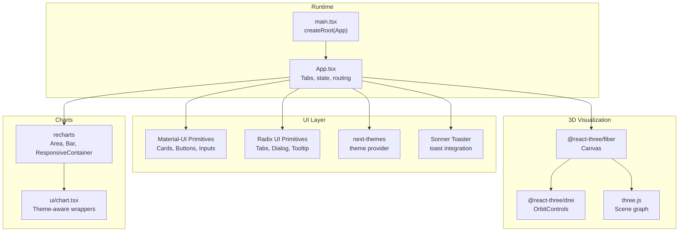
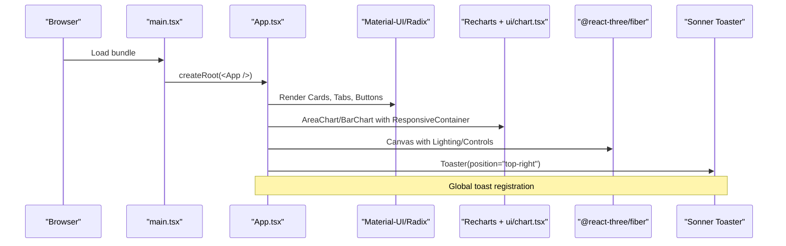
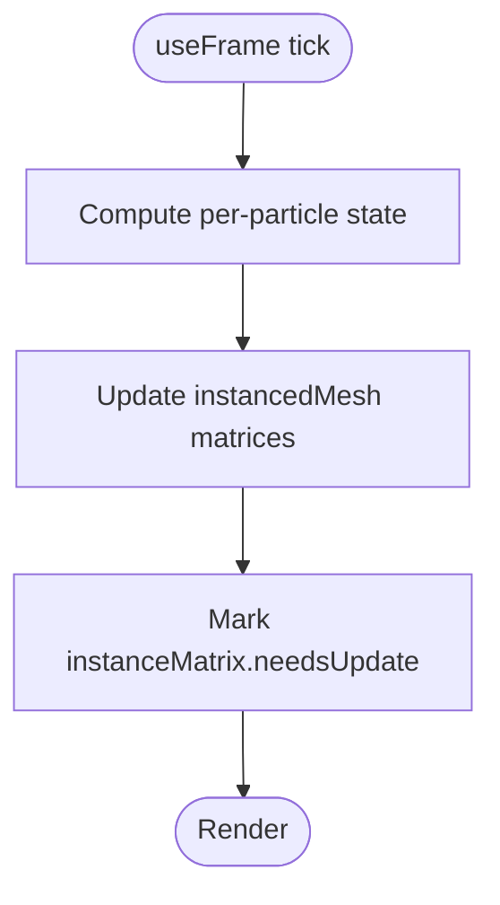
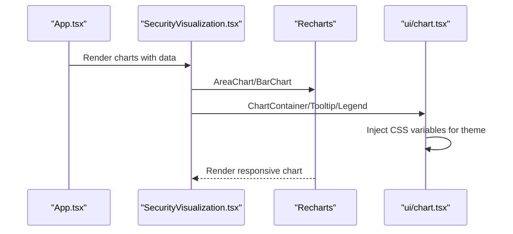
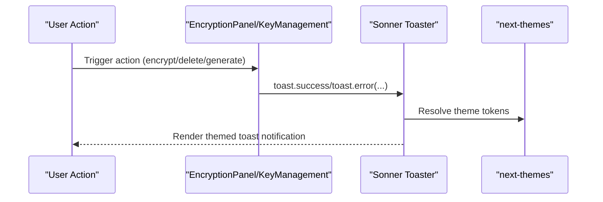
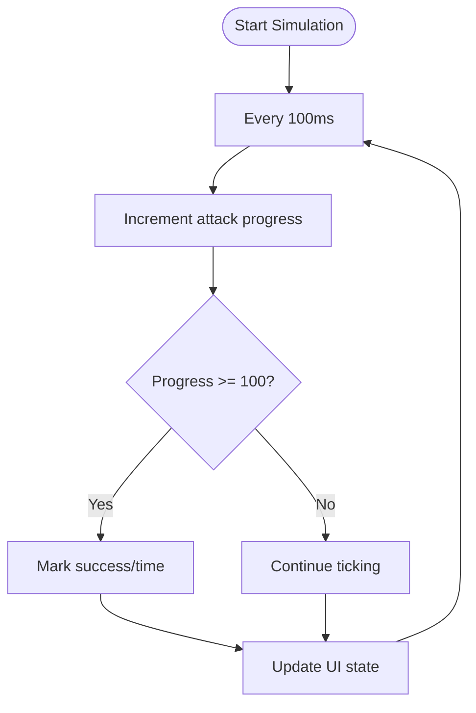
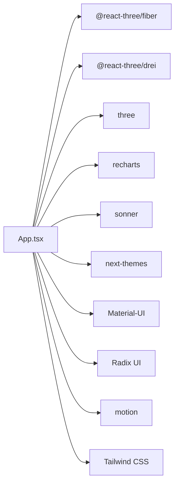

# Integration Patterns

<cite>
**Referenced Files in This Document**
- [package.json](file://package.json)
- [src/main.tsx](file://src/main.tsx)
- [src/app/App.tsx](file://src/app/App.tsx)
- [src/app/components/3d-scene.tsx](file://src/app/components/3d-scene.tsx)
- [src/app/components/3d-hero.tsx](file://src/app/components/3d-hero.tsx)
- [src/app/components/ui/chart.tsx](file://src/app/components/ui/chart.tsx)
- [src/app/components/security-visualization.tsx](file://src/app/components/security-visualization.tsx)
- [src/app/components/ui/sonner.tsx](file://src/app/components/ui/sonner.tsx)
- [src/app/components/quantum-threat-meter.tsx](file://src/app/components/quantum-threat-meter.tsx)
- [src/app/components/quantum-simulator.tsx](file://src/app/components/quantum-simulator.tsx)
- [src/app/components/encryption-panel.tsx](file://src/app/components/encryption-panel.tsx)
- [src/app/components/key-management.tsx](file://src/app/components/key-management.tsx)
- [src/app/components/activity-log.tsx](file://src/app/components/activity-log.tsx)
- [src/styles/index.css](file://src/styles/index.css)
</cite>

## Table of Contents
1. [Introduction](#introduction)
2. [Project Structure](#project-structure)
3. [Core Components](#core-components)
4. [Architecture Overview](#architecture-overview)
5. [Detailed Component Analysis](#detailed-component-analysis)
6. [Dependency Analysis](#dependency-analysis)
7. [Performance Considerations](#performance-considerations)
8. [Troubleshooting Guide](#troubleshooting-guide)
9. [Conclusion](#conclusion)
10. [Appendices](#appendices)

## Introduction
This document describes integration patterns for third-party libraries and specialized components in the Post-Quantum Cryptography Suite. It focuses on:
- Three.js and @react-three/fiber for 3D quantum threat visualization and hero scenes
- Recharts for data visualization with custom Material-UI-styled wrappers
- Sonner for notifications integrated with theme-aware styling
- Material-UI Radix primitives and custom UI extensions
- Integration points for cryptographic libraries, external APIs, and database persistence
- Performance considerations and optimization strategies for complex integrations

## Project Structure
The application is a Vite + React project with Tailwind CSS and a custom UI layer built on Material-UI primitives. Third-party integrations are scoped to:
- 3D rendering: @react-three/fiber, @react-three/drei, three
- Data visualization: recharts, with a custom wrapper for theme-aware charts
- Notifications: sonner with next-themes integration
- UI primitives: Material-UI components and Radix UI primitives
- Animation: motion for React

**Diagram sources**
- [src/main.tsx](file://src/main.tsx#L1-L7)
- [src/app/App.tsx](file://src/app/App.tsx#L1-L362)
- [src/app/components/ui/chart.tsx](file://src/app/components/ui/chart.tsx#L1-L354)
- [src/app/components/ui/sonner.tsx](file://src/app/components/ui/sonner.tsx#L1-L26)
- [src/app/components/3d-scene.tsx](file://src/app/components/3d-scene.tsx#L1-L151)
- [package.json](file://package.json#L10-L68)

**Section sources**
- [src/main.tsx](file://src/main.tsx#L1-L7)
- [src/app/App.tsx](file://src/app/App.tsx#L1-L362)
- [package.json](file://package.json#L10-L68)

## Core Components
- 3D Scenes: Scene3D and Hero3D demonstrate instanced rendering, animated geometry, lighting, fog, and orbit controls.
- Charts: SecurityVisualization integrates Recharts with a custom ChartContainer and styled tooltips/legends.
- Notifications: Sonner Toaster is wrapped to align with theme tokens and Material-UI styling.
- UI Base: Material-UI primitives and Radix UI components compose the interface foundation.
- Activity Logging: ActivityLog renders recent cryptographic operations with animations and status badges.
- Encryption Panel and Key Management: Demonstrate toast-driven UX and state transitions.

**Section sources**
- [src/app/components/3d-scene.tsx](file://src/app/components/3d-scene.tsx#L1-L151)
- [src/app/components/3d-hero.tsx](file://src/app/components/3d-hero.tsx#L1-L76)
- [src/app/components/ui/chart.tsx](file://src/app/components/ui/chart.tsx#L1-L354)
- [src/app/components/security-visualization.tsx](file://src/app/components/security-visualization.tsx#L1-L107)
- [src/app/components/ui/sonner.tsx](file://src/app/components/ui/sonner.tsx#L1-L26)
- [src/app/components/activity-log.tsx](file://src/app/components/activity-log.tsx#L1-L117)
- [src/app/components/encryption-panel.tsx](file://src/app/components/encryption-panel.tsx#L1-L238)
- [src/app/components/key-management.tsx](file://src/app/components/key-management.tsx#L1-L221)

## Architecture Overview
The runtime mounts the root element and renders App. App orchestrates tabs, state, and integrates UI, 3D, and chart components. Notifications are globally available via Toaster.

**Diagram sources**
- [src/main.tsx](file://src/main.tsx#L1-L7)
- [src/app/App.tsx](file://src/app/App.tsx#L1-L362)
- [src/app/components/ui/chart.tsx](file://src/app/components/ui/chart.tsx#L1-L354)
- [src/app/components/ui/sonner.tsx](file://src/app/components/ui/sonner.tsx#L1-L26)
- [src/app/components/3d-scene.tsx](file://src/app/components/3d-scene.tsx#L1-L151)

## Detailed Component Analysis

### Three.js and @react-three/fiber Integration
Scene management and lifecycle:
- Scene3D composes a Canvas with camera, lighting, fog, and OrbitControls. It hosts animated meshes and instanced particle systems.
- QuantumParticles uses instancedMesh with per-frame matrix updates to animate thousands of points efficiently.
- CryptoSphere and EncryptionRings update rotation each frame using the render loop state.
- Hero3D demonstrates a lightweight rotating scene for the hero area.

Performance optimization strategies:
- Instanced rendering for particle systems reduces draw calls.
- Memoization of geometry and materials avoids unnecessary allocations.
- Frame updates compute matrices once per frame and mark instanceMatrix dirty only when needed.
- OrbitControls are configured to autoRotate with minimal user interaction for immersive visuals.

**Diagram sources**
- [src/app/components/3d-scene.tsx](file://src/app/components/3d-scene.tsx#L26-L50)

**Section sources**
- [src/app/components/3d-scene.tsx](file://src/app/components/3d-scene.tsx#L1-L151)
- [src/app/components/3d-hero.tsx](file://src/app/components/3d-hero.tsx#L1-L76)

### Recharts Integration and Custom Chart Wrapper
Chart configuration and theming:
- SecurityVisualization uses AreaChart and BarChart with ResponsiveContainer for responsive sizing.
- ui/chart.tsx provides ChartContainer, ChartTooltipContent, ChartLegendContent, and ChartStyle to apply theme-aware colors and styles.
- The wrapper reads a config object and injects CSS variables scoped to the chart container, enabling consistent theming across light/dark modes.

Real-time data updates:
- The visualization components currently use static datasets. To support real-time updates, replace static arrays with state and periodically refresh data (e.g., via polling or WebSocket events).

Responsive design:
- ResponsiveContainer ensures charts adapt to container width and fixed height. Tooltip and legend content are styled to match Material-UI tokens.

**Diagram sources**
- [src/app/components/security-visualization.tsx](file://src/app/components/security-visualization.tsx#L1-L107)
- [src/app/components/ui/chart.tsx](file://src/app/components/ui/chart.tsx#L1-L354)

**Section sources**
- [src/app/components/security-visualization.tsx](file://src/app/components/security-visualization.tsx#L1-L107)
- [src/app/components/ui/chart.tsx](file://src/app/components/ui/chart.tsx#L1-L354)

### Sonner Notification System Integration
- ui/sonner.tsx wraps Sonner with next-themes to automatically adopt the current theme.
- It maps theme tokens to CSS variables for background, text, and border styling.
- App.tsx registers Toaster globally with a top-right position for unobtrusive user feedback.

Usage patterns:
- toast.success and toast.error are used in EncryptionPanel and KeyManagement to confirm actions and surface errors.
- The wrapper ensures consistent styling with Material-UI cards and borders.

**Diagram sources**
- [src/app/components/ui/sonner.tsx](file://src/app/components/ui/sonner.tsx#L1-L26)
- [src/app/components/encryption-panel.tsx](file://src/app/components/encryption-panel.tsx#L1-L238)
- [src/app/components/key-management.tsx](file://src/app/components/key-management.tsx#L1-L221)
- [src/app/App.tsx](file://src/app/App.tsx#L357-L357)

**Section sources**
- [src/app/components/ui/sonner.tsx](file://src/app/components/ui/sonner.tsx#L1-L26)
- [src/app/components/encryption-panel.tsx](file://src/app/components/encryption-panel.tsx#L1-L238)
- [src/app/components/key-management.tsx](file://src/app/components/key-management.tsx#L1-L221)
- [src/app/App.tsx](file://src/app/App.tsx#L357-L357)

### Material-UI Integration Patterns and Custom Components
- The UI layer is primarily composed of Material-UI primitives (Card, Button, Input, Progress, Tooltip, etc.) and Radix UI components (Tabs, Dialog, Dropdown, etc.).
- Custom components extend the base library by composing these primitives with icons, animations, and layout utilities.
- Example patterns:
  - Card-based layouts with icons and badges
  - Animated transitions using motion for lists and modals
  - Theme-aware styling via next-themes and CSS variables

**Section sources**
- [src/app/components/quantum-threat-meter.tsx](file://src/app/components/quantum-threat-meter.tsx#L1-L149)
- [src/app/components/activity-log.tsx](file://src/app/components/activity-log.tsx#L1-L117)
- [src/app/components/crypto-dashboard.tsx](file://src/app/components/crypto-dashboard.tsx#L1-L70)
- [src/app/components/algorithm-selector.tsx](file://src/app/components/algorithm-selector.tsx#L1-L121)

### Quantum Threat Visualization and Simulator
- QuantumThreatMeter displays risk levels with progress bars and animated cards.
- QuantumSimulator runs a periodic update loop to simulate quantum attacks on classical and post-quantum algorithms, updating progress and status in real time.
- The visualization area animates quantum particles and orbital rings synchronized with simulation state.

**Diagram sources**
- [src/app/components/quantum-simulator.tsx](file://src/app/components/quantum-simulator.tsx#L25-L48)

**Section sources**
- [src/app/components/quantum-threat-meter.tsx](file://src/app/components/quantum-threat-meter.tsx#L1-L149)
- [src/app/components/quantum-simulator.tsx](file://src/app/components/quantum-simulator.tsx#L1-L316)

### Activity Logging and Persistence Hooks
- ActivityLog renders recent cryptographic operations with timestamps and status badges.
- App maintains an in-memory activity log and dashboard stats. For persistence, integrate with:
  - IndexedDB for offline logs
  - Local storage for lightweight sessions
  - Backend API for server-side logging and analytics

**Section sources**
- [src/app/components/activity-log.tsx](file://src/app/components/activity-log.tsx#L1-L117)
- [src/app/App.tsx](file://src/app/App.tsx#L18-L91)

## Dependency Analysis
Third-party libraries and their roles:
- @react-three/fiber, @react-three/drei, three: 3D rendering pipeline
- recharts: data visualization
- sonner + next-themes: notifications and theme integration
- Material-UI and Radix UI: foundational UI primitives
- motion: animation primitives for React
- Tailwind CSS: utility-first styling

**Diagram sources**
- [package.json](file://package.json#L10-L68)
- [src/app/App.tsx](file://src/app/App.tsx#L1-L362)

**Section sources**
- [package.json](file://package.json#L10-L68)

## Performance Considerations
- 3D Rendering
  - Prefer instancedMesh for large particle systems; update instance matrices efficiently and set needsUpdate only when changed.
  - Limit per-frame computations; cache geometry and materials.
  - Use OrbitControls autoRotate sparingly; disable zoom/pan if not needed.
- Charts
  - Avoid frequent re-renders by memoizing datasets and using shallow comparisons.
  - Defer heavy computations off the render thread (Web Workers) if needed.
- Notifications
  - Keep toast payloads small; avoid excessive toast spam.
- Animations
  - Use motion’s optimized variants and avoid layout thrashing.
- Theming
  - Apply CSS variables for theme tokens to minimize style recalculation.

[No sources needed since this section provides general guidance]

## Troubleshooting Guide
- 3D Scene Not Rendering
  - Verify Canvas is mounted and has explicit dimensions.
  - Ensure lighting and camera positions are valid.
- Performance Drops in 3D
  - Reduce particle counts or simplify geometries.
  - Avoid frequent material or geometry recreation in loops.
- Chart Not Responding to Resize
  - Confirm ResponsiveContainer has a parent with definite dimensions.
  - Avoid changing chart props too frequently; batch updates.
- Toast Not Appearing
  - Ensure Toaster is registered once in the app shell.
  - Check theme provider availability for next-themes integration.
- Activity Log Empty
  - Confirm state updates are triggered by user actions and not trimmed prematurely.

**Section sources**
- [src/app/components/3d-scene.tsx](file://src/app/components/3d-scene.tsx#L125-L150)
- [src/app/components/ui/chart.tsx](file://src/app/components/ui/chart.tsx#L64-L66)
- [src/app/components/ui/sonner.tsx](file://src/app/components/ui/sonner.tsx#L6-L23)
- [src/app/App.tsx](file://src/app/App.tsx#L357-L357)

## Conclusion
The integration patterns demonstrate a cohesive approach to combining 3D visualization, data charts, notifications, and UI primitives. By leveraging instancing, theme-aware wrappers, and global toast registration, the application achieves a polished, responsive, and future-proof user experience. Extending these patterns with cryptographic libraries, external APIs, and persistent logging follows established hooks and compositional patterns already present in the codebase.

[No sources needed since this section summarizes without analyzing specific files]

## Appendices
- Styling pipeline: index.css imports fonts, Tailwind, and theme styles.

**Section sources**
- [src/styles/index.css](file://src/styles/index.css#L1-L4)