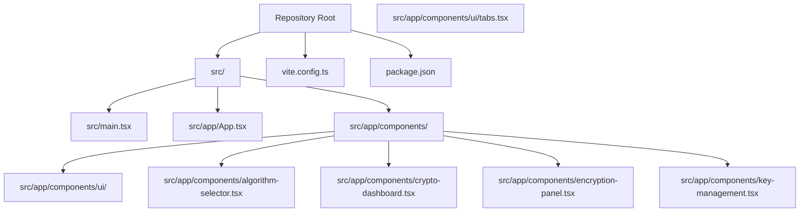
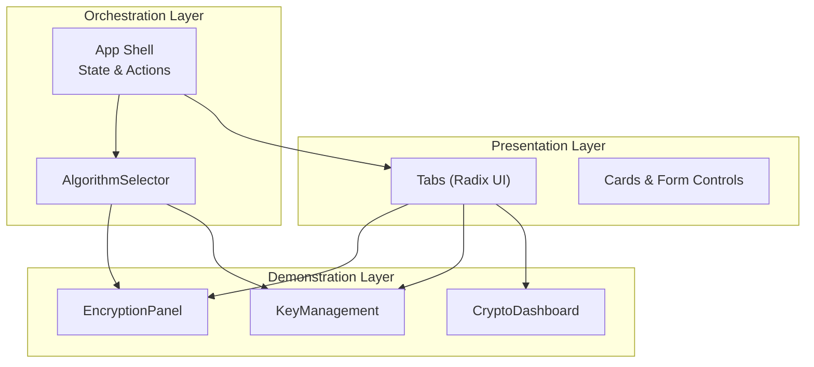
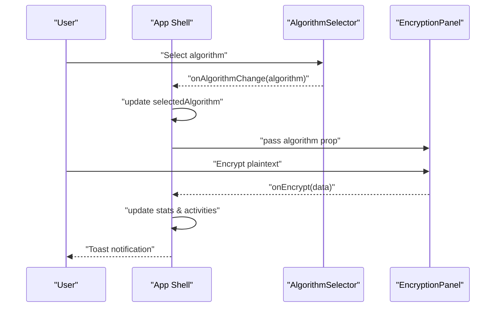
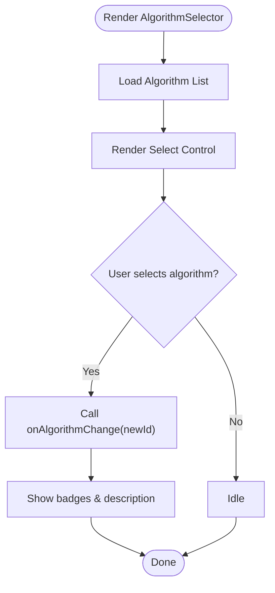
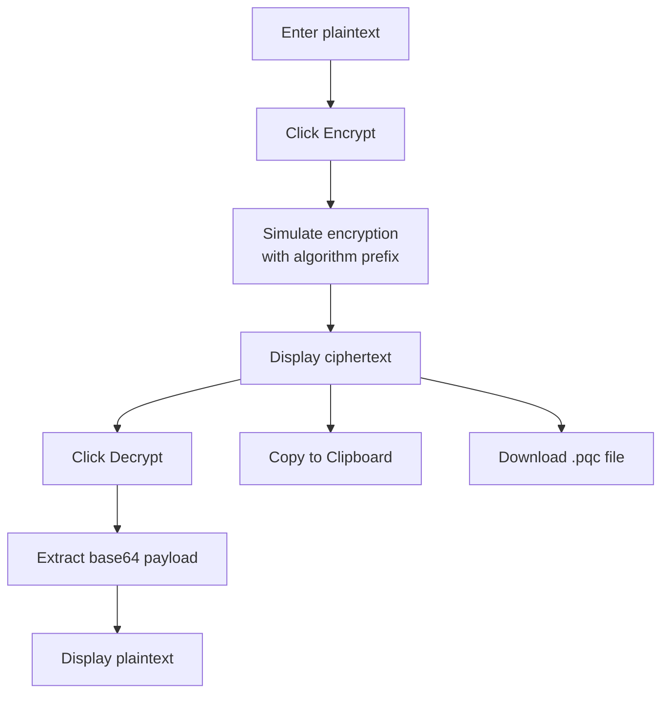
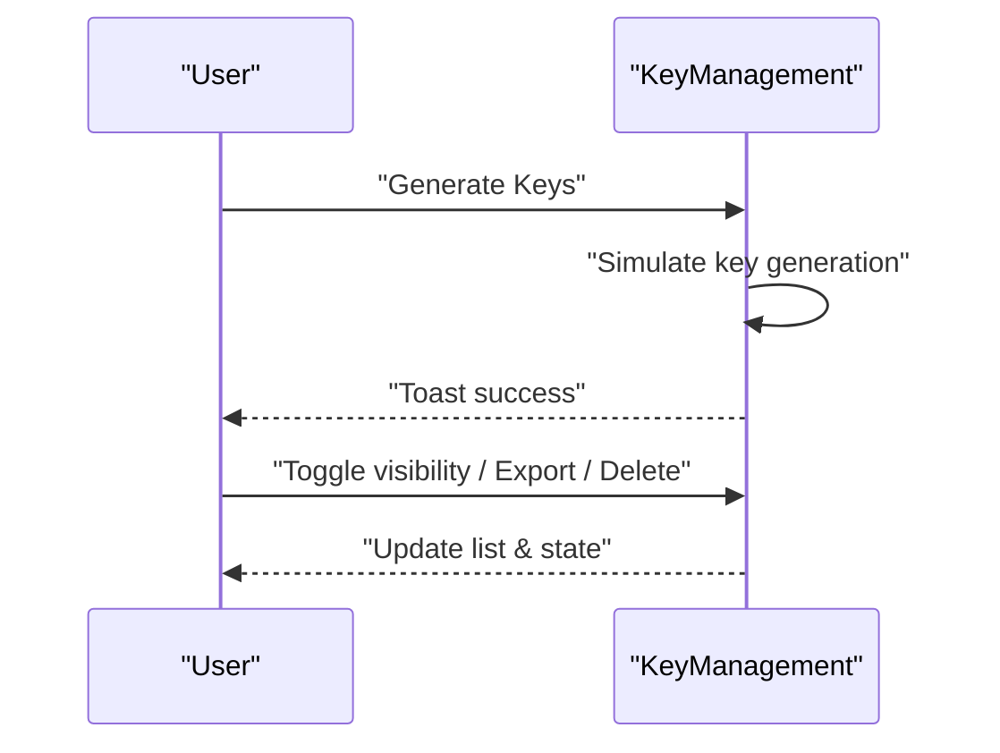
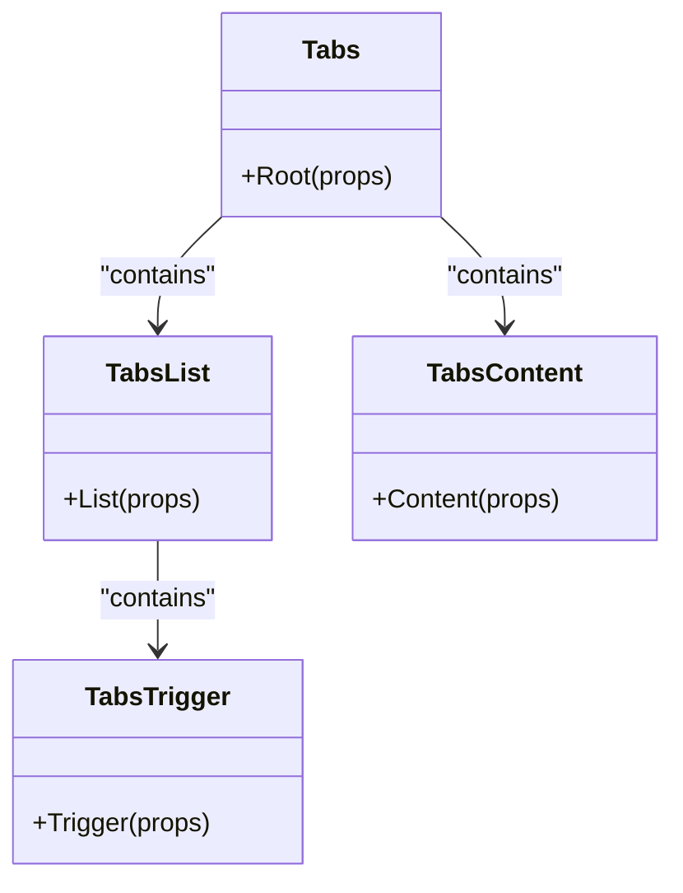
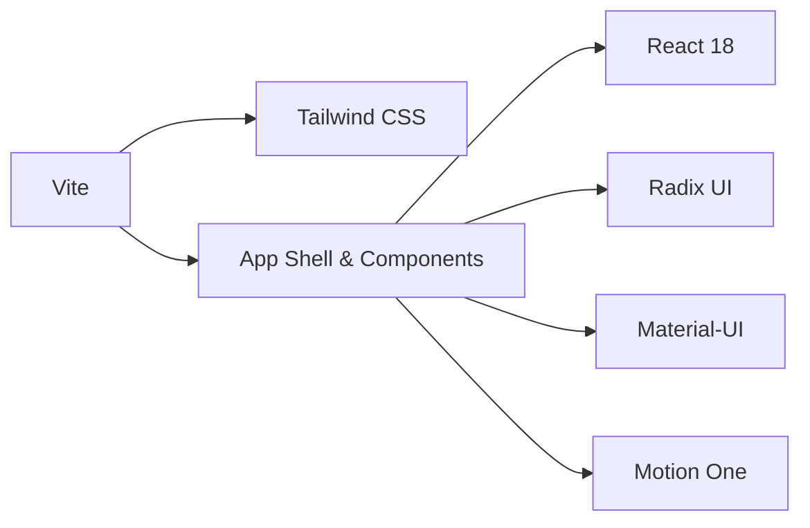

# System Architecture

<cite>
**Referenced Files in This Document**
- [README.md](file://README.md)
- [package.json](file://package.json)
- [vite.config.ts](file://vite.config.ts)
- [src/main.tsx](file://src/main.tsx)
- [src/app/App.tsx](file://src/app/App.tsx)
- [src/app/components/algorithm-selector.tsx](file://src/app/components/algorithm-selector.tsx)
- [src/app/components/crypto-dashboard.tsx](file://src/app/components/crypto-dashboard.tsx)
- [src/app/components/encryption-panel.tsx](file://src/app/components/encryption-panel.tsx)
- [src/app/components/key-management.tsx](file://src/app/components/key-management.tsx)
- [src/app/components/ui/tabs.tsx](file://src/app/components/ui/tabs.tsx)
</cite>

## Table of Contents
1. [Introduction](#introduction)
2. [Project Structure](#project-structure)
3. [Core Components](#core-components)
4. [Architecture Overview](#architecture-overview)
5. [Detailed Component Analysis](#detailed-component-analysis)
6. [Dependency Analysis](#dependency-analysis)
7. [Performance Considerations](#performance-considerations)
8. [Troubleshooting Guide](#troubleshooting-guide)
9. [Conclusion](#conclusion)
10. [Appendices](#appendices)

## Introduction
This document describes the system architecture of the Post-Quantum Cryptography Educational Platform. The platform is built with React 18 and Vite, designed to separate educational content from cryptographic demonstrations while enabling modular expansion for new post-quantum algorithms. It leverages a hybrid UI approach combining Radix UI primitives with Material-UI components to deliver a modern, accessible, and extensible interface. The architecture emphasizes clean boundaries between the core application shell and algorithm-specific demonstration panels, ensuring that adding new cryptographic algorithms requires minimal disruption to existing functionality.

## Project Structure
The project follows a feature-centric layout under src/app/components, with shared UI primitives and a central App shell orchestrating state and routing-like behavior via tabbed views. Build tooling is configured through Vite with Tailwind CSS integration and React Fast Refresh enabled.

**Diagram sources**
- [src/main.tsx](file://src/main.tsx#L1-L7)
- [src/app/App.tsx](file://src/app/App.tsx#L1-L362)
- [src/app/components/ui/tabs.tsx](file://src/app/components/ui/tabs.tsx#L1-L67)
- [src/app/components/algorithm-selector.tsx](file://src/app/components/algorithm-selector.tsx#L1-L121)
- [src/app/components/crypto-dashboard.tsx](file://src/app/components/crypto-dashboard.tsx#L1-L70)
- [src/app/components/encryption-panel.tsx](file://src/app/components/encryption-panel.tsx#L1-L238)
- [src/app/components/key-management.tsx](file://src/app/components/key-management.tsx#L1-L221)
- [vite.config.ts](file://vite.config.ts#L1-L23)
- [package.json](file://package.json#L1-L93)

**Section sources**
- [README.md](file://README.md#L1-L11)
- [package.json](file://package.json#L1-L93)
- [vite.config.ts](file://vite.config.ts#L1-L23)
- [src/main.tsx](file://src/main.tsx#L1-L7)
- [src/app/App.tsx](file://src/app/App.tsx#L1-L362)

## Core Components
- Application Shell (App): Central orchestrator managing global state (selected algorithm, activity log, dashboard stats), coordinating tabbed views, and delegating algorithm selection and actions to specialized panels.
- Algorithm Selector: Provides a curated list of post-quantum algorithms with metadata and selection logic, decoupled from cryptographic implementations.
- Demonstration Panels: Modular components for encryption, file encryption, key management, certificates, network security, simulator, analytics, threat meter, and activity logging.
- UI Primitives: A thin wrapper around Radix UI Tabs with consistent styling and utilities, enabling consistent behavior across the application.

Key architectural characteristics:
- Separation of concerns: Educational content and demonstrations are distinct areas within the App shell.
- Algorithm abstraction: Algorithm selection is centralized and passed down to panels that only need the identifier and metadata.
- Extensibility: New algorithms can be added by updating the selector’s algorithm list and adding a new panel or extending existing ones.

**Section sources**
- [src/app/App.tsx](file://src/app/App.tsx#L1-L362)
- [src/app/components/algorithm-selector.tsx](file://src/app/components/algorithm-selector.tsx#L1-L121)
- [src/app/components/ui/tabs.tsx](file://src/app/components/ui/tabs.tsx#L1-L67)

## Architecture Overview
The system uses a layered architecture:
- Presentation Layer: React components organized by feature and shared primitives.
- Orchestration Layer: App.tsx manages state and routes content via tabs.
- Algorithm Abstraction: AlgorithmSelector defines supported algorithms and metadata.
- Demonstration Layer: Algorithm-specific panels (e.g., EncryptionPanel, KeyManagement) consume the selected algorithm and perform simulation-driven operations.

**Diagram sources**
- [src/app/App.tsx](file://src/app/App.tsx#L26-L316)
- [src/app/components/algorithm-selector.tsx](file://src/app/components/algorithm-selector.tsx#L68-L121)
- [src/app/components/encryption-panel.tsx](file://src/app/components/encryption-panel.tsx#L10-L13)
- [src/app/components/key-management.tsx](file://src/app/components/key-management.tsx#L18-L20)
- [src/app/components/ui/tabs.tsx](file://src/app/components/ui/tabs.tsx#L8-L64)

## Detailed Component Analysis

### App Shell and State Orchestration
The App component maintains:
- Selected algorithm state for demonstration panels.
- Activity log with recent operations and timestamps.
- Dashboard statistics aggregated from user actions.
- Global notifications via a toast component.

It composes the header, dashboard, and tabbed content areas, passing the selected algorithm and callbacks to child components.

**Diagram sources**
- [src/app/App.tsx](file://src/app/App.tsx#L26-L91)
- [src/app/components/algorithm-selector.tsx](file://src/app/components/algorithm-selector.tsx#L68-L121)
- [src/app/components/encryption-panel.tsx](file://src/app/components/encryption-panel.tsx#L45-L61)

**Section sources**
- [src/app/App.tsx](file://src/app/App.tsx#L18-L91)

### Algorithm Selector
The AlgorithmSelector component:
- Defines a strongly typed AlgorithmType union.
- Maintains a static list of supported algorithms with metadata (security level, speed, type).
- Renders a selection control and displays current algorithm details.

Extending support for new algorithms involves adding entries to the algorithm list and ensuring downstream panels accept the new identifier.

**Diagram sources**
- [src/app/components/algorithm-selector.tsx](file://src/app/components/algorithm-selector.tsx#L6-L121)

**Section sources**
- [src/app/components/algorithm-selector.tsx](file://src/app/components/algorithm-selector.tsx#L6-L121)

### Encryption Panel
The EncryptionPanel simulates post-quantum operations:
- Generates deterministic ciphertext with algorithm-specific prefixes and randomized padding.
- Supports decryption by extracting the embedded base64 payload.
- Integrates animations, toasts, clipboard copy, and file download.

**Diagram sources**
- [src/app/components/encryption-panel.tsx](file://src/app/components/encryption-panel.tsx#L22-L96)

**Section sources**
- [src/app/components/encryption-panel.tsx](file://src/app/components/encryption-panel.tsx#L10-L238)

### Key Management
The KeyManagement component:
- Generates public/private key pairs with algorithm-specific identifiers and randomized content.
- Manages visibility toggles, exports, and deletions.
- Uses animations and toasts for feedback.

**Diagram sources**
- [src/app/components/key-management.tsx](file://src/app/components/key-management.tsx#L32-L89)

**Section sources**
- [src/app/components/key-management.tsx](file://src/app/components/key-management.tsx#L18-L221)

### UI Primitive: Tabs (Radix UI)
The Tabs component wraps Radix UI primitives with consistent styling and slot attributes, enabling predictable behavior across the application.

**Diagram sources**
- [src/app/components/ui/tabs.tsx](file://src/app/components/ui/tabs.tsx#L8-L64)

**Section sources**
- [src/app/components/ui/tabs.tsx](file://src/app/components/ui/tabs.tsx#L1-L67)

## Dependency Analysis
Technology stack and module relationships:
- Runtime: React 18 with concurrent features and hooks.
- UI: Hybrid approach using Radix UI primitives and Material-UI components.
- Animation: Motion One for declarative animations.
- Styling: Tailwind CSS via Vite plugin.
- Build: Vite with React Fast Refresh and TypeScript-compatible configuration.

**Diagram sources**
- [package.json](file://package.json#L10-L68)
- [vite.config.ts](file://vite.config.ts#L1-L23)
- [src/app/App.tsx](file://src/app/App.tsx#L1-L16)

**Section sources**
- [package.json](file://package.json#L10-L68)
- [vite.config.ts](file://vite.config.ts#L1-L23)

## Performance Considerations
- Concurrent Rendering: React 18’s concurrent features enable efficient updates and progressive rendering, especially beneficial for animated transitions and large datasets in analytics.
- Fast Refresh: Vite’s development server accelerates iteration cycles with hot module replacement.
- Lightweight Animations: Motion One is used selectively for subtle UI enhancements to avoid heavy computations.
- Bundle Size: The hybrid UI approach balances reuse and footprint; keep imported components scoped to reduce unnecessary bundling.
- Algorithm Simulation: Demonstrations use deterministic simulations to avoid heavy cryptographic computations during development.

[No sources needed since this section provides general guidance]

## Troubleshooting Guide
Common issues and resolutions:
- Development server not starting: Verify Node.js and npm installation, then run the development script as documented.
- Port conflicts: Adjust the server port in the Vite configuration if port 5000 is unavailable.
- Missing dependencies: Install dependencies using the documented commands.
- UI inconsistencies: Ensure Tailwind CSS plugin is loaded and aliases are configured correctly.

**Section sources**
- [README.md](file://README.md#L6-L11)
- [vite.config.ts](file://vite.config.ts#L17-L22)
- [package.json](file://package.json#L6-L9)

## Conclusion
The Post-Quantum Cryptography Educational Platform employs a clean, modular architecture that separates educational content from cryptographic demonstrations. By centralizing algorithm selection and leveraging a hybrid UI toolkit, the system remains extensible and maintainable. Adding new post-quantum algorithms is straightforward: extend the algorithm list and integrate with existing panels or create new ones. The combination of React 18 concurrency, Vite’s fast development server, and Motion One animations delivers a responsive and engaging learning experience.

[No sources needed since this section summarizes without analyzing specific files]

## Appendices
- Deployment considerations: Build with Vite for production, configure asset handling for SVG and CSV assets, and ensure environment variables are set for runtime behavior.
- Scalability patterns: Introduce algorithm-specific configuration objects and feature flags to incrementally roll out new demonstrations without disrupting core functionality.

[No sources needed since this section provides general guidance]