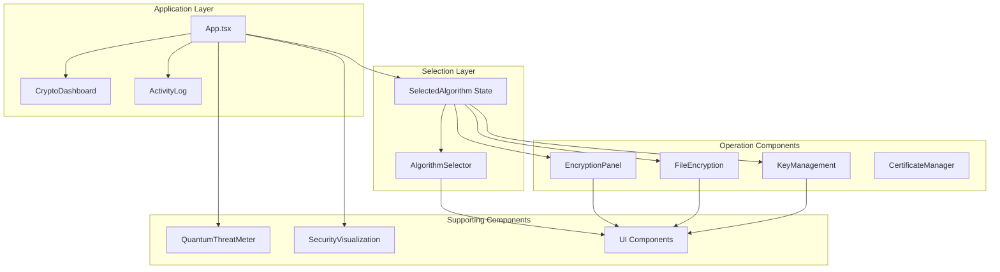
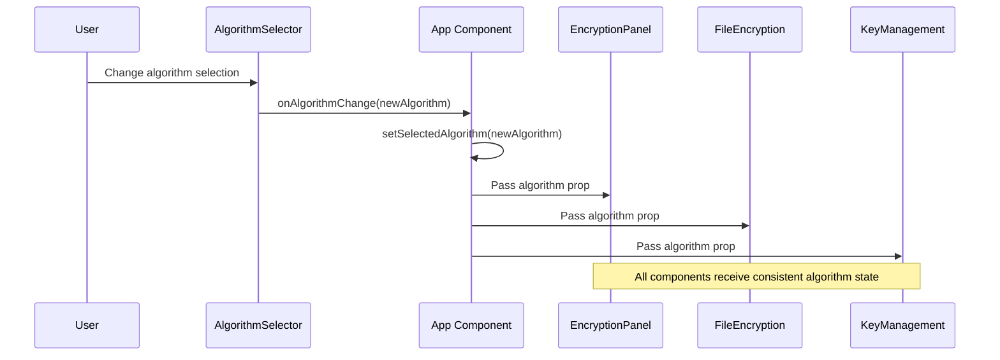
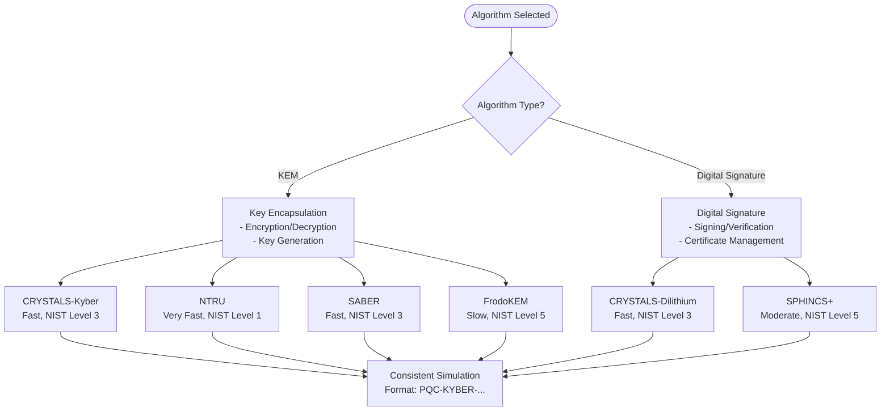
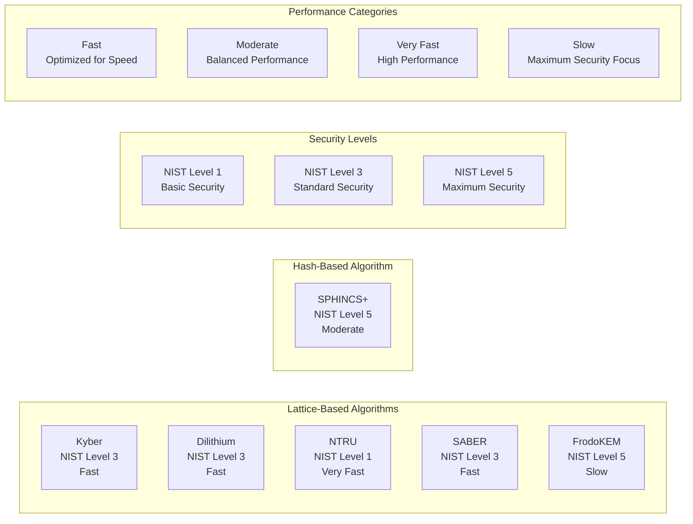
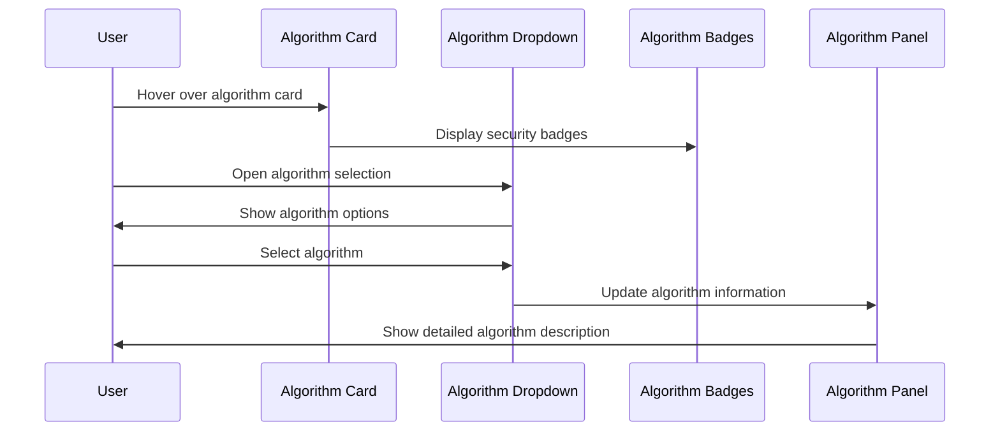
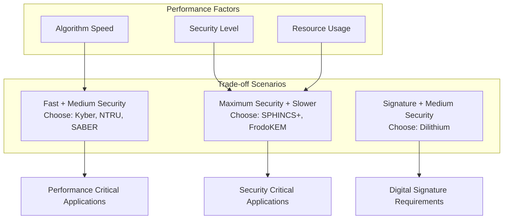
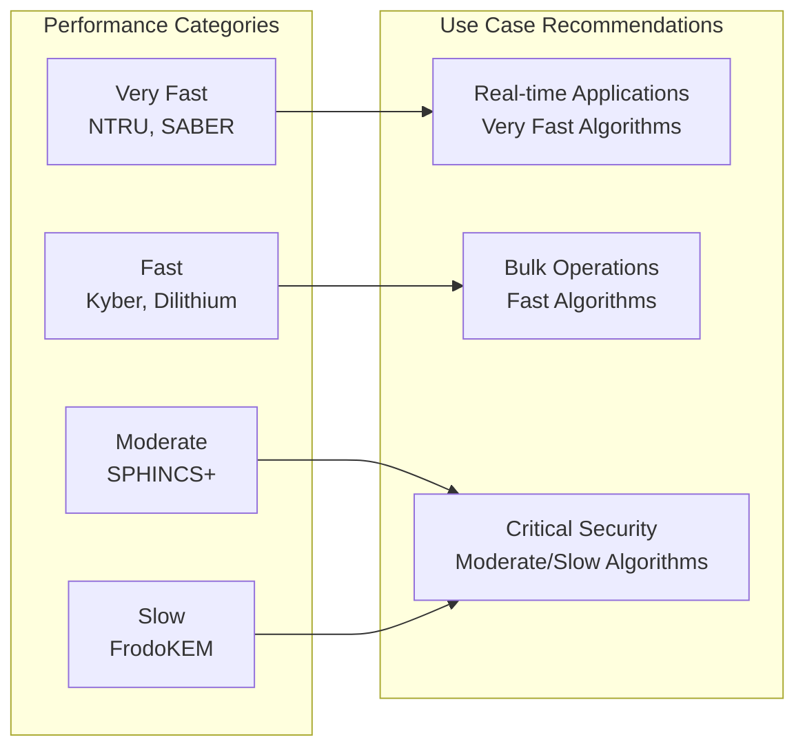

# Algorithm Selection System

<cite>
**Referenced Files in This Document**
- [App.tsx](file://src/app/App.tsx)
- [algorithm-selector.tsx](file://src/app/components/algorithm-selector.tsx)
- [encryption-panel.tsx](file://src/app/components/encryption-panel.tsx)
- [file-encryption.tsx](file://src/app/components/file-encryption.tsx)
- [key-management.tsx](file://src/app/components/key-management.tsx)
- [crypto-dashboard.tsx](file://src/app/components/crypto-dashboard.tsx)
- [activity-log.tsx](file://src/app/components/activity-log.tsx)
- [quantum-threat-meter.tsx](file://src/app/components/quantum-threat-meter.tsx)
- [security-visualization.tsx](file://src/app/components/security-visualization.tsx)
- [select.tsx](file://src/app/components/ui/select.tsx)
- [card.tsx](file://src/app/components/ui/card.tsx)
- [package.json](file://package.json)
</cite>

## Table of Contents
1. [Introduction](#introduction)
2. [System Architecture](#system-architecture)
3. [Algorithm Selection Component](#algorithm-selection-component)
4. [State Management](#state-management)
5. [Integration with Core Components](#integration-with-core-components)
6. [Educational Framework](#educational-framework)
7. [UI Interaction Patterns](#ui-interaction-patterns)
8. [Algorithm Characteristics and Trade-offs](#algorithm-characteristics-and-trade-offs)
9. [Accessibility Features](#accessibility-features)
10. [Performance Considerations](#performance-considerations)
11. [Troubleshooting Guide](#troubleshooting-guide)
12. [Conclusion](#conclusion)

## Introduction

The Algorithm Selection System is a comprehensive post-quantum cryptography interface that enables users to choose between six quantum-resistant cryptographic schemes. This system serves as the central hub for cryptographic operations, providing a unified selection mechanism that propagates through the entire platform to influence encryption, decryption, key generation, and verification processes.

The system supports six post-quantum cryptographic algorithms: CRYSTALS-Kyber (Key Encapsulation Mechanism), CRYSTALS-Dilithium (Digital Signature), SPHINCS+ (Hash-based Signature), NTRU (Lattice-based KEM), SABER (Module Lattice-based KEM), and FrodoKEM (Conservative Lattice-based KEM). Each algorithm represents different approaches to post-quantum security, offering varying trade-offs between security levels, performance characteristics, and implementation complexity.

## System Architecture

The Algorithm Selection System follows a centralized state management pattern where the selected algorithm flows from the top-level application state to all dependent components. The architecture ensures consistency across the platform while maintaining modularity and separation of concerns.



**Diagram sources**
- [App.tsx](file://src/app/App.tsx#L26-L362)
- [algorithm-selector.tsx](file://src/app/components/algorithm-selector.tsx#L73-L121)
- [encryption-panel.tsx](file://src/app/components/encryption-panel.tsx#L15-L238)

## Algorithm Selection Component

The AlgorithmSelector component serves as the primary interface for cryptographic algorithm selection. It provides a dropdown interface with comprehensive algorithm information and real-time display of selected algorithm characteristics.

### Component Structure

```mermaid
classDiagram
class AlgorithmSelector {
+AlgorithmType selectedAlgorithm
+onAlgorithmChange() void
+render() JSX.Element
-currentAlgorithm Algorithm
}
class Algorithm {
+AlgorithmType id
+string name
+string type
+string security
+string speed
+string description
}
class AlgorithmType {
<<enumeration>>
"CRYSTALS-Kyber"
"CRYSTALS-Dilithium"
"SPHINCS+"
"NTRU"
"SABER"
"FrodoKEM"
}
AlgorithmSelector --> Algorithm : displays
AlgorithmSelector --> AlgorithmType : manages
```

**Diagram sources**
- [algorithm-selector.tsx](file://src/app/components/algorithm-selector.tsx#L6-L15)
- [algorithm-selector.tsx](file://src/app/components/algorithm-selector.tsx#L68-L71)

### Algorithm Configuration

The system maintains a comprehensive database of supported algorithms with detailed characteristics:

| Algorithm | Type | Security Level | Performance | Description |
|-----------|------|----------------|-------------|-------------|
| CRYSTALS-Kyber | KEM | NIST Level 3 | Fast | Lattice-based key encapsulation mechanism |
| CRYSTALS-Dilithium | Digital Signature | NIST Level 3 | Fast | Lattice-based digital signature scheme |
| SPHINCS+ | Digital Signature | NIST Level 5 | Moderate | Hash-based signature scheme |
| NTRU | KEM | NIST Level 1 | Very Fast | Lattice-based encryption |
| SABER | KEM | NIST Level 3 | Fast | Module lattice-based key encapsulation |
| FrodoKEM | KEM | NIST Level 5 | Slow | Conservative lattice-based KEM |

**Section sources**
- [algorithm-selector.tsx](file://src/app/components/algorithm-selector.tsx#L17-L66)

## State Management

The system implements centralized state management using React's useState hook, ensuring consistent algorithm selection across all components. The state flows unidirectionally from the parent App component to child components.

### State Flow Architecture



**Diagram sources**
- [App.tsx](file://src/app/App.tsx#L27-L28)
- [App.tsx](file://src/app/App.tsx#L252-L255)

### State Propagation Pattern

The state management follows a predictable pattern where the selected algorithm influences all downstream components:

1. **Initial State**: App component initializes with "CRYSTALS-Kyber" as default
2. **User Interaction**: AlgorithmSelector triggers state updates
3. **Component Re-render**: All dependent components re-render with new algorithm
4. **Consistent Behavior**: All operations use the selected algorithm consistently

**Section sources**
- [App.tsx](file://src/app/App.tsx#L27-L28)
- [App.tsx](file://src/app/App.tsx#L252-L281)

## Integration with Core Components

The selected algorithm propagates through multiple system components, influencing their behavior and output formatting. Each component integrates the algorithm selection in specific ways to maintain cryptographic consistency.

### Component Integration Matrix

| Component | Algorithm Integration | Impact | Implementation |
|-----------|----------------------|---------|----------------|
| EncryptionPanel | Algorithm parameter | Determines encryption format | Uses algorithm in simulation |
| FileEncryption | Algorithm parameter | Influences file naming | Embeds algorithm in filenames |
| KeyManagement | Algorithm parameter | Controls key generation | Prefixes keys with algorithm |
| ActivityLog | Algorithm tracking | Records operation context | Logs algorithm usage |
| CertificateManager | Algorithm parameter | Manages certificates | Uses algorithm for cert generation |

### Algorithm-Specific Behavior



**Diagram sources**
- [encryption-panel.tsx](file://src/app/components/encryption-panel.tsx#L22-L30)
- [file-encryption.tsx](file://src/app/components/file-encryption.tsx#L89-L100)
- [key-management.tsx](file://src/app/components/key-management.tsx#L38-L48)

**Section sources**
- [encryption-panel.tsx](file://src/app/components/encryption-panel.tsx#L15-L238)
- [file-encryption.tsx](file://src/app/components/file-encryption.tsx#L24-L229)
- [key-management.tsx](file://src/app/components/key-management.tsx#L22-L221)

## Educational Framework

The system incorporates comprehensive educational content designed to help users understand post-quantum cryptography principles and algorithm characteristics.

### Security Education Components

The educational framework is integrated throughout the interface:

1. **Algorithm Information Cards**: Each algorithm displays security level, performance rating, and type classification
2. **Real-time Learning**: Users learn through hands-on interaction with different algorithms
3. **Contextual Help**: Descriptive text explains the cryptographic principles behind each approach
4. **Performance Trade-offs**: Visual indicators show the balance between security and performance

### Algorithm Classification System



**Diagram sources**
- [algorithm-selector.tsx](file://src/app/components/algorithm-selector.tsx#L17-L66)

**Section sources**
- [algorithm-selector.tsx](file://src/app/components/algorithm-selector.tsx#L17-L66)
- [App.tsx](file://src/app/App.tsx#L325-L351)

## UI Interaction Patterns

The system implements consistent interaction patterns across all components, ensuring intuitive user experience while maintaining cryptographic accuracy.

### Selection Interaction Flow



**Diagram sources**
- [algorithm-selector.tsx](file://src/app/components/algorithm-selector.tsx#L73-L121)

### Component Interaction Patterns

1. **Dropdown Interface**: Standardized Radix UI select component with custom styling
2. **Information Display**: Badge system showing security level, performance, and algorithm type
3. **Real-time Updates**: Immediate feedback when algorithm selection changes
4. **Consistent Formatting**: All components use the selected algorithm in their operations

**Section sources**
- [algorithm-selector.tsx](file://src/app/components/algorithm-selector.tsx#L73-L121)
- [select.tsx](file://src/app/components/ui/select.tsx#L13-L190)
- [card.tsx](file://src/app/components/ui/card.tsx#L5-L93)

## Algorithm Characteristics and Trade-offs

Each algorithm in the system offers distinct characteristics that influence performance, security, and usability. Understanding these trade-offs helps users make informed decisions about cryptographic selection.

### Performance Comparison Matrix

| Algorithm | Security Level | Encryption Speed | Decryption Speed | Key Size | Use Case |
|-----------|----------------|------------------|------------------|----------|----------|
| CRYSTALS-Kyber | NIST Level 3 | Excellent | Excellent | Medium | General Purpose |
| CRYSTALS-Dilithium | NIST Level 3 | Good | Good | Large | Digital Signatures |
| SPHINCS+ | NIST Level 5 | Fair | Fair | Very Large | Maximum Security |
| NTRU | NIST Level 1 | Excellent | Excellent | Medium | High Performance |
| SABER | NIST Level 3 | Excellent | Excellent | Medium | Balanced Approach |
| FrodoKEM | NIST Level 5 | Poor | Poor | Very Large | Maximum Security |

### Security Level Classification

The system categorizes algorithms based on NIST post-quantum cryptography competition standards:

- **NIST Level 1**: Basic security, fastest performance
- **NIST Level 3**: Standard security, balanced performance
- **NIST Level 5**: Maximum security, slower performance

### Performance Impact Analysis



**Section sources**
- [algorithm-selector.tsx](file://src/app/components/algorithm-selector.tsx#L17-L66)
- [security-visualization.tsx](file://src/app/components/security-visualization.tsx#L15-L22)

## Accessibility Features

The Algorithm Selection System incorporates comprehensive accessibility features to ensure inclusive use across diverse user needs and abilities.

### Keyboard Navigation Support

- **Full Keyboard Access**: All dropdown selections and interactive elements support keyboard navigation
- **Focus Management**: Proper focus indicators and logical tab order
- **Screen Reader Compatibility**: ARIA labels and semantic HTML structure
- **High Contrast Mode**: Compatible with system accessibility settings

### Visual Accessibility Features

- **Color Contrast**: Sufficient contrast ratios for all text and interface elements
- **Alternative Text**: Descriptive alt text for all icons and visual elements
- **Resize Support**: Responsive design that works with text scaling
- **Motion Preferences**: Reduced motion options for user comfort

### Cognitive Accessibility

- **Clear Labels**: Descriptive labels for all interactive elements
- **Consistent Patterns**: Uniform interface patterns across all components
- **Error Prevention**: Input validation and helpful error messages
- **Progress Indicators**: Visual feedback for all user actions

**Section sources**
- [select.tsx](file://src/app/components/ui/select.tsx#L13-L190)
- [card.tsx](file://src/app/components/ui/card.tsx#L5-L93)

## Performance Considerations

The system is designed with performance optimization in mind, particularly considering the computational demands of cryptographic operations.

### Algorithm Performance Characteristics



### System Optimization Strategies

1. **Lazy Loading**: Algorithm-specific components load only when needed
2. **State Memoization**: Prevents unnecessary re-renders across components
3. **Efficient Rendering**: Minimal DOM updates when algorithm changes
4. **Resource Management**: Optimized memory usage for cryptographic operations

### Performance Monitoring

The system tracks and displays performance metrics through:

- **Encryption Statistics**: Track encryption/decryption rates
- **Algorithm Comparison**: Visual performance benchmarks
- **Resource Usage**: Monitor computational overhead
- **User Experience Metrics**: Measure interaction responsiveness

**Section sources**
- [security-visualization.tsx](file://src/app/components/security-visualization.tsx#L15-L22)
- [crypto-dashboard.tsx](file://src/app/components/crypto-dashboard.tsx#L13-L70)

## Troubleshooting Guide

Common issues and solutions for the Algorithm Selection System:

### Algorithm Selection Issues

**Problem**: Algorithm selection not updating across components
**Solution**: Verify state propagation from App component to child components

**Problem**: Dropdown not displaying all algorithms
**Solution**: Check AlgorithmType enumeration matches algorithm array entries

### Component Integration Problems

**Problem**: Encryption operations not using selected algorithm
**Solution**: Ensure algorithm prop is passed correctly to EncryptionPanel

**Problem**: Key generation not reflecting algorithm choice
**Solution**: Verify algorithm parameter is included in key generation process

### Performance Issues

**Problem**: Slow algorithm switching
**Solution**: Check for unnecessary re-renders in component hierarchy

**Problem**: Memory leaks during algorithm changes
**Solution**: Implement proper cleanup in useEffect hooks

### UI/UX Problems

**Problem**: Accessibility violations in dropdown
**Solution**: Review ARIA attributes and keyboard navigation implementation

**Problem**: Visual inconsistency in algorithm badges
**Solution**: Verify consistent styling across all components

**Section sources**
- [App.tsx](file://src/app/App.tsx#L26-L362)
- [algorithm-selector.tsx](file://src/app/components/algorithm-selector.tsx#L73-L121)

## Conclusion

The Algorithm Selection System provides a comprehensive foundation for post-quantum cryptographic operations, offering users intuitive control over six major quantum-resistant algorithms. The system's architecture ensures consistent state management, educational value, and practical usability while maintaining security and performance standards.

Key strengths of the system include:

- **Centralized Control**: Single source of truth for algorithm selection
- **Educational Integration**: Built-in learning resources for each algorithm
- **Performance Optimization**: Thoughtful trade-off considerations
- **Accessibility Compliance**: Inclusive design for all users
- **Extensible Architecture**: Foundation for future cryptographic algorithm integration

The system successfully bridges the gap between cryptographic complexity and user accessibility, making post-quantum cryptography approachable while maintaining the technical rigor required for secure operations. Future enhancements could include additional algorithm support, advanced performance monitoring, and expanded educational content.