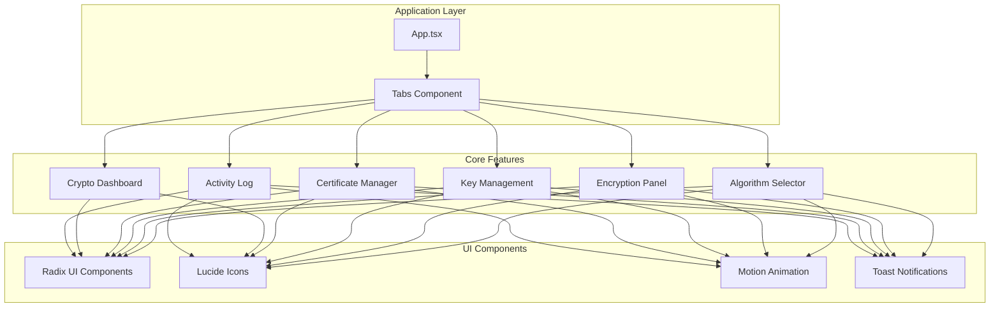
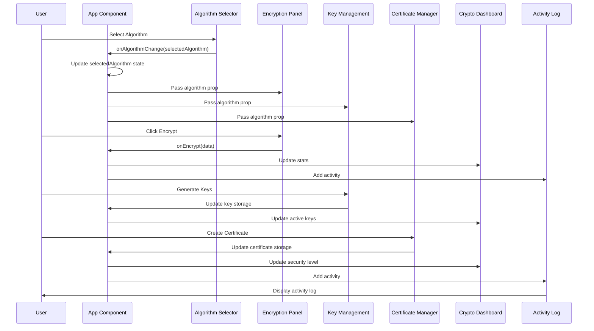
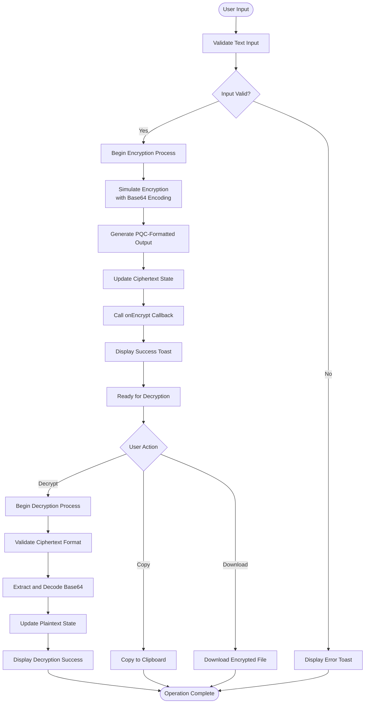
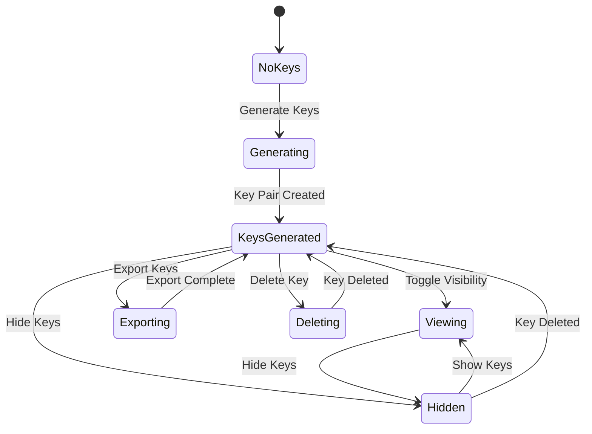
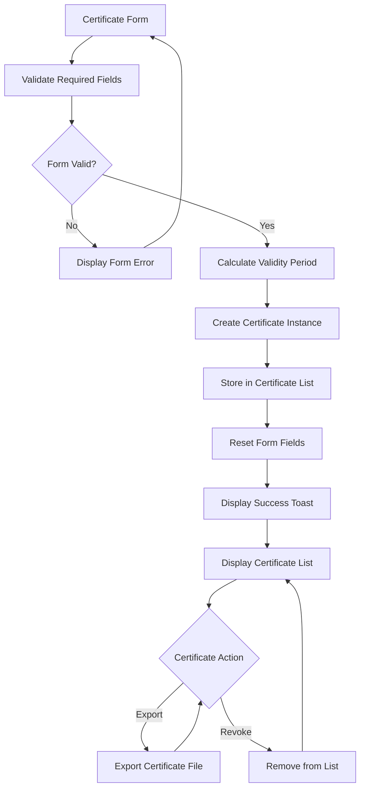

# Core Features

<cite>
**Referenced Files in This Document**
- [App.tsx](file://Design/src/app/App.tsx)
- [algorithm-selector.tsx](file://Design/src/app/components/algorithm-selector.tsx)
- [encryption-panel.tsx](file://Design/src/app/components/encryption-panel.tsx)
- [key-management.tsx](file://Design/src/app/components/key-management.tsx)
- [certificate-manager.tsx](file://Design/src/app/components/certificate-manager.tsx)
- [crypto-dashboard.tsx](file://Design/src/app/components/crypto-dashboard.tsx)
- [activity-log.tsx](file://Design/src/app/components/activity-log.tsx)
- [package.json](file://Design/package.json)
</cite>

## Table of Contents
1. [Introduction](#introduction)
2. [Project Structure](#project-structure)
3. [Core Components](#core-components)
4. [Architecture Overview](#architecture-overview)
5. [Detailed Component Analysis](#detailed-component-analysis)
6. [Dependency Analysis](#dependency-analysis)
7. [Performance Considerations](#performance-considerations)
8. [Troubleshooting Guide](#troubleshooting-guide)
9. [Conclusion](#conclusion)

## Introduction
This document provides comprehensive documentation for the Core Features section of the Post-Quantum Cryptography Educational Platform. The platform focuses on six main feature areas that collectively support an educational mission to demonstrate quantum-resistant cryptographic techniques:

- Algorithm Selection: Choosing between six post-quantum cryptographic schemes
- Interactive Encryption: Real-time text encryption/decryption demonstrations
- Key Management: Quantum-resistant key generation and lifecycle management
- Certificate Management: Digital certificate handling for post-quantum cryptography
- Crypto Dashboard: Real-time statistics display
- Activity Logging: Operation tracking and audit trail

Each feature integrates with the central algorithm selection system and contributes to the platform's educational objectives by providing hands-on demonstrations of post-quantum cryptographic concepts.

## Project Structure
The platform is built as a React application using modern web technologies. The core features are implemented as reusable React components that communicate through a centralized state management system.



**Diagram sources**
- [App.tsx](file://Design/src/app/App.tsx#L26-L362)
- [algorithm-selector.tsx](file://Design/src/app/components/algorithm-selector.tsx#L1-L121)
- [encryption-panel.tsx](file://Design/src/app/components/encryption-panel.tsx#L1-L238)
- [key-management.tsx](file://Design/src/app/components/key-management.tsx#L1-L221)
- [certificate-manager.tsx](file://Design/src/app/components/certificate-manager.tsx#L1-L295)
- [crypto-dashboard.tsx](file://Design/src/app/components/crypto-dashboard.tsx#L1-L70)
- [activity-log.tsx](file://Design/src/app/components/activity-log.tsx#L1-L117)

**Section sources**
- [App.tsx](file://Design/src/app/App.tsx#L1-L362)
- [package.json](file://Design/package.json#L1-L93)

## Core Components
The core features are implemented as modular React components that share a common state management system. The central algorithm selection system serves as the foundation for all other components, ensuring consistency across the platform.

### Algorithm Selection System
The Algorithm Selector component provides the central hub for cryptographic scheme selection. It defines six supported post-quantum algorithms with their characteristics and integrates seamlessly with all other components.

### Interactive Encryption Engine
The Encryption Panel provides real-time text encryption and decryption demonstrations with visual feedback and educational messaging.

### Key Lifecycle Management
The Key Management component handles the complete lifecycle of quantum-resistant key pairs, from generation to deletion.

### Digital Certificate Authority
The Certificate Manager simulates the creation and management of post-quantum X.509 certificates.

### Real-Time Analytics
The Crypto Dashboard displays real-time statistics about cryptographic operations and security metrics.

### Operation Tracking
The Activity Log maintains a comprehensive audit trail of all cryptographic operations performed by users.

**Section sources**
- [algorithm-selector.tsx](file://Design/src/app/components/algorithm-selector.tsx#L6-L66)
- [App.tsx](file://Design/src/app/App.tsx#L27-L34)

## Architecture Overview
The platform follows a unidirectional data flow architecture where the central App component manages shared state and passes it down to child components through props. This ensures consistency across all features while maintaining component isolation.



**Diagram sources**
- [App.tsx](file://Design/src/app/App.tsx#L26-L91)
- [algorithm-selector.tsx](file://Design/src/app/components/algorithm-selector.tsx#L68-L71)
- [encryption-panel.tsx](file://Design/src/app/components/encryption-panel.tsx#L10-L13)
- [key-management.tsx](file://Design/src/app/components/key-management.tsx#L18-L20)
- [certificate-manager.tsx](file://Design/src/app/components/certificate-manager.tsx#L23-L25)

The architecture ensures that:
- All components receive consistent algorithm context
- State updates propagate through the system
- User actions trigger appropriate analytics and logging
- Educational messaging is maintained throughout interactions

## Detailed Component Analysis

### Algorithm Selection Component
The Algorithm Selector serves as the central decision-making component for cryptographic scheme selection. It presents six post-quantum algorithms with their security characteristics and performance metrics.

```mermaid
classDiagram
class AlgorithmSelector {
+AlgorithmType selectedAlgorithm
+onAlgorithmChange(algorithm) void
+render() JSX.Element
}
class Algorithm {
+AlgorithmType id
+string name
+string type
+string security
+string speed
+string description
}
class AlgorithmType {
<<enumeration>>
"CRYSTALS-Kyber"
"CRYSTALS-Dilithium"
"SPHINCS+"
"NTRU"
"SABER"
"FrodoKEM"
}
AlgorithmSelector --> Algorithm : "displays"
AlgorithmSelector --> AlgorithmType : "selects"
Algorithm --> AlgorithmType : "has id"
```

**Diagram sources**
- [algorithm-selector.tsx](file://Design/src/app/components/algorithm-selector.tsx#L6-L15)
- [algorithm-selector.tsx](file://Design/src/app/components/algorithm-selector.tsx#L68-L71)

**Section sources**
- [algorithm-selector.tsx](file://Design/src/app/components/algorithm-selector.tsx#L1-L121)

### Interactive Encryption Feature
The Encryption Panel provides a comprehensive demonstration of post-quantum encryption and decryption processes with realistic simulation and user feedback.



**Diagram sources**
- [encryption-panel.tsx](file://Design/src/app/components/encryption-panel.tsx#L45-L78)
- [encryption-panel.tsx](file://Design/src/app/components/encryption-panel.tsx#L80-L96)

**Section sources**
- [encryption-panel.tsx](file://Design/src/app/components/encryption-panel.tsx#L1-L238)

### Key Management System
The Key Management component handles the complete lifecycle of quantum-resistant key pairs with secure storage and user-friendly interface controls.



**Diagram sources**
- [key-management.tsx](file://Design/src/app/components/key-management.tsx#L32-L49)
- [key-management.tsx](file://Design/src/app/components/key-management.tsx#L61-L71)

**Section sources**
- [key-management.tsx](file://Design/src/app/components/key-management.tsx#L1-L221)

### Certificate Management System
The Certificate Manager simulates the creation and management of post-quantum X.509 certificates with realistic validation and lifecycle management.



**Diagram sources**
- [certificate-manager.tsx](file://Design/src/app/components/certificate-manager.tsx#L51-L80)
- [certificate-manager.tsx](file://Design/src/app/components/certificate-manager.tsx#L108-L111)

**Section sources**
- [certificate-manager.tsx](file://Design/src/app/components/certificate-manager.tsx#L1-L295)

### Crypto Dashboard Analytics
The Crypto Dashboard provides real-time visualization of cryptographic operations and security metrics with educational context.

**Section sources**
- [crypto-dashboard.tsx](file://Design/src/app/components/crypto-dashboard.tsx#L1-L70)

### Activity Logging System
The Activity Log maintains a comprehensive record of all cryptographic operations with timestamp formatting and status indicators.

**Section sources**
- [activity-log.tsx](file://Design/src/app/components/activity-log.tsx#L1-L117)

## Dependency Analysis
The platform relies on several key dependencies that enable its educational functionality and user experience features.

```mermaid
graph TB
subgraph "Core Dependencies"
React[React 18.3.1]
Motion[Motion 12.23.24]
Radix[Radix UI 1.x]
Sonner[Sonner 2.0.3]
end
subgraph "UI Icons"
Lucide[Lucide React 0.487.0]
end
subgraph "Animation & Effects"
Three[Three.js 0.182.0]
Drei[Drei 10.7.7]
Fiber[Fiber 9.5.0]
end
subgraph "Development Tools"
Vite[Vite 6.3.5]
Tailwind[Tailwind CSS 4.1.12]
PluginReact[@vitejs/plugin-react 4.7.0]
end
App --> React
App --> Motion
App --> Radix
App --> Sonner
App --> Lucide
App --> Three
App --> Drei
App --> Fiber
Build --> Vite
Build --> Tailwind
Build --> PluginReact
```

**Diagram sources**
- [package.json](file://Design/package.json#L10-L68)

The dependency structure supports:
- Modern React development with concurrent features
- Smooth animations and transitions for educational demonstrations
- Comprehensive UI component library for consistent design
- Real-time notifications and user feedback systems
- 3D visualizations for quantum threat modeling
- Rapid development and hot-reload capabilities

**Section sources**
- [package.json](file://Design/package.json#L1-L93)

## Performance Considerations
The platform implements several performance optimizations to ensure smooth user experience during cryptographic demonstrations:

### State Management Efficiency
- Centralized state reduces unnecessary re-renders
- Component-specific state minimizes global updates
- Optimized callback functions prevent memory leaks

### Animation Performance
- Motion library provides hardware-accelerated animations
- Conditional rendering prevents excessive DOM updates
- Animation cleanup prevents memory accumulation

### Data Processing Optimization
- Simulated cryptographic operations use efficient string manipulation
- Debounced user interactions prevent rapid successive operations
- Virtualized lists for activity logs prevent rendering overhead

### Memory Management
- Proper cleanup of event listeners and timers
- URL object revocation for file downloads
- Efficient certificate and key data structures

## Troubleshooting Guide

### Common Issues and Solutions

**Algorithm Selection Problems**
- Verify that the selected algorithm is properly imported and typed
- Check that the algorithm selector receives the correct props
- Ensure the onAlgorithmChange callback updates the parent state

**Encryption Panel Issues**
- Validate that text input is properly sanitized before processing
- Check that the onEncrypt callback receives the correct data
- Verify that toast notifications are properly configured

**Key Management Problems**
- Confirm that key generation simulates realistic key lengths
- Verify that key visibility toggles work correctly
- Check that key export functionality creates proper JSON files

**Certificate Manager Issues**
- Validate certificate form field requirements
- Ensure proper certificate status calculation
- Check that certificate export generates correct file formats

**Dashboard and Analytics Problems**
- Verify that statistics update correctly with user actions
- Check that the activity log maintains proper chronological order
- Ensure that security metrics reflect actual system state

**Section sources**
- [App.tsx](file://Design/src/app/App.tsx#L36-L91)
- [encryption-panel.tsx](file://Design/src/app/components/encryption-panel.tsx#L45-L78)
- [key-management.tsx](file://Design/src/app/components/key-management.tsx#L32-L49)
- [certificate-manager.tsx](file://Design/src/app/components/certificate-manager.tsx#L51-L80)

## Conclusion
The Post-Quantum Cryptography Educational Platform successfully demonstrates six core features that collectively support an educational mission to teach quantum-resistant cryptographic concepts. The centralized algorithm selection system ensures consistency across all features while providing hands-on learning experiences.

The platform's architecture enables:
- Seamless integration between educational components
- Real-time feedback and visualization of cryptographic operations
- Comprehensive tracking of user interactions and system state
- Scalable design that can accommodate additional post-quantum algorithms
- Educational value through realistic simulations and clear interface design

The implementation demonstrates best practices in React development, animation design, and user experience optimization while maintaining focus on the educational objectives of post-quantum cryptography awareness and understanding.