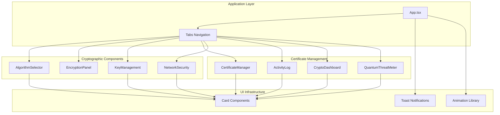
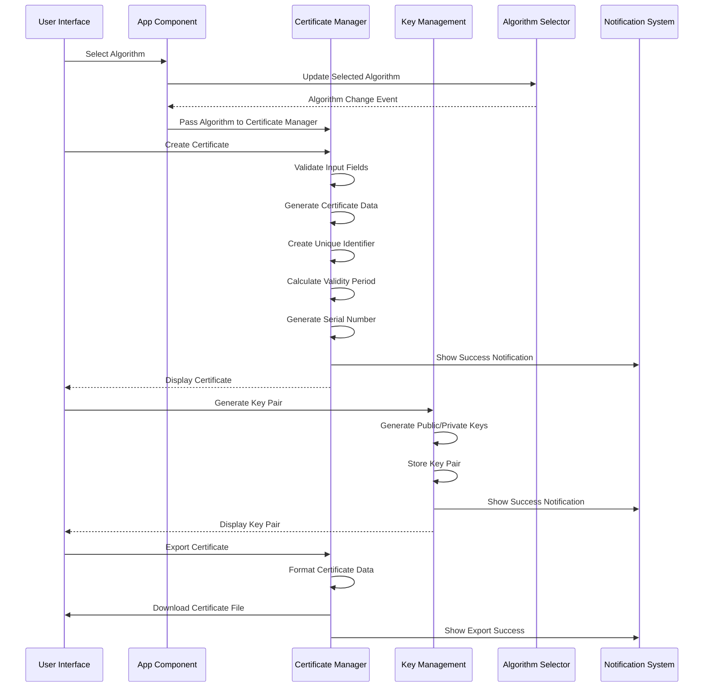
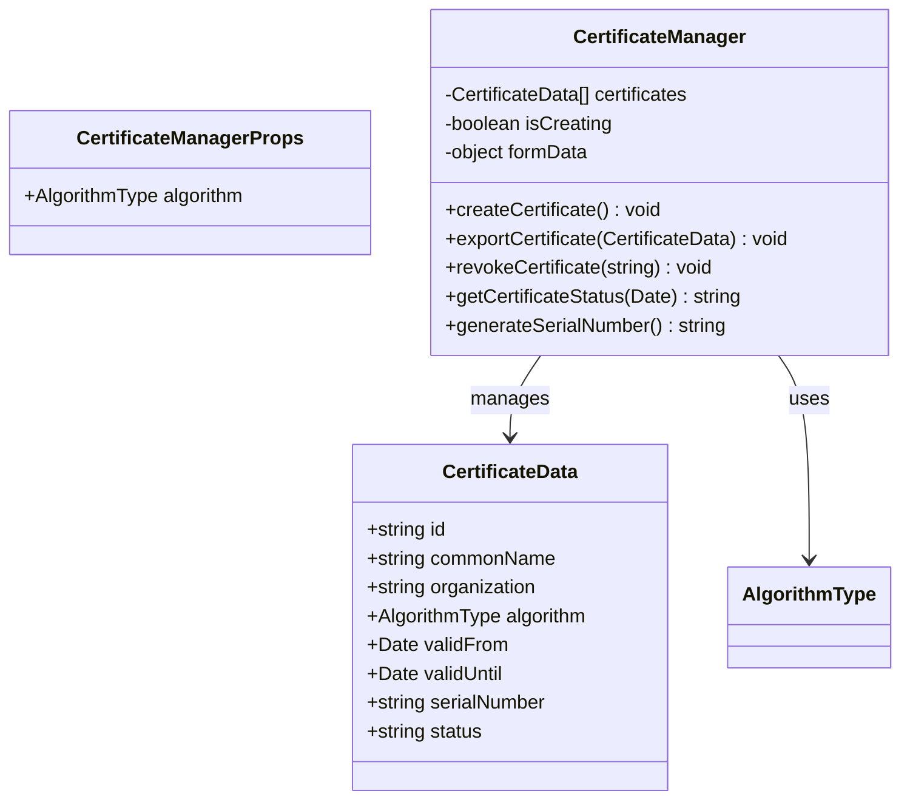
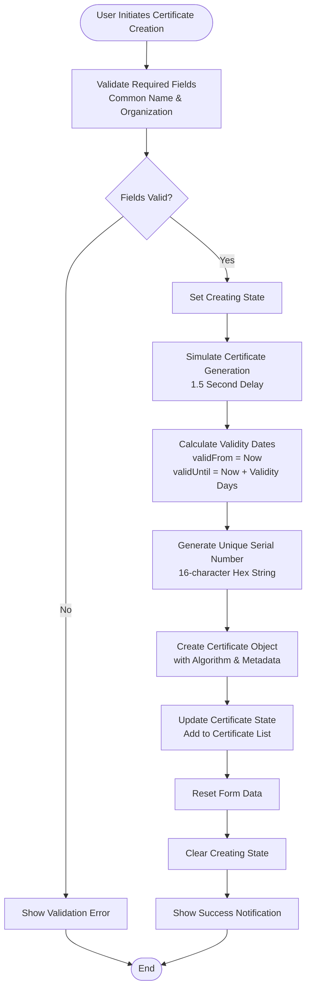
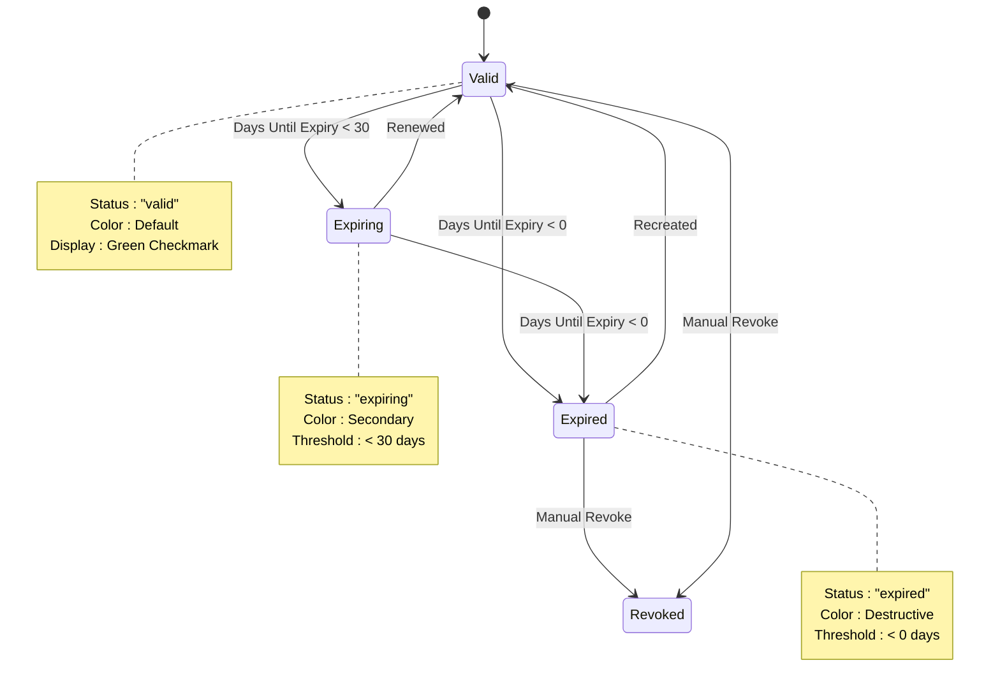
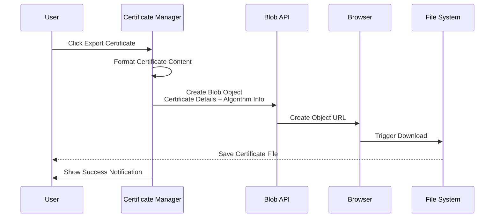
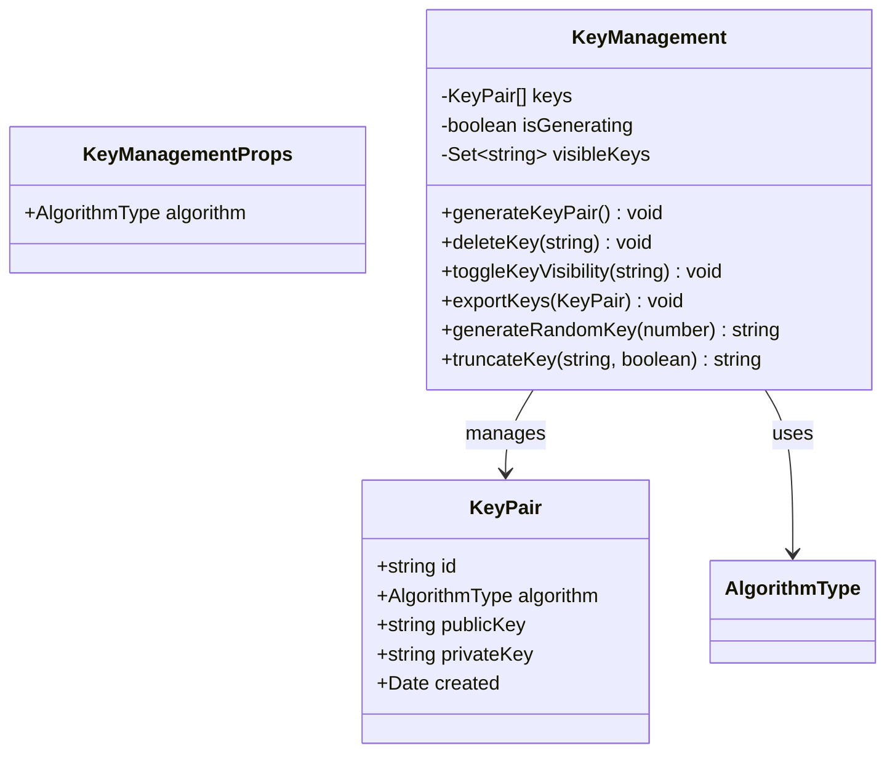
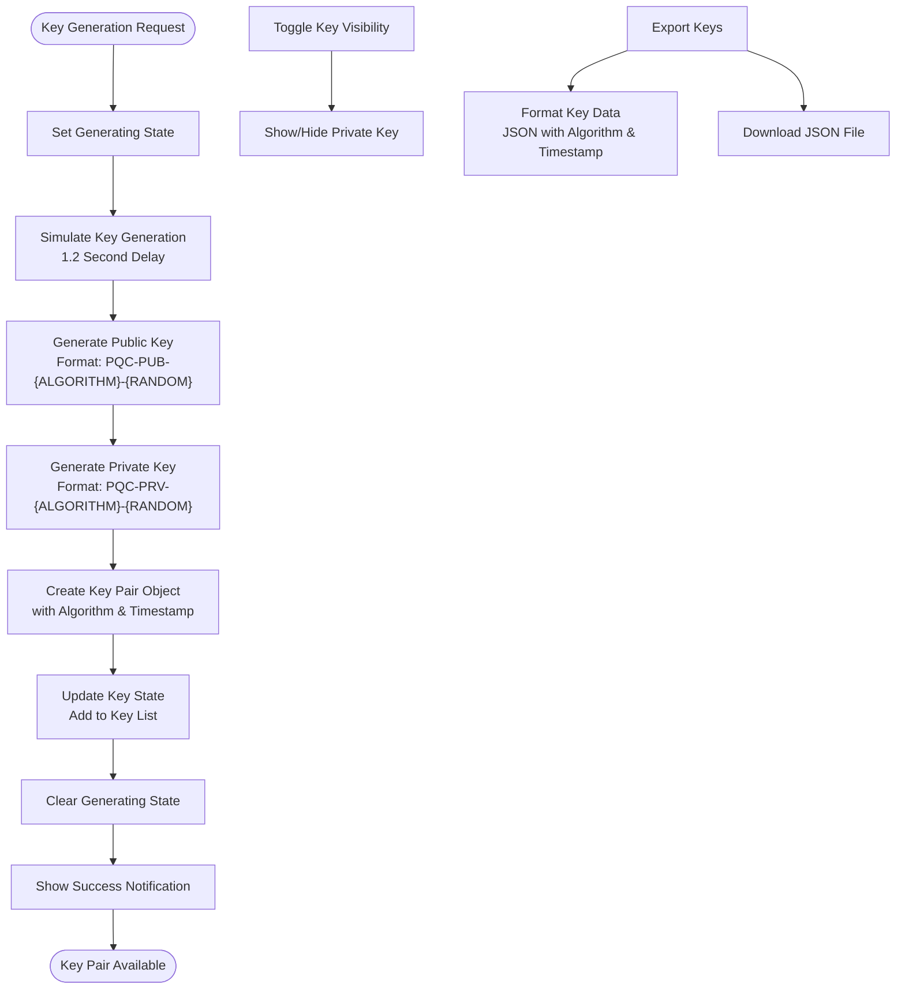
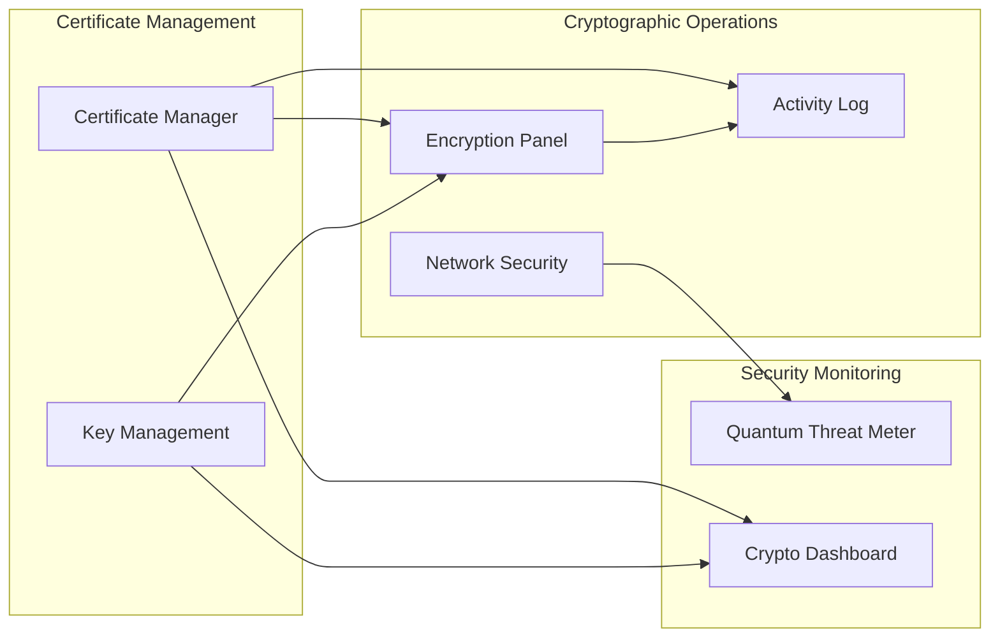
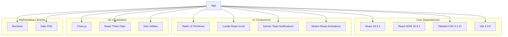

# Digital Certificate Management

<cite>
**Referenced Files in This Document**
- [App.tsx](file://Design/src/app/App.tsx)
- [certificate-manager.tsx](file://Design/src/app/components/certificate-manager.tsx)
- [algorithm-selector.tsx](file://Design/src/app/components/algorithm-selector.tsx)
- [key-management.tsx](file://Design/src/app/components/key-management.tsx)
- [encryption-panel.tsx](file://Design/src/app/components/encryption-panel.tsx)
- [network-security.tsx](file://Design/src/app/components/network-security.tsx)
- [crypto-dashboard.tsx](file://Design/src/app/components/crypto-dashboard.tsx)
- [activity-log.tsx](file://Design/src/app/components/activity-log.tsx)
- [quantum-threat-meter.tsx](file://Design/src/app/components/quantum-threat-meter.tsx)
- [package.json](file://Design/package.json)
- [README.md](file://Design/README.md)
</cite>

## Table of Contents
1. [Introduction](#introduction)
2. [Project Structure](#project-structure)
3. [Core Components](#core-components)
4. [Architecture Overview](#architecture-overview)
5. [Detailed Component Analysis](#detailed-component-analysis)
6. [Dependency Analysis](#dependency-analysis)
7. [Performance Considerations](#performance-considerations)
8. [Troubleshooting Guide](#troubleshooting-guide)
9. [Conclusion](#conclusion)
10. [Appendices](#appendices)

## Introduction
This document provides comprehensive documentation for the Digital Certificate Management system within the Post-Quantum Cryptography Suite. The system enables the creation, management, and lifecycle administration of quantum-resistant X.509 certificates using NIST-standardized post-quantum cryptographic algorithms. The platform integrates certificate generation, key pair management, encryption/decryption demonstrations, and network security visualization to support educational and demonstration scenarios focused on quantum-safe cryptography.

The system emphasizes:
- Certificate creation with configurable validity periods and quantum-resistant algorithms
- Certificate lifecycle management including export and revocation
- Integration with post-quantum algorithms (CRYSTALS-Kyber, CRYSTALS-Dilithium, SPHINCS+, NTRU, SABER, FrodoKEM)
- Educational framework demonstrating certificate security and trust models
- Compliance with post-quantum standards and best practices

## Project Structure
The project follows a React-based architecture with a modular component structure. The main application orchestrates multiple specialized components for cryptographic operations, certificate management, and security visualization.



**Diagram sources**
- [App.tsx](file://Design/src/app/App.tsx#L208-L316)
- [certificate-manager.tsx](file://Design/src/app/components/certificate-manager.tsx#L1-L295)
- [algorithm-selector.tsx](file://Design/src/app/components/algorithm-selector.tsx#L1-L121)

**Section sources**
- [App.tsx](file://Design/src/app/App.tsx#L1-L362)
- [README.md](file://Design/README.md#L1-L11)

## Core Components
The certificate management system comprises several interconnected components that work together to provide a comprehensive post-quantum cryptographic environment:

### Certificate Manager
The central component responsible for certificate lifecycle management, including creation, validation, export, and revocation. It maintains certificate state, generates unique identifiers, and provides user interfaces for certificate operations.

### Algorithm Selector
Provides selection of post-quantum cryptographic algorithms with detailed information about security levels, performance characteristics, and algorithm types (Key Encapsulation Mechanisms vs Digital Signatures).

### Key Management
Handles generation, storage, and export of quantum-resistant key pairs associated with certificates. Supports visibility controls and secure key handling practices.

### Supporting Components
Additional components provide context for certificate operations, including encryption demonstrations, network security visualization, and activity monitoring.

**Section sources**
- [certificate-manager.tsx](file://Design/src/app/components/certificate-manager.tsx#L12-L25)
- [algorithm-selector.tsx](file://Design/src/app/components/algorithm-selector.tsx#L6-L15)
- [key-management.tsx](file://Design/src/app/components/key-management.tsx#L10-L20)

## Architecture Overview
The system employs a modular architecture with clear separation of concerns between cryptographic operations, certificate management, and user interface components.



**Diagram sources**
- [App.tsx](file://Design/src/app/App.tsx#L250-L290)
- [certificate-manager.tsx](file://Design/src/app/components/certificate-manager.tsx#L51-L80)
- [key-management.tsx](file://Design/src/app/components/key-management.tsx#L32-L49)

The architecture ensures:
- Algorithm selection influences certificate and key generation
- Certificate lifecycle operations are isolated from cryptographic operations
- User notifications provide feedback for all operations
- Modular components enable easy extension and maintenance

## Detailed Component Analysis

### Certificate Manager Component
The Certificate Manager serves as the primary interface for certificate lifecycle operations, implementing comprehensive functionality for certificate creation, validation, and management.



**Diagram sources**
- [certificate-manager.tsx](file://Design/src/app/components/certificate-manager.tsx#L12-L25)
- [certificate-manager.tsx](file://Design/src/app/components/certificate-manager.tsx#L27-L80)

#### Certificate Creation Process
The certificate creation workflow implements a multi-step process with validation, simulation, and state management:



**Diagram sources**
- [certificate-manager.tsx](file://Design/src/app/components/certificate-manager.tsx#L51-L80)
- [certificate-manager.tsx](file://Design/src/app/components/certificate-manager.tsx#L36-L49)

#### Certificate Validation and Lifecycle Management
The system implements comprehensive certificate lifecycle management with automatic status tracking and expiration handling:



**Diagram sources**
- [certificate-manager.tsx](file://Design/src/app/components/certificate-manager.tsx#L42-L49)

#### Certificate Export and Storage
The certificate export functionality provides secure certificate distribution with standardized formatting:



**Diagram sources**
- [certificate-manager.tsx](file://Design/src/app/components/certificate-manager.tsx#L82-L106)

**Section sources**
- [certificate-manager.tsx](file://Design/src/app/components/certificate-manager.tsx#L1-L295)

### Algorithm Selection System
The algorithm selector provides comprehensive information about post-quantum cryptographic options, enabling informed decision-making for certificate creation.

```mermaid
classDiagram
class AlgorithmType {
<<enumeration>>
"CRYSTALS-Kyber"
"CRYSTALS-Dilithium"
"SPHINCS+"
"NTRU"
"SABER"
"FrodoKEM"
}
class Algorithm {
+AlgorithmType id
+string name
+string type
+string security
+string speed
+string description
}
class AlgorithmSelectorProps {
+AlgorithmType selectedAlgorithm
+function onAlgorithmChange
}
AlgorithmSelectorProps --> AlgorithmType : selects
AlgorithmSelectorProps --> Algorithm : displays
Algorithm --> AlgorithmType : defines
```

**Diagram sources**
- [algorithm-selector.tsx](file://Design/src/app/components/algorithm-selector.tsx#L6-L15)
- [algorithm-selector.tsx](file://Design/src/app/components/algorithm-selector.tsx#L68-L71)

#### Algorithm Characteristics and Selection Criteria
The system supports six major post-quantum algorithms, each with distinct security levels, performance characteristics, and use cases:

| Algorithm | Type | Security Level | Speed | Description |
|-----------|------|----------------|-------|-------------|
| CRYSTALS-Kyber | KEM | NIST Level 3 | Fast | Lattice-based key encapsulation |
| CRYSTALS-Dilithium | Digital Signature | NIST Level 3 | Fast | Lattice-based digital signatures |
| SPHINCS+ | Digital Signature | NIST Level 5 | Moderate | Hash-based stateless signatures |
| NTRU | KEM | NIST Level 1 | Very Fast | Lattice-based encryption |
| SABER | KEM | NIST Level 3 | Fast | Module lattice-based KEM |
| FrodoKEM | KEM | NIST Level 5 | Slow | Conservative lattice-based KEM |

**Section sources**
- [algorithm-selector.tsx](file://Design/src/app/components/algorithm-selector.tsx#L17-L66)

### Key Management System
The key management component handles quantum-resistant key pair generation, storage, and secure handling practices.



**Diagram sources**
- [key-management.tsx](file://Design/src/app/components/key-management.tsx#L10-L20)
- [key-management.tsx](file://Design/src/app/components/key-management.tsx#L22-L49)

#### Key Generation and Security Features
The key management system implements secure key generation with visibility controls and export capabilities:



**Diagram sources**
- [key-management.tsx](file://Design/src/app/components/key-management.tsx#L32-L49)
- [key-management.tsx](file://Design/src/app/components/key-management.tsx#L73-L89)

**Section sources**
- [key-management.tsx](file://Design/src/app/components/key-management.tsx#L1-L221)

### Integration with Cryptographic Operations
The certificate management system integrates seamlessly with encryption and decryption demonstrations, providing a comprehensive cryptographic environment.



**Diagram sources**
- [App.tsx](file://Design/src/app/App.tsx#L250-L316)
- [encryption-panel.tsx](file://Design/src/app/components/encryption-panel.tsx#L15-L61)

**Section sources**
- [encryption-panel.tsx](file://Design/src/app/components/encryption-panel.tsx#L1-L238)
- [network-security.tsx](file://Design/src/app/components/network-security.tsx#L1-L303)
- [activity-log.tsx](file://Design/src/app/components/activity-log.tsx#L1-L117)
- [crypto-dashboard.tsx](file://Design/src/app/components/crypto-dashboard.tsx#L1-L70)
- [quantum-threat-meter.tsx](file://Design/src/app/components/quantum-threat-meter.tsx#L1-L149)

## Dependency Analysis
The system relies on a comprehensive set of dependencies for UI components, animations, and cryptographic demonstrations.



**Diagram sources**
- [package.json](file://Design/package.json#L10-L93)

**Section sources**
- [package.json](file://Design/package.json#L1-L93)

## Performance Considerations
The certificate management system implements several performance optimization strategies:

### Asynchronous Operations
- Certificate creation simulates processing with 1.5-second delays to mimic real cryptographic operations
- Key generation includes 1.2-second simulation for realistic user experience
- Encryption/decryption operations use 0.8-second delays for demonstration purposes

### State Management Efficiency
- Certificate and key lists use efficient state updates with spread operators
- Animation libraries provide smooth transitions without blocking UI thread
- Toast notifications use lightweight state management

### Memory Optimization
- Blob URLs are properly revoked after certificate downloads
- Object URLs are cleaned up after key exports
- Animation components use efficient rendering strategies

## Troubleshooting Guide

### Common Certificate Issues
**Issue**: Certificate creation fails with validation errors
- **Cause**: Missing required fields (Common Name or Organization)
- **Solution**: Ensure both Common Name and Organization fields are populated
- **Prevention**: Implement client-side validation before submission

**Issue**: Certificate export fails to download
- **Cause**: Browser security restrictions or blocked pop-ups
- **Solution**: Enable pop-ups for the application and retry download
- **Alternative**: Manually save the certificate content from the display area

**Issue**: Certificate appears expired immediately
- **Cause**: Incorrect validity period calculation or system clock issues
- **Solution**: Verify system date/time settings and adjust validity period
- **Prevention**: Use reasonable validity periods (typically 30-365 days)

### Algorithm Selection Problems
**Issue**: Selected algorithm not available
- **Cause**: Algorithm not supported by the current implementation
- **Solution**: Choose from the supported algorithms: CRYSTALS-Kyber, CRYSTALS-Dilithium, SPHINCS+, NTRU, SABER, FrodoKEM
- **Prevention**: Verify algorithm compatibility before selection

**Issue**: Performance issues with certain algorithms
- **Cause**: Some algorithms (like SPHINCS+) have slower performance characteristics
- **Solution**: Select algorithms based on performance requirements
- **Recommendation**: Use CRYSTALS-Kyber for encryption and CRYSTALS-Dilithium for signatures

### Key Management Issues
**Issue**: Key pair generation fails
- **Cause**: Browser security restrictions preventing random number generation
- **Solution**: Allow microphone/camera access if prompted, or refresh the page
- **Alternative**: Use browser developer tools to disable security restrictions during testing

**Issue**: Private key visibility issues
- **Cause**: Security feature preventing private key exposure
- **Solution**: Toggle visibility using the eye icon, but handle with extreme caution
- **Best Practice**: Never expose private keys in production environments

### Network Security Integration
**Issue**: Network scan shows vulnerabilities
- **Cause**: Classical encryption methods are vulnerable to quantum attacks
- **Solution**: Upgrade to post-quantum encryption using the upgrade button
- **Prevention**: Implement hybrid encryption during transition period

**Section sources**
- [certificate-manager.tsx](file://Design/src/app/components/certificate-manager.tsx#L51-L55)
- [key-management.tsx](file://Design/src/app/components/key-management.tsx#L32-L49)
- [network-security.tsx](file://Design/src/app/components/network-security.tsx#L87-L102)

## Conclusion
The Digital Certificate Management system provides a comprehensive educational and demonstration platform for post-quantum cryptography. The system successfully integrates certificate lifecycle management with quantum-resistant cryptographic algorithms, offering:

### Key Achievements
- **Educational Framework**: Comprehensive coverage of post-quantum algorithms with detailed security characteristics
- **Practical Implementation**: Realistic certificate creation, validation, and management workflows
- **Visual Demonstrations**: Interactive components showcasing cryptographic operations and security monitoring
- **Standards Compliance**: Integration with NIST-approved post-quantum algorithms

### System Strengths
- Modular architecture enabling easy extension and maintenance
- Comprehensive user interface with intuitive certificate management
- Realistic cryptographic simulations providing authentic user experience
- Educational components explaining quantum threats and security measures

### Future Enhancements
- Integration with actual cryptographic libraries for real certificate generation
- Advanced certificate validation and trust chain verification
- Enhanced security monitoring and threat detection capabilities
- Expanded algorithm support and compatibility testing

The system serves as an excellent foundation for educational institutions and organizations preparing for the quantum-safe future, providing hands-on experience with post-quantum cryptographic concepts while maintaining security best practices.

## Appendices

### Best Practices for Certificate Management
1. **Algorithm Selection**: Choose algorithms based on security requirements and performance characteristics
2. **Validity Periods**: Use reasonable validity periods (30-365 days) for demonstration purposes
3. **Key Security**: Never expose private keys in production environments
4. **Export Security**: Store exported certificates securely and limit access
5. **Validation**: Regularly validate certificate status and renew expiring certificates

### Educational Implementation Guidelines
1. **Demonstration Setup**: Configure realistic validity periods and algorithm combinations
2. **Student Guidance**: Provide clear instructions for certificate creation and management
3. **Security Awareness**: Emphasize the importance of secure key handling practices
4. **Quantum Threat Education**: Use the threat meter to demonstrate quantum computing risks
5. **Standards Compliance**: Reference NIST guidelines and post-quantum cryptography standards

### Technical Specifications
- **Supported Algorithms**: CRYSTALS-Kyber, CRYSTALS-Dilithium, SPHINCS+, NTRU, SABER, FrodoKEM
- **Security Levels**: NIST Level 1-5 based on quantum resistance capabilities
- **Performance**: Fast to moderate performance depending on algorithm selection
- **Integration**: Seamless integration with encryption and network security components