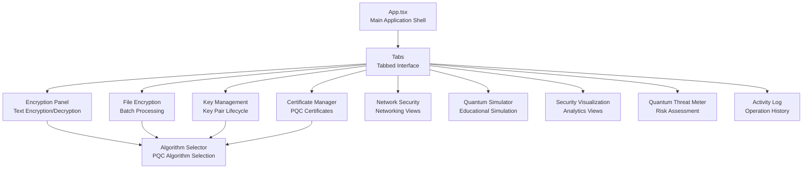
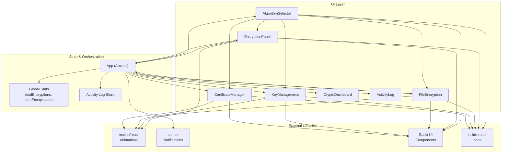
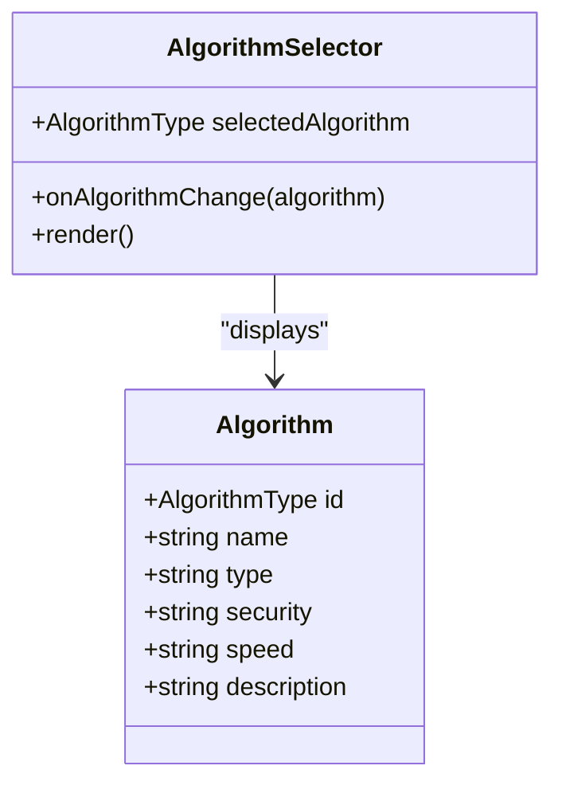
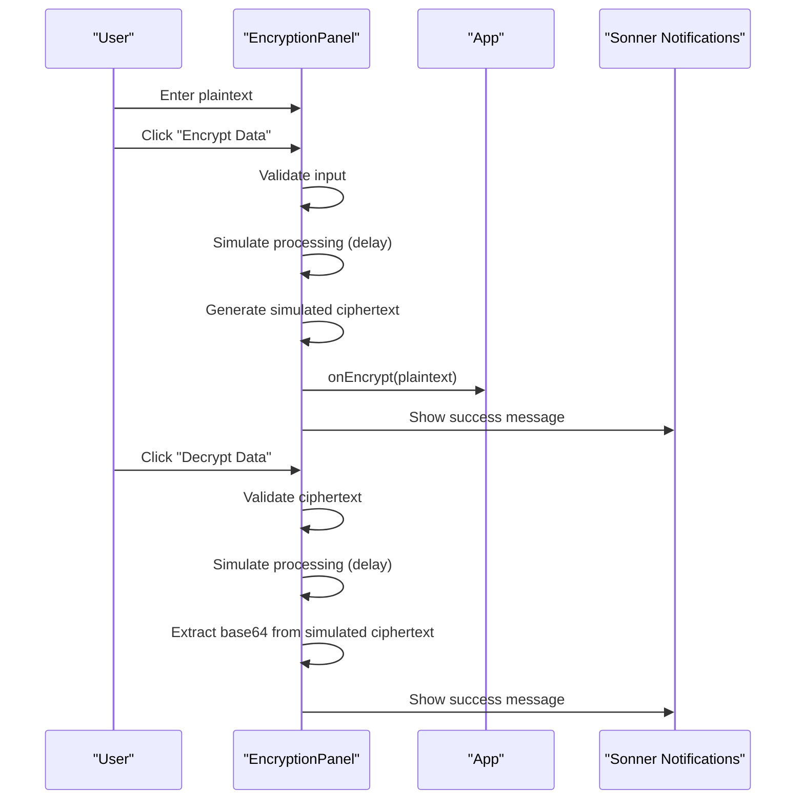
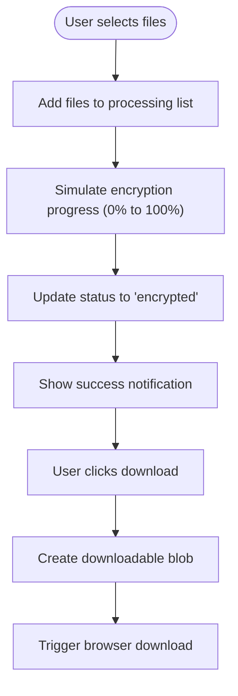
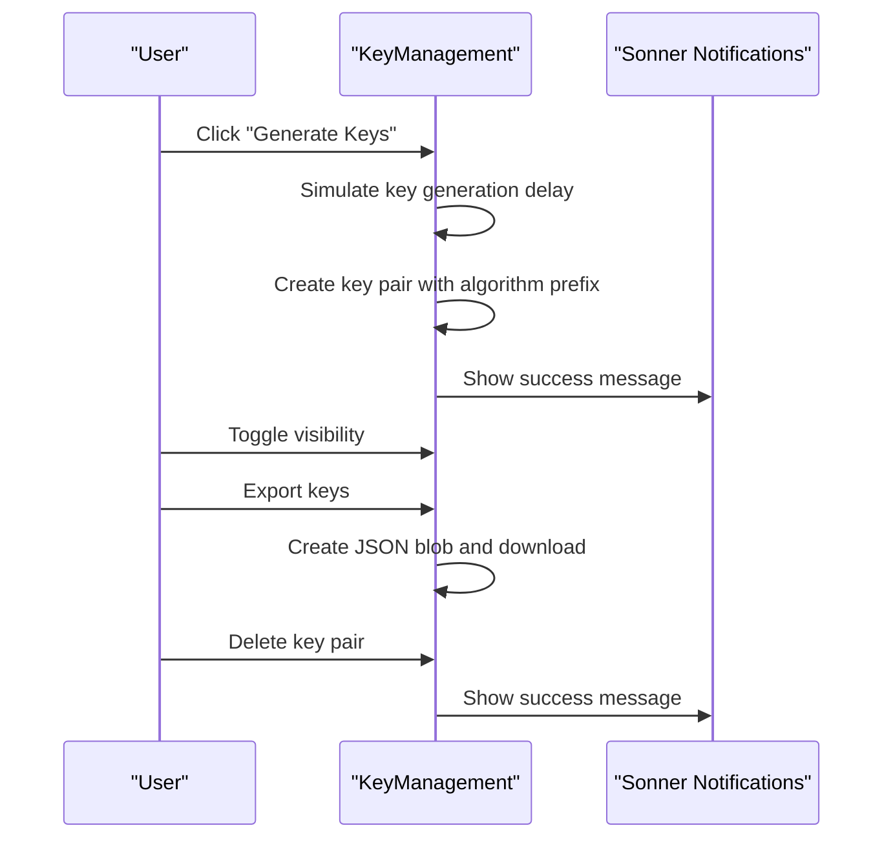
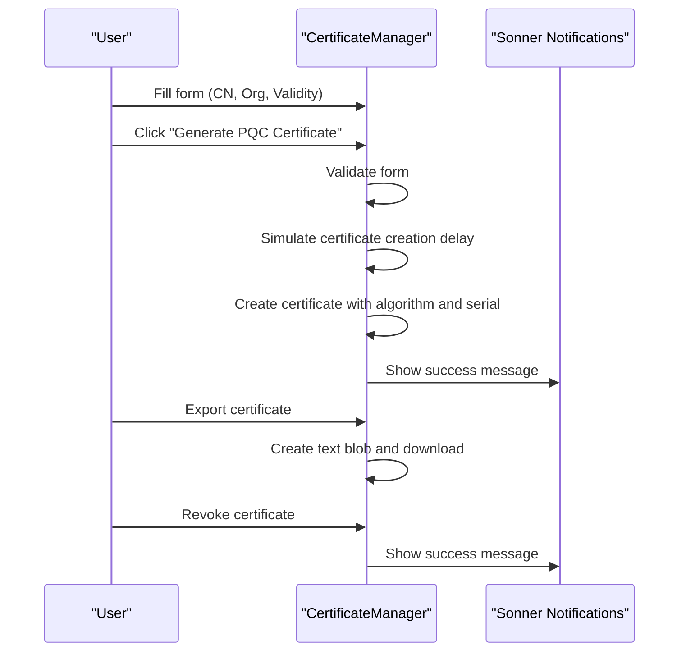
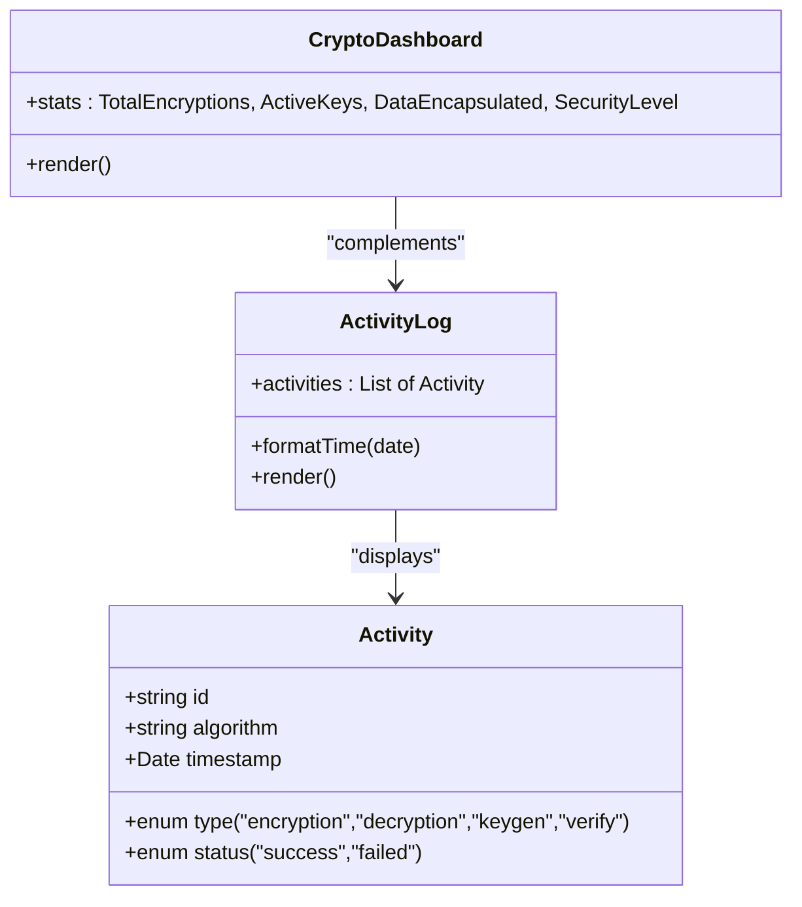
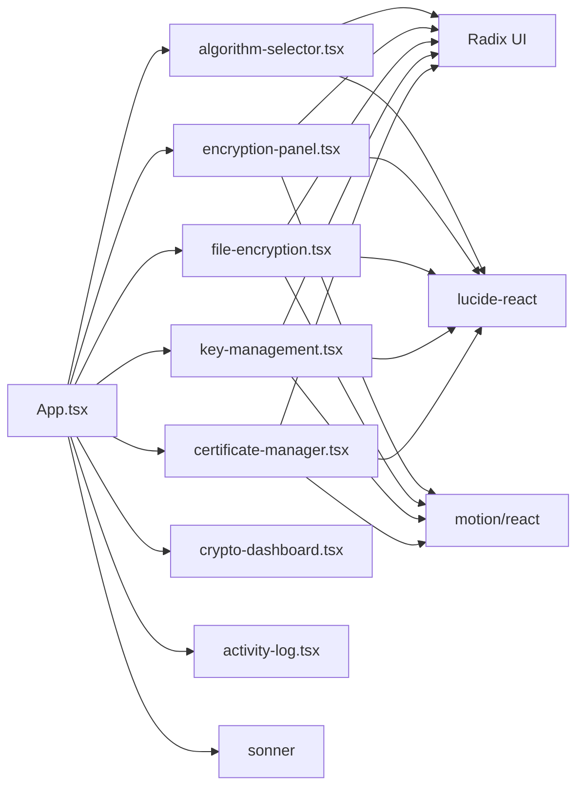

# Interactive Encryption Engine

<cite>
**Referenced Files in This Document**
- [App.tsx](file://Design/src/app/App.tsx)
- [encryption-panel.tsx](file://Design/src/app/components/encryption-panel.tsx)
- [file-encryption.tsx](file://Design/src/app/components/file-encryption.tsx)
- [algorithm-selector.tsx](file://Design/src/app/components/algorithm-selector.tsx)
- [key-management.tsx](file://Design/src/app/components/key-management.tsx)
- [certificate-manager.tsx](file://Design/src/app/components/certificate-manager.tsx)
- [crypto-dashboard.tsx](file://Design/src/app/components/crypto-dashboard.tsx)
- [activity-log.tsx](file://Design/src/app/components/activity-log.tsx)
- [package.json](file://Design/package.json)
- [README.md](file://Design/README.md)
</cite>

## Table of Contents
1. [Introduction](#introduction)
2. [Project Structure](#project-structure)
3. [Core Components](#core-components)
4. [Architecture Overview](#architecture-overview)
5. [Detailed Component Analysis](#detailed-component-analysis)
6. [Dependency Analysis](#dependency-analysis)
7. [Performance Considerations](#performance-considerations)
8. [Troubleshooting Guide](#troubleshooting-guide)
9. [Conclusion](#conclusion)
10. [Appendices](#appendices)

## Introduction
This document describes the Interactive Encryption Engine, a React-based educational demonstration platform showcasing post-quantum cryptographic techniques. The engine simulates text and file encryption/decryption using quantum-resistant algorithms, provides real-time visual feedback, and manages key and certificate lifecycles. It is designed for teaching and demonstration purposes, emphasizing accessibility and visual clarity while maintaining a realistic simulation of post-quantum security.

## Project Structure
The project follows a modular React architecture with feature-based components organized under a central application shell. The engine centers around two primary workflows:
- Text encryption/decryption panel with real-time feedback
- Batch file encryption with progress visualization

**Diagram sources**
- [App.tsx](file://Design/src/app/App.tsx#L208-L316)
- [algorithm-selector.tsx](file://Design/src/app/components/algorithm-selector.tsx#L73-L119)

**Section sources**
- [App.tsx](file://Design/src/app/App.tsx#L1-L362)
- [package.json](file://Design/package.json#L1-L93)

## Core Components
This section outlines the primary components that implement the encryption engine’s functionality.

- Algorithm Selector: Provides selection of post-quantum algorithms (CRYSTALS-Kyber, CRYSTALS-Dilithium, SPHINCS+, NTRU, SABER, FrodoKEM) with metadata and badges indicating security level, speed, and type.
- Encryption Panel: Handles plaintext input, simulates encryption/decryption, and provides copy/download actions with animated feedback.
- File Encryption: Manages batch file encryption with progress bars, status indicators, and download actions.
- Key Management: Generates, displays, exports, and deletes quantum-resistant key pairs with visibility toggles.
- Certificate Manager: Creates, exports, and revokes post-quantum X.509-like certificates with validity tracking.
- Dashboard and Activity Log: Track operational statistics and recent cryptographic activities.

**Section sources**
- [algorithm-selector.tsx](file://Design/src/app/components/algorithm-selector.tsx#L6-L121)
- [encryption-panel.tsx](file://Design/src/app/components/encryption-panel.tsx#L10-L238)
- [file-encryption.tsx](file://Design/src/app/components/file-encryption.tsx#L19-L229)
- [key-management.tsx](file://Design/src/app/components/key-management.tsx#L18-L221)
- [certificate-manager.tsx](file://Design/src/app/components/certificate-manager.tsx#L27-L295)
- [crypto-dashboard.tsx](file://Design/src/app/components/crypto-dashboard.tsx#L13-L70)
- [activity-log.tsx](file://Design/src/app/components/activity-log.tsx#L40-L117)

## Architecture Overview
The engine integrates UI components with state management and animation libraries to deliver an immersive, educational experience. The central application orchestrates tabbed views, maintains global statistics, and coordinates cross-component events such as encryption triggers and file processing callbacks.

**Diagram sources**
- [App.tsx](file://Design/src/app/App.tsx#L26-L91)
- [algorithm-selector.tsx](file://Design/src/app/components/algorithm-selector.tsx#L73-L119)
- [encryption-panel.tsx](file://Design/src/app/components/encryption-panel.tsx#L15-L96)
- [file-encryption.tsx](file://Design/src/app/components/file-encryption.tsx#L24-L111)
- [key-management.tsx](file://Design/src/app/components/key-management.tsx#L22-L95)
- [certificate-manager.tsx](file://Design/src/app/components/certificate-manager.tsx#L27-L111)

## Detailed Component Analysis

### Algorithm Selector
The selector presents six post-quantum algorithms with metadata badges and descriptions. It emits the chosen algorithm to parent components for use in encryption panels and key/certificate management.

**Diagram sources**
- [algorithm-selector.tsx](file://Design/src/app/components/algorithm-selector.tsx#L6-L121)

**Section sources**
- [algorithm-selector.tsx](file://Design/src/app/components/algorithm-selector.tsx#L68-L121)

### Text Encryption Panel
The panel simulates encryption and decryption of textual data. It validates inputs, simulates processing delays, and provides visual feedback via animations and notifications.

**Diagram sources**
- [encryption-panel.tsx](file://Design/src/app/components/encryption-panel.tsx#L45-L96)
- [App.tsx](file://Design/src/app/App.tsx#L47-L63)

**Section sources**
- [encryption-panel.tsx](file://Design/src/app/components/encryption-panel.tsx#L15-L238)

### File Encryption
The file encryption component enables batch processing of files with progress visualization and download actions. It simulates encryption progress and updates status accordingly.

**Diagram sources**
- [file-encryption.tsx](file://Design/src/app/components/file-encryption.tsx#L43-L111)
- [file-encryption.tsx](file://Design/src/app/components/file-encryption.tsx#L69-L100)

**Section sources**
- [file-encryption.tsx](file://Design/src/app/components/file-encryption.tsx#L24-L229)

### Key Management
Key management simulates generation, display, export, and deletion of quantum-resistant key pairs. It includes visibility toggles and formatted key truncation.

**Diagram sources**
- [key-management.tsx](file://Design/src/app/components/key-management.tsx#L32-L95)

**Section sources**
- [key-management.tsx](file://Design/src/app/components/key-management.tsx#L22-L221)

### Certificate Manager
The certificate manager creates, exports, and revokes post-quantum X.509-like certificates with validity tracking and status badges.

**Diagram sources**
- [certificate-manager.tsx](file://Design/src/app/components/certificate-manager.tsx#L51-L111)
- [certificate-manager.tsx](file://Design/src/app/components/certificate-manager.tsx#L82-L111)

**Section sources**
- [certificate-manager.tsx](file://Design/src/app/components/certificate-manager.tsx#L27-L295)

### Dashboard and Activity Log
The dashboard tracks operational metrics, while the activity log records recent cryptographic operations with timestamps and statuses.

**Diagram sources**
- [crypto-dashboard.tsx](file://Design/src/app/components/crypto-dashboard.tsx#L13-L70)
- [activity-log.tsx](file://Design/src/app/components/activity-log.tsx#L40-L117)

**Section sources**
- [crypto-dashboard.tsx](file://Design/src/app/components/crypto-dashboard.tsx#L13-L70)
- [activity-log.tsx](file://Design/src/app/components/activity-log.tsx#L40-L117)

## Dependency Analysis
The engine relies on a set of UI primitives, animations, notifications, and icons to deliver a polished user experience. The application orchestrates state across components and coordinates notifications and animations.

**Diagram sources**
- [App.tsx](file://Design/src/app/App.tsx#L1-L362)
- [package.json](file://Design/package.json#L10-L68)

**Section sources**
- [package.json](file://Design/package.json#L10-L68)

## Performance Considerations
- Animation overhead: The engine uses motion animations for feedback. While visually engaging, excessive concurrent animations can impact performance on lower-end devices. Consider throttling animation updates or disabling animations for constrained environments.
- Real-time updates: Frequent state updates (e.g., progress bars) can cause layout thrashing. The current implementation uses efficient React state updates and minimal DOM manipulation; however, for very large batches, consider virtualization or batching updates.
- Clipboard and downloads: Clipboard writes and blob downloads are asynchronous and generally lightweight. Ensure they are triggered only on user actions to avoid unnecessary overhead.
- Algorithm simulation: The current encryption/decryption is a deterministic simulation. For production-grade systems, replace simulations with actual cryptographic libraries to ensure security and performance parity.

[No sources needed since this section provides general guidance]

## Troubleshooting Guide
Common issues and resolutions:

- Empty input validation:
  - Symptom: Buttons disabled or error notifications when fields are empty.
  - Resolution: Ensure plaintext or ciphertext fields are populated before triggering operations.
  - References:
    - [encryption-panel.tsx](file://Design/src/app/components/encryption-panel.tsx#L46-L49)
    - [encryption-panel.tsx](file://Design/src/app/components/encryption-panel.tsx#L64-L67)

- Decryption failure:
  - Symptom: Decryption returns an invalid format message.
  - Cause: Ciphertext does not match expected simulated format.
  - Resolution: Verify the ciphertext was produced by the same algorithm and format.
  - References:
    - [encryption-panel.tsx](file://Design/src/app/components/encryption-panel.tsx#L32-L43)

- File encryption progress stalls:
  - Symptom: Progress bar remains static.
  - Cause: Simulated progress loop requires user interaction to trigger.
  - Resolution: Select files again to restart the simulation.
  - References:
    - [file-encryption.tsx](file://Design/src/app/components/file-encryption.tsx#L43-L67)
    - [file-encryption.tsx](file://Design/src/app/components/file-encryption.tsx#L69-L87)

- Notification spam:
  - Symptom: Excessive toast messages.
  - Resolution: Limit repeated notifications or debounce user-triggered actions.
  - References:
    - [encryption-panel.tsx](file://Design/src/app/components/encryption-panel.tsx#L50-L61)
    - [file-encryption.tsx](file://Design/src/app/components/file-encryption.tsx#L82-L84)

- Key visibility toggle:
  - Symptom: Private key remains hidden.
  - Resolution: Toggle visibility using the eye icon; private key is intentionally masked by default.
  - References:
    - [key-management.tsx](file://Design/src/app/components/key-management.tsx#L61-L71)

**Section sources**
- [encryption-panel.tsx](file://Design/src/app/components/encryption-panel.tsx#L45-L96)
- [file-encryption.tsx](file://Design/src/app/components/file-encryption.tsx#L43-L111)
- [key-management.tsx](file://Design/src/app/components/key-management.tsx#L61-L71)

## Conclusion
The Interactive Encryption Engine provides a comprehensive, visually engaging educational platform for exploring post-quantum cryptography. Its modular architecture, real-time feedback, and simulation-based workflows enable learners to understand encryption concepts without exposing real secrets. For production use, replace simulations with robust cryptographic libraries and implement strict input validation and error handling.

[No sources needed since this section summarizes without analyzing specific files]

## Appendices

### Supported Algorithms
The engine demonstrates six post-quantum algorithms:
- CRYSTALS-Kyber (Key Encapsulation Mechanism)
- CRYSTALS-Dilithium (Digital Signature)
- SPHINCS+ (Digital Signature)
- NTRU (Key Encapsulation Mechanism)
- SABER (Key Encapsulation Mechanism)
- FrodoKEM (Key Encapsulation Mechanism)

Each algorithm is presented with metadata including security level, speed rating, and a brief description.

**Section sources**
- [algorithm-selector.tsx](file://Design/src/app/components/algorithm-selector.tsx#L17-L66)

### File Formats and Batch Processing
- Supported formats: The file encryption component accepts any file type and simulates encryption for all selections.
- Batch processing: Multiple files can be selected simultaneously; each file receives individual progress tracking and can be downloaded separately.
- Output format: Encrypted files are downloaded as plain text blobs with metadata indicating the algorithm used.

**Section sources**
- [file-encryption.tsx](file://Design/src/app/components/file-encryption.tsx#L43-L111)
- [file-encryption.tsx](file://Design/src/app/components/file-encryption.tsx#L89-L100)

### Security Considerations
- Educational simulation: The engine simulates encryption/decryption and key generation. Do not use outputs for real-world cryptographic tasks.
- Data handling: Inputs are not persisted; all data resides in memory during the session.
- Export safety: Exported keys and certificates are plain text and intended for demonstration only.

**Section sources**
- [README.md](file://Design/README.md#L1-L11)
- [key-management.tsx](file://Design/src/app/components/key-management.tsx#L73-L95)
- [certificate-manager.tsx](file://Design/src/app/components/certificate-manager.tsx#L82-L106)

### Implementation Notes
- Real-time simulation: Delays and progress bars mimic real cryptographic processing time.
- Visual feedback: Animations and notifications provide immediate user feedback.
- Accessibility: Components use semantic HTML and accessible UI primitives.

**Section sources**
- [encryption-panel.tsx](file://Design/src/app/components/encryption-panel.tsx#L22-L43)
- [file-encryption.tsx](file://Design/src/app/components/file-encryption.tsx#L69-L87)
- [key-management.tsx](file://Design/src/app/components/key-management.tsx#L32-L49)