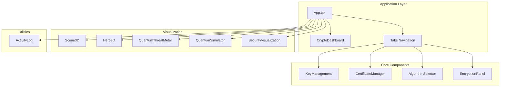
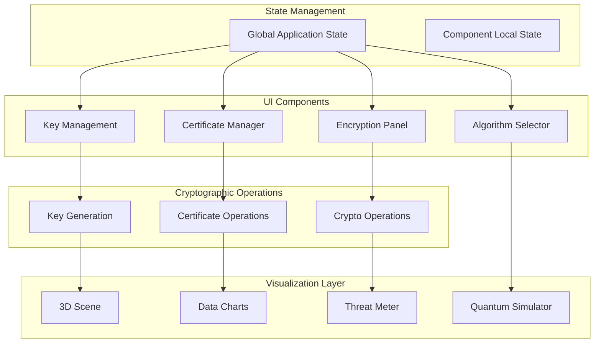
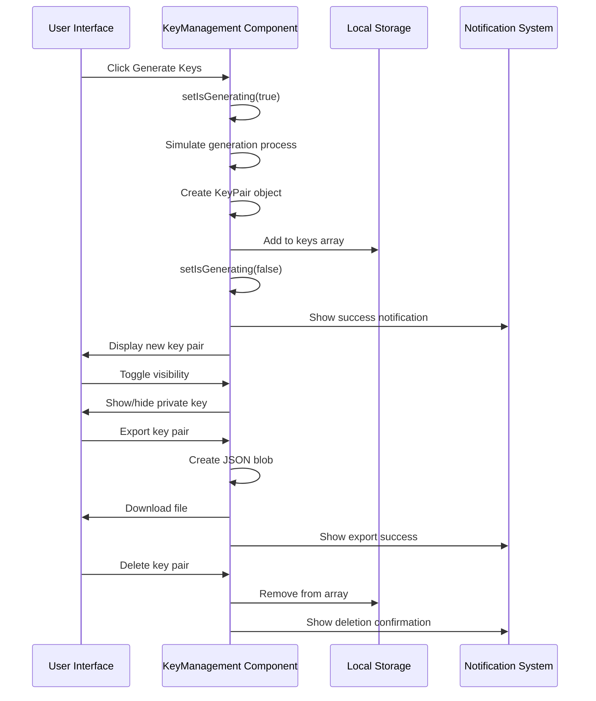
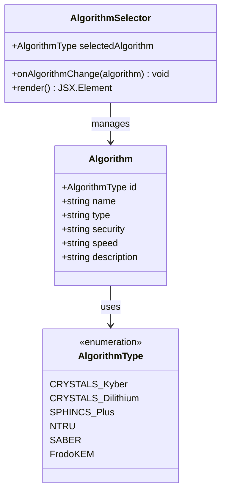
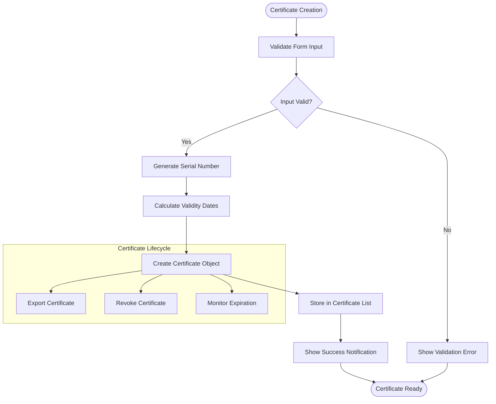
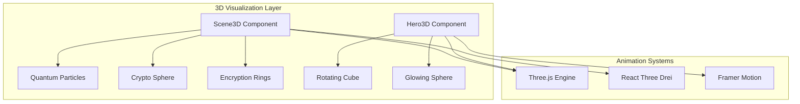
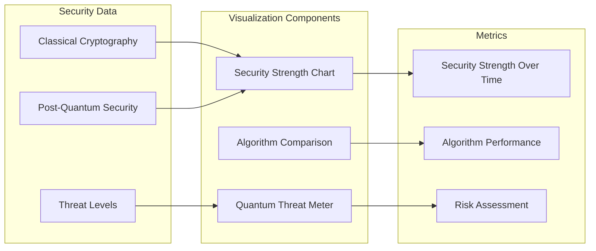

# Key Management System

<cite>
**Referenced Files in This Document**
- [App.tsx](file://Design/src/app/App.tsx)
- [key-management.tsx](file://Design/src/app/components/key-management.tsx)
- [algorithm-selector.tsx](file://Design/src/app/components/algorithm-selector.tsx)
- [encryption-panel.tsx](file://Design/src/app/components/encryption-panel.tsx)
- [certificate-manager.tsx](file://Design/src/app/components/certificate-manager.tsx)
- [crypto-dashboard.tsx](file://Design/src/app/components/crypto-dashboard.tsx)
- [security-visualization.tsx](file://Design/src/app/components/security-visualization.tsx)
- [quantum-simulator.tsx](file://Design/src/app/components/quantum-simulator.tsx)
- [quantum-threat-meter.tsx](file://Design/src/app/components/quantum-threat-meter.tsx)
- [3d-scene.tsx](file://Design/src/app/components/3d-scene.tsx)
- [3d-hero.tsx](file://Design/src/app/components/3d-hero.tsx)
- [activity-log.tsx](file://Design/src/app/components/activity-log.tsx)
- [package.json](file://Design/package.json)
- [README.md](file://Design/README.md)
</cite>

## Table of Contents
1. [Introduction](#introduction)
2. [Project Structure](#project-structure)
3. [Core Components](#core-components)
4. [Architecture Overview](#architecture-overview)
5. [Detailed Component Analysis](#detailed-component-analysis)
6. [Dependency Analysis](#dependency-analysis)
7. [Performance Considerations](#performance-considerations)
8. [Troubleshooting Guide](#troubleshooting-guide)
9. [Conclusion](#conclusion)
10. [Appendices](#appendices)

## Introduction
This document provides comprehensive documentation for the Key Management System focused on quantum-resistant key generation, storage, and lifecycle management. The system demonstrates post-quantum cryptography concepts through interactive components, including key generation workflows, secure key storage mechanisms, certificate management, and integration with 3D visualization components for educational purposes. It covers the key lifecycle from generation through expiration, including secure deletion and backup procedures, while highlighting security best practices and how the system illustrates post-quantum key characteristics.

## Project Structure
The Key Management System is built as a React application using modern web technologies. The project follows a component-based architecture with modular UI components, data visualization, and 3D animations to demonstrate cryptographic concepts.



**Diagram sources**
- [App.tsx](file://Design/src/app/App.tsx#L26-L362)
- [key-management.tsx](file://Design/src/app/components/key-management.tsx#L22-L221)
- [certificate-manager.tsx](file://Design/src/app/components/certificate-manager.tsx#L27-L295)

**Section sources**
- [App.tsx](file://Design/src/app/App.tsx#L1-L362)
- [package.json](file://Design/package.json#L1-L93)

## Core Components
The system consists of several interconnected components that work together to provide a comprehensive key management solution with educational visualization capabilities.

### Key Management Component
The central component for managing quantum-resistant key pairs, providing generation, storage, visibility control, and export functionality.

### Algorithm Selector
Provides selection of post-quantum cryptographic algorithms with detailed information about each algorithm's characteristics.

### Certificate Manager
Handles creation, management, and export of quantum-resistant X.509 certificates with validity tracking.

### Visualization Components
Multiple 3D visualization components that demonstrate quantum cryptography concepts through animated scenes and data visualizations.

**Section sources**
- [key-management.tsx](file://Design/src/app/components/key-management.tsx#L10-L221)
- [algorithm-selector.tsx](file://Design/src/app/components/algorithm-selector.tsx#L6-L121)
- [certificate-manager.tsx](file://Design/src/app/components/certificate-manager.tsx#L12-L295)

## Architecture Overview
The system follows a modular React architecture with clear separation of concerns between cryptographic operations, UI components, and educational visualizations.



**Diagram sources**
- [App.tsx](file://Design/src/app/App.tsx#L26-L362)
- [key-management.tsx](file://Design/src/app/components/key-management.tsx#L32-L49)
- [certificate-manager.tsx](file://Design/src/app/components/certificate-manager.tsx#L51-L80)

## Detailed Component Analysis

### Key Generation and Management Workflow
The key management system implements a comprehensive workflow for generating, storing, and managing quantum-resistant key pairs.



**Diagram sources**
- [key-management.tsx](file://Design/src/app/components/key-management.tsx#L32-L89)

#### Key Pair Structure and Properties
Each key pair maintains essential metadata for lifecycle management:

| Property | Type | Description |
|----------|------|-------------|
| id | string | Unique identifier for the key pair |
| algorithm | AlgorithmType | Selected post-quantum algorithm |
| publicKey | string | Public key material |
| privateKey | string | Private key material |
| created | Date | Creation timestamp |

#### Key Generation Algorithm Implementation
The system generates quantum-resistant key pairs using a structured approach:

1. **Algorithm Selection**: Based on user choice from supported post-quantum algorithms
2. **Key Material Generation**: Creates randomized key material with algorithm-specific prefixes
3. **Metadata Assignment**: Adds timestamps and identifiers
4. **Storage Integration**: Persists key pairs in component state

**Section sources**
- [key-management.tsx](file://Design/src/app/components/key-management.tsx#L10-L49)

### Algorithm Selection and Security Characteristics
The system supports six major post-quantum cryptographic algorithms, each with distinct security and performance characteristics.



**Diagram sources**
- [algorithm-selector.tsx](file://Design/src/app/components/algorithm-selector.tsx#L6-L66)

#### Algorithm Characteristics Matrix

| Algorithm | Type | Security Level | Speed | Description |
|-----------|------|----------------|-------|-------------|
| CRYSTALS-Kyber | KEM | NIST Level 3 | Fast | Lattice-based key encapsulation |
| CRYSTALS-Dilithium | Digital Signature | NIST Level 3 | Fast | Lattice-based signatures |
| SPHINCS+ | Digital Signature | NIST Level 5 | Moderate | Hash-based signatures |
| NTRU | KEM | NIST Level 1 | Very Fast | Lattice-based encryption |
| SABER | KEM | NIST Level 3 | Fast | Module lattice-based |
| FrodoKEM | KEM | NIST Level 5 | Slow | Conservative lattice-based |

**Section sources**
- [algorithm-selector.tsx](file://Design/src/app/components/algorithm-selector.tsx#L17-L66)

### Certificate Management System
The certificate manager provides comprehensive lifecycle management for quantum-resistant X.509 certificates.



**Diagram sources**
- [certificate-manager.tsx](file://Design/src/app/components/certificate-manager.tsx#L51-L80)

#### Certificate Status Management
The system tracks certificate status through three states:

1. **Valid**: Active certificates within validity period
2. **Expiring**: Certificates expiring within 30 days
3. **Expired**: Certificates outside validity period

**Section sources**
- [certificate-manager.tsx](file://Design/src/app/components/certificate-manager.tsx#L42-L49)

### 3D Visualization Integration
The system integrates multiple 3D visualization components to demonstrate quantum cryptography concepts through immersive experiences.



**Diagram sources**
- [3d-scene.tsx](file://Design/src/app/components/3d-scene.tsx#L6-L151)
- [3d-hero.tsx](file://Design/src/app/components/3d-hero.tsx#L6-L76)

#### Quantum Simulation Visualization
The 3D scene creates an immersive quantum simulation environment with:

- **Quantum Particles**: Animated particle systems representing quantum states
- **Crypto Sphere**: Rotating sphere with quantum encryption visualization
- **Encryption Rings**: Orbital rings representing cryptographic concepts
- **Dynamic Lighting**: Color-changing lighting effects for quantum themes

**Section sources**
- [3d-scene.tsx](file://Design/src/app/components/3d-scene.tsx#L60-L151)

### Security Visualization and Analytics
The system provides comprehensive security analytics through interactive charts and threat assessments.



**Diagram sources**
- [security-visualization.tsx](file://Design/src/app/components/security-visualization.tsx#L5-L107)
- [quantum-threat-meter.tsx](file://Design/src/app/components/quantum-threat-meter.tsx#L13-L38)

**Section sources**
- [security-visualization.tsx](file://Design/src/app/components/security-visualization.tsx#L24-L107)
- [quantum-threat-meter.tsx](file://Design/src/app/components/quantum-threat-meter.tsx#L40-L149)

## Dependency Analysis
The system relies on several key dependencies for cryptographic operations, UI components, and 3D visualization.

```mermaid
graph TB
subgraph "Core Dependencies"
React[React 18.3.1]
Motion[Motion 12.23.24]
RadixUI[Radix UI]
Sonner[Sonner]
end
subgraph "3D Visualization"
ThreeJS[Three.js ^0.182.0]
Fiber[@react-three/fiber ^9.5.0]
Drei[@react-three/drei ^10.7.7]
end
subgraph "Data Visualization"
Recharts[Recharts 2.15.2]
ChartComponents[Chart Components]
end
subgraph "UI Components"
TailwindCSS[Tailwind CSS]
ShadcnUI[Shadcn UI]
LucideIcons[Lucide Icons]
end
subgraph "Development Tools"
Vite[Vite 6.3.5]
TailwindVite[Tailwind Vite Plugin]
ReactPlugin[React Plugin]
end
App --> React
App --> Motion
App --> RadixUI
App --> Sonner
Visualization --> ThreeJS
Visualization --> Fiber
Visualization --> Drei
Charts --> Recharts
Charts --> ChartComponents
UI --> TailwindCSS
UI --> ShadcnUI
UI --> LucideIcons
Build --> Vite
Build --> TailwindVite
Build --> ReactPlugin
```

**Diagram sources**
- [package.json](file://Design/package.json#L10-L68)

### External Dependencies Analysis
The system leverages specialized libraries for different functionalities:

- **@react-three/fiber**: React renderer for Three.js enabling declarative 3D graphics
- **@react-three/drei**: Helpful helpers for @react-three/fiber applications
- **motion/react**: Animation library for smooth transitions and interactions
- **recharts**: Composable charting library for data visualization
- **lucide-react**: Consistent icon library for UI elements

**Section sources**
- [package.json](file://Design/package.json#L10-L68)

## Performance Considerations
The system is designed with performance optimization in mind, particularly for the 3D visualization components and real-time updates.

### 3D Rendering Optimization
- **Instanced Meshes**: Uses instanced rendering for efficient particle systems
- **Frame Rate Control**: Limits animation updates to maintain smooth performance
- **Memory Management**: Proper cleanup of Three.js resources and event listeners
- **Lazy Loading**: 3D components are rendered only when visible

### State Management Efficiency
- **Component Isolation**: Each component manages its own state independently
- **Selective Updates**: React's virtual DOM ensures minimal re-renders
- **Animation Optimization**: Motion components use efficient animation libraries
- **Event Delegation**: Proper event handling to prevent memory leaks

### Data Visualization Performance
- **Responsive Charts**: Recharts automatically adapts to container size changes
- **Efficient Updates**: Chart components update only when data changes
- **Memory Optimization**: Chart data is managed efficiently to prevent memory leaks

## Troubleshooting Guide

### Common Issues and Solutions

#### Key Generation Problems
- **Issue**: Keys not generating properly
- **Solution**: Check browser console for errors, ensure proper algorithm selection
- **Prevention**: Validate input parameters before generation

#### 3D Visualization Issues
- **Issue**: 3D scenes not rendering
- **Solution**: Verify WebGL support, check browser compatibility
- **Debugging**: Inspect Three.js console messages for initialization errors

#### Performance Issues
- **Issue**: Slow animations or rendering
- **Solution**: Reduce particle count, disable unnecessary animations
- **Optimization**: Use browser developer tools to profile performance

#### Certificate Management Problems
- **Issue**: Certificates not exporting correctly
- **Solution**: Check browser download permissions, verify certificate validity
- **Validation**: Ensure proper certificate format before export

**Section sources**
- [key-management.tsx](file://Design/src/app/components/key-management.tsx#L73-L89)
- [certificate-manager.tsx](file://Design/src/app/components/certificate-manager.tsx#L82-L106)

## Conclusion
The Key Management System provides a comprehensive educational platform for understanding quantum-resistant cryptography through interactive demonstrations and practical implementations. The system successfully integrates multiple visualization components to illustrate complex cryptographic concepts while maintaining a clean, modular architecture that supports future enhancements.

Key strengths of the system include:
- **Educational Focus**: Clear demonstration of post-quantum concepts through interactive components
- **Modular Architecture**: Well-separated concerns enabling easy maintenance and extension
- **Visual Learning**: Immersive 3D environments that enhance understanding of cryptographic principles
- **Practical Implementation**: Realistic key generation and management workflows
- **Performance Optimization**: Efficient rendering and state management for smooth user experience

The system serves as an excellent foundation for developers and educators seeking to understand and implement quantum-resistant cryptographic solutions in modern applications.

## Appendices

### Security Best Practices
- **Key Rotation**: Regularly rotate quantum-resistant keys according to organizational policies
- **Secure Storage**: Implement hardware security modules (HSMs) for production key storage
- **Access Control**: Restrict access to private keys using role-based permissions
- **Backup Procedures**: Maintain encrypted backups of key material with proper disaster recovery plans
- **Audit Logging**: Track all key-related operations for compliance and security monitoring

### Integration Patterns
- **Microservice Architecture**: Consider separating key management into dedicated microservices
- **Cloud Integration**: Integrate with cloud key management services for scalability
- **Hardware Security Modules**: Connect with HSMs for enterprise-grade key storage
- **API Design**: Implement RESTful APIs for external system integration
- **Monitoring Integration**: Connect with existing monitoring and alerting systems

### Future Enhancements
- **Hardware Integration**: Add support for hardware security modules and smart cards
- **Multi-Factor Authentication**: Implement MFA for key access and management
- **Advanced Analytics**: Add machine learning for threat detection and prediction
- **Cross-Platform Support**: Extend to mobile platforms and native applications
- **Enterprise Features**: Add support for hierarchical key management and policy enforcement