# Real-time Cryptographic Dashboard

<cite>
**Referenced Files in This Document**
- [crypto-dashboard.tsx](file://src/app/components/crypto-dashboard.tsx)
- [App.tsx](file://src/app/App.tsx)
- [algorithm-selector.tsx](file://src/app/components/algorithm-selector.tsx)
- [encryption-panel.tsx](file://src/app/components/encryption-panel.tsx)
- [file-encryption.tsx](file://src/app/components/file-encryption.tsx)
- [key-management.tsx](file://src/app/components/key-management.tsx)
- [certificate-manager.tsx](file://src/app/components/certificate-manager.tsx)
- [network-security.tsx](file://src/app/components/network-security.tsx)
- [quantum-simulator.tsx](file://src/app/components/quantum-simulator.tsx)
- [security-visualization.tsx](file://src/app/components/security-visualization.tsx)
- [activity-log.tsx](file://src/app/components/activity-log.tsx)
- [quantum-threat-meter.tsx](file://src/app/components/quantum-threat-meter.tsx)
- [README.md](file://README.md)
- [package.json](file://package.json)
- [main.tsx](file://src/main.tsx)
</cite>

## Table of Contents
1. [Introduction](#introduction)
2. [Project Structure](#project-structure)
3. [Core Components](#core-components)
4. [Architecture Overview](#architecture-overview)
5. [Detailed Component Analysis](#detailed-component-analysis)
6. [Dependency Analysis](#dependency-analysis)
7. [Performance Considerations](#performance-considerations)
8. [Troubleshooting Guide](#troubleshooting-guide)
9. [Conclusion](#conclusion)
10. [Appendices](#appendices)

## Introduction
The Real-time Cryptographic Dashboard is a React-based educational and demonstration platform showcasing post-quantum cryptographic techniques. It provides a unified interface for:
- Real-time performance metrics display (Total Encryptions, Active Keys, Data Encapsulated, Security Level)
- Activity monitoring and logging
- System health indicators (quantum threat levels, network security posture)
- Interactive visualizations for security trends and algorithm comparisons
- Hands-on components for encryption, key management, certificates, network scanning, and quantum simulator

The dashboard emphasizes learning objectives by simulating real-world cryptographic operations, visualizing quantum threats, and demonstrating the practical impact of migrating to post-quantum cryptography.

## Project Structure
The project follows a component-driven architecture with a single-page application entry point. Key directories and files:
- src/app/components: Reusable UI and functional components for dashboard features
- src/app: Application shell and routing via tabs
- src/styles: Tailwind-based styling
- src/main.tsx: Root entry rendering the App component

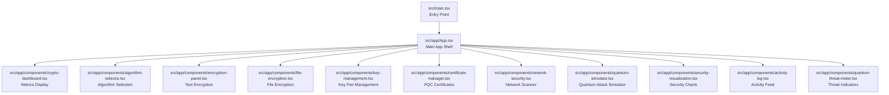

**Diagram sources**
- [main.tsx](file://src/main.tsx#L1-L7)
- [App.tsx](file://src/app/App.tsx#L1-L362)
- [crypto-dashboard.tsx](file://src/app/components/crypto-dashboard.tsx#L1-L70)
- [algorithm-selector.tsx](file://src/app/components/algorithm-selector.tsx#L1-L121)
- [encryption-panel.tsx](file://src/app/components/encryption-panel.tsx#L1-L238)
- [file-encryption.tsx](file://src/app/components/file-encryption.tsx#L1-L229)
- [key-management.tsx](file://src/app/components/key-management.tsx#L1-L221)
- [certificate-manager.tsx](file://src/app/components/certificate-manager.tsx#L1-L295)
- [network-security.tsx](file://src/app/components/network-security.tsx#L1-L303)
- [quantum-simulator.tsx](file://src/app/components/quantum-simulator.tsx#L1-L316)
- [security-visualization.tsx](file://src/app/components/security-visualization.tsx#L1-L107)
- [activity-log.tsx](file://src/app/components/activity-log.tsx#L1-L117)
- [quantum-threat-meter.tsx](file://src/app/components/quantum-threat-meter.tsx#L1-L149)

**Section sources**
- [README.md](file://README.md#L1-L11)
- [package.json](file://package.json#L1-L93)
- [main.tsx](file://src/main.tsx#L1-L7)

## Core Components
This section documents the primary building blocks of the dashboard and their roles in displaying metrics, monitoring activity, and visualizing system health.

- CryptoDashboard: Renders four key metrics cards (Total Encryptions, Active Keys, Data Encapsulated, Security Level) and integrates with the parent App’s state.
- AlgorithmSelector: Provides a dropdown to choose among post-quantum algorithms and displays metadata (security level, speed, type).
- EncryptionPanel: Simulates encryption and decryption of text data, updates metrics, and logs activities.
- FileEncryption: Handles batch file encryption with progress visualization and downloads.
- KeyManagement: Generates, manages, exports, and toggles visibility of quantum-resistant key pairs.
- CertificateManager: Creates and manages post-quantum X.509-like certificates with validity tracking.
- NetworkSecurity: Scans network nodes, assesses quantum threat levels, and upgrades classical nodes to PQC.
- QuantumSimulator: Simulates quantum attacks on classical and post-quantum algorithms with real-time progress.
- SecurityVisualization: Presents charts for security strength over time and algorithm performance comparison.
- ActivityLog: Displays recent cryptographic operations with timestamps and statuses.
- QuantumThreatMeter: Shows current quantum threat posture versus classical vulnerability.

**Section sources**
- [crypto-dashboard.tsx](file://src/app/components/crypto-dashboard.tsx#L1-L70)
- [algorithm-selector.tsx](file://src/app/components/algorithm-selector.tsx#L1-L121)
- [encryption-panel.tsx](file://src/app/components/encryption-panel.tsx#L1-L238)
- [file-encryption.tsx](file://src/app/components/file-encryption.tsx#L1-L229)
- [key-management.tsx](file://src/app/components/key-management.tsx#L1-L221)
- [certificate-manager.tsx](file://src/app/components/certificate-manager.tsx#L1-L295)
- [network-security.tsx](file://src/app/components/network-security.tsx#L1-L303)
- [quantum-simulator.tsx](file://src/app/components/quantum-simulator.tsx#L1-L316)
- [security-visualization.tsx](file://src/app/components/security-visualization.tsx#L1-L107)
- [activity-log.tsx](file://src/app/components/activity-log.tsx#L1-L117)
- [quantum-threat-meter.tsx](file://src/app/components/quantum-threat-meter.tsx#L1-L149)

## Architecture Overview
The dashboard is structured around a central App component that:
- Maintains global state for selected algorithm, recent activities, and dashboard metrics
- Passes props down to child components
- Integrates UI primitives from a shared component library
- Uses third-party libraries for animations, charts, and notifications

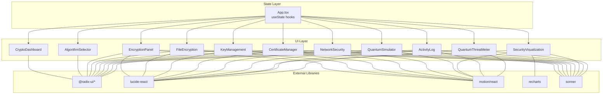

**Diagram sources**
- [App.tsx](file://src/app/App.tsx#L1-L362)
- [crypto-dashboard.tsx](file://src/app/components/crypto-dashboard.tsx#L1-L70)
- [algorithm-selector.tsx](file://src/app/components/algorithm-selector.tsx#L1-L121)
- [encryption-panel.tsx](file://src/app/components/encryption-panel.tsx#L1-L238)
- [file-encryption.tsx](file://src/app/components/file-encryption.tsx#L1-L229)
- [key-management.tsx](file://src/app/components/key-management.tsx#L1-L221)
- [certificate-manager.tsx](file://src/app/components/certificate-manager.tsx#L1-L295)
- [network-security.tsx](file://src/app/components/network-security.tsx#L1-L303)
- [quantum-simulator.tsx](file://src/app/components/quantum-simulator.tsx#L1-L316)
- [security-visualization.tsx](file://src/app/components/security-visualization.tsx#L1-L107)
- [activity-log.tsx](file://src/app/components/activity-log.tsx#L1-L117)
- [quantum-threat-meter.tsx](file://src/app/components/quantum-threat-meter.tsx#L1-L149)
- [package.json](file://package.json#L10-L68)

## Detailed Component Analysis

### CryptoDashboard Metrics Display
The dashboard presents four summary metrics cards:
- Total Encryptions: Incremented on successful encryption actions
- Active Keys: Count of generated key pairs
- Data Encapsulated: Aggregated size of encrypted data (updated per operation)
- Security Level: Static indicator emphasizing post-quantum readiness

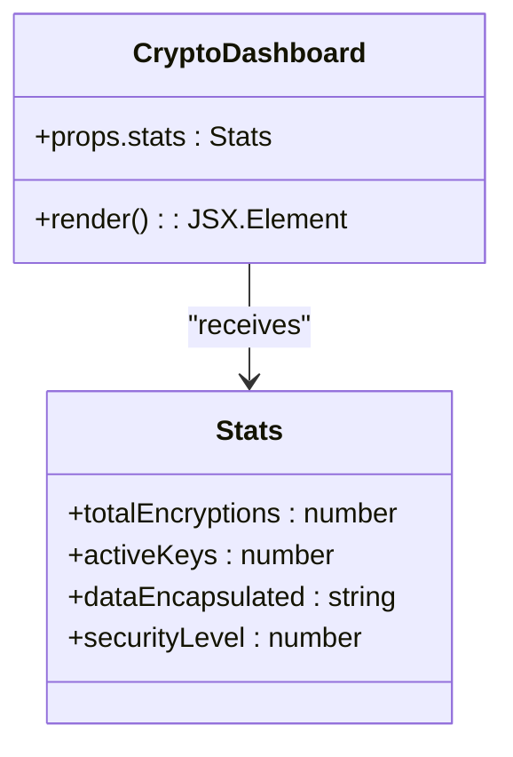

**Diagram sources**
- [crypto-dashboard.tsx](file://src/app/components/crypto-dashboard.tsx#L4-L11)

**Section sources**
- [crypto-dashboard.tsx](file://src/app/components/crypto-dashboard.tsx#L13-L69)

### Algorithm Selector and Metadata
Provides selection of post-quantum algorithms with badges indicating security level, speed, and type. The selected algorithm influences downstream operations.

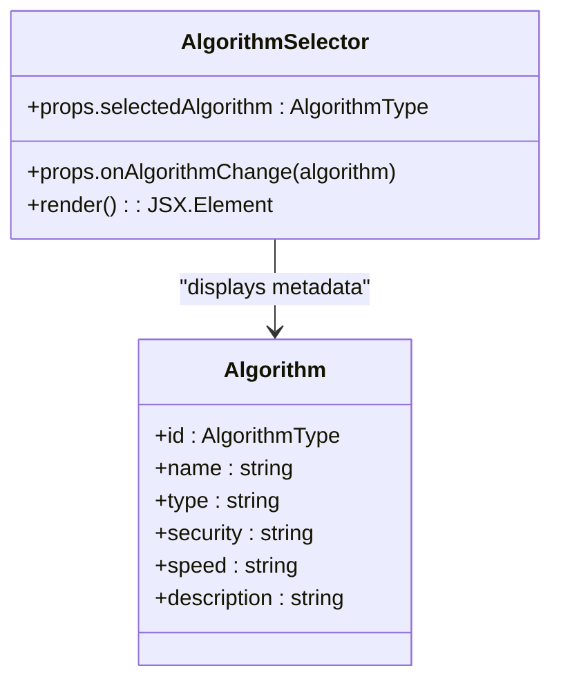

**Diagram sources**
- [algorithm-selector.tsx](file://src/app/components/algorithm-selector.tsx#L6-L15)
- [algorithm-selector.tsx](file://src/app/components/algorithm-selector.tsx#L73-L120)

**Section sources**
- [algorithm-selector.tsx](file://src/app/components/algorithm-selector.tsx#L1-L121)

### Encryption Panel (Text)
Simulates encryption and decryption of text data, updates metrics, and logs activities. Includes animated feedback and notifications.

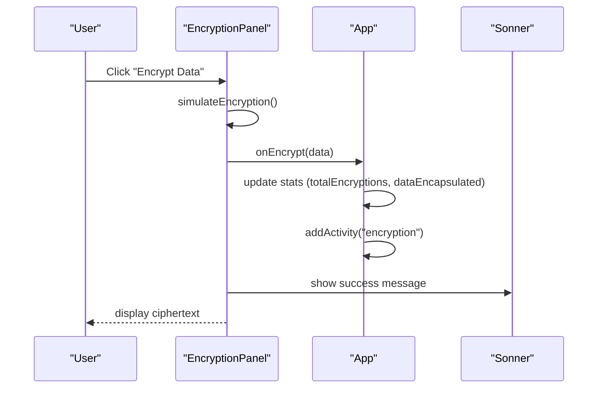

**Diagram sources**
- [encryption-panel.tsx](file://src/app/components/encryption-panel.tsx#L45-L61)
- [App.tsx](file://src/app/App.tsx#L47-L54)

**Section sources**
- [encryption-panel.tsx](file://src/app/components/encryption-panel.tsx#L1-L238)
- [App.tsx](file://src/app/App.tsx#L36-L63)

### File Encryption
Handles multiple file uploads, simulates encryption progress, and allows downloading encrypted files. Updates metrics and logs activities.

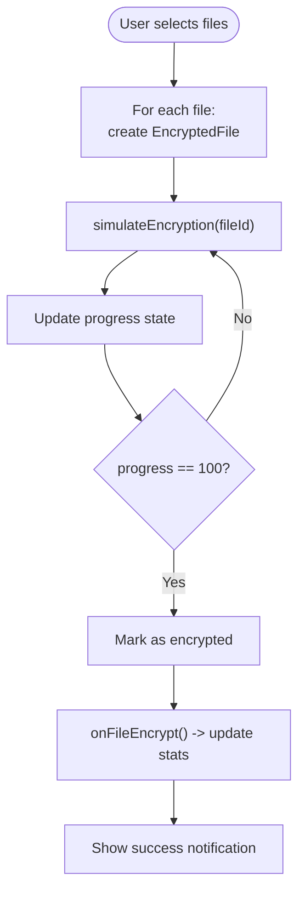

**Diagram sources**
- [file-encryption.tsx](file://src/app/components/file-encryption.tsx#L69-L87)
- [file-encryption.tsx](file://src/app/components/file-encryption.tsx#L89-L100)
- [App.tsx](file://src/app/App.tsx#L56-L63)

**Section sources**
- [file-encryption.tsx](file://src/app/components/file-encryption.tsx#L1-L229)
- [App.tsx](file://src/app/App.tsx#L56-L63)

### Key Management
Generates quantum-resistant key pairs, manages visibility, exports keys, and deletes pairs. Demonstrates realistic key handling patterns.

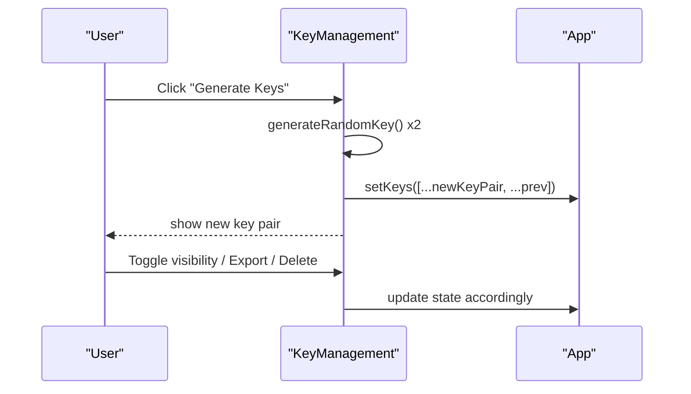

**Diagram sources**
- [key-management.tsx](file://src/app/components/key-management.tsx#L32-L49)
- [key-management.tsx](file://src/app/components/key-management.tsx#L73-L89)

**Section sources**
- [key-management.tsx](file://src/app/components/key-management.tsx#L1-L221)

### Certificate Manager
Creates post-quantum X.509-like certificates with validity tracking, exports, and revocation.

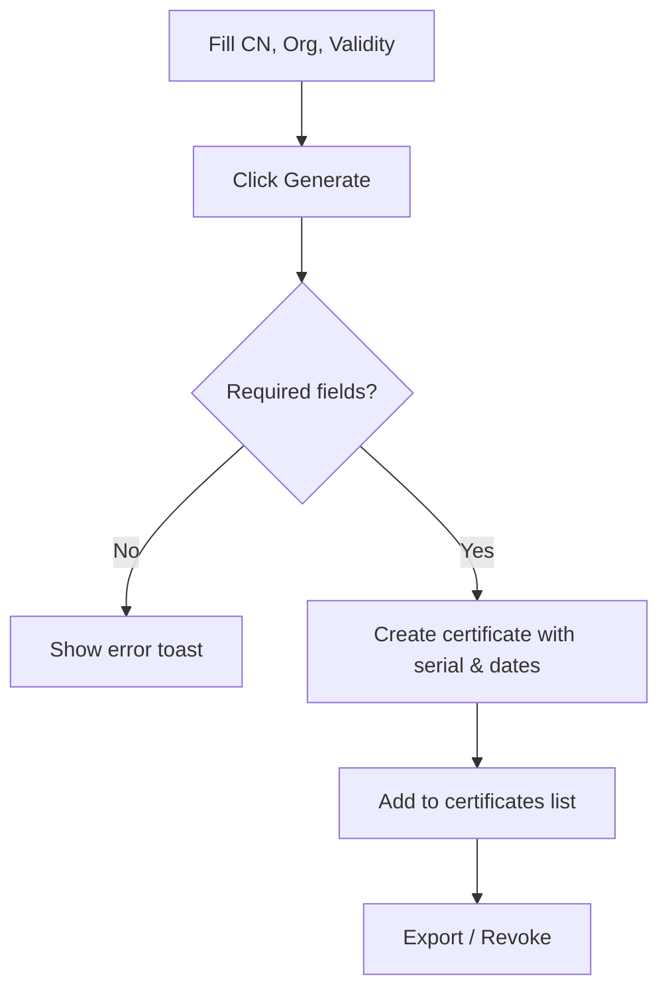

**Diagram sources**
- [certificate-manager.tsx](file://src/app/components/certificate-manager.tsx#L51-L80)
- [certificate-manager.tsx](file://src/app/components/certificate-manager.tsx#L82-L111)

**Section sources**
- [certificate-manager.tsx](file://src/app/components/certificate-manager.tsx#L1-L295)

### Network Security
Scans network nodes, evaluates quantum threat levels, and upgrades classical nodes to PQC.

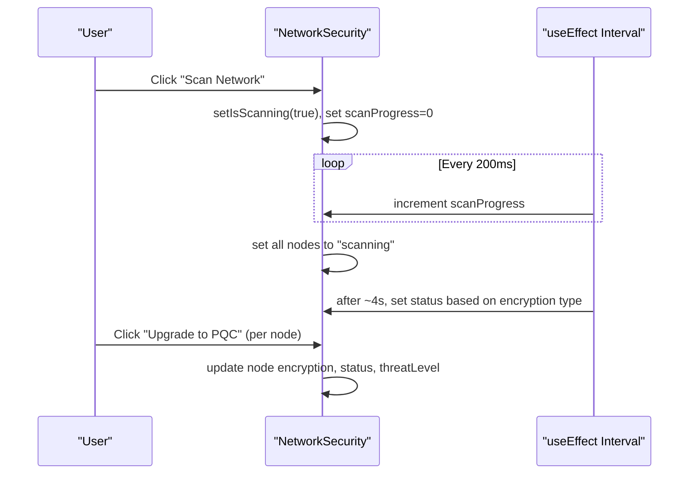

**Diagram sources**
- [network-security.tsx](file://src/app/components/network-security.tsx#L87-L102)
- [network-security.tsx](file://src/app/components/network-security.tsx#L104-L110)

**Section sources**
- [network-security.tsx](file://src/app/components/network-security.tsx#L1-L303)

### Quantum Simulator
Simulates quantum attacks on classical and post-quantum algorithms with adjustable qubit count and real-time progress.

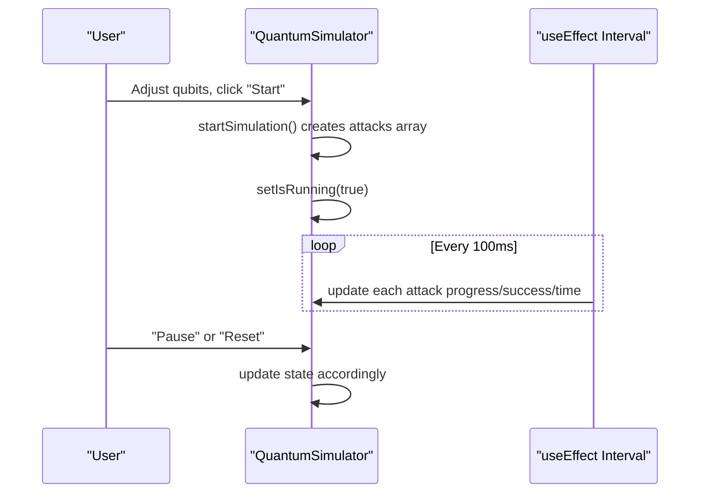

**Diagram sources**
- [quantum-simulator.tsx](file://src/app/components/quantum-simulator.tsx#L50-L70)
- [quantum-simulator.tsx](file://src/app/components/quantum-simulator.tsx#L25-L48)

**Section sources**
- [quantum-simulator.tsx](file://src/app/components/quantum-simulator.tsx#L1-L316)

### Security Visualization
Displays two charts:
- Security Strength Over Time: Area chart comparing classical vs post-quantum security percentages
- Algorithm Performance Comparison: Bar chart of encryption speed and security across PQC algorithms

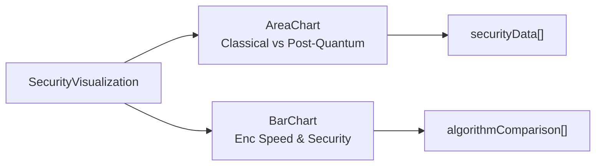

**Diagram sources**
- [security-visualization.tsx](file://src/app/components/security-visualization.tsx#L5-L22)
- [security-visualization.tsx](file://src/app/components/security-visualization.tsx#L24-L106)

**Section sources**
- [security-visualization.tsx](file://src/app/components/security-visualization.tsx#L1-L107)

### Activity Log
Renders recent cryptographic operations with icons, timestamps, and status badges. Supports animated entry transitions.

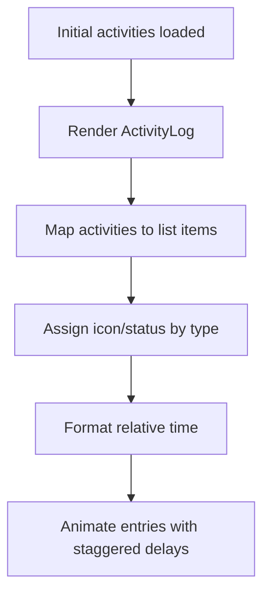

**Diagram sources**
- [App.tsx](file://src/app/App.tsx#L66-L91)
- [activity-log.tsx](file://src/app/components/activity-log.tsx#L40-L116)

**Section sources**
- [activity-log.tsx](file://src/app/components/activity-log.tsx#L1-L117)
- [App.tsx](file://src/app/App.tsx#L66-L91)

### Quantum Threat Meter
Shows current quantum threat posture versus classical vulnerability with progress bars and risk level labels.

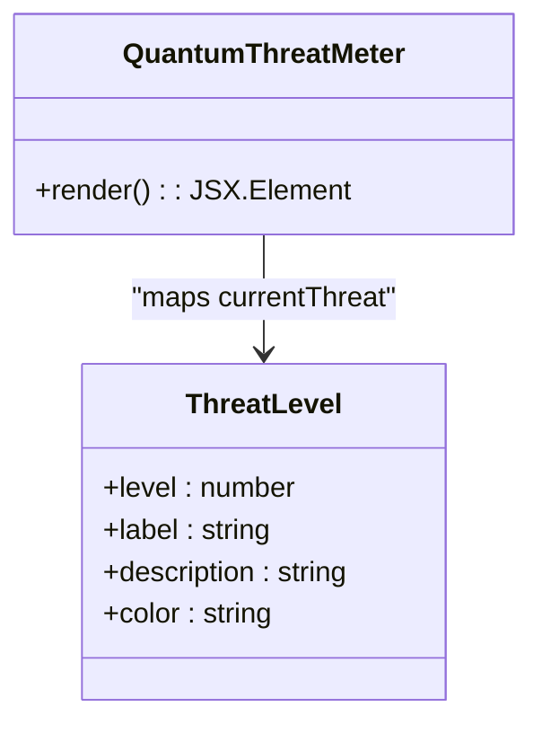

**Diagram sources**
- [quantum-threat-meter.tsx](file://src/app/components/quantum-threat-meter.tsx#L6-L11)
- [quantum-threat-meter.tsx](file://src/app/components/quantum-threat-meter.tsx#L40-L149)

**Section sources**
- [quantum-threat-meter.tsx](file://src/app/components/quantum-threat-meter.tsx#L1-L149)

## Dependency Analysis
The dashboard relies on several external libraries for UI, animations, charts, and notifications. The dependency graph below reflects the primary integrations used across components.

```mermaid
graph TB
P["package.json<br/>dependencies"] --> RUI["@radix-ui/*"]
P --> LUCIDE["lucide-react"]
P --> MOTION["motion/react"]
P --> RECHARTS["recharts"]
P --> SONNER["sonner"]
subgraph "Components Using Dependencies"
C1["CryptoDashboard"]
C2["AlgorithmSelector"]
C3["EncryptionPanel"]
C4["FileEncryption"]
C5["KeyManagement"]
C6["CertificateManager"]
C7["NetworkSecurity"]
C8["QuantumSimulator"]
C9["SecurityVisualization"]
C10["ActivityLog"]
C11["QuantumThreatMeter"]
end
C1 --- RUI
C2 --- RUI
C3 --- RUI
C4 --- RUI
C5 --- RUI
C6 --- RUI
C7 --- RUI
C8 --- RUI
C9 --- RUI
C10 --- RUI
C11 --- RUI
C1 --- LUCIDE
C2 --- LUCIDE
C3 --- LUCIDE
C4 --- LUCIDE
C5 --- LUCIDE
C6 --- LUCIDE
C7 --- LUCIDE
C8 --- LUCIDE
C9 --- LUCIDE
C10 --- LUCIDE
C11 --- LUCIDE
C3 --- MOTION
C4 --- MOTION
C5 --- MOTION
C6 --- MOTION
C7 --- MOTION
C8 --- MOTION
C9 --- MOTION
C10 --- MOTION
C11 --- MOTION
C9 --- RECHARTS
C3 --- SONNER
C4 --- SONNER
C5 --- SONNER
C6 --- SONNER
C7 --- SONNER
C8 --- SONNER
C9 --- SONNER
C10 --- SONNER
C11 --- SONNER
```

**Diagram sources**
- [package.json](file://package.json#L10-L68)
- [crypto-dashboard.tsx](file://src/app/components/crypto-dashboard.tsx#L1-L2)
- [security-visualization.tsx](file://src/app/components/security-visualization.tsx#L1-L3)

**Section sources**
- [package.json](file://package.json#L10-L68)

## Performance Considerations
- Real-time updates: The dashboard uses React state updates and intervals for simulations (e.g., network scanning, quantum simulator). These are lightweight and suitable for a demo but should be throttled or canceled when not visible in production.
- Rendering overhead: Charts from recharts and animated lists from motion can be expensive with large datasets. For production, consider virtualization and chart optimization.
- Toast notifications: Sonner renders globally; limit concurrent toasts to avoid UI jank.
- Data aggregation: Metrics like dataEncapsulated are updated per operation. For high-frequency usage, consider batching updates to reduce re-renders.
- Animation performance: Motion animations are smooth but can impact low-end devices. Disable or simplify animations for constrained environments.

[No sources needed since this section provides general guidance]

## Troubleshooting Guide
Common issues and resolutions:
- Metrics not updating:
  - Verify that encryption and file encryption handlers call the appropriate callbacks to update stats and activities.
  - Confirm that the CryptoDashboard receives updated props from the parent App.
- Activity log empty:
  - Ensure initial activities are seeded and that addActivity appends new entries while limiting the list size.
- Quantum simulator not progressing:
  - Check that the interval is active and that attacks are being updated every 100ms.
  - Ensure startSimulation resets state properly and that pause/reset controls update running state.
- Network scanner stuck:
  - Validate the interval increments scanProgress and that the effect clears on unmount.
  - Confirm that after scanning completes, node statuses are recalculated based on encryption type.
- Notifications not appearing:
  - Ensure Sonner is rendered at the root and that toasts are triggered on successful operations.

**Section sources**
- [App.tsx](file://src/app/App.tsx#L36-L91)
- [quantum-simulator.tsx](file://src/app/components/quantum-simulator.tsx#L25-L48)
- [network-security.tsx](file://src/app/components/network-security.tsx#L71-L85)

## Conclusion
The Real-time Cryptographic Dashboard provides an immersive, educational environment for understanding post-quantum cryptography. Its modular component architecture enables clear separation of concerns, while integrated visualizations and interactive features support learning objectives. By leveraging state-driven updates, animations, and charting libraries, the dashboard effectively communicates system health, performance metrics, and quantum threat posture.

[No sources needed since this section summarizes without analyzing specific files]

## Appendices

### Dashboard Usage Examples
- Encrypt text data using a selected post-quantum algorithm and observe metric updates and activity log entries.
- Upload multiple files to simulate batch encryption and track progress.
- Generate key pairs, toggle visibility, export keys, and manage certificates.
- Scan a simulated network to assess quantum threat levels and upgrade nodes to PQC.
- Run the quantum simulator to visualize how quantum computers would attack classical versus post-quantum algorithms.
- Explore security charts to compare algorithm performance and security trends over time.

[No sources needed since this section provides general guidance]

### Metric Interpretation
- Total Encryptions: Cumulative count of encryption operations performed during the session.
- Active Keys: Number of generated key pairs currently stored.
- Data Encapsulated: Aggregate size of encrypted data, updated per operation.
- Security Level: Indicates readiness against quantum threats; in this demo, a high static value emphasizes post-quantum resilience.

[No sources needed since this section provides general guidance]

### Educational Insights
- The dashboard highlights the importance of migrating from classical cryptography to post-quantum alternatives.
- Visualizations demonstrate the long-term security benefits and performance trade-offs across different algorithms.
- Interactive components reinforce understanding of key lifecycle, certificate management, and network security posture.

[No sources needed since this section provides general guidance]