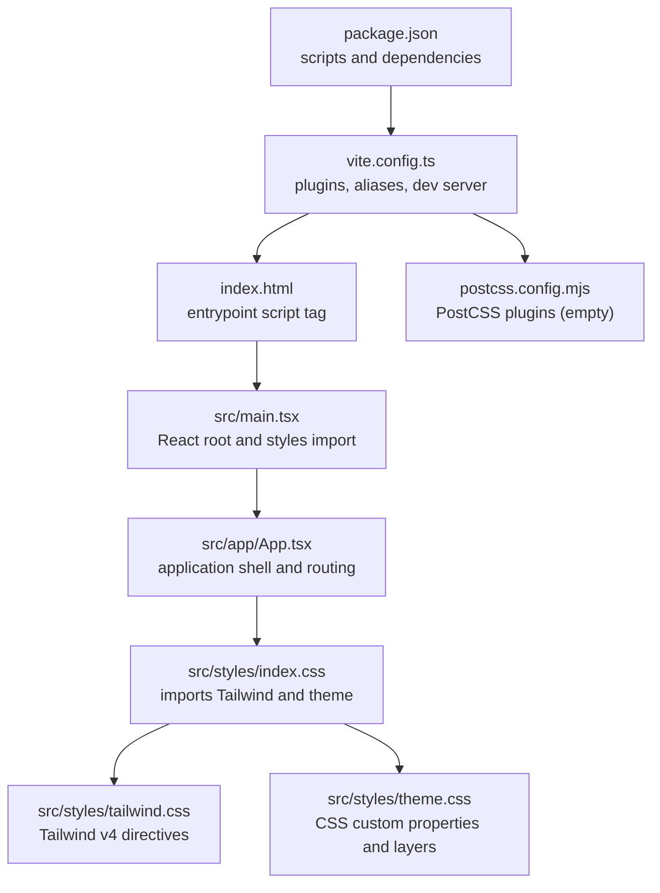
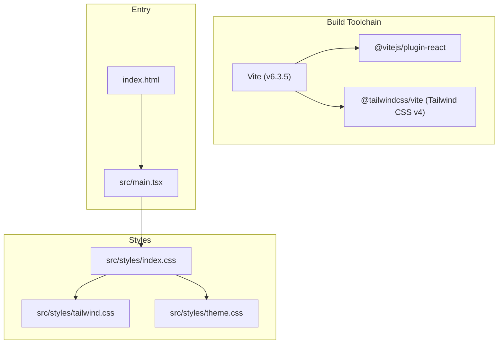
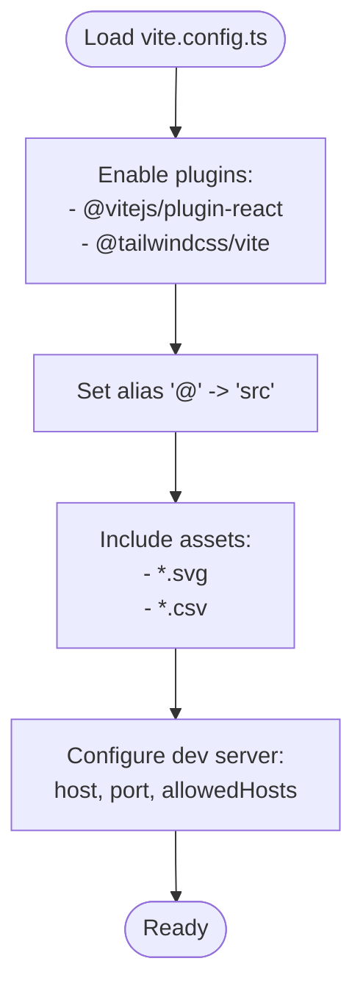
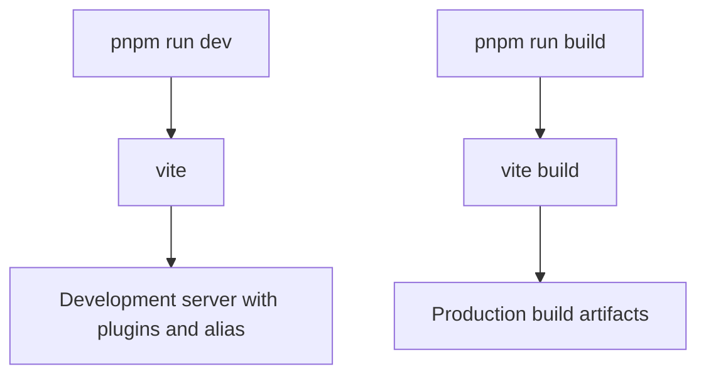
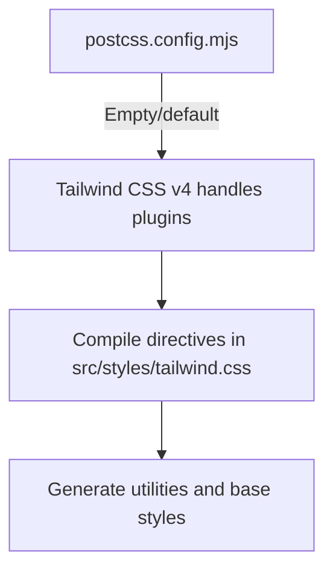
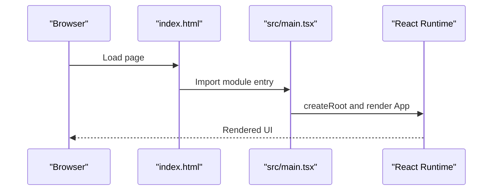
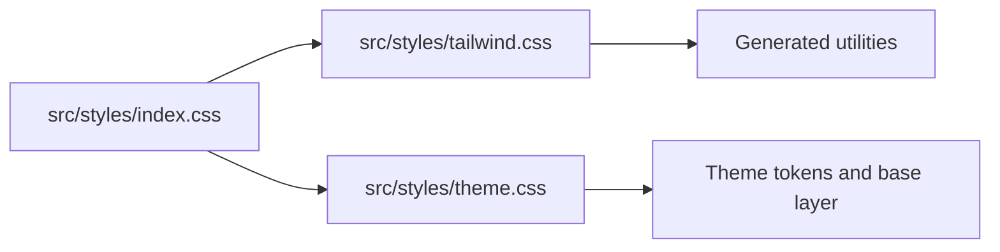
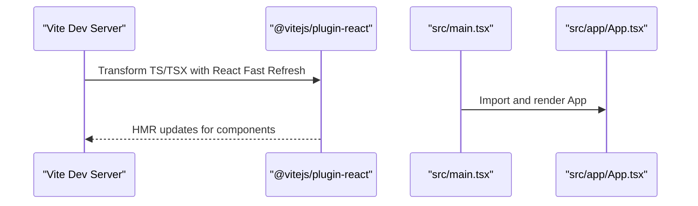
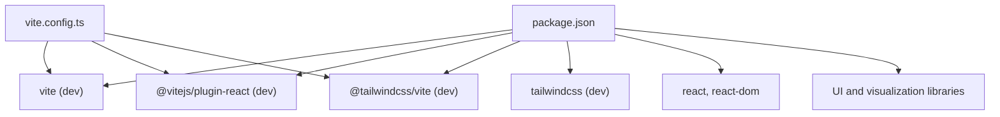

# Build and Configuration

<cite>
**Referenced Files in This Document**
- [package.json](file://package.json)
- [vite.config.ts](file://vite.config.ts)
- [postcss.config.mjs](file://postcss.config.mjs)
- [index.html](file://index.html)
- [src/main.tsx](file://src/main.tsx)
- [src/app/App.tsx](file://src/app/App.tsx)
- [src/styles/index.css](file://src/styles/index.css)
- [src/styles/tailwind.css](file://src/styles/tailwind.css)
- [src/styles/theme.css](file://src/styles/theme.css)
</cite>

## Table of Contents
1. [Introduction](#introduction)
2. [Project Structure](#project-structure)
3. [Core Components](#core-components)
4. [Architecture Overview](#architecture-overview)
5. [Detailed Component Analysis](#detailed-component-analysis)
6. [Dependency Analysis](#dependency-analysis)
7. [Performance Considerations](#performance-considerations)
8. [Troubleshooting Guide](#troubleshooting-guide)
9. [Conclusion](#conclusion)

## Introduction
This document explains the Build and Configuration setup for the Post-Quantum Cryptography Educational Platform. It covers Vite configuration (development server, plugins, aliases, and asset handling), package.json scripts, PostCSS and Tailwind CSS v4 configuration, HTML template and asset loading, TypeScript/React integration, and deployment considerations. It also provides troubleshooting guidance for common build issues.

## Project Structure
The project follows a conventional Vite + React + Tailwind CSS v4 setup with a focus on educational UI components and 3D visualizations.

**Diagram sources**
- [package.json](file://package.json#L1-L93)
- [vite.config.ts](file://vite.config.ts#L1-L23)
- [index.html](file://index.html#L1-L15)
- [src/main.tsx](file://src/main.tsx#L1-L7)
- [src/app/App.tsx](file://src/app/App.tsx#L1-L362)
- [postcss.config.mjs](file://postcss.config.mjs#L1-L16)
- [src/styles/index.css](file://src/styles/index.css#L1-L4)
- [src/styles/tailwind.css](file://src/styles/tailwind.css#L1-L5)
- [src/styles/theme.css](file://src/styles/theme.css#L1-L188)

**Section sources**
- [package.json](file://package.json#L1-L93)
- [vite.config.ts](file://vite.config.ts#L1-L23)
- [index.html](file://index.html#L1-L15)
- [src/main.tsx](file://src/main.tsx#L1-L7)
- [src/app/App.tsx](file://src/app/App.tsx#L1-L362)
- [postcss.config.mjs](file://postcss.config.mjs#L1-L16)
- [src/styles/index.css](file://src/styles/index.css#L1-L4)
- [src/styles/tailwind.css](file://src/styles/tailwind.css#L1-L5)
- [src/styles/theme.css](file://src/styles/theme.css#L1-L188)

## Core Components
- Vite configuration defines plugins, path aliasing, asset inclusion, and development server settings.
- package.json scripts provide development and build commands.
- PostCSS configuration leverages Tailwind CSS v4 via the official Vite plugin; additional PostCSS plugins can be added if needed.
- HTML template loads the React root and mounts the application.
- Styles are organized into index.css, tailwind.css, and theme.css with Tailwind v4 directives and CSS custom properties.

**Section sources**
- [vite.config.ts](file://vite.config.ts#L1-L23)
- [package.json](file://package.json#L6-L9)
- [postcss.config.mjs](file://postcss.config.mjs#L1-L16)
- [index.html](file://index.html#L10-L13)
- [src/styles/index.css](file://src/styles/index.css#L1-L4)
- [src/styles/tailwind.css](file://src/styles/tailwind.css#L1-L5)
- [src/styles/theme.css](file://src/styles/theme.css#L1-L188)

## Architecture Overview
The build pipeline integrates Vite’s React plugin, Tailwind CSS v4 via the Vite plugin, and a minimal PostCSS configuration. Assets include SVG and CSV files. The HTML template mounts the React application.

**Diagram sources**
- [vite.config.ts](file://vite.config.ts#L1-L23)
- [package.json](file://package.json#L70-L74)
- [index.html](file://index.html#L10-L13)
- [src/main.tsx](file://src/main.tsx#L1-L7)
- [src/styles/index.css](file://src/styles/index.css#L1-L4)
- [src/styles/tailwind.css](file://src/styles/tailwind.css#L1-L5)
- [src/styles/theme.css](file://src/styles/theme.css#L1-L188)

## Detailed Component Analysis

### Vite Configuration
- Plugins: React Fast Refresh and Tailwind CSS v4 via the Vite plugin.
- Path alias: '@' resolves to the src directory for clean imports.
- Asset handling: Includes SVG and CSV files.
- Dev server: Host binding, port, and allowed hosts configured for local development.

**Diagram sources**
- [vite.config.ts](file://vite.config.ts#L6-L22)

**Section sources**
- [vite.config.ts](file://vite.config.ts#L1-L23)

### Package Scripts and Dependencies
- Scripts:
  - dev: Starts the Vite dev server.
  - build: Produces the production build.
- Dependencies:
  - React, ReactDOM, Material UI, Radix UI, Three.js ecosystem, Recharts, Motion, and others.
- Dev dependencies:
  - @tailwindcss/vite, @vitejs/plugin-react, tailwindcss, vite.
- Overrides:
  - pnpm overrides pin Vite to a specific version.

**Diagram sources**
- [package.json](file://package.json#L6-L9)
- [package.json](file://package.json#L70-L74)
- [package.json](file://package.json#L88-L92)

**Section sources**
- [package.json](file://package.json#L6-L9)
- [package.json](file://package.json#L70-L74)
- [package.json](file://package.json#L88-L92)

### PostCSS and Tailwind CSS v4
- Tailwind CSS v4 is integrated via the official Vite plugin. The PostCSS configuration file is intentionally minimal and empty; Tailwind handles all required PostCSS steps.
- Additional PostCSS plugins can be added in postcss.config.mjs if needed.

**Diagram sources**
- [postcss.config.mjs](file://postcss.config.mjs#L1-L16)
- [src/styles/tailwind.css](file://src/styles/tailwind.css#L1-L5)

**Section sources**
- [postcss.config.mjs](file://postcss.config.mjs#L1-L16)
- [src/styles/tailwind.css](file://src/styles/tailwind.css#L1-L5)

### HTML Template and Asset Management
- The HTML template defines the root element and loads the module entry script pointing to the React root.
- Assets included via Vite config include SVG and CSV files for dynamic usage in components.

**Diagram sources**
- [index.html](file://index.html#L10-L13)
- [src/main.tsx](file://src/main.tsx#L1-L7)

**Section sources**
- [index.html](file://index.html#L1-L15)
- [src/main.tsx](file://src/main.tsx#L1-L7)
- [vite.config.ts](file://vite.config.ts#L16-L16)

### Styles Composition and Theme
- index.css composes fonts, Tailwind utilities, and theme variables.
- tailwind.css declares Tailwind v4 directives and source scanning for components.
- theme.css defines CSS custom properties for light/dark modes and Tailwind theme tokens, plus base layer typography and utilities.

**Diagram sources**
- [src/styles/index.css](file://src/styles/index.css#L1-L4)
- [src/styles/tailwind.css](file://src/styles/tailwind.css#L1-L5)
- [src/styles/theme.css](file://src/styles/theme.css#L1-L188)

**Section sources**
- [src/styles/index.css](file://src/styles/index.css#L1-L4)
- [src/styles/tailwind.css](file://src/styles/tailwind.css#L1-L5)
- [src/styles/theme.css](file://src/styles/theme.css#L1-L188)

### TypeScript and React Integration
- The project uses React with JSX and TypeScript. The Vite React plugin enables Fast Refresh and efficient HMR during development.
- The main entry creates the React root and renders the App component.

**Diagram sources**
- [vite.config.ts](file://vite.config.ts#L7-L10)
- [src/main.tsx](file://src/main.tsx#L1-L7)
- [src/app/App.tsx](file://src/app/App.tsx#L1-L362)

**Section sources**
- [vite.config.ts](file://vite.config.ts#L7-L10)
- [src/main.tsx](file://src/main.tsx#L1-L7)
- [src/app/App.tsx](file://src/app/App.tsx#L1-L362)

## Dependency Analysis
The build stack relies on Vite, the React plugin, and Tailwind CSS v4 via the Vite plugin. Dependencies are declared in package.json with pnpm overrides ensuring a specific Vite version.

**Diagram sources**
- [package.json](file://package.json#L70-L74)
- [package.json](file://package.json#L88-L92)
- [vite.config.ts](file://vite.config.ts#L1-L4)

**Section sources**
- [package.json](file://package.json#L70-L74)
- [package.json](file://package.json#L88-L92)
- [vite.config.ts](file://vite.config.ts#L1-L4)

## Performance Considerations
- Use the production build for performance comparisons and deployments.
- Keep asset lists in Vite config minimal to avoid unnecessary watch overhead.
- Prefer CSS custom properties and Tailwind utilities to reduce runtime CSS generation.
- Monitor bundle sizes and remove unused dependencies to optimize load times.
- For large 3D scenes, consider lazy-loading Three.js-dependent components.

[No sources needed since this section provides general guidance]

## Troubleshooting Guide
- Empty PostCSS configuration: The PostCSS file is intentionally empty because Tailwind CSS v4 via the Vite plugin manages all required PostCSS steps. Do not add tailwindcss or autoprefixer here.
- Missing Tailwind utilities: Ensure Tailwind directives and source scanning are present in the Tailwind CSS file and that the index.css imports it.
- Aliasing issues: Confirm the '@' alias resolves to the src directory in Vite config.
- Asset loading: If SVG/CSV assets are not bundled, verify the assetsInclude setting in Vite config.
- Port/host conflicts: Adjust the dev server port or host in Vite config if needed.
- React Fast Refresh not working: Verify the React plugin is enabled and the entry script is loaded as a module.

**Section sources**
- [postcss.config.mjs](file://postcss.config.mjs#L1-L16)
- [src/styles/tailwind.css](file://src/styles/tailwind.css#L1-L5)
- [src/styles/index.css](file://src/styles/index.css#L1-L4)
- [vite.config.ts](file://vite.config.ts#L11-L21)
- [index.html](file://index.html#L10-L13)
- [vite.config.ts](file://vite.config.ts#L7-L10)

## Conclusion
The build and configuration for the Post-Quantum Cryptography Educational Platform centers on a streamlined Vite setup with React Fast Refresh and Tailwind CSS v4 via the Vite plugin. The configuration emphasizes simplicity, clear asset handling, and modular styles. Following the scripts and settings outlined here ensures reliable development and production builds.