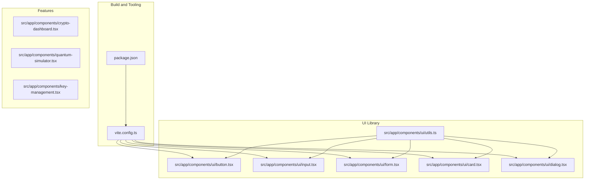
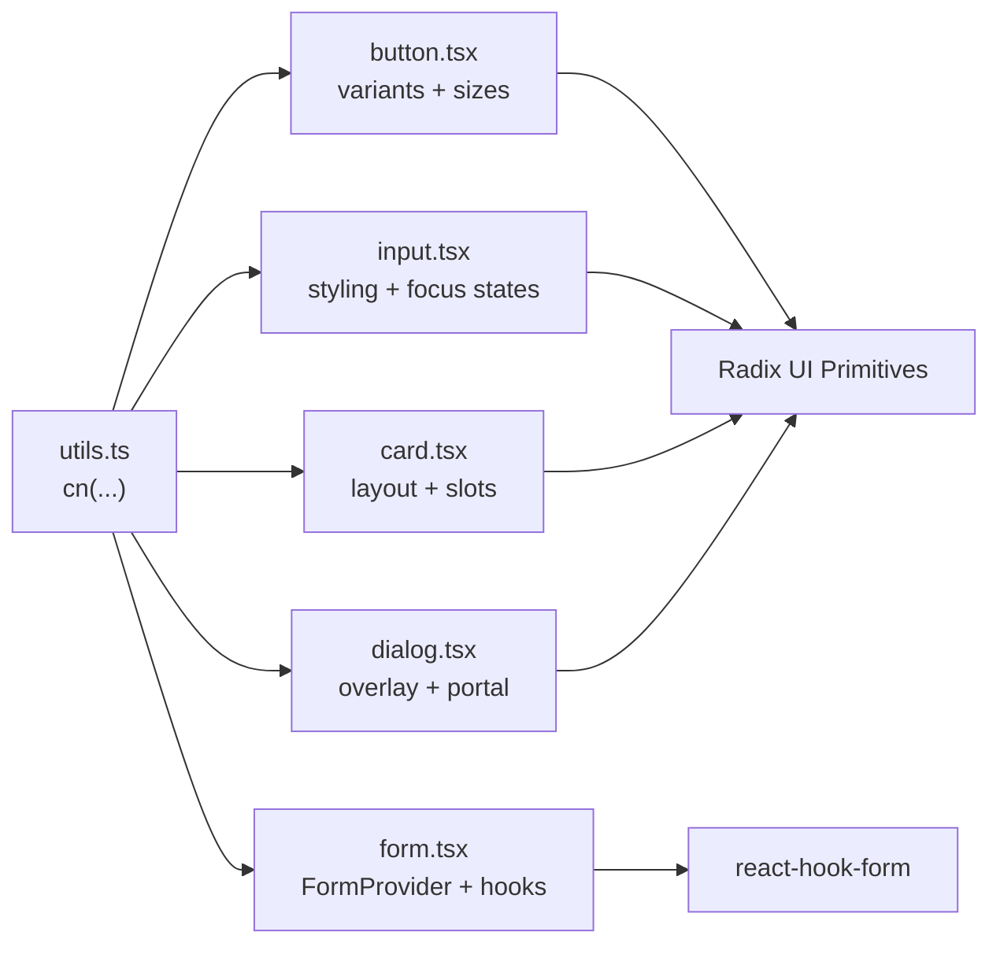
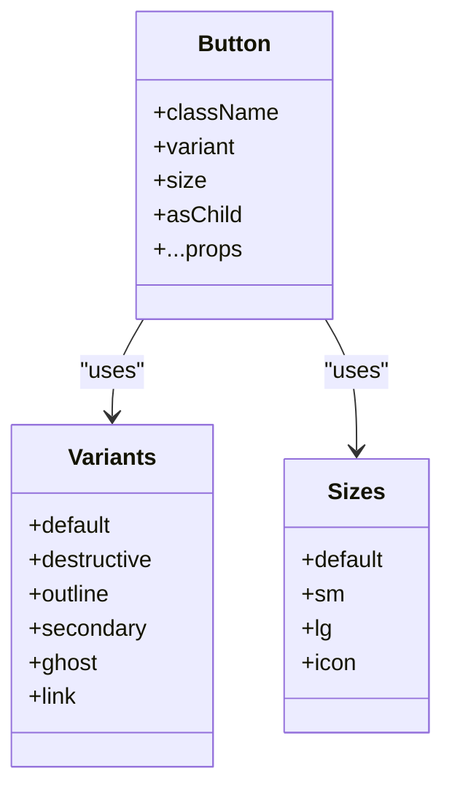
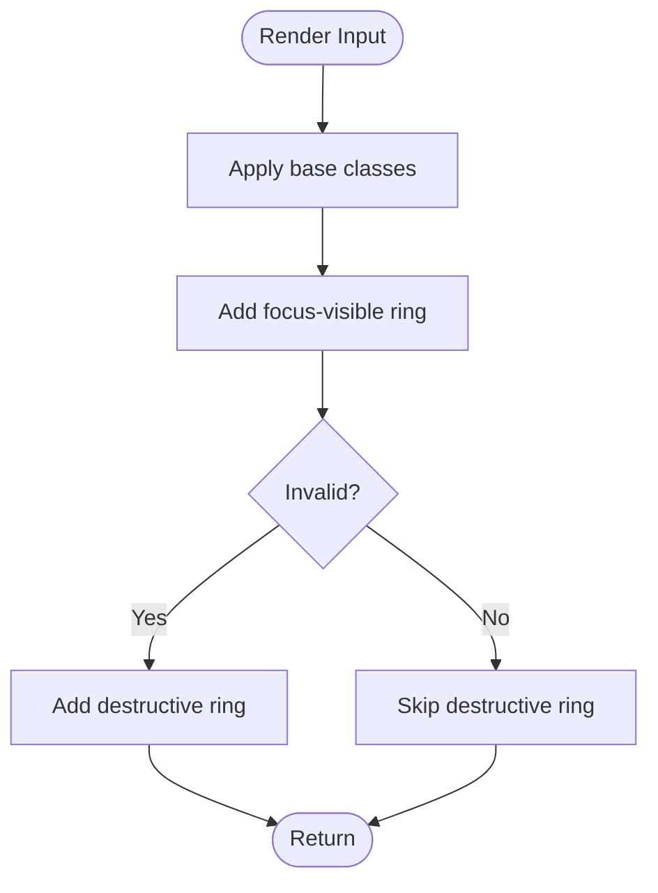
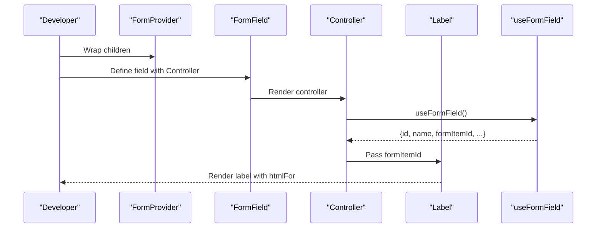
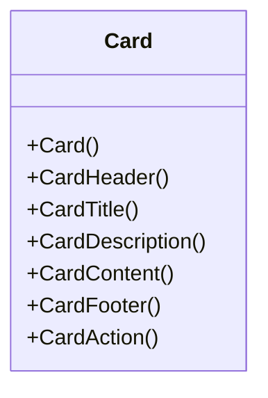
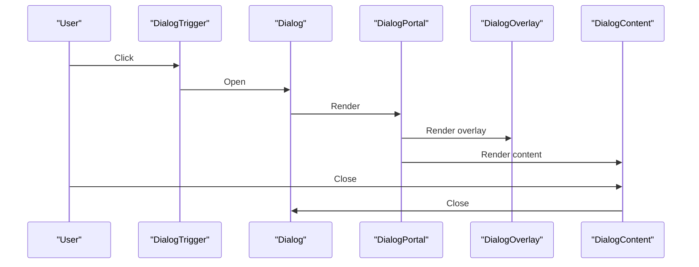
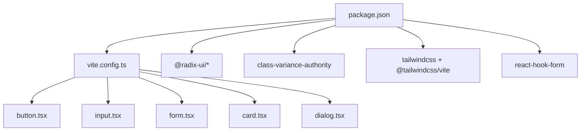

# Code Quality and Standards

<cite>
**Referenced Files in This Document**
- [README.md](file://README.md)
- [package.json](file://package.json)
- [vite.config.ts](file://vite.config.ts)
- [Guidelines.md](file://guidelines/Guidelines.md)
- [utils.ts](file://src/app/components/ui/utils.ts)
- [button.tsx](file://src/app/components/ui/button.tsx)
- [input.tsx](file://src/app/components/ui/input.tsx)
- [form.tsx](file://src/app/components/ui/form.tsx)
- [card.tsx](file://src/app/components/ui/card.tsx)
- [dialog.tsx](file://src/app/components/ui/dialog.tsx)
</cite>

## Table of Contents
1. [Introduction](#introduction)
2. [Project Structure](#project-structure)
3. [Core Components](#core-components)
4. [Architecture Overview](#architecture-overview)
5. [Detailed Component Analysis](#detailed-component-analysis)
6. [Dependency Analysis](#dependency-analysis)
7. [Performance Considerations](#performance-considerations)
8. [Troubleshooting Guide](#troubleshooting-guide)
9. [Conclusion](#conclusion)
10. [Appendices](#appendices)

## Introduction
This document defines the code quality and standards for the Post-Quantum Cryptography Educational Platform. It establishes conventions for TypeScript/TSX components, naming patterns, file organization, linting and formatting, component architecture, prop conventions, state management patterns, testing standards, accessibility, performance, security, code review, and documentation. The guidance is grounded in the repository’s current structure and patterns, including the UI component library and build configuration.

## Project Structure
The project follows a feature-based and component-centric layout:
- src/app/components/ui: Shared design system components built with Radix UI primitives, Tailwind CSS, and class variance authority (CVA).
- src/app/components: Feature-specific educational components (e.g., cryptography dashboards, simulators).
- Root configuration: Vite, Tailwind CSS, and React plugin configuration.
- Guidelines: Internal guidelines document for platform-specific rules.

**Diagram sources**
- [vite.config.ts](file://vite.config.ts#L1-L23)
- [package.json](file://package.json#L1-L93)
- [utils.ts](file://src/app/components/ui/utils.ts#L1-L7)
- [button.tsx](file://src/app/components/ui/button.tsx#L1-L58)
- [input.tsx](file://src/app/components/ui/input.tsx#L1-L22)
- [form.tsx](file://src/app/components/ui/form.tsx#L1-L169)
- [card.tsx](file://src/app/components/ui/card.tsx#L1-L93)
- [dialog.tsx](file://src/app/components/ui/dialog.tsx#L1-L136)

**Section sources**
- [README.md](file://README.md#L1-L11)
- [package.json](file://package.json#L1-L93)
- [vite.config.ts](file://vite.config.ts#L1-L23)
- [utils.ts](file://src/app/components/ui/utils.ts#L1-L7)
- [button.tsx](file://src/app/components/ui/button.tsx#L1-L58)
- [input.tsx](file://src/app/components/ui/input.tsx#L1-L22)
- [form.tsx](file://src/app/components/ui/form.tsx#L1-L169)
- [card.tsx](file://src/app/components/ui/card.tsx#L1-L93)
- [dialog.tsx](file://src/app/components/ui/dialog.tsx#L1-L136)

## Core Components
- Shared utilities: Centralized class merging and conditional class composition via a single utility function.
- Primitive components: Buttons, inputs, cards, dialogs, and forms built with Radix UI, CVA, and Tailwind.
- Form system: A robust form provider and field hooks pattern using react-hook-form and Radix UI labels.

Key patterns:
- Consistent data-slot attributes for test selectors and accessibility.
- Variants and sizes via CVA for predictable styling.
- Controlled components with explicit props and minimal internal state.

**Section sources**
- [utils.ts](file://src/app/components/ui/utils.ts#L1-L7)
- [button.tsx](file://src/app/components/ui/button.tsx#L1-L58)
- [input.tsx](file://src/app/components/ui/input.tsx#L1-L22)
- [form.tsx](file://src/app/components/ui/form.tsx#L1-L169)
- [card.tsx](file://src/app/components/ui/card.tsx#L1-L93)
- [dialog.tsx](file://src/app/components/ui/dialog.tsx#L1-L136)

## Architecture Overview
The UI architecture emphasizes:
- Composition over inheritance: Components accept className and pass-through props.
- Variant-driven design: CVA provides variant and size options.
- Accessibility-first: Radix UI primitives, aria-* attributes, and semantic HTML.
- Theming and styling: Tailwind utilities combined with CVA and a shared cn utility.

**Diagram sources**
- [utils.ts](file://src/app/components/ui/utils.ts#L1-L7)
- [button.tsx](file://src/app/components/ui/button.tsx#L1-L58)
- [input.tsx](file://src/app/components/ui/input.tsx#L1-L22)
- [form.tsx](file://src/app/components/ui/form.tsx#L1-L169)
- [card.tsx](file://src/app/components/ui/card.tsx#L1-L93)
- [dialog.tsx](file://src/app/components/ui/dialog.tsx#L1-L136)

## Detailed Component Analysis

### Button Component
- Purpose: Base button primitive with variant and size variants.
- Props: className, variant, size, asChild, and native button props.
- Patterns:
  - Uses CVA for variants and sizes.
  - Supports rendering as a slot for composition.
  - Adds data-slot for testability and accessibility.

**Diagram sources**
- [button.tsx](file://src/app/components/ui/button.tsx#L7-L35)

**Section sources**
- [button.tsx](file://src/app/components/ui/button.tsx#L1-L58)

### Input Component
- Purpose: Styled input with focus-visible ring, invalid state support, and placeholder styling.
- Props: className, type, and native input props.
- Patterns:
  - Uses cn for class composition.
  - Applies focus-visible and aria-invalid states.
  - Includes selection and file input styling.

**Diagram sources**
- [input.tsx](file://src/app/components/ui/input.tsx#L10-L15)

**Section sources**
- [input.tsx](file://src/app/components/ui/input.tsx#L1-L22)

### Form System
- Purpose: Provider and hooks for building accessible, validated forms.
- Key exports: Form, FormItem, FormLabel, FormControl, FormDescription, FormMessage, FormField, useFormField.
- Patterns:
  - Uses React Context to propagate field metadata.
  - Integrates with react-hook-form for validation and state.
  - Provides aria-* attributes and ids for assistive technologies.

**Diagram sources**
- [form.tsx](file://src/app/components/ui/form.tsx#L19-L66)

**Section sources**
- [form.tsx](file://src/app/components/ui/form.tsx#L1-L169)

### Card Component
- Purpose: Layout primitives for content grouping with header, title, description, content, footer, and action.
- Patterns:
  - Uses data-slot attributes for test selectors.
  - Composes Tailwind classes via cn.
  - Supports responsive grid layout in header.

**Diagram sources**
- [card.tsx](file://src/app/components/ui/card.tsx#L5-L92)

**Section sources**
- [card.tsx](file://src/app/components/ui/card.tsx#L1-L93)

### Dialog Component
- Purpose: Modal overlay with portal, overlay, content, header, footer, title, and description.
- Patterns:
  - Uses Radix UI primitives for accessibility.
  - Portal renders content outside the DOM tree.
  - Adds close button with screen reader text.

**Diagram sources**
- [dialog.tsx](file://src/app/components/ui/dialog.tsx#L9-L73)

**Section sources**
- [dialog.tsx](file://src/app/components/ui/dialog.tsx#L1-L136)

## Dependency Analysis
- Build and tooling:
  - Vite config enables React and Tailwind plugins, path aliases, and asset inclusion.
  - Package scripts define dev and build commands.
- UI dependencies:
  - Radix UI primitives for accessible base components.
  - CVA for variant sizing.
  - Tailwind CSS and clsx/tailwind-merge for class composition.
  - react-hook-form for form state and validation.

**Diagram sources**
- [package.json](file://package.json#L10-L68)
- [vite.config.ts](file://vite.config.ts#L6-L10)
- [button.tsx](file://src/app/components/ui/button.tsx#L1-L58)
- [input.tsx](file://src/app/components/ui/input.tsx#L1-L22)
- [form.tsx](file://src/app/components/ui/form.tsx#L1-L169)
- [card.tsx](file://src/app/components/ui/card.tsx#L1-L93)
- [dialog.tsx](file://src/app/components/ui/dialog.tsx#L1-L136)

**Section sources**
- [package.json](file://package.json#L1-L93)
- [vite.config.ts](file://vite.config.ts#L1-L23)

## Performance Considerations
- Prefer variant-driven components to reduce branching and improve render predictability.
- Use data-slot attributes to minimize selector overhead in tests and enable targeted updates.
- Keep className composition centralized via the shared utility to avoid duplication and reduce payload.
- Defer heavy computations off the render path; leverage controlled components to limit unnecessary re-renders.
- Use lazy loading for large educational assets and defer non-critical features until needed.

## Troubleshooting Guide
Common issues and resolutions:
- Missing data-slot attributes: Ensure components expose data-slot for testability and accessibility.
- Incorrect variant usage: Verify variant and size combinations align with CVA definitions.
- Form accessibility errors: Confirm useFormField is used inside FormField and labels reference formItemId.
- Dialog portal rendering: Ensure DialogPortal wraps content and overlay is present.

**Section sources**
- [button.tsx](file://src/app/components/ui/button.tsx#L49-L56)
- [input.tsx](file://src/app/components/ui/input.tsx#L9-L18)
- [form.tsx](file://src/app/components/ui/form.tsx#L90-L124)
- [dialog.tsx](file://src/app/components/ui/dialog.tsx#L54-L72)

## Conclusion
The platform’s UI system is built on accessible primitives, variant-driven design, and consistent class composition. By adhering to the established patterns—shared utilities, data-slot attributes, CVA variants, and react-hook-form integration—you can maintain a cohesive, accessible, and performant educational interface. Extend these patterns to new components and features to preserve consistency across the platform.

## Appendices

### Coding Conventions and Naming Patterns
- File naming:
  - UI components: PascalCase.tsx (e.g., Button, Input, Dialog).
  - Utilities: kebab-case.ts (e.g., utils.ts).
  - Feature components: kebab-case.tsx (e.g., crypto-dashboard.tsx).
- Component naming:
  - Use descriptive names aligned with function (e.g., DialogContent, FormLabel).
  - Prefix educational feature files with domain keywords (e.g., quantum-, key-).
- Prop naming:
  - Use camelCase for props.
  - Prefer explicit boolean props (e.g., asChild, disabled).
  - Avoid abbreviations unless widely understood (e.g., size variants like sm, lg).

### Linting and Formatting
- Formatting:
  - Use Prettier with default settings for consistent formatting.
- Linting:
  - Use ESLint with React and TypeScript recommended rules.
  - Enforce no magic numbers, consistent prop naming, and explicit returns.
- Pre-commit hook:
  - Run Prettier and ESLint before committing to enforce standards.

### Component Architecture Guidelines
- Composition:
  - Accept className and pass-through props to remain flexible.
  - Support asChild for composition with links or buttons.
- Variants:
  - Define variants and sizes via CVA; keep defaults consistent.
- Accessibility:
  - Use Radix UI primitives and aria-* attributes.
  - Provide labels and descriptions; manage aria-invalid states.
- Styling:
  - Centralize class composition via the shared utility.
  - Prefer Tailwind utilities with CVA overrides.

### Prop Naming Conventions
- Boolean props: isActive, isVisible, disabled.
- Event handlers: onToggle, onSubmit, onChange.
- References: ref, forwardedRef.
- Data props: value, defaultValue, options.

### State Management Patterns
- Local component state: Prefer useState for transient UI state.
- Form state: Use react-hook-form with FormProvider and useFormField.
- Global state: Use lightweight contexts or external stores only when necessary.

### Testing Standards and Unit Testing Requirements
- Unit tests:
  - Test component rendering with props and variants.
  - Verify accessibility attributes and data-slot presence.
  - Validate event handler calls and form interactions.
- Integration tests:
  - Test form submission and validation flows.
  - Verify dialog open/close behavior and portal rendering.
- Snapshot tests:
  - Limit snapshot usage to UI primitives; prefer component property assertions.

### Accessibility Compliance
- ARIA:
  - Use aria-invalid, aria-describedby, and aria-labelledby appropriately.
- Semantic HTML:
  - Prefer native elements (button, input) with proper roles.
- Keyboard navigation:
  - Ensure focus management and tab order are logical.
- Screen readers:
  - Provide meaningful labels and screen-reader-only text for icons.

### Performance Optimization
- Bundle size:
  - Tree-shake unused variants and icons.
  - Split large educational assets and load lazily.
- Rendering:
  - Memoize expensive computations; avoid unnecessary re-renders.
  - Use controlled components to reduce state churn.
- Assets:
  - Optimize SVGs and images; leverage modern formats.

### Security Best Practices
- Input sanitization:
  - Sanitize user inputs; avoid innerHTML misuse.
- CSP:
  - Configure Content Security Policy headers.
- Dependencies:
  - Audit dependencies regularly; keep packages updated.

### Code Review Process and Quality Gates
- Pull requests:
  - Include a summary of changes and rationale.
  - Ensure tests pass and accessibility checks are performed.
- Reviews:
  - Focus on adherence to component patterns and accessibility.
  - Verify performance impact and bundle size changes.
- Quality gates:
  - Enforce linting and formatting checks in CI.
  - Require approvals before merging to main.

### Documentation Standards for Educational Content and Examples
- Component docs:
  - Describe purpose, props, variants, and usage examples.
  - Include accessibility notes and keyboard navigation details.
- Educational examples:
  - Provide step-by-step scenarios for cryptography concepts.
  - Link to external resources and references.

### Templates and Examples
- Component template:
  - Use the shared utility for class composition.
  - Expose className and pass-through props.
  - Add data-slot attributes for testability.
- Example references:
  - Button component template: [button.tsx](file://src/app/components/ui/button.tsx#L37-L56)
  - Input component template: [input.tsx](file://src/app/components/ui/input.tsx#L5-L18)
  - Form system template: [form.tsx](file://src/app/components/ui/form.tsx#L32-L43)
  - Card component template: [card.tsx](file://src/app/components/ui/card.tsx#L5-L16)
  - Dialog component template: [dialog.tsx](file://src/app/components/ui/dialog.tsx#L49-L73)