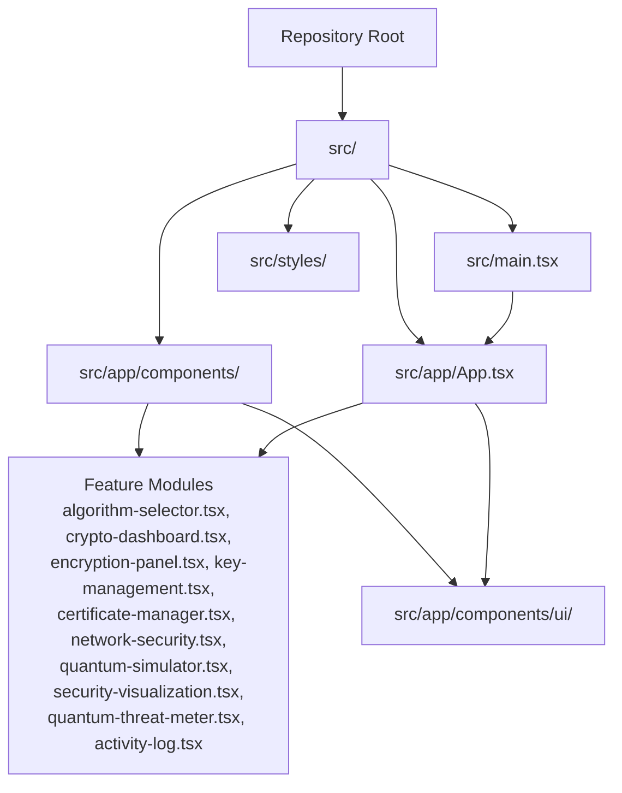
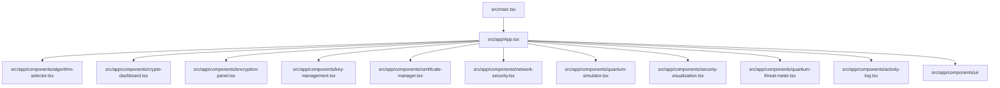
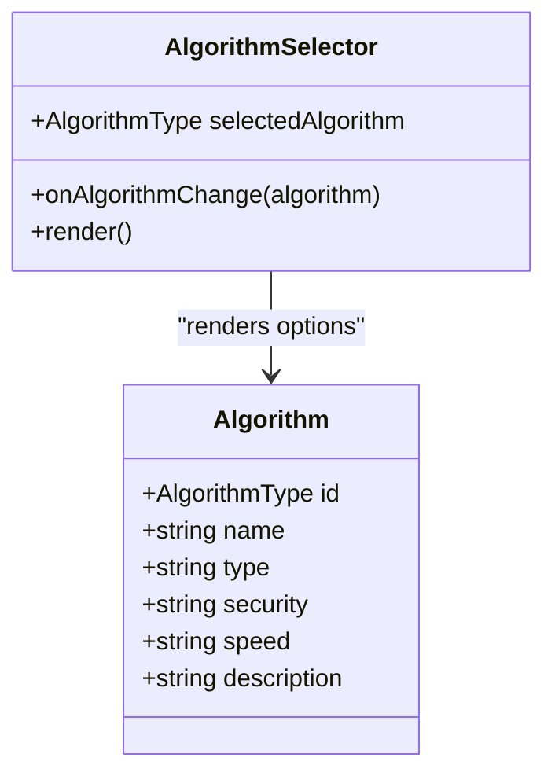
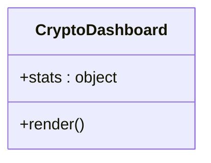
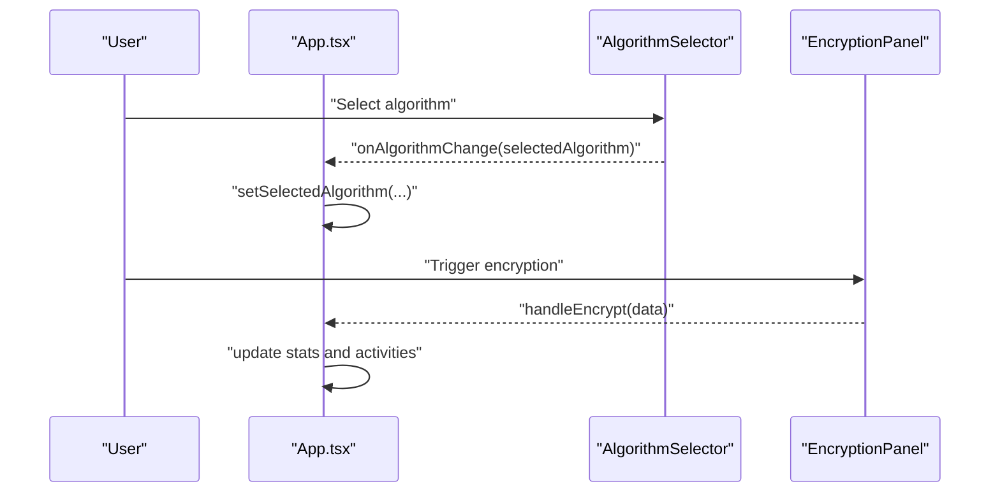
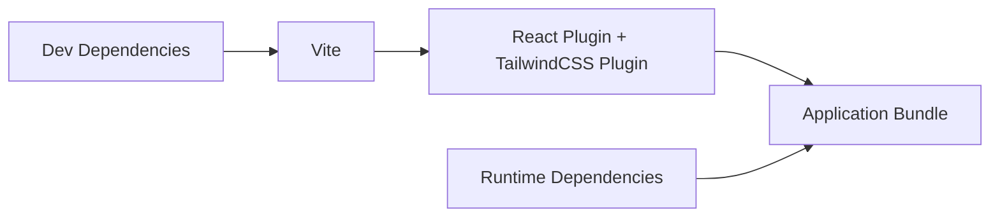

# Contribution Workflow

<cite>
**Referenced Files in This Document**
- [README.md](file://README.md)
- [package.json](file://package.json)
- [.gitignore](file://.gitignore)
- [vite.config.ts](file://vite.config.ts)
- [src/main.tsx](file://src/main.tsx)
- [src/app/App.tsx](file://src/app/App.tsx)
- [src/app/components/algorithm-selector.tsx](file://src/app/components/algorithm-selector.tsx)
- [src/app/components/crypto-dashboard.tsx](file://src/app/components/crypto-dashboard.tsx)
- [ATTRIBUTIONS.md](file://ATTRIBUTIONS.md)
</cite>

## Table of Contents
1. [Introduction](#introduction)
2. [Project Structure](#project-structure)
3. [Core Components](#core-components)
4. [Architecture Overview](#architecture-overview)
5. [Detailed Component Analysis](#detailed-component-analysis)
6. [Dependency Analysis](#dependency-analysis)
7. [Performance Considerations](#performance-considerations)
8. [Troubleshooting Guide](#troubleshooting-guide)
9. [Conclusion](#conclusion)
10. [Appendices](#appendices)

## Introduction
This document defines the Contribution Workflow for the Post-Quantum Cryptography Educational Platform. It consolidates practical guidance for contributors to align with the repository’s current structure and development practices. Where the repository does not specify formal policies (such as Git branching strategy, commit conventions, PR procedures, CI checks, or release processes), this document provides recommended practices tailored to the project’s scope and technology stack.

## Project Structure
The project is a React-based web application built with Vite and Tailwind CSS. It includes a modular component architecture, educational UI components, and a central App shell orchestrating multiple functional areas such as encryption, key management, certificates, network security, simulator, analytics, threat meter, and activity logging.

**Diagram sources**
- [src/main.tsx](file://src/main.tsx#L1-L7)
- [src/app/App.tsx](file://src/app/App.tsx#L1-L362)
- [src/app/components/algorithm-selector.tsx](file://src/app/components/algorithm-selector.tsx#L1-L121)
- [src/app/components/crypto-dashboard.tsx](file://src/app/components/crypto-dashboard.tsx#L1-L70)

**Section sources**
- [README.md](file://README.md#L1-L11)
- [package.json](file://package.json#L1-L93)
- [vite.config.ts](file://vite.config.ts#L1-L23)
- [src/main.tsx](file://src/main.tsx#L1-L7)
- [src/app/App.tsx](file://src/app/App.tsx#L1-L362)

## Core Components
- Application bootstrap initializes the React root and renders the App component.
- App orchestrates UI tabs and composes feature modules for encryption, file encryption, key management, certificates, network security, simulator, analytics, threat meter, and activity log.
- AlgorithmSelector provides a curated list of post-quantum algorithms with metadata for selection.
- CryptoDashboard displays platform metrics such as total encryptions, active keys, data encapsulated, and security level.

Recommended contribution focus areas:
- New educational components: Add new feature modules under src/app/components/ and integrate them into App.tsx tabs.
- Extending existing features: Modify AlgorithmSelector or CryptoDashboard props and rendering logic to reflect new capabilities.
- Backward compatibility: Maintain stable prop contracts and avoid breaking changes to shared UI components.

**Section sources**
- [src/main.tsx](file://src/main.tsx#L1-L7)
- [src/app/App.tsx](file://src/app/App.tsx#L26-L316)
- [src/app/components/algorithm-selector.tsx](file://src/app/components/algorithm-selector.tsx#L68-L121)
- [src/app/components/crypto-dashboard.tsx](file://src/app/components/crypto-dashboard.tsx#L4-L11)

## Architecture Overview
The application follows a component-driven architecture with a central App container managing state and routing between feature tabs. UI primitives are provided by shared components in src/app/components/ui/, while feature-specific modules encapsulate domain logic.

**Diagram sources**
- [src/main.tsx](file://src/main.tsx#L1-L7)
- [src/app/App.tsx](file://src/app/App.tsx#L1-L362)
- [src/app/components/algorithm-selector.tsx](file://src/app/components/algorithm-selector.tsx#L1-L121)
- [src/app/components/crypto-dashboard.tsx](file://src/app/components/crypto-dashboard.tsx#L1-L70)

## Detailed Component Analysis

### Algorithm Selector Component
Purpose:
- Provides a dropdown interface to select among post-quantum algorithms.
- Displays metadata badges for security level, speed, and algorithm type.

Key behaviors:
- Accepts selectedAlgorithm and onAlgorithmChange props.
- Renders a list of supported AlgorithmType values.
- Shows contextual information for the currently selected algorithm.

**Diagram sources**
- [src/app/components/algorithm-selector.tsx](file://src/app/components/algorithm-selector.tsx#L6-L121)

**Section sources**
- [src/app/components/algorithm-selector.tsx](file://src/app/components/algorithm-selector.tsx#L68-L121)

### Crypto Dashboard Component
Purpose:
- Visualizes platform metrics including total encryptions, active keys, data encapsulated, and security level.

Key behaviors:
- Accepts a stats prop containing numeric and textual metrics.
- Uses icons and layout primitives to present KPIs in a responsive grid.

**Diagram sources**
- [src/app/components/crypto-dashboard.tsx](file://src/app/components/crypto-dashboard.tsx#L4-L70)

**Section sources**
- [src/app/components/crypto-dashboard.tsx](file://src/app/components/crypto-dashboard.tsx#L13-L70)

### App Shell and Routing
Purpose:
- Centralizes state and tabbed navigation.
- Integrates feature modules and educational content.

Key behaviors:
- Maintains selectedAlgorithm state and activity logs.
- Updates statistics upon encryption and file encryption actions.
- Provides animated header and footer educational content.

**Diagram sources**
- [src/app/App.tsx](file://src/app/App.tsx#L26-L91)
- [src/app/components/algorithm-selector.tsx](file://src/app/components/algorithm-selector.tsx#L73-L121)

**Section sources**
- [src/app/App.tsx](file://src/app/App.tsx#L26-L91)

## Dependency Analysis
- Build and tooling: Vite with React plugin and Tailwind CSS plugin.
- Runtime dependencies include Material UI components, Radix UI primitives, Three.js ecosystem, Recharts, and related libraries.
- Peer dependencies indicate React and ReactDOM versions.
- Package scripts define dev and build commands.

**Diagram sources**
- [vite.config.ts](file://vite.config.ts#L6-L22)
- [package.json](file://package.json#L6-L93)

**Section sources**
- [package.json](file://package.json#L1-L93)
- [vite.config.ts](file://vite.config.ts#L1-L23)

## Performance Considerations
- Keep component props minimal and stable to reduce unnecessary re-renders.
- Prefer memoization for heavy computations and avoid large state updates in hot paths.
- Lazy-load optional feature modules if bundle size becomes a concern.
- Monitor bundle size and remove unused dependencies periodically.

## Troubleshooting Guide
Common issues and resolutions:
- Development server not starting:
  - Ensure dependencies are installed and the dev script runs successfully.
  - Verify Vite server configuration and port availability.
- Build failures:
  - Check for TypeScript or JSX errors reported by Vite.
  - Confirm Tailwind CSS plugin configuration and asset inclusion.
- Asset loading problems:
  - Review assetsInclude configuration for SVG and CSV files.
- Node modules and cache:
  - node_modules and .cache are ignored; clear caches if needed.
- Logging and diagnostics:
  - Log files are ignored; check console output during development.

**Section sources**
- [README.md](file://README.md#L6-L11)
- [vite.config.ts](file://vite.config.ts#L17-L22)
- [.gitignore](file://.gitignore#L1-L5)

## Conclusion
This Contribution Workflow document provides practical guidance aligned with the repository’s current structure and tooling. Contributors should focus on modular component development, maintain backward-compatible APIs, and follow the recommended practices for educational content and cryptographic accuracy. Where the repository lacks explicit policies, adopt the recommended practices outlined below.

## Appendices

### Recommended Contribution Practices
- Git branching strategy:
  - Use feature branches prefixed with feature/, fix/, or chore/ for clarity.
  - Keep commits focused and incremental.
- Commit messages:
  - Use imperative mood and concise summaries; reference related issues when applicable.
- Pull requests:
  - Provide a clear description of changes, rationale, and screenshots if UI-related.
  - Request reviews from maintainers; ensure all checks pass before merging.
- Testing:
  - Add unit tests for pure logic; use component tests for UI components.
  - Validate educational content accuracy and cryptographic claims.
- Continuous integration:
  - Enforce linting, type checking, and build verification on pull requests.
- Release and deployment:
  - Tag releases and publish artifacts as appropriate for the project’s distribution model.
- Collaboration:
  - Use GitHub Discussions or Issues for proposals and questions.
  - Follow community guidelines for respectful communication.

### Educational Content Creation Guidelines
- Ensure cryptographic accuracy by referencing authoritative sources and NIST standards.
- Provide clear explanations suitable for learners; avoid jargon where possible.
- Include visual aids and interactive elements to enhance understanding.

### Security Review Process
- Review cryptographic claims and implementations for correctness.
- Validate that demonstrations do not imply real-world security guarantees beyond educational scope.
- Document any limitations or disclaimers prominently.

### Attribution Acknowledgment
- Acknowledge third-party components and media used in the project.

**Section sources**
- [ATTRIBUTIONS.md](file://ATTRIBUTIONS.md#L1-L3)