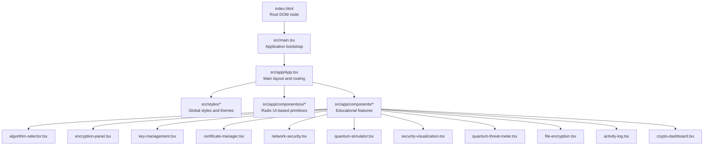
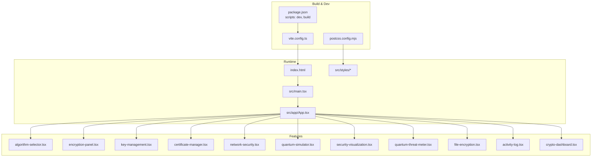
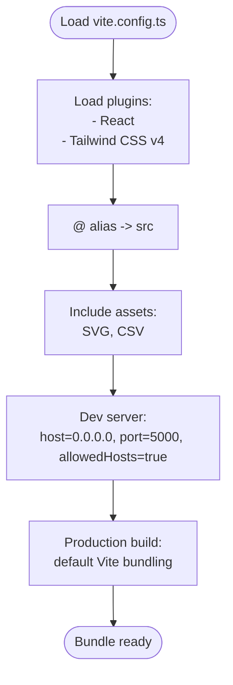
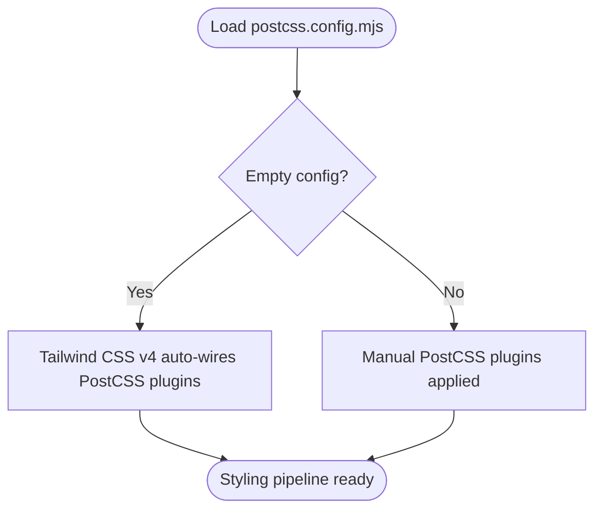
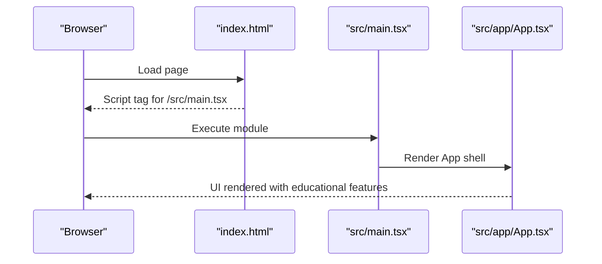
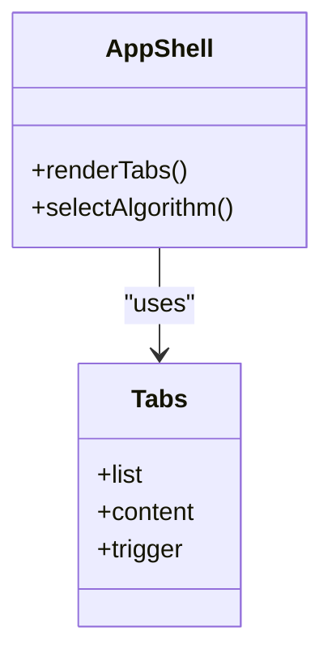
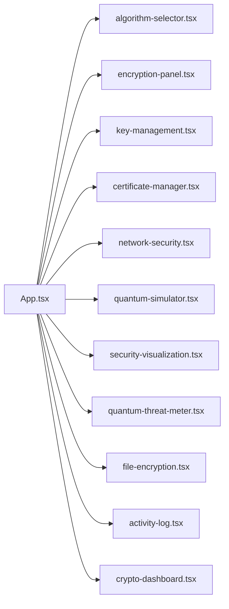
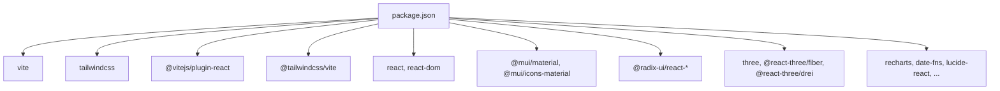

# Development Workflow

<cite>
**Referenced Files in This Document**
- [package.json](file://package.json)
- [vite.config.ts](file://vite.config.ts)
- [postcss.config.mjs](file://postcss.config.mjs)
- [README.md](file://README.md)
- [.gitignore](file://.gitignore)
- [index.html](file://index.html)
- [src/main.tsx](file://src/main.tsx)
- [src/app/App.tsx](file://src/app/App.tsx)
- [src/app/components/ui/tabs.tsx](file://src/app/components/ui/tabs.tsx)
- [src/app/components/algorithm-selector.tsx](file://src/app/components/algorithm-selector.tsx)
- [src/app/components/encryption-panel.tsx](file://src/app/components/encryption-panel.tsx)
- [src/app/components/key-management.tsx](file://src/app/components/key-management.tsx)
- [src/app/components/certificate-manager.tsx](file://src/app/components/certificate-manager.tsx)
- [src/app/components/network-security.tsx](file://src/app/components/network-security.tsx)
- [src/app/components/quantum-simulator.tsx](file://src/app/components/quantum-simulator.tsx)
- [src/app/components/security-visualization.tsx](file://src/app/components/security-visualization.tsx)
- [src/app/components/quantum-threat-meter.tsx](file://src/app/components/quantum-threat-meter.tsx)
- [src/app/components/file-encryption.tsx](file://src/app/components/file-encryption.tsx)
- [src/app/components/activity-log.tsx](file://src/app/components/activity-log.tsx)
- [src/app/components/crypto-dashboard.tsx](file://src/app/components/crypto-dashboard.tsx)
- [src/styles/index.css](file://src/styles/index.css)
- [src/styles/tailwind.css](file://src/styles/tailwind.css)
- [src/styles/theme.css](file://src/styles/theme.css)
</cite>

## Table of Contents
1. [Introduction](#introduction)
2. [Project Structure](#project-structure)
3. [Core Components](#core-components)
4. [Architecture Overview](#architecture-overview)
5. [Detailed Component Analysis](#detailed-component-analysis)
6. [Dependency Analysis](#dependency-analysis)
7. [Performance Considerations](#performance-considerations)
8. [Troubleshooting Guide](#troubleshooting-guide)
9. [Conclusion](#conclusion)
10. [Appendices](#appendices)

## Introduction
This document describes the Development Workflow for the Post-Quantum Cryptography Educational Platform. It covers the Vite build configuration, development server setup, production builds, and optimization settings. It also documents npm scripts, Git workflow and branching strategy, code quality standards, component extension guidelines, testing strategy, deployment process, CI/CD considerations, version control best practices, and troubleshooting guidance.

## Project Structure
The project is a React application bundled with Vite, styled with Tailwind CSS v4 via the dedicated Vite plugin. The application bootstraps at the root DOM node and renders the main App shell, which orchestrates multiple educational components related to post-quantum cryptography.

**Diagram sources**
- [index.html](file://index.html#L10-L13)
- [src/main.tsx](file://src/main.tsx#L1-L7)
- [src/app/App.tsx](file://src/app/App.tsx#L1-L362)
- [src/app/components/ui/tabs.tsx](file://src/app/components/ui/tabs.tsx)
- [src/app/components/algorithm-selector.tsx](file://src/app/components/algorithm-selector.tsx)
- [src/app/components/encryption-panel.tsx](file://src/app/components/encryption-panel.tsx)
- [src/app/components/key-management.tsx](file://src/app/components/key-management.tsx)
- [src/app/components/certificate-manager.tsx](file://src/app/components/certificate-manager.tsx)
- [src/app/components/network-security.tsx](file://src/app/components/network-security.tsx)
- [src/app/components/quantum-simulator.tsx](file://src/app/components/quantum-simulator.tsx)
- [src/app/components/security-visualization.tsx](file://src/app/components/security-visualization.tsx)
- [src/app/components/quantum-threat-meter.tsx](file://src/app/components/quantum-threat-meter.tsx)
- [src/app/components/file-encryption.tsx](file://src/app/components/file-encryption.tsx)
- [src/app/components/activity-log.tsx](file://src/app/components/activity-log.tsx)
- [src/app/components/crypto-dashboard.tsx](file://src/app/components/crypto-dashboard.tsx)

**Section sources**
- [index.html](file://index.html#L1-L15)
- [src/main.tsx](file://src/main.tsx#L1-L7)
- [src/app/App.tsx](file://src/app/App.tsx#L1-L362)

## Core Components
- Build and Dev Tools
  - Vite configuration defines plugins, path aliases, asset inclusion, and development server options.
  - PostCSS configuration is minimal; Tailwind CSS v4 auto-wires required PostCSS plugins via the Vite plugin.
  - npm scripts provide development and production build commands.
- Application Bootstrap
  - The HTML root element mounts the React application, which renders the main App shell.
- UI Primitives
  - UI components are built on Radix UI primitives and MUI, enabling accessible and consistent interactions.
- Educational Feature Modules
  - Components cover algorithm selection, encryption/decryption panels, key and certificate management, network security, quantum simulator, analytics, threat meter, file encryption, activity logging, and dashboard statistics.

**Section sources**
- [vite.config.ts](file://vite.config.ts#L1-L23)
- [postcss.config.mjs](file://postcss.config.mjs#L1-L16)
- [package.json](file://package.json#L6-L9)
- [index.html](file://index.html#L10-L13)
- [src/app/components/ui/tabs.tsx](file://src/app/components/ui/tabs.tsx)
- [src/app/components/algorithm-selector.tsx](file://src/app/components/algorithm-selector.tsx)
- [src/app/components/encryption-panel.tsx](file://src/app/components/encryption-panel.tsx)
- [src/app/components/key-management.tsx](file://src/app/components/key-management.tsx)
- [src/app/components/certificate-manager.tsx](file://src/app/components/certificate-manager.tsx)
- [src/app/components/network-security.tsx](file://src/app/components/network-security.tsx)
- [src/app/components/quantum-simulator.tsx](file://src/app/components/quantum-simulator.tsx)
- [src/app/components/security-visualization.tsx](file://src/app/components/security-visualization.tsx)
- [src/app/components/quantum-threat-meter.tsx](file://src/app/components/quantum-threat-meter.tsx)
- [src/app/components/file-encryption.tsx](file://src/app/components/file-encryption.tsx)
- [src/app/components/activity-log.tsx](file://src/app/components/activity-log.tsx)
- [src/app/components/crypto-dashboard.tsx](file://src/app/components/crypto-dashboard.tsx)

## Architecture Overview
The application follows a modular React architecture with a central App container orchestrating feature-specific components. Vite handles development and bundling, while Tailwind CSS v4 manages styling.

**Diagram sources**
- [vite.config.ts](file://vite.config.ts#L1-L23)
- [postcss.config.mjs](file://postcss.config.mjs#L1-L16)
- [package.json](file://package.json#L6-L9)
- [index.html](file://index.html#L10-L13)
- [src/main.tsx](file://src/main.tsx#L1-L7)
- [src/app/App.tsx](file://src/app/App.tsx#L1-L362)
- [src/app/components/algorithm-selector.tsx](file://src/app/components/algorithm-selector.tsx)
- [src/app/components/encryption-panel.tsx](file://src/app/components/encryption-panel.tsx)
- [src/app/components/key-management.tsx](file://src/app/components/key-management.tsx)
- [src/app/components/certificate-manager.tsx](file://src/app/components/certificate-manager.tsx)
- [src/app/components/network-security.tsx](file://src/app/components/network-security.tsx)
- [src/app/components/quantum-simulator.tsx](file://src/app/components/quantum-simulator.tsx)
- [src/app/components/security-visualization.tsx](file://src/app/components/security-visualization.tsx)
- [src/app/components/quantum-threat-meter.tsx](file://src/app/components/quantum-threat-meter.tsx)
- [src/app/components/file-encryption.tsx](file://src/app/components/file-encryption.tsx)
- [src/app/components/activity-log.tsx](file://src/app/components/activity-log.tsx)
- [src/app/components/crypto-dashboard.tsx](file://src/app/components/crypto-dashboard.tsx)

## Detailed Component Analysis

### Vite Build Configuration
- Plugins
  - React Fast Refresh and JSX transform via the official React plugin.
  - Tailwind CSS v4 integration via the Vite plugin, which auto-configures PostCSS pipeline.
- Path Alias
  - Alias '@' resolves to the src directory for concise imports.
- Assets
  - Explicitly includes SVG and CSV assets for consumption.
- Development Server
  - Host binding to all interfaces, custom port, and allows all hosts for containerized environments.
- Production Build
  - Uses Vite’s default bundling and minification; no custom rollup plugins configured.

**Diagram sources**
- [vite.config.ts](file://vite.config.ts#L6-L22)

**Section sources**
- [vite.config.ts](file://vite.config.ts#L1-L23)

### PostCSS and Tailwind Integration
- Tailwind CSS v4 is integrated via the Vite plugin, which automatically configures required PostCSS plugins.
- The PostCSS config file remains empty, indicating no additional PostCSS plugins are needed.

**Diagram sources**
- [postcss.config.mjs](file://postcss.config.mjs#L1-L16)

**Section sources**
- [postcss.config.mjs](file://postcss.config.mjs#L1-L16)

### Application Bootstrap and Routing
- index.html mounts a script that loads the TypeScript entry module.
- src/main.tsx creates the root and renders the App component.
- src/app/App.tsx orchestrates educational tabs and feature components.

**Diagram sources**
- [index.html](file://index.html#L10-L13)
- [src/main.tsx](file://src/main.tsx#L1-L7)
- [src/app/App.tsx](file://src/app/App.tsx#L1-L362)

**Section sources**
- [index.html](file://index.html#L1-L15)
- [src/main.tsx](file://src/main.tsx#L1-L7)
- [src/app/App.tsx](file://src/app/App.tsx#L1-L362)

### UI Primitive Layer (Tabs)
- The Tabs primitive integrates icons and labels for tabbed navigation across features.
- The App component uses Tabs to organize encryption, keys, certificates, network, simulator, analytics, threat, and activity views.

**Diagram sources**
- [src/app/components/ui/tabs.tsx](file://src/app/components/ui/tabs.tsx)
- [src/app/App.tsx](file://src/app/App.tsx#L208-L316)

**Section sources**
- [src/app/components/ui/tabs.tsx](file://src/app/components/ui/tabs.tsx)
- [src/app/App.tsx](file://src/app/App.tsx#L208-L316)

### Educational Feature Components
- Algorithm Selector: Allows choosing among post-quantum algorithms.
- Encryption Panel: Demonstrates encryption operations with selected algorithm.
- Key Management: Manages cryptographic keys.
- Certificate Manager: Handles digital certificates.
- Network Security: Visualizes network security concepts.
- Quantum Simulator: Interactive simulation of quantum phenomena.
- Security Visualization: Charts and graphs for security metrics.
- Quantum Threat Meter: Displays threat level indicators.
- File Encryption: Encrypts files with selected algorithm.
- Activity Log: Tracks recent operations.
- Crypto Dashboard: Aggregates statistics and KPIs.

**Diagram sources**
- [src/app/App.tsx](file://src/app/App.tsx#L1-L362)
- [src/app/components/algorithm-selector.tsx](file://src/app/components/algorithm-selector.tsx)
- [src/app/components/encryption-panel.tsx](file://src/app/components/encryption-panel.tsx)
- [src/app/components/key-management.tsx](file://src/app/components/key-management.tsx)
- [src/app/components/certificate-manager.tsx](file://src/app/components/certificate-manager.tsx)
- [src/app/components/network-security.tsx](file://src/app/components/network-security.tsx)
- [src/app/components/quantum-simulator.tsx](file://src/app/components/quantum-simulator.tsx)
- [src/app/components/security-visualization.tsx](file://src/app/components/security-visualization.tsx)
- [src/app/components/quantum-threat-meter.tsx](file://src/app/components/quantum-threat-meter.tsx)
- [src/app/components/file-encryption.tsx](file://src/app/components/file-encryption.tsx)
- [src/app/components/activity-log.tsx](file://src/app/components/activity-log.tsx)
- [src/app/components/crypto-dashboard.tsx](file://src/app/components/crypto-dashboard.tsx)

**Section sources**
- [src/app/App.tsx](file://src/app/App.tsx#L1-L362)
- [src/app/components/algorithm-selector.tsx](file://src/app/components/algorithm-selector.tsx)
- [src/app/components/encryption-panel.tsx](file://src/app/components/encryption-panel.tsx)
- [src/app/components/key-management.tsx](file://src/app/components/key-management.tsx)
- [src/app/components/certificate-manager.tsx](file://src/app/components/certificate-manager.tsx)
- [src/app/components/network-security.tsx](file://src/app/components/network-security.tsx)
- [src/app/components/quantum-simulator.tsx](file://src/app/components/quantum-simulator.tsx)
- [src/app/components/security-visualization.tsx](file://src/app/components/security-visualization.tsx)
- [src/app/components/quantum-threat-meter.tsx](file://src/app/components/quantum-threat-meter.tsx)
- [src/app/components/file-encryption.tsx](file://src/app/components/file-encryption.tsx)
- [src/app/components/activity-log.tsx](file://src/app/components/activity-log.tsx)
- [src/app/components/crypto-dashboard.tsx](file://src/app/components/crypto-dashboard.tsx)

## Dependency Analysis
- Runtime Dependencies
  - React and ReactDOM for UI rendering.
  - Material UI and Radix UI primitives for accessible components.
  - Three.js ecosystem for 3D scenes and animations.
  - Recharts, date utilities, and other libraries for visualization and UX.
- Build Dependencies
  - Vite for dev server and bundling.
  - Tailwind CSS v4 and its Vite plugin.
  - React plugin for Vite.
- Overrides
  - pnpm overrides pin Vite to a specific version.

**Diagram sources**
- [package.json](file://package.json#L10-L92)

**Section sources**
- [package.json](file://package.json#L10-L92)

## Performance Considerations
- Vite’s default build is optimized for modern browsers and includes minification and tree-shaking.
- Consider lazy-loading heavy educational components (e.g., quantum simulator) to reduce initial bundle size.
- Asset inclusion for SVG and CSV ensures static assets are bundled efficiently; avoid unnecessary large assets.
- Tailwind CSS v4 auto-wires PostCSS; keep utility usage consistent to minimize CSS bloat.

[No sources needed since this section provides general guidance]

## Troubleshooting Guide
- Development Server Not Starting
  - Verify the dev script and port configuration in the Vite config.
  - Ensure the host binding and allowed hosts settings match your environment.
- Missing Icons or Styles
  - Confirm Tailwind plugin is loaded and global styles are imported in the entry.
- Module Resolution Errors
  - Use the '@' alias consistently for imports under src.
- Build Failures
  - Check overrides and peer dependencies; ensure compatible versions across React and MUI.
- Environment Logs
  - Review logs in the terminal and check the .gitignore for excluded cache/logs.

**Section sources**
- [vite.config.ts](file://vite.config.ts#L17-L21)
- [postcss.config.mjs](file://postcss.config.mjs#L1-L16)
- [src/styles/index.css](file://src/styles/index.css)
- [package.json](file://package.json#L80-L87)

## Conclusion
This Development Workflow document outlines how to develop, build, test, and deploy the Post-Quantum Cryptography Educational Platform using Vite, Tailwind CSS v4, and React. By following the build configuration, component architecture, and operational guidelines, contributors can maintain a consistent and efficient development process.

[No sources needed since this section summarizes without analyzing specific files]

## Appendices

### A. NPM Scripts and Their Purposes
- dev: Starts the Vite development server with hot reload.
- build: Produces a production-ready bundle using Vite.

**Section sources**
- [package.json](file://package.json#L6-L9)

### B. Git Workflow and Branching Strategy
- Use feature branches for new components or features.
- Keep commits focused and descriptive.
- Merge via pull requests after review.

[No sources needed since this section provides general guidance]

### C. Code Quality Standards, Linting, and Formatting
- Maintain consistent component structure and naming.
- Prefer composition over duplication; reuse UI primitives.
- Keep files small and helper functions isolated.

[No sources needed since this section provides general guidance]

### D. Adding New Components and Extending Features
- Place new components under src/app/components.
- Use the '@' alias for imports.
- Integrate into the App’s tabbed interface as appropriate.

**Section sources**
- [vite.config.ts](file://vite.config.ts#L12-L14)
- [src/app/App.tsx](file://src/app/App.tsx#L208-L316)

### E. Testing Strategy for Educational Components
- Unit-test pure logic (e.g., algorithm selector state updates).
- Snapshot or visual regression tests for UI components.
- End-to-end tests for critical user flows (e.g., encrypt, decrypt, key generation).

[No sources needed since this section provides general guidance]

### F. Deployment and CI/CD Considerations
- Build artifacts are emitted to the dist directory by default.
- Configure CI to run the build script and publish artifacts.
- Use environment variables for feature flags if needed.

**Section sources**
- [package.json](file://package.json#L7-L8)
- [.gitignore](file://.gitignore#L1-L5)

### G. Version Control Best Practices and Commit Messages
- Use imperative mood in commit messages.
- Keep messages concise but descriptive.
- Reference issues or feature branches in commit messages.

[No sources needed since this section provides general guidance]

### H. Pull Request Procedures
- Open PRs early for visibility.
- Include screenshots or demos for UI changes.
- Ensure builds pass and reviews are approved.

[No sources needed since this section provides general guidance]