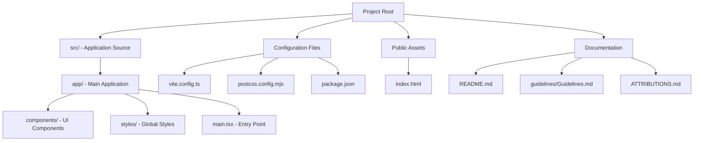

# Getting Started

<cite>
**Referenced Files in This Document**
- [README.md](file://README.md)
- [package.json](file://package.json)
- [vite.config.ts](file://vite.config.ts)
- [index.html](file://index.html)
- [src/main.tsx](file://src/main.tsx)
- [src/app/App.tsx](file://src/app/App.tsx)
- [src/styles/index.css](file://src/styles/index.css)
- [postcss.config.mjs](file://postcss.config.mjs)
- [ATTRIBUTIONS.md](file://ATTRIBUTIONS.md)
- [guidelines/Guidelines.md](file://guidelines/Guidelines.md)
</cite>

## Table of Contents
1. [Introduction](#introduction)
2. [Prerequisites](#prerequisites)
3. [Installation](#installation)
4. [Development Workflow](#development-workflow)
5. [Project Structure](#project-structure)
6. [Basic Usage](#basic-usage)
7. [Common Setup Issues and Troubleshooting](#common-setup-issues-and-troubleshooting)
8. [Conclusion](#conclusion)

## Introduction
Welcome to the Post-Quantum Cryptography Educational Platform. This project is an interactive educational application built with modern web technologies to demonstrate post-quantum cryptographic techniques. The platform provides hands-on experience with quantum-resistant algorithms through a React-based UI, real-time analytics, and interactive components.

The application showcases key post-quantum cryptography concepts including:
- Lattice-based encryption (CRYSTALS-Kyber)
- Digital signature schemes (CRYSTALS-Dilithium)
- Hash-based signatures (SPHINCS+)
- Real-time threat analysis and simulation
- Interactive security visualizations

## Prerequisites
Before installing and running the Post-Quantum Cryptography Educational Platform, ensure your system meets the following requirements:

### Node.js Version Requirements
- **Minimum Node.js version**: 18.x
- **Recommended**: Node.js 18.17.0 or later
- **Package manager**: npm 9.x or later (comes with Node.js)

### System Dependencies
- **Operating Systems**: Windows 10+, macOS 10.14+, Linux Ubuntu 18.04+
- **Memory**: Minimum 4GB RAM recommended
- **Disk Space**: Approximately 500MB free space
- **Graphics**: Modern graphics drivers for WebGL support (required for 3D visualizations)

### Browser Compatibility
The application is optimized for modern browsers with full support for:
- **Chrome**: Latest 2 versions
- **Firefox**: Latest 2 versions
- **Safari**: Latest 2 versions
- **Edge**: Latest 2 versions

**Important**: Internet Explorer is not supported. Some advanced features require:
- JavaScript ES2020+ support
- WebAssembly support for cryptographic operations
- WebGL support for 3D visualizations
- Modern CSS features (Grid, Flexbox, Custom Properties)

## Installation
Follow these step-by-step instructions to set up the development environment:

### Step 1: Clone and Navigate
```bash
# Navigate to your working directory
cd path/to/your/project
```

### Step 2: Install Dependencies
```bash
# Install all project dependencies
npm install
```

**Note**: The project uses npm as the package manager. If you encounter permission issues, you may need to use `sudo` on Unix systems or run as Administrator on Windows.

### Step 3: Environment Setup
The project includes automatic environment configuration through:
- Vite development server with hot module replacement
- Tailwind CSS for styling with automatic configuration
- React TypeScript setup with JSX support

### Step 4: Initial Configuration
The application requires no additional configuration for local development. All settings are pre-configured in:
- [vite.config.ts](file://vite.config.ts) - Development server and build configuration
- [postcss.config.mjs](file://postcss.config.mjs) - CSS processing pipeline
- [src/styles/index.css](file://src/styles/index.css) - Global styling imports

**Section sources**
- [README.md](file://README.md#L6-L10)
- [package.json](file://package.json#L1-L93)
- [vite.config.ts](file://vite.config.ts#L1-L23)

## Development Workflow
The development workflow leverages Vite for fast development and hot reloading capabilities:

### Starting the Development Server
```bash
# Start the development server
npm run dev
```

The development server provides:
- **Hot Module Replacement (HMR)**: Automatic updates without full page reloads
- **Live Reloading**: Instant reflection of code changes
- **Fast Build Times**: Optimized compilation for rapid iteration
- **Port 5000**: Accessible at http://localhost:5000

### Development Features
- **React Fast Refresh**: Seamless component updates during development
- **TypeScript Support**: Full type checking and IntelliSense
- **CSS Modules**: Scoped styling with Tailwind CSS integration
- **Asset Handling**: Automatic SVG and CSV file processing
- **Alias Resolution**: `@` alias pointing to the `src` directory

### Build Process
```bash
# Production build
npm run build
```

The build process:
- Optimizes and minifies all assets
- Generates static files for deployment
- Creates source maps for debugging
- Validates TypeScript compilation

**Section sources**
- [vite.config.ts](file://vite.config.ts#L17-L22)
- [package.json](file://package.json#L6-L9)

## Project Structure
Understanding the project structure helps contributors navigate and modify the codebase effectively:



**Diagram sources**
- [src/app/App.tsx](file://src/app/App.tsx#L1-L362)
- [src/main.tsx](file://src/main.tsx#L1-L7)
- [vite.config.ts](file://vite.config.ts#L1-L23)

### Key Directories and Files

#### `src/app/` - Main Application
- **App.tsx**: Root application component containing all UI logic
- **components/**: Reusable UI components organized by feature
  - `crypto-dashboard.tsx`: Main statistics and metrics display
  - `encryption-panel.tsx`: Text encryption interface
  - `file-encryption.tsx`: File encryption functionality
  - `key-management.tsx`: Key generation and management
  - `quantum-simulator.tsx`: Interactive quantum simulation
  - `security-visualization.tsx`: Security metrics visualization
  - `ui/`: Shared component library (Radix UI primitives)

#### `src/styles/` - Styling System
- **index.css**: Global stylesheet imports
- **tailwind.css**: Tailwind CSS framework integration
- **theme.css**: Custom theme variables and overrides

#### `public/` - Static Assets
- **index.html**: HTML template with root container
- **Assets**: Images, icons, and other static resources

#### Configuration Files
- **vite.config.ts**: Development server and build configuration
- **postcss.config.mjs**: CSS processing pipeline
- **package.json**: Dependencies and scripts

**Section sources**
- [src/app/App.tsx](file://src/app/App.tsx#L1-L362)
- [src/main.tsx](file://src/main.tsx#L1-L7)
- [src/styles/index.css](file://src/styles/index.css#L1-L4)

## Basic Usage
Once the development server is running, you can interact with the application through the following interface:

### Accessing the Application
1. Open your browser and navigate to `http://localhost:5000`
2. The application loads with the main dashboard displaying:
   - Real-time statistics (encryption count, active keys, data processed)
   - Algorithm selector for choosing post-quantum cryptographic methods
   - Interactive tabs for different functional areas

### Navigation and Features
The application provides eight main functional areas accessible via the tabbed interface:

#### 1. **Encrypt Tab** (`/encrypt`)
- Text-based encryption using selected post-quantum algorithms
- Real-time feedback on encryption operations
- Algorithm selection interface

#### 2. **Files Tab** (`/files`)
- File encryption functionality
- Drag-and-drop file upload interface
- Batch processing capabilities

#### 3. **Keys Tab** (`/keys`)
- Key generation and management
- Key pair creation and storage
- Key validation and verification

#### 4. **Certificates Tab** (`/certificates`)
- Digital certificate management
- Certificate generation and validation
- Trust chain visualization

#### 5. **Network Tab** (`/network`)
- Network security monitoring
- Traffic analysis interface
- Threat detection visualization

#### 6. **Simulator Tab** (`/simulator`)
- Interactive quantum computer simulation
- Algorithm demonstration interface
- Performance benchmarking

#### 7. **Analytics Tab** (`/analytics`)
- Security metrics and analytics
- Data visualization dashboards
- Trend analysis and reporting

#### 8. **Threat Tab** (`/threat`)
- Quantum threat assessment
- Risk evaluation interface
- Mitigation strategy recommendations

### User Interface Elements
The application features:
- **Responsive Design**: Adapts to different screen sizes
- **Dark Theme**: Modern dark interface optimized for technical content
- **Real-time Updates**: Live data refresh and notifications
- **Interactive Visualizations**: 3D graphics and animated elements
- **Accessibility**: Keyboard navigation and screen reader support

**Section sources**
- [src/app/App.tsx](file://src/app/App.tsx#L208-L316)
- [index.html](file://index.html#L10-L14)

## Common Setup Issues and Troubleshooting

### Node.js Version Issues
**Problem**: Installation fails with Node.js version errors
**Solution**:
```bash
# Check Node.js version
node --version
npm --version

# Update Node.js to recommended version
# Download from https://nodejs.org/
```

### Permission Errors (Windows)
**Problem**: Permission denied when installing packages
**Solution**:
```bash
# Run as Administrator
# Or fix npm permissions
npm config set prefix "C:\Program Files\npm"
```

### Port Conflicts
**Problem**: Port 5000 already in use
**Solution**:
```bash
# Change port in vite.config.ts
# Or kill process using port 5000
netstat -ano | findstr :5000
taskkill /PID <process_id> /F
```

### Missing Dependencies
**Problem**: Application crashes with missing module errors
**Solution**:
```bash
# Clear node_modules and reinstall
rm -rf node_modules package-lock.json
npm install
```

### Build Failures
**Problem**: Production build fails with TypeScript errors
**Solution**:
```bash
# Check TypeScript configuration
npx tsc --noEmit

# Fix type errors in source code
```

### Browser Compatibility Issues
**Problem**: Application not working in older browsers
**Solution**:
- Upgrade to supported browser versions
- Enable JavaScript and WebGL in browser settings
- Disable ad blockers that might interfere with WebAssembly

### Hot Reload Not Working
**Problem**: Changes not reflected in browser
**Solution**:
```bash
# Restart development server
npm run dev

# Clear browser cache
# Disable browser extensions temporarily
```

### Memory Issues
**Problem**: High memory usage during development
**Solution**:
- Close unnecessary applications
- Increase virtual memory if needed
- Monitor memory usage with browser developer tools

**Section sources**
- [vite.config.ts](file://vite.config.ts#L17-L22)
- [package.json](file://package.json#L1-L93)

## Conclusion
The Post-Quantum Cryptography Educational Platform provides an excellent foundation for learning and experimenting with quantum-resistant cryptographic techniques. By following this getting started guide, you can quickly set up the development environment, understand the project structure, and begin exploring the educational features.

Key takeaways for successful setup:
- Ensure Node.js 18.x+ is installed
- Use npm for dependency management
- Leverage Vite's hot reload for efficient development
- Explore the tabbed interface to discover all features
- Refer to troubleshooting section for common issues

The platform's modern architecture with React, TypeScript, and contemporary build tools ensures a smooth development experience while providing valuable insights into post-quantum cryptography concepts. Happy coding and safe encrypting!