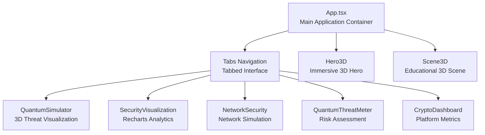
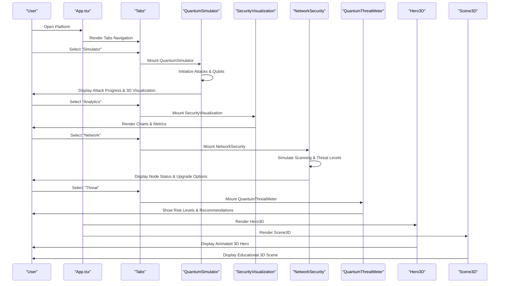
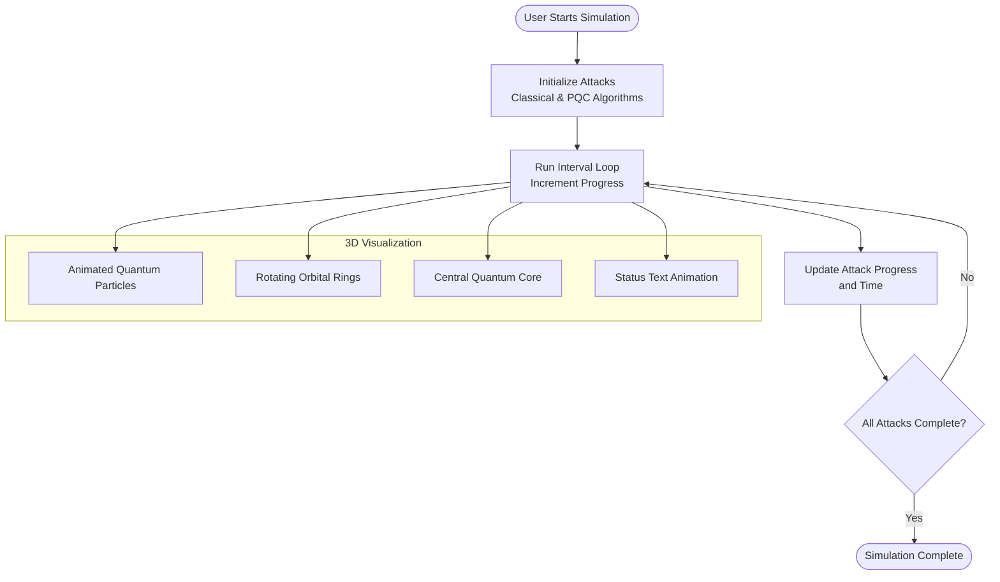
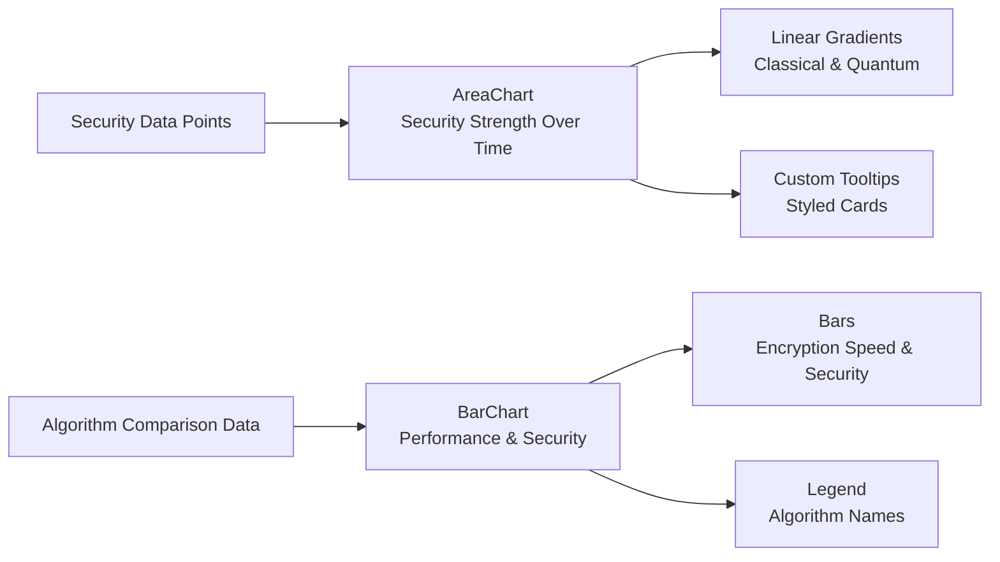
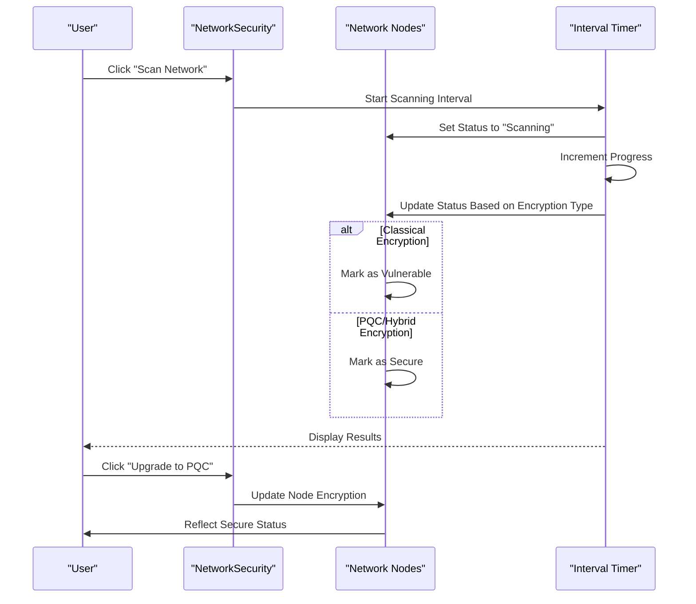
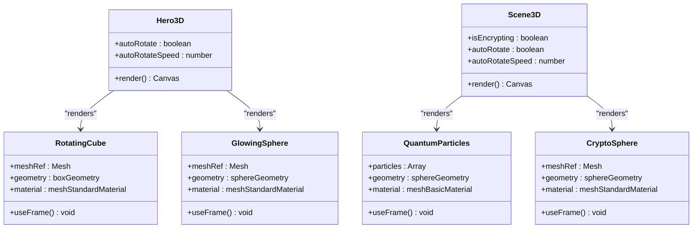
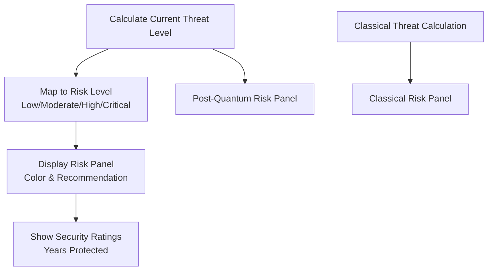
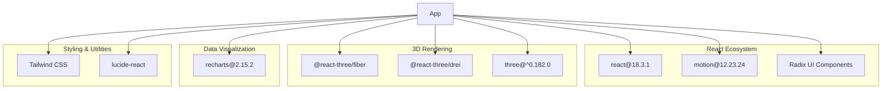

# Advanced Features

<cite>
**Referenced Files in This Document**
- [App.tsx](file://src/app/App.tsx)
- [quantum-simulator.tsx](file://src/app/components/quantum-simulator.tsx)
- [security-visualization.tsx](file://src/app/components/security-visualization.tsx)
- [network-security.tsx](file://src/app/components/network-security.tsx)
- [3d-hero.tsx](file://src/app/components/3d-hero.tsx)
- [3d-scene.tsx](file://src/app/components/3d-scene.tsx)
- [quantum-threat-meter.tsx](file://src/app/components/quantum-threat-meter.tsx)
- [crypto-dashboard.tsx](file://src/app/components/crypto-dashboard.tsx)
- [package.json](file://package.json)
- [vite.config.ts](file://vite.config.ts)
</cite>

## Table of Contents
1. [Introduction](#introduction)
2. [Project Structure](#project-structure)
3. [Core Components](#core-components)
4. [Architecture Overview](#architecture-overview)
5. [Detailed Component Analysis](#detailed-component-analysis)
6. [Dependency Analysis](#dependency-analysis)
7. [Performance Considerations](#performance-considerations)
8. [Troubleshooting Guide](#troubleshooting-guide)
9. [Conclusion](#conclusion)

## Introduction
This document details the advanced features of the Post-Quantum Cryptography Educational Platform, focusing on specialized functionality designed to enhance learning through immersive, interactive, and data-driven experiences. The platform integrates:
- A quantum simulator with 3D visualization of quantum computing threats and attack vectors
- A security visualization system using Recharts for performance comparisons and threat assessments
- Network security simulation capabilities demonstrating quantum-resistant protocols
- Immersive 3D hero and scene components that create engaging educational environments

These features are implemented using modern React patterns, Three.js for 3D rendering, Recharts for data visualization, and Motion for smooth animations, all integrated into a cohesive educational interface.

## Project Structure
The advanced features are organized as modular React components within the application’s component library. The main application orchestrates these components through tabbed navigation, enabling users to explore different aspects of post-quantum cryptography.

**Diagram sources**
- [App.tsx](file://src/app/App.tsx#L208-L316)
- [quantum-simulator.tsx](file://src/app/components/quantum-simulator.tsx#L17-L316)
- [security-visualization.tsx](file://src/app/components/security-visualization.tsx#L24-L107)
- [network-security.tsx](file://src/app/components/network-security.tsx#L19-L303)
- [quantum-threat-meter.tsx](file://src/app/components/quantum-threat-meter.tsx#L40-L149)
- [crypto-dashboard.tsx](file://src/app/components/crypto-dashboard.tsx#L13-L70)
- [3d-hero.tsx](file://src/app/components/3d-hero.tsx#L53-L76)
- [3d-scene.tsx](file://src/app/components/3d-scene.tsx#L125-L151)

**Section sources**
- [App.tsx](file://src/app/App.tsx#L208-L316)

## Core Components
This section highlights the primary advanced features and their roles in the educational experience.

- Quantum Simulator: Provides real-time simulation of quantum attacks on classical and post-quantum algorithms with animated 3D visualization.
- Security Visualization: Uses Recharts to display security strength trends and algorithm performance comparisons.
- Network Security Simulation: Demonstrates quantum threat assessment across network nodes and supports upgrading to quantum-resistant protocols.
- 3D Hero and Scene: Deliver immersive, interactive 3D environments that illustrate cryptographic concepts and data encapsulation.

**Section sources**
- [quantum-simulator.tsx](file://src/app/components/quantum-simulator.tsx#L17-L316)
- [security-visualization.tsx](file://src/app/components/security-visualization.tsx#L24-L107)
- [network-security.tsx](file://src/app/components/network-security.tsx#L19-L303)
- [3d-hero.tsx](file://src/app/components/3d-hero.tsx#L53-L76)
- [3d-scene.tsx](file://src/app/components/3d-scene.tsx#L125-L151)

## Architecture Overview
The advanced features integrate with the main application through a tabbed interface. Each feature is implemented as a self-contained component that manages its own state and renders specialized UI elements. The quantum simulator and security visualization rely on animation libraries for dynamic feedback, while the network security component simulates scanning and threat assessment. The 3D components utilize Three.js for immersive experiences.

**Diagram sources**
- [App.tsx](file://src/app/App.tsx#L208-L316)
- [quantum-simulator.tsx](file://src/app/components/quantum-simulator.tsx#L17-L316)
- [security-visualization.tsx](file://src/app/components/security-visualization.tsx#L24-L107)
- [network-security.tsx](file://src/app/components/network-security.tsx#L19-L303)
- [quantum-threat-meter.tsx](file://src/app/components/quantum-threat-meter.tsx#L40-L149)
- [3d-hero.tsx](file://src/app/components/3d-hero.tsx#L53-L76)
- [3d-scene.tsx](file://src/app/components/3d-scene.tsx#L125-L151)

## Detailed Component Analysis

### Quantum Simulator
The quantum simulator provides an interactive demonstration of quantum attacks on both classical and post-quantum cryptographic algorithms. It includes:
- Real-time progress tracking for each attack vector
- Configurable qubit count affecting attack speed
- Animated 3D visualization of quantum particles and orbital rings
- Color-coded feedback indicating resistance or compromise

**Diagram sources**
- [quantum-simulator.tsx](file://src/app/components/quantum-simulator.tsx#L25-L48)
- [quantum-simulator.tsx](file://src/app/components/quantum-simulator.tsx#L198-L311)

User interaction patterns:
- Adjust qubit count using a slider to influence attack speed
- Start/pause/reset controls manage simulation lifecycle
- Animated progress bars provide immediate feedback on attack status

Educational impact:
- Demonstrates exponential speed differences between classical and post-quantum algorithms
- Visualizes quantum mechanics concepts through orbital motion and particle animation
- Reinforces the urgency of migrating to quantum-resistant cryptography

**Section sources**
- [quantum-simulator.tsx](file://src/app/components/quantum-simulator.tsx#L17-L316)

### Security Visualization System
The security visualization system presents comparative analytics using Recharts:
- Area charts showing security strength trends over time for classical vs post-quantum cryptography
- Bar charts comparing encryption speed and security levels across PQC algorithms
- Responsive design ensuring accessibility across devices

**Diagram sources**
- [security-visualization.tsx](file://src/app/components/security-visualization.tsx#L5-L13)
- [security-visualization.tsx](file://src/app/components/security-visualization.tsx#L36-L75)
- [security-visualization.tsx](file://src/app/components/security-visualization.tsx#L86-L101)

Implementation details:
- Uses Recharts primitives (AreaChart, BarChart, ResponsiveContainer)
- Implements custom gradients and styled tooltips for enhanced readability
- Supports interactive tooltips and responsive sizing

Educational impact:
- Enables side-by-side comparison of algorithm performance characteristics
- Visualizes long-term security projections under quantum threat scenarios
- Provides quantitative insights for algorithm selection decisions

**Section sources**
- [security-visualization.tsx](file://src/app/components/security-visualization.tsx#L24-L107)

### Network Security Simulation
The network security simulation demonstrates quantum threat assessment across distributed systems:
- Dynamic network topology with servers, routers, and endpoints
- Real-time scanning with progress indicators
- Threat level visualization with color-coded risk metrics
- Interactive upgrade mechanism to quantum-resistant protocols

**Diagram sources**
- [network-security.tsx](file://src/app/components/network-security.tsx#L71-L102)
- [network-security.tsx](file://src/app/components/network-security.tsx#L227-L296)

User interaction patterns:
- Start network scan to assess current security posture
- Monitor progress through animated scanning indicators
- Upgrade vulnerable nodes to quantum-resistant protocols
- Observe real-time updates to threat levels and security metrics

Educational impact:
- Demonstrates practical implications of quantum threats across network infrastructure
- Illustrates cost-benefit analysis of migration strategies
- Reinforces importance of layered security approaches

**Section sources**
- [network-security.tsx](file://src/app/components/network-security.tsx#L19-L303)

### 3D Hero and Scene Components
The 3D components create immersive educational experiences:
- Hero3D: Animated rotating cube and glowing sphere with auto-rotation controls
- Scene3D: Particle system with quantum-inspired geometry and material effects

**Diagram sources**
- [3d-hero.tsx](file://src/app/components/3d-hero.tsx#L53-L76)
- [3d-scene.tsx](file://src/app/components/3d-scene.tsx#L125-L151)

Technical implementation details:
- Utilizes @react-three/fiber for declarative Three.js integration
- Employs @react-three/drei for enhanced controls and helpers
- Implements instanced rendering for efficient particle systems
- Uses material effects (wireframe, emissive, transparent) for visual distinction

Educational impact:
- Creates memorable visual metaphors for cryptographic concepts
- Engages kinesthetic learners through interactive 3D manipulation
- Reinforces spatial understanding of quantum phenomena

**Section sources**
- [3d-hero.tsx](file://src/app/components/3d-hero.tsx#L53-L76)
- [3d-scene.tsx](file://src/app/components/3d-scene.tsx#L125-L151)

### Quantum Threat Meter
The threat meter provides risk assessment and recommendations:
- Dual-panel display comparing post-quantum and classical cryptography risks
- Threshold-based color-coded risk levels with actionable recommendations
- Security ratings and future-proofing metrics

**Diagram sources**
- [quantum-threat-meter.tsx](file://src/app/components/quantum-threat-meter.tsx#L45-L49)
- [quantum-threat-meter.tsx](file://src/app/components/quantum-threat-meter.tsx#L55-L98)
- [quantum-threat-meter.tsx](file://src/app/components/quantum-threat-meter.tsx#L100-L146)

Educational impact:
- Provides immediate, actionable insights into security posture
- Bridges abstract quantum threat concepts with concrete risk metrics
- Supports strategic decision-making for cryptographic migration

**Section sources**
- [quantum-threat-meter.tsx](file://src/app/components/quantum-threat-meter.tsx#L40-L149)

### Crypto Dashboard Integration
The dashboard displays platform-wide metrics and integrates with advanced features:
- Total encryptions, active keys, data encapsulated, and security level
- Trend indicators and contextual metadata
- Seamless integration with encryption panels and activity logs

**Section sources**
- [crypto-dashboard.tsx](file://src/app/components/crypto-dashboard.tsx#L13-L70)
- [App.tsx](file://src/app/App.tsx#L205)

## Dependency Analysis
The advanced features rely on several external libraries and frameworks:

**Diagram sources**
- [package.json](file://package.json#L10-L68)

Integration patterns:
- Three.js components are isolated within dedicated files, minimizing cross-feature coupling
- Recharts components are self-contained and receive static data props
- Motion animations are scoped to individual components for maintainability
- UI primitives from Radix and Tailwind ensure consistent styling across features

**Section sources**
- [package.json](file://package.json#L10-L68)

## Performance Considerations
- Three.js rendering: Use instanced meshes for particle systems and limit geometry complexity in educational scenes
- Animation performance: Leverage useFrame hooks efficiently and avoid unnecessary re-renders
- Chart rendering: Recharts components are optimized for responsive containers; keep datasets minimal
- State management: Centralize shared state in the main App component to reduce prop drilling
- Bundle optimization: Tree-shaking is supported by modern bundlers; ensure unused exports are removed

## Troubleshooting Guide
Common issues and resolutions:
- 3D rendering problems: Verify Three.js and fiber versions match; check canvas container dimensions
- Animation stuttering: Reduce particle counts or geometry complexity; optimize useFrame loops
- Chart responsiveness: Ensure parent containers have explicit dimensions; use responsive containers
- State synchronization: Confirm effect cleanup prevents memory leaks in interval timers
- Build configuration: Validate Vite aliases and plugin configurations for proper asset resolution

**Section sources**
- [vite.config.ts](file://vite.config.ts#L6-L22)

## Conclusion
The advanced features of the Post-Quantum Cryptography Educational Platform combine cutting-edge technologies with pedagogical goals to create an immersive, interactive learning environment. Through quantum simulation, data visualization, network security demonstrations, and 3D educational experiences, users gain both conceptual understanding and practical insights into the transition to quantum-resistant cryptography. The modular architecture ensures maintainability while the integrated design maximizes educational impact.