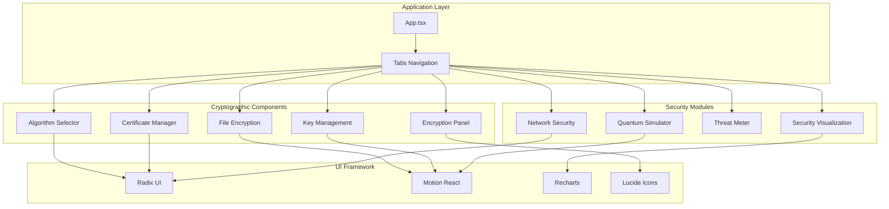
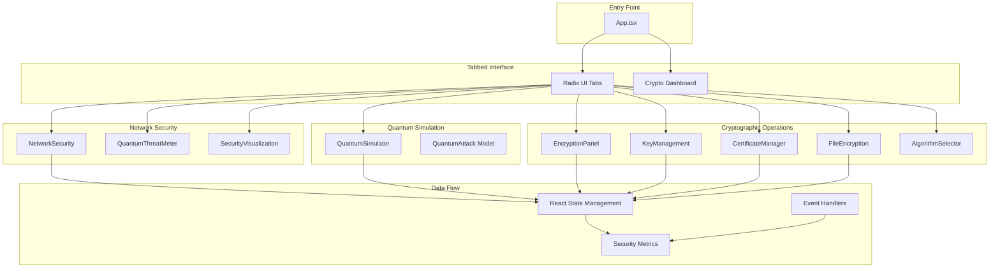
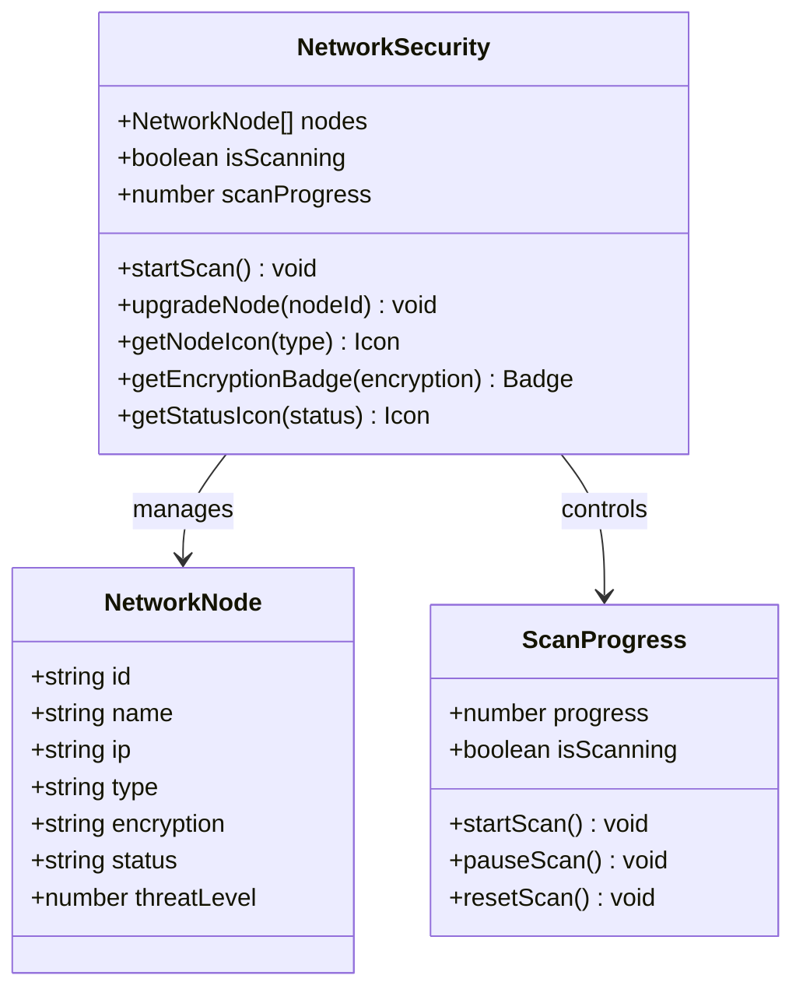
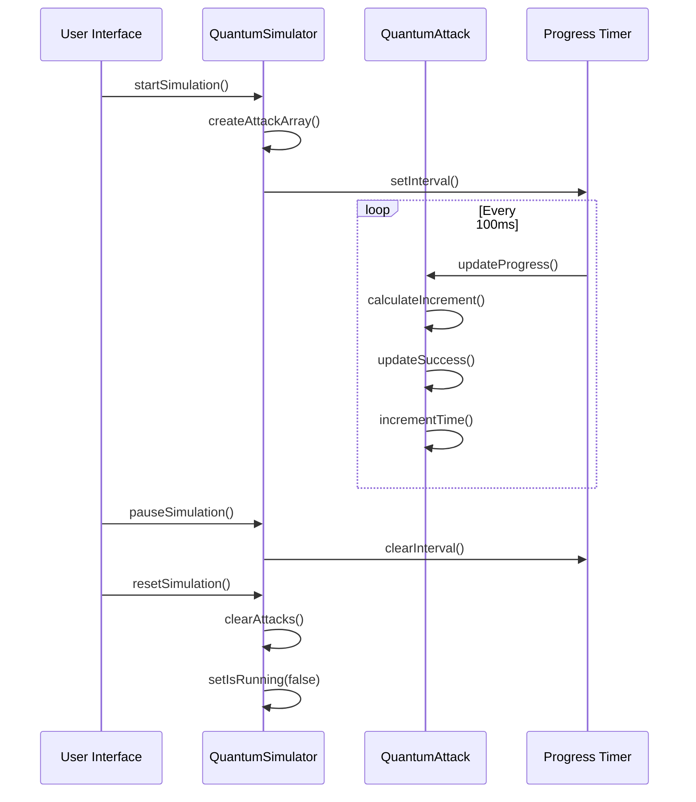
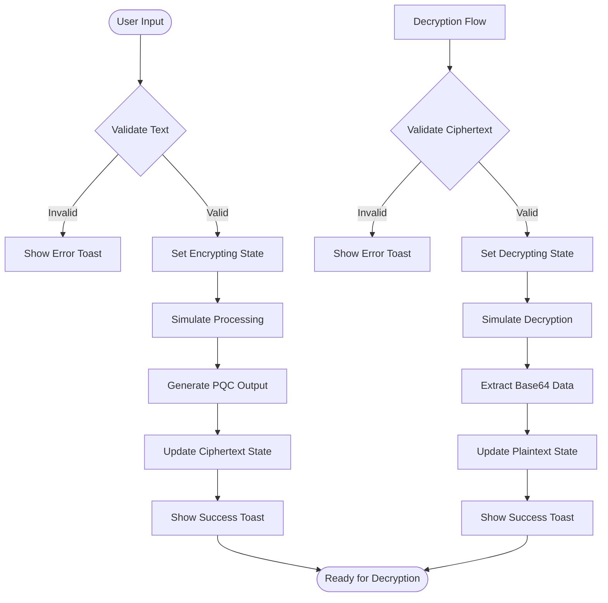
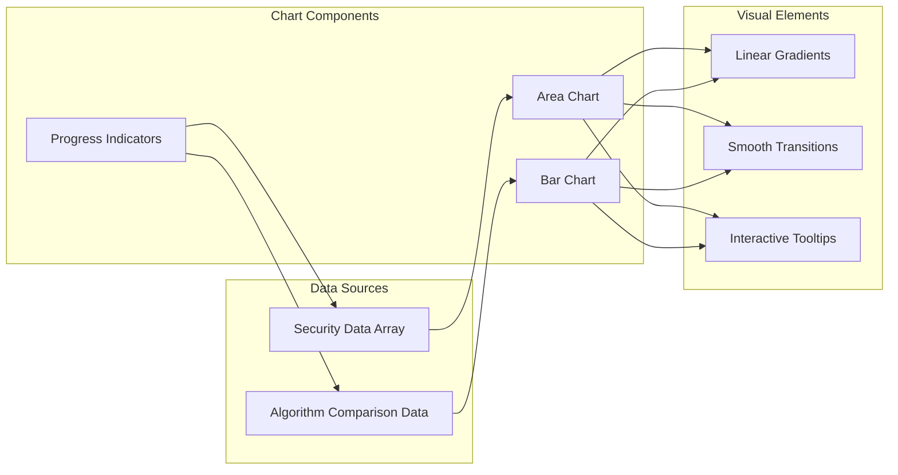

# Network Security Simulation

<cite>
**Referenced Files in This Document**
- [App.tsx](file://Design/src/app/App.tsx)
- [network-security.tsx](file://Design/src/app/components/network-security.tsx)
- [quantum-simulator.tsx](file://Design/src/app/components/quantum-simulator.tsx)
- [quantum-threat-meter.tsx](file://Design/src/app/components/quantum-threat-meter.tsx)
- [security-visualization.tsx](file://Design/src/app/components/security-visualization.tsx)
- [crypto-dashboard.tsx](file://Design/src/app/components/crypto-dashboard.tsx)
- [encryption-panel.tsx](file://Design/src/app/components/encryption-panel.tsx)
- [key-management.tsx](file://Design/src/app/components/key-management.tsx)
- [certificate-manager.tsx](file://Design/src/app/components/certificate-manager.tsx)
- [algorithm-selector.tsx](file://Design/src/app/components/algorithm-selector.tsx)
- [file-encryption.tsx](file://Design/src/app/components/file-encryption.tsx)
- [activity-log.tsx](file://Design/src/app/components/activity-log.tsx)
- [package.json](file://Design/package.json)
- [README.md](file://Design/README.md)
</cite>

## Table of Contents
1. [Introduction](#introduction)
2. [Project Structure](#project-structure)
3. [Core Components](#core-components)
4. [Architecture Overview](#architecture-overview)
5. [Detailed Component Analysis](#detailed-component-analysis)
6. [Dependency Analysis](#dependency-analysis)
7. [Performance Considerations](#performance-considerations)
8. [Troubleshooting Guide](#troubleshooting-guide)
9. [Conclusion](#conclusion)

## Introduction
The Network Security Simulation component demonstrates quantum-resistant network protocols and security assessment tools through an interactive educational platform. This system simulates quantum computing threats against classical cryptographic systems while showcasing post-quantum cryptography (PQC) solutions. The framework provides hands-on experience with secure communication channels, protocol validation, and threat modeling in quantum computing environments.

The simulation integrates multiple security domains including network topology analysis, quantum attack simulation, cryptographic algorithm demonstration, and real-time security metrics visualization. Users can interact with realistic scenarios that illustrate the transition from classical to quantum-resistant security measures.

## Project Structure
The Network Security Simulation is built as a React-based web application using modern UI libraries and animation frameworks. The project follows a modular component architecture with specialized modules for different security aspects.



**Diagram sources**
- [App.tsx](file://Design/src/app/App.tsx#L208-L316)
- [network-security.tsx](file://Design/src/app/components/network-security.tsx#L1-L303)
- [quantum-simulator.tsx](file://Design/src/app/components/quantum-simulator.tsx#L1-L316)

**Section sources**
- [App.tsx](file://Design/src/app/App.tsx#L1-L362)
- [package.json](file://Design/package.json#L1-L93)

## Core Components
The Network Security Simulation consists of several interconnected components that work together to provide a comprehensive security education platform:

### Network Security Module
The Network Security component provides a visual representation of network infrastructure with quantum threat assessment capabilities. It displays network nodes categorized by type (servers, routers, endpoints) and encryption status (classical, post-quantum, hybrid).

### Quantum Simulator
The Quantum Simulator demonstrates quantum computing attacks on various cryptographic algorithms. It provides real-time visualization of attack progress and success rates for both classical and post-quantum algorithms.

### Security Visualization
This module presents security metrics and algorithm performance comparisons through interactive charts and graphs, helping users understand the trade-offs between different cryptographic approaches.

### Cryptographic Components
The suite includes encryption panels, key management systems, and certificate managers that demonstrate practical implementation of post-quantum cryptographic techniques.

**Section sources**
- [network-security.tsx](file://Design/src/app/components/network-security.tsx#L9-L151)
- [quantum-simulator.tsx](file://Design/src/app/components/quantum-simulator.tsx#L9-L80)
- [security-visualization.tsx](file://Design/src/app/components/security-visualization.tsx#L5-L22)

## Architecture Overview
The system employs a modular architecture with clear separation of concerns between security simulation, cryptographic demonstration, and visualization components.



**Diagram sources**
- [App.tsx](file://Design/src/app/App.tsx#L26-L91)
- [network-security.tsx](file://Design/src/app/components/network-security.tsx#L68-L110)
- [quantum-simulator.tsx](file://Design/src/app/components/quantum-simulator.tsx#L17-L79)

The architecture follows React best practices with component composition, state management, and event-driven interactions. Each component maintains its own state while communicating through props and callback functions.

**Section sources**
- [App.tsx](file://Design/src/app/App.tsx#L26-L91)
- [algorithm-selector.tsx](file://Design/src/app/components/algorithm-selector.tsx#L68-L120)

## Detailed Component Analysis

### Network Security Component
The Network Security component serves as the central hub for network topology visualization and threat assessment.



**Diagram sources**
- [network-security.tsx](file://Design/src/app/components/network-security.tsx#L9-L17)
- [network-security.tsx](file://Design/src/app/components/network-security.tsx#L19-L110)

The component implements a sophisticated scanning mechanism that simulates network security assessment. It tracks threat levels across different network nodes and provides real-time status updates through animated progress indicators.

**Section sources**
- [network-security.tsx](file://Design/src/app/components/network-security.tsx#L19-L110)

### Quantum Simulator Component
The Quantum Simulator provides an immersive demonstration of quantum computing attacks on cryptographic systems.



**Diagram sources**
- [quantum-simulator.tsx](file://Design/src/app/components/quantum-simulator.tsx#L25-L48)
- [quantum-simulator.tsx](file://Design/src/app/components/quantum-simulator.tsx#L50-L79)

The simulator implements different attack speeds based on algorithm type, with post-quantum algorithms progressing much slower than classical ones, visually demonstrating their resistance to quantum attacks.

**Section sources**
- [quantum-simulator.tsx](file://Design/src/app/components/quantum-simulator.tsx#L17-L80)

### Cryptographic Algorithm Demonstration
The encryption panel provides hands-on experience with post-quantum cryptographic algorithms through simulated operations.



**Diagram sources**
- [encryption-panel.tsx](file://Design/src/app/components/encryption-panel.tsx#L45-L78)
- [encryption-panel.tsx](file://Design/src/app/components/encryption-panel.tsx#L63-L78)

The encryption process includes algorithm identification, base64 encoding, and randomized padding to simulate real cryptographic operations while maintaining educational clarity.

**Section sources**
- [encryption-panel.tsx](file://Design/src/app/components/encryption-panel.tsx#L15-L96)

### Security Metrics and Visualization
The security visualization component presents comprehensive metrics through interactive charts and real-time data updates.



**Diagram sources**
- [security-visualization.tsx](file://Design/src/app/components/security-visualization.tsx#L5-L22)
- [security-visualization.tsx](file://Design/src/app/components/security-visualization.tsx#L24-L105)

The visualization system uses Recharts for responsive data presentation and includes gradient fills, smooth animations, and interactive tooltips to enhance user engagement.

**Section sources**
- [security-visualization.tsx](file://Design/src/app/components/security-visualization.tsx#L24-L105)

## Dependency Analysis
The Network Security Simulation relies on a carefully curated set of dependencies that support both the educational and functional aspects of the platform.

```mermaid
graph TB
subgraph "Core Dependencies"
React[React 18.3.1]
Motion[Motion React 12.23.24]
Radix[Radix UI 1.x]
end
subgraph "UI Libraries"
Lucide[Lucide Icons 0.487.0]
Tailwind[Tailwind CSS 4.1.12]
Recharts[Recharts 2.15.2]
end
subgraph "Animation & 3D"
ThreeJS[Three.js ^0.182.0]
Drei[@react-three/drei ^10.7.7]
Fiber[@react-three/fiber ^9.5.0]
end
subgraph "Utilities"
Sonner[Sonner 2.0.3]
Emotion[@emotion/react & styled]
clsx[clsx 2.1.1]
end
subgraph "Application"
App[App.tsx]
Components[Component Modules]
end
App --> React
App --> Motion
App --> Radix
App --> Lucide
App --> Tailwind
App --> Recharts
App --> Sonner
Components --> Motion
Components --> Radix
Components --> Recharts
Components --> Lucide
ThreeJS --> Drei
ThreeJS --> Fiber
```

**Diagram sources**
- [package.json](file://Design/package.json#L10-L68)

The dependency graph reveals a modern React ecosystem optimized for both performance and developer experience. The inclusion of Three.js and related libraries enables advanced 3D visualizations for quantum simulation components.

**Section sources**
- [package.json](file://Design/package.json#L10-L68)

## Performance Considerations
The Network Security Simulation is designed with performance optimization in mind, particularly for real-time animations and data visualization components.

### Animation Performance
The application utilizes Motion React for smooth animations while maintaining optimal frame rates. The quantum simulation includes controlled animation timing to prevent performance degradation during intensive operations.

### Data Visualization Efficiency
Recharts components are configured for efficient rendering of large datasets. The security visualization charts use responsive containers and optimized data structures to minimize layout thrashing.

### Memory Management
The component architecture follows React best practices with proper cleanup of intervals and timeouts. State management avoids unnecessary re-renders through careful prop passing and memoization patterns.

### Network Simulation Optimization
The network security scanning implements throttled updates and efficient state updates to maintain responsiveness during intensive security assessments.

## Troubleshooting Guide

### Common Issues and Solutions

**Quantum Simulation Not Responding**
- Verify that the quantum simulation is not paused or reset
- Check browser console for JavaScript errors
- Ensure sufficient system resources for 3D animations

**Network Security Scanning Stuck**
- Confirm that the scanning interval is properly cleared
- Check for memory leaks in component unmounting
- Verify state updates are not blocked by pending operations

**Chart Rendering Problems**
- Ensure responsive container dimensions are properly calculated
- Check for data format inconsistencies in visualization arrays
- Verify Recharts dependencies are properly installed

**Animation Performance Issues**
- Monitor browser performance using developer tools
- Consider reducing animation complexity on lower-end devices
- Check for excessive re-renders in animation-heavy components

**Section sources**
- [quantum-simulator.tsx](file://Design/src/app/components/quantum-simulator.tsx#L25-L48)
- [network-security.tsx](file://Design/src/app/components/network-security.tsx#L71-L85)

## Conclusion
The Network Security Simulation provides a comprehensive educational platform for understanding quantum-resistant network security. Through interactive simulations, real-time threat assessment, and practical cryptographic demonstrations, users gain valuable insights into the transition from classical to post-quantum cryptography.

The modular architecture ensures maintainability and extensibility, while the comprehensive visualization system enhances learning through engaging, interactive experiences. The platform successfully bridges the gap between theoretical security concepts and practical implementation, making complex quantum computing security topics accessible to learners at all levels.

The integration of multiple security domains—from network topology analysis to cryptographic algorithm demonstration—creates a holistic learning experience that prepares users for the quantum computing era of cybersecurity.