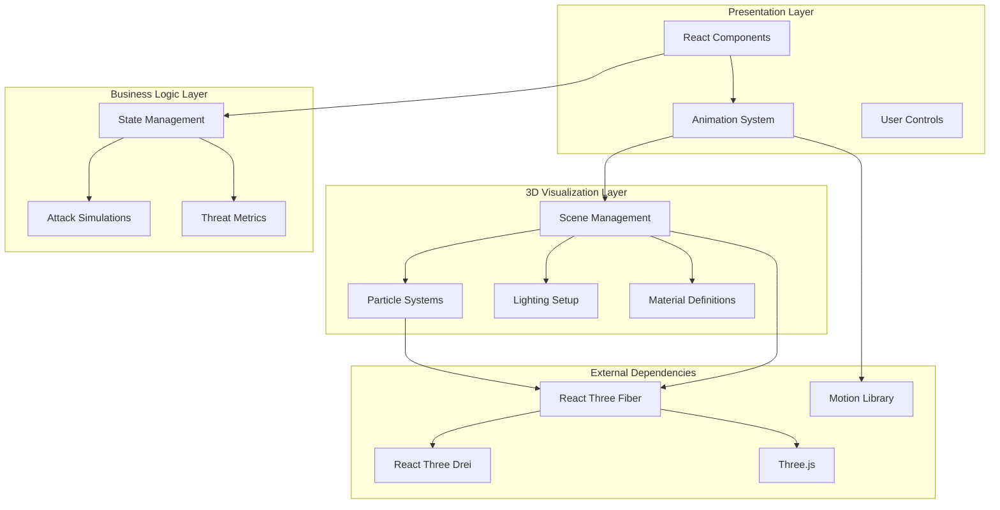
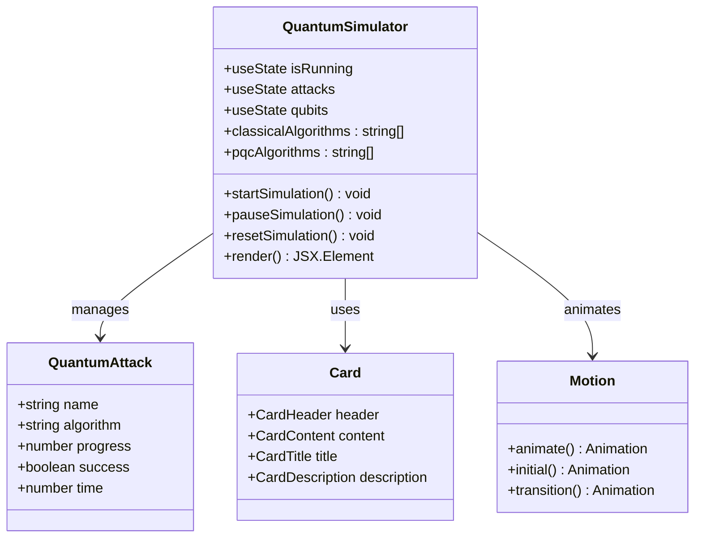
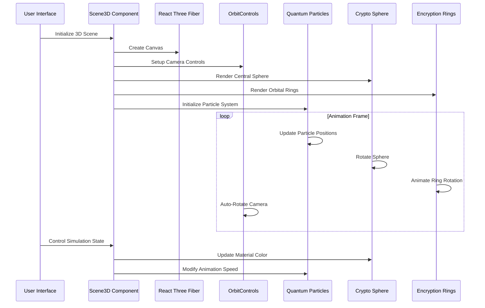
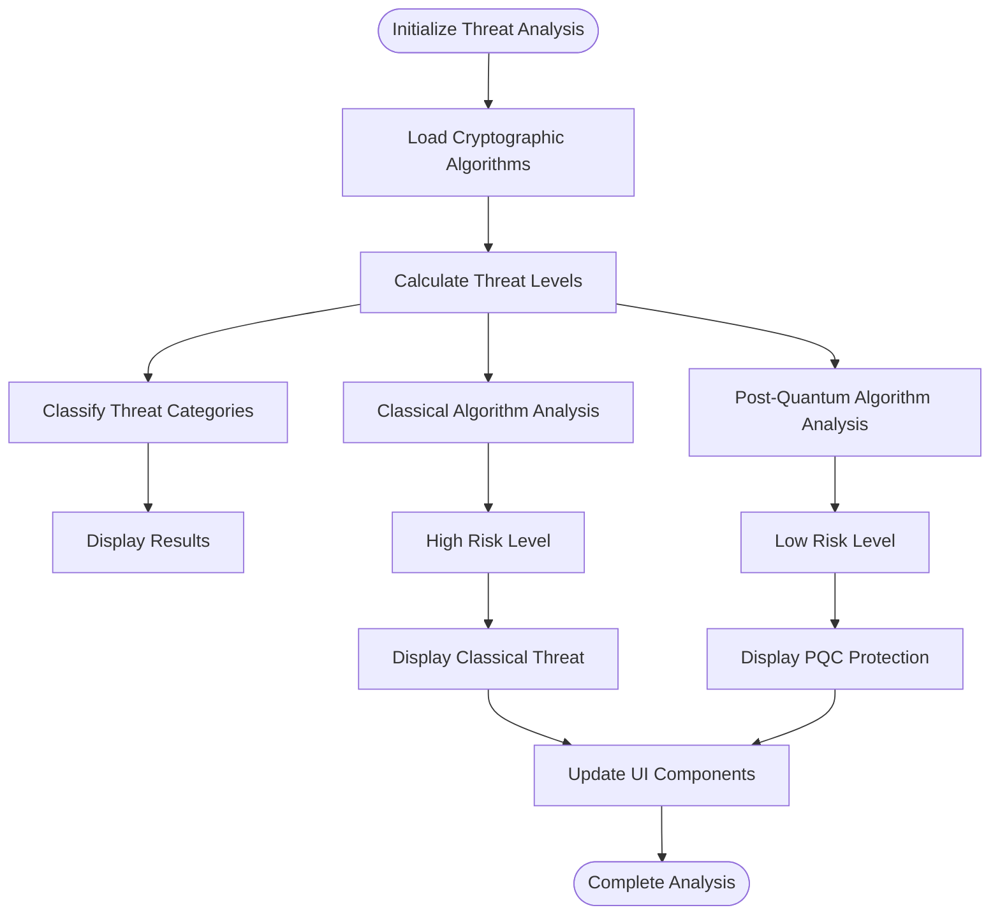
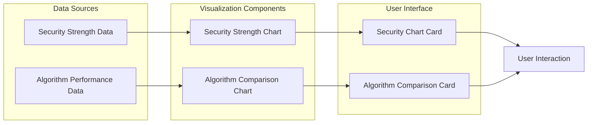

# Quantum Simulator

<cite>
**Referenced Files in This Document**
- [App.tsx](file://Design/src/app/App.tsx)
- [quantum-simulator.tsx](file://Design/src/app/components/quantum-simulator.tsx)
- [3d-scene.tsx](file://Design/src/app/components/3d-scene.tsx)
- [3d-hero.tsx](file://Design/src/app/components/3d-hero.tsx)
- [quantum-threat-meter.tsx](file://Design/src/app/components/quantum-threat-meter.tsx)
- [security-visualization.tsx](file://Design/src/app/components/security-visualization.tsx)
- [crypto-dashboard.tsx](file://Design/src/app/components/crypto-dashboard.tsx)
- [card.tsx](file://Design/src/app/components/ui/card.tsx)
- [package.json](file://Design/package.json)
- [README.md](file://Design/README.md)
</cite>

## Table of Contents
1. [Introduction](#introduction)
2. [Project Structure](#project-structure)
3. [Core Components](#core-components)
4. [Architecture Overview](#architecture-overview)
5. [Detailed Component Analysis](#detailed-component-analysis)
6. [Dependency Analysis](#dependency-analysis)
7. [Performance Considerations](#performance-considerations)
8. [Troubleshooting Guide](#troubleshooting-guide)
9. [Conclusion](#conclusion)

## Introduction
This document provides comprehensive documentation for the Quantum Simulator component that delivers immersive 3D visualization of quantum computing threats and attack vectors. The system combines React-based UI components with Three.js-powered 3D scenes to create an educational experience that demonstrates quantum cryptography concepts, attack simulations, and threat modeling. The implementation leverages @react-three/fiber for efficient Three.js integration and motion for smooth animations.

The Quantum Simulator serves as part of a broader Post-Quantum Cryptography Suite, designed to help users understand the evolving landscape of cryptographic security in the face of quantum computing advancement. Through interactive visualizations, users can explore how quantum algorithms pose risks to classical cryptography while demonstrating the resilience of post-quantum cryptographic methods.

## Project Structure
The Quantum Simulator integrates seamlessly within a React application architecture that follows modern frontend development patterns. The project utilizes a component-based structure with clear separation of concerns between UI presentation, 3D visualization, and data management.

```mermaid
graph TB
subgraph "Application Layer"
App[App.tsx]
Tabs[Tabs Navigation]
Dashboard[Crypto Dashboard]
end
subgraph "Quantum Simulation Components"
QS[Quantum Simulator]
QTM[Quantum Threat Meter]
SV[Security Visualization]
end
subgraph "3D Visualization Layer"
Scene3D[Scene3D Component]
Hero3D[Hero 3D]
Particles[Quantum Particles]
Rings[Encryption Rings]
Sphere[Crypto Sphere]
end
subgraph "UI Infrastructure"
Card[Card Components]
Motion[Animation Library]
Radix[Radix UI Primitives]
end
subgraph "3D Engine"
Fiber[@react-three/fiber]
Drei[@react-three/drei]
ThreeJS[Three.js Core]
end
App --> QS
App --> QTM
App --> SV
QS --> Scene3D
Hero3D --> Fiber
Scene3D --> Fiber
Scene3D --> Drei
Scene3D --> ThreeJS
QS --> Card
QS --> Motion
QS --> Radix
```

**Diagram sources**
- [App.tsx](file://Design/src/app/App.tsx#L208-L316)
- [quantum-simulator.tsx](file://Design/src/app/components/quantum-simulator.tsx#L1-L316)
- [3d-scene.tsx](file://Design/src/app/components/3d-scene.tsx#L125-L151)

The project structure demonstrates a modular architecture where each component serves a specific educational purpose while maintaining cohesive integration with the overall application ecosystem.

**Section sources**
- [App.tsx](file://Design/src/app/App.tsx#L1-L362)
- [package.json](file://Design/package.json#L1-L93)

## Core Components
The Quantum Simulator consists of several interconnected components that work together to deliver an immersive educational experience. Each component addresses specific aspects of quantum threat visualization and cryptographic demonstration.

### Quantum Simulator Main Component
The primary Quantum Simulator component provides the interactive interface for demonstrating quantum attacks on various cryptographic algorithms. It manages state for simulation control, attack progression tracking, and user interaction parameters.

Key features include:
- Real-time attack simulation with configurable qubit counts
- Visual progress tracking for both classical and post-quantum algorithms
- Animated quantum visualization with particle systems
- Educational messaging and threat level indicators

### 3D Scene Architecture
The 3D visualization system creates an immersive environment using Three.js through @react-three/fiber. The Scene3D component orchestrates multiple animated elements including quantum particles, encryption rings, and a central crypto sphere.

### Threat Modeling System
The Quantum Threat Meter provides contextual information about current security posture, comparing classical cryptography vulnerabilities with post-quantum protection levels. This component helps users understand the urgency and importance of transitioning to quantum-resistant algorithms.

**Section sources**
- [quantum-simulator.tsx](file://Design/src/app/components/quantum-simulator.tsx#L17-L316)
- [3d-scene.tsx](file://Design/src/app/components/3d-scene.tsx#L125-L151)
- [quantum-threat-meter.tsx](file://Design/src/app/components/quantum-threat-meter.tsx#L40-L149)

## Architecture Overview
The Quantum Simulator employs a layered architecture that separates concerns between user interface, 3D visualization, and data management. This design enables scalability and maintainability while providing rich interactive experiences.



**Diagram sources**
- [quantum-simulator.tsx](file://Design/src/app/components/quantum-simulator.tsx#L1-L316)
- [3d-scene.tsx](file://Design/src/app/components/3d-scene.tsx#L1-L151)

The architecture ensures that each layer has distinct responsibilities, enabling independent development and testing while maintaining cohesive functionality across the entire system.

## Detailed Component Analysis

### Quantum Simulator Component
The Quantum Simulator component serves as the primary interface for demonstrating quantum attacks on cryptographic systems. It combines React state management with sophisticated animation systems to create an engaging educational experience.



**Diagram sources**
- [quantum-simulator.tsx](file://Design/src/app/components/quantum-simulator.tsx#L9-L15)
- [quantum-simulator.tsx](file://Design/src/app/components/quantum-simulator.tsx#L17-L316)

The component implements a sophisticated attack simulation system where different algorithms progress at varying rates. Classical algorithms like RSA-2048 and ECC-256 show rapid progress toward breaking, while post-quantum algorithms demonstrate slower progression or resistance to quantum attacks.

**Section sources**
- [quantum-simulator.tsx](file://Design/src/app/components/quantum-simulator.tsx#L17-L316)

### 3D Scene Implementation
The 3D visualization system creates an immersive quantum computing environment using Three.js through @react-three/fiber. The Scene3D component orchestrates multiple animated elements that represent quantum phenomena and cryptographic concepts.



**Diagram sources**
- [3d-scene.tsx](file://Design/src/app/components/3d-scene.tsx#L125-L151)
- [3d-scene.tsx](file://Design/src/app/components/3d-scene.tsx#L6-L58)

The 3D scene features a central crypto sphere surrounded by orbital rings that represent quantum states and encryption layers. The particle system simulates quantum fluctuations and decoherence effects, providing visual metaphors for quantum mechanical phenomena.

**Section sources**
- [3d-scene.tsx](file://Design/src/app/components/3d-scene.tsx#L1-L151)

### Quantum Threat Modeling System
The threat modeling system provides contextual information about current security posture and quantum threat levels. This component helps users understand the urgency and importance of transitioning to post-quantum cryptographic methods.



**Diagram sources**
- [quantum-threat-meter.tsx](file://Design/src/app/components/quantum-threat-meter.tsx#L40-L149)

The threat meter categorizes security levels into four risk categories: Low Risk, Moderate Risk, High Risk, and Critical Risk. This classification system helps users quickly understand their current security posture and the urgency of implementing quantum-resistant solutions.

**Section sources**
- [quantum-threat-meter.tsx](file://Design/src/app/components/quantum-threat-meter.tsx#L1-L149)

### Educational Visualization Components
The security visualization system provides comparative analysis of different cryptographic algorithms, helping users understand the trade-offs between security strength, performance characteristics, and practical implementation considerations.



**Diagram sources**
- [security-visualization.tsx](file://Design/src/app/components/security-visualization.tsx#L24-L107)

The visualization system presents complex data in accessible formats, using area charts for temporal security trends and bar charts for algorithmic comparisons. This dual approach helps users understand both the historical context and future implications of cryptographic choices.

**Section sources**
- [security-visualization.tsx](file://Design/src/app/components/security-visualization.tsx#L1-L107)

## Dependency Analysis
The Quantum Simulator relies on a carefully selected set of dependencies that balance functionality, performance, and maintainability. The dependency graph reveals a focused ecosystem optimized for 3D visualization and interactive user experiences.

```mermaid
graph TB
subgraph "Core Application"
React[React 18.3.1]
Motion[Motion 12.23.24]
Tailwind[Tailwind CSS]
end
subgraph "3D Visualization"
Fiber[@react-three/fiber 9.5.0]
Drei[@react-three/drei 10.7.7]
Three[Three.js 0.182.0]
end
subgraph "UI Components"
Radix[Radix UI Primitives]
Lucide[Lucide Icons]
Recharts[Recharts]
end
subgraph "Development Tools"
Vite[Vite 6.3.5]
TailwindPlugin[Tailwind Plugin]
ReactPlugin[React Plugin]
end
React --> Fiber
React --> Motion
Fiber --> Three
Fiber --> Drei
React --> Radix
Radix --> Lucide
React --> Recharts
Vite --> TailwindPlugin
Vite --> ReactPlugin
```

**Diagram sources**
- [package.json](file://Design/package.json#L10-L68)

The dependency selection prioritizes modern React patterns, efficient 3D rendering capabilities, and comprehensive UI component libraries. This combination enables the creation of sophisticated educational content while maintaining excellent performance characteristics.

**Section sources**
- [package.json](file://Design/package.json#L1-L93)

## Performance Considerations
The Quantum Simulator is designed with performance optimization in mind, particularly given the computational demands of 3D rendering and real-time animations. Several strategies ensure smooth user experiences across different hardware configurations.

### Rendering Pipeline Optimization
The 3D rendering pipeline employs instanced rendering for particle systems, reducing draw calls and improving performance. The quantum particles utilize instanced meshes to efficiently render thousands of individual particles while maintaining smooth animation performance.

### Animation System Efficiency
The animation system leverages motion primitives that minimize unnecessary re-renders and optimize DOM updates. The use of Framer Motion ensures that animations are hardware-accelerated and responsive to user interactions.

### Memory Management
The component architecture implements proper cleanup mechanisms for animation loops and event listeners. This prevents memory leaks and ensures stable performance over extended usage periods.

### Responsive Design Considerations
The system adapts to different screen sizes and device capabilities, automatically adjusting particle counts and animation complexity based on available resources. This adaptive approach ensures optimal performance across desktop, tablet, and mobile devices.

## Troubleshooting Guide
Common issues and their solutions when working with the Quantum Simulator component:

### 3D Rendering Issues
- **Problem**: 3D scenes not rendering properly
- **Solution**: Verify that @react-three/fiber and Three.js dependencies are properly installed and compatible with the current React version

### Animation Performance Problems
- **Problem**: Choppy animations or low frame rates
- **Solution**: Reduce particle counts in the quantum particles system or disable certain animations during intensive operations

### State Synchronization Issues
- **Problem**: Attack progress not updating correctly
- **Solution**: Ensure proper cleanup of interval timers and useEffect dependencies in the Quantum Simulator component

### UI Component Integration
- **Problem**: Cards or other UI components not displaying correctly
- **Solution**: Verify that the card component dependencies are properly configured and that Tailwind CSS is correctly processing the component styles

**Section sources**
- [quantum-simulator.tsx](file://Design/src/app/components/quantum-simulator.tsx#L25-L48)
- [3d-scene.tsx](file://Design/src/app/components/3d-scene.tsx#L26-L50)

## Conclusion
The Quantum Simulator represents a sophisticated educational tool that successfully bridges the gap between complex quantum computing concepts and accessible visual representation. Through its integration of React state management, Three.js-powered 3D visualization, and comprehensive threat modeling, the system provides users with an immersive understanding of quantum cryptography challenges and solutions.

The modular architecture ensures maintainability and extensibility, while the performance optimizations enable smooth operation across diverse hardware configurations. The educational framework effectively translates technical concepts into intuitive visual metaphors, making quantum computing threats understandable to audiences with varying technical backgrounds.

This implementation serves as a foundation for further development and enhancement, with clear pathways for adding new cryptographic algorithms, expanding visualization capabilities, and integrating additional educational content. The system's design principles and architectural decisions provide a robust platform for continued innovation in quantum education technology.