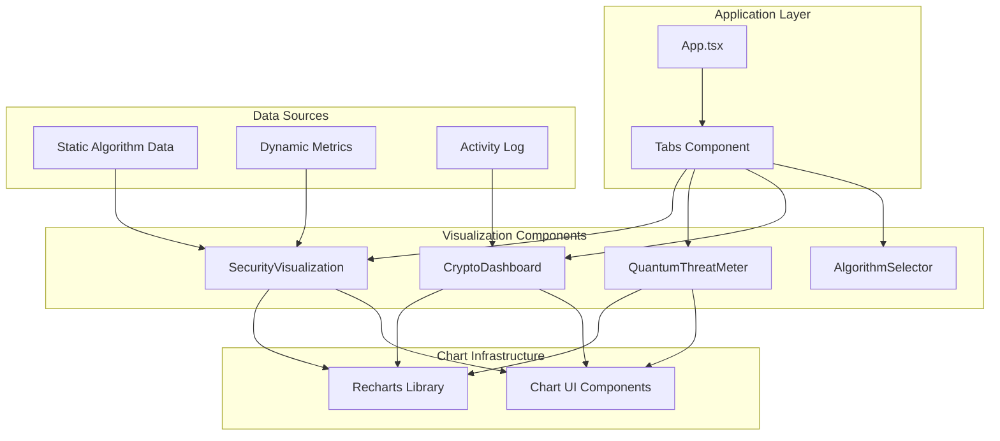
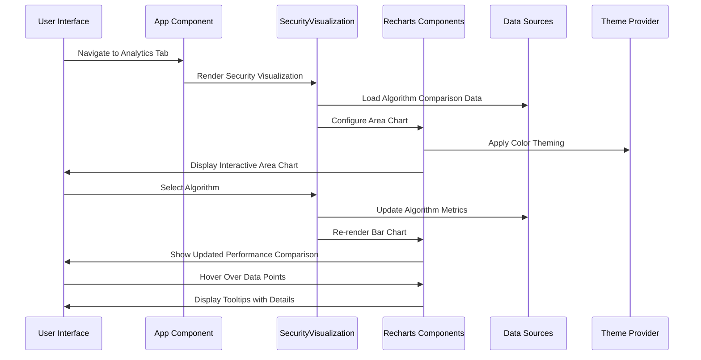
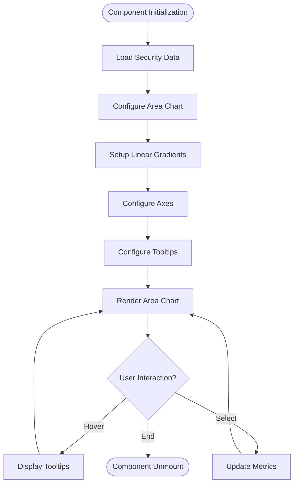
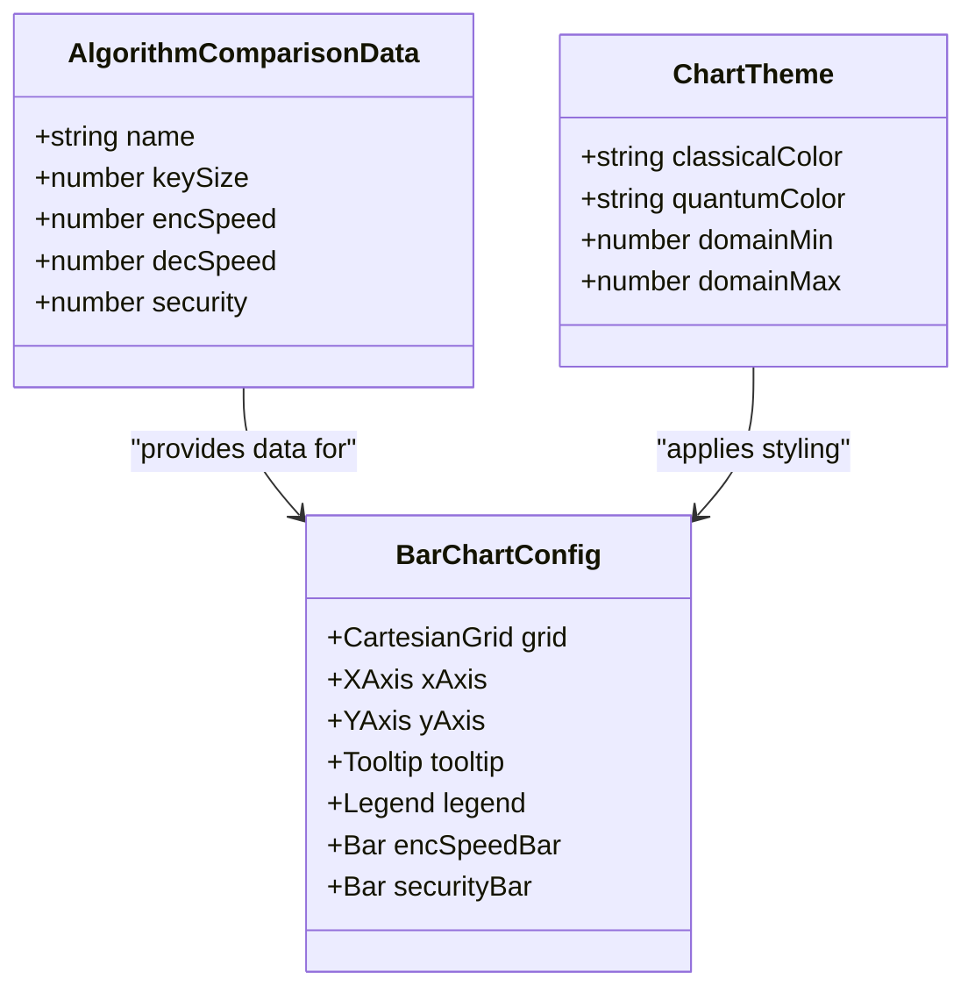
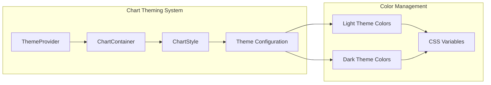
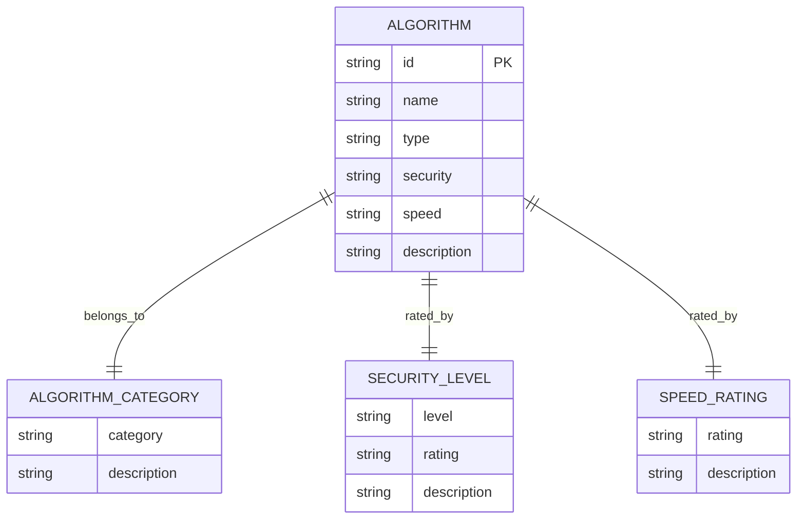
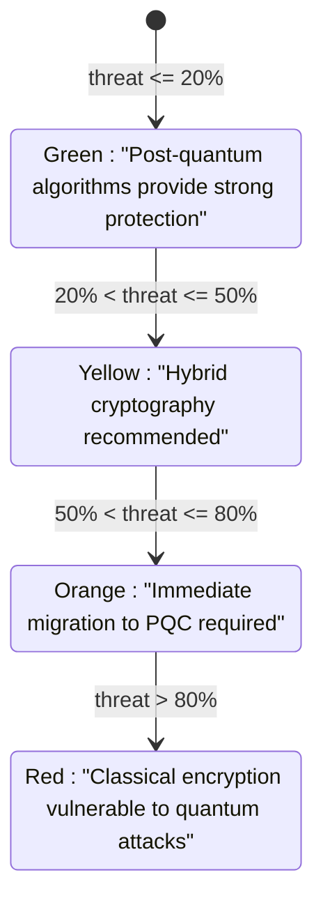
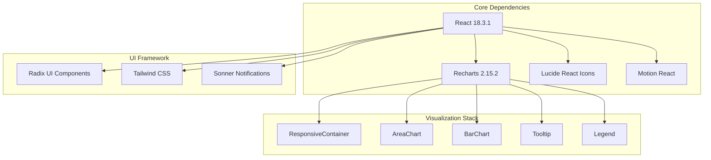

# Security Visualization

<cite>
**Referenced Files in This Document**
- [security-visualization.tsx](file://Design/src/app/components/security-visualization.tsx)
- [chart.tsx](file://Design/src/app/components/ui/chart.tsx)
- [crypto-dashboard.tsx](file://Design/src/app/components/crypto-dashboard.tsx)
- [algorithm-selector.tsx](file://Design/src/app/components/algorithm-selector.tsx)
- [quantum-threat-meter.tsx](file://Design/src/app/components/quantum-threat-meter.tsx)
- [App.tsx](file://Design/src/app/App.tsx)
- [package.json](file://Design/package.json)
- [README.md](file://Design/README.md)
</cite>

## Table of Contents
1. [Introduction](#introduction)
2. [Project Structure](#project-structure)
3. [Core Components](#core-components)
4. [Architecture Overview](#architecture-overview)
5. [Detailed Component Analysis](#detailed-component-analysis)
6. [Dependency Analysis](#dependency-analysis)
7. [Performance Considerations](#performance-considerations)
8. [Troubleshooting Guide](#troubleshooting-guide)
9. [Conclusion](#conclusion)

## Introduction
This document provides comprehensive technical documentation for the Security Visualization component that uses Recharts to deliver performance comparisons and threat assessments for post-quantum cryptographic algorithms. The visualization system presents interactive charts including area charts for temporal security strength comparisons and bar charts for algorithm performance metrics. It demonstrates how raw cryptographic performance metrics are aggregated and transformed into meaningful, responsive visual representations that help users understand security trade-offs between classical and post-quantum cryptographic approaches.

The system integrates seamlessly with the broader application ecosystem, providing educational insights into algorithm selection, real-time performance monitoring capabilities, and comparative analysis dashboards that support informed decision-making for quantum-safe cryptography adoption.

## Project Structure
The Security Visualization component is part of a larger React application built with modern UI libraries and charting capabilities. The project follows a component-based architecture with dedicated visualization modules.

**Diagram sources**
- [App.tsx](file://Design/src/app/App.tsx#L208-L316)
- [security-visualization.tsx](file://Design/src/app/components/security-visualization.tsx#L1-L107)
- [quantum-threat-meter.tsx](file://Design/src/app/components/quantum-threat-meter.tsx#L1-L149)

**Section sources**
- [App.tsx](file://Design/src/app/App.tsx#L1-L362)
- [package.json](file://Design/package.json#L1-L93)

## Core Components
The Security Visualization system comprises several interconnected components that work together to present comprehensive cryptographic analytics:

### SecurityVisualization Component
The primary visualization component that renders two key charts: an area chart showing temporal security strength comparisons and a bar chart displaying algorithm performance metrics.

### Chart Infrastructure
A custom chart wrapper that extends Recharts with theming, tooltips, legends, and responsive container capabilities, providing consistent styling across all visualizations.

### Algorithm Selector
Provides interactive selection of post-quantum cryptographic algorithms with detailed metadata presentation, enabling contextual visualization updates.

### Threat Assessment Dashboard
Displays quantum threat levels and security posture indicators with animated progress bars and risk categorization.

**Section sources**
- [security-visualization.tsx](file://Design/src/app/components/security-visualization.tsx#L1-L107)
- [chart.tsx](file://Design/src/app/components/ui/chart.tsx#L1-L354)
- [algorithm-selector.tsx](file://Design/src/app/components/algorithm-selector.tsx#L1-L121)
- [quantum-threat-meter.tsx](file://Design/src/app/components/quantum-threat-meter.tsx#L1-L149)

## Architecture Overview
The visualization architecture follows a layered approach with clear separation of concerns between data preparation, chart rendering, and user interaction.

**Diagram sources**
- [App.tsx](file://Design/src/app/App.tsx#L302-L305)
- [security-visualization.tsx](file://Design/src/app/components/security-visualization.tsx#L24-L107)
- [chart.tsx](file://Design/src/app/components/ui/chart.tsx#L37-L70)

The architecture ensures responsive design through the use of ResponsiveContainer components and maintains consistent theming across all visualizations via the custom chart infrastructure.

## Detailed Component Analysis

### SecurityVisualization Component Implementation
The SecurityVisualization component serves as the central hub for cryptographic performance and security comparisons, featuring two distinct chart types that address different analytical needs.

#### Area Chart: Security Strength Over Time
The area chart displays temporal security strength comparisons between classical and post-quantum cryptographic approaches, using gradient fills to emphasize security trends over time periods.

**Diagram sources**
- [security-visualization.tsx](file://Design/src/app/components/security-visualization.tsx#L36-L75)

#### Bar Chart: Algorithm Performance Comparison
The bar chart provides comparative analysis of post-quantum algorithms across multiple performance dimensions, enabling users to evaluate security versus speed trade-offs.

**Diagram sources**
- [security-visualization.tsx](file://Design/src/app/components/security-visualization.tsx#L15-L22)
- [security-visualization.tsx](file://Design/src/app/components/security-visualization.tsx#L85-L101)

**Section sources**
- [security-visualization.tsx](file://Design/src/app/components/security-visualization.tsx#L24-L107)

### Chart Infrastructure and Theming
The custom chart infrastructure extends Recharts with advanced theming capabilities, responsive design features, and consistent styling across all visualizations.

#### Chart Container and Theming System
The chart system provides automatic theming based on the application's dark/light mode preferences, ensuring consistent visual appearance across different contexts.

**Diagram sources**
- [chart.tsx](file://Design/src/app/components/ui/chart.tsx#L37-L103)

#### Tooltip and Legend Enhancements
Advanced tooltip and legend components provide enhanced user interaction capabilities with customizable formatting and styling options.

**Section sources**
- [chart.tsx](file://Design/src/app/components/ui/chart.tsx#L1-L354)

### Algorithm Selection and Contextual Visualization
The AlgorithmSelector component provides interactive selection of post-quantum cryptographic algorithms while displaying detailed metadata that informs visualization context.

#### Algorithm Metadata Management
The system maintains comprehensive metadata for six major post-quantum algorithms, each with standardized security levels, speed ratings, and descriptive information.

**Diagram sources**
- [algorithm-selector.tsx](file://Design/src/app/components/algorithm-selector.tsx#L8-L66)

**Section sources**
- [algorithm-selector.tsx](file://Design/src/app/components/algorithm-selector.tsx#L1-L121)

### Threat Assessment Visualization
The QuantumThreatMeter component provides comprehensive threat level assessment with dual visualization panels comparing post-quantum protection and classical cryptography vulnerability.

#### Threat Level Classification System
The threat assessment system categorizes security risks into four distinct levels with corresponding visual indicators and recommendations.

**Diagram sources**
- [quantum-threat-meter.tsx](file://Design/src/app/components/quantum-threat-meter.tsx#L13-L38)

**Section sources**
- [quantum-threat-meter.tsx](file://Design/src/app/components/quantum-threat-meter.tsx#L40-L149)

## Dependency Analysis
The Security Visualization system relies on several key dependencies that enable advanced charting capabilities and responsive design features.

**Diagram sources**
- [package.json](file://Design/package.json#L10-L68)

The dependency graph reveals a focused stack optimized for performance and developer experience, with Recharts providing the foundation for all visualization capabilities.

**Section sources**
- [package.json](file://Design/package.json#L1-L93)

## Performance Considerations
The Security Visualization system incorporates several performance optimization strategies to ensure smooth user interactions and efficient rendering of complex charts.

### Responsive Design Implementation
The system utilizes ResponsiveContainer components to automatically adjust chart dimensions based on viewport size, ensuring optimal display across all device types and screen orientations.

### Data Structure Optimization
Algorithm comparison data is structured as arrays of objects with consistent field names, enabling efficient rendering and easy manipulation for dynamic updates.

### Memory Management
The component architecture minimizes memory overhead through proper cleanup of event listeners and efficient state management, preventing memory leaks during extended usage.

### Rendering Performance
Chart components are optimized for minimal re-renders through careful state management and selective prop updates, maintaining smooth interactions even with large datasets.

## Troubleshooting Guide
Common issues and solutions for the Security Visualization system:

### Chart Rendering Issues
- **Problem**: Charts not displaying properly
- **Solution**: Verify Recharts installation and check for missing dependencies in package.json
- **Prevention**: Ensure all required dependencies are installed before running the application

### Theme Consistency Problems
- **Problem**: Inconsistent colors between charts
- **Solution**: Check ChartContainer configuration and theme provider setup
- **Prevention**: Use the provided ChartContainer component for all visualizations

### Data Formatting Errors
- **Problem**: Incorrect data display or chart misalignment
- **Solution**: Verify data structure matches expected format with proper numeric values
- **Prevention**: Validate data types before passing to chart components

### Performance Degradation
- **Problem**: Slow chart interactions or rendering delays
- **Solution**: Optimize data size and reduce unnecessary re-renders
- **Prevention**: Implement proper memoization and state management patterns

**Section sources**
- [README.md](file://Design/README.md#L6-L11)

## Conclusion
The Security Visualization component represents a sophisticated implementation of cryptographic analytics using modern React patterns and Recharts capabilities. The system successfully transforms complex cryptographic performance metrics into intuitive visual representations that aid in understanding security trade-offs between classical and post-quantum cryptographic approaches.

Through its dual-chart architecture, comprehensive theming system, and responsive design implementation, the component provides both educational value and practical utility for security professionals evaluating post-quantum cryptographic solutions. The modular architecture ensures maintainability and extensibility, while the performance optimizations guarantee smooth user experiences even with complex datasets.

The integration with the broader application ecosystem demonstrates how specialized visualization components can enhance overall system usability and provide actionable insights for informed decision-making in quantum-safe cryptography adoption.