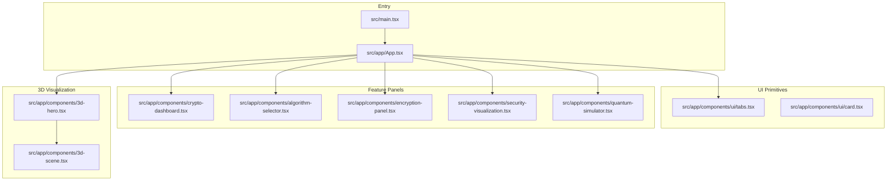
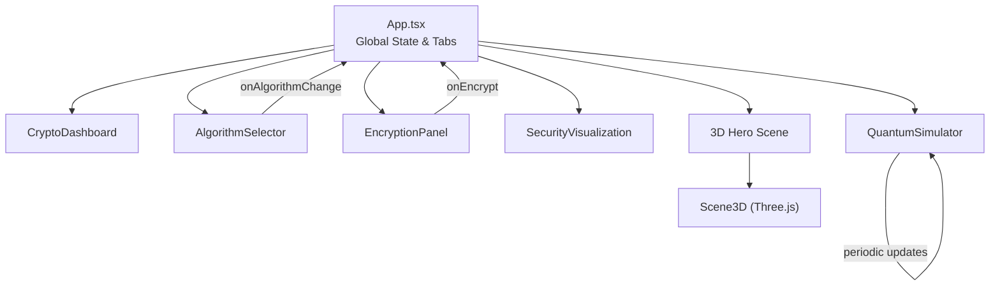
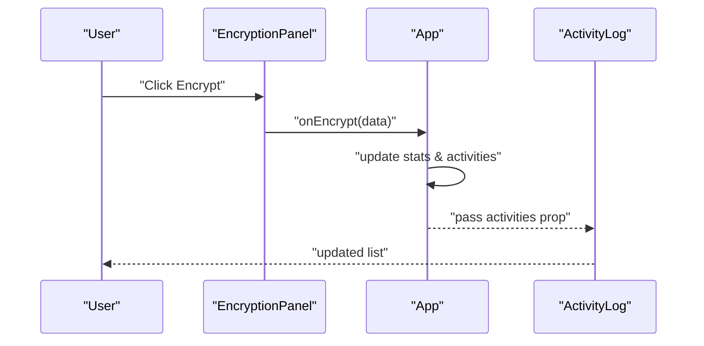
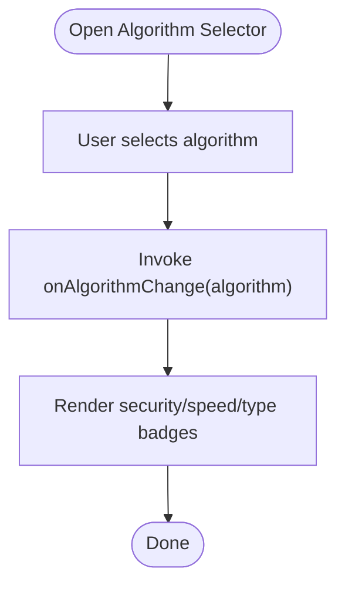
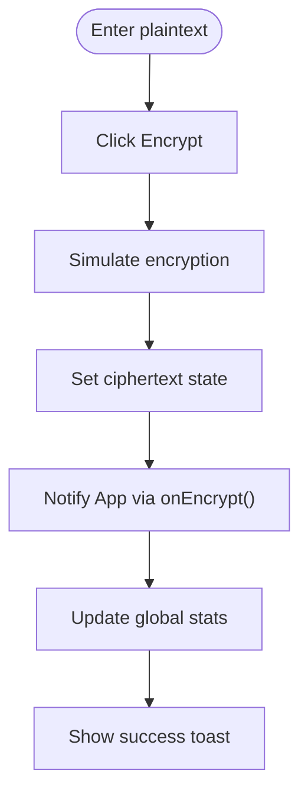
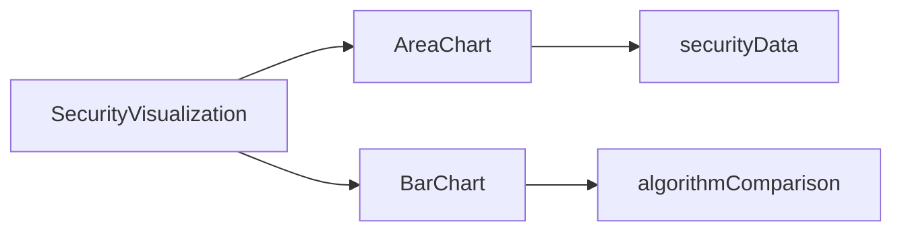
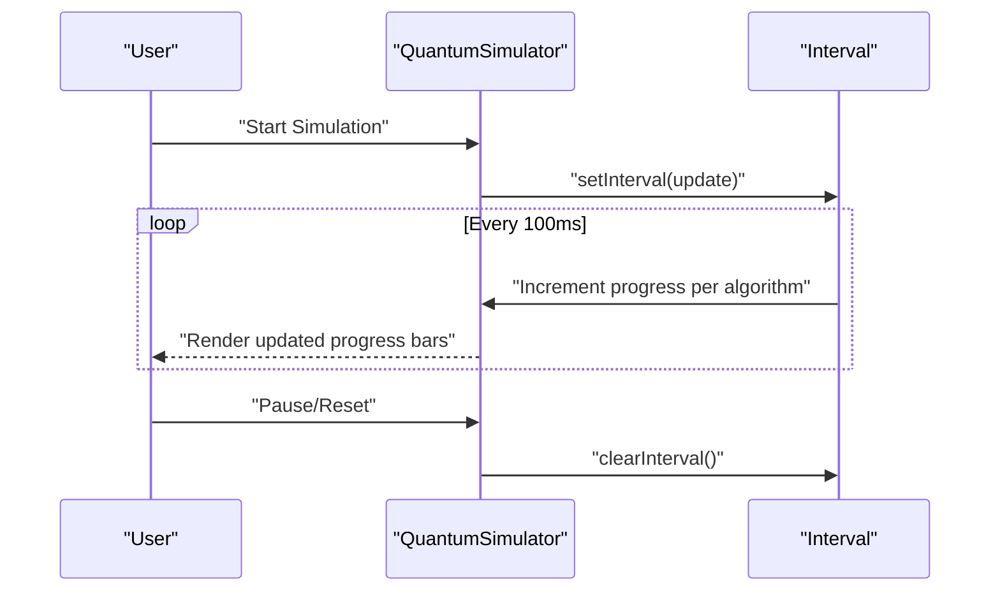
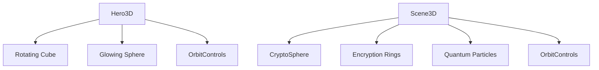
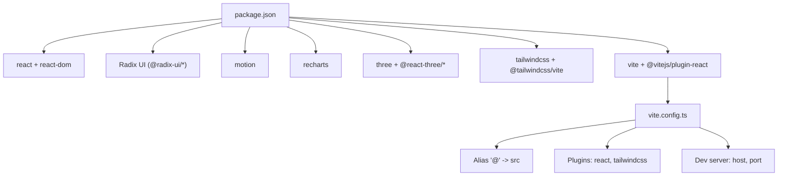

# Architecture Overview

<cite>
**Referenced Files in This Document**
- [App.tsx](file://Design/src/app/App.tsx)
- [main.tsx](file://Design/src/main.tsx)
- [vite.config.ts](file://Design/vite.config.ts)
- [package.json](file://Design/package.json)
- [README.md](file://Design/README.md)
- [algorithm-selector.tsx](file://Design/src/app/components/algorithm-selector.tsx)
- [encryption-panel.tsx](file://Design/src/app/components/encryption-panel.tsx)
- [crypto-dashboard.tsx](file://Design/src/app/components/crypto-dashboard.tsx)
- [security-visualization.tsx](file://Design/src/app/components/security-visualization.tsx)
- [quantum-simulator.tsx](file://Design/src/app/components/quantum-simulator.tsx)
- [3d-scene.tsx](file://Design/src/app/components/3d-scene.tsx)
- [3d-hero.tsx](file://Design/src/app/components/3d-hero.tsx)
- [ui/tabs.tsx](file://Design/src/app/components/ui/tabs.tsx)
- [ui/card.tsx](file://Design/src/app/components/ui/card.tsx)
- [tailwind.css](file://Design/src/styles/tailwind.css)
</cite>

## Table of Contents
1. [Introduction](#introduction)
2. [Project Structure](#project-structure)
3. [Core Components](#core-components)
4. [Architecture Overview](#architecture-overview)
5. [Detailed Component Analysis](#detailed-component-analysis)
6. [Dependency Analysis](#dependency-analysis)
7. [Performance Considerations](#performance-considerations)
8. [Troubleshooting Guide](#troubleshooting-guide)
9. [Conclusion](#conclusion)
10. [Appendices](#appendices)

## Introduction
This document describes the architecture of the Post-Quantum Cryptography Educational Platform, a React-based application built with Vite. The platform is designed to teach post-quantum cryptographic concepts through interactive demonstrations, including encryption panels, algorithm comparisons, quantum threat simulations, and 3D visualizations. It emphasizes:
- Centralized state management at the root container
- Prop drilling for algorithm and dashboard data
- Real-time updates via React hooks and periodic timers
- Integration of Three.js for immersive 3D quantum visualization
- Recharts for analytics dashboards
- Radix UI primitives for accessible UI controls

## Project Structure
The project follows a feature-based layout under src/app/components with a dedicated App.tsx root container. Build and styling are configured via Vite and Tailwind CSS.

**Diagram sources**
- [main.tsx](file://Design/src/main.tsx#L1-L7)
- [App.tsx](file://Design/src/app/App.tsx#L1-L362)
- [ui/tabs.tsx](file://Design/src/app/components/ui/tabs.tsx#L1-L67)
- [ui/card.tsx](file://Design/src/app/components/ui/card.tsx#L1-L93)
- [crypto-dashboard.tsx](file://Design/src/app/components/crypto-dashboard.tsx#L1-L70)
- [algorithm-selector.tsx](file://Design/src/app/components/algorithm-selector.tsx#L1-L121)
- [encryption-panel.tsx](file://Design/src/app/components/encryption-panel.tsx#L1-L238)
- [security-visualization.tsx](file://Design/src/app/components/security-visualization.tsx#L1-L107)
- [quantum-simulator.tsx](file://Design/src/app/components/quantum-simulator.tsx#L1-L316)
- [3d-hero.tsx](file://Design/src/app/components/3d-hero.tsx#L1-L76)
- [3d-scene.tsx](file://Design/src/app/components/3d-scene.tsx#L1-L151)

**Section sources**
- [main.tsx](file://Design/src/main.tsx#L1-L7)
- [App.tsx](file://Design/src/app/App.tsx#L1-L362)
- [vite.config.ts](file://Design/vite.config.ts#L1-L23)
- [package.json](file://Design/package.json#L1-L93)
- [tailwind.css](file://Design/src/styles/tailwind.css#L1-L5)

## Core Components
- App.tsx: Root container managing global state (selected algorithm, activity log, statistics) and orchestrating tabbed views.
- AlgorithmSelector: Educational selector for post-quantum algorithms with metadata display.
- EncryptionPanel: Interactive plaintext/ciphertext editor with simulated encryption/decryption and actions.
- CryptoDashboard: Summary statistics cards reflecting global metrics.
- SecurityVisualization: Charts comparing classical vs post-quantum security and algorithm performance.
- QuantumSimulator: Real-time simulation of quantum attacks with animated progress and 3D visualization.
- 3D Hero and Scene: Three.js-powered immersive scenes for hero and encryption visualization.

Data flow patterns:
- Centralized state in App.tsx is passed down as props to child components.
- Event callbacks (e.g., onEncrypt, onAlgorithmChange) update state and trigger re-renders.
- Periodic timers (e.g., quantum simulator) update state for real-time visuals.

**Section sources**
- [App.tsx](file://Design/src/app/App.tsx#L18-L91)
- [algorithm-selector.tsx](file://Design/src/app/components/algorithm-selector.tsx#L68-L121)
- [encryption-panel.tsx](file://Design/src/app/components/encryption-panel.tsx#L10-L238)
- [crypto-dashboard.tsx](file://Design/src/app/components/crypto-dashboard.tsx#L4-L70)
- [security-visualization.tsx](file://Design/src/app/components/security-visualization.tsx#L24-L107)
- [quantum-simulator.tsx](file://Design/src/app/components/quantum-simulator.tsx#L17-L80)
- [3d-hero.tsx](file://Design/src/app/components/3d-hero.tsx#L53-L76)
- [3d-scene.tsx](file://Design/src/app/components/3d-scene.tsx#L125-L151)

## Architecture Overview
The platform uses a unidirectional data flow:
- App.tsx holds state and passes it to feature components.
- Feature components render UI using Radix UI primitives and Tailwind CSS.
- Analytics rely on Recharts; 3D rendering relies on Three.js via @react-three/fiber and @react-three/drei.
- Vite handles bundling, alias resolution, and development server configuration.

**Diagram sources**
- [App.tsx](file://Design/src/app/App.tsx#L26-L91)
- [crypto-dashboard.tsx](file://Design/src/app/components/crypto-dashboard.tsx#L13-L70)
- [algorithm-selector.tsx](file://Design/src/app/components/algorithm-selector.tsx#L73-L121)
- [encryption-panel.tsx](file://Design/src/app/components/encryption-panel.tsx#L15-L238)
- [security-visualization.tsx](file://Design/src/app/components/security-visualization.tsx#L24-L107)
- [quantum-simulator.tsx](file://Design/src/app/components/quantum-simulator.tsx#L17-L80)
- [3d-hero.tsx](file://Design/src/app/components/3d-hero.tsx#L53-L76)
- [3d-scene.tsx](file://Design/src/app/components/3d-scene.tsx#L125-L151)

## Detailed Component Analysis

### App Container and State Management
App.tsx centralizes:
- Selected algorithm state
- Activity log with recent events
- Global statistics (encryption counts, data volume, security level)
Callbacks update state and propagate changes to dependent components.

**Diagram sources**
- [App.tsx](file://Design/src/app/App.tsx#L47-L63)
- [encryption-panel.tsx](file://Design/src/app/components/encryption-panel.tsx#L45-L61)
- [crypto-dashboard.tsx](file://Design/src/app/components/crypto-dashboard.tsx#L13-L70)

**Section sources**
- [App.tsx](file://Design/src/app/App.tsx#L26-L91)

### Algorithm Selection and Metadata
AlgorithmSelector renders a curated list of post-quantum algorithms and displays metadata badges. It communicates the selected algorithm to parent containers via a callback.

**Diagram sources**
- [algorithm-selector.tsx](file://Design/src/app/components/algorithm-selector.tsx#L73-L121)

**Section sources**
- [algorithm-selector.tsx](file://Design/src/app/components/algorithm-selector.tsx#L68-L121)

### Encryption Panel and Simulated Operations
EncryptionPanel manages local state for plaintext and ciphertext, simulates encryption/decryption, and triggers global stats updates. It also supports clipboard operations and file downloads.

**Diagram sources**
- [encryption-panel.tsx](file://Design/src/app/components/encryption-panel.tsx#L45-L61)
- [App.tsx](file://Design/src/app/App.tsx#L47-L54)

**Section sources**
- [encryption-panel.tsx](file://Design/src/app/components/encryption-panel.tsx#L15-L238)

### Security Visualization with Recharts
SecurityVisualization presents two charts:
- Area chart comparing classical vs post-quantum security over time
- Bar chart comparing encryption speed and security across algorithms

**Diagram sources**
- [security-visualization.tsx](file://Design/src/app/components/security-visualization.tsx#L24-L107)

**Section sources**
- [security-visualization.tsx](file://Design/src/app/components/security-visualization.tsx#L24-L107)

### Quantum Simulator and Real-Time Updates
QuantumSimulator maintains an array of attack simulations and updates them periodically while the simulation is running. It toggles between start/pause/reset states and renders progress bars with status badges.

**Diagram sources**
- [quantum-simulator.tsx](file://Design/src/app/components/quantum-simulator.tsx#L25-L48)
- [quantum-simulator.tsx](file://Design/src/app/components/quantum-simulator.tsx#L50-L80)

**Section sources**
- [quantum-simulator.tsx](file://Design/src/app/components/quantum-simulator.tsx#L17-L80)

### 3D Visualization with Three.js
Hero3D and Scene3D provide immersive experiences:
- Hero3D: Wireframe rotating cube and glowing sphere for the header
- Scene3D: Quantum encryption visualization with animated particles, rotating rings, and a color-changing sphere

**Diagram sources**
- [3d-hero.tsx](file://Design/src/app/components/3d-hero.tsx#L53-L76)
- [3d-scene.tsx](file://Design/src/app/components/3d-scene.tsx#L125-L151)

**Section sources**
- [3d-hero.tsx](file://Design/src/app/components/3d-hero.tsx#L53-L76)
- [3d-scene.tsx](file://Design/src/app/components/3d-scene.tsx#L125-L151)

### UI Primitives and Accessibility
Radix UI components provide accessible, unstyled foundations:
- Tabs: Root, List, Trigger, Content
- Card: Header, Title, Description, Content, Footer

These are composed into feature components to maintain consistency and accessibility.

**Section sources**
- [ui/tabs.tsx](file://Design/src/app/components/ui/tabs.tsx#L8-L67)
- [ui/card.tsx](file://Design/src/app/components/ui/card.tsx#L5-L93)

## Dependency Analysis
External libraries and integrations:
- React and ReactDOM: Core framework
- Radix UI: Accessible UI primitives
- Motion: Animation library for React
- Recharts: Charting library for analytics
- Three.js + @react-three/fiber/@react-three/drei: 3D rendering and controls
- Tailwind CSS: Utility-first styling with Vite plugin
- Vite: Build tool with React and Tailwind plugins

**Diagram sources**
- [package.json](file://Design/package.json#L10-L93)
- [vite.config.ts](file://Design/vite.config.ts#L6-L22)

**Section sources**
- [package.json](file://Design/package.json#L10-L93)
- [vite.config.ts](file://Design/vite.config.ts#L6-L22)

## Performance Considerations
- Prefer local component state for transient UI state (e.g., EncryptionPanel).
- Use memoization for expensive computations inside animation loops (already present in 3D components).
- Keep chart datasets small and static where possible; compute summaries in parent components.
- Debounce or throttle frequent UI updates (e.g., progress bars) to reduce re-renders.
- Lazy-load heavy 3D scenes only when needed to minimize initial bundle size.

## Troubleshooting Guide
Common issues and remedies:
- Missing dependencies: Install with the package manager and ensure peer dependencies are satisfied.
- Vite dev server not starting: Verify port availability and host binding; check allowed hosts configuration.
- Tailwind not applying styles: Confirm Tailwind plugin is enabled and source paths are correct.
- 3D scenes not rendering: Ensure Three.js and @react-three/* are installed; verify Canvas initialization.
- Charts not visible: Confirm Recharts is imported and datasets are properly structured.

**Section sources**
- [README.md](file://Design/README.md#L6-L11)
- [vite.config.ts](file://Design/vite.config.ts#L17-L22)
- [tailwind.css](file://Design/src/styles/tailwind.css#L1-L5)

## Conclusion
The platform’s architecture centers on a single source of truth in App.tsx, with predictable prop drilling and event-driven updates. Educational goals are supported by interactive panels, real-time simulations, and immersive 3D environments. The stack balances simplicity and extensibility, enabling rapid iteration on pedagogical content while maintaining a polished user experience.

## Appendices
- Development workflow: Install dependencies, run the dev server, and open the browser at the configured host/port.
- Production build: Use the build script to generate optimized assets for deployment.

**Section sources**
- [README.md](file://Design/README.md#L6-L11)
- [package.json](file://Design/package.json#L6-L9)