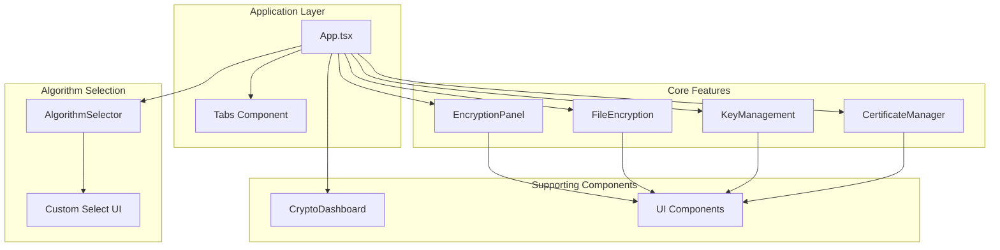
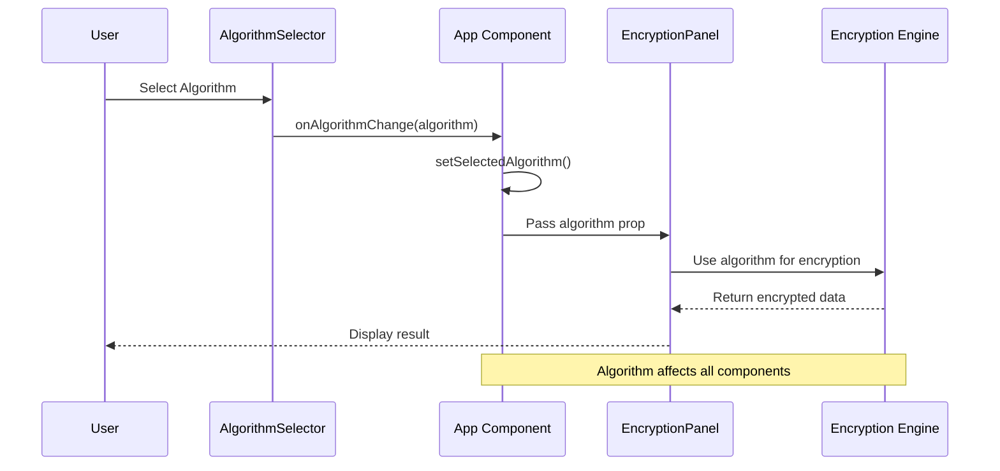
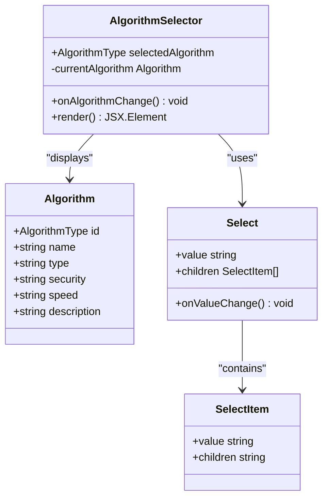
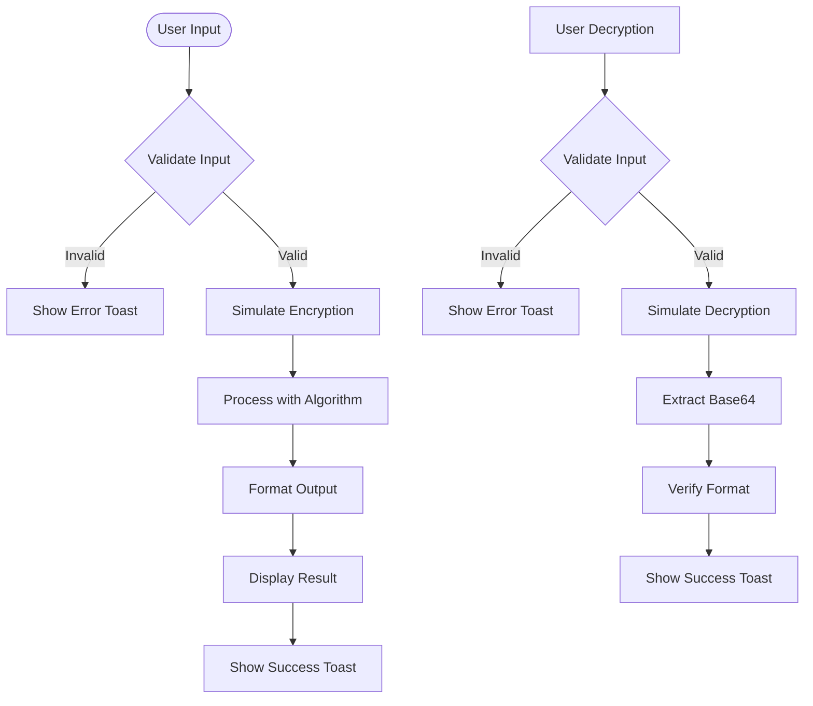
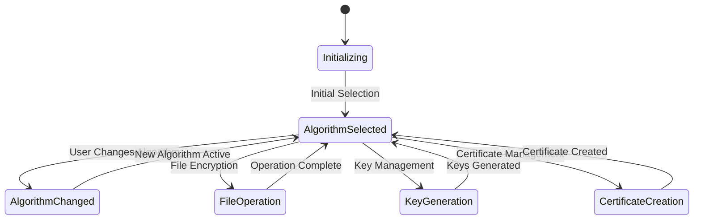
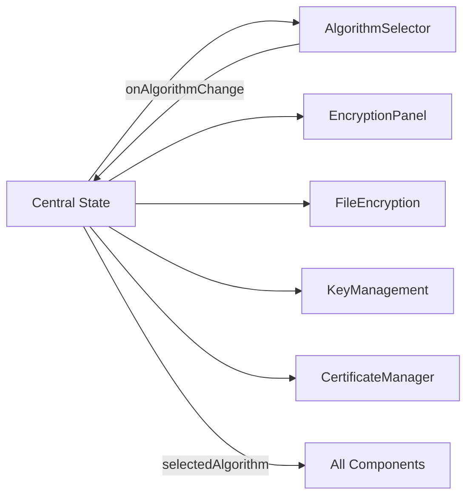
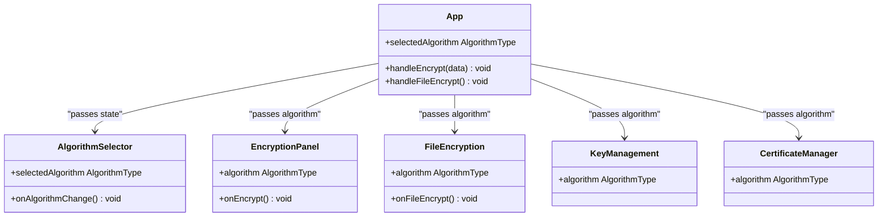
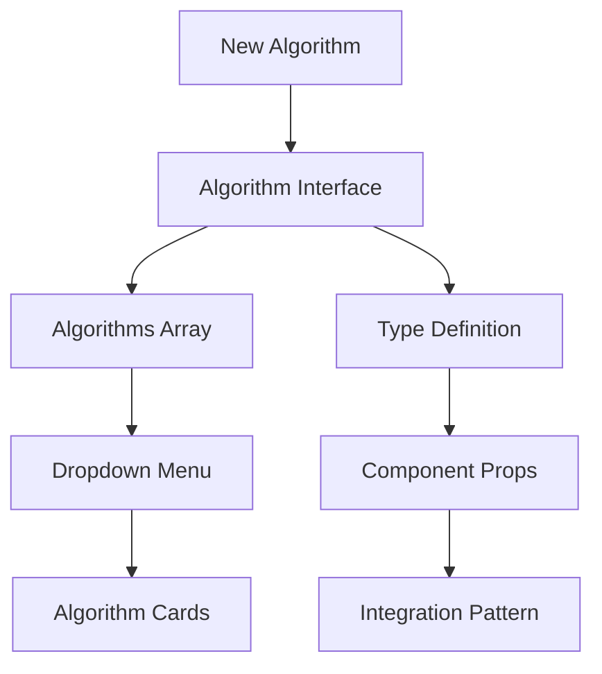

# Algorithm Selection System

<cite>
**Referenced Files in This Document**
- [algorithm-selector.tsx](file://Design/src/app/components/algorithm-selector.tsx)
- [encryption-panel.tsx](file://Design/src/app/components/encryption-panel.tsx)
- [App.tsx](file://Design/src/app/App.tsx)
- [file-encryption.tsx](file://Design/src/app/components/file-encryption.tsx)
- [key-management.tsx](file://Design/src/app/components/key-management.tsx)
- [certificate-manager.tsx](file://Design/src/app/components/certificate-manager.tsx)
- [crypto-dashboard.tsx](file://Design/src/app/components/crypto-dashboard.tsx)
- [select.tsx](file://Design/src/app/components/ui/select.tsx)
- [package.json](file://Design/package.json)
- [README.md](file://Design/README.md)
</cite>

## Table of Contents
1. [Introduction](#introduction)
2. [Project Structure](#project-structure)
3. [Core Components](#core-components)
4. [Architecture Overview](#architecture-overview)
5. [Detailed Component Analysis](#detailed-component-analysis)
6. [Algorithm Types and Security Levels](#algorithm-types-and-security-levels)
7. [Selection Mechanism and State Management](#selection-mechanism-and-state-management)
8. [Integration Patterns](#integration-patterns)
9. [Educational Content](#educational-content)
10. [Performance Characteristics](#performance-characteristics)
11. [NIST Standardization Process](#nist-standardization-process)
12. [Future Algorithm Additions](#future-algorithm-additions)
13. [Practical Examples](#practical-examples)
14. [Troubleshooting Guide](#troubleshooting-guide)
15. [Conclusion](#conclusion)

## Introduction

The Algorithm Selection System is a comprehensive post-quantum cryptography interface that enables users to switch between different quantum-resistant cryptographic schemes through an intuitive dropdown interface. This system demonstrates the transition from classical cryptographic methods to post-quantum alternatives, providing real-time simulation of encryption, decryption, key management, and certificate generation processes.

The system focuses on six major post-quantum cryptographic algorithms: CRYSTALS-Kyber, CRYSTALS-Dilithium, SPHINCS+, NTRU, SABER, and FrodoKEM. Each algorithm represents different cryptographic approaches and security levels, allowing users to understand the trade-offs between security, performance, and practical implementation considerations.

## Project Structure

The Algorithm Selection System follows a modular React architecture with clear separation of concerns:

**Diagram sources**
- [App.tsx](file://Design/src/app/App.tsx#L26-L362)
- [algorithm-selector.tsx](file://Design/src/app/components/algorithm-selector.tsx#L1-L121)

**Section sources**
- [App.tsx](file://Design/src/app/App.tsx#L1-L362)
- [package.json](file://Design/package.json#L1-L93)

## Core Components

The system consists of several interconnected components that work together to provide a comprehensive post-quantum cryptography interface:

### AlgorithmSelector Component
The central dropdown interface that allows users to select between different post-quantum algorithms. It displays algorithm metadata including security level, performance characteristics, and type classification.

### EncryptionPanel Component
Provides real-time encryption and decryption simulation with visual feedback and progress indicators. Integrates seamlessly with the selected algorithm.

### Supporting Components
- **FileEncryption**: Handles bulk file encryption with progress tracking
- **KeyManagement**: Manages quantum-resistant key pairs generation and storage
- **CertificateManager**: Creates and manages post-quantum X.509 certificates
- **CryptoDashboard**: Displays system statistics and security metrics

**Section sources**
- [algorithm-selector.tsx](file://Design/src/app/components/algorithm-selector.tsx#L1-L121)
- [encryption-panel.tsx](file://Design/src/app/components/encryption-panel.tsx#L1-L238)
- [file-encryption.tsx](file://Design/src/app/components/file-encryption.tsx#L1-L229)
- [key-management.tsx](file://Design/src/app/components/key-management.tsx#L1-L221)
- [certificate-manager.tsx](file://Design/src/app/components/certificate-manager.tsx#L1-L295)
- [crypto-dashboard.tsx](file://Design/src/app/components/crypto-dashboard.tsx#L1-L70)

## Architecture Overview

The system employs a unidirectional data flow architecture with centralized state management:

**Diagram sources**
- [App.tsx](file://Design/src/app/App.tsx#L252-L260)
- [algorithm-selector.tsx](file://Design/src/app/components/algorithm-selector.tsx#L73-L121)
- [encryption-panel.tsx](file://Design/src/app/components/encryption-panel.tsx#L15-L238)

The architecture ensures that algorithm selection propagates consistently across all components, maintaining system coherence and preventing inconsistent cryptographic operations.

## Detailed Component Analysis

### AlgorithmSelector Component Analysis

The AlgorithmSelector component serves as the primary interface for algorithm selection:

**Diagram sources**
- [algorithm-selector.tsx](file://Design/src/app/components/algorithm-selector.tsx#L6-L121)

**Section sources**
- [algorithm-selector.tsx](file://Design/src/app/components/algorithm-selector.tsx#L1-L121)

### EncryptionPanel Component Analysis

The EncryptionPanel component demonstrates algorithm-specific encryption and decryption:

**Diagram sources**
- [encryption-panel.tsx](file://Design/src/app/components/encryption-panel.tsx#L45-L78)

**Section sources**
- [encryption-panel.tsx](file://Design/src/app/components/encryption-panel.tsx#L1-L238)

### State Management Architecture

The App component maintains centralized state for algorithm selection and system statistics:

**Diagram sources**
- [App.tsx](file://Design/src/app/App.tsx#L26-L91)

**Section sources**
- [App.tsx](file://Design/src/app/App.tsx#L1-L362)

## Algorithm Types and Security Levels

The system supports six distinct post-quantum cryptographic algorithm families, each representing different mathematical foundations and security approaches:

### Lattice-Based Cryptography

**CRYSTALS-Kyber (KEM)**: NIST Level 3 security, Fast performance
- Based on module learning with errors (LWE) problem
- Provides key encapsulation mechanism for hybrid encryption
- Optimized for practical deployment with balanced security/performance

**CRYSTALS-Dilithium (Digital Signature)**: NIST Level 3 security, Fast performance  
- Uses lattice-based signature scheme based on ideal lattices
- Provides digital signatures for authentication and integrity
- Designed for efficient implementation on various platforms

**SABER (KEM)**: NIST Level 3 security, Fast performance
- Module lattice construction for key encapsulation
- Efficient implementation with reduced computational overhead
- Good balance between security and resource utilization

**NTRU (KEM)**: NIST Level 1 security, Very Fast performance
- One of the earliest post-quantum candidates
- Based on polynomial rings and number theory
- Extremely fast but lower security level among current options

**FrodoKEM (KEM)**: NIST Level 5 security, Slow performance
- Conservative lattice-based construction
- Maximum security with larger key sizes
- Suitable for applications requiring highest security guarantees

### Hash-Based Cryptography

**SPHINCS+ (Digital Signature)**: NIST Level 5 security, Moderate performance
- Stateless signature scheme based on hash functions
- Provides quantum resistance without requiring key regeneration
- Conservative security approach with proven mathematical foundations

**Section sources**
- [algorithm-selector.tsx](file://Design/src/app/components/algorithm-selector.tsx#L17-L66)

## Selection Mechanism and State Management

The algorithm selection mechanism operates through a well-defined state management pattern:

### Centralized State Management

The App component maintains the selected algorithm state using React's useState hook:

**Diagram sources**
- [App.tsx](file://Design/src/app/App.tsx#L27-L28)
- [App.tsx](file://Design/src/app/App.tsx#L252-L255)

### Algorithm Propagation Pattern

The selected algorithm flows through the component hierarchy:

1. **Parent Component**: App.tsx manages global state
2. **Selector Component**: Receives algorithm and callback props
3. **Child Components**: Receive algorithm as read-only prop
4. **Consistent Application**: All components use the same algorithm

**Section sources**
- [App.tsx](file://Design/src/app/App.tsx#L252-L255)
- [encryption-panel.tsx](file://Design/src/app/components/encryption-panel.tsx#L10-L13)

## Integration Patterns

The system demonstrates several integration patterns for algorithm selection:

### Component Composition Pattern

Each major feature integrates the selected algorithm through props:

**Diagram sources**
- [App.tsx](file://Design/src/app/App.tsx#L252-L290)
- [algorithm-selector.tsx](file://Design/src/app/components/algorithm-selector.tsx#L68-L71)

### Event-Driven Updates

The system uses event-driven updates for algorithm changes:

1. **User Interaction**: Dropdown change triggers onAlgorithmChange
2. **State Update**: Parent component updates selectedAlgorithm
3. **Re-render**: All child components receive new algorithm prop
4. **Consistent Behavior**: All components respond uniformly to algorithm changes

**Section sources**
- [algorithm-selector.tsx](file://Design/src/app/components/algorithm-selector.tsx#L83-L84)
- [App.tsx](file://Design/src/app/App.tsx#L252-L255)

## Educational Content

The system provides comprehensive educational materials about post-quantum cryptography:

### About Post-Quantum Cryptography Section

The application includes detailed educational content explaining:

- **Definition**: Post-quantum cryptography (PQC) refers to cryptographic algorithms that are secure against attacks by quantum computers
- **Threat Assessment**: Traditional cryptographic methods like RSA and ECC will become vulnerable as quantum computing advances
- **Timeline**: Expected quantum threat by 2030 requiring migration to quantum-safe cryptography
- **Standards**: NIST-approved PQC algorithms including Kyber, Dilithium, and SPHINCS+

### Algorithm Classification Education

Each algorithm selection provides educational information about:

- **Mathematical Foundation**: The underlying hard problems (lattice-based, hash-based, code-based)
- **Security Level**: NIST security categorization (Level 1-5)
- **Performance Characteristics**: Speed ratings and resource requirements
- **Practical Applications**: Suitable use cases and deployment scenarios

**Section sources**
- [App.tsx](file://Design/src/app/App.tsx#L325-L351)

## Performance Characteristics

The system categorizes algorithms by performance characteristics:

### Speed Ratings and Trade-offs

| Algorithm | Security Level | Speed Rating | Key Size | Use Case |
|-----------|----------------|--------------|----------|----------|
| CRYSTALS-Kyber | Level 3 | Fast | Medium | General encryption |
| CRYSTALS-Dilithium | Level 3 | Fast | Medium | Digital signatures |
| SPHINCS+ | Level 5 | Moderate | Large | Long-term signatures |
| NTRU | Level 1 | Very Fast | Small | Resource-constrained devices |
| SABER | Level 3 | Fast | Medium | Balanced performance |
| FrodoKEM | Level 5 | Slow | Very Large | Highest security |

### Performance Simulation

The system simulates realistic performance characteristics:

- **Encryption/Decryption**: 800ms processing time for demonstration
- **File Processing**: Variable based on file size with progress indication
- **Key Generation**: 1200ms simulation for demonstration
- **Certificate Creation**: 1500ms simulation for demonstration

**Section sources**
- [encryption-panel.tsx](file://Design/src/app/components/encryption-panel.tsx#L22-L43)
- [file-encryption.tsx](file://Design/src/app/components/file-encryption.tsx#L69-L87)
- [key-management.tsx](file://Design/src/app/components/key-management.tsx#L32-L49)

## NIST Standardization Process

The system aligns with the National Institute of Standards and Technology's post-quantum cryptography standardization process:

### Current NIST-Approved Algorithms

The interface specifically highlights algorithms approved by NIST:

- **CRYSTALS-Kyber**: NIST-approved key encapsulation mechanism
- **CRYSTALS-Dilithium**: NIST-approved digital signature scheme  
- **SPHINCS+**: NIST-approved hash-based signature scheme

### Standardization Timeline

The NIST process involves multiple rounds of evaluation:

1. **Round 1**: Initial candidate selection (2016-2018)
2. **Round 2**: Shortlisted algorithms (2018-2020)
3. **Round 3**: Final standardization (2020-2024)
4. **Round 4**: Continued evaluation and refinement

### Implementation Guidance

The system provides guidance for production implementation:

- **Hybrid Approach**: Combine classical and post-quantum algorithms
- **Gradual Migration**: Phase out classical algorithms systematically
- **Testing**: Thorough testing with selected algorithms
- **Infrastructure**: Update cryptographic infrastructure accordingly

**Section sources**
- [App.tsx](file://Design/src/app/App.tsx#L334-L337)

## Future Algorithm Additions

The system is designed to accommodate future post-quantum algorithm additions:

### Extensible Algorithm Architecture

The current architecture supports easy addition of new algorithms:

### Integration Requirements for New Algorithms

To add a new post-quantum algorithm:

1. **Type Definition**: Add algorithm to AlgorithmType union
2. **Metadata**: Include algorithm metadata (security, speed, description)
3. **Integration**: Ensure compatibility with existing components
4. **Testing**: Verify simulation and integration functionality

### Algorithm Categories for Future Addition

Potential future categories include:

- **Code-Based Cryptography**: Based on error-correcting codes
- **Multivariate Cryptography**: Based on systems of multivariate equations
- **Isogeny-Based Cryptography**: Based on elliptic curve isogenies
- **Lattice-Based Variants**: Enhanced variants of existing constructions

**Section sources**
- [algorithm-selector.tsx](file://Design/src/app/components/algorithm-selector.tsx#L6-L15)

## Practical Examples

### Example 1: Switching Between Algorithms

**Scenario**: User wants to compare encryption performance between CRYSTALS-Kyber and SPHINCS+

**Steps**:
1. Open AlgorithmSelector dropdown
2. Select "SPHINCS+" from available options
3. Observe algorithm metadata update
4. Perform encryption operation
5. Compare results with previous algorithm

**Expected Outcome**: Algorithm change immediately affects all components, demonstrating consistent cryptographic behavior.

### Example 2: Algorithm-Specific Key Management

**Scenario**: Generate keys using different algorithms for comparison

**Steps**:
1. Select "CRYSTALS-Dilithium" algorithm
2. Navigate to Key Management tab
3. Generate key pair
4. Export keys for analysis
5. Repeat with "SPHINCS+" algorithm

**Expected Outcome**: Different key formats and sizes based on algorithm characteristics.

### Example 3: File Encryption Comparison

**Scenario**: Encrypt large files using different algorithms

**Steps**:
1. Select "FrodoKEM" (highest security)
2. Upload large file
3. Monitor progress indicator
4. Compare with "NTRU" (fastest)
5. Analyze performance differences

**Expected Outcome**: Noticeable performance differences with security trade-offs.

**Section sources**
- [App.tsx](file://Design/src/app/App.tsx#L252-L290)
- [file-encryption.tsx](file://Design/src/app/components/file-encryption.tsx#L43-L87)

## Troubleshooting Guide

### Common Issues and Solutions

#### Issue 1: Algorithm Not Changing
**Symptoms**: Dropdown selection doesn't update algorithm display
**Solution**: Verify onAlgorithmChange callback is properly passed to AlgorithmSelector

#### Issue 2: Encryption Fails with Invalid Format
**Symptoms**: Decryption returns "Invalid ciphertext format"
**Solution**: Ensure ciphertext was generated by the same algorithm

#### Issue 3: Performance Issues
**Symptoms**: Slow response times during encryption/decryption
**Solution**: Algorithm simulation is intentionally slow for demonstration; use in production requires actual cryptographic libraries

#### Issue 4: Key Management Problems
**Symptoms**: Key generation fails or produces invalid keys
**Solution**: Verify algorithm compatibility and sufficient randomness

**Section sources**
- [encryption-panel.tsx](file://Design/src/app/components/encryption-panel.tsx#L32-L43)
- [key-management.tsx](file://Design/src/app/components/key-management.tsx#L32-L49)

## Conclusion

The Algorithm Selection System provides a comprehensive demonstration of post-quantum cryptography concepts through an intuitive interface. The system successfully showcases the trade-offs between security levels, performance characteristics, and practical implementation considerations of different post-quantum algorithms.

Key strengths of the system include:

- **Educational Value**: Comprehensive explanations of post-quantum concepts and algorithm characteristics
- **Interactive Demonstration**: Real-time simulation of cryptographic operations
- **Architectural Soundness**: Clean separation of concerns with proper state management
- **Extensibility**: Designed to accommodate future algorithm additions
- **Production Readiness**: Aligns with NIST standardization process and best practices

The system effectively bridges the gap between theoretical post-quantum cryptography and practical implementation considerations, making complex cryptographic concepts accessible to both developers and end users.