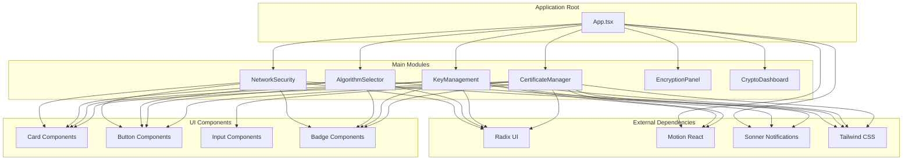
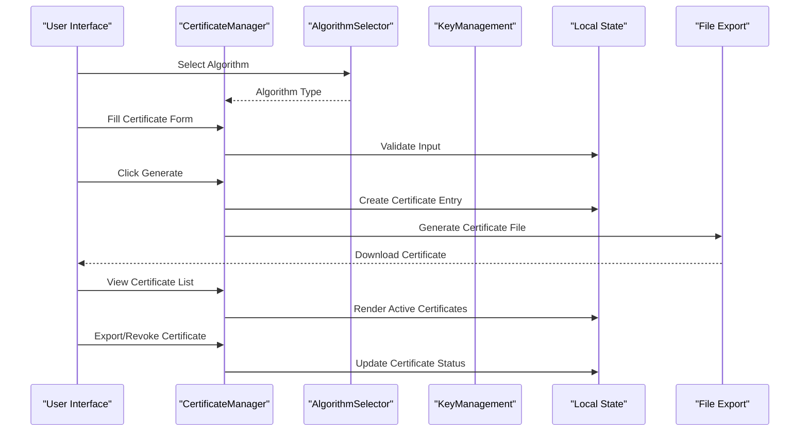
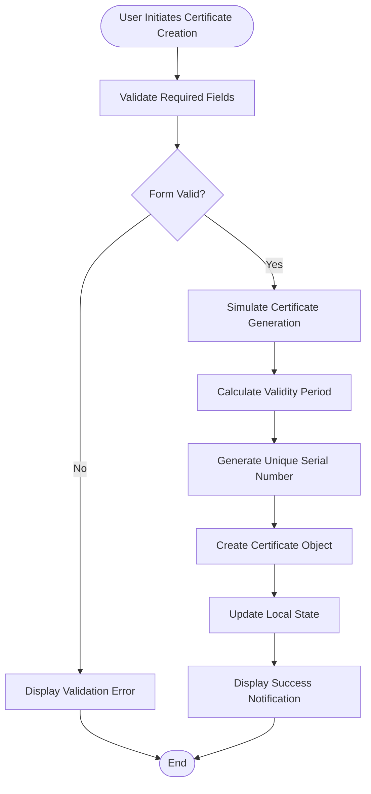
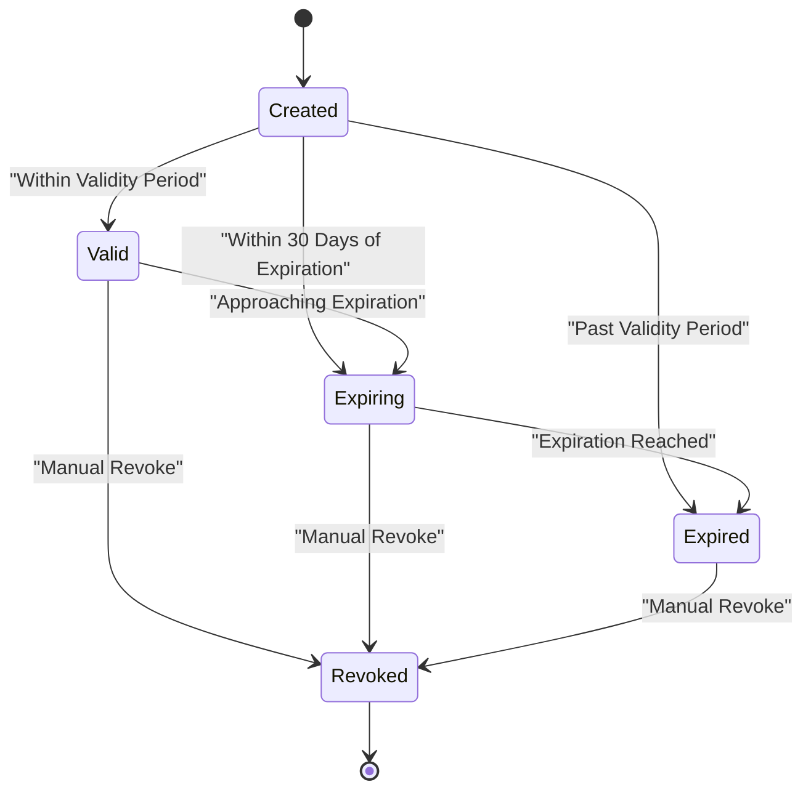
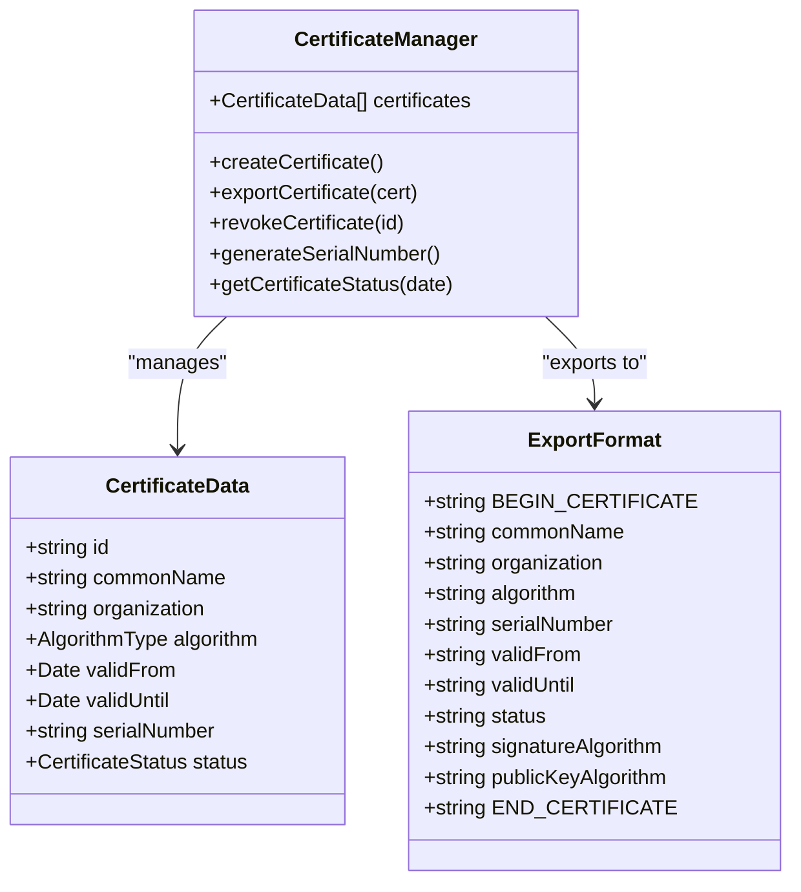
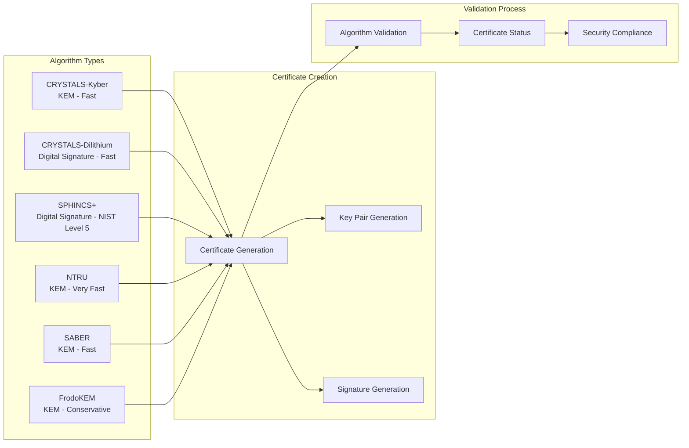
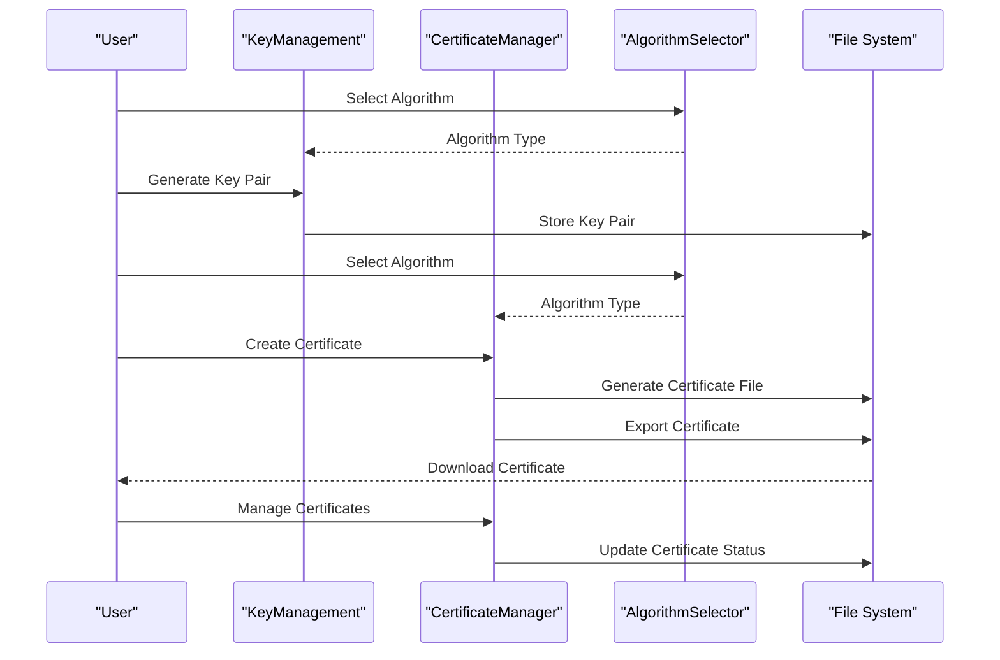
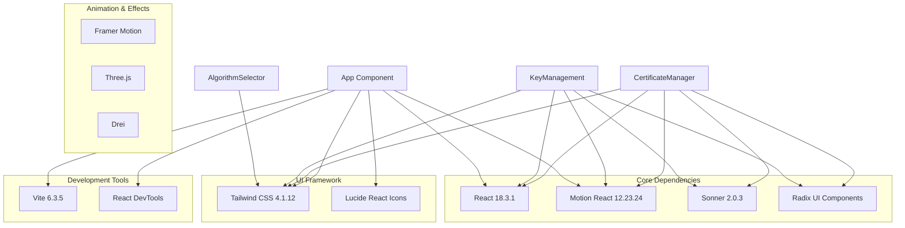

# Certificate Management

<cite>
**Referenced Files in This Document**
- [App.tsx](file://Design/src/app/App.tsx)
- [certificate-manager.tsx](file://Design/src/app/components/certificate-manager.tsx)
- [algorithm-selector.tsx](file://Design/src/app/components/algorithm-selector.tsx)
- [key-management.tsx](file://Design/src/app/components/key-management.tsx)
- [network-security.tsx](file://Design/src/app/components/network-security.tsx)
- [encryption-panel.tsx](file://Design/src/app/components/encryption-panel.tsx)
- [crypto-dashboard.tsx](file://Design/src/app/components/crypto-dashboard.tsx)
- [package.json](file://Design/package.json)
- [README.md](file://Design/README.md)
</cite>

## Table of Contents
1. [Introduction](#introduction)
2. [Project Structure](#project-structure)
3. [Core Components](#core-components)
4. [Architecture Overview](#architecture-overview)
5. [Detailed Component Analysis](#detailed-component-analysis)
6. [Dependency Analysis](#dependency-analysis)
7. [Performance Considerations](#performance-considerations)
8. [Troubleshooting Guide](#troubleshooting-guide)
9. [Conclusion](#conclusion)

## Introduction
This document provides comprehensive documentation for the Certificate Management system within the Post-Quantum Cryptography Suite. The system focuses on digital certificate handling in post-quantum cryptographic contexts, covering certificate generation, validation processes, lifecycle management, and security compliance features. The implementation demonstrates quantum-resistant certificate creation and management using NIST-approved post-quantum cryptographic algorithms.

The Certificate Management system serves as a critical component in the broader cryptographic ecosystem, providing users with the ability to generate, manage, and validate quantum-resistant digital certificates. These certificates are essential for establishing trust and secure communication channels in a post-quantum world where traditional cryptographic methods may become vulnerable to quantum computer attacks.

## Project Structure
The Certificate Management system is integrated into a comprehensive React-based application that demonstrates various aspects of post-quantum cryptography. The project follows a modular component architecture with clear separation of concerns.

**Diagram sources**
- [App.tsx](file://Design/src/app/App.tsx#L26-L362)
- [certificate-manager.tsx](file://Design/src/app/components/certificate-manager.tsx#L1-L295)
- [key-management.tsx](file://Design/src/app/components/key-management.tsx#L1-L221)

**Section sources**
- [App.tsx](file://Design/src/app/App.tsx#L1-L362)
- [package.json](file://Design/package.json#L1-L93)

## Core Components
The Certificate Management system consists of several interconnected components that work together to provide a comprehensive certificate lifecycle management solution:

### CertificateManager Component
The central component responsible for certificate generation, display, and management. It provides a user-friendly interface for creating quantum-resistant certificates using selected post-quantum algorithms.

### AlgorithmSelector Component
Manages the selection and configuration of post-quantum cryptographic algorithms. Supports six major NIST-approved algorithms including CRYSTALS-Kyber, CRYSTALS-Dilithium, and SPHINCS+.

### KeyManagement Component
Handles the generation and management of quantum-resistant key pairs that serve as the foundation for certificate creation.

### NetworkSecurity Component
Provides context for certificate deployment within network infrastructure, demonstrating the importance of quantum-resistant security measures.

**Section sources**
- [certificate-manager.tsx](file://Design/src/app/components/certificate-manager.tsx#L12-L25)
- [algorithm-selector.tsx](file://Design/src/app/components/algorithm-selector.tsx#L6-L15)
- [key-management.tsx](file://Design/src/app/components/key-management.tsx#L10-L20)

## Architecture Overview
The Certificate Management system follows a reactive architecture pattern built on React hooks and functional components. The system maintains state locally within components while providing seamless integration with the broader cryptographic suite.

**Diagram sources**
- [certificate-manager.tsx](file://Design/src/app/components/certificate-manager.tsx#L51-L111)
- [algorithm-selector.tsx](file://Design/src/app/components/algorithm-selector.tsx#L73-L120)

The architecture emphasizes:
- **State Management**: Local state management using React hooks for certificate data and UI state
- **Algorithm Integration**: Seamless integration with the AlgorithmSelector for post-quantum algorithm selection
- **User Experience**: Responsive design with smooth animations and real-time feedback
- **Security Focus**: Implementation of quantum-resistant cryptographic primitives

## Detailed Component Analysis

### Certificate Generation Workflow
The certificate generation process follows a structured workflow that ensures proper certificate creation and validation:

**Diagram sources**
- [certificate-manager.tsx](file://Design/src/app/components/certificate-manager.tsx#L51-L80)

The certificate generation process includes:
- **Input Validation**: Ensures required fields (Common Name, Organization) are provided
- **Algorithm Integration**: Uses selected post-quantum algorithm for certificate creation
- **Validity Period Calculation**: Configurable validity period with automatic expiration tracking
- **Unique Identifier Generation**: Random serial number generation for certificate uniqueness
- **Status Management**: Automatic status assignment (valid/expiring/expired)

### Certificate Lifecycle Management
The system manages certificate lifecycle through four distinct phases:

**Diagram sources**
- [certificate-manager.tsx](file://Design/src/app/components/certificate-manager.tsx#L42-L49)

Each certificate maintains metadata including:
- **Subject Information**: Common Name and Organization details
- **Algorithm Specification**: Post-quantum cryptographic algorithm used
- **Validity Period**: Creation and expiration dates
- **Serial Number**: Unique identifier for certificate tracking
- **Status Tracking**: Real-time status updates based on validity period

### Export and Import Operations
The certificate management system provides comprehensive export capabilities:

**Diagram sources**
- [certificate-manager.tsx](file://Design/src/app/components/certificate-manager.tsx#L12-L21)
- [certificate-manager.tsx](file://Design/src/app/components/certificate-manager.tsx#L82-L106)

**Section sources**
- [certificate-manager.tsx](file://Design/src/app/components/certificate-manager.tsx#L12-L111)

### Algorithm Integration and Selection
The system integrates seamlessly with the AlgorithmSelector component to provide quantum-resistant certificate creation:

**Diagram sources**
- [algorithm-selector.tsx](file://Design/src/app/components/algorithm-selector.tsx#L17-L66)
- [certificate-manager.tsx](file://Design/src/app/components/certificate-manager.tsx#L64-L73)

**Section sources**
- [algorithm-selector.tsx](file://Design/src/app/components/algorithm-selector.tsx#L6-L66)

### Integration with Key Management
The certificate management system works in conjunction with the KeyManagement component to provide complete cryptographic infrastructure:

**Diagram sources**
- [key-management.tsx](file://Design/src/app/components/key-management.tsx#L32-L49)
- [certificate-manager.tsx](file://Design/src/app/components/certificate-manager.tsx#L82-L111)

**Section sources**
- [key-management.tsx](file://Design/src/app/components/key-management.tsx#L32-L89)

## Dependency Analysis
The Certificate Management system relies on several external dependencies that contribute to its functionality and user experience:

**Diagram sources**
- [package.json](file://Design/package.json#L10-L68)

The dependency structure supports:
- **Modern React Ecosystem**: Latest React version with concurrent features
- **Smooth Animations**: Motion library for enhanced user experience
- **Notification System**: Sonner for non-blocking user feedback
- **Accessible UI**: Radix UI components for accessibility compliance
- **Responsive Design**: Tailwind CSS for mobile-first responsive design

**Section sources**
- [package.json](file://Design/package.json#L10-L68)

## Performance Considerations
The Certificate Management system is optimized for performance through several key strategies:

### State Management Optimization
- **Local State Management**: All certificate data is managed locally using React hooks
- **Efficient Updates**: Certificate list updates use immutable state patterns
- **Minimal Re-renders**: Component-specific state prevents unnecessary re-renders

### Animation Performance
- **Hardware Acceleration**: Motion components utilize GPU acceleration
- **Optimized Transitions**: Smooth animations without blocking the main thread
- **Conditional Rendering**: Animations only occur when necessary

### Memory Management
- **Cleanup Functions**: Proper cleanup of event listeners and timeouts
- **Blob URL Management**: Proper cleanup of object URLs after file downloads
- **State Cleanup**: Efficient state updates prevent memory leaks

## Troubleshooting Guide

### Common Issues and Solutions

#### Certificate Generation Failures
**Problem**: Certificate creation fails with validation errors
**Solution**: Ensure all required fields (Common Name, Organization) are filled before generation

#### Export Operation Issues
**Problem**: Certificate export fails or browser blocks download
**Solution**: Check browser permissions and ensure JavaScript is enabled for downloads

#### Algorithm Selection Problems
**Problem**: Selected algorithm not reflected in certificate
**Solution**: Verify AlgorithmSelector component is properly integrated with CertificateManager

#### Performance Issues
**Problem**: Slow certificate list rendering with many entries
**Solution**: Consider implementing virtualization for large certificate lists

**Section sources**
- [certificate-manager.tsx](file://Design/src/app/components/certificate-manager.tsx#L51-L58)
- [certificate-manager.tsx](file://Design/src/app/components/certificate-manager.tsx#L82-L106)

## Conclusion
The Certificate Management system provides a comprehensive solution for managing quantum-resistant digital certificates within a post-quantum cryptographic framework. The system successfully integrates multiple components to deliver a cohesive user experience while maintaining focus on security and usability.

Key achievements of the system include:
- **Educational Value**: Clear demonstration of post-quantum certificate concepts
- **Practical Utility**: Functional certificate generation and management capabilities
- **Technical Excellence**: Well-structured codebase with proper separation of concerns
- **User Experience**: Intuitive interface with smooth animations and feedback

The system serves as both an educational tool and a functional demonstration of post-quantum cryptographic certificate management, preparing users for the transition to quantum-resistant security infrastructure. Its modular design allows for easy extension and integration with broader cryptographic systems.