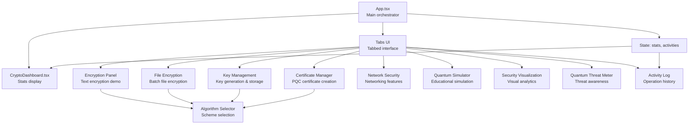
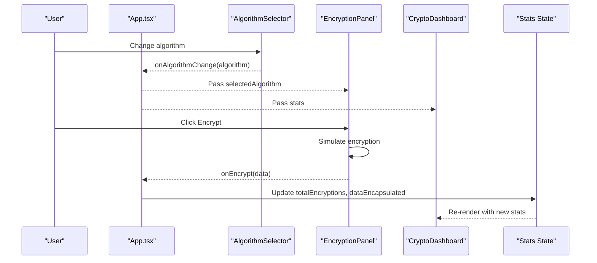
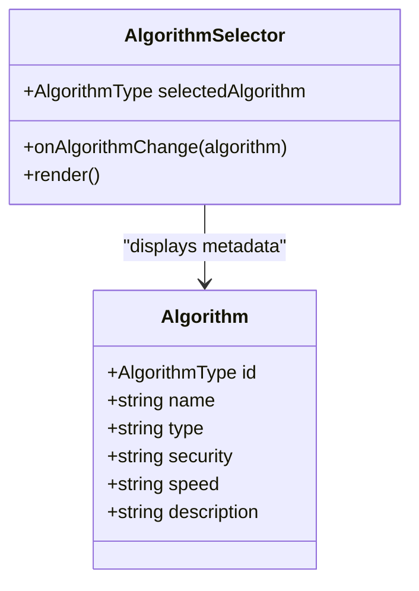
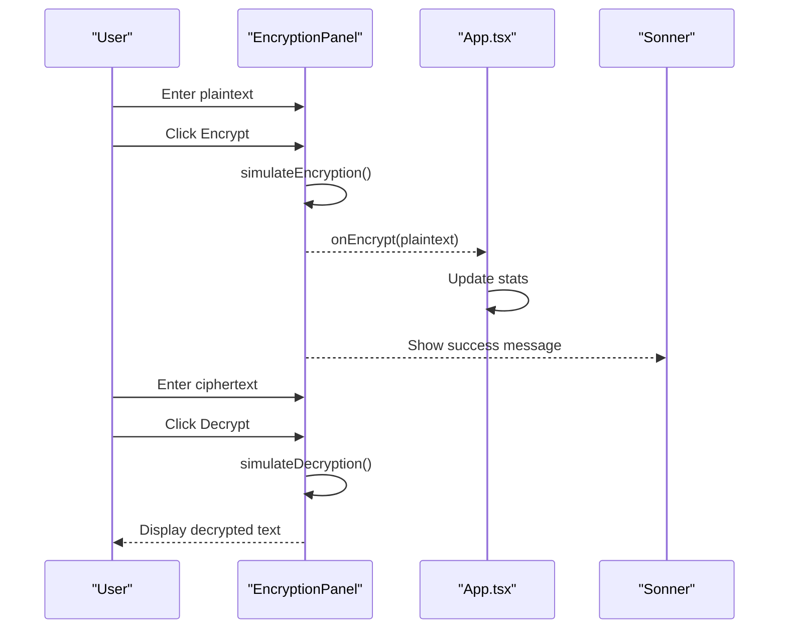
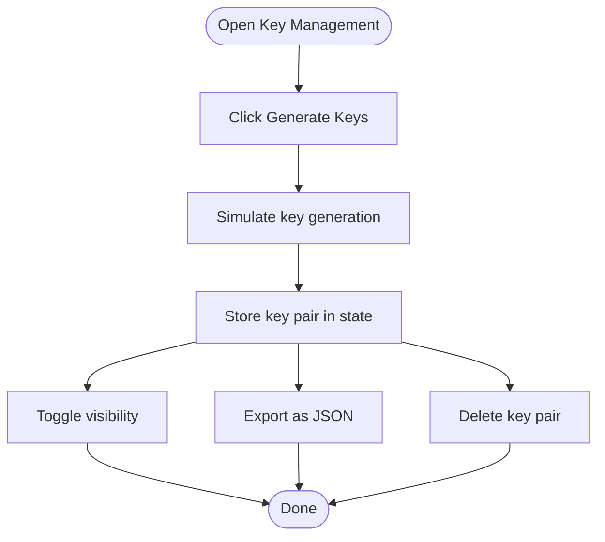
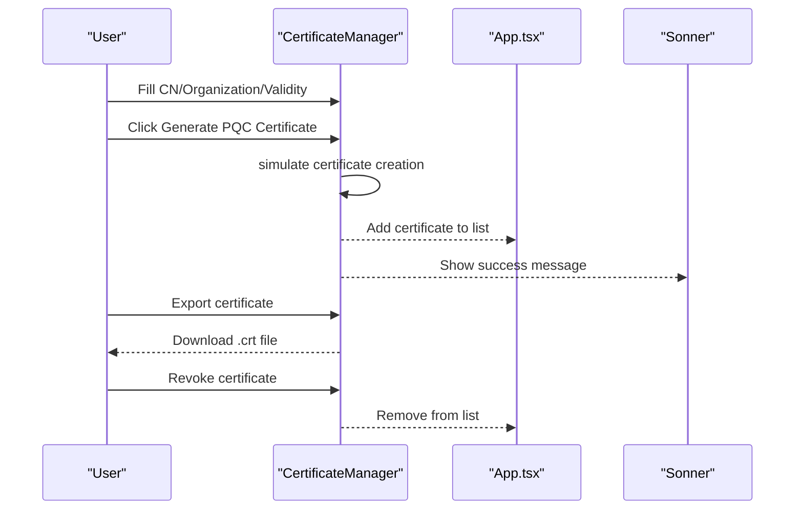
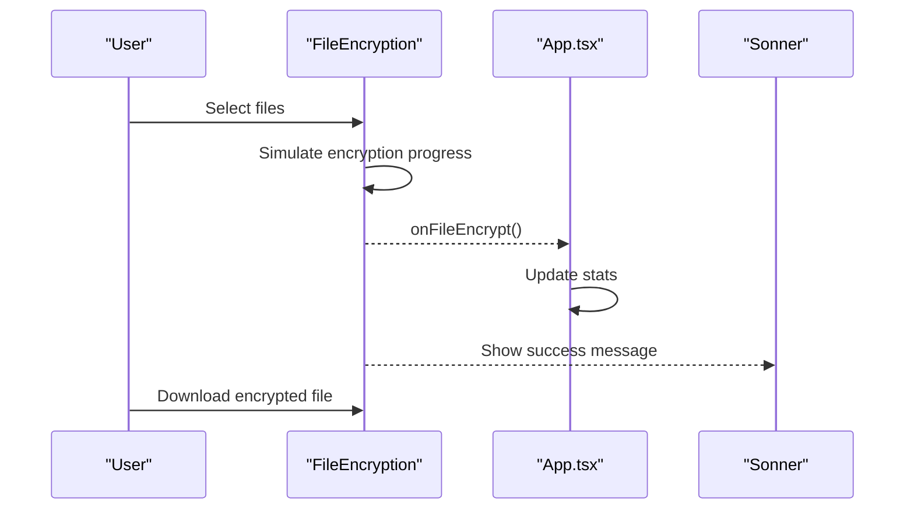
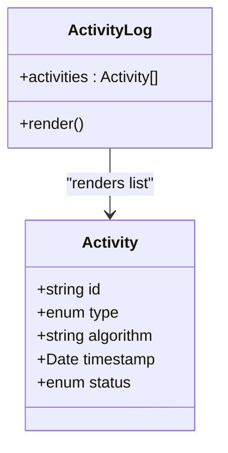
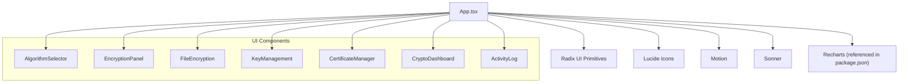

# Core Features

<cite>
**Referenced Files in This Document**
- [App.tsx](file://Design/src/app/App.tsx)
- [algorithm-selector.tsx](file://Design/src/app/components/algorithm-selector.tsx)
- [encryption-panel.tsx](file://Design/src/app/components/encryption-panel.tsx)
- [file-encryption.tsx](file://Design/src/app/components/file-encryption.tsx)
- [key-management.tsx](file://Design/src/app/components/key-management.tsx)
- [certificate-manager.tsx](file://Design/src/app/components/certificate-manager.tsx)
- [crypto-dashboard.tsx](file://Design/src/app/components/crypto-dashboard.tsx)
- [activity-log.tsx](file://Design/src/app/components/activity-log.tsx)
- [package.json](file://Design/package.json)
</cite>

## Table of Contents
1. [Introduction](#introduction)
2. [Project Structure](#project-structure)
3. [Core Components](#core-components)
4. [Architecture Overview](#architecture-overview)
5. [Detailed Component Analysis](#detailed-component-analysis)
6. [Dependency Analysis](#dependency-analysis)
7. [Performance Considerations](#performance-considerations)
8. [Troubleshooting Guide](#troubleshooting-guide)
9. [Conclusion](#conclusion)

## Introduction
This document describes the core features of the Post-Quantum Cryptography Educational Platform. The platform provides an interactive learning environment for understanding and experimenting with post-quantum cryptographic (PQC) algorithms. It focuses on four primary capabilities:
- Algorithm selection enabling switching between multiple PQC schemes
- Interactive encryption panel for real-time text encryption/decryption demonstrations
- Key management system for generating, storing, and exporting key pairs
- Certificate management for creating and managing quantum-resistant X.509-like certificates
- Crypto dashboard for real-time statistics and performance metrics

These features are designed to be pedagogically valuable, allowing learners to explore PQC concepts through hands-on experimentation while maintaining a clean, modern UI.

## Project Structure
The application is a React-based single-page application structured around reusable UI components organized by feature. The main application orchestrates state and integrates the core components into a tabbed interface.



**Diagram sources**
- [App.tsx](file://Design/src/app/App.tsx#L26-L362)
- [crypto-dashboard.tsx](file://Design/src/app/components/crypto-dashboard.tsx#L13-L70)
- [algorithm-selector.tsx](file://Design/src/app/components/algorithm-selector.tsx#L73-L121)

**Section sources**
- [App.tsx](file://Design/src/app/App.tsx#L26-L362)
- [package.json](file://Design/package.json#L1-L93)

## Core Components
This section outlines the primary functional components and their roles within the platform.

- Algorithm Selector: Provides a dropdown to choose among six post-quantum schemes (CRYSTALS-Kyber, CRYSTALS-Dilithium, SPHINCS+, NTRU, SABER, FrodoKEM). It displays metadata such as security level, speed, and type, and propagates the selection upward to parent components.
- Encryption Panel: Enables real-time text encryption/decryption demonstrations. It simulates PQC operations, shows progress, and allows copying or downloading results.
- Key Management: Generates, stores, and exports quantum-resistant key pairs. Supports visibility toggling, truncation, and JSON export.
- Certificate Manager: Creates and manages X.509-like certificates with algorithm assignment, validity periods, and export functionality.
- Crypto Dashboard: Presents live statistics including total encryptions, active keys, data encapsulated, and security level.
- File Encryption: Handles batch file encryption with progress indicators and simulated completion.
- Activity Log: Tracks recent cryptographic operations with timestamps and statuses.

**Section sources**
- [algorithm-selector.tsx](file://Design/src/app/components/algorithm-selector.tsx#L6-L121)
- [encryption-panel.tsx](file://Design/src/app/components/encryption-panel.tsx#L10-L238)
- [key-management.tsx](file://Design/src/app/components/key-management.tsx#L18-L221)
- [certificate-manager.tsx](file://Design/src/app/components/certificate-manager.tsx#L23-L295)
- [crypto-dashboard.tsx](file://Design/src/app/components/crypto-dashboard.tsx#L13-L70)
- [file-encryption.tsx](file://Design/src/app/components/file-encryption.tsx#L24-L229)
- [activity-log.tsx](file://Design/src/app/components/activity-log.tsx#L40-L117)

## Architecture Overview
The application follows a unidirectional data flow:
- App.tsx maintains global state for selected algorithm, statistics, and activity logs.
- AlgorithmSelector updates the selected algorithm, which is propagated to EncryptionPanel, FileEncryption, KeyManagement, and CertificateManager.
- EncryptionPanel and FileEncryption update statistics and emit events to App.tsx.
- KeyManagement and CertificateManager maintain local state for their respective collections.
- CryptoDashboard receives aggregated stats and renders real-time metrics.
- ActivityLog displays recent operations.



**Diagram sources**
- [App.tsx](file://Design/src/app/App.tsx#L26-L91)
- [algorithm-selector.tsx](file://Design/src/app/components/algorithm-selector.tsx#L73-L121)
- [encryption-panel.tsx](file://Design/src/app/components/encryption-panel.tsx#L45-L78)
- [crypto-dashboard.tsx](file://Design/src/app/components/crypto-dashboard.tsx#L13-L70)

## Detailed Component Analysis

### Algorithm Selection System
The Algorithm Selector component centralizes scheme selection and metadata display. It defines a type for supported algorithms and a static catalog of schemes with attributes such as security level, speed, and description. Users can choose a scheme, and the parent component receives the selection to drive downstream operations.



**Diagram sources**
- [algorithm-selector.tsx](file://Design/src/app/components/algorithm-selector.tsx#L6-L121)

Practical example:
- Switch from CRYSTALS-Kyber to SPHINCS+ to observe differences in speed and security level reflected in the UI and downstream components.

User workflow:
- Open the Encrypt tab
- Use the Algorithm Selector dropdown to pick a scheme
- Proceed to the Encryption Panel to demonstrate encryption/decryption with the chosen algorithm

Educational value:
- Learners compare trade-offs between schemes (e.g., speed vs. security level) and understand NIST categorization

Integration pattern:
- AlgorithmSelector props propagate the selected algorithm to EncryptionPanel, FileEncryption, KeyManagement, and CertificateManager

**Section sources**
- [algorithm-selector.tsx](file://Design/src/app/components/algorithm-selector.tsx#L6-L121)
- [App.tsx](file://Design/src/app/App.tsx#L250-L290)

### Interactive Encryption Panel
The Encryption Panel provides a real-time demonstration of text encryption and decryption using the selected PQC algorithm. It simulates processing, shows progress, and offers actions such as copy to clipboard and download.



**Diagram sources**
- [encryption-panel.tsx](file://Design/src/app/components/encryption-panel.tsx#L45-L78)
- [App.tsx](file://Design/src/app/App.tsx#L47-L54)

Practical example:
- Type a message, click Encrypt, then Decrypt to verify round-trip correctness
- Copy the ciphertext or download it for later use

User workflow:
- Select an algorithm
- Enter plaintext in the left pane
- Click Encrypt to produce ciphertext
- Optionally copy or download the ciphertext
- Paste ciphertext into the right pane and click Decrypt

Educational value:
- Demonstrates the concept of public-key encapsulation and decapsulation in a simplified form
- Highlights the importance of algorithm choice and data handling

Integration pattern:
- Receives selectedAlgorithm from parent and invokes onEncrypt callback to update global stats

**Section sources**
- [encryption-panel.tsx](file://Design/src/app/components/encryption-panel.tsx#L10-L238)
- [App.tsx](file://Design/src/app/App.tsx#L47-L54)

### Key Management System
The Key Management component generates, stores, and exports quantum-resistant key pairs. It simulates key generation, supports visibility toggling, and exports keys as JSON files.



**Diagram sources**
- [key-management.tsx](file://Design/src/app/components/key-management.tsx#L32-L89)

Practical example:
- Generate a key pair with CRYSTALS-Kyber
- Toggle visibility to inspect public/private keys
- Export the key pair for offline storage

User workflow:
- Select an algorithm
- Click Generate Keys
- Review generated keys (public/private)
- Toggle visibility to reveal full keys
- Export keys to a JSON file
- Delete keys when no longer needed

Educational value:
- Teaches key lifecycle management, confidentiality, and secure storage practices
- Demonstrates the relationship between public and private keys in asymmetric cryptography

Integration pattern:
- Receives selectedAlgorithm and uses it to label generated keys

**Section sources**
- [key-management.tsx](file://Design/src/app/components/key-management.tsx#L18-L221)
- [App.tsx](file://Design/src/app/App.tsx#L274-L281)

### Certificate Management
The Certificate Manager creates and manages X.509-like certificates with algorithm assignment, validity periods, and export functionality. It simulates certificate generation and tracks status (valid/expiring/expired).



**Diagram sources**
- [certificate-manager.tsx](file://Design/src/app/components/certificate-manager.tsx#L51-L111)
- [App.tsx](file://Design/src/app/App.tsx#L283-L290)

Practical example:
- Create a certificate for example.com with a 365-day validity period
- Export the certificate for distribution
- Observe status changes as expiration approaches

User workflow:
- Select an algorithm
- Fill in certificate details (CN, Organization, Validity)
- Generate certificate
- Export or revoke as needed

Educational value:
- Explains certificate lifecycle, validity periods, and algorithm tagging
- Reinforces the concept of issuing quantum-resistant credentials

Integration pattern:
- Receives selectedAlgorithm and applies it to generated certificates

**Section sources**
- [certificate-manager.tsx](file://Design/src/app/components/certificate-manager.tsx#L23-L295)
- [App.tsx](file://Design/src/app/App.tsx#L283-L290)

### Crypto Dashboard
The Crypto Dashboard displays real-time statistics derived from user actions. It shows total encryptions, active keys, data encapsulated, and security level.

```mermaid
classDiagram
class CryptoDashboard {
+stats : {
totalEncryptions : number
activeKeys : number
dataEncapsulated : string
securityLevel : number
}
+render()
}
```

**Diagram sources**
- [crypto-dashboard.tsx](file://Design/src/app/components/crypto-dashboard.tsx#L13-L70)

Practical example:
- Perform several encryption operations and observe the counters increase
- Generate key pairs and see active keys increment

User workflow:
- Monitor dashboard during experiments
- Track usage trends and security metrics

Educational value:
- Provides immediate feedback on platform usage
- Reinforces the impact of cryptographic operations

Integration pattern:
- Receives stats from App.tsx and renders live metrics

**Section sources**
- [crypto-dashboard.tsx](file://Design/src/app/components/crypto-dashboard.tsx#L13-L70)
- [App.tsx](file://Design/src/app/App.tsx#L29-L34)

### File Encryption
The File Encryption component demonstrates batch file encryption with progress indicators and simulated completion. It triggers global stats updates upon successful encryption.



**Diagram sources**
- [file-encryption.tsx](file://Design/src/app/components/file-encryption.tsx#L43-L105)
- [App.tsx](file://Design/src/app/App.tsx#L56-L63)

Practical example:
- Select multiple files and observe progress bars
- Download encrypted files for secure storage

User workflow:
- Select files to encrypt
- Wait for progress completion
- Download encrypted files

Educational value:
- Demonstrates scalability and batch processing in PQC contexts
- Highlights the importance of file size and performance considerations

Integration pattern:
- Receives selectedAlgorithm and invokes onFileEncrypt callback to update stats

**Section sources**
- [file-encryption.tsx](file://Design/src/app/components/file-encryption.tsx#L24-L229)
- [App.tsx](file://Design/src/app/App.tsx#L56-L63)

### Activity Log
The Activity Log component displays recent cryptographic operations with timestamps and statuses. It helps users track their actions and verify operation outcomes.



**Diagram sources**
- [activity-log.tsx](file://Design/src/app/components/activity-log.tsx#L40-L117)

Practical example:
- Perform encryption, decryption, and key generation
- Review the log to confirm timestamps and statuses

User workflow:
- Navigate to the Activity tab
- Review recent operations
- Use timestamps to correlate with dashboard metrics

Educational value:
- Builds operational awareness and audit-like tracking
- Reinforces cause-effect relationships between actions and stats

Integration pattern:
- Receives activities from App.tsx and renders a scrollable list

**Section sources**
- [activity-log.tsx](file://Design/src/app/components/activity-log.tsx#L40-L117)
- [App.tsx](file://Design/src/app/App.tsx#L26-L91)

## Dependency Analysis
The application relies on a set of UI primitives and animation libraries. The core UI components are built using Radix UI primitives and Lucide icons, with animations powered by Motion and notifications via Sonner.



**Diagram sources**
- [package.json](file://Design/package.json#L10-L68)
- [App.tsx](file://Design/src/app/App.tsx#L1-L16)

**Section sources**
- [package.json](file://Design/package.json#L10-L68)
- [App.tsx](file://Design/src/app/App.tsx#L1-L16)

## Performance Considerations
- Simulated operations: Encryption/decryption and key generation use timeouts to mimic processing delays. These can be tuned for responsiveness versus realism.
- Rendering: Animations and transitions are used extensively. On lower-end devices, consider reducing animation complexity or disabling animations for smoother UX.
- State updates: Frequent stats updates occur on user actions. Batch updates or throttling could reduce re-renders if needed.
- File handling: Large file uploads are simulated; actual implementations would require streaming and chunked processing.

## Troubleshooting Guide
Common issues and resolutions:
- No key pairs displayed: Ensure Generate Keys completes successfully; check browser permissions for downloads.
- Certificate export fails: Verify the browser allows downloads and that the file is not blocked by security policies.
- Encryption/decryption errors: Confirm input fields are not empty; ensure the selected algorithm is compatible with the operation.
- Activity log empty: Perform cryptographic operations to populate the log; recent activity is limited to a fixed window.

**Section sources**
- [key-management.tsx](file://Design/src/app/components/key-management.tsx#L51-L59)
- [certificate-manager.tsx](file://Design/src/app/components/certificate-manager.tsx#L82-L111)
- [encryption-panel.tsx](file://Design/src/app/components/encryption-panel.tsx#L45-L78)
- [activity-log.tsx](file://Design/src/app/components/activity-log.tsx#L65-L70)

## Conclusion
The Post-Quantum Cryptography Educational Platform provides a comprehensive, interactive environment for learning PQC concepts. Through the Algorithm Selector, Encryption Panel, Key Management, Certificate Manager, Crypto Dashboard, File Encryption, and Activity Log, learners can experiment with quantum-resistant schemes, understand key lifecycle management, and observe real-time metrics. The modular architecture ensures clear separation of concerns, while the UI emphasizes usability and educational clarity.