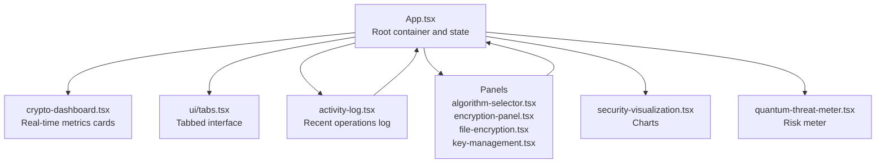
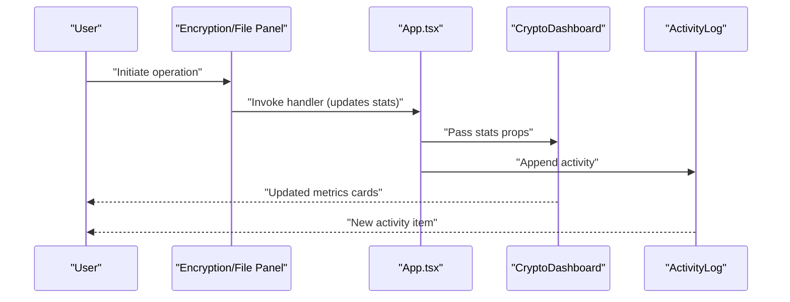
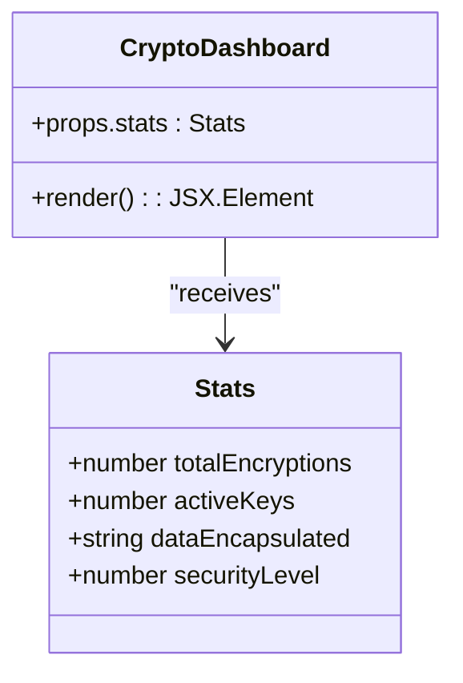
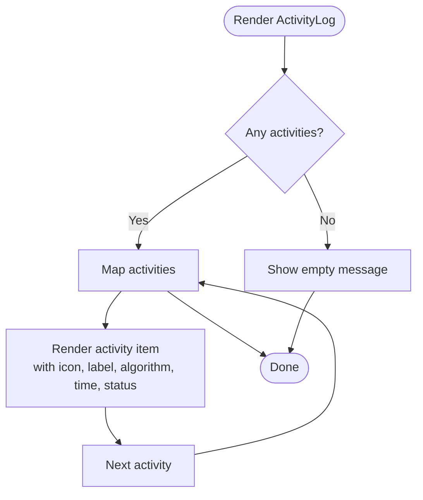
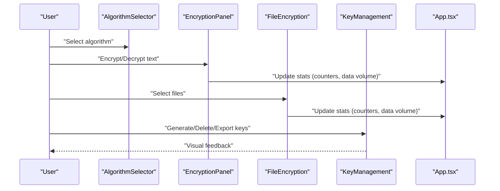
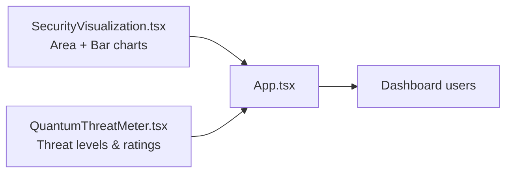
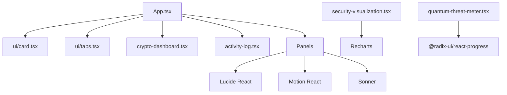

# Cryptographic Dashboard

<cite>
**Referenced Files in This Document**
- [App.tsx](file://src/app/App.tsx)
- [crypto-dashboard.tsx](file://src/app/components/crypto-dashboard.tsx)
- [activity-log.tsx](file://src/app/components/activity-log.tsx)
- [algorithm-selector.tsx](file://src/app/components/algorithm-selector.tsx)
- [encryption-panel.tsx](file://src/app/components/encryption-panel.tsx)
- [file-encryption.tsx](file://src/app/components/file-encryption.tsx)
- [key-management.tsx](file://src/app/components/key-management.tsx)
- [security-visualization.tsx](file://src/app/components/security-visualization.tsx)
- [quantum-threat-meter.tsx](file://src/app/components/quantum-threat-meter.tsx)
- [card.tsx](file://src/app/components/ui/card.tsx)
- [tabs.tsx](file://src/app/components/ui/tabs.tsx)
- [README.md](file://README.md)
- [package.json](file://package.json)
</cite>

## Table of Contents
1. [Introduction](#introduction)
2. [Project Structure](#project-structure)
3. [Core Components](#core-components)
4. [Architecture Overview](#architecture-overview)
5. [Detailed Component Analysis](#detailed-component-analysis)
6. [Dependency Analysis](#dependency-analysis)
7. [Performance Considerations](#performance-considerations)
8. [Troubleshooting Guide](#troubleshooting-guide)
9. [Conclusion](#conclusion)
10. [Appendices](#appendices)

## Introduction
This document describes the Cryptographic Dashboard for a Post-Quantum Cryptography (PQC) suite. It focuses on the real-time statistics display and performance metrics system, explaining the dashboard layout, metric types, data aggregation mechanisms, update frequencies, and integration with the activity logging system. It also highlights the educational value of real-time performance monitoring and provides practical usage examples and metric interpretation guidance.

## Project Structure
The dashboard is part of a React application that integrates cryptographic operation panels, analytics, and threat assessment tools. The App orchestrates state for dashboard metrics and recent activities, while dedicated components render cards, charts, and logs.

**Diagram sources**
- [App.tsx](file://src/app/App.tsx#L26-L91)
- [crypto-dashboard.tsx](file://src/app/components/crypto-dashboard.tsx#L13-L69)
- [activity-log.tsx](file://src/app/components/activity-log.tsx#L40-L116)
- [algorithm-selector.tsx](file://src/app/components/algorithm-selector.tsx#L73-L120)
- [encryption-panel.tsx](file://src/app/components/encryption-panel.tsx#L15-L237)
- [file-encryption.tsx](file://src/app/components/file-encryption.tsx#L24-L228)
- [key-management.tsx](file://src/app/components/key-management.tsx#L22-L220)
- [security-visualization.tsx](file://src/app/components/security-visualization.tsx#L24-L106)
- [quantum-threat-meter.tsx](file://src/app/components/quantum-threat-meter.tsx#L40-L148)
- [tabs.tsx](file://src/app/components/ui/tabs.tsx#L8-L66)

**Section sources**
- [App.tsx](file://src/app/App.tsx#L26-L91)
- [README.md](file://README.md#L1-L11)

## Core Components
The dashboard comprises:
- Real-time metrics cards: Total Encryptions, Active Keys, Data Encapsulated, Security Level
- Recent Activity Log: Timestamped cryptographic operations with status
- Algorithm selector and operation panels: Encryption, file encryption, key management
- Analytics and threat meter: Security strength over time and algorithm comparisons
- UI primitives: Cards and Tabs used across components

Key responsibilities:
- Metrics aggregation: Increment counters and update totals upon operations
- Activity logging: Append new events with timestamps and statuses
- Visualization: Render charts and meters for comparative and temporal insights

**Section sources**
- [crypto-dashboard.tsx](file://src/app/components/crypto-dashboard.tsx#L4-L11)
- [App.tsx](file://src/app/App.tsx#L29-L34)
- [activity-log.tsx](file://src/app/components/activity-log.tsx#L7-L17)
- [security-visualization.tsx](file://src/app/components/security-visualization.tsx#L24-L106)
- [quantum-threat-meter.tsx](file://src/app/components/quantum-threat-meter.tsx#L40-L148)

## Architecture Overview
The App component holds global state for:
- stats: totalEncryptions, activeKeys, dataEncapsulated, securityLevel
- activities: recent cryptographic operations

Each operation panel updates stats and appends an activity. The dashboard renders live stats, while the activity log displays recent entries. Charts visualize algorithm performance and security trends.

**Diagram sources**
- [App.tsx](file://src/app/App.tsx#L36-L63)
- [crypto-dashboard.tsx](file://src/app/components/crypto-dashboard.tsx#L13-L69)
- [activity-log.tsx](file://src/app/components/activity-log.tsx#L40-L116)
- [encryption-panel.tsx](file://src/app/components/encryption-panel.tsx#L45-L78)
- [file-encryption.tsx](file://src/app/components/file-encryption.tsx#L69-L87)

## Detailed Component Analysis

### Crypto Dashboard
Renders four live metrics cards:
- Total Encryptions: numeric counter
- Active Keys: count of quantum-resistant key pairs
- Data Encapsulated: aggregated volume processed
- Security Level: percentage readiness indicator

**Diagram sources**
- [crypto-dashboard.tsx](file://src/app/components/crypto-dashboard.tsx#L4-L11)
- [crypto-dashboard.tsx](file://src/app/components/crypto-dashboard.tsx#L13-L69)

**Section sources**
- [crypto-dashboard.tsx](file://src/app/components/crypto-dashboard.tsx#L13-L69)

### Activity Log
Displays recent cryptographic operations with:
- Type badges (encryption, decryption, keygen, verify)
- Algorithm metadata
- Relative timestamps ("seconds/minutes/hours ago")
- Status indicators (success/failed)

**Diagram sources**
- [activity-log.tsx](file://src/app/components/activity-log.tsx#L40-L116)

**Section sources**
- [activity-log.tsx](file://src/app/components/activity-log.tsx#L40-L116)

### Algorithm Selector and Operation Panels
- AlgorithmSelector: Chooses among PQC algorithms and shows metadata (security level, speed, type)
- EncryptionPanel: Text-based encryption/decryption with simulated processing
- FileEncryption: Batch file encryption with progress bars and simulated throughput
- KeyManagement: Generates, displays, exports, and deletes quantum-resistant key pairs

**Diagram sources**
- [algorithm-selector.tsx](file://src/app/components/algorithm-selector.tsx#L73-L120)
- [encryption-panel.tsx](file://src/app/components/encryption-panel.tsx#L45-L78)
- [file-encryption.tsx](file://src/app/components/file-encryption.tsx#L69-L87)
- [key-management.tsx](file://src/app/components/key-management.tsx#L32-L49)
- [App.tsx](file://src/app/App.tsx#L47-L63)

**Section sources**
- [algorithm-selector.tsx](file://src/app/components/algorithm-selector.tsx#L73-L120)
- [encryption-panel.tsx](file://src/app/components/encryption-panel.tsx#L15-L237)
- [file-encryption.tsx](file://src/app/components/file-encryption.tsx#L24-L228)
- [key-management.tsx](file://src/app/components/key-management.tsx#L22-L220)

### Analytics and Threat Meter
- SecurityVisualization: Area chart of classical vs post-quantum security strength over time; bar chart of algorithm performance comparison
- QuantumThreatMeter: Threat levels for post-quantum protection and classical cryptography risk

**Diagram sources**
- [security-visualization.tsx](file://src/app/components/security-visualization.tsx#L24-L106)
- [quantum-threat-meter.tsx](file://src/app/components/quantum-threat-meter.tsx#L40-L148)
- [App.tsx](file://src/app/App.tsx#L26-L34)

**Section sources**
- [security-visualization.tsx](file://src/app/components/security-visualization.tsx#L24-L106)
- [quantum-threat-meter.tsx](file://src/app/components/quantum-threat-meter.tsx#L40-L148)

## Dependency Analysis
External libraries and their roles:
- UI primitives: Radix UI (Tabs), custom Card components
- Icons: Lucide React
- Animations: Motion React
- Notifications: Sonner
- Charts: Recharts
- 3D/animation assets: Three.js, Drei, Vaul

**Diagram sources**
- [App.tsx](file://src/app/App.tsx#L1-L16)
- [card.tsx](file://src/app/components/ui/card.tsx#L5-L92)
- [tabs.tsx](file://src/app/components/ui/tabs.tsx#L8-L66)
- [crypto-dashboard.tsx](file://src/app/components/crypto-dashboard.tsx#L1-L2)
- [activity-log.tsx](file://src/app/components/activity-log.tsx#L1-L5)
- [security-visualization.tsx](file://src/app/components/security-visualization.tsx#L1-L3)
- [quantum-threat-meter.tsx](file://src/app/components/quantum-threat-meter.tsx#L1-L4)
- [package.json](file://package.json#L10-L68)

**Section sources**
- [package.json](file://package.json#L10-L68)
- [card.tsx](file://src/app/components/ui/card.tsx#L5-L92)
- [tabs.tsx](file://src/app/components/ui/tabs.tsx#L8-L66)

## Performance Considerations
- Real-time updates: Stats counters and activity log are updated synchronously in response to user actions. There is no periodic polling; updates occur immediately after operations.
- Rendering efficiency: Activity items use animated transitions; keep the activity list capped to avoid excessive DOM nodes.
- Chart rendering: Recharts components are responsive; ensure datasets remain small for smooth rendering.
- Simulated workloads: Panels introduce artificial delays to mimic processing time; adjust timeouts for realistic benchmarking scenarios.

[No sources needed since this section provides general guidance]

## Troubleshooting Guide
Common issues and resolutions:
- Empty activity log: Initial activities are populated on mount; ensure the App component initializes activities.
- Stats not updating: Verify handlers for encryption and file encryption are invoked and that stats are updated before appending activities.
- Large activity lists: The App limits recent activities to a fixed size; confirm the limit is appropriate for your use case.
- Algorithm selection: Ensure the selected algorithm is valid and supported by downstream panels.

**Section sources**
- [App.tsx](file://src/app/App.tsx#L65-L91)
- [App.tsx](file://src/app/App.tsx#L36-L63)
- [App.tsx](file://src/app/App.tsx#L44-L44)

## Conclusion
The Cryptographic Dashboard provides a concise, real-time view of PQC operations through four key metrics and a recent activity log. Its integration with algorithm panels, analytics, and threat assessments enables users to monitor performance, track operational history, and understand security posture. The educational value lies in observing how different PQC algorithms compare across speed and security while gaining insight into quantum threat mitigation.

[No sources needed since this section summarizes without analyzing specific files]

## Appendices

### Dashboard Layout and Metric Types
- Layout: Four metric cards arranged in a responsive grid
- Metrics:
  - Total Encryptions: cumulative count of encryption operations
  - Active Keys: count of generated key pairs
  - Data Encapsulated: total processed data volume
  - Security Level: readiness percentage indicator

**Section sources**
- [crypto-dashboard.tsx](file://src/app/components/crypto-dashboard.tsx#L15-L66)

### Data Aggregation Mechanisms and Update Frequencies
- Aggregation:
  - Counters incremented on each successful operation
  - Data volume aggregated per operation
- Update frequency:
  - Immediate updates on user action completion
  - No periodic refresh; state changes trigger re-renders

**Section sources**
- [App.tsx](file://src/app/App.tsx#L47-L63)
- [encryption-panel.tsx](file://src/app/components/encryption-panel.tsx#L45-L61)
- [file-encryption.tsx](file://src/app/components/file-encryption.tsx#L56-L83)

### Practical Examples and Metric Interpretation
- Example 1: After encrypting a text message, observe an increase in Total Encryptions and a corresponding increment in Data Encapsulated.
- Example 2: After generating a key pair, see Active Keys increase; verify the algorithm type in the Key Management panel.
- Example 3: Use the Analytics tab to compare algorithm performance and security levels; interpret charts to choose suitable algorithms for workload characteristics.
- Example 4: Review the Activity Log to confirm operation types, timestamps, and statuses for audit and debugging.

**Section sources**
- [App.tsx](file://src/app/App.tsx#L47-L63)
- [activity-log.tsx](file://src/app/components/activity-log.tsx#L40-L116)
- [security-visualization.tsx](file://src/app/components/security-visualization.tsx#L24-L106)

### Integration with Activity Logging System
- Each operation dispatches an activity with type, algorithm, timestamp, and status.
- The log maintains a bounded list of recent items and formats relative timestamps for readability.

**Section sources**
- [App.tsx](file://src/app/App.tsx#L36-L45)
- [activity-log.tsx](file://src/app/components/activity-log.tsx#L40-L116)