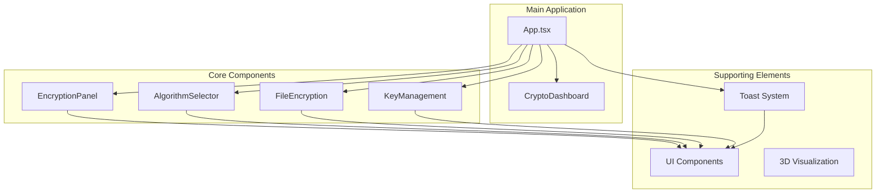
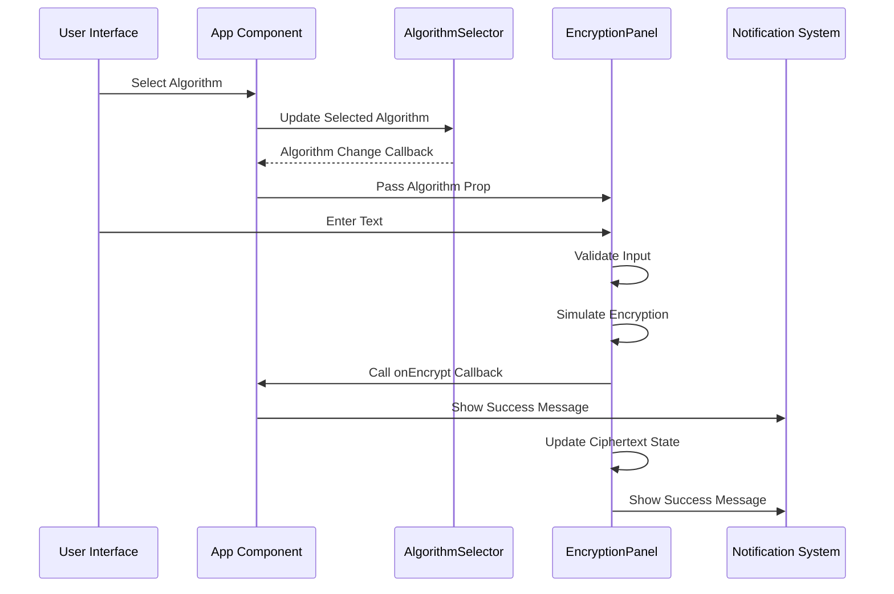
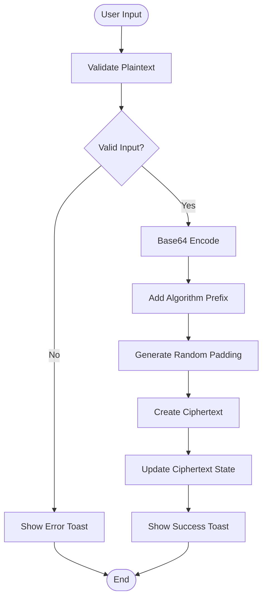
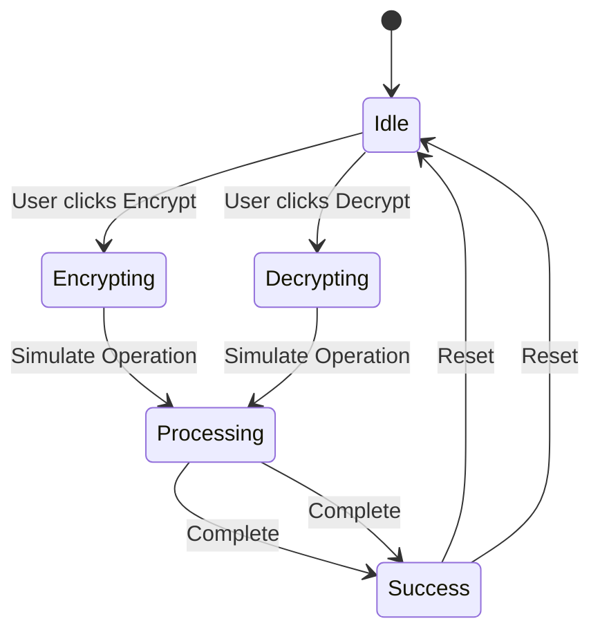

# Encryption Panel

<cite>
**Referenced Files in This Document**
- [encryption-panel.tsx](file://Design/src/app/components/encryption-panel.tsx)
- [algorithm-selector.tsx](file://Design/src/app/components/algorithm-selector.tsx)
- [App.tsx](file://Design/src/app/App.tsx)
- [crypto-dashboard.tsx](file://Design/src/app/components/crypto-dashboard.tsx)
- [file-encryption.tsx](file://Design/src/app/components/file-encryption.tsx)
- [key-management.tsx](file://Design/src/app/components/key-management.tsx)
- [sonner.tsx](file://Design/src/app/components/ui/sonner.tsx)
</cite>

## Table of Contents
1. [Introduction](#introduction)
2. [Project Structure](#project-structure)
3. [Core Components](#core-components)
4. [Architecture Overview](#architecture-overview)
5. [Detailed Component Analysis](#detailed-component-analysis)
6. [Algorithm Integration](#algorithm-integration)
7. [Real-time Simulation Features](#real-time-simulation-features)
8. [Visual Feedback Mechanisms](#visual-feedback-mechanisms)
9. [Performance Metrics](#performance-metrics)
10. [Educational Value](#educational-value)
11. [Practical Examples](#practical-examples)
12. [Edge Cases and Error Handling](#edge-cases-and-error-handling)
13. [Troubleshooting Guide](#troubleshooting-guide)
14. [Conclusion](#conclusion)

## Introduction

The Encryption Panel is a comprehensive interactive demonstration system designed to showcase post-quantum cryptographic techniques in an educational and visually engaging manner. This system simulates real-time text encryption and decryption processes, providing users with immediate visual feedback while maintaining the educational integrity of quantum-resistant cryptographic concepts.

The panel serves as a central hub for understanding how post-quantum algorithms work, with special emphasis on lattice-based cryptography, hash-based signatures, and code-based encryption schemes that are resistant to quantum computer attacks. Through intuitive interfaces and realistic simulations, users can explore the transformation of plaintext into quantum-resistant ciphertext and vice versa.

## Project Structure

The Encryption Panel is part of a larger Post-Quantum Cryptography Suite that encompasses multiple specialized components for different aspects of quantum-resistant security. The system follows a modular architecture where each component handles specific cryptographic functions while maintaining cohesive integration.



**Diagram sources**
- [App.tsx](file://Design/src/app/App.tsx#L26-L362)
- [encryption-panel.tsx](file://Design/src/app/components/encryption-panel.tsx#L1-L238)
- [algorithm-selector.tsx](file://Design/src/app/components/algorithm-selector.tsx#L1-L121)

**Section sources**
- [App.tsx](file://Design/src/app/App.tsx#L26-L362)
- [README.md](file://Design/README.md#L1-L11)

## Core Components

The Encryption Panel system consists of several interconnected components that work together to provide a comprehensive cryptographic demonstration experience:

### EncryptionPanel Component
The central component responsible for text-based encryption and decryption operations. It manages state for both plaintext and ciphertext, coordinates the encryption/decryption workflow, and provides real-time visual feedback through animations and notifications.

### AlgorithmSelector Component
Provides selection capabilities for different post-quantum cryptographic algorithms, displaying detailed information about each algorithm's characteristics, security level, and performance characteristics.

### Supporting Components
Additional components that complement the encryption panel by providing file encryption capabilities, key management functionality, and dashboard statistics for monitoring cryptographic operations.

**Section sources**
- [encryption-panel.tsx](file://Design/src/app/components/encryption-panel.tsx#L10-L13)
- [algorithm-selector.tsx](file://Design/src/app/components/algorithm-selector.tsx#L68-L71)

## Architecture Overview

The Encryption Panel follows a unidirectional data flow architecture where the parent component manages state and passes down algorithm selections and callbacks to child components. This design ensures predictable data flow and maintains separation of concerns between different cryptographic operations.



**Diagram sources**
- [App.tsx](file://Design/src/app/App.tsx#L252-L259)
- [encryption-panel.tsx](file://Design/src/app/components/encryption-panel.tsx#L45-L61)

The architecture emphasizes responsive user interaction with immediate feedback, simulating real cryptographic operations while maintaining educational clarity about the underlying processes.

**Section sources**
- [App.tsx](file://Design/src/app/App.tsx#L250-L260)
- [encryption-panel.tsx](file://Design/src/app/components/encryption-panel.tsx#L15-L21)

## Detailed Component Analysis

### EncryptionPanel Implementation

The EncryptionPanel component serves as the primary interface for text-based cryptographic operations, implementing sophisticated state management and user interaction patterns.

```mermaid
classDiagram
class EncryptionPanel {
+string plaintext
+string ciphertext
+boolean isEncrypting
+boolean isDecrypting
+boolean copied
+simulateEncryption(text) string
+simulateDecryption(text) string
+handleEncrypt() void
+handleDecrypt() void
+copyToClipboard(text) void
+downloadCiphertext() void
}
class AlgorithmType {
<<enumeration>>
"CRYSTALS-Kyber"
"CRYSTALS-Dilithium"
"SPHINCS+"
"NTRU"
"SABER"
"FrodoKEM"
}
class EncryptionPanelProps {
+AlgorithmType algorithm
+onEncrypt(data) void
}
EncryptionPanel --> AlgorithmType : uses
EncryptionPanel --> EncryptionPanelProps : receives
```

**Diagram sources**
- [encryption-panel.tsx](file://Design/src/app/components/encryption-panel.tsx#L10-L13)
- [algorithm-selector.tsx](file://Design/src/app/components/algorithm-selector.tsx#L6)

The component implements a comprehensive state management system with separate states for encryption and decryption operations, preventing concurrent operations and maintaining UI consistency.

**Section sources**
- [encryption-panel.tsx](file://Design/src/app/components/encryption-panel.tsx#L15-L21)

### AlgorithmSelector Integration

The AlgorithmSelector component provides dynamic algorithm selection capabilities, allowing users to experiment with different post-quantum cryptographic approaches and observe their impact on the encryption process.

```mermaid
classDiagram
class AlgorithmSelector {
+AlgorithmType selectedAlgorithm
+onAlgorithmChange(algorithm) void
+currentAlgorithm Algorithm
}
class Algorithm {
+AlgorithmType id
+string name
+string type
+string security
+string speed
+string description
}
class AlgorithmType {
<<enumeration>>
"CRYSTALS-Kyber"
"CRYSTALS-Dilithium"
"SPHINCS+"
"NTRU"
"SABER"
"FrodoKEM"
}
AlgorithmSelector --> Algorithm : displays
AlgorithmSelector --> AlgorithmType : selects
```

**Diagram sources**
- [algorithm-selector.tsx](file://Design/src/app/components/algorithm-selector.tsx#L8-L15)
- [algorithm-selector.tsx](file://Design/src/app/components/algorithm-selector.tsx#L68-L71)

**Section sources**
- [algorithm-selector.tsx](file://Design/src/app/components/algorithm-selector.tsx#L17-L66)

## Algorithm Integration

The Encryption Panel integrates seamlessly with six different post-quantum cryptographic algorithms, each representing different approaches to quantum-resistant cryptography:

### Algorithm Categories and Characteristics

| Algorithm | Type | Security Level | Speed | Description |
|-----------|------|----------------|-------|-------------|
| CRYSTALS-Kyber | KEM | NIST Level 3 | Fast | Lattice-based key encapsulation mechanism |
| CRYSTALS-Dilithium | Digital Signature | NIST Level 3 | Fast | Lattice-based digital signature scheme |
| SPHINCS+ | Digital Signature | NIST Level 5 | Moderate | Hash-based signature scheme |
| NTRU | KEM | NIST Level 1 | Very Fast | Lattice-based encryption |
| SABER | KEM | NIST Level 3 | Fast | Module lattice-based key encapsulation |
| FrodoKEM | KEM | NIST Level 5 | Slow | Conservative lattice-based KEM |

Each algorithm selection affects the encryption simulation by modifying the prefix identifier and influencing the user experience through different processing characteristics.

**Section sources**
- [algorithm-selector.tsx](file://Design/src/app/components/algorithm-selector.tsx#L17-L66)

## Real-time Simulation Features

The Encryption Panel implements sophisticated real-time simulation capabilities that mimic actual cryptographic operations while maintaining educational clarity and user engagement.

### Encryption Simulation Process

The simulation process transforms plaintext through a series of steps that demonstrate cryptographic principles:

1. **Input Validation**: Ensures non-empty plaintext before processing
2. **Base64 Encoding**: Converts plaintext to Base64 representation
3. **Algorithm Prefixing**: Adds algorithm-specific identifier
4. **Random Padding**: Appends 64-character random padding
5. **Output Generation**: Produces quantum-resistant ciphertext format



**Diagram sources**
- [encryption-panel.tsx](file://Design/src/app/components/encryption-panel.tsx#L22-L30)
- [encryption-panel.tsx](file://Design/src/app/components/encryption-panel.tsx#L45-L61)

### Decryption Simulation Process

The decryption process reverses the encryption steps, extracting the original plaintext from the simulated ciphertext:

1. **Format Validation**: Checks for proper PQC format
2. **Base64 Extraction**: Isolates encoded portion
3. **Decoding**: Converts Base64 back to original text
4. **Validation**: Handles malformed inputs gracefully

**Section sources**
- [encryption-panel.tsx](file://Design/src/app/components/encryption-panel.tsx#L32-L43)

## Visual Feedback Mechanisms

The Encryption Panel employs sophisticated visual feedback systems to enhance user understanding and engagement with cryptographic concepts.

### Animation and State Management



**Diagram sources**
- [encryption-panel.tsx](file://Design/src/app/components/encryption-panel.tsx#L18-L20)
- [encryption-panel.tsx](file://Design/src/app/components/encryption-panel.tsx#L121-L150)

### Interactive Elements

The panel provides multiple interactive elements that respond to user actions:

- **Animated Buttons**: Rotate icons during processing states
- **Loading States**: Disable buttons during operations
- **Visual Indicators**: Show processing status through animations
- **Success Feedback**: Immediate confirmation of completed operations

**Section sources**
- [encryption-panel.tsx](file://Design/src/app/components/encryption-panel.tsx#L116-L151)
- [encryption-panel.tsx](file://Design/src/app/components/encryption-panel.tsx#L188-L232)

## Performance Metrics

The system tracks and displays performance-related metrics to help users understand the computational aspects of cryptographic operations.

### Dashboard Statistics

The CryptoDashboard component monitors key performance indicators:

- **Total Encryptions**: Count of encryption operations performed
- **Active Keys**: Number of key pairs currently in use
- **Data Encapsulated**: Total amount of data processed in MB
- **Security Level**: Overall security rating percentage

### File Processing Metrics

The FileEncryption component provides detailed progress tracking:

- **Individual File Progress**: Percentage completion for each file
- **Batch Processing**: Concurrent handling of multiple files
- **Processing Time**: Real-time estimation of completion time

**Section sources**
- [crypto-dashboard.tsx](file://Design/src/app/components/crypto-dashboard.tsx#L4-L11)
- [file-encryption.tsx](file://Design/src/app/components/file-encryption.tsx#L69-L87)

## Educational Value

The Encryption Panel serves as an educational tool that makes complex cryptographic concepts accessible through hands-on experimentation and visual demonstrations.

### Learning Objectives

- **Algorithm Understanding**: Demonstrate differences between cryptographic approaches
- **Process Visualization**: Show step-by-step transformation of data
- **Security Concepts**: Illustrate quantum resistance principles
- **Performance Awareness**: Highlight trade-offs between security and speed

### Interactive Learning Experience

Users can experiment with different algorithms and observe:
- How algorithm choice affects output format
- The impact of input size on processing time
- The relationship between security level and performance
- The importance of proper key management

**Section sources**
- [App.tsx](file://Design/src/app/App.tsx#L325-L351)

## Practical Examples

### Basic Text Encryption

To demonstrate the fundamental encryption process:

1. **Select Algorithm**: Choose from available post-quantum algorithms
2. **Enter Text**: Type or paste plaintext content
3. **Initiate Encryption**: Click the Encrypt Data button
4. **Observe Results**: View transformed ciphertext with algorithm prefix
5. **Verify Decryption**: Use Decrypt Data to restore original text

### Advanced Scenarios

**Large Text Processing**: The system handles varying text sizes, with processing time proportional to input length.

**Multiple Algorithm Testing**: Users can compare different algorithms by switching selections and observing output variations.

**Integration Testing**: The panel's callback system allows integration with external applications for broader cryptographic demonstrations.

**Section sources**
- [encryption-panel.tsx](file://Design/src/app/components/encryption-panel.tsx#L45-L78)

## Edge Cases and Error Handling

The system implements comprehensive error handling to ensure robust operation under various conditions.

### Input Validation

- **Empty Input Detection**: Prevents processing of empty or whitespace-only text
- **Format Validation**: Ensures proper ciphertext format for decryption
- **Algorithm Compatibility**: Validates algorithm selection before processing

### Error Recovery

- **Graceful Degradation**: Handles malformed inputs without crashing
- **User Guidance**: Provides clear error messages through toast notifications
- **State Recovery**: Restores UI to functional state after errors

### Performance Considerations

- **Async Operations**: Non-blocking processing prevents UI freezing
- **Memory Management**: Proper cleanup of generated URLs and blobs
- **Resource Cleanup**: Automatic revocation of object URLs

**Section sources**
- [encryption-panel.tsx](file://Design/src/app/components/encryption-panel.tsx#L46-L48)
- [encryption-panel.tsx](file://Design/src/app/components/encryption-panel.tsx#L64-L66)
- [encryption-panel.tsx](file://Design/src/app/components/encryption-panel.tsx#L40-L42)

## Troubleshooting Guide

### Common Issues and Solutions

**Encryption Button Disabled**: Ensure plaintext contains non-whitespace characters before attempting encryption.

**Decryption Fails**: Verify ciphertext follows the expected PQC format with proper algorithm prefix and padding.

**Clipboard Issues**: Some browsers may require HTTPS for clipboard access; ensure secure connection.

**Performance Problems**: Large inputs may cause delays; consider breaking content into smaller chunks.

### Debugging Tips

- **Console Logging**: Check browser console for JavaScript errors
- **Network Inspection**: Monitor network requests for blob downloads
- **State Verification**: Use browser developer tools to inspect component state
- **Algorithm Testing**: Test different algorithms to isolate specific issues

**Section sources**
- [encryption-panel.tsx](file://Design/src/app/components/encryption-panel.tsx#L80-L96)
- [file-encryption.tsx](file://Design/src/app/components/file-encryption.tsx#L89-L100)

## Conclusion

The Encryption Panel represents a sophisticated educational tool that successfully bridges the gap between theoretical cryptographic concepts and practical implementation. Through its comprehensive simulation capabilities, intuitive user interface, and rich visual feedback system, it provides users with a deep understanding of post-quantum cryptographic principles.

The system's modular architecture ensures maintainability and extensibility, while its real-time simulation features create an engaging learning experience. By demonstrating the transformation of plaintext to quantum-resistant ciphertext and back again, users gain valuable insights into the practical applications of post-quantum cryptography.

The integration with multiple algorithms, comprehensive error handling, and performance monitoring capabilities positions the Encryption Panel as both an educational resource and a foundation for more advanced cryptographic demonstrations. Its success lies in making complex cryptographic concepts accessible without sacrificing educational integrity or technical accuracy.