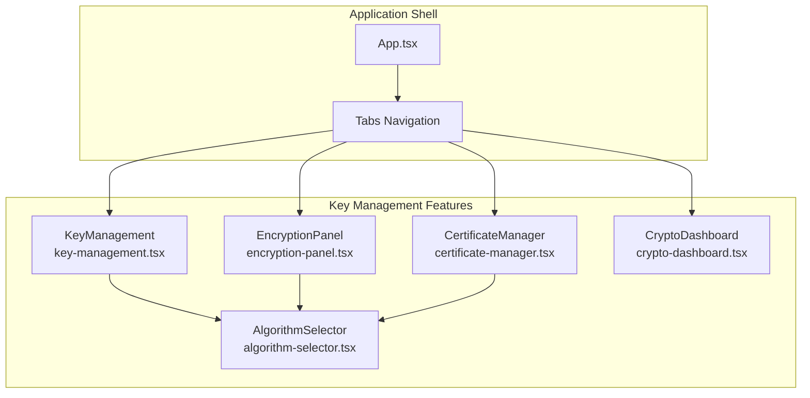
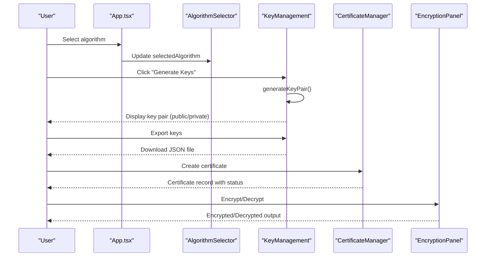
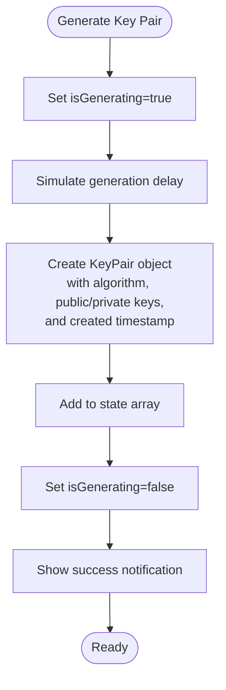
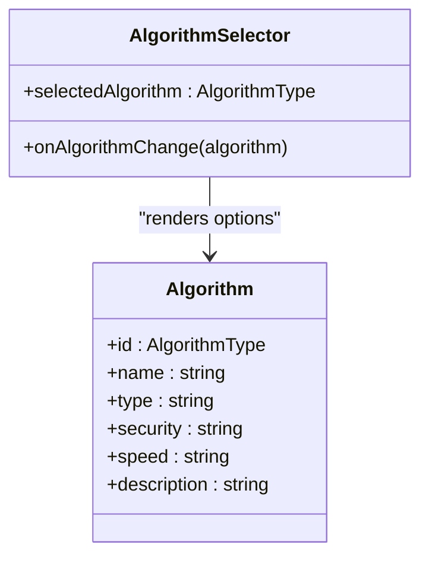
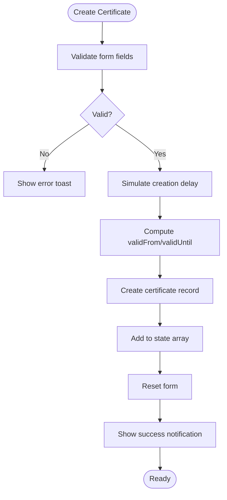
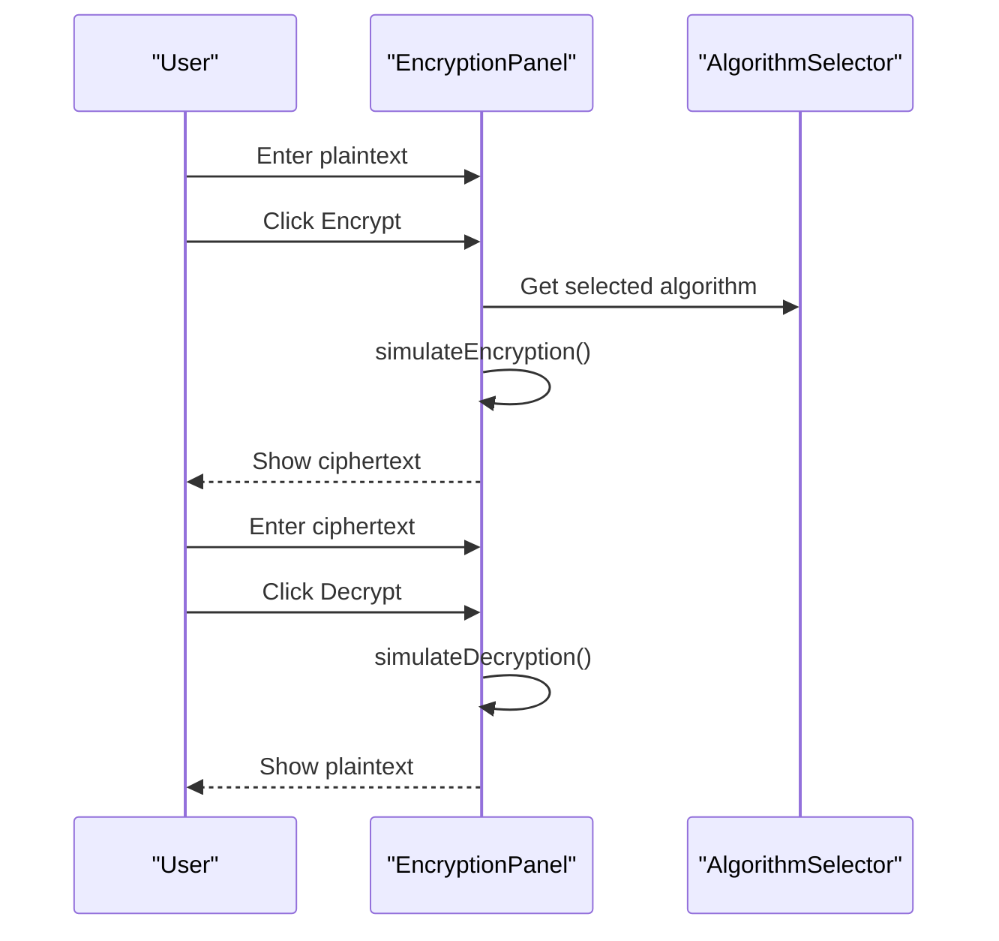
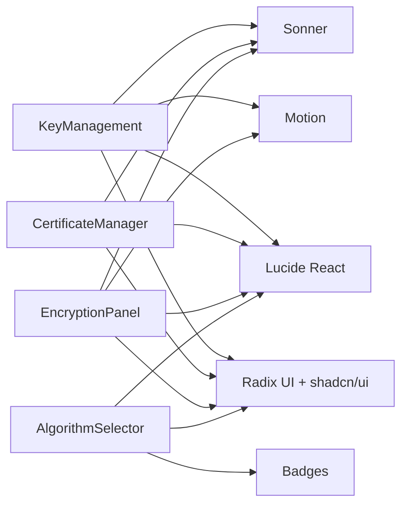

# Key Management System

<cite>
**Referenced Files in This Document**
- [README.md](file://README.md)
- [package.json](file://package.json)
- [vite.config.ts](file://vite.config.ts)
- [App.tsx](file://src/app/App.tsx)
- [key-management.tsx](file://src/app/components/key-management.tsx)
- [algorithm-selector.tsx](file://src/app/components/algorithm-selector.tsx)
- [encryption-panel.tsx](file://src/app/components/encryption-panel.tsx)
- [certificate-manager.tsx](file://src/app/components/certificate-manager.tsx)
- [crypto-dashboard.tsx](file://src/app/components/crypto-dashboard.tsx)
- [Guidelines.md](file://guidelines/Guidelines.md)
</cite>

## Table of Contents
1. [Introduction](#introduction)
2. [Project Structure](#project-structure)
3. [Core Components](#core-components)
4. [Architecture Overview](#architecture-overview)
5. [Detailed Component Analysis](#detailed-component-analysis)
6. [Dependency Analysis](#dependency-analysis)
7. [Performance Considerations](#performance-considerations)
8. [Troubleshooting Guide](#troubleshooting-guide)
9. [Conclusion](#conclusion)
10. [Appendices](#appendices)

## Introduction
This document describes the Key Management System for a Post-Quantum Cryptography (PQC) suite. The system focuses on generating, storing, and managing the lifecycle of post-quantum cryptographic keys, including public/private key pairs and certificates. It explains the key generation process, secure storage mechanisms, key rotation procedures, and lifecycle tracking. It also covers security considerations, best practices for key handling, and practical examples of key generation workflows, storage scenarios, and integration with the encryption system.

The application demonstrates NIST-approved PQC algorithms (Kyber, Dilithium, SPHINCS+, NTRU, SABER, FrodoKEM) and provides a user interface for generating and managing quantum-resistant keys and certificates.

## Project Structure
The project is a React-based frontend application built with Vite and styled with Tailwind CSS. The key management system is implemented as a dedicated component integrated into the main application shell.

**Diagram sources**
- [App.tsx](file://src/app/App.tsx#L208-L316)
- [key-management.tsx](file://src/app/components/key-management.tsx#L22-L221)
- [algorithm-selector.tsx](file://src/app/components/algorithm-selector.tsx#L73-L121)
- [encryption-panel.tsx](file://src/app/components/encryption-panel.tsx#L15-L238)
- [certificate-manager.tsx](file://src/app/components/certificate-manager.tsx#L27-L295)
- [crypto-dashboard.tsx](file://src/app/components/crypto-dashboard.tsx#L13-L44)

**Section sources**
- [README.md](file://README.md#L1-L11)
- [package.json](file://package.json#L1-L93)
- [vite.config.ts](file://vite.config.ts#L1-L23)
- [App.tsx](file://src/app/App.tsx#L208-L316)

## Core Components
- KeyManagement: Generates, displays, exports, and deletes post-quantum key pairs. Supports visibility toggling and truncation for privacy.
- AlgorithmSelector: Provides selection of PQC algorithms and metadata (type, security level, speed).
- CertificateManager: Creates and manages quantum-resistant X.509-like certificates with validity tracking.
- EncryptionPanel: Demonstrates encryption/decryption using selected PQC algorithms and integrates with key management.
- CryptoDashboard: Visualizes statistics including active keys and encryption metrics.

Key types supported:
- Public/Private key pairs for KEM/signature algorithms
- Certificates for identity and trust establishment

Lifecycle stages:
- Generation
- Storage (in-memory)
- Export
- Visibility control
- Deletion

**Section sources**
- [key-management.tsx](file://src/app/components/key-management.tsx#L10-L221)
- [algorithm-selector.tsx](file://src/app/components/algorithm-selector.tsx#L6-L121)
- [certificate-manager.tsx](file://src/app/components/certificate-manager.tsx#L12-L295)
- [encryption-panel.tsx](file://src/app/components/encryption-panel.tsx#L10-L238)
- [crypto-dashboard.tsx](file://src/app/components/crypto-dashboard.tsx#L4-L44)

## Architecture Overview
The Key Management System is composed of UI components orchestrated by the main App shell. The AlgorithmSelector feeds algorithm choices to KeyManagement, CertificateManager, and EncryptionPanel. KeyManagement stores key pairs in component state and supports export to JSON. CertificateManager maintains certificate records with validity dates and statuses. EncryptionPanel simulates encryption/decryption using the selected algorithm.

**Diagram sources**
- [App.tsx](file://src/app/App.tsx#L252-L281)
- [algorithm-selector.tsx](file://src/app/components/algorithm-selector.tsx#L68-L121)
- [key-management.tsx](file://src/app/components/key-management.tsx#L32-L89)
- [certificate-manager.tsx](file://src/app/components/certificate-manager.tsx#L51-L111)
- [encryption-panel.tsx](file://src/app/components/encryption-panel.tsx#L45-L78)

## Detailed Component Analysis

### KeyManagement Component
Purpose:
- Generate quantum-resistant key pairs with algorithm-specific identifiers
- Manage key lifecycle: display, export, delete, and visibility toggle
- Provide truncated views for privacy

Key generation process:
- Generates random base64-like strings for public and private keys
- Prefixes keys with algorithm identifiers
- Stores creation timestamp

Storage mechanisms:
- In-memory state array of key pairs
- Visibility controlled via a Set of key IDs

Export functionality:
- Serializes key data to JSON and triggers a browser download

**Diagram sources**
- [key-management.tsx](file://src/app/components/key-management.tsx#L32-L49)

**Section sources**
- [key-management.tsx](file://src/app/components/key-management.tsx#L10-L221)

### AlgorithmSelector Component
Purpose:
- Enumerates supported PQC algorithms with metadata
- Supplies algorithm selection to other components

Supported algorithms:
- CRYSTALS-Kyber (KEM)
- CRYSTALS-Dilithium (Digital Signature)
- SPHINCS+ (Digital Signature)
- NTRU (KEM)
- SABER (KEM)
- FrodoKEM (KEM)

**Diagram sources**
- [algorithm-selector.tsx](file://src/app/components/algorithm-selector.tsx#L6-L121)

**Section sources**
- [algorithm-selector.tsx](file://src/app/components/algorithm-selector.tsx#L6-L121)

### CertificateManager Component
Purpose:
- Create quantum-resistant certificates with algorithm association
- Track validity periods and status (valid/expiring/expired)
- Export certificates to text format

Certificate lifecycle:
- Creation with CN/Org, validity days, and serial number
- Status computed based on validity date
- Export to downloadable text file

**Diagram sources**
- [certificate-manager.tsx](file://src/app/components/certificate-manager.tsx#L51-L80)

**Section sources**
- [certificate-manager.tsx](file://src/app/components/certificate-manager.tsx#L12-L295)

### EncryptionPanel Component
Purpose:
- Demonstrates encryption/decryption using selected PQC algorithm
- Integrates with key management for algorithm selection

Processing logic:
- Encryption: Adds algorithm prefix and random padding to base64-encoded plaintext
- Decryption: Extracts base64 portion and decodes it

**Diagram sources**
- [encryption-panel.tsx](file://src/app/components/encryption-panel.tsx#L45-L78)
- [algorithm-selector.tsx](file://src/app/components/algorithm-selector.tsx#L68-L121)

**Section sources**
- [encryption-panel.tsx](file://src/app/components/encryption-panel.tsx#L10-L238)

### CryptoDashboard Component
Purpose:
- Visualizes application statistics including active keys and encryption metrics

**Section sources**
- [crypto-dashboard.tsx](file://src/app/components/crypto-dashboard.tsx#L4-L44)

## Dependency Analysis
External dependencies relevant to key management:
- UI primitives and animations: Radix UI, Sonner, Motion
- Icons: Lucide React
- Charts and visualization: Recharts
- 3D visualization: Three.js via @react-three/fiber

**Diagram sources**
- [package.json](file://package.json#L10-L68)
- [key-management.tsx](file://src/app/components/key-management.tsx#L1-L9)
- [certificate-manager.tsx](file://src/app/components/certificate-manager.tsx#L1-L10)
- [encryption-panel.tsx](file://src/app/components/encryption-panel.tsx#L1-L8)
- [algorithm-selector.tsx](file://src/app/components/algorithm-selector.tsx#L1-L4)

**Section sources**
- [package.json](file://package.json#L10-L68)

## Performance Considerations
- Key generation and certificate creation use short simulated delays to mimic cryptographic operations. In production, replace with actual cryptographic libraries and avoid blocking the UI thread.
- Export operations serialize JSON and trigger downloads; ensure large datasets are handled efficiently.
- Dashboard updates are lightweight; maintain minimal re-renders by keeping state local to components.

## Troubleshooting Guide
Common issues and resolutions:
- Empty form submission: Certificate creation requires CN and Organization fields. Validation prevents empty submissions.
- No keys displayed: Generate a key pair before attempting to export or toggle visibility.
- Export failures: Ensure browser allows downloads and that the JSON serialization succeeds.
- Algorithm mismatch: Verify the selected algorithm matches the intended use (KEM vs Digital Signature).

Operational tips:
- Use visibility toggle to inspect keys safely.
- Export keys immediately after generation for backup.
- Monitor certificate status to anticipate renewals.

**Section sources**
- [certificate-manager.tsx](file://src/app/components/certificate-manager.tsx#L51-L80)
- [key-management.tsx](file://src/app/components/key-management.tsx#L51-L89)

## Conclusion
The Key Management System provides a comprehensive, user-friendly interface for generating, storing, exporting, and managing post-quantum cryptographic keys and certificates. It integrates algorithm selection, encryption demonstrations, and dashboard analytics to support education and operational readiness for quantum-safe cryptography. For production deployments, integrate robust cryptographic libraries, secure storage backends, and strict access controls to meet enterprise-grade security requirements.

## Appendices

### Practical Examples

Example 1: Key Generation Workflow
- Select algorithm from AlgorithmSelector
- Click "Generate Keys" in KeyManagement
- Toggle visibility to review keys
- Export keys to JSON for secure storage

Example 2: Certificate Lifecycle
- Fill CertificateManager form (CN, Org, validity days)
- Create certificate and observe status
- Export certificate for distribution

Example 3: Integration with Encryption
- Choose algorithm in AlgorithmSelector
- Use EncryptionPanel to encrypt/decrypt data
- Observe dashboard metrics update

**Section sources**
- [App.tsx](file://src/app/App.tsx#L252-L281)
- [key-management.tsx](file://src/app/components/key-management.tsx#L32-L89)
- [certificate-manager.tsx](file://src/app/components/certificate-manager.tsx#L51-L111)
- [encryption-panel.tsx](file://src/app/components/encryption-panel.tsx#L45-L78)

### Security Considerations and Best Practices
- Key storage: In-memory only in this prototype. For production, use hardware security modules (HSMs), secure enclaves, or encrypted vaults.
- Key rotation: Establish automated rotation policies aligned with algorithm standards and compliance requirements.
- Access control: Restrict key access to authorized identities and roles; enforce principle of least privilege.
- Audit logging: Track key generation, export, deletion, and usage events.
- Transport security: Always transmit keys over encrypted channels; avoid plain-text exposure.
- Backups: Maintain secure, encrypted backups of keys with strict retention policies.
- Compliance: Align practices with standards such as NIST guidelines for PQC.

[No sources needed since this section provides general guidance]