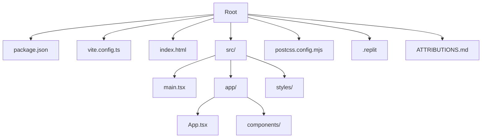

# Getting Started

<cite>
**Referenced Files in This Document**
- [README.md](file://README.md)
- [package.json](file://package.json)
- [vite.config.ts](file://vite.config.ts)
- [index.html](file://index.html)
- [src/main.tsx](file://src/main.tsx)
- [src/app/App.tsx](file://src/app/App.tsx)
- [.replit](file://.replit)
- [postcss.config.mjs](file://postcss.config.mjs)
- [ATTRIBUTIONS.md](file://ATTRIBUTIONS.md)
</cite>

## Table of Contents
1. [Introduction](#introduction)
2. [Prerequisites](#prerequisites)
3. [Installation](#installation)
4. [Development Setup](#development-setup)
5. [Project Structure](#project-structure)
6. [Quick Start](#quick-start)
7. [Initial Usage Scenarios](#initial-usage-scenarios)
8. [Troubleshooting](#troubleshooting)
9. [Browser Compatibility](#browser-compatibility)
10. [Conclusion](#conclusion)

## Introduction
This guide helps you install, run, and explore the Post-Quantum Cryptography Educational Platform locally. The project is a React-based web application built with Vite, styled with Tailwind CSS, and powered by modern UI libraries. It demonstrates post-quantum cryptographic algorithms and provides interactive educational tools for learning secure data encapsulation techniques.

## Prerequisites
- Operating system: Windows, macOS, or Linux
- Node.js: Version 20.x recommended (as indicated by the Replit configuration)
- Package manager: npm (comes with Node.js)
- Git (optional, for cloning the repository)
- Modern web browser (Chrome, Firefox, Safari, Edge)

Notes:
- The project uses React 18.3.1 and Material UI components, which are compatible with current browsers.
- No additional system dependencies are required beyond Node.js and a browser.

**Section sources**
- [.replit](file://.replit#L1-L10)

## Installation
Follow these steps to install the project locally:

1. Clone or download the repository to your machine.
2. Open a terminal in the project root directory.
3. Install dependencies:
   - Run: npm install
4. Verify installation:
   - The project includes a lock file indicating dependency resolution is complete.

What you get:
- All production and development dependencies defined in the package manifest.
- Development server configured via Vite.

**Section sources**
- [README.md](file://README.md#L8-L10)
- [package.json](file://package.json#L1-L93)

## Development Setup
Start the development server with hot reload:

- Command: npm run dev
- The development server runs on port 5000 by default.
- Access the application at http://localhost:5000 in your browser.

Optional: Configure port or host
- The Vite configuration defines host and port settings. You can modify them in the Vite config file if needed.

Hot reload
- Changes to source files are reflected immediately in the browser during development.

**Section sources**
- [README.md](file://README.md#L10-L11)
- [vite.config.ts](file://vite.config.ts#L17-L22)

## Project Structure
High-level layout of the project:

- Root
  - package.json: Defines scripts, dependencies, and metadata
  - vite.config.ts: Vite build and dev server configuration
  - index.html: Application entry HTML file
  - src/
    - main.tsx: React root that mounts the App component
    - app/
      - App.tsx: Main application shell with tabbed interface and integrated components
      - components/: UI and feature components (e.g., encryption panel, dashboard, simulator)
      - styles/: Global CSS files (Tailwind, theme, and index)
  - postcss.config.mjs: PostCSS configuration (Tailwind CSS v4 auto-configured)
  - .replit: Optional Replit-specific workflow and deployment settings
  - ATTRIBUTIONS.md: Third-party attributions

**Diagram sources**
- [package.json](file://package.json#L1-L93)
- [vite.config.ts](file://vite.config.ts#L1-L23)
- [index.html](file://index.html#L1-L15)
- [src/main.tsx](file://src/main.tsx#L1-L7)
- [src/app/App.tsx](file://src/app/App.tsx#L1-L362)
- [postcss.config.mjs](file://postcss.config.mjs#L1-L16)
- [.replit](file://.replit#L1-L40)
- [ATTRIBUTIONS.md](file://ATTRIBUTIONS.md#L1-L3)

**Section sources**
- [package.json](file://package.json#L1-L93)
- [vite.config.ts](file://vite.config.ts#L1-L23)
- [index.html](file://index.html#L1-L15)
- [src/main.tsx](file://src/main.tsx#L1-L7)
- [src/app/App.tsx](file://src/app/App.tsx#L1-L362)
- [postcss.config.mjs](file://postcss.config.mjs#L1-L16)
- [.replit](file://.replit#L1-L40)
- [ATTRIBUTIONS.md](file://ATTRIBUTIONS.md#L1-L3)

## Quick Start
Complete steps to run the application locally:

1. Install dependencies:
   - npm install
2. Start the development server:
   - npm run dev
3. Open your browser to http://localhost:5000
4. Explore the main tabs:
   - Encrypt, Files, Keys, Certificates, Network, Simulator, Analytics, Threat, Activity

Verification:
- The main application shell renders with animated backgrounds and tabbed content.
- The dashboard displays statistics and recent activity logs.
- Interactive components allow experimenting with encryption and key management.

**Section sources**
- [README.md](file://README.md#L8-L11)
- [src/app/App.tsx](file://src/app/App.tsx#L93-L360)

## Initial Usage Scenarios
First-time user exploration tips:

- Encryption Playground
  - Select an algorithm from the algorithm selector.
  - Enter plaintext and click encrypt to see the process simulated.
  - Observe statistics update and recent activity entries.

- File Encryption
  - Switch to the Files tab.
  - Trigger a file encryption simulation and review associated metrics.

- Key Management
  - Navigate to the Keys tab.
  - Generate and manage keys for the selected algorithm.

- Certificates
  - Explore the Certificates tab to simulate certificate lifecycle tasks.

- Network Security
  - Review the Network tab for simulated network security insights.

- Quantum Simulator
  - Use the Simulator tab to visualize quantum-related concepts.

- Analytics and Threat
  - View Security Visualization and Quantum Threat Meter for risk insights.

- Activity Log
  - Inspect the Activity tab to review recent operations.

These scenarios demonstrate the platform’s educational focus on post-quantum cryptographic techniques.

**Section sources**
- [src/app/App.tsx](file://src/app/App.tsx#L208-L316)

## Troubleshooting
Common issues and resolutions:

- Port already in use
  - Symptom: Development server fails to start or reports port conflict.
  - Resolution: Change the port in the Vite configuration or stop the conflicting service.
  - Reference: Vite server configuration for port and host.

- Missing dependencies after clone
  - Symptom: Errors when running the dev server.
  - Resolution: Run npm install to restore dependencies.

- Build errors related to CSS or Tailwind
  - Symptom: Styles not applying or build failures.
  - Resolution: Ensure Tailwind CSS v4 is properly configured via the Vite plugin. The PostCSS configuration is minimal and auto-managed by the Tailwind plugin.

- Browser compatibility issues
  - Symptom: UI glitches or missing animations.
  - Resolution: Use a modern browser (Chrome, Firefox, Safari, Edge). The project relies on React 18.3.1 and Material UI components.

- Replit-specific behavior
  - Symptom: Differences when running in Replit versus local environment.
  - Resolution: The Replit configuration sets Node.js 20 and exposes port 5000. Local development mirrors this setup.

**Section sources**
- [vite.config.ts](file://vite.config.ts#L17-L22)
- [postcss.config.mjs](file://postcss.config.mjs#L1-L16)
- [.replit](file://.replit#L1-L40)

## Browser Compatibility
- Supported browsers: Chrome, Firefox, Safari, Edge
- The application uses modern JavaScript features compatible with React 18.3.1 and Material UI.
- Animations and interactive UI rely on CSS and DOM APIs supported by contemporary browsers.

## Conclusion
You now have everything needed to install, run, and explore the Post-Quantum Cryptography Educational Platform. Use the development server to experiment with encryption simulations, key management, and quantum threat visualization. Refer to the troubleshooting section if you encounter issues, and consult the project structure overview to understand how components are organized.