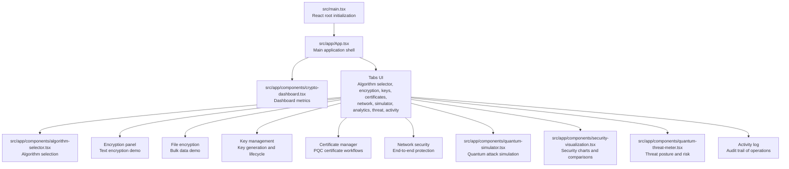
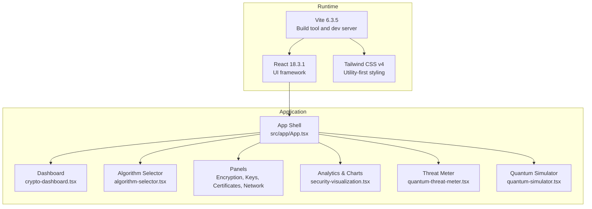
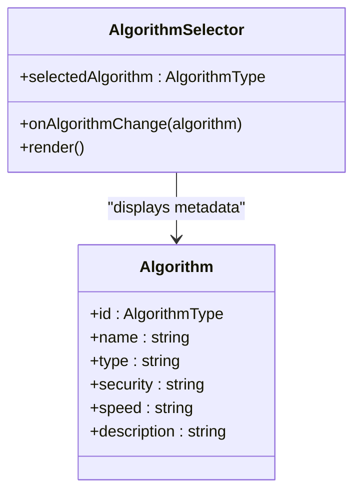
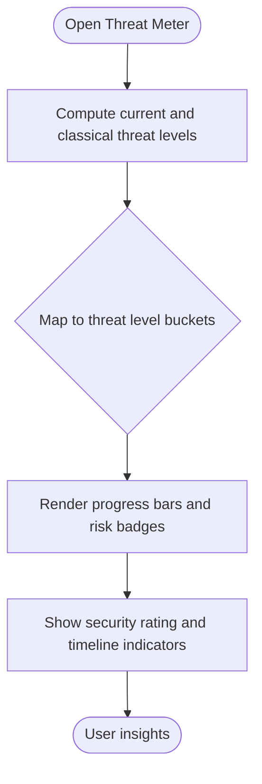
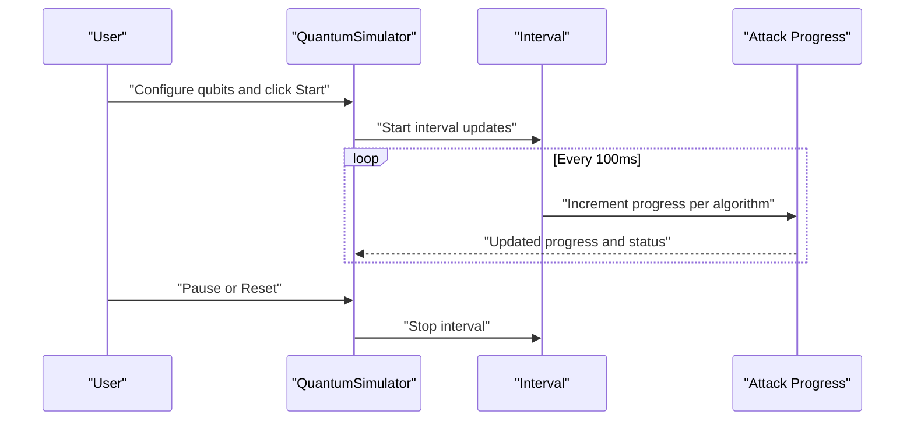
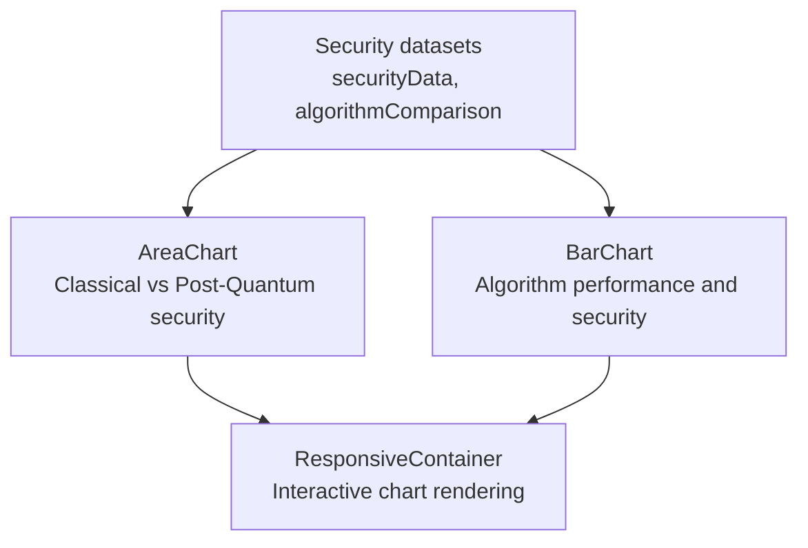
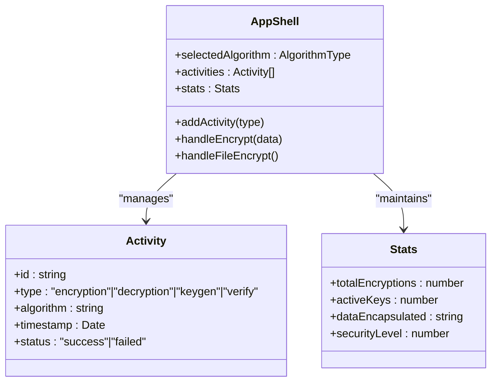
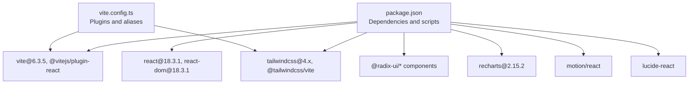

# Project Overview

<cite>
**Referenced Files in This Document**
- [README.md](file://README.md)
- [package.json](file://package.json)
- [vite.config.ts](file://vite.config.ts)
- [src/main.tsx](file://src/main.tsx)
- [src/app/App.tsx](file://src/app/App.tsx)
- [src/app/components/algorithm-selector.tsx](file://src/app/components/algorithm-selector.tsx)
- [src/app/components/crypto-dashboard.tsx](file://src/app/components/crypto-dashboard.tsx)
- [src/app/components/quantum-threat-meter.tsx](file://src/app/components/quantum-threat-meter.tsx)
- [src/app/components/quantum-simulator.tsx](file://src/app/components/quantum-simulator.tsx)
- [src/app/components/security-visualization.tsx](file://src/app/components/security-visualization.tsx)
</cite>

## Table of Contents
1. [Introduction](#introduction)
2. [Project Structure](#project-structure)
3. [Core Components](#core-components)
4. [Architecture Overview](#architecture-overview)
5. [Detailed Component Analysis](#detailed-component-analysis)
6. [Dependency Analysis](#dependency-analysis)
7. [Performance Considerations](#performance-considerations)
8. [Troubleshooting Guide](#troubleshooting-guide)
9. [Conclusion](#conclusion)

## Introduction
The Post-Quantum Cryptography Educational Platform is an interactive, web-based learning environment designed to demonstrate quantum-resistant cryptographic algorithms. It targets students, researchers, and cybersecurity professionals who need a practical understanding of post-quantum cryptography (PQC) and its real-world implications. The platform bridges theory and practice by offering hands-on encryption demonstrations, comparative analytics, and immersive visualizations of quantum threats and algorithm resilience.

Educational objectives include:
- Understanding the quantum threat landscape and timeline for cryptographic transitions
- Comparing PQC algorithms by security level, speed, and key sizes
- Interactively encrypting text and files using NIST-standardized PQC schemes
- Observing simulated quantum attacks and measuring resistance across algorithms
- Visualizing security trends and performance trade-offs over time

The platform emphasizes future-proofing: as quantum computers evolve, classical cryptographic methods like RSA and elliptic-curve cryptography will become vulnerable. The suite showcases lattice-based, hash-based, and code-based schemes that are designed to resist both classical and quantum adversaries.

## Project Structure
The project is a React 18 application built with Vite 6.3.5 and styled with Tailwind CSS v4. It organizes UI components under a modular structure, grouping reusable building blocks and algorithm-specific panels. The runtime entry initializes the React root and mounts the main application shell.

**Diagram sources**
- [src/main.tsx](file://src/main.tsx#L1-L7)
- [src/app/App.tsx](file://src/app/App.tsx#L1-L362)
- [src/app/components/crypto-dashboard.tsx](file://src/app/components/crypto-dashboard.tsx#L1-L70)
- [src/app/components/algorithm-selector.tsx](file://src/app/components/algorithm-selector.tsx#L1-L121)
- [src/app/components/quantum-simulator.tsx](file://src/app/components/quantum-simulator.tsx#L1-L316)
- [src/app/components/security-visualization.tsx](file://src/app/components/security-visualization.tsx#L1-L107)
- [src/app/components/quantum-threat-meter.tsx](file://src/app/components/quantum-threat-meter.tsx#L1-L149)

**Section sources**
- [src/main.tsx](file://src/main.tsx#L1-L7)
- [src/app/App.tsx](file://src/app/App.tsx#L1-L362)

## Core Components
The application’s core is a tabbed interface that exposes distinct functional areas for learning and experimentation. Central to the experience is the algorithm selector, which presents NIST-standardized PQC schemes and contextual metadata such as security level, speed, and type. Companion panels enable encryption of text and files, manage keys and certificates, simulate quantum attacks, visualize security trends, and track operational activity.

Key capabilities:
- Interactive encryption with live statistics and activity logging
- Comparative analytics across PQC algorithms (speed, security, key sizes)
- Real-time quantum threat meter and simulator
- Visual dashboards powered by Recharts

Practical examples:
- Selecting a PQC algorithm and encrypting arbitrary text to observe real-time metrics
- Uploading or selecting files for bulk encryption demonstrations
- Configuring quantum simulator parameters and observing attack progress
- Reviewing historical activity logs and dashboard summaries

**Section sources**
- [src/app/App.tsx](file://src/app/App.tsx#L26-L91)
- [src/app/components/algorithm-selector.tsx](file://src/app/components/algorithm-selector.tsx#L6-L66)
- [src/app/components/crypto-dashboard.tsx](file://src/app/components/crypto-dashboard.tsx#L13-L67)
- [src/app/components/quantum-threat-meter.tsx](file://src/app/components/quantum-threat-meter.tsx#L40-L98)
- [src/app/components/quantum-simulator.tsx](file://src/app/components/quantum-simulator.tsx#L50-L79)
- [src/app/components/security-visualization.tsx](file://src/app/components/security-visualization.tsx#L24-L103)

## Architecture Overview
The platform follows a component-driven architecture with React 18 and Vite. State management is handled locally within the main application shell, while individual components encapsulate UI and presentation logic. Charts and analytics leverage Recharts, and 3D-like visualizations are achieved through animated motion primitives and layered DOM elements.

**Diagram sources**
- [package.json](file://package.json#L63-L66)
- [vite.config.ts](file://vite.config.ts#L1-L23)
- [src/app/App.tsx](file://src/app/App.tsx#L1-L362)
- [src/app/components/crypto-dashboard.tsx](file://src/app/components/crypto-dashboard.tsx#L1-L70)
- [src/app/components/algorithm-selector.tsx](file://src/app/components/algorithm-selector.tsx#L1-L121)
- [src/app/components/security-visualization.tsx](file://src/app/components/security-visualization.tsx#L1-L107)
- [src/app/components/quantum-threat-meter.tsx](file://src/app/components/quantum-threat-meter.tsx#L1-L149)
- [src/app/components/quantum-simulator.tsx](file://src/app/components/quantum-simulator.tsx#L1-L316)

## Detailed Component Analysis

### Algorithm Selection and Metadata
The algorithm selector centralizes the choice of PQC schemes and displays their attributes. It surfaces security level, performance characteristics, and algorithm type, enabling informed comparisons during demonstrations.

**Diagram sources**
- [src/app/components/algorithm-selector.tsx](file://src/app/components/algorithm-selector.tsx#L6-L66)

**Section sources**
- [src/app/components/algorithm-selector.tsx](file://src/app/components/algorithm-selector.tsx#L68-L121)

### Quantum Threat Meter
The threat meter contrasts the vulnerability of classical cryptography versus the protection offered by PQC. It computes and displays risk levels, security ratings, and projected timelines, helping users understand urgency and preparedness.

**Diagram sources**
- [src/app/components/quantum-threat-meter.tsx](file://src/app/components/quantum-threat-meter.tsx#L40-L98)

**Section sources**
- [src/app/components/quantum-threat-meter.tsx](file://src/app/components/quantum-threat-meter.tsx#L13-L38)
- [src/app/components/quantum-threat-meter.tsx](file://src/app/components/quantum-threat-meter.tsx#L99-L145)

### Quantum Simulator
The quantum simulator runs a configurable, animated demonstration of quantum attacks against classical and PQC algorithms. It adjusts qubit counts, simulates attack progress, and renders real-time results with visual feedback.

**Diagram sources**
- [src/app/components/quantum-simulator.tsx](file://src/app/components/quantum-simulator.tsx#L25-L48)
- [src/app/components/quantum-simulator.tsx](file://src/app/components/quantum-simulator.tsx#L50-L79)

**Section sources**
- [src/app/components/quantum-simulator.tsx](file://src/app/components/quantum-simulator.tsx#L17-L48)
- [src/app/components/quantum-simulator.tsx](file://src/app/components/quantum-simulator.tsx#L81-L189)

### Security Visualization and Analytics
Security visualization presents time-series data and comparative metrics across PQC algorithms. It uses Recharts to render area charts for security trends and bar charts for performance and security scores.

**Diagram sources**
- [src/app/components/security-visualization.tsx](file://src/app/components/security-visualization.tsx#L5-L22)
- [src/app/components/security-visualization.tsx](file://src/app/components/security-visualization.tsx#L24-L103)

**Section sources**
- [src/app/components/security-visualization.tsx](file://src/app/components/security-visualization.tsx#L24-L103)

### Application Shell and Navigation
The application shell orchestrates global state, navigation tabs, and integrated demos. It aggregates activity logs, maintains dashboard statistics, and coordinates cross-component interactions.

**Diagram sources**
- [src/app/App.tsx](file://src/app/App.tsx#L18-L34)
- [src/app/App.tsx](file://src/app/App.tsx#L36-L63)
- [src/app/App.tsx](file://src/app/App.tsx#L66-L91)

**Section sources**
- [src/app/App.tsx](file://src/app/App.tsx#L26-L91)

## Dependency Analysis
The project relies on a modern frontend stack optimized for rapid iteration and rich UI experiences. Dependencies include React 18.3.1 for component rendering, Vite 6.3.5 for bundling and development, Tailwind CSS v4 for styling, Recharts for analytics, and animation/motion libraries for immersive visuals.

**Diagram sources**
- [package.json](file://package.json#L10-L68)
- [package.json](file://package.json#L70-L74)
- [vite.config.ts](file://vite.config.ts#L1-L23)

**Section sources**
- [package.json](file://package.json#L10-L68)
- [package.json](file://package.json#L70-L74)
- [vite.config.ts](file://vite.config.ts#L1-L23)

## Performance Considerations
- Keep animations lightweight: The quantum simulator and dashboard rely on motion primitives; avoid excessive concurrent animations for older devices.
- Optimize chart rendering: Recharts components are responsive; ensure datasets remain reasonably sized to prevent layout thrashing.
- Prefer client-side state: Local state management reduces network overhead and improves interactivity.
- Bundle and tree-shake: Vite and modern React minimize payload; avoid importing unused UI components or icons.

## Troubleshooting Guide
- Development server startup: Ensure dependencies are installed and the dev script is executed as documented.
- Port conflicts: The server binds to port 5000; adjust if conflicting with other services.
- Asset loading: SVG and CSV assets are included; verify paths if assets fail to load.
- UI responsiveness: If charts or animations appear sluggish, reduce concurrent updates or simplify datasets.

**Section sources**
- [README.md](file://README.md#L6-L11)
- [vite.config.ts](file://vite.config.ts#L17-L21)

## Conclusion
The Post-Quantum Cryptography Educational Platform delivers a comprehensive, interactive learning environment that connects theoretical PQC concepts with practical demonstrations. By combining algorithm selection, encryption workflows, quantum threat modeling, and analytics, it equips learners to understand the urgency of cryptographic transitions and evaluate trade-offs among quantum-resistant schemes. The modern tech stack ensures a smooth, engaging experience suitable for diverse audiences in education and cybersecurity.