# Data Display Components

<cite>
**Referenced Files in This Document**
- [chart.tsx](file://Design/src/app/components/ui/chart.tsx)
- [table.tsx](file://Design/src/app/components/ui/table.tsx)
- [breadcrumb.tsx](file://Design/src/app/components/ui/breadcrumb.tsx)
- [pagination.tsx](file://Design/src/app/components/ui/pagination.tsx)
- [progress.tsx](file://Design/src/app/components/ui/progress.tsx)
- [resizable.tsx](file://Design/src/app/components/ui/resizable.tsx)
- [scroll-area.tsx](file://Design/src/app/components/ui/scroll-area.tsx)
- [separator.tsx](file://Design/src/app/components/ui/separator.tsx)
- [skeleton.tsx](file://Design/src/app/components/ui/skeleton.tsx)
- [slider.tsx](file://Design/src/app/components/ui/slider.tsx)
- [utils.ts](file://Design/src/app/components/ui/utils.ts)
- [button.tsx](file://Design/src/app/components/ui/button.tsx)
- [theme.css](file://Design/src/styles/theme.css)
- [tailwind.css](file://Design/src/styles/tailwind.css)
- [crypto-dashboard.tsx](file://Design/src/app/components/crypto-dashboard.tsx)
- [security-visualization.tsx](file://Design/src/app/components/security-visualization.tsx)
- [activity-log.tsx](file://Design/src/app/components/activity-log.tsx)
- [README.md](file://Design/README.md)
</cite>

## Table of Contents
1. [Introduction](#introduction)
2. [Project Structure](#project-structure)
3. [Core Components](#core-components)
4. [Architecture Overview](#architecture-overview)
5. [Detailed Component Analysis](#detailed-component-analysis)
6. [Dependency Analysis](#dependency-analysis)
7. [Performance Considerations](#performance-considerations)
8. [Troubleshooting Guide](#troubleshooting-guide)
9. [Conclusion](#conclusion)
10. [Appendices](#appendices)

## Introduction
This document provides comprehensive documentation for data display components that present and organize information in the application interface. It covers Chart visualizations, Table layouts, Breadcrumb navigation, Pagination controls, Progress indicators, Resizable panes, Scroll areas, Separators, Skeleton loaders, and Slider controls. The guide explains data binding patterns, responsive design implementations, performance optimization techniques, accessibility features, styling approaches, and integration with external data sources. It also includes examples of complex data presentations, filtering and sorting capabilities, and user interaction patterns for data manipulation.

## Project Structure
The data display components are implemented as reusable UI primitives under the UI components directory. They integrate with a theming system and Tailwind-based styling utilities. Example components demonstrate real-world usage patterns for charts, tables, and lists.

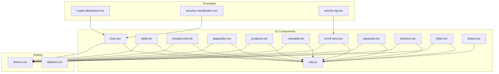

**Diagram sources**
- [chart.tsx](file://Design/src/app/components/ui/chart.tsx#L1-L354)
- [table.tsx](file://Design/src/app/components/ui/table.tsx#L1-L117)
- [breadcrumb.tsx](file://Design/src/app/components/ui/breadcrumb.tsx#L1-L110)
- [pagination.tsx](file://Design/src/app/components/ui/pagination.tsx#L1-L128)
- [progress.tsx](file://Design/src/app/components/ui/progress.tsx#L1-L32)
- [resizable.tsx](file://Design/src/app/components/ui/resizable.tsx#L1-L57)
- [scroll-area.tsx](file://Design/src/app/components/ui/scroll-area.tsx#L1-L59)
- [separator.tsx](file://Design/src/app/components/ui/separator.tsx#L1-L29)
- [skeleton.tsx](file://Design/src/app/components/ui/skeleton.tsx#L1-L14)
- [slider.tsx](file://Design/src/app/components/ui/slider.tsx#L1-L64)
- [utils.ts](file://Design/src/app/components/ui/utils.ts#L1-L7)
- [button.tsx](file://Design/src/app/components/ui/button.tsx#L1-L58)
- [theme.css](file://Design/src/styles/theme.css#L1-L188)
- [tailwind.css](file://Design/src/styles/tailwind.css#L1-L5)
- [crypto-dashboard.tsx](file://Design/src/app/components/crypto-dashboard.tsx#L1-L70)
- [security-visualization.tsx](file://Design/src/app/components/security-visualization.tsx#L1-L107)
- [activity-log.tsx](file://Design/src/app/components/activity-log.tsx#L1-L117)

**Section sources**
- [README.md](file://Design/README.md#L1-L11)

## Core Components
This section summarizes the primary data display components and their responsibilities:
- Chart: Provides container, tooltip, legend, and theming for Recharts visualizations.
- Table: Offers semantic table layout primitives with responsive behavior.
- Breadcrumb: Implements accessible hierarchical navigation.
- Pagination: Supplies navigation controls for paginated datasets.
- Progress: Displays completion percentage with smooth transitions.
- Resizable: Enables draggable panel resizing for split views.
- ScrollArea: Adds native-like scrollbars with overlay behavior.
- Separator: Renders horizontal or vertical dividers.
- Skeleton: Provides animated placeholders during async loads.
- Slider: Supports single and range sliders with keyboard accessibility.

**Section sources**
- [chart.tsx](file://Design/src/app/components/ui/chart.tsx#L1-L354)
- [table.tsx](file://Design/src/app/components/ui/table.tsx#L1-L117)
- [breadcrumb.tsx](file://Design/src/app/components/ui/breadcrumb.tsx#L1-L110)
- [pagination.tsx](file://Design/src/app/components/ui/pagination.tsx#L1-L128)
- [progress.tsx](file://Design/src/app/components/ui/progress.tsx#L1-L32)
- [resizable.tsx](file://Design/src/app/components/ui/resizable.tsx#L1-L57)
- [scroll-area.tsx](file://Design/src/app/components/ui/scroll-area.tsx#L1-L59)
- [separator.tsx](file://Design/src/app/components/ui/separator.tsx#L1-L29)
- [skeleton.tsx](file://Design/src/app/components/ui/skeleton.tsx#L1-L14)
- [slider.tsx](file://Design/src/app/components/ui/slider.tsx#L1-L64)

## Architecture Overview
The components follow a consistent pattern:
- Utility-first styling via a shared cn function.
- Theming through CSS custom properties and a dedicated theme stylesheet.
- Primitive wrappers around third-party libraries (e.g., Recharts, Radix UI).
- Accessibility attributes and semantic markup.

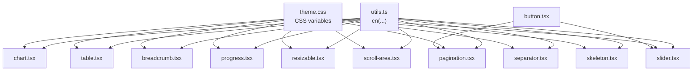

**Diagram sources**
- [utils.ts](file://Design/src/app/components/ui/utils.ts#L1-L7)
- [chart.tsx](file://Design/src/app/components/ui/chart.tsx#L1-L354)
- [table.tsx](file://Design/src/app/components/ui/table.tsx#L1-L117)
- [breadcrumb.tsx](file://Design/src/app/components/ui/breadcrumb.tsx#L1-L110)
- [pagination.tsx](file://Design/src/app/components/ui/pagination.tsx#L1-L128)
- [progress.tsx](file://Design/src/app/components/ui/progress.tsx#L1-L32)
- [resizable.tsx](file://Design/src/app/components/ui/resizable.tsx#L1-L57)
- [scroll-area.tsx](file://Design/src/app/components/ui/scroll-area.tsx#L1-L59)
- [separator.tsx](file://Design/src/app/components/ui/separator.tsx#L1-L29)
- [skeleton.tsx](file://Design/src/app/components/ui/skeleton.tsx#L1-L14)
- [slider.tsx](file://Design/src/app/components/ui/slider.tsx#L1-L64)
- [button.tsx](file://Design/src/app/components/ui/button.tsx#L1-L58)
- [theme.css](file://Design/src/styles/theme.css#L1-L188)

## Detailed Component Analysis

### Chart Visualizations
The Chart component provides a themed container for Recharts with configurable tooltips, legends, and dynamic color injection. It supports light/dark themes via CSS custom properties and integrates with Recharts primitives.

Key features:
- Theme-aware color variables injected via inline styles.
- Tooltip customization with label formatting and indicator styles.
- Legend rendering with icons and labels.
- Responsive container wrapper for charts.

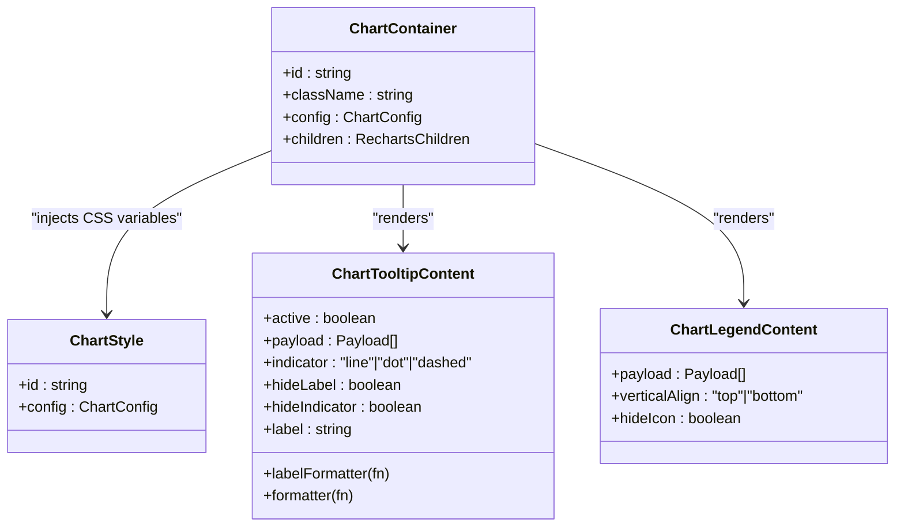

**Diagram sources**
- [chart.tsx](file://Design/src/app/components/ui/chart.tsx#L37-L70)
- [chart.tsx](file://Design/src/app/components/ui/chart.tsx#L107-L249)
- [chart.tsx](file://Design/src/app/components/ui/chart.tsx#L253-L305)
- [chart.tsx](file://Design/src/app/components/ui/chart.tsx#L72-L103)

Data binding patterns:
- ChartConfig maps dataset keys to labels/icons and theme colors.
- Tooltip and legend derive labels from payload and config.
- Inline styles compute indicator colors from props and theme variables.

Responsive design:
- Uses a responsive container to adapt to parent width and height.

Accessibility:
- Tooltip and legend provide accessible labels and roles.

Performance:
- Memoized tooltip label computation reduces re-renders.
- CSS variable injection avoids expensive DOM updates.

Integration with external data:
- Charts consume arrays of objects; pass transformed datasets from APIs.

Filtering/sorting:
- Apply filters/sorts upstream before passing data to charts.

Examples:
- Security visualization demonstrates area and bar charts with gradients and legends.

**Section sources**
- [chart.tsx](file://Design/src/app/components/ui/chart.tsx#L1-L354)
- [security-visualization.tsx](file://Design/src/app/components/security-visualization.tsx#L1-L107)

### Table Layouts
The Table component exposes semantic primitives for building responsive data grids with hover and selection states.

Key features:
- Container with horizontal scrolling for small screens.
- Header/body/footer/row/cell primitives.
- Checkbox-friendly column alignment.

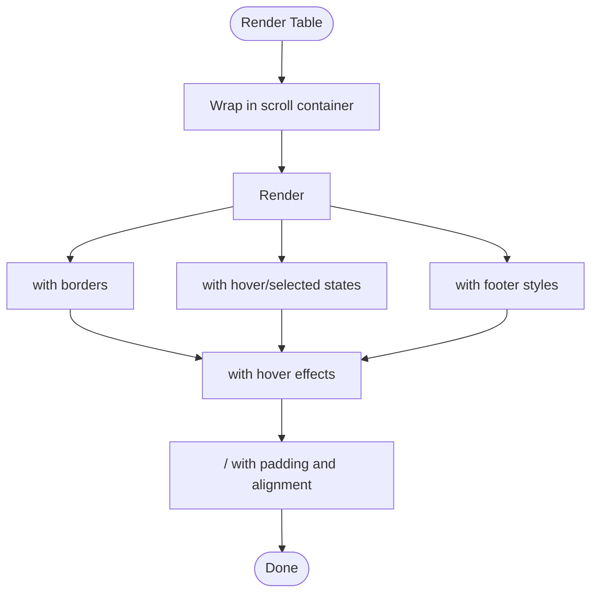

**Diagram sources**
- [table.tsx](file://Design/src/app/components/ui/table.tsx#L7-L20)
- [table.tsx](file://Design/src/app/components/ui/table.tsx#L22-L53)
- [table.tsx](file://Design/src/app/components/ui/table.tsx#L55-L92)

Responsive design:
- Horizontal overflow container ensures usability on narrow devices.

Accessibility:
- Semantic table structure with proper row/cell roles.

Performance:
- Minimal DOM overhead; hover/selected states handled via data attributes.

Integration with external data:
- Bind rows to API responses; handle empty states and loading skeletons.

Filtering/sorting:
- Sort by clicking headers; filter client-side or server-side.

**Section sources**
- [table.tsx](file://Design/src/app/components/ui/table.tsx#L1-L117)

### Breadcrumb Navigation
Breadcrumb provides accessible hierarchical navigation with separators and ellipsis support.

Key features:
- List with accessible roles and labels.
- Link/page segments with current page emphasis.
- Ellipsis for collapsed navigation paths.

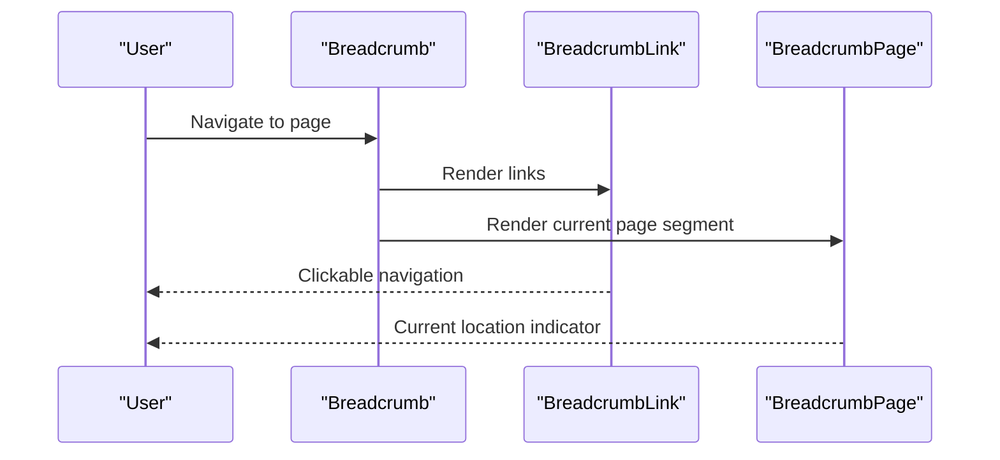

**Diagram sources**
- [breadcrumb.tsx](file://Design/src/app/components/ui/breadcrumb.tsx#L7-L22)
- [breadcrumb.tsx](file://Design/src/app/components/ui/breadcrumb.tsx#L34-L63)
- [breadcrumb.tsx](file://Design/src/app/components/ui/breadcrumb.tsx#L83-L99)

Accessibility:
- Proper aria-labels and roles for screen readers.

Responsive design:
- Wrapping text and flexible spacing for narrow screens.

**Section sources**
- [breadcrumb.tsx](file://Design/src/app/components/ui/breadcrumb.tsx#L1-L110)

### Pagination Controls
Pagination offers navigation between pages with ellipsis and active state indication.

Key features:
- Previous/next buttons with icons and text.
- Page links with active state styling.
- Ellipsis for skipped pages.

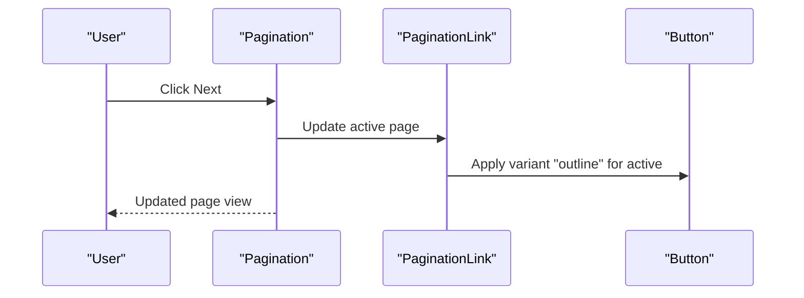

**Diagram sources**
- [pagination.tsx](file://Design/src/app/components/ui/pagination.tsx#L11-L21)
- [pagination.tsx](file://Design/src/app/components/ui/pagination.tsx#L45-L66)
- [pagination.tsx](file://Design/src/app/components/ui/pagination.tsx#L68-L100)
- [button.tsx](file://Design/src/app/components/ui/button.tsx#L1-L58)

Accessibility:
- ARIA attributes for navigation and active page.

Responsive design:
- Text-only labels hidden on small screens; icons remain visible.

**Section sources**
- [pagination.tsx](file://Design/src/app/components/ui/pagination.tsx#L1-L128)
- [button.tsx](file://Design/src/app/components/ui/button.tsx#L1-L58)

### Progress Indicators
Progress displays completion percentage with smooth transitions.

Key features:
- Root element with gradient background.
- Indicator with translate-based width animation.

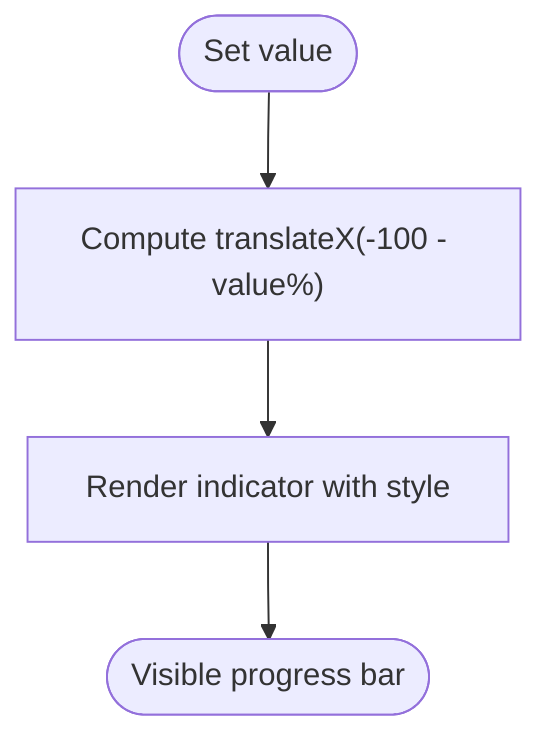

**Diagram sources**
- [progress.tsx](file://Design/src/app/components/ui/progress.tsx#L8-L29)

Accessibility:
- No explicit ARIA attributes; suitable for non-declarative progress.

Performance:
- CSS transforms for smooth animations.

**Section sources**
- [progress.tsx](file://Design/src/app/components/ui/progress.tsx#L1-L32)

### Resizable Panes
Resizable enables draggable pane splitting with optional gripper handles.

Key features:
- Panel group with directional orientation.
- Panel resize handle with focus-visible styles.
- Optional gripper handle for visual affordance.

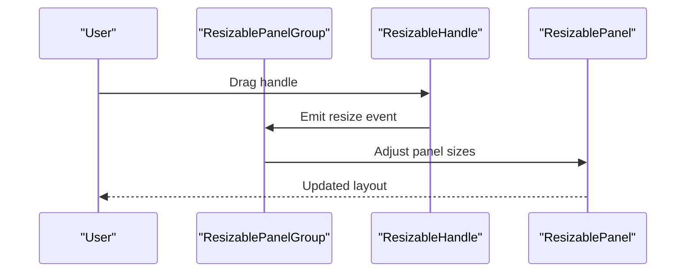

**Diagram sources**
- [resizable.tsx](file://Design/src/app/components/ui/resizable.tsx#L9-L23)
- [resizable.tsx](file://Design/src/app/components/ui/resizable.tsx#L31-L54)

Accessibility:
- Focus-visible ring for keyboard navigation.

Performance:
- Lightweight wrapper around react-resizable-panels.

**Section sources**
- [resizable.tsx](file://Design/src/app/components/ui/resizable.tsx#L1-L57)

### Scroll Areas
ScrollArea adds native-like scrollbars with overlay behavior and corner support.

Key features:
- Viewport with focus-visible ring.
- Scrollbar with orientation-specific sizing.
- Thumb with subtle background.

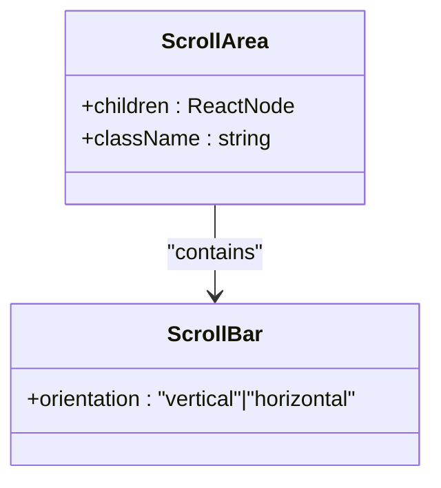

**Diagram sources**
- [scroll-area.tsx](file://Design/src/app/components/ui/scroll-area.tsx#L8-L29)
- [scroll-area.tsx](file://Design/src/app/components/ui/scroll-area.tsx#L31-L56)

Accessibility:
- Focus-visible ring for keyboard users.

Performance:
- Uses Radix UI primitives for efficient rendering.

**Section sources**
- [scroll-area.tsx](file://Design/src/app/components/ui/scroll-area.tsx#L1-L59)

### Separators
Separator renders horizontal or vertical dividers with appropriate sizing.

Key features:
- Orientation-driven width/height.
- Decorative or structural semantics.

**Section sources**
- [separator.tsx](file://Design/src/app/components/ui/separator.tsx#L1-L29)

### Skeleton Loaders
Skeleton provides animated placeholders using pulse animation.

Key features:
- Animated pulse effect.
- Composable with layout primitives.

**Section sources**
- [skeleton.tsx](file://Design/src/app/components/ui/skeleton.tsx#L1-L14)

### Slider Controls
Slider supports single and range sliders with keyboard accessibility and disabled states.

Key features:
- Track and range visuals.
- Dynamic number of thumbs based on value array.
- Orientation-aware sizing.

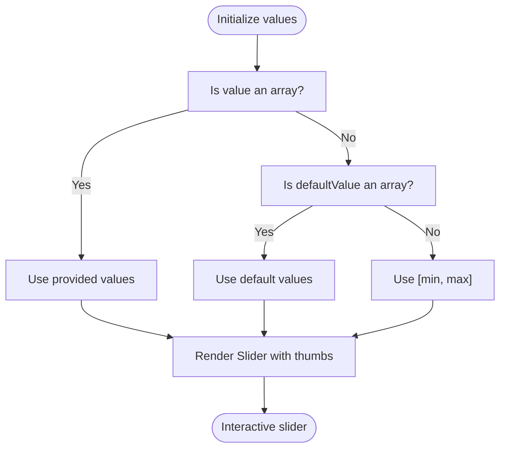

**Diagram sources**
- [slider.tsx](file://Design/src/app/components/ui/slider.tsx#L8-L61)

Accessibility:
- Radix UI primitives provide keyboard navigation and ARIA attributes.

Performance:
- Memoized values prevent unnecessary re-renders.

**Section sources**
- [slider.tsx](file://Design/src/app/components/ui/slider.tsx#L1-L64)

## Dependency Analysis
The components share a common styling utility and theme system. Chart components depend on Recharts; others rely on Radix UI primitives. Pagination integrates Button variants.

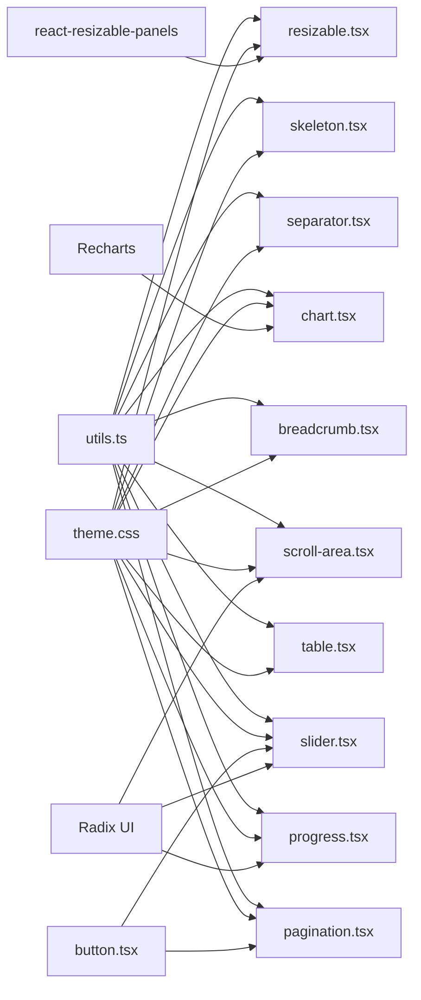

**Diagram sources**
- [utils.ts](file://Design/src/app/components/ui/utils.ts#L1-L7)
- [chart.tsx](file://Design/src/app/components/ui/chart.tsx#L1-L354)
- [table.tsx](file://Design/src/app/components/ui/table.tsx#L1-L117)
- [breadcrumb.tsx](file://Design/src/app/components/ui/breadcrumb.tsx#L1-L110)
- [pagination.tsx](file://Design/src/app/components/ui/pagination.tsx#L1-L128)
- [progress.tsx](file://Design/src/app/components/ui/progress.tsx#L1-L32)
- [resizable.tsx](file://Design/src/app/components/ui/resizable.tsx#L1-L57)
- [scroll-area.tsx](file://Design/src/app/components/ui/scroll-area.tsx#L1-L59)
- [separator.tsx](file://Design/src/app/components/ui/separator.tsx#L1-L29)
- [skeleton.tsx](file://Design/src/app/components/ui/skeleton.tsx#L1-L14)
- [slider.tsx](file://Design/src/app/components/ui/slider.tsx#L1-L64)
- [button.tsx](file://Design/src/app/components/ui/button.tsx#L1-L58)
- [theme.css](file://Design/src/styles/theme.css#L1-L188)

**Section sources**
- [chart.tsx](file://Design/src/app/components/ui/chart.tsx#L1-L354)
- [table.tsx](file://Design/src/app/components/ui/table.tsx#L1-L117)
- [breadcrumb.tsx](file://Design/src/app/components/ui/breadcrumb.tsx#L1-L110)
- [pagination.tsx](file://Design/src/app/components/ui/pagination.tsx#L1-L128)
- [progress.tsx](file://Design/src/app/components/ui/progress.tsx#L1-L32)
- [resizable.tsx](file://Design/src/app/components/ui/resizable.tsx#L1-L57)
- [scroll-area.tsx](file://Design/src/app/components/ui/scroll-area.tsx#L1-L59)
- [separator.tsx](file://Design/src/app/components/ui/separator.tsx#L1-L29)
- [skeleton.tsx](file://Design/src/app/components/ui/skeleton.tsx#L1-L14)
- [slider.tsx](file://Design/src/app/components/ui/slider.tsx#L1-L64)
- [button.tsx](file://Design/src/app/components/ui/button.tsx#L1-L58)
- [theme.css](file://Design/src/styles/theme.css#L1-L188)

## Performance Considerations
- Prefer memoization for computed values (e.g., tooltip labels).
- Use CSS transforms for animations (progress indicator).
- Keep DOM depth minimal for tables and lists.
- Lazy-load heavy visualizations when possible.
- Debounce or throttle user interactions (sorting/filtering).
- Virtualize long lists to reduce render cost.

## Troubleshooting Guide
Common issues and resolutions:
- Charts not displaying colors: Ensure ChartContainer receives a valid config with theme or color entries.
- Pagination links not styled: Verify button variants are applied via buttonVariants.
- Scrollbars missing: Confirm ScrollArea wraps content and scrollbar is rendered.
- Resizable handle not draggable: Check direction prop and ensure PanelResizeHandle is used.
- Skeleton not animating: Ensure pulse animation is enabled and not overridden by global styles.
- Slider disabled state: Confirm disabled prop is passed to SliderPrimitive.Root.

**Section sources**
- [chart.tsx](file://Design/src/app/components/ui/chart.tsx#L1-L354)
- [pagination.tsx](file://Design/src/app/components/ui/pagination.tsx#L1-L128)
- [scroll-area.tsx](file://Design/src/app/components/ui/scroll-area.tsx#L1-L59)
- [resizable.tsx](file://Design/src/app/components/ui/resizable.tsx#L1-L57)
- [skeleton.tsx](file://Design/src/app/components/ui/skeleton.tsx#L1-L14)
- [slider.tsx](file://Design/src/app/components/ui/slider.tsx#L1-L64)
- [button.tsx](file://Design/src/app/components/ui/button.tsx#L1-L58)

## Conclusion
The data display components provide a cohesive, accessible, and performant foundation for presenting information across the application. They integrate seamlessly with the theming system and leverage modern UI primitives to deliver responsive experiences. By following the documented patterns for data binding, accessibility, and performance, teams can build scalable and maintainable data interfaces.

## Appendices

### Styling Approaches and Theming
- CSS custom properties define theme tokens and chart colors.
- Tailwind-based class merging ensures consistent styling.
- Dark mode support via custom variants and theme overrides.

**Section sources**
- [theme.css](file://Design/src/styles/theme.css#L1-L188)
- [tailwind.css](file://Design/src/styles/tailwind.css#L1-L5)
- [utils.ts](file://Design/src/app/components/ui/utils.ts#L1-L7)

### Examples of Complex Data Presentations
- Security visualization: Area and bar charts with gradients and legends.
- Activity log: Scrollable list with badges and timestamps.
- Dashboard cards: Summary metrics with icons and trend indicators.

**Section sources**
- [security-visualization.tsx](file://Design/src/app/components/security-visualization.tsx#L1-L107)
- [activity-log.tsx](file://Design/src/app/components/activity-log.tsx#L1-L117)
- [crypto-dashboard.tsx](file://Design/src/app/components/crypto-dashboard.tsx#L1-L70)