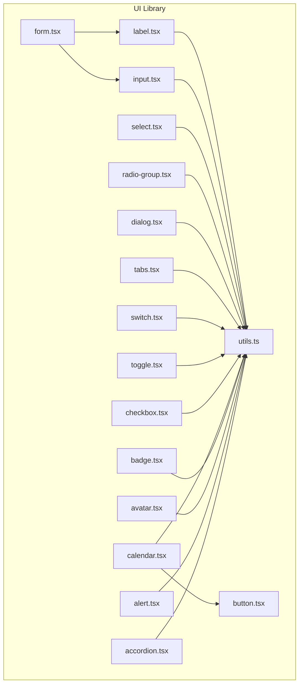
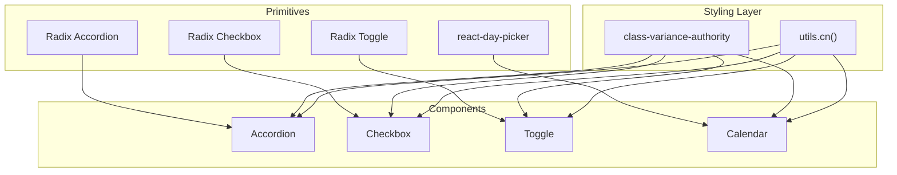
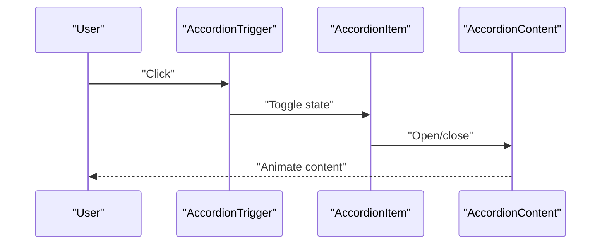
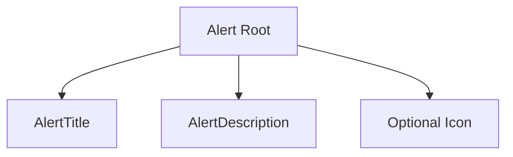
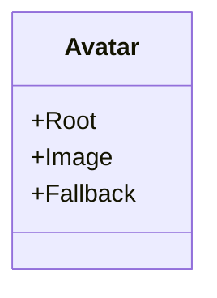
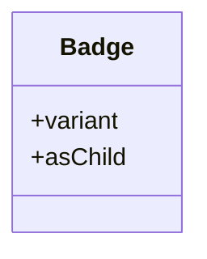
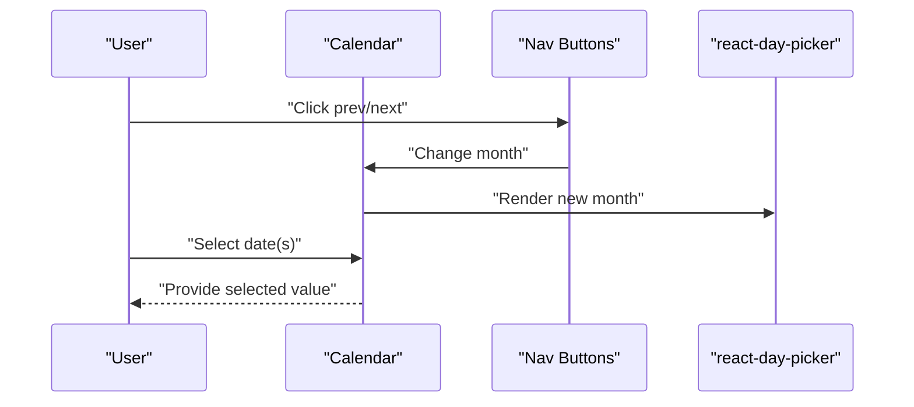
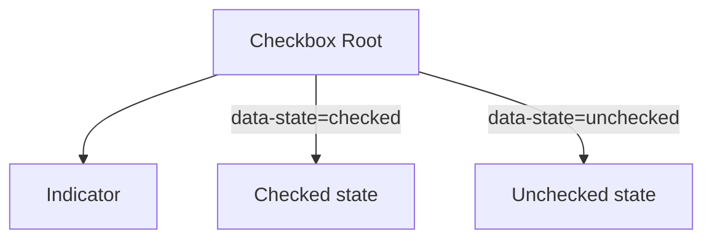
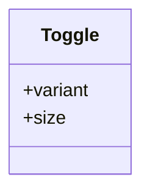
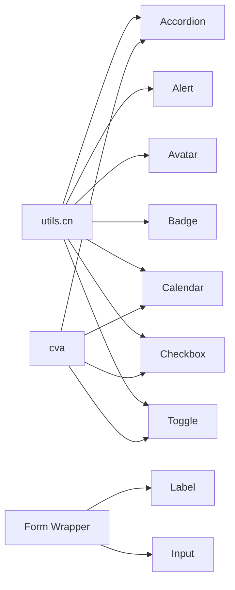

# Interactive Components

<cite>
**Referenced Files in This Document**
- [accordion.tsx](file://Design/src/app/components/ui/accordion.tsx)
- [alert.tsx](file://Design/src/app/components/ui/alert.tsx)
- [avatar.tsx](file://Design/src/app/components/ui/avatar.tsx)
- [badge.tsx](file://Design/src/app/components/ui/badge.tsx)
- [calendar.tsx](file://Design/src/app/components/ui/calendar.tsx)
- [checkbox.tsx](file://Design/src/app/components/ui/checkbox.tsx)
- [toggle.tsx](file://Design/src/app/components/ui/toggle.tsx)
- [utils.ts](file://Design/src/app/components/ui/utils.ts)
- [button.tsx](file://Design/src/app/components/ui/button.tsx)
- [form.tsx](file://Design/src/app/components/ui/form.tsx)
- [switch.tsx](file://Design/src/app/components/ui/switch.tsx)
- [tabs.tsx](file://Design/src/app/components/ui/tabs.tsx)
- [dialog.tsx](file://Design/src/app/components/ui/dialog.tsx)
- [radio-group.tsx](file://Design/src/app/components/ui/radio-group.tsx)
- [select.tsx](file://Design/src/app/components/ui/select.tsx)
- [input.tsx](file://Design/src/app/components/ui/input.tsx)
- [label.tsx](file://Design/src/app/components/ui/label.tsx)
</cite>

## Table of Contents
1. [Introduction](#introduction)
2. [Project Structure](#project-structure)
3. [Core Components](#core-components)
4. [Architecture Overview](#architecture-overview)
5. [Detailed Component Analysis](#detailed-component-analysis)
6. [Dependency Analysis](#dependency-analysis)
7. [Performance Considerations](#performance-considerations)
8. [Troubleshooting Guide](#troubleshooting-guide)
9. [Conclusion](#conclusion)
10. [Appendices](#appendices)

## Introduction
This document explains the interactive and behavioral components that handle user input and dynamic content. It focuses on Accordion panels, Alert systems, Avatar displays, Badge indicators, Calendar pickers, Checkbox groups, and Toggle controls. For each component, we describe states, event handling patterns, user interaction workflows, accessibility attributes, animation behaviors, focus management, keyboard navigation support, styling customization, and integration with form validation systems. We also provide diagrams and practical guidance for building responsive, accessible user experiences.

## Project Structure
The interactive components are implemented under the UI library and share a consistent pattern:
- They use Radix UI primitives for accessible base behavior and state management.
- They apply Tailwind-based styling via a shared utility that merges and normalizes classes.
- Many components expose variant and size options for styling customization.
- Form integration is supported through a dedicated form wrapper that connects to react-hook-form.

**Diagram sources**
- [accordion.tsx](file://Design/src/app/components/ui/accordion.tsx#L1-L67)
- [alert.tsx](file://Design/src/app/components/ui/alert.tsx#L1-L67)
- [avatar.tsx](file://Design/src/app/components/ui/avatar.tsx#L1-L54)
- [badge.tsx](file://Design/src/app/components/ui/badge.tsx#L1-L47)
- [calendar.tsx](file://Design/src/app/components/ui/calendar.tsx#L1-L76)
- [checkbox.tsx](file://Design/src/app/components/ui/checkbox.tsx#L1-L33)
- [toggle.tsx](file://Design/src/app/components/ui/toggle.tsx#L1-L48)
- [button.tsx](file://Design/src/app/components/ui/button.tsx#L1-L58)
- [form.tsx](file://Design/src/app/components/ui/form.tsx#L1-L169)
- [switch.tsx](file://Design/src/app/components/ui/switch.tsx#L1-L32)
- [tabs.tsx](file://Design/src/app/components/ui/tabs.tsx#L1-L67)
- [dialog.tsx](file://Design/src/app/components/ui/dialog.tsx#L1-L136)
- [radio-group.tsx](file://Design/src/app/components/ui/radio-group.tsx#L1-L46)
- [select.tsx](file://Design/src/app/components/ui/select.tsx#L1-L190)
- [input.tsx](file://Design/src/app/components/ui/input.tsx#L1-L22)
- [label.tsx](file://Design/src/app/components/ui/label.tsx#L1-L25)
- [utils.ts](file://Design/src/app/components/ui/utils.ts#L1-L7)

**Section sources**
- [utils.ts](file://Design/src/app/components/ui/utils.ts#L1-L7)
- [button.tsx](file://Design/src/app/components/ui/button.tsx#L1-L58)
- [form.tsx](file://Design/src/app/components/ui/form.tsx#L1-L169)

## Core Components
This section summarizes the primary interactive components and their roles:
- Accordion: Collapsible sections with animated content transitions and keyboard navigation.
- Alert: Non-modal notifications with optional icons and semantic variants.
- Avatar: Image with fallback and primitive semantics for accessibility.
- Badge: Lightweight indicator with variant styling and focus states.
- Calendar: Date picker built on react-day-picker with Tailwind-styled cells and range mode support.
- Checkbox: Multi-state primitive with accessible checked/unchecked handling.
- Toggle: On/off control with variants and sizes.

Each component exposes data-slot attributes for testing and styling hooks, and integrates with focus-visible rings and aria-invalid states for form validation feedback.

**Section sources**
- [accordion.tsx](file://Design/src/app/components/ui/accordion.tsx#L1-L67)
- [alert.tsx](file://Design/src/app/components/ui/alert.tsx#L1-L67)
- [avatar.tsx](file://Design/src/app/components/ui/avatar.tsx#L1-L54)
- [badge.tsx](file://Design/src/app/components/ui/badge.tsx#L1-L47)
- [calendar.tsx](file://Design/src/app/components/ui/calendar.tsx#L1-L76)
- [checkbox.tsx](file://Design/src/app/components/ui/checkbox.tsx#L1-L33)
- [toggle.tsx](file://Design/src/app/components/ui/toggle.tsx#L1-L48)

## Architecture Overview
The components follow a layered architecture:
- Base primitives from Radix UI provide accessible semantics and state machines.
- Styling is applied through a centralized utility that merges Tailwind classes safely.
- Variants and sizes are standardized using class-variance-authority for consistent APIs.
- Form integration is provided by a form wrapper that manages labels, controls, descriptions, and validation messages.

**Diagram sources**
- [accordion.tsx](file://Design/src/app/components/ui/accordion.tsx#L1-L67)
- [checkbox.tsx](file://Design/src/app/components/ui/checkbox.tsx#L1-L33)
- [toggle.tsx](file://Design/src/app/components/ui/toggle.tsx#L1-L48)
- [calendar.tsx](file://Design/src/app/components/ui/calendar.tsx#L1-L76)
- [utils.ts](file://Design/src/app/components/ui/utils.ts#L1-L7)

## Detailed Component Analysis

### Accordion Panels
- States: open/closed per item, controlled by Radix UI internals.
- Interaction: Clicking the trigger toggles the associated content; chevron rotates 180 degrees when open.
- Accessibility: Uses header, trigger, and content roles; supports keyboard navigation via Radix.
- Animation: Content uses data-state-driven animations for smooth expand/collapse.
- Focus: Trigger maintains focus-visible ring and outline; disabled items prevent interaction.
- Styling: Border and padding classes applied per item; chevron rotation handled via transition.

**Diagram sources**
- [accordion.tsx](file://Design/src/app/components/ui/accordion.tsx#L9-L64)

**Section sources**
- [accordion.tsx](file://Design/src/app/components/ui/accordion.tsx#L1-L67)

### Alert Systems
- Variants: default and destructive; destructive variant alters text and ring colors.
- Composition: Alert wraps title and description; grid layout aligns optional icon with content.
- Accessibility: Role set to alert; supports nested elements with explicit slots for title and description.
- Styling: Responsive grid layout; icon sizing and alignment handled via grid classes.

**Diagram sources**
- [alert.tsx](file://Design/src/app/components/ui/alert.tsx#L22-L64)

**Section sources**
- [alert.tsx](file://Design/src/app/components/ui/alert.tsx#L1-L67)

### Avatar Displays
- Composition: Root, Image, and Fallback parts; image fills container while fallback centers content.
- Behavior: Fallback renders when image fails to load; maintains rounded-full shape.
- Accessibility: Uses Radix primitives; no extra ARIA attributes required beyond defaults.

**Diagram sources**
- [avatar.tsx](file://Design/src/app/components/ui/avatar.tsx#L8-L51)

**Section sources**
- [avatar.tsx](file://Design/src/app/components/ui/avatar.tsx#L1-L54)

### Badge Indicators
- Variants: default, secondary, destructive, outline; destructive variant emphasizes invalid states.
- Behavior: Supports asChild rendering via Radix Slot; focus-visible ring and transitions included.
- Styling: Rounded pill-like shape; gap handling for icons; pointer-events disabled on icons.

**Diagram sources**
- [badge.tsx](file://Design/src/app/components/ui/badge.tsx#L28-L44)

**Section sources**
- [badge.tsx](file://Design/src/app/components/ui/badge.tsx#L1-L47)

### Calendar Pickers
- Integration: Built on react-day-picker; exposes classNames and components for customization.
- Modes: Single date and range mode; range visuals applied conditionally.
- Styling: Extensive class overrides for months, tables, cells, days, and navigation buttons; inherits button styling.
- Navigation: Left/right arrows; previous/next buttons styled via buttonVariants.
- Outside days: Visibility controlled by prop; disabled/outside days receive distinct styles.

**Diagram sources**
- [calendar.tsx](file://Design/src/app/components/ui/calendar.tsx#L10-L73)

**Section sources**
- [calendar.tsx](file://Design/src/app/components/ui/calendar.tsx#L1-L76)

### Checkbox Groups
- Primitive: Uses @radix-ui/react-checkbox for accessible checked/unchecked states.
- Indicator: Renders checkmark icon when checked; maintains focus-visible ring and transitions.
- Validation: Inherits aria-invalid styling for form integration.

**Diagram sources**
- [checkbox.tsx](file://Design/src/app/components/ui/checkbox.tsx#L9-L30)

**Section sources**
- [checkbox.tsx](file://Design/src/app/components/ui/checkbox.tsx#L1-L33)

### Toggle Controls
- Variants: default and outline; sizes: default, sm, lg.
- Behavior: Controlled by Radix Toggle; applies accent/bg on on-state; supports focus-visible ring.
- Styling: Gap-aware layout; icon sizing normalized; disabled state prevents interaction.

**Diagram sources**
- [toggle.tsx](file://Design/src/app/components/ui/toggle.tsx#L31-L45)

**Section sources**
- [toggle.tsx](file://Design/src/app/components/ui/toggle.tsx#L1-L48)

## Dependency Analysis
- Shared utility: All components rely on a single cn(...) utility for safe class merging.
- Variant system: Components use class-variance-authority to define consistent variants and sizes.
- Form integration: The form wrapper composes Label, Input, and validation helpers to connect to react-hook-form.
- Primitive dependencies: Components build on Radix UI and react-day-picker for accessible behavior.

**Diagram sources**
- [utils.ts](file://Design/src/app/components/ui/utils.ts#L1-L7)
- [button.tsx](file://Design/src/app/components/ui/button.tsx#L7-L35)
- [form.tsx](file://Design/src/app/components/ui/form.tsx#L1-L169)
- [label.tsx](file://Design/src/app/components/ui/label.tsx#L1-L25)
- [input.tsx](file://Design/src/app/components/ui/input.tsx#L1-L22)

**Section sources**
- [utils.ts](file://Design/src/app/components/ui/utils.ts#L1-L7)
- [button.tsx](file://Design/src/app/components/ui/button.tsx#L1-L58)
- [form.tsx](file://Design/src/app/components/ui/form.tsx#L1-L169)

## Performance Considerations
- Prefer minimal re-renders by lifting state where appropriate and avoiding unnecessary props passing.
- Use data-state selectors for animations to keep layout calculations efficient.
- Limit heavy DOM nodes inside Accordions and Tabs; defer rendering of off-screen content.
- For Calendar, avoid excessive re-renders by controlling selected dates via controlled props and memoizing callbacks.
- Keep Badge and Alert content concise to minimize layout thrashing.

## Troubleshooting Guide
- Focus ring not visible: Ensure focus-visible ring utilities are enabled and not overridden by global resets.
- Disabled states not working: Verify disabled props are passed to primitives and not shadowed by wrapper styles.
- Form validation not reflected: Confirm aria-invalid is applied on controls and messages are rendered via the form wrapper.
- Calendar navigation glitches: Check that month/year updates are controlled and outside days visibility is configured as intended.
- Toggle/Checkbox not persisting state: Ensure controlled props are used and state updates occur on change handlers.

**Section sources**
- [checkbox.tsx](file://Design/src/app/components/ui/checkbox.tsx#L9-L30)
- [toggle.tsx](file://Design/src/app/components/ui/toggle.tsx#L31-L45)
- [calendar.tsx](file://Design/src/app/components/ui/calendar.tsx#L10-L73)
- [form.tsx](file://Design/src/app/components/ui/form.tsx#L107-L124)

## Conclusion
These interactive components provide a cohesive, accessible, and customizable foundation for forms and dynamic UIs. By leveraging Radix UI primitives, a shared styling utility, and a form integration layer, developers can build responsive, accessible experiences with consistent behavior and appearance. Apply the recommended patterns for state management, focus, and validation to ensure robust user interactions.

## Appendices

### Accessibility and Keyboard Support
- Accordion: Supports keyboard activation and focus management via Radix UI.
- Calendar: Full keyboard navigation supported by react-day-picker; screen-reader-friendly labels.
- Checkbox/Toggle: Native accessible semantics; focus-visible rings for keyboard users.
- Alerts: Role="alert" for assistive technologies; optional icons marked appropriately.
- Avatars/Badges: No special keyboard behavior; rely on host element focus if interactive.

### Styling Customization Options
- Variants and sizes: Use component-provided variant and size props for consistent overrides.
- Class merging: Utilize the shared cn(...) utility to merge Tailwind classes safely.
- Data-slot attributes: Use data-slot for targeted styling and testing hooks.

### Form Integration Patterns
- Wrap fields with the form provider and use FormLabel, FormControl, FormDescription, and FormMessage.
- Connect inputs and controls to react-hook-form; use aria-invalid and described-by attributes automatically managed by the form wrapper.

**Section sources**
- [form.tsx](file://Design/src/app/components/ui/form.tsx#L1-L169)
- [input.tsx](file://Design/src/app/components/ui/input.tsx#L1-L22)
- [label.tsx](file://Design/src/app/components/ui/label.tsx#L1-L25)
- [button.tsx](file://Design/src/app/components/ui/button.tsx#L1-L58)