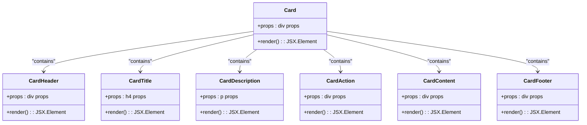

# Layout Components

<cite>
**Referenced Files in This Document**
- [App.tsx](file://src/app/App.tsx)
- [card.tsx](file://src/app/components/ui/card.tsx)
- [tabs.tsx](file://src/app/components/ui/tabs.tsx)
- [dialog.tsx](file://src/app/components/ui/dialog.tsx)
- [sheet.tsx](file://src/app/components/ui/sheet.tsx)
- [sidebar.tsx](file://src/app/components/ui/sidebar.tsx)
- [drawer.tsx](file://src/app/components/ui/drawer.tsx)
- [navigation-menu.tsx](file://src/app/components/ui/navigation-menu.tsx)
- [menubar.tsx](file://src/app/components/ui/menubar.tsx)
- [use-mobile.ts](file://src/app/components/ui/use-mobile.ts)
- [utils.ts](file://src/app/components/ui/utils.ts)
- [breadcrumb.tsx](file://src/app/components/ui/breadcrumb.tsx)
- [pagination.tsx](file://src/app/components/ui/pagination.tsx)
- [table.tsx](file://src/app/components/ui/table.tsx)
- [form.tsx](file://src/app/components/ui/form.tsx)
- [crypto-dashboard.tsx](file://src/app/components/crypto-dashboard.tsx)
- [quantum-threat-meter.tsx](file://src/app/components/quantum-threat-meter.tsx)
- [network-security.tsx](file://src/app/components/network-security.tsx)
</cite>

## Table of Contents
1. [Introduction](#introduction)
2. [Project Structure](#project-structure)
3. [Core Components](#core-components)
4. [Architecture Overview](#architecture-overview)
5. [Detailed Component Analysis](#detailed-component-analysis)
6. [Dependency Analysis](#dependency-analysis)
7. [Performance Considerations](#performance-considerations)
8. [Accessibility and Keyboard Navigation](#accessibility-and-keyboard-navigation)
9. [Styling and Animation Approaches](#styling-and-animation-approaches)
10. [Responsive Behavior](#responsive-behavior)
11. [Common Layout Patterns and Best Practices](#common-layout-patterns-and-best-practices)
12. [Troubleshooting Guide](#troubleshooting-guide)
13. [Conclusion](#conclusion)

## Introduction
This document provides comprehensive guidance for layout and navigation components that structure the application interface. It covers Card layouts, Tab systems, Dialog modals, Sheet drawers, Sidebar navigation, and Menu components. The documentation explains component composition patterns, state management for interactive elements, responsive behavior, accessibility features, keyboard navigation support, screen reader compatibility, styling approaches, animation behaviors, and integration with the overall design system. Practical examples demonstrate complex layouts combining multiple components, along with best practices for organizing application content.

## Project Structure
The layout system is implemented primarily under src/app/components/ui with modular, composable components. Utility hooks and helpers support responsive behavior and styling. Example components illustrate real-world usage patterns.

**Diagram sources**
- [App.tsx](file://src/app/App.tsx#L26-L362)
- [card.tsx](file://src/app/components/ui/card.tsx#L1-L93)
- [tabs.tsx](file://src/app/components/ui/tabs.tsx#L1-L67)
- [dialog.tsx](file://src/app/components/ui/dialog.tsx#L1-L136)
- [sheet.tsx](file://src/app/components/ui/sheet.tsx#L1-L140)
- [sidebar.tsx](file://src/app/components/ui/sidebar.tsx#L1-L727)
- [drawer.tsx](file://src/app/components/ui/drawer.tsx#L1-L133)
- [navigation-menu.tsx](file://src/app/components/ui/navigation-menu.tsx#L1-L169)
- [menubar.tsx](file://src/app/components/ui/menubar.tsx#L1-L277)
- [use-mobile.ts](file://src/app/components/ui/use-mobile.ts#L1-L22)
- [utils.ts](file://src/app/components/ui/utils.ts#L1-L7)
- [crypto-dashboard.tsx](file://src/app/components/crypto-dashboard.tsx#L1-L70)
- [quantum-threat-meter.tsx](file://src/app/components/quantum-threat-meter.tsx#L1-L149)
- [network-security.tsx](file://src/app/components/network-security.tsx#L1-L303)

**Section sources**
- [App.tsx](file://src/app/App.tsx#L26-L362)
- [use-mobile.ts](file://src/app/components/ui/use-mobile.ts#L1-L22)
- [utils.ts](file://src/app/components/ui/utils.ts#L1-L7)

## Core Components
This section introduces the primary layout and navigation components and their roles in structuring the application.

- Card family: Provides structured content containers with header, title, description, action, content, and footer slots for consistent information grouping.
- Tabs: Implements a flexible tabbed interface with triggers and content areas for organizing related content.
- Dialog: Offers overlay-based modal dialogs with portal rendering, overlay animations, and close controls.
- Sheet: Implements slide-out drawers from edges (top/right/bottom/left) with animated transitions and close affordances.
- Drawer: Touch-friendly drawer built on vaul with directional awareness and handle indicators.
- Sidebar: Full-featured navigation sidebar supporting desktop expansion/collapse, mobile off-canvas, keyboard shortcuts, tooltips, and nested menu structures.
- Menus: Menubar and Navigation Menu provide hierarchical navigation with proper ARIA semantics and animations.

**Section sources**
- [card.tsx](file://src/app/components/ui/card.tsx#L1-L93)
- [tabs.tsx](file://src/app/components/ui/tabs.tsx#L1-L67)
- [dialog.tsx](file://src/app/components/ui/dialog.tsx#L1-L136)
- [sheet.tsx](file://src/app/components/ui/sheet.tsx#L1-L140)
- [drawer.tsx](file://src/app/components/ui/drawer.tsx#L1-L133)
- [sidebar.tsx](file://src/app/components/ui/sidebar.tsx#L1-L727)
- [navigation-menu.tsx](file://src/app/components/ui/navigation-menu.tsx#L1-L169)
- [menubar.tsx](file://src/app/components/ui/menubar.tsx#L1-L277)

## Architecture Overview
The application shell composes multiple layout components to deliver a cohesive user experience. The main App orchestrates Tabs for primary navigation, integrates Cards for dashboard and analytics, and coordinates Sidebar for secondary navigation. Dialog and Sheet components manage overlays and contextual actions. Menubar and Navigation Menu provide global and contextual navigation respectively.

**Diagram sources**
- [App.tsx](file://src/app/App.tsx#L208-L316)
- [tabs.tsx](file://src/app/components/ui/tabs.tsx#L8-L66)
- [card.tsx](file://src/app/components/ui/card.tsx#L5-L92)
- [sidebar.tsx](file://src/app/components/ui/sidebar.tsx#L154-L254)
- [dialog.tsx](file://src/app/components/ui/dialog.tsx#L9-L135)
- [sheet.tsx](file://src/app/components/ui/sheet.tsx#L9-L139)
- [menubar.tsx](file://src/app/components/ui/menubar.tsx#L9-L276)
- [navigation-menu.tsx](file://src/app/components/ui/navigation-menu.tsx#L8-L168)

## Detailed Component Analysis

### Card Layout System
The Card family encapsulates content sections with semantic slots for header, title, description, action, content, and footer. Composition patterns:
- Use CardHeader with optional CardAction to align actions alongside titles.
- Pair CardTitle with CardDescription for concise labeling.
- Place interactive elements inside CardContent; reserve CardFooter for actions or summaries.

**Diagram sources**
- [card.tsx](file://src/app/components/ui/card.tsx#L5-L92)

**Section sources**
- [card.tsx](file://src/app/components/ui/card.tsx#L1-L93)
- [crypto-dashboard.tsx](file://src/app/components/crypto-dashboard.tsx#L13-L69)
- [quantum-threat-meter.tsx](file://src/app/components/quantum-threat-meter.tsx#L40-L148)

### Tab System
Tabs provide a controlled set of views with triggers and content areas. Composition patterns:
- Wrap Tabs with TabsList for trigger alignment and spacing.
- Use TabsTrigger per tab with unique values; pair with TabsContent matching the value.
- Apply responsive overflow handling for horizontal lists.

**Diagram sources**
- [tabs.tsx](file://src/app/components/ui/tabs.tsx#L8-L66)
- [App.tsx](file://src/app/App.tsx#L208-L316)

**Section sources**
- [tabs.tsx](file://src/app/components/ui/tabs.tsx#L1-L67)
- [App.tsx](file://src/app/App.tsx#L208-L316)

### Dialog Modals
Dialog enables overlay-based modals with portal rendering, overlay animations, and close controls. Composition patterns:
- Use DialogRoot to wrap trigger and content.
- Render DialogOverlay for backdrop and DialogContent for the modal container.
- Include DialogHeader/DialogFooter and DialogTitle/DialogDescription for structure.
- Add DialogClose with accessible label for dismissal.

**Diagram sources**
- [dialog.tsx](file://src/app/components/ui/dialog.tsx#L9-L135)

**Section sources**
- [dialog.tsx](file://src/app/components/ui/dialog.tsx#L1-L136)

### Sheet Drawers
Sheet implements slide-out drawers from edges with directional variants and animated transitions. Composition patterns:
- Use SheetRoot for the drawer context.
- SheetContent accepts a side prop ("top"|"right"|"bottom"|"left") with appropriate classes.
- Combine SheetPortal and SheetOverlay for proper stacking and backdrop.
- Include SheetHeader/SheetFooter and SheetTitle/SheetDescription for structure.

**Diagram sources**
- [sheet.tsx](file://src/app/components/ui/sheet.tsx#L47-L82)

**Section sources**
- [sheet.tsx](file://src/app/components/ui/sheet.tsx#L1-L140)

### Sidebar Navigation
Sidebar provides a robust navigation solution with desktop expansion/collapse, mobile off-canvas, keyboard shortcuts, tooltips, and nested menus. Composition patterns:
- Wrap the application with SidebarProvider to manage state and context.
- Use Sidebar with side, variant, and collapsible options.
- Use SidebarTrigger to toggle sidebar; SidebarRail provides hover resizing for desktop.
- Structure content with SidebarHeader, SidebarContent, SidebarFooter, and SidebarMenu groups.
- Integrate with Sheet for mobile behavior; use useIsMobile hook for responsive logic.

**Diagram sources**
- [sidebar.tsx](file://src/app/components/ui/sidebar.tsx#L56-L152)
- [sidebar.tsx](file://src/app/components/ui/sidebar.tsx#L154-L254)
- [use-mobile.ts](file://src/app/components/ui/use-mobile.ts#L1-L22)

**Section sources**
- [sidebar.tsx](file://src/app/components/ui/sidebar.tsx#L1-L727)
- [use-mobile.ts](file://src/app/components/ui/use-mobile.ts#L1-L22)

### Menu Components
Menus provide hierarchical navigation with proper semantics and animations:
- Menubar offers top-level application menus with items, separators, and submenus.
- Navigation Menu supports dropdowns with viewport-aware positioning and smooth transitions.

**Diagram sources**
- [menubar.tsx](file://src/app/components/ui/menubar.tsx#L9-L276)
- [navigation-menu.tsx](file://src/app/components/ui/navigation-menu.tsx#L8-L168)

**Section sources**
- [menubar.tsx](file://src/app/components/ui/menubar.tsx#L1-L277)
- [navigation-menu.tsx](file://src/app/components/ui/navigation-menu.tsx#L1-L169)

### Drawer Component
Drawer provides touch-friendly slide-up/down panels using vaul with directional awareness and subtle handle indicators.

**Diagram sources**
- [drawer.tsx](file://src/app/components/ui/drawer.tsx#L8-L73)

**Section sources**
- [drawer.tsx](file://src/app/components/ui/drawer.tsx#L1-L133)

## Dependency Analysis
Components rely on shared utilities and responsive hooks. Sidebar integrates with Sheet and Tooltip; Menus integrate with Radix UI primitives. Styling is unified via cn utility.

**Diagram sources**
- [sidebar.tsx](file://src/app/components/ui/sidebar.tsx#L1-L27)
- [sheet.tsx](file://src/app/components/ui/sheet.tsx#L1-L8)
- [drawer.tsx](file://src/app/components/ui/drawer.tsx#L1-L6)
- [dialog.tsx](file://src/app/components/ui/dialog.tsx#L1-L7)
- [tabs.tsx](file://src/app/components/ui/tabs.tsx#L1-L6)
- [card.tsx](file://src/app/components/ui/card.tsx#L1-L3)
- [navigation-menu.tsx](file://src/app/components/ui/navigation-menu.tsx#L1-L6)
- [menubar.tsx](file://src/app/components/ui/menubar.tsx#L1-L7)
- [utils.ts](file://src/app/components/ui/utils.ts#L1-L7)
- [use-mobile.ts](file://src/app/components/ui/use-mobile.ts#L1-L3)

**Section sources**
- [sidebar.tsx](file://src/app/components/ui/sidebar.tsx#L1-L27)
- [sheet.tsx](file://src/app/components/ui/sheet.tsx#L1-L8)
- [drawer.tsx](file://src/app/components/ui/drawer.tsx#L1-L6)
- [dialog.tsx](file://src/app/components/ui/dialog.tsx#L1-L7)
- [tabs.tsx](file://src/app/components/ui/tabs.tsx#L1-L6)
- [card.tsx](file://src/app/components/ui/card.tsx#L1-L3)
- [navigation-menu.tsx](file://src/app/components/ui/navigation-menu.tsx#L1-L6)
- [menubar.tsx](file://src/app/components/ui/menubar.tsx#L1-L7)
- [utils.ts](file://src/app/components/ui/utils.ts#L1-L7)
- [use-mobile.ts](file://src/app/components/ui/use-mobile.ts#L1-L3)

## Performance Considerations
- Prefer lightweight wrappers and minimal DOM nesting in layout components to reduce render cost.
- Use CSS custom properties and data-state attributes for efficient styling without heavy JS computations.
- Leverage portals for overlays to avoid deep DOM traversal and maintain proper stacking contexts.
- Defer heavy computations in responsive hooks; memoize derived values to prevent unnecessary re-renders.
- Use CSS transitions and transforms for animations rather than layout-affecting properties.

## Accessibility and Keyboard Navigation
- Dialog and Sheet include sr-only labels for close buttons and screen-reader-friendly headers.
- Tabs implement proper ARIA roles and keyboard navigation with focus-visible rings.
- Menus and Navigation Menu provide keyboard navigation and focus management.
- Sidebar supports keyboard shortcuts (Ctrl/Cmd + B) to toggle visibility.
- Breadcrumb and Pagination components include ARIA labels and roles for assistive technologies.

**Section sources**
- [dialog.tsx](file://src/app/components/ui/dialog.tsx#L66-L69)
- [sheet.tsx](file://src/app/components/ui/sheet.tsx#L74-L78)
- [tabs.tsx](file://src/app/components/ui/tabs.tsx#L37-L51)
- [menubar.tsx](file://src/app/components/ui/menubar.tsx#L51-L65)
- [navigation-menu.tsx](file://src/app/components/ui/navigation-menu.tsx#L65-L83)
- [sidebar.tsx](file://src/app/components/ui/sidebar.tsx#L96-L110)
- [breadcrumb.tsx](file://src/app/components/ui/breadcrumb.tsx#L7-L9)
- [pagination.tsx](file://src/app/components/ui/pagination.tsx#L11-L21)

## Styling and Animation Approaches
- Styling unification: All components use a cn utility that merges clsx and tailwind-merge for predictable class composition.
- Responsive breakpoints: useIsMobile hook standardizes mobile detection across components.
- Animations: Overlay components use data-state attributes with fade/zoom/slide transitions; Sheet and Drawer apply direction-specific animations.
- Theming: Components reference semantic color tokens (e.g., background, foreground, muted, border) for consistent appearance across modes.

**Section sources**
- [utils.ts](file://src/app/components/ui/utils.ts#L1-L7)
- [use-mobile.ts](file://src/app/components/ui/use-mobile.ts#L1-L22)
- [dialog.tsx](file://src/app/components/ui/dialog.tsx#L33-L73)
- [sheet.tsx](file://src/app/components/ui/sheet.tsx#L31-L82)
- [drawer.tsx](file://src/app/components/ui/drawer.tsx#L32-L73)

## Responsive Behavior
- Mobile-first design: Sidebar switches to Sheet on small screens; Tabs list uses horizontal scrolling for narrow widths.
- Breakpoint-driven toggles: useIsMobile determines mobile vs desktop rendering for overlays and navigation.
- Adaptive layouts: Cards and dashboard components use CSS Grid with responsive column counts.

**Diagram sources**
- [use-mobile.ts](file://src/app/components/ui/use-mobile.ts#L5-L21)
- [sidebar.tsx](file://src/app/components/ui/sidebar.tsx#L183-L205)
- [App.tsx](file://src/app/App.tsx#L208-L248)

**Section sources**
- [use-mobile.ts](file://src/app/components/ui/use-mobile.ts#L1-L22)
- [sidebar.tsx](file://src/app/components/ui/sidebar.tsx#L183-L205)
- [App.tsx](file://src/app/App.tsx#L208-L248)

## Common Layout Patterns and Best Practices
- Dashboard composition: Use Card grids for metrics and KPIs; pair with progress bars and badges for emphasis.
- Tabbed workflows: Group related tasks under Tabs; keep triggers concise and descriptive.
- Modal overlays: Use Dialog for confirmations and forms; Sheet for contextual filters or actions.
- Navigation hierarchy: Menubar for global actions; Sidebar for primary navigation; Navigation Menu for contextual sections.
- Content organization: Breadcrumb for location context; Pagination for large datasets; Table for structured data.

**Section sources**
- [crypto-dashboard.tsx](file://src/app/components/crypto-dashboard.tsx#L13-L69)
- [quantum-threat-meter.tsx](file://src/app/components/quantum-threat-meter.tsx#L40-L148)
- [network-security.tsx](file://src/app/components/network-security.tsx#L19-L302)
- [App.tsx](file://src/app/App.tsx#L208-L316)

## Troubleshooting Guide
- Overlays not closing: Ensure Dialog/Sheet/Drawer Close controls are present and accessible; verify portal mounting/unmounting.
- Sidebar not toggling: Confirm SidebarProvider wraps the application and useSidebar is used within Sidebar components.
- Focus issues in Tabs: Verify focus-visible rings and keyboard navigation; ensure triggers have unique values.
- Mobile responsiveness: Test useIsMobile behavior across devices; adjust breakpoints as needed.
- Styling conflicts: Use cn utility consistently; avoid overriding semantic tokens directly.

**Section sources**
- [dialog.tsx](file://src/app/components/ui/dialog.tsx#L9-L135)
- [sheet.tsx](file://src/app/components/ui/sheet.tsx#L9-L139)
- [sidebar.tsx](file://src/app/components/ui/sidebar.tsx#L47-L54)
- [tabs.tsx](file://src/app/components/ui/tabs.tsx#L37-L51)
- [use-mobile.ts](file://src/app/components/ui/use-mobile.ts#L1-L22)
- [utils.ts](file://src/app/components/ui/utils.ts#L1-L7)

## Conclusion
The layout and navigation components form a cohesive system for building structured, accessible, and responsive applications. By composing Cards, Tabs, Dialogs, Sheets, Drawers, Sidebars, and Menus thoughtfully, developers can create intuitive interfaces that adapt across devices while maintaining consistent styling and behavior. Following the patterns and best practices outlined here ensures predictable user experiences and maintainable codebases.