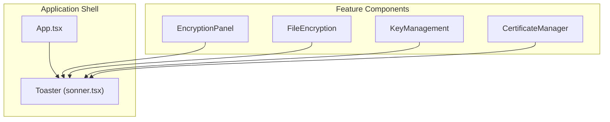
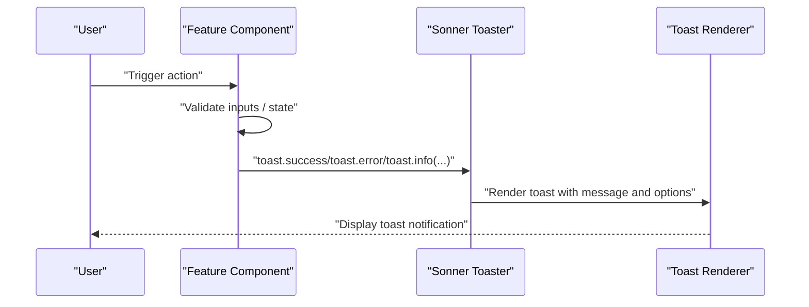
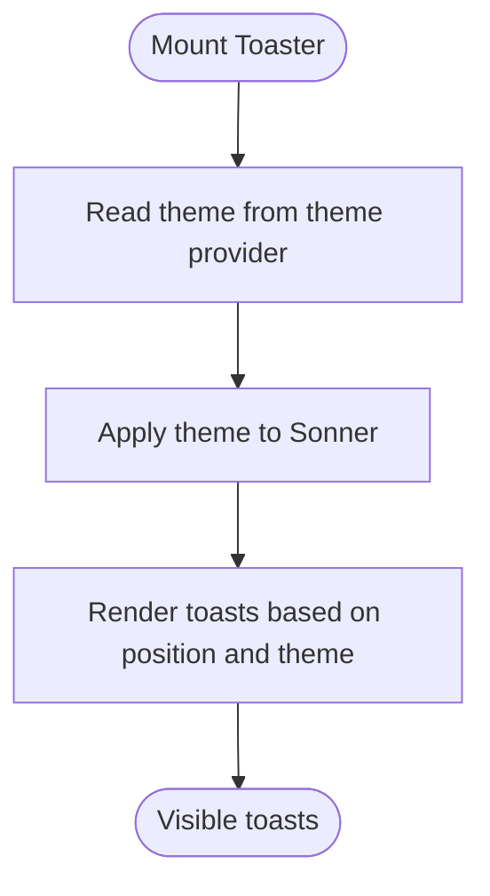
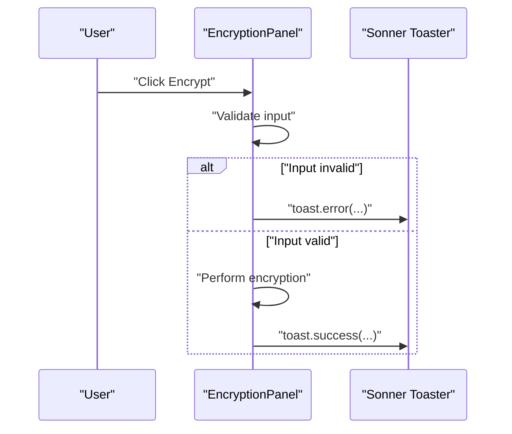
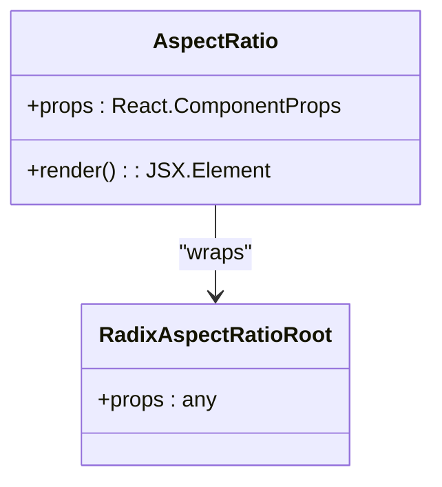
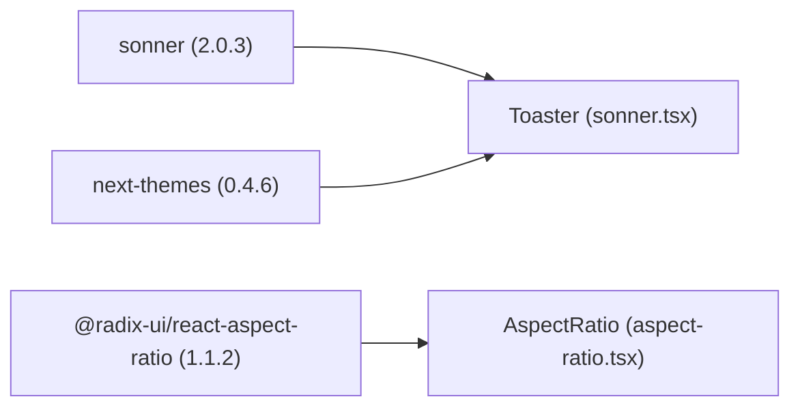

# Notification Components

<cite>
**Referenced Files in This Document**
- [App.tsx](file://src/app/App.tsx)
- [sonner.tsx](file://src/app/components/ui/sonner.tsx)
- [aspect-ratio.tsx](file://src/app/components/ui/aspect-ratio.tsx)
- [encryption-panel.tsx](file://src/app/components/encryption-panel.tsx)
- [file-encryption.tsx](file://src/app/components/file-encryption.tsx)
- [key-management.tsx](file://src/app/components/key-management.tsx)
- [certificate-manager.tsx](file://src/app/components/certificate-manager.tsx)
- [package.json](file://package.json)
- [README.md](file://README.md)
</cite>

## Table of Contents
1. [Introduction](#introduction)
2. [Project Structure](#project-structure)
3. [Core Components](#core-components)
4. [Architecture Overview](#architecture-overview)
5. [Detailed Component Analysis](#detailed-component-analysis)
6. [Dependency Analysis](#dependency-analysis)
7. [Performance Considerations](#performance-considerations)
8. [Accessibility Considerations](#accessibility-considerations)
9. [Troubleshooting Guide](#troubleshooting-guide)
10. [Conclusion](#conclusion)

## Introduction
This document explains two specialized UI components that enhance user feedback and content presentation:
- Sonner notification system for toast notifications
- Aspect Ratio component for responsive media display

It covers notification positioning, timing, and user interaction patterns, as well as how the Aspect Ratio component maintains media proportions across screen sizes. Examples include success confirmations, error messaging, and informational alerts. Accessibility and responsive design considerations are addressed to ensure inclusive and adaptable experiences.

## Project Structure
The notification and display components are integrated into the main application shell and consumed by domain-specific features:
- The Sonner Toaster is mounted globally in the application layout
- Toasts are triggered from feature components during user actions
- The Aspect Ratio primitive is exposed as a thin wrapper for consistent usage

**Diagram sources**
- [App.tsx](file://src/app/App.tsx#L356-L357)
- [sonner.tsx](file://src/app/components/ui/sonner.tsx#L1-L26)

**Section sources**
- [App.tsx](file://src/app/App.tsx#L1-L362)
- [sonner.tsx](file://src/app/components/ui/sonner.tsx#L1-L26)
- [aspect-ratio.tsx](file://src/app/components/ui/aspect-ratio.tsx#L1-L12)

## Core Components
- Sonner Toaster: A themed, styled wrapper around the Sonner toast library, configured with theme-aware CSS variables and a consistent class name for styling hooks.
- Aspect Ratio: A minimal wrapper around Radix UI’s AspectRatio primitive, exposing a single component for consistent usage across the design system.

These components are foundational building blocks that support broader user feedback and media presentation needs.

**Section sources**
- [sonner.tsx](file://src/app/components/ui/sonner.tsx#L1-L26)
- [aspect-ratio.tsx](file://src/app/components/ui/aspect-ratio.tsx#L1-L12)

## Architecture Overview
The notification system follows a centralized pattern:
- The Toaster is declared once in the application root
- Feature components import the toast API and call it on user interactions
- Sonner renders toasts according to the configured position and theme

**Diagram sources**
- [App.tsx](file://src/app/App.tsx#L356-L357)
- [encryption-panel.tsx](file://src/app/components/encryption-panel.tsx#L45-L61)
- [file-encryption.tsx](file://src/app/components/file-encryption.tsx#L82-L83)
- [key-management.tsx](file://src/app/components/key-management.tsx#L46-L48)
- [certificate-manager.tsx](file://src/app/components/certificate-manager.tsx#L78-L79)

## Detailed Component Analysis

### Sonner Toaster Component
The Toaster component:
- Reads the current theme via a theme provider hook
- Passes the theme to Sonner
- Applies a consistent class name and CSS custom properties for background, text, and border tokens
- Accepts additional props to customize behavior (e.g., position)

Usage in the application:
- Mounted at the application root with a top-right position for optimal visibility without blocking primary content

Notification patterns observed across features:
- Success confirmations after successful operations
- Error messages for invalid inputs or failures
- Informational alerts for list updates or removals

**Diagram sources**
- [sonner.tsx](file://src/app/components/ui/sonner.tsx#L6-L22)
- [App.tsx](file://src/app/App.tsx#L356-L357)

**Section sources**
- [sonner.tsx](file://src/app/components/ui/sonner.tsx#L1-L26)
- [App.tsx](file://src/app/App.tsx#L356-L357)

### Notification Workflows and Examples
Below are representative workflows for each toast category, derived from feature components:

- Success confirmations
  - Encryption panel: successful encryption and decryption
  - File encryption: successful file encryption and download
  - Key management: key pair generation and export
  - Certificate manager: certificate creation and export/revoke

- Error messaging
  - Encryption panel: missing plaintext or ciphertext
  - Certificate manager: missing required form fields

- Warning/alert information
  - File encryption: removal of a file from the list

**Diagram sources**
- [encryption-panel.tsx](file://src/app/components/encryption-panel.tsx#L45-L61)

**Section sources**
- [encryption-panel.tsx](file://src/app/components/encryption-panel.tsx#L45-L96)
- [file-encryption.tsx](file://src/app/components/file-encryption.tsx#L82-L105)
- [key-management.tsx](file://src/app/components/key-management.tsx#L46-L89)
- [certificate-manager.tsx](file://src/app/components/certificate-manager.tsx#L51-L80)

### Aspect Ratio Component
The Aspect Ratio component:
- Wraps the Radix UI AspectRatio primitive
- Adds a data-slot attribute for consistent selection in testing and styling
- Exposes the underlying primitive’s props interface

Role in responsive media display:
- Ensures media containers maintain a fixed width-to-height ratio across breakpoints
- Prevents layout shift and preserves visual fidelity for images, videos, and 3D scenes
- Works seamlessly with container queries and responsive grids

**Diagram sources**
- [aspect-ratio.tsx](file://src/app/components/ui/aspect-ratio.tsx#L5-L9)

**Section sources**
- [aspect-ratio.tsx](file://src/app/components/ui/aspect-ratio.tsx#L1-L12)

## Dependency Analysis
External libraries and their roles:
- Sonner: toast notification rendering and animation
- next-themes: theme-awareness for consistent appearance
- @radix-ui/react-aspect-ratio: primitives for aspect-ratio maintenance

**Diagram sources**
- [package.json](file://package.json#L62-L62)
- [package.json](file://package.json#L52-L52)
- [package.json](file://package.json#L18-L18)

**Section sources**
- [package.json](file://package.json#L1-L93)

## Performance Considerations
- Toast rendering: Keep messages concise and avoid excessive toast bursts; batch related updates when possible
- Theme switching: next-themes efficiently toggles classes; avoid forcing unnecessary re-renders by minimizing theme-dependent computations outside the Toaster
- Aspect ratio containers: Prefer CSS-based aspect-ratio utilities for simple cases; reserve the Aspect Ratio primitive for dynamic or complex layouts
- Animation costs: Limit heavy animations in toasts; use lightweight transitions for quick feedback

## Accessibility Considerations
- Focus management: Ensure toasts do not trap focus; allow keyboard navigation to remain unaffected
- Screen readers: Provide clear, descriptive messages; avoid relying solely on icons for critical information
- Color contrast: Verify sufficient contrast between toast backgrounds and text; leverage theme-aware tokens for consistency
- Motion sensitivity: Respect reduced motion preferences; avoid persistent auto-dismiss timers for users who need more time to read messages
- Positioning: Place toasts where they do not overlap critical controls; top-right is commonly used but test with assistive technologies

## Troubleshooting Guide
- Toasts not appearing
  - Confirm the Toaster is rendered in the application shell
  - Verify the toast API is imported and called from the intended component
  - Check for console errors that might prevent rendering

- Incorrect theme or styling
  - Ensure the theme provider is initialized at the root
  - Confirm CSS custom properties are applied consistently

- Aspect ratio not maintained
  - Verify the Aspect Ratio container wraps the intended child
  - Check for overriding styles that reset aspect-ratio behavior

- Performance issues
  - Reduce the frequency of toast triggers during bulk operations
  - Defer non-critical updates until after intensive tasks complete

**Section sources**
- [App.tsx](file://src/app/App.tsx#L356-L357)
- [sonner.tsx](file://src/app/components/ui/sonner.tsx#L1-L26)
- [aspect-ratio.tsx](file://src/app/components/ui/aspect-ratio.tsx#L1-L12)

## Conclusion
The Sonner Toaster and Aspect Ratio components provide robust foundations for user feedback and media presentation. By centralizing toast configuration and leveraging theme-aware styling, the system delivers consistent, accessible notifications. The Aspect Ratio component ensures media integrity across devices. Together, they support a responsive, inclusive, and user-friendly interface aligned with modern design practices.