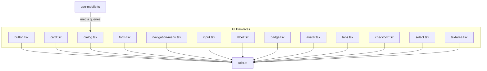
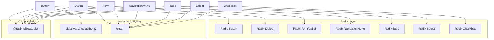
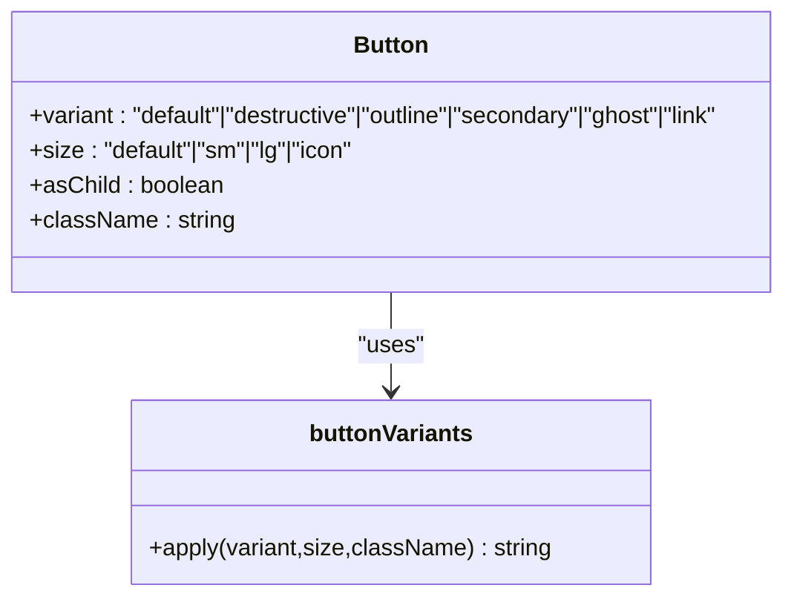
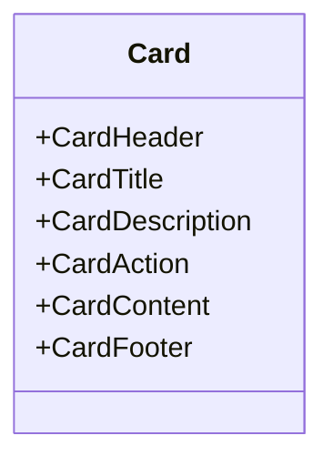
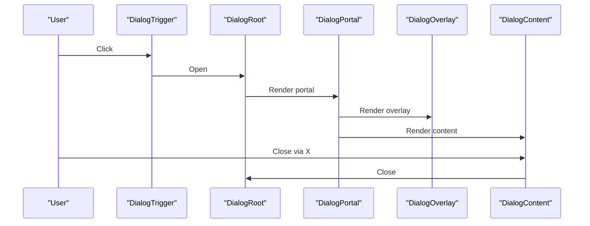
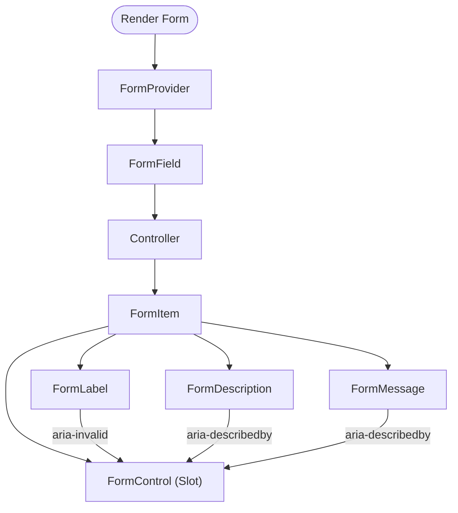
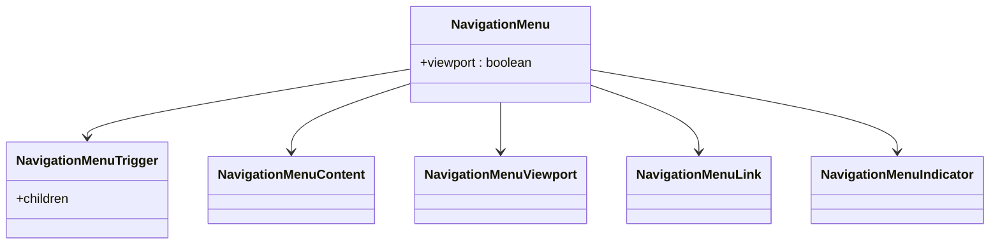
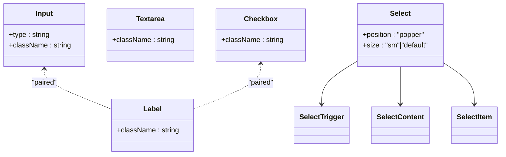
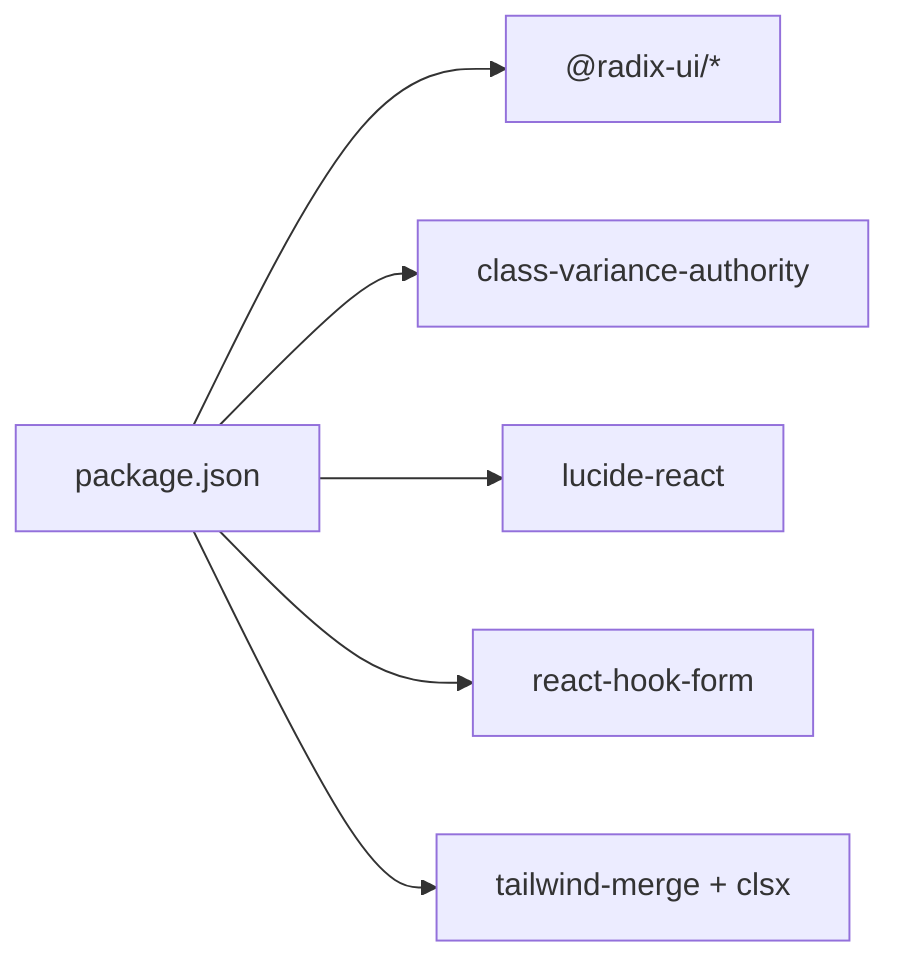
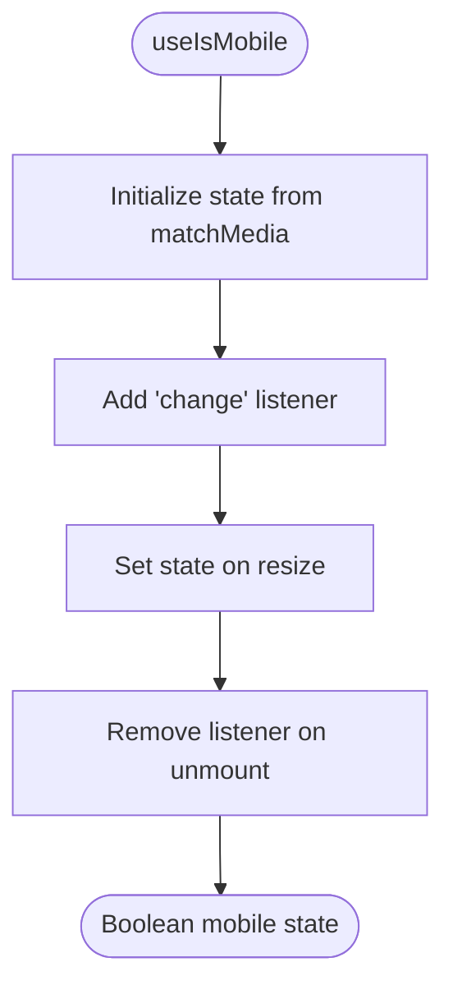

# UI Components

<cite>
**Referenced Files in This Document**
- [button.tsx](file://Design/src/app/components/ui/button.tsx)
- [card.tsx](file://Design/src/app/components/ui/card.tsx)
- [dialog.tsx](file://Design/src/app/components/ui/dialog.tsx)
- [form.tsx](file://Design/src/app/components/ui/form.tsx)
- [navigation-menu.tsx](file://Design/src/app/components/ui/navigation-menu.tsx)
- [input.tsx](file://Design/src/app/components/ui/input.tsx)
- [label.tsx](file://Design/src/app/components/ui/label.tsx)
- [badge.tsx](file://Design/src/app/components/ui/badge.tsx)
- [avatar.tsx](file://Design/src/app/components/ui/avatar.tsx)
- [tabs.tsx](file://Design/src/app/components/ui/tabs.tsx)
- [checkbox.tsx](file://Design/src/app/components/ui/checkbox.tsx)
- [select.tsx](file://Design/src/app/components/ui/select.tsx)
- [textarea.tsx](file://Design/src/app/components/ui/textarea.tsx)
- [utils.ts](file://Design/src/app/components/ui/utils.ts)
- [use-mobile.ts](file://Design/src/app/components/ui/use-mobile.ts)
- [package.json](file://Design/package.json)
</cite>

## Table of Contents
1. [Introduction](#introduction)
2. [Project Structure](#project-structure)
3. [Core Components](#core-components)
4. [Architecture Overview](#architecture-overview)
5. [Detailed Component Analysis](#detailed-component-analysis)
6. [Dependency Analysis](#dependency-analysis)
7. [Performance Considerations](#performance-considerations)
8. [Accessibility Features](#accessibility-features)
9. [Responsive Design](#responsive-design)
10. [Integration with Tailwind CSS](#integration-with-tailwind-css)
11. [Usage Examples](#usage-examples)
12. [Utility Functions and Helpers](#utility-functions-and-helpers)
13. [Component Composition Strategies](#component-composition-strategies)
14. [State Management Integration](#state-management-integration)
15. [Best Practices for Extension](#best-practices-for-extension)
16. [Troubleshooting Guide](#troubleshooting-guide)
17. [Conclusion](#conclusion)

## Introduction
This document describes the UI component library for the Post-Quantum Cryptography Educational Platform. It focuses on reusable Radix UI-based primitives for buttons, cards, forms, dialogs, and navigation elements. The guide explains composition patterns, prop interfaces, customization options, accessibility, responsiveness, and Tailwind CSS integration. It also provides usage guidance, utility helpers, and extension best practices tailored to an educational platform’s needs.

## Project Structure
The UI primitives live under Design/src/app/components/ui and are built on:
- Radix UI primitives for accessible base behaviors
- class-variance-authority for variant-driven styling
- Tailwind CSS for utility-first styling
- lucide-react icons for visual affordances
- react-hook-form for form state and validation

**Diagram sources**
- [button.tsx](file://Design/src/app/components/ui/button.tsx#L1-L58)
- [card.tsx](file://Design/src/app/components/ui/card.tsx#L1-L93)
- [dialog.tsx](file://Design/src/app/components/ui/dialog.tsx#L1-L136)
- [form.tsx](file://Design/src/app/components/ui/form.tsx#L1-L169)
- [navigation-menu.tsx](file://Design/src/app/components/ui/navigation-menu.tsx#L1-L169)
- [input.tsx](file://Design/src/app/components/ui/input.tsx#L1-L22)
- [label.tsx](file://Design/src/app/components/ui/label.tsx#L1-L25)
- [badge.tsx](file://Design/src/app/components/ui/badge.tsx#L1-L47)
- [avatar.tsx](file://Design/src/app/components/ui/avatar.tsx#L1-L54)
- [tabs.tsx](file://Design/src/app/components/ui/tabs.tsx#L1-L67)
- [checkbox.tsx](file://Design/src/app/components/ui/checkbox.tsx#L1-L33)
- [select.tsx](file://Design/src/app/components/ui/select.tsx#L1-L190)
- [textarea.tsx](file://Design/src/app/components/ui/textarea.tsx#L1-L19)
- [utils.ts](file://Design/src/app/components/ui/utils.ts#L1-L7)
- [use-mobile.ts](file://Design/src/app/components/ui/use-mobile.ts#L1-L22)

**Section sources**
- [package.json](file://Design/package.json#L10-L68)

## Core Components
This section summarizes the primary UI primitives and their roles:
- Button: Variants and sizes with gradient overlays and focus rings
- Card: Composite layout with header, title, description, action, content, footer
- Dialog: Root, Trigger, Portal, Overlay, Content, Header/Footer, Title/Description
- Form: Provider, Field, Item, Label, Control, Description, Message with react-hook-form
- NavigationMenu: Root, List, Item, Trigger, Content, Viewport, Link, Indicator
- Inputs: Input, Label, Textarea, Select (with trigger/content/items), Checkbox
- Tabs: Root, List, Trigger, Content
- Badge, Avatar: Auxiliary display components

Each component exposes a consistent pattern:
- Accepts className and forwards data-slot attributes for testing and styling hooks
- Uses cn(...) for merging Tailwind classes safely
- Leverages Radix UI primitives for accessibility and behavior

**Section sources**
- [button.tsx](file://Design/src/app/components/ui/button.tsx#L7-L35)
- [card.tsx](file://Design/src/app/components/ui/card.tsx#L5-L82)
- [dialog.tsx](file://Design/src/app/components/ui/dialog.tsx#L9-L122)
- [form.tsx](file://Design/src/app/components/ui/form.tsx#L19-L157)
- [navigation-menu.tsx](file://Design/src/app/components/ui/navigation-menu.tsx#L8-L156)
- [input.tsx](file://Design/src/app/components/ui/input.tsx#L5-L18)
- [label.tsx](file://Design/src/app/components/ui/label.tsx#L8-L21)
- [badge.tsx](file://Design/src/app/components/ui/badge.tsx#L7-L44)
- [avatar.tsx](file://Design/src/app/components/ui/avatar.tsx#L8-L51)
- [tabs.tsx](file://Design/src/app/components/ui/tabs.tsx#L8-L64)
- [checkbox.tsx](file://Design/src/app/components/ui/checkbox.tsx#L9-L29)
- [select.tsx](file://Design/src/app/components/ui/select.tsx#L13-L189)
- [textarea.tsx](file://Design/src/app/components/ui/textarea.tsx#L5-L15)

## Architecture Overview
The UI library follows a layered architecture:
- Base primitives: Radix UI roots/triggers/content
- Styling layer: cn(...) merges clsx and tailwind-merge
- Variants: class-variance-authority for variant/sizing
- Composition: Slot-based asChild pattern for flexibility
- Accessibility: Proper ARIA attributes and keyboard navigation via Radix UI

**Diagram sources**
- [button.tsx](file://Design/src/app/components/ui/button.tsx#L1-L58)
- [dialog.tsx](file://Design/src/app/components/ui/dialog.tsx#L1-L136)
- [form.tsx](file://Design/src/app/components/ui/form.tsx#L1-L169)
- [navigation-menu.tsx](file://Design/src/app/components/ui/navigation-menu.tsx#L1-L169)
- [tabs.tsx](file://Design/src/app/components/ui/tabs.tsx#L1-L67)
- [select.tsx](file://Design/src/app/components/ui/select.tsx#L1-L190)
- [checkbox.tsx](file://Design/src/app/components/ui/checkbox.tsx#L1-L33)
- [utils.ts](file://Design/src/app/components/ui/utils.ts#L4-L6)

## Detailed Component Analysis

### Button
- Purpose: Primary interactive element with variants and sizes
- Props:
  - variant: default, destructive, outline, secondary, ghost, link
  - size: default, sm, lg, icon
  - asChild: render as child element via Slot
  - className and native button props
- Behavior:
  - Gradient overlay on hover via pseudo-element
  - Focus ring with ring color variants
  - Disabled state handled via pointer-events and opacity
- Accessibility:
  - Inherits Radix focus-visible behavior
  - Supports aria-invalid for form integration

**Diagram sources**
- [button.tsx](file://Design/src/app/components/ui/button.tsx#L37-L56)

**Section sources**
- [button.tsx](file://Design/src/app/components/ui/button.tsx#L7-L35)

### Card
- Purpose: Container with structured header, title, description, action, content, footer
- Composition:
  - CardHeader supports optional action placement via CSS grid
  - CardContent and CardFooter apply consistent padding
- Responsive:
  - Uses container queries for header layout adjustments

**Diagram sources**
- [card.tsx](file://Design/src/app/components/ui/card.tsx#L5-L92)

**Section sources**
- [card.tsx](file://Design/src/app/components/ui/card.tsx#L18-L82)

### Dialog
- Purpose: Modal overlay with focus management and animations
- Composition:
  - Root, Trigger, Portal, Overlay, Content, Close
  - Header/Footer, Title, Description for structured modals
- Accessibility:
  - Focus trapping and Escape key handling via Radix
  - Close button with screen-reader label

**Diagram sources**
- [dialog.tsx](file://Design/src/app/components/ui/dialog.tsx#L9-L73)

**Section sources**
- [dialog.tsx](file://Design/src/app/components/ui/dialog.tsx#L33-L73)

### Form
- Purpose: Accessible form system integrated with react-hook-form
- Composition:
  - Form (FormProvider), FormField, FormItem
  - FormLabel, FormControl (Slot), FormDescription, FormMessage
- Hooks:
  - useFormField provides ids and error state for accessibility
- Accessibility:
  - Proper aria-describedby and aria-invalid mapping
  - Label links to controls via htmlFor

**Diagram sources**
- [form.tsx](file://Design/src/app/components/ui/form.tsx#L19-L157)

**Section sources**
- [form.tsx](file://Design/src/app/components/ui/form.tsx#L45-L66)

### NavigationMenu
- Purpose: Multi-level navigation with viewport and indicator
- Composition:
  - Root, List, Item, Trigger, Content, Viewport, Link, Indicator
- Behavior:
  - Animated transitions and motion-aware classes
  - Chevron rotation on open state
- Accessibility:
  - Keyboard navigation and focus management via Radix

**Diagram sources**
- [navigation-menu.tsx](file://Design/src/app/components/ui/navigation-menu.tsx#L8-L167)

**Section sources**
- [navigation-menu.tsx](file://Design/src/app/components/ui/navigation-menu.tsx#L61-L100)

### Inputs and Controls
- Input: Styled text input with focus rings and invalid state
- Label: Styled label with group/disabled states
- Textarea: Multiline input with resize disabled
- Checkbox: Styled checkbox with indicator
- Select: Complex composite with trigger, content, items, separators, scroll buttons

**Diagram sources**
- [input.tsx](file://Design/src/app/components/ui/input.tsx#L5-L18)
- [label.tsx](file://Design/src/app/components/ui/label.tsx#L8-L21)
- [textarea.tsx](file://Design/src/app/components/ui/textarea.tsx#L5-L15)
- [checkbox.tsx](file://Design/src/app/components/ui/checkbox.tsx#L9-L29)
- [select.tsx](file://Design/src/app/components/ui/select.tsx#L13-L189)

**Section sources**
- [input.tsx](file://Design/src/app/components/ui/input.tsx#L5-L18)
- [label.tsx](file://Design/src/app/components/ui/label.tsx#L8-L21)
- [textarea.tsx](file://Design/src/app/components/ui/textarea.tsx#L5-L15)
- [checkbox.tsx](file://Design/src/app/components/ui/checkbox.tsx#L9-L29)
- [select.tsx](file://Design/src/app/components/ui/select.tsx#L31-L189)

### Tabs
- Purpose: Organized content sections with keyboard navigation
- Composition:
  - Tabs, TabsList, TabsTrigger, TabsContent
- Behavior:
  - Active state styling and focus rings
  - Responsive layout with gap and padding

**Section sources**
- [tabs.tsx](file://Design/src/app/components/ui/tabs.tsx#L8-L64)

### Badge and Avatar
- Badge: Variant-driven labels with focus-visible rings
- Avatar: Image with fallback handling

**Section sources**
- [badge.tsx](file://Design/src/app/components/ui/badge.tsx#L7-L44)
- [avatar.tsx](file://Design/src/app/components/ui/avatar.tsx#L8-L51)

## Dependency Analysis
External libraries and their roles:
- @radix-ui/*: Accessible base primitives
- class-variance-authority: Variant composition
- lucide-react: Icons
- react-hook-form: Form state and validation
- tailwind-merge + clsx: Safe class merging

**Diagram sources**
- [package.json](file://Design/package.json#L10-L68)

**Section sources**
- [package.json](file://Design/package.json#L10-L68)

## Performance Considerations
- Prefer variants and sizes over ad-hoc overrides to minimize CSS bloat
- Use asChild patterns sparingly; excessive indirection can increase render cost
- Keep animation durations reasonable; current components use short durations for snappy feedback
- Memoize heavy computations outside components; rely on Radix for low-level event handling

## Accessibility Features
- All interactive components expose focus-visible rings and outline-none defaults
- Dialog enforces focus trapping and Escape handling
- Form components set aria-invalid and aria-describedby for assistive tech
- Labels associate with controls via htmlFor
- Select and NavigationMenu manage keyboard navigation and ARIA states

**Section sources**
- [dialog.tsx](file://Design/src/app/components/ui/dialog.tsx#L57-L70)
- [form.tsx](file://Design/src/app/components/ui/form.tsx#L107-L124)
- [label.tsx](file://Design/src/app/components/ui/label.tsx#L12-L21)
- [select.tsx](file://Design/src/app/components/ui/select.tsx#L62-L90)
- [navigation-menu.tsx](file://Design/src/app/components/ui/navigation-menu.tsx#L65-L83)

## Responsive Design
- Mobile detection hook:
  - useIsMobile uses matchMedia and change events to track viewport width below 768px
- Responsive sizing:
  - Buttons and inputs define size-specific paddings and heights
  - NavigationMenu adjusts viewport behavior based on data-viewport flag
  - Cards and forms use responsive spacing and grid layouts

**Diagram sources**
- [use-mobile.ts](file://Design/src/app/components/ui/use-mobile.ts#L5-L21)

**Section sources**
- [use-mobile.ts](file://Design/src/app/components/ui/use-mobile.ts#L3-L21)
- [button.tsx](file://Design/src/app/components/ui/button.tsx#L23-L28)
- [input.tsx](file://Design/src/app/components/ui/input.tsx#L10-L15)
- [navigation-menu.tsx](file://Design/src/app/components/ui/navigation-menu.tsx#L11-L29)

## Integration with Tailwind CSS
- cn(...) merges classes using clsx and tailwind-merge to avoid conflicts
- Components apply semantic Tailwind classes and focus-visible rings
- Utility classes consistently use data-slot attributes for testability

**Section sources**
- [utils.ts](file://Design/src/app/components/ui/utils.ts#L4-L6)

## Usage Examples
Below are example scenarios demonstrating proper implementation patterns. Replace the “...” with your own props and children.

- Button
  - Example: [button.tsx](file://Design/src/app/components/ui/button.tsx#L37-L56)
- Card
  - Example: [card.tsx](file://Design/src/app/components/ui/card.tsx#L5-L92)
- Dialog
  - Example: [dialog.tsx](file://Design/src/app/components/ui/dialog.tsx#L9-L73)
- Form
  - Example: [form.tsx](file://Design/src/app/components/ui/form.tsx#L19-L157)
- NavigationMenu
  - Example: [navigation-menu.tsx](file://Design/src/app/components/ui/navigation-menu.tsx#L8-L167)
- Inputs and Controls
  - Example: [input.tsx](file://Design/src/app/components/ui/input.tsx#L5-L18)
  - Example: [label.tsx](file://Design/src/app/components/ui/label.tsx#L8-L21)
  - Example: [textarea.tsx](file://Design/src/app/components/ui/textarea.tsx#L5-L15)
  - Example: [checkbox.tsx](file://Design/src/app/components/ui/checkbox.tsx#L9-L29)
  - Example: [select.tsx](file://Design/src/app/components/ui/select.tsx#L13-L189)
- Tabs
  - Example: [tabs.tsx](file://Design/src/app/components/ui/tabs.tsx#L8-L64)
- Badge and Avatar
  - Example: [badge.tsx](file://Design/src/app/components/ui/badge.tsx#L28-L44)
  - Example: [avatar.tsx](file://Design/src/app/components/ui/avatar.tsx#L8-L51)

## Utility Functions and Helpers
- cn: Merges and deduplicates Tailwind classes
- useIsMobile: Detects mobile viewport for responsive behavior

**Section sources**
- [utils.ts](file://Design/src/app/components/ui/utils.ts#L4-L6)
- [use-mobile.ts](file://Design/src/app/components/ui/use-mobile.ts#L5-L21)

## Component Composition Strategies
- Prefer composition over inheritance: Build higher-order components from primitives
- Use asChild (Slot) to preserve semantics while changing host elements
- Encapsulate variant logic with class-variance-authority for maintainability
- Keep presentational components pure; delegate state to providers (e.g., FormProvider)

## State Management Integration
- Form integration via react-hook-form:
  - Use FormProvider at the root
  - Wrap fields with FormField and pair Label with FormControl
  - Use useFormField to derive ids and error state
- Dialog and Tabs integrate with internal state via Radix UI

**Section sources**
- [form.tsx](file://Design/src/app/components/ui/form.tsx#L19-L66)

## Best Practices for Extension
- Add variants via cva with conservative defaults
- Always forward className and data-slot attributes
- Respect focus-visible and outline-none defaults for accessibility
- Use icons thoughtfully; ensure size and color tokens are consistent
- Test responsive behavior across breakpoints and mobile detection

## Troubleshooting Guide
- Dialog does not close or trap focus:
  - Ensure DialogTrigger opens DialogRoot and DialogContent is rendered inside DialogPortal
  - Verify Close button exists and is reachable via keyboard
- Form validation not reflected:
  - Confirm useFormField is called within FormItem/FormLabel/FormControl
  - Check aria-invalid and aria-describedby propagation
- Select options not visible:
  - Ensure SelectTrigger wraps SelectValue and SelectContent renders inside Portal
  - Verify viewport sizing and scroll buttons are present when needed
- Button hover effect not visible:
  - Confirm variant classes and gradient pseudo-elements are applied
  - Check for overriding className that removes focus-visible rings

**Section sources**
- [dialog.tsx](file://Design/src/app/components/ui/dialog.tsx#L54-L73)
- [form.tsx](file://Design/src/app/components/ui/form.tsx#L107-L124)
- [select.tsx](file://Design/src/app/components/ui/select.tsx#L62-L90)
- [button.tsx](file://Design/src/app/components/ui/button.tsx#L49-L56)

## Conclusion
The UI component library leverages Radix UI primitives, class-variance-authority, and Tailwind CSS to deliver accessible, customizable, and responsive components. By following the composition patterns, accessibility guidelines, and extension practices outlined here, teams can consistently build educational interfaces that are both usable and maintainable.