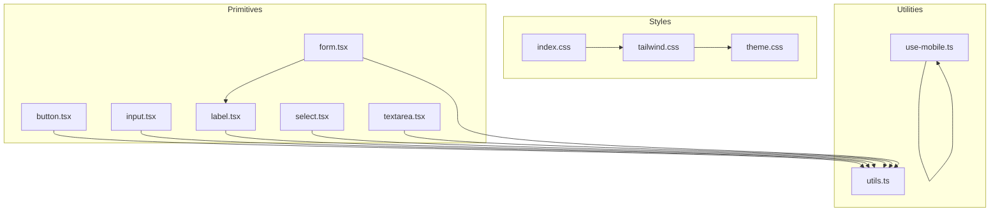
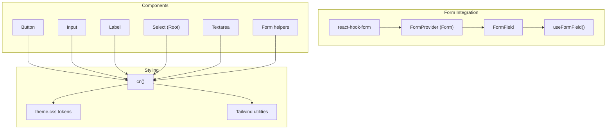
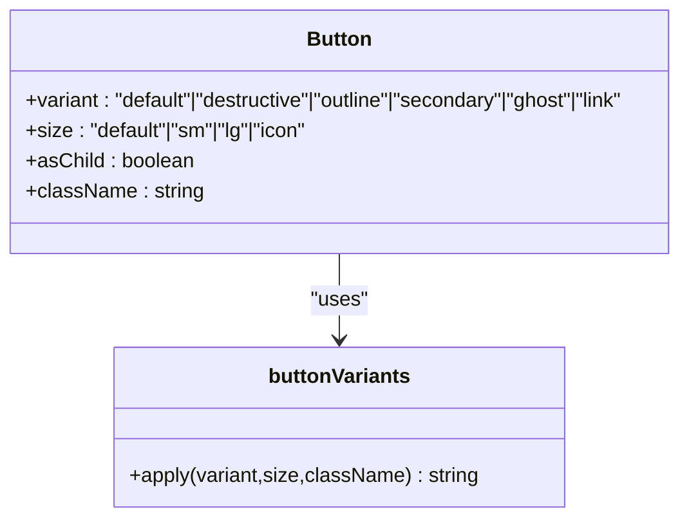
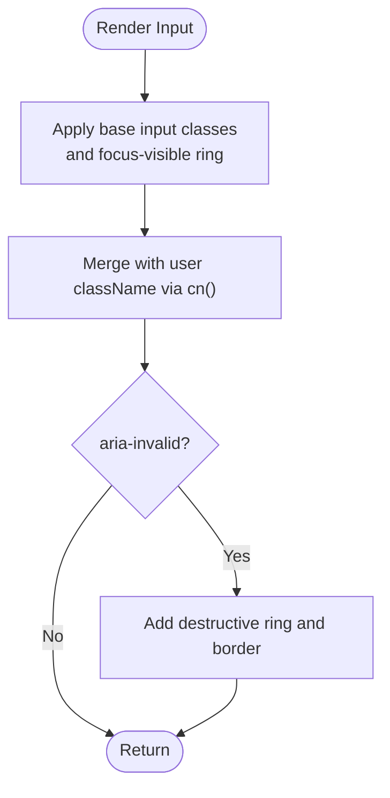
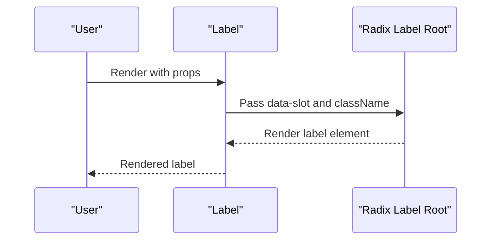
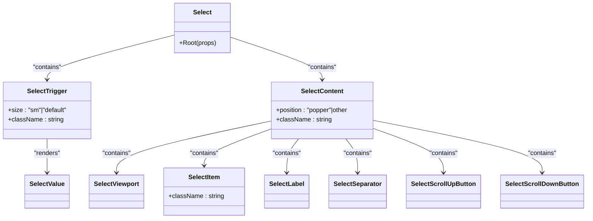
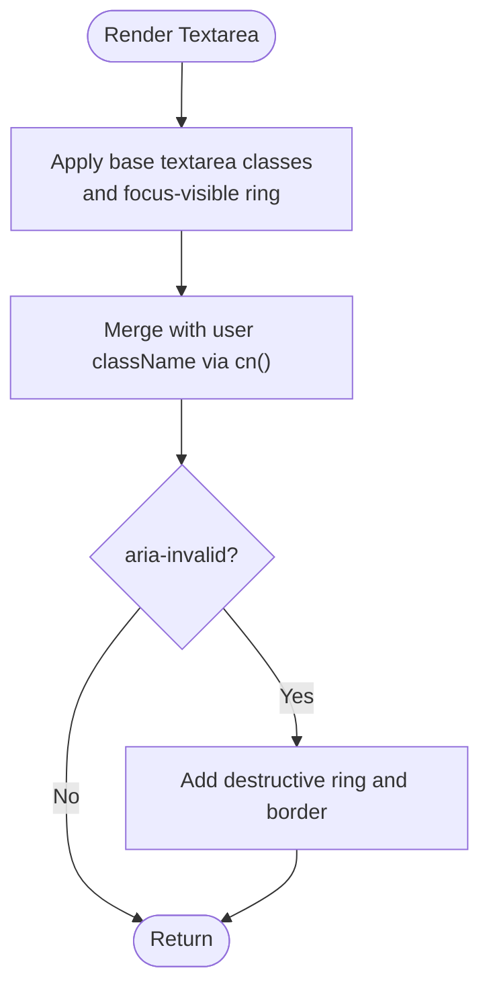
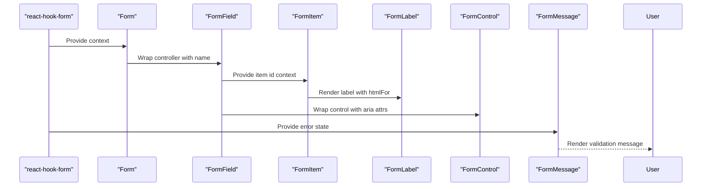
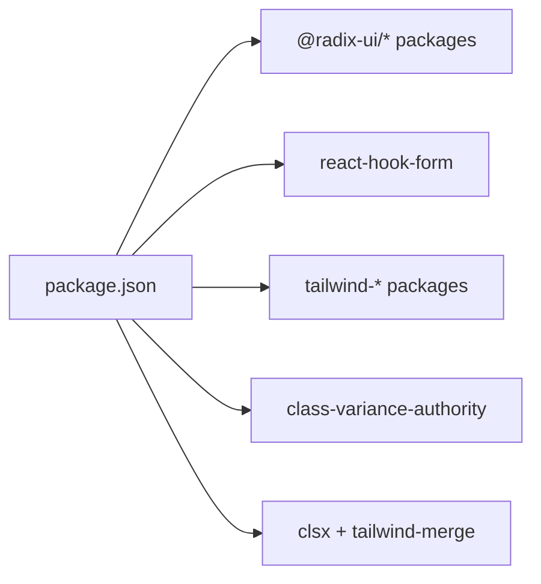

# UI Primitives

<cite>
**Referenced Files in This Document**
- [button.tsx](file://Design/src/app/components/ui/button.tsx)
- [input.tsx](file://Design/src/app/components/ui/input.tsx)
- [label.tsx](file://Design/src/app/components/ui/label.tsx)
- [select.tsx](file://Design/src/app/components/ui/select.tsx)
- [textarea.tsx](file://Design/src/app/components/ui/textarea.tsx)
- [form.tsx](file://Design/src/app/components/ui/form.tsx)
- [use-mobile.ts](file://Design/src/app/components/ui/use-mobile.ts)
- [utils.ts](file://Design/src/app/components/ui/utils.ts)
- [theme.css](file://Design/src/styles/theme.css)
- [tailwind.css](file://Design/src/styles/tailwind.css)
- [index.css](file://Design/src/styles/index.css)
- [package.json](file://Design/package.json)
</cite>

## Table of Contents
1. [Introduction](#introduction)
2. [Project Structure](#project-structure)
3. [Core Components](#core-components)
4. [Architecture Overview](#architecture-overview)
5. [Detailed Component Analysis](#detailed-component-analysis)
6. [Dependency Analysis](#dependency-analysis)
7. [Performance Considerations](#performance-considerations)
8. [Troubleshooting Guide](#troubleshooting-guide)
9. [Conclusion](#conclusion)
10. [Appendices](#appendices)

## Introduction
This document describes the foundational UI primitive components built on Radix UI primitives. It focuses on Button, Input, Label, Select, Textarea, and Form elements. It explains component architecture, prop interfaces, accessibility features, integration with Tailwind CSS and the design token system, usage patterns, state management integration via react-hook-form, validation workflows, and customization approaches. It also documents the mobile utility hook and component utility functions, along with best practices for extending these primitives.

## Project Structure
The UI primitives live under the application’s components directory and are styled via a layered CSS approach:
- Component implementations: Design/src/app/components/ui/*.tsx
- Styling pipeline: Design/src/styles/index.css → tailwind.css → theme.css
- Utilities: Design/src/app/components/ui/utils.ts and Design/src/app/components/ui/use-mobile.ts
- Dependencies: Design/package.json lists Radix UI packages, Tailwind CSS, class variance authority, and related libraries

**Diagram sources**
- [index.css](file://Design/src/styles/index.css#L1-L4)
- [tailwind.css](file://Design/src/styles/tailwind.css#L1-L5)
- [theme.css](file://Design/src/styles/theme.css#L1-L188)
- [utils.ts](file://Design/src/app/components/ui/utils.ts#L1-L7)
- [use-mobile.ts](file://Design/src/app/components/ui/use-mobile.ts#L1-L22)
- [button.tsx](file://Design/src/app/components/ui/button.tsx#L1-L58)
- [input.tsx](file://Design/src/app/components/ui/input.tsx#L1-L22)
- [label.tsx](file://Design/src/app/components/ui/label.tsx#L1-L25)
- [select.tsx](file://Design/src/app/components/ui/select.tsx#L1-L190)
- [textarea.tsx](file://Design/src/app/components/ui/textarea.tsx#L1-L19)
- [form.tsx](file://Design/src/app/components/ui/form.tsx#L1-L169)

**Section sources**
- [index.css](file://Design/src/styles/index.css#L1-L4)
- [tailwind.css](file://Design/src/styles/tailwind.css#L1-L5)
- [theme.css](file://Design/src/styles/theme.css#L1-L188)
- [utils.ts](file://Design/src/app/components/ui/utils.ts#L1-L7)
- [use-mobile.ts](file://Design/src/app/components/ui/use-mobile.ts#L1-L22)
- [button.tsx](file://Design/src/app/components/ui/button.tsx#L1-L58)
- [input.tsx](file://Design/src/app/components/ui/input.tsx#L1-L22)
- [label.tsx](file://Design/src/app/components/ui/label.tsx#L1-L25)
- [select.tsx](file://Design/src/app/components/ui/select.tsx#L1-L190)
- [textarea.tsx](file://Design/src/app/components/ui/textarea.tsx#L1-L19)
- [form.tsx](file://Design/src/app/components/ui/form.tsx#L1-L169)

## Core Components
This section summarizes the core primitives and their primary responsibilities:
- Button: Variants and sizes with motion and ring effects; supports asChild composition via Slot.
- Input: Styled text input with focus/ring and invalid states; integrates with selection and placeholder tokens.
- Label: Accessible label for form controls; respects disabled states and peer conditions.
- Select: Composite widget with Trigger, Content, Item, Separator, Scroll buttons, and Value; supports size and invalid states.
- Textarea: Styled textarea with focus/ring and invalid states; resizes behavior controlled via utility classes.
- Form: Provider and helpers for react-hook-form integration; FormField, useFormField, FormLabel, FormControl, FormDescription, FormMessage.

Key integration points:
- Tailwind utilities and design tokens via theme.css
- Utility function cn for merging classes
- Radix UI primitives for semantics and accessibility

**Section sources**
- [button.tsx](file://Design/src/app/components/ui/button.tsx#L1-L58)
- [input.tsx](file://Design/src/app/components/ui/input.tsx#L1-L22)
- [label.tsx](file://Design/src/app/components/ui/label.tsx#L1-L25)
- [select.tsx](file://Design/src/app/components/ui/select.tsx#L1-L190)
- [textarea.tsx](file://Design/src/app/components/ui/textarea.tsx#L1-L19)
- [form.tsx](file://Design/src/app/components/ui/form.tsx#L1-L169)
- [utils.ts](file://Design/src/app/components/ui/utils.ts#L1-L7)
- [theme.css](file://Design/src/styles/theme.css#L1-L188)

## Architecture Overview
The primitives follow a consistent pattern:
- Use Radix UI roots for semantics and accessibility
- Compose internal parts (e.g., SelectTrigger, SelectContent) with Tailwind classes
- Expose variant-driven styling via class-variance-authority where applicable
- Provide a unified cn utility to merge design tokens and user-provided classes
- Integrate with react-hook-form for validation and labeling

**Diagram sources**
- [form.tsx](file://Design/src/app/components/ui/form.tsx#L1-L169)
- [button.tsx](file://Design/src/app/components/ui/button.tsx#L1-L58)
- [input.tsx](file://Design/src/app/components/ui/input.tsx#L1-L22)
- [label.tsx](file://Design/src/app/components/ui/label.tsx#L1-L25)
- [select.tsx](file://Design/src/app/components/ui/select.tsx#L1-L190)
- [textarea.tsx](file://Design/src/app/components/ui/textarea.tsx#L1-L19)
- [utils.ts](file://Design/src/app/components/ui/utils.ts#L1-L7)
- [theme.css](file://Design/src/styles/theme.css#L1-L188)

## Detailed Component Analysis

### Button
- Purpose: Base button with variants (default, destructive, outline, secondary, ghost, link) and sizes (default, sm, lg, icon).
- Composition: Uses Slot to support asChild; applies motion and ring effects; integrates focus-visible and aria-invalid states.
- Styling: Uses class-variance-authority for variants and sizes; merges with user className via cn.

**Diagram sources**
- [button.tsx](file://Design/src/app/components/ui/button.tsx#L7-L35)

**Section sources**
- [button.tsx](file://Design/src/app/components/ui/button.tsx#L1-L58)
- [utils.ts](file://Design/src/app/components/ui/utils.ts#L1-L7)

### Input
- Purpose: Text input with focus-visible ring, selection highlighting, placeholder tokens, and invalid state styling.
- Accessibility: Integrates with aria-invalid and focus-visible ring.
- Styling: Uses theme tokens for borders, backgrounds, and transitions.

**Diagram sources**
- [input.tsx](file://Design/src/app/components/ui/input.tsx#L5-L19)
- [utils.ts](file://Design/src/app/components/ui/utils.ts#L1-L7)

**Section sources**
- [input.tsx](file://Design/src/app/components/ui/input.tsx#L1-L22)
- [theme.css](file://Design/src/styles/theme.css#L1-L188)
- [utils.ts](file://Design/src/app/components/ui/utils.ts#L1-L7)

### Label
- Purpose: Accessible label for form controls; supports disabled states and peer conditions.
- Accessibility: Uses Radix UI Label primitive; applies group/disabled and peer-disabled classes.

**Diagram sources**
- [label.tsx](file://Design/src/app/components/ui/label.tsx#L8-L22)

**Section sources**
- [label.tsx](file://Design/src/app/components/ui/label.tsx#L1-L25)

### Select
- Purpose: Composite select with Trigger, Content, Item, Label, Separator, and Scroll buttons.
- Features: Supports size variants on trigger; invalid state styling; portal-based content positioning; viewport sizing; keyboard and pointer interactions via Radix UI.
- Styling: Uses theme tokens for backgrounds, borders, and focus rings; integrates icons for chevrons and check indicators.

**Diagram sources**
- [select.tsx](file://Design/src/app/components/ui/select.tsx#L13-L189)

**Section sources**
- [select.tsx](file://Design/src/app/components/ui/select.tsx#L1-L190)
- [theme.css](file://Design/src/styles/theme.css#L1-L188)

### Textarea
- Purpose: Styled textarea with focus-visible ring, invalid state styling, and resize control.
- Accessibility: Inherits focus-visible ring and aria-invalid integration.

**Diagram sources**
- [textarea.tsx](file://Design/src/app/components/ui/textarea.tsx#L5-L16)
- [utils.ts](file://Design/src/app/components/ui/utils.ts#L1-L7)

**Section sources**
- [textarea.tsx](file://Design/src/app/components/ui/textarea.tsx#L1-L19)
- [theme.css](file://Design/src/styles/theme.css#L1-L188)
- [utils.ts](file://Design/src/app/components/ui/utils.ts#L1-L7)

### Form
- Purpose: Provides react-hook-form integration with accessible labeling and validation messaging.
- Components:
  - Form: Wrapper around FormProvider
  - FormField: Context provider for field name
  - useFormField: Hook to access field state and ids
  - FormItem: Container with generated ids
  - FormLabel: Accessible label bound to field
  - FormControl: Slot wrapper setting aria attributes
  - FormDescription: Helper text
  - FormMessage: Validation message display

**Diagram sources**
- [form.tsx](file://Design/src/app/components/ui/form.tsx#L19-L168)

**Section sources**
- [form.tsx](file://Design/src/app/components/ui/form.tsx#L1-L169)
- [label.tsx](file://Design/src/app/components/ui/label.tsx#L1-L25)

## Dependency Analysis
- Radix UI primitives: Button composes Slot; Label wraps @radix-ui/react-label; Select composes @radix-ui/react-select; Textarea is native; Form composes react-hook-form and @radix-ui/react-slot.
- Styling: Tailwind utilities and theme tokens; cn merges classes and resolves conflicts.
- Mobile utility: useIsMobile detects viewport breakpoints for responsive behavior.

**Diagram sources**
- [package.json](file://Design/package.json#L10-L68)

**Section sources**
- [package.json](file://Design/package.json#L1-L93)

## Performance Considerations
- Prefer variant-driven styling via class-variance-authority to minimize runtime conditionals.
- Use cn to merge classes efficiently; avoid excessive re-computation of class strings.
- Limit DOM nodes in composite widgets (e.g., Select) by leveraging Radix portals and viewport rendering.
- Defer heavy animations to CSS transitions and avoid layout thrashing during focus/ring updates.

## Troubleshooting Guide
Common issues and resolutions:
- Focus ring not visible: Ensure focus-visible ring classes are applied and theme tokens are loaded.
- Invalid state not reflected: Verify aria-invalid is set on inputs and destructive ring classes are present.
- Select content not positioned: Confirm portal usage and popper positioning classes are intact.
- Form messages not announced: Ensure FormControl sets aria-describedby and aria-invalid appropriately.
- Mobile responsiveness: Use useIsMobile to adapt layouts and component sizes.

**Section sources**
- [input.tsx](file://Design/src/app/components/ui/input.tsx#L5-L19)
- [textarea.tsx](file://Design/src/app/components/ui/textarea.tsx#L5-L16)
- [select.tsx](file://Design/src/app/components/ui/select.tsx#L62-L90)
- [form.tsx](file://Design/src/app/components/ui/form.tsx#L107-L124)
- [use-mobile.ts](file://Design/src/app/components/ui/use-mobile.ts#L1-L22)

## Conclusion
These primitives establish a consistent, accessible, and extensible foundation for forms and interactive UI. They integrate Radix semantics, react-hook-form for validation, Tailwind utilities, and a robust design token system. By following the documented patterns, developers can implement reliable forms, maintain accessibility, and customize components while preserving performance and consistency.

## Appendices

### Styling and Design Tokens
- Theme tokens define color scales, radii, and ring colors; Tailwind utilities apply them consistently.
- Typography defaults are set in theme.css; they can be overridden by Tailwind text utilities.
- Motion utilities (e.g., perspective-1000) are defined in theme.css for interactive elements.

**Section sources**
- [theme.css](file://Design/src/styles/theme.css#L1-L188)
- [tailwind.css](file://Design/src/styles/tailwind.css#L1-L5)
- [index.css](file://Design/src/styles/index.css#L1-L4)

### Utility Functions
- cn: Merges and deduplicates classes using clsx and tailwind-merge.
- useIsMobile: Detects mobile viewport using matchMedia and React hooks.

**Section sources**
- [utils.ts](file://Design/src/app/components/ui/utils.ts#L1-L7)
- [use-mobile.ts](file://Design/src/app/components/ui/use-mobile.ts#L1-L22)

### Accessibility Best Practices
- Always pair labels with controls using FormLabel or Label primitives.
- Use aria-invalid and focus-visible ring to communicate state.
- Ensure composite widgets (Select) render via Radix portals for proper positioning and keyboard navigation.
- Keep interactive states declarative and avoid relying solely on hover.

**Section sources**
- [label.tsx](file://Design/src/app/components/ui/label.tsx#L8-L22)
- [input.tsx](file://Design/src/app/components/ui/input.tsx#L5-L19)
- [select.tsx](file://Design/src/app/components/ui/select.tsx#L62-L90)
- [form.tsx](file://Design/src/app/components/ui/form.tsx#L90-L124)