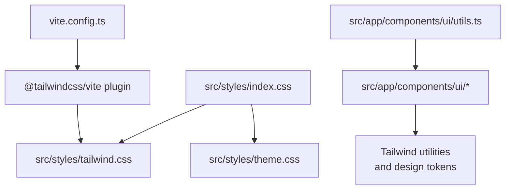

# Styling and Design System

<cite>
**Referenced Files in This Document**
- [package.json](file://package.json)
- [vite.config.ts](file://vite.config.ts)
- [postcss.config.mjs](file://postcss.config.mjs)
- [src/styles/index.css](file://src/styles/index.css)
- [src/styles/tailwind.css](file://src/styles/tailwind.css)
- [src/styles/theme.css](file://src/styles/theme.css)
- [src/app/components/ui/button.tsx](file://src/app/components/ui/button.tsx)
- [src/app/components/ui/input.tsx](file://src/app/components/ui/input.tsx)
- [src/app/components/ui/card.tsx](file://src/app/components/ui/card.tsx)
- [src/app/components/ui/utils.ts](file://src/app/components/ui/utils.ts)
- [src/app/components/ui/use-mobile.ts](file://src/app/components/ui/use-mobile.ts)
</cite>

## Table of Contents
1. [Introduction](#introduction)
2. [Project Structure](#project-structure)
3. [Core Components](#core-components)
4. [Architecture Overview](#architecture-overview)
5. [Detailed Component Analysis](#detailed-component-analysis)
6. [Dependency Analysis](#dependency-analysis)
7. [Performance Considerations](#performance-considerations)
8. [Accessibility and WCAG Compliance](#accessibility-and-wcag-compliance)
9. [Customization and Extension Guidelines](#customization-and-extension-guidelines)
10. [Troubleshooting Guide](#troubleshooting-guide)
11. [Conclusion](#conclusion)

## Introduction
This document describes the styling and design system of the Post-Quantum Cryptography Educational Platform. It explains how Tailwind CSS v4 is configured and integrated with the component library, documents the theme system (colors, typography, spacing, and responsive breakpoints), and outlines the design tokens and CSS architecture. It also provides guidance for customization, adding new themes, maintaining visual consistency, and ensuring accessibility and WCAG compliance.

## Project Structure
The styling system is organized around three primary layers:
- Global styles: imported in a single entry point to establish base styles, fonts, and Tailwind directives.
- Theme system: CSS custom properties and @theme definitions that power light and dark modes.
- Component library: UI primitives built with Tailwind utilities and design tokens, enabling consistent, accessible, and extensible components.

**Diagram sources**
- [src/styles/index.css](file://src/styles/index.css#L1-L4)
- [src/styles/tailwind.css](file://src/styles/tailwind.css#L1-L5)
- [src/styles/theme.css](file://src/styles/theme.css#L1-L188)
- [vite.config.ts](file://vite.config.ts#L1-L23)

**Section sources**
- [src/styles/index.css](file://src/styles/index.css#L1-L4)
- [src/styles/tailwind.css](file://src/styles/tailwind.css#L1-L5)
- [src/styles/theme.css](file://src/styles/theme.css#L1-L188)
- [vite.config.ts](file://vite.config.ts#L1-L23)

## Core Components
The design system centers on:
- Tailwind CSS v4 via the Vite plugin for automatic PostCSS setup.
- A theme system using CSS custom properties with light and dark variants.
- A component library that composes Tailwind utilities and design tokens.
- Utility helpers for merging class names and responsive detection.

Key configuration highlights:
- Tailwind v4 is enabled via the Vite plugin and configured to scan component source files.
- PostCSS is intentionally minimal, delegating all transformations to Tailwind v4.
- The theme defines color tokens, radii, and typography-related variables, then exposes them via @theme for Tailwind to consume.
- Components apply design tokens through Tailwind’s color/radius/ring utilities and semantic variants.

**Section sources**
- [package.json](file://package.json#L70-L75)
- [vite.config.ts](file://vite.config.ts#L1-L23)
- [postcss.config.mjs](file://postcss.config.mjs#L1-L16)
- [src/styles/tailwind.css](file://src/styles/tailwind.css#L1-L5)
- [src/styles/theme.css](file://src/styles/theme.css#L1-L188)
- [src/app/components/ui/utils.ts](file://src/app/components/ui/utils.ts#L1-L7)

## Architecture Overview
The styling pipeline integrates Tailwind v4 with the component library and theme system:

**Diagram sources**
- [vite.config.ts](file://vite.config.ts#L1-L23)
- [src/styles/index.css](file://src/styles/index.css#L1-L4)
- [src/styles/tailwind.css](file://src/styles/tailwind.css#L1-L5)
- [src/styles/theme.css](file://src/styles/theme.css#L1-L188)

## Detailed Component Analysis

### Theme System and Tokens
The theme system defines a set of CSS custom properties for colors, borders, rings, and spacing, with separate values for light and dark modes. It then exposes normalized tokens via @theme for Tailwind to interpret.

Key aspects:
- Color tokens: background, foreground, primary, secondary, muted, accent, destructive, border, input, ring, and chart palette.
- Semantic tokens: card, popover, and sidebar tokens.
- Typography and sizing tokens: font-size and font weights.
- Radius tokens: radius-sm, radius-md, radius-lg, radius-xl derived from a base radius.
- Dark mode variant: a scoped selector overrides tokens for .dark contexts.

Implementation references:
- Root and dark mode declarations of tokens.
- @theme block mapping tokens to Tailwind-accessible variables.
- Base layer applying global border and outline-ring utilities, plus default typography for headings, labels, buttons, and inputs.

**Section sources**
- [src/styles/theme.css](file://src/styles/theme.css#L1-L188)

### Tailwind v4 Integration
Tailwind v4 is configured through:
- A dedicated stylesheet importing the Tailwind layer and specifying source globs for scanning.
- The Vite plugin enabling Tailwind v4 without manual PostCSS plugin configuration.
- Optional animation support via a dedicated plugin.

Practical outcomes:
- Utilities are generated from scanned component files.
- Animations and transitions are available through the animation plugin.

**Section sources**
- [src/styles/tailwind.css](file://src/styles/tailwind.css#L1-L5)
- [vite.config.ts](file://vite.config.ts#L1-L23)
- [package.json](file://package.json#L70-L75)

### Component Library Patterns
Components consistently:
- Use design tokens via Tailwind utilities (e.g., colors, ring, radius).
- Compose variants with class variance authority for consistent styling across sizes and states.
- Apply focus-visible and invalid states using ring and destructive tokens.
- Support slot semantics for flexible composition.

Examples:
- Button: variants for default, destructive, outline, secondary, ghost, and link; sizes for default, small, large, and icon; focus-visible ring and gradient overlays.
- Input: focus-visible ring, selection highlighting, placeholder tokens, and aria-invalid states.
- Card: semantic slots for header, title, description, action, content, and footer; responsive container queries and grid layout.

**Section sources**
- [src/app/components/ui/button.tsx](file://src/app/components/ui/button.tsx#L1-L58)
- [src/app/components/ui/input.tsx](file://src/app/components/ui/input.tsx#L1-L22)
- [src/app/components/ui/card.tsx](file://src/app/components/ui/card.tsx#L1-L93)
- [src/app/components/ui/utils.ts](file://src/app/components/ui/utils.ts#L1-L7)

### Responsive Design and Mobile-First Approach
Responsive patterns:
- A mobile breakpoint constant is used to detect small screens.
- Components apply responsive utilities (e.g., md:text-sm) to adjust typography and spacing on larger screens.
- Layouts leverage container queries and grid rows for adaptive composition.

**Section sources**
- [src/app/components/ui/use-mobile.ts](file://src/app/components/ui/use-mobile.ts#L1-L22)
- [src/app/components/ui/input.tsx](file://src/app/components/ui/input.tsx#L1-L22)
- [src/app/components/ui/card.tsx](file://src/app/components/ui/card.tsx#L18-L29)

## Dependency Analysis
The styling stack depends on:
- Tailwind CSS v4 and the Vite plugin for build-time processing.
- PostCSS remains minimal, avoiding duplication of Tailwind’s responsibilities.
- Component libraries depend on design tokens exposed via CSS variables and @theme.

**Diagram sources**
- [package.json](file://package.json#L70-L75)
- [vite.config.ts](file://vite.config.ts#L1-L23)
- [postcss.config.mjs](file://postcss.config.mjs#L1-L16)
- [src/styles/index.css](file://src/styles/index.css#L1-L4)
- [src/styles/theme.css](file://src/styles/theme.css#L1-L188)

**Section sources**
- [package.json](file://package.json#L70-L75)
- [vite.config.ts](file://vite.config.ts#L1-L23)
- [postcss.config.mjs](file://postcss.config.mjs#L1-L16)
- [src/styles/index.css](file://src/styles/index.css#L1-L4)
- [src/styles/theme.css](file://src/styles/theme.css#L1-L188)

## Performance Considerations
- Keep the number of unique design tokens minimal to reduce CSS output.
- Prefer utility-first classes over ad-hoc custom CSS to benefit from Tailwind’s purging and caching.
- Use responsive variants judiciously to avoid bloated media queries.
- Consolidate animations and transitions to shared utilities to prevent duplication.

## Accessibility and WCAG Compliance
Recommended practices grounded in the current design system:
- Focus management: components consistently apply focus-visible ring utilities to ensure keyboard operability.
- Color contrast: rely on theme tokens to maintain sufficient contrast in both light and dark modes.
- Input states: invalid states use destructive tokens with appropriate opacity for visibility.
- Selection and emphasis: selection highlighting uses primary/accent tokens to preserve readability.
- Semantic roles: components expose data-slot attributes to enable robust testing and assistive technology support.

**Section sources**
- [src/app/components/ui/button.tsx](file://src/app/components/ui/button.tsx#L8-L35)
- [src/app/components/ui/input.tsx](file://src/app/components/ui/input.tsx#L10-L15)
- [src/styles/theme.css](file://src/styles/theme.css#L122-L188)

## Customization and Extension Guidelines
How to customize the design system while preserving consistency:
- Add or modify tokens in the theme file to introduce new semantic roles or adjust palettes.
- Extend @theme variables to expose new tokens to Tailwind utilities.
- Introduce new component variants using class variance authority to keep styling centralized.
- Use responsive utilities and container queries to adapt layouts across screen sizes.
- Maintain a single source of truth for design tokens and import them into components via Tailwind utilities.

Guidance anchors:
- Define tokens in the theme file and map them via @theme.
- Compose component classes using design tokens and semantic variants.
- Keep responsive adjustments scoped to component-level utilities.

**Section sources**
- [src/styles/theme.css](file://src/styles/theme.css#L1-L188)
- [src/app/components/ui/button.tsx](file://src/app/components/ui/button.tsx#L7-L35)
- [src/app/components/ui/card.tsx](file://src/app/components/ui/card.tsx#L18-L29)

## Troubleshooting Guide
Common issues and resolutions:
- Utilities not applied: ensure Tailwind v4 is active via the Vite plugin and that the Tailwind layer is imported in the global stylesheet.
- Theme tokens missing: verify @theme variables are defined and that the theme file is included in the global stylesheet.
- Animation classes ineffective: confirm the animation plugin is installed and imported in the Tailwind layer.
- Dark mode not switching: check the dark variant selector and ensure the .dark class propagates to the root element.
- Responsive breakpoints inconsistent: align component-level responsive utilities with the mobile breakpoint constant.

**Section sources**
- [vite.config.ts](file://vite.config.ts#L1-L23)
- [src/styles/tailwind.css](file://src/styles/tailwind.css#L1-L5)
- [src/styles/theme.css](file://src/styles/theme.css#L1-L188)
- [src/app/components/ui/use-mobile.ts](file://src/app/components/ui/use-mobile.ts#L1-L22)

## Conclusion
The platform’s styling system leverages Tailwind CSS v4 with a robust theme built on CSS custom properties and @theme. Components are designed with consistency, accessibility, and responsiveness in mind, using design tokens and utility-first patterns. By extending tokens and variants thoughtfully, teams can evolve the design system while maintaining visual coherence and usability across the educational interface.