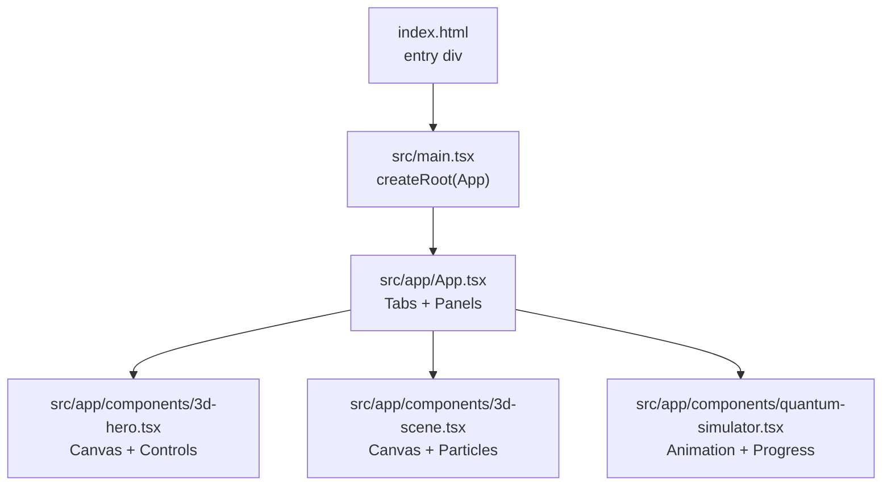
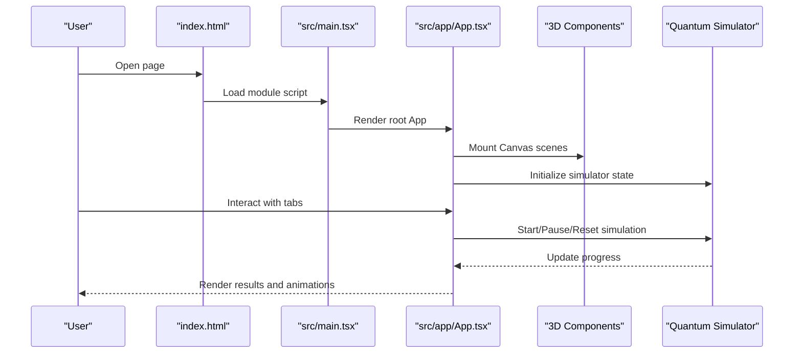
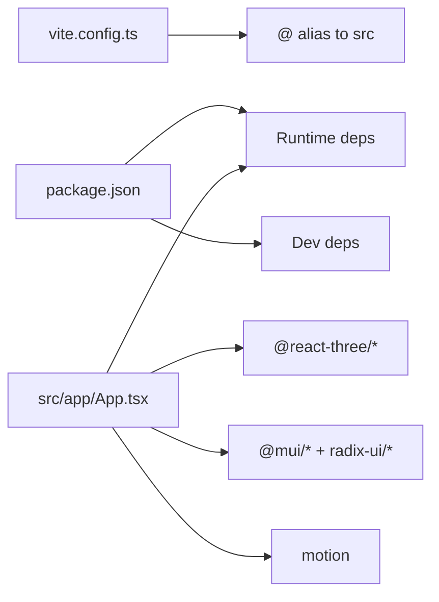

# Troubleshooting and FAQ

<cite>
**Referenced Files in This Document**
- [README.md](file://README.md)
- [package.json](file://package.json)
- [vite.config.ts](file://vite.config.ts)
- [index.html](file://index.html)
- [src/main.tsx](file://src/main.tsx)
- [src/app/App.tsx](file://src/app/App.tsx)
- [src/app/components/3d-hero.tsx](file://src/app/components/3d-hero.tsx)
- [src/app/components/3d-scene.tsx](file://src/app/components/3d-scene.tsx)
- [src/app/components/quantum-simulator.tsx](file://src/app/components/quantum-simulator.tsx)
</cite>

## Table of Contents
1. [Introduction](#introduction)
2. [Project Structure](#project-structure)
3. [Core Components](#core-components)
4. [Architecture Overview](#architecture-overview)
5. [Detailed Component Analysis](#detailed-component-analysis)
6. [Dependency Analysis](#dependency-analysis)
7. [Performance Considerations](#performance-considerations)
8. [Troubleshooting Guide](#troubleshooting-guide)
9. [Conclusion](#conclusion)
10. [Appendices](#appendices)

## Introduction
This document provides comprehensive troubleshooting and Frequently Asked Questions for the Post-Quantum Cryptography Educational Platform. It focuses on installation and setup issues, runtime problems (rendering, animations, performance), browser compatibility, performance optimization, UI/UX issues, debugging strategies, and integration/extensibility guidance. The content is grounded in the repository’s configuration and component structure.

## Project Structure
The project is a Vite-powered React application with Three.js-based 3D scenes and educational UI components. Key areas:
- Build and dev server configuration
- Application entry and routing via tabs
- 3D hero and scene components
- Quantum simulator and visualization panels
- UI primitives from Material-UI and Radix UI

**Diagram sources**
- [index.html](file://index.html#L10-L14)
- [src/main.tsx](file://src/main.tsx#L1-L7)
- [src/app/App.tsx](file://src/app/App.tsx#L26-L362)
- [src/app/components/3d-hero.tsx](file://src/app/components/3d-hero.tsx#L53-L76)
- [src/app/components/3d-scene.tsx](file://src/app/components/3d-scene.tsx#L125-L151)
- [src/app/components/quantum-simulator.tsx](file://src/app/components/quantum-simulator.tsx#L17-L316)

**Section sources**
- [README.md](file://README.md#L6-L11)
- [vite.config.ts](file://vite.config.ts#L1-L23)
- [index.html](file://index.html#L1-L15)
- [src/main.tsx](file://src/main.tsx#L1-L7)
- [src/app/App.tsx](file://src/app/App.tsx#L26-L362)

## Core Components
- App shell with animated background and tabbed interface
- 3D hero and scene components using @react-three/fiber and @react-three/drei
- Quantum simulator with real-time progress and animated visualization
- UI primitives from MUI and Radix UI for forms, buttons, cards, and animations

Common issues often revolve around:
- 3D rendering and animation performance
- Animation glitches and infinite loops
- Browser compatibility affecting WebGL and CSS animations
- Dev server and asset serving configuration

**Section sources**
- [src/app/App.tsx](file://src/app/App.tsx#L93-L362)
- [src/app/components/3d-hero.tsx](file://src/app/components/3d-hero.tsx#L53-L76)
- [src/app/components/3d-scene.tsx](file://src/app/components/3d-scene.tsx#L125-L151)
- [src/app/components/quantum-simulator.tsx](file://src/app/components/quantum-simulator.tsx#L17-L316)

## Architecture Overview
High-level flow:
- index.html loads the app entry script
- main.tsx mounts the root React element
- App.tsx orchestrates tabs and educational panels
- 3D components render via Three.js inside Canvas
- Quantum simulator updates state and drives animations

**Diagram sources**
- [index.html](file://index.html#L10-L14)
- [src/main.tsx](file://src/main.tsx#L1-L7)
- [src/app/App.tsx](file://src/app/App.tsx#L26-L362)
- [src/app/components/3d-hero.tsx](file://src/app/components/3d-hero.tsx#L53-L76)
- [src/app/components/3d-scene.tsx](file://src/app/components/3d-scene.tsx#L125-L151)
- [src/app/components/quantum-simulator.tsx](file://src/app/components/quantum-simulator.tsx#L17-L316)

## Detailed Component Analysis

### 3D Hero Component
- Uses Canvas, OrbitControls, and basic geometry materials
- Auto-rotation enabled with constrained controls
- Transparent background and minimal lighting setup

Potential issues:
- Auto-rotation and frame updates can cause performance spikes on low-end devices
- Transparency and fog may require GPU support

**Section sources**
- [src/app/components/3d-hero.tsx](file://src/app/components/3d-hero.tsx#L53-L76)

### 3D Scene Component
- Instanced particle system with per-frame matrix updates
- Animated rings and a rotating sphere
- Fog and multiple light sources for depth perception

Potential issues:
- Large instanced meshes (e.g., 500 particles) can overload GPU/CPU
- Matrix updates every frame increase CPU load
- Camera and control settings impact responsiveness

**Section sources**
- [src/app/components/3d-scene.tsx](file://src/app/components/3d-scene.tsx#L6-L58)
- [src/app/components/3d-scene.tsx](file://src/app/components/3d-scene.tsx#L125-L151)

### Quantum Simulator
- Real-time progress bars and badges
- Motion-driven animations and periodic state updates
- Configurable qubit count and start/pause/reset controls

Potential issues:
- Interval-based updates can accumulate if not cleared properly
- Excessive DOM updates during animation may cause jank
- Motion animations rely on underlying animation library

**Section sources**
- [src/app/components/quantum-simulator.tsx](file://src/app/components/quantum-simulator.tsx#L17-L316)

## Dependency Analysis
- Runtime dependencies include React, MUI, Radix UI, Three.js, @react-three/fiber, @react-three/drei, and motion
- Dev dependencies include Vite, Tailwind CSS plugin, and React plugin
- Aliasing resolves @ to src for imports

**Diagram sources**
- [vite.config.ts](file://vite.config.ts#L11-L16)
- [package.json](file://package.json#L10-L93)
- [src/app/App.tsx](file://src/app/App.tsx#L1-L16)

**Section sources**
- [package.json](file://package.json#L10-L93)
- [vite.config.ts](file://vite.config.ts#L1-L23)

## Performance Considerations
- 3D rendering optimization
  - Reduce particle counts or use instancing judiciously
  - Limit per-frame matrix updates; batch updates when possible
  - Disable auto-rotation or reduce speeds on lower-end devices
  - Use simpler materials and fewer lights
- Animation performance
  - Prefer CSS transforms and GPU-accelerated properties
  - Avoid frequent reflows; minimize DOM thrashing
  - Throttle or debounce rapid UI updates
- Memory management
  - Clear intervals and timeouts on unmount
  - Dispose of Three.js geometries and materials when no longer needed
  - Avoid retaining large arrays or objects in component state
- Large datasets
  - Paginate or virtualize lists
  - Debounce user input handlers
  - Use memoization for expensive computations

[No sources needed since this section provides general guidance]

## Troubleshooting Guide

### Installation and Setup
- Node.js and package manager
  - Ensure a compatible Node.js version for Vite 6.x and React 18.x
  - Use the documented install and dev commands
- Dependency resolution
  - Resolve peer dependency warnings for React and ReactDOM
  - Align versions across @react-three/fiber, three, and @react-three/drei
- Environment configuration
  - Confirm Vite server host/port and allowed hosts
  - Verify asset inclusion for SVG and CSV files

**Section sources**
- [README.md](file://README.md#L8-L11)
- [package.json](file://package.json#L70-L93)
- [vite.config.ts](file://vite.config.ts#L17-L22)

### Runtime Issues

#### Component Rendering Problems
- Symptoms: Blank screen, missing UI, or white page
- Checks:
  - Root container exists in index.html
  - App mounts without TypeScript/JS errors
  - Ensure all imported components are present

**Section sources**
- [index.html](file://index.html#L10-L14)
- [src/main.tsx](file://src/main.tsx#L1-L7)

#### 3D Visualization Performance Issues
- Symptoms: Low FPS, stutters, or device slowdown
- Actions:
  - Reduce particle counts in the scene component
  - Disable auto-rotation or lower rotation speeds
  - Simplify materials and remove unnecessary lights
  - Test with reduced canvas sizes

**Section sources**
- [src/app/components/3d-scene.tsx](file://src/app/components/3d-scene.tsx#L125-L151)
- [src/app/components/3d-hero.tsx](file://src/app/components/3d-hero.tsx#L53-L76)

#### Animation Glitches
- Symptoms: Jittery motion, inconsistent timing, or stuck animations
- Actions:
  - Verify interval cleanup in simulator component
  - Avoid mutating state objects directly; use immutable updates
  - Ensure motion animations are not fighting each other

**Section sources**
- [src/app/components/quantum-simulator.tsx](file://src/app/components/quantum-simulator.tsx#L25-L48)

### Browser Compatibility
- Chrome
  - Enable WebGL and ensure hardware acceleration is on
  - Clear cache if stale shaders or textures cause artifacts
- Firefox
  - Verify WebGL support and driver updates
  - Some CSS motion features may differ; test fallbacks
- Safari
  - Check WebGL availability and privacy settings
  - Expect stricter autoplay policies for media; initialize on user gesture
- Edge
  - Similar to Chrome; ensure latest drivers and updates

[No sources needed since this section provides general guidance]

### UI and Responsive Design Issues
- Layout problems
  - Verify Tailwind utilities and container classes
  - Check for overflow-x scrolling in tab lists
- Responsive behavior
  - Use mobile-first utilities and lg: prefixes
  - Ensure touch-friendly controls and spacing

**Section sources**
- [src/app/App.tsx](file://src/app/App.tsx#L208-L248)

### Accessibility Concerns
- Keyboard navigation
  - Ensure focus order is logical; use proper tab indices
- Screen readers
  - Add aria-labels and roles where appropriate
- Motion sensitivity
  - Respect reduced motion preferences; avoid persistent auto-rotation

[No sources needed since this section provides general guidance]

### Debugging Strategies
- Console logs and React DevTools
  - Inspect component trees and props/state
- 3D debugging
  - Temporarily disable complex materials and lights
  - Reduce particle counts to isolate performance bottlenecks
- Animation debugging
  - Wrap state updates in minimal batches
  - Log interval lifecycle and cleanup

[No sources needed since this section provides general guidance]

### Integration and Extensibility
- Adding new educational panels
  - Follow the existing pattern: create a component and register it in App.tsx tabs
- Integrating external libraries
  - Keep versions aligned with React and Three.js ecosystem
  - Prefer lightweight alternatives when possible
- Extending animations
  - Use motion primitives carefully; test across browsers
  - Avoid excessive chained animations

**Section sources**
- [src/app/App.tsx](file://src/app/App.tsx#L250-L316)

## Conclusion
This guide consolidates actionable steps to troubleshoot and optimize the Post-Quantum Cryptography Educational Platform. By validating environment setup, managing 3D and animation performance, ensuring cross-browser compatibility, and following UI/UX best practices, most issues can be resolved efficiently. Use the referenced files as checkpoints for diagnosing problems and verifying fixes.

[No sources needed since this section summarizes without analyzing specific files]

## Appendices

### Frequently Asked Questions (FAQ)

- How do I run the project locally?
  - Install dependencies and start the dev server using the documented commands.

- Why is the 3D scene slow or laggy?
  - Reduce particle counts, simplify materials, or disable auto-rotation.

- Why do animations stutter?
  - Check for uncanceled intervals and excessive DOM updates.

- Which browsers are supported?
  - Chrome, Firefox, Safari, and Edge with WebGL enabled.

- How do I add a new educational panel?
  - Create a component and register it in the App.tsx tabs.

- How do I adjust the quantum simulator difficulty?
  - Modify qubit counts and algorithm-specific progress rates in the simulator component.

**Section sources**
- [README.md](file://README.md#L8-L11)
- [src/app/App.tsx](file://src/app/App.tsx#L250-L316)
- [src/app/components/quantum-simulator.tsx](file://src/app/components/quantum-simulator.tsx#L17-L316)