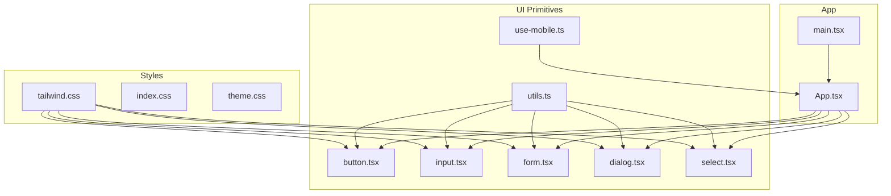
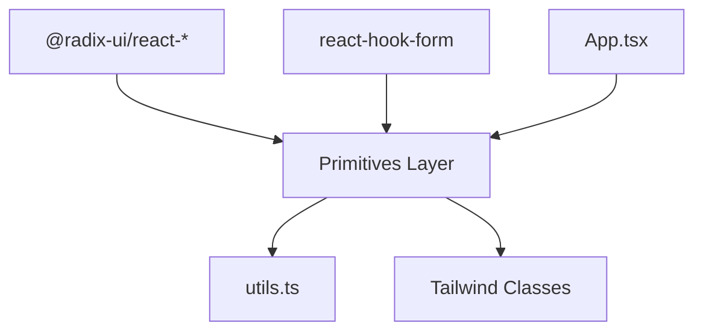
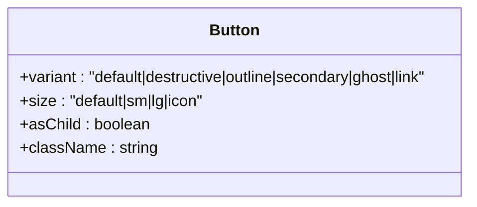
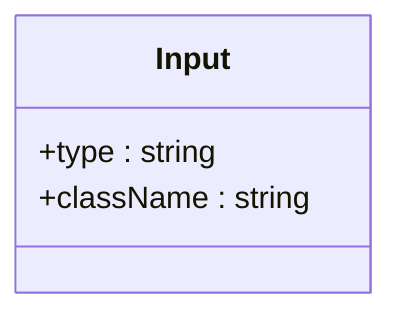
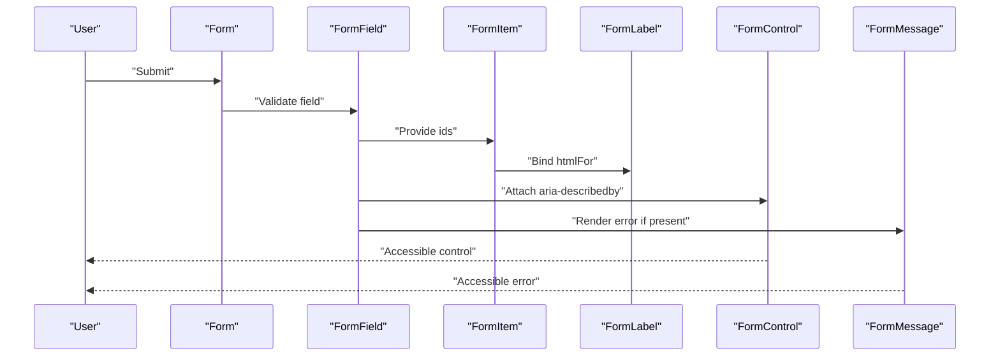
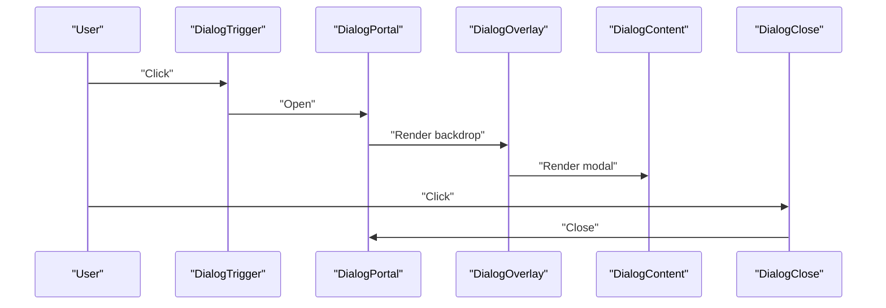
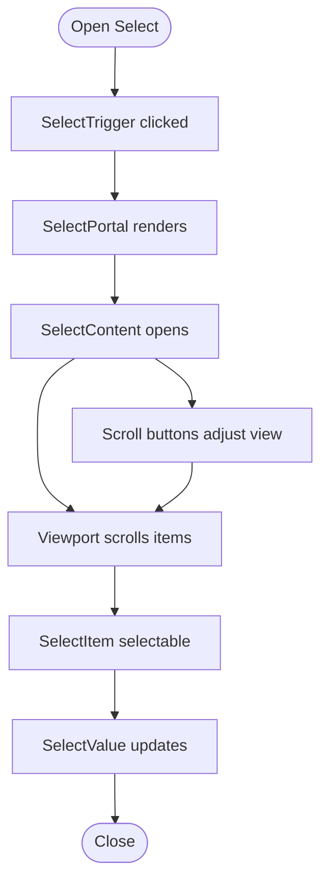
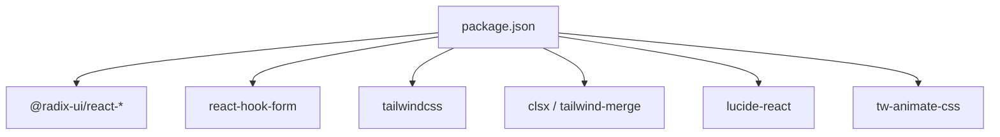

# Primitive Components

<cite>
**Referenced Files in This Document**
- [README.md](file://README.md)
- [package.json](file://package.json)
- [tailwind.css](file://src/styles/tailwind.css)
- [index.css](file://src/styles/index.css)
- [theme.css](file://src/styles/theme.css)
- [utils.ts](file://src/app/components/ui/utils.ts)
- [use-mobile.ts](file://src/app/components/ui/use-mobile.ts)
- [button.tsx](file://src/app/components/ui/button.tsx)
- [input.tsx](file://src/app/components/ui/input.tsx)
- [form.tsx](file://src/app/components/ui/form.tsx)
- [dialog.tsx](file://src/app/components/ui/dialog.tsx)
- [select.tsx](file://src/app/components/ui/select.tsx)
- [App.tsx](file://src/app/App.tsx)
- [main.tsx](file://src/main.tsx)
</cite>

## Table of Contents
1. [Introduction](#introduction)
2. [Project Structure](#project-structure)
3. [Core Components](#core-components)
4. [Architecture Overview](#architecture-overview)
5. [Detailed Component Analysis](#detailed-component-analysis)
6. [Dependency Analysis](#dependency-analysis)
7. [Performance Considerations](#performance-considerations)
8. [Troubleshooting Guide](#troubleshooting-guide)
9. [Conclusion](#conclusion)
10. [Appendices](#appendices)

## Introduction
This document describes the Primitive UI Components library built on Radix UI primitives. It focuses on the foundational components that enable accessible, consistent, and educationally usable interfaces. The library integrates Tailwind CSS for styling, composes Radix UI’s low-level controls, and emphasizes:
- Accessibility-first behavior via ARIA attributes and semantic markup
- Consistent design tokens and responsive patterns
- Educational usability with clear component roles and extensibility

The project also includes cryptographic interface examples (e.g., encryption panel, key management) that demonstrate practical usage patterns with the primitive components.

**Section sources**
- [README.md](file://README.md#L1-L11)

## Project Structure
The project is organized around a set of primitive UI components under src/app/components/ui, styled with Tailwind CSS, and integrated into a React application entry.

**Diagram sources**
- [tailwind.css](file://src/styles/tailwind.css#L1-L5)
- [utils.ts](file://src/app/components/ui/utils.ts#L1-L7)
- [use-mobile.ts](file://src/app/components/ui/use-mobile.ts#L1-L22)
- [button.tsx](file://src/app/components/ui/button.tsx#L1-L58)
- [input.tsx](file://src/app/components/ui/input.tsx#L1-L22)
- [form.tsx](file://src/app/components/ui/form.tsx#L1-L169)
- [dialog.tsx](file://src/app/components/ui/dialog.tsx#L1-L136)
- [select.tsx](file://src/app/components/ui/select.tsx#L1-L190)
- [App.tsx](file://src/app/App.tsx)
- [main.tsx](file://src/main.tsx)

**Section sources**
- [package.json](file://package.json#L1-L93)
- [tailwind.css](file://src/styles/tailwind.css#L1-L5)
- [utils.ts](file://src/app/components/ui/utils.ts#L1-L7)
- [use-mobile.ts](file://src/app/components/ui/use-mobile.ts#L1-L22)

## Core Components
This section outlines the design philosophy and core primitives that form the foundation of the UI library. Each component adheres to:
- Accessibility: ARIA attributes and keyboard operability
- Consistency: Shared design tokens and variants
- Extensibility: Variants, sizes, and slot-based composition

Key primitives covered here include Button, Input, Form, Dialog, and Select. Additional components (Accordion, Alert, Avatar, Badge, Breadcrumb, Calendar, Card, Carousel, Chart, Checkbox, Collapsible, Command, ContextMenu, Drawer, DropdownMenu, HoverCard, InputOTP, Label, Menubar, NavigationMenu, Pagination, Popover, Progress, RadioGroup, Resizable, ScrollArea, Separator, Sheet, Sidebar, Skeleton, Slider, Sonner, Switch, Table, Tabs, Textarea, ToggleGroup, Tooltip, etc.) follow similar patterns and are documented in the Detailed Component Analysis.

- Button: Provides variants (default, destructive, outline, secondary, ghost, link) and sizes (default, sm, lg, icon). Uses a slot wrapper for semantic flexibility and includes focus-visible ring and motion effects.
- Input: A base input with focus-visible ring, disabled states, and aria-invalid support.
- Form: A form provider and field composition using react-hook-form with accessible labeling and error propagation.
- Dialog: A modal overlay system with portal rendering, focus trapping, and close affordances.
- Select: A composite control with trigger, content, viewport, items, and scroll buttons.

**Section sources**
- [button.tsx](file://src/app/components/ui/button.tsx#L1-L58)
- [input.tsx](file://src/app/components/ui/input.tsx#L1-L22)
- [form.tsx](file://src/app/components/ui/form.tsx#L1-L169)
- [dialog.tsx](file://src/app/components/ui/dialog.tsx#L1-L136)
- [select.tsx](file://src/app/components/ui/select.tsx#L1-L190)

## Architecture Overview
The UI primitives layer sits atop Radix UI and react-hook-form, with Tailwind CSS providing design tokens and responsive behavior. The utilities module centralizes class merging and composition.

**Diagram sources**
- [package.json](file://package.json#L16-L41)
- [utils.ts](file://src/app/components/ui/utils.ts#L1-L7)
- [button.tsx](file://src/app/components/ui/button.tsx#L1-L58)
- [form.tsx](file://src/app/components/ui/form.tsx#L1-L169)
- [dialog.tsx](file://src/app/components/ui/dialog.tsx#L1-L136)
- [select.tsx](file://src/app/components/ui/select.tsx#L1-L190)

## Detailed Component Analysis

### Button
- Purpose: Base action element with variants and sizes.
- Props:
  - variant: default | destructive | outline | secondary | ghost | link
  - size: default | sm | lg | icon
  - asChild: wrap children in a Slot for semantic flexibility
  - className: additional Tailwind classes
- Events: Inherits all button events; supports focus-visible ring and motion effects.
- Slots: data-slot="button".
- Accessibility: Focus-visible ring, aria-invalid support via parent containers.
- Customization: Variants and sizes via class variance authority; motion and shadows included.

**Diagram sources**
- [button.tsx](file://src/app/components/ui/button.tsx#L37-L56)

**Section sources**
- [button.tsx](file://src/app/components/ui/button.tsx#L1-L58)
- [utils.ts](file://src/app/components/ui/utils.ts#L1-L7)

### Input
- Purpose: Text input with consistent focus and invalid states.
- Props:
  - type: input type
  - className: additional Tailwind classes
- Events: Inherits all input events.
- Accessibility: Focus-visible ring and aria-invalid support.
- Customization: Tailwind classes for colors, borders, transitions.

**Diagram sources**
- [input.tsx](file://src/app/components/ui/input.tsx#L5-L19)

**Section sources**
- [input.tsx](file://src/app/components/ui/input.tsx#L1-L22)
- [utils.ts](file://src/app/components/ui/utils.ts#L1-L7)

### Form Composition
- Purpose: Accessible form building blocks using react-hook-form and Radix Label.
- Components:
  - Form: Provider wrapping react-hook-form context
  - FormField: Field controller wrapper
  - FormItem: Container with generated ids
  - FormLabel: Label bound to field id
  - FormControl: Slot for form controls
  - FormDescription: Descriptive text with accessible ids
  - FormMessage: Error message with accessible ids
- Accessibility: ARIA-describedby and aria-invalid propagation; labeled-by patterns.
- Integration: Works seamlessly with Input, Select, and other controls.

**Diagram sources**
- [form.tsx](file://src/app/components/ui/form.tsx#L19-L168)

**Section sources**
- [form.tsx](file://src/app/components/ui/form.tsx#L1-L169)
- [utils.ts](file://src/app/components/ui/utils.ts#L1-L7)

### Dialog
- Purpose: Modal overlay with focus management and close affordance.
- Components:
  - Dialog, DialogTrigger, DialogPortal, DialogClose
  - DialogOverlay, DialogContent, DialogHeader, DialogFooter
  - DialogTitle, DialogDescription
- Accessibility: Portal rendering, focus trapping, sr-only close label.
- Animation: Fade and zoom animations driven by data-state attributes.

**Diagram sources**
- [dialog.tsx](file://src/app/components/ui/dialog.tsx#L9-L73)

**Section sources**
- [dialog.tsx](file://src/app/components/ui/dialog.tsx#L1-L136)

### Select
- Purpose: Accessible single/multi-selection control with scrollable viewport.
- Components:
  - Select, SelectGroup, SelectValue
  - SelectTrigger (with size), SelectContent (with position)
  - SelectLabel, SelectItem, SelectSeparator
  - SelectScrollUpButton, SelectScrollDownButton
- Accessibility: Keyboard navigation, ARIA attributes, scroll buttons.
- Customization: Size variants, popper positioning, icons, and item indicators.

**Diagram sources**
- [select.tsx](file://src/app/components/ui/select.tsx#L13-L189)

**Section sources**
- [select.tsx](file://src/app/components/ui/select.tsx#L1-L190)

### Additional Primitives (Overview)
The library includes a comprehensive set of primitives derived from Radix UI and styled with Tailwind. These components share consistent patterns:
- Data-slot attributes for testing and theming
- Focus-visible rings and ARIA attributes
- Responsive sizing and motion effects
- Slot-based composition for semantic flexibility

Representative components include:
- Accordion, Alert, Alert Dialog, Aspect Ratio, Avatar, Badge, Breadcrumb, Calendar, Card, Carousel, Chart, Checkbox, Collapsible, Command, Context Menu, Drawer, Dropdown Menu, Form, Hover Card, Input OTP, Label, Menubar, Navigation Menu, Pagination, Popover, Progress, Radio Group, Resizable, Scroll Area, Separator, Sheet, Sidebar, Skeleton, Slider, Sonner, Switch, Table, Tabs, Textarea, Toggle Group, Toggle, Tooltip

Integration patterns:
- Use Form for accessible field composition
- Combine Button with Dialog for actions
- Pair Input with Form for controlled inputs
- Use Select for option selection with keyboard navigation

**Section sources**
- [package.json](file://package.json#L16-L41)
- [button.tsx](file://src/app/components/ui/button.tsx#L1-L58)
- [input.tsx](file://src/app/components/ui/input.tsx#L1-L22)
- [form.tsx](file://src/app/components/ui/form.tsx#L1-L169)
- [dialog.tsx](file://src/app/components/ui/dialog.tsx#L1-L136)
- [select.tsx](file://src/app/components/ui/select.tsx#L1-L190)

## Dependency Analysis
External dependencies power the primitives and styling:
- Radix UI packages for accessible base components
- react-hook-form for form composition
- Tailwind CSS and related utilities for styling
- Icons and animation libraries for visual polish

**Diagram sources**
- [package.json](file://package.json#L10-L68)

**Section sources**
- [package.json](file://package.json#L1-L93)

## Performance Considerations
- Prefer variant and size props over ad-hoc classes to leverage class variance authority and reduce runtime class merging.
- Use the shared cn utility to merge classes efficiently.
- Limit heavy animations on low-powered devices; consider disabling motion preferences where appropriate.
- Keep dialogs and overlays portalized to avoid layout thrashing.

[No sources needed since this section provides general guidance]

## Troubleshooting Guide
Common issues and resolutions:
- Missing focus-visible ring: Ensure focus-visible classes are applied consistently across interactive primitives.
- Incorrect ARIA attributes: Verify aria-describedby and aria-invalid are attached to controls via Form components.
- Portal rendering: Confirm Dialog and Select portals render in the correct DOM location.
- Responsive breakpoints: Use the mobile detection hook to adapt layouts for small screens.

**Section sources**
- [form.tsx](file://src/app/components/ui/form.tsx#L107-L123)
- [dialog.tsx](file://src/app/components/ui/dialog.tsx#L54-L72)
- [select.tsx](file://src/app/components/ui/select.tsx#L62-L89)
- [use-mobile.ts](file://src/app/components/ui/use-mobile.ts#L1-L22)

## Conclusion
The Primitive UI Components library offers a cohesive, accessible, and extensible foundation for building secure and usable interfaces. By composing Radix UI primitives with Tailwind CSS and react-hook-form, it ensures consistency, responsiveness, and strong accessibility defaults. The included cryptographic interface examples illustrate practical patterns for real-world applications.

[No sources needed since this section summarizes without analyzing specific files]

## Appendices

### Styling and Theme Integration
- Tailwind CSS is configured to source from TypeScript/JSX files and import animation helpers.
- Utility functions merge classes safely and apply design tokens consistently.

**Section sources**
- [tailwind.css](file://src/styles/tailwind.css#L1-L5)
- [utils.ts](file://src/app/components/ui/utils.ts#L1-L7)
- [theme.css](file://src/styles/theme.css)

### Responsive Design Patterns
- Mobile breakpoint hook detects screen width and enables responsive adaptations.
- Components expose size variants and responsive typography classes.

**Section sources**
- [use-mobile.ts](file://src/app/components/ui/use-mobile.ts#L1-L22)
- [button.tsx](file://src/app/components/ui/button.tsx#L23-L28)
- [select.tsx](file://src/app/components/ui/select.tsx#L32-L55)

### Accessibility Compliance
- ARIA attributes are propagated automatically by Form components.
- Focus-visible rings and keyboard navigation are built-in to interactive primitives.
- Dialogs and Selects manage focus trapping and portal rendering for screen readers.

**Section sources**
- [form.tsx](file://src/app/components/ui/form.tsx#L107-L123)
- [dialog.tsx](file://src/app/components/ui/dialog.tsx#L54-L72)
- [select.tsx](file://src/app/components/ui/select.tsx#L62-L89)

### Cross-Browser Compatibility
- Radix UI primitives provide cross-browser behavior for focus, ARIA, and keyboard interactions.
- Tailwind utilities normalize baseline styles across browsers.

**Section sources**
- [package.json](file://package.json#L16-L41)

### Component Composition Patterns
- Use Form to compose labels, controls, descriptions, and messages.
- Compose Button with Dialog for confirmations.
- Pair Input with Select for controlled selections.

**Section sources**
- [form.tsx](file://src/app/components/ui/form.tsx#L19-L168)
- [button.tsx](file://src/app/components/ui/button.tsx#L1-L58)
- [dialog.tsx](file://src/app/components/ui/dialog.tsx#L1-L136)
- [select.tsx](file://src/app/components/ui/select.tsx#L1-L190)