# Specialized Components

<cite>
**Referenced Files in This Document**
- [App.tsx](file://src/app/App.tsx)
- [3d-hero.tsx](file://src/app/components/3d-hero.tsx)
- [3d-scene.tsx](file://src/app/components/3d-scene.tsx)
- [algorithm-selector.tsx](file://src/app/components/algorithm-selector.tsx)
- [encryption-panel.tsx](file://src/app/components/encryption-panel.tsx)
- [file-encryption.tsx](file://src/app/components/file-encryption.tsx)
- [key-management.tsx](file://src/app/components/key-management.tsx)
- [certificate-manager.tsx](file://src/app/components/certificate-manager.tsx)
- [network-security.tsx](file://src/app/components/network-security.tsx)
- [quantum-simulator.tsx](file://src/app/components/quantum-simulator.tsx)
- [quantum-threat-meter.tsx](file://src/app/components/quantum-threat-meter.tsx)
- [security-visualization.tsx](file://src/app/components/security-visualization.tsx)
- [activity-log.tsx](file://src/app/components/activity-log.tsx)
- [package.json](file://package.json)
</cite>

## Table of Contents
1. [Introduction](#introduction)
2. [Project Structure](#project-structure)
3. [Core Components](#core-components)
4. [Architecture Overview](#architecture-overview)
5. [Detailed Component Analysis](#detailed-component-analysis)
6. [Dependency Analysis](#dependency-analysis)
7. [Performance Considerations](#performance-considerations)
8. [Troubleshooting Guide](#troubleshooting-guide)
9. [Conclusion](#conclusion)
10. [Appendices](#appendices)

## Introduction
This document describes the specialized cryptographic and educational components that compose the Post-Quantum Cryptography Suite. It focuses on 12+ domain-specific components including:
- 3D quantum threat visualization and immersive scenes
- Algorithm selection interfaces
- Encryption panels and file encryption
- Key and certificate management
- Security analytics dashboards
- Network security and quantum threat meter
- Quantum simulator and visualization

These components integrate post-quantum cryptography concepts with interactive UI elements, leveraging Three.js for 3D rendering and Recharts for data visualization. The document explains props, state management, and data flow patterns, provides usage examples, and outlines performance considerations and extension guidelines.

## Project Structure
The application is organized around a tabbed interface that hosts specialized components for encryption, key/certificate management, analytics, threat assessment, and quantum simulation. The main orchestration occurs in the root application component, which manages shared state and passes it down to child components.

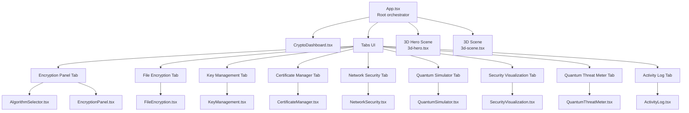

**Diagram sources**
- [App.tsx](file://src/app/App.tsx#L26-L362)
- [3d-hero.tsx](file://src/app/components/3d-hero.tsx#L53-L76)
- [3d-scene.tsx](file://src/app/components/3d-scene.tsx#L125-L151)
- [algorithm-selector.tsx](file://src/app/components/algorithm-selector.tsx#L73-L121)
- [encryption-panel.tsx](file://src/app/components/encryption-panel.tsx#L15-L238)
- [file-encryption.tsx](file://src/app/components/file-encryption.tsx#L24-L229)
- [key-management.tsx](file://src/app/components/key-management.tsx#L22-L221)
- [certificate-manager.tsx](file://src/app/components/certificate-manager.tsx#L27-L295)
- [network-security.tsx](file://src/app/components/network-security.tsx#L19-L303)
- [quantum-simulator.tsx](file://src/app/components/quantum-simulator.tsx#L17-L316)
- [security-visualization.tsx](file://src/app/components/security-visualization.tsx#L24-L107)
- [quantum-threat-meter.tsx](file://src/app/components/quantum-threat-meter.tsx#L40-L149)
- [activity-log.tsx](file://src/app/components/activity-log.tsx#L40-L117)

**Section sources**
- [App.tsx](file://src/app/App.tsx#L26-L362)

## Core Components
Below are the specialized components grouped by domain and purpose, with their roles and integration points:

- Algorithm Selection
  - Purpose: Choose a post-quantum algorithm (e.g., Kyber, Dilithium, SPHINCS+).
  - Props: selectedAlgorithm, onAlgorithmChange.
  - Integration: Drives encryption, key generation, and certificate creation flows.

- Encryption Panels
  - Purpose: Interactive plaintext/ciphertext exchange with animated feedback.
  - Props: algorithm, onEncrypt.
  - Features: Copy to clipboard, download ciphertext, simulated encryption/decryption.

- File Encryption
  - Purpose: Batch file encryption with progress visualization.
  - Props: algorithm, onFileEncrypt.
  - Features: Drag-and-drop selection, per-file progress, download encrypted files.

- Key Management
  - Purpose: Generate, display, export, and delete quantum-resistant key pairs.
  - Props: algorithm.
  - Features: Toggle visibility, export JSON, simulate generation.

- Certificate Manager
  - Purpose: Create, export, and revoke post-quantum X.509-like certificates.
  - Props: algorithm.
  - Features: Form validation, status badges, export to plain text.

- Network Security
  - Purpose: Assess and upgrade nodes’ encryption posture (classical/pqc/hybrid).
  - Props: None (self-managed).
  - Features: Scan progress, threat level bars, upgrade actions.

- Quantum Threat Meter
  - Purpose: Compare current PQC protection vs classical vulnerability.
  - Props: None (self-managed).
  - Features: Progress indicators, risk labels, security ratings.

- Security Analytics Dashboards
  - Purpose: Visualize security trends and algorithm performance.
  - Props: None (static datasets).
  - Libraries: Recharts for charts.

- 3D Scenes and Visualizations
  - Purpose: Immersive 3D demos for quantum threat and encryption.
  - Libraries: Three.js via @react-three/fiber and @react-three/drei.
  - Components: 3D Hero scene and a full Scene3D with rotating geometry and quantum particles.

- Activity Log
  - Purpose: Track recent cryptographic operations with timestamps and statuses.
  - Props: activities.
  - Features: Animated list, status badges, relative time formatting.

**Section sources**
- [algorithm-selector.tsx](file://src/app/components/algorithm-selector.tsx#L68-L121)
- [encryption-panel.tsx](file://src/app/components/encryption-panel.tsx#L10-L238)
- [file-encryption.tsx](file://src/app/components/file-encryption.tsx#L19-L229)
- [key-management.tsx](file://src/app/components/key-management.tsx#L18-L221)
- [certificate-manager.tsx](file://src/app/components/certificate-manager.tsx#L23-L295)
- [network-security.tsx](file://src/app/components/network-security.tsx#L19-L303)
- [quantum-threat-meter.tsx](file://src/app/components/quantum-threat-meter.tsx#L40-L149)
- [security-visualization.tsx](file://src/app/components/security-visualization.tsx#L24-L107)
- [3d-hero.tsx](file://src/app/components/3d-hero.tsx#L53-L76)
- [3d-scene.tsx](file://src/app/components/3d-scene.tsx#L125-L151)
- [activity-log.tsx](file://src/app/components/activity-log.tsx#L15-L117)

## Architecture Overview
The suite follows a centralized state pattern in the root App component, passing algorithm selections and derived statistics to child components. Child components encapsulate their own local state for UI interactions while delegating cryptographic operations to simulated handlers.

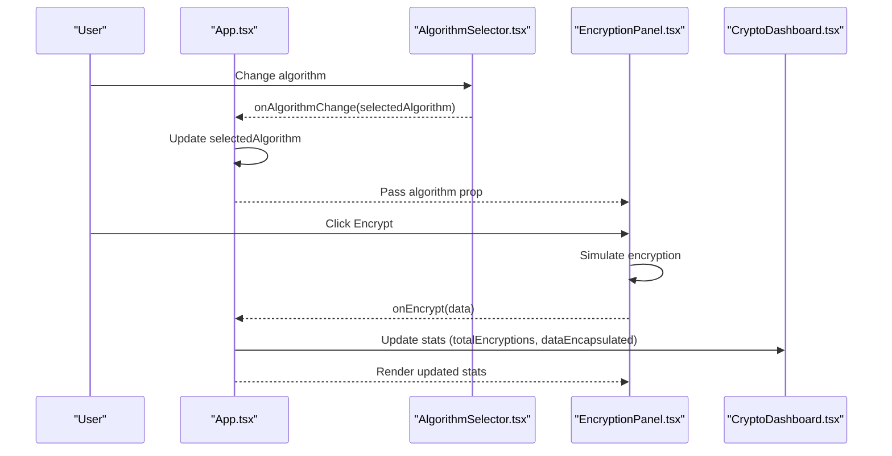

**Diagram sources**
- [App.tsx](file://src/app/App.tsx#L26-L91)
- [algorithm-selector.tsx](file://src/app/components/algorithm-selector.tsx#L68-L121)
- [encryption-panel.tsx](file://src/app/components/encryption-panel.tsx#L10-L238)
- [crypto-dashboard.tsx](file://src/app/components/crypto-dashboard.tsx#L1-L70)

## Detailed Component Analysis

### Algorithm Selector
- Purpose: Provides a curated list of post-quantum algorithms with metadata.
- Props:
  - selectedAlgorithm: AlgorithmType
  - onAlgorithmChange: (algorithm: AlgorithmType) => void
- State: None (controlled component).
- Data model: Algorithm[] with id, name, type, security, speed, description.
- Integration: Used across encryption, key management, and certificate manager.

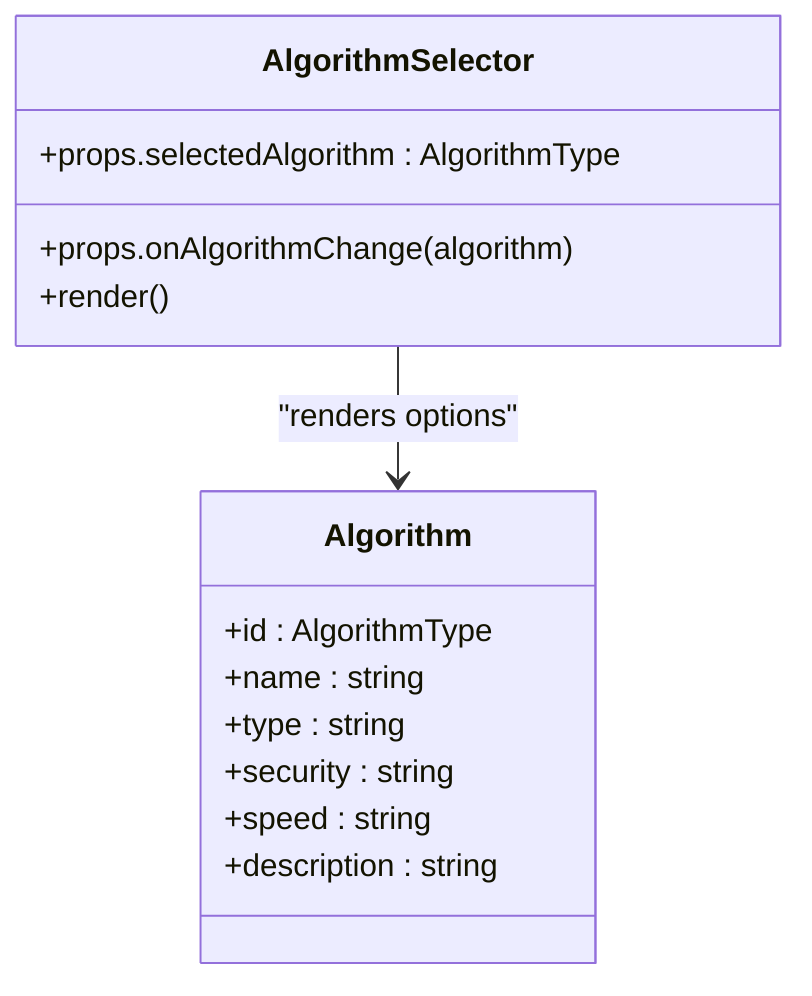

**Diagram sources**
- [algorithm-selector.tsx](file://src/app/components/algorithm-selector.tsx#L6-L121)

**Section sources**
- [algorithm-selector.tsx](file://src/app/components/algorithm-selector.tsx#L68-L121)

### Encryption Panel
- Purpose: End-to-end encryption/decryption demo with animated feedback.
- Props:
  - algorithm: AlgorithmType
  - onEncrypt: (data: string) => void
- State:
  - plaintext, ciphertext, isEncrypting, isDecrypting, copied.
- Behavior:
  - Simulates encryption/decryption with delays.
  - Clipboard copy and file download utilities.
  - Toast notifications for UX feedback.

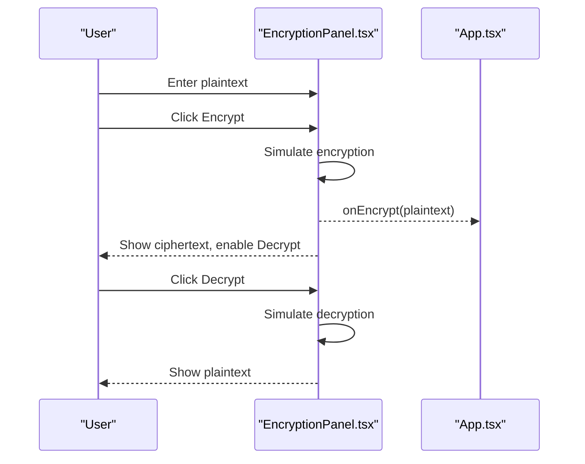

**Diagram sources**
- [encryption-panel.tsx](file://src/app/components/encryption-panel.tsx#L15-L238)
- [App.tsx](file://src/app/App.tsx#L47-L63)

**Section sources**
- [encryption-panel.tsx](file://src/app/components/encryption-panel.tsx#L10-L238)

### File Encryption
- Purpose: Batch file encryption with progress visualization.
- Props:
  - algorithm: AlgorithmType
  - onFileEncrypt: () => void
- State:
  - files: EncryptedFile[]
  - fileInputRef
- Behavior:
  - File selection triggers per-file progress updates.
  - Simulated encryption completes with success toast.

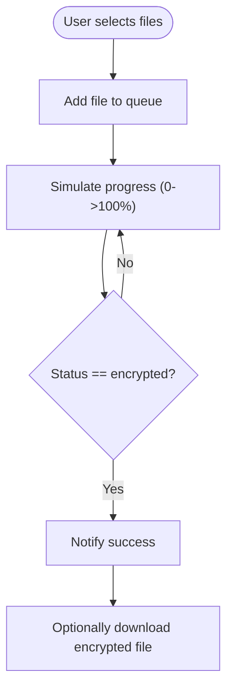

**Diagram sources**
- [file-encryption.tsx](file://src/app/components/file-encryption.tsx#L24-L229)

**Section sources**
- [file-encryption.tsx](file://src/app/components/file-encryption.tsx#L19-L229)

### Key Management
- Purpose: Generate, display, export, and delete quantum-resistant key pairs.
- Props:
  - algorithm: AlgorithmType
- State:
  - keys: KeyPair[]
  - isGenerating
  - visibleKeys: Set<string>
- Behavior:
  - Generates randomized public/private key strings.
  - Supports visibility toggling and JSON export.

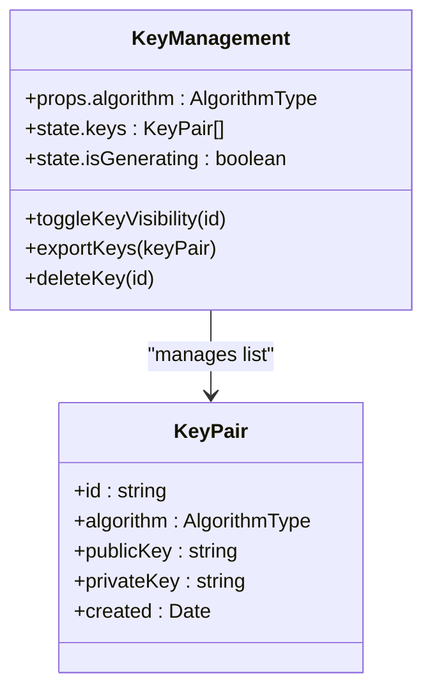

**Diagram sources**
- [key-management.tsx](file://src/app/components/key-management.tsx#L18-L221)

**Section sources**
- [key-management.tsx](file://src/app/components/key-management.tsx#L18-L221)

### Certificate Manager
- Purpose: Create, export, and revoke post-quantum X.509-like certificates.
- Props:
  - algorithm: AlgorithmType
- State:
  - certificates: CertificateData[]
  - isCreating
  - formData: { commonName, organization, validityDays }
- Behavior:
  - Generates serial numbers and validity dates.
  - Exports certificate content to a downloadable file.

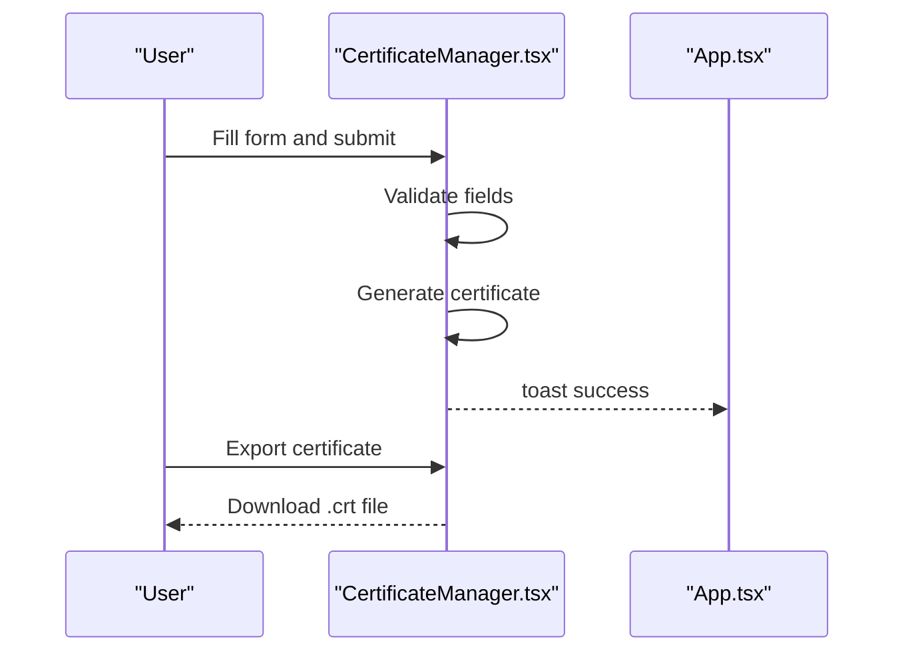

**Diagram sources**
- [certificate-manager.tsx](file://src/app/components/certificate-manager.tsx#L27-L295)
- [App.tsx](file://src/app/App.tsx#L79-L79)

**Section sources**
- [certificate-manager.tsx](file://src/app/components/certificate-manager.tsx#L23-L295)

### Network Security
- Purpose: Assess and upgrade network nodes’ encryption posture.
- Props: None.
- State:
  - nodes: NetworkNode[]
  - isScanning, scanProgress
- Behavior:
  - Scans nodes and updates status based on encryption type.
  - Upgrades classical nodes to PQC with a single click.

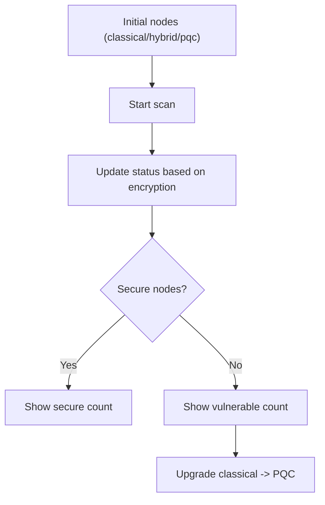

**Diagram sources**
- [network-security.tsx](file://src/app/components/network-security.tsx#L19-L303)

**Section sources**
- [network-security.tsx](file://src/app/components/network-security.tsx#L19-L303)

### Quantum Threat Meter
- Purpose: Compare current PQC protection vs classical vulnerability.
- Props: None.
- State:
  - Computes currentThreat and classicalThreat.
- Behavior:
  - Maps threat percentages to risk levels with color-coded labels.

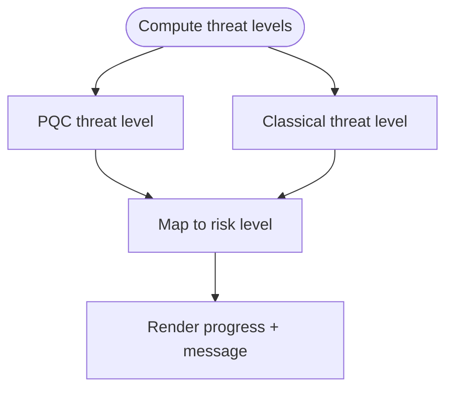

**Diagram sources**
- [quantum-threat-meter.tsx](file://src/app/components/quantum-threat-meter.tsx#L40-L149)

**Section sources**
- [quantum-threat-meter.tsx](file://src/app/components/quantum-threat-meter.tsx#L40-L149)

### Security Analytics Dashboards
- Purpose: Visualize security strength over time and algorithm performance.
- Props: None.
- Data:
  - securityData: hourly classical vs PQC security %
  - algorithmComparison: per-algorithm metrics
- Visualization: AreaChart and BarChart via Recharts.

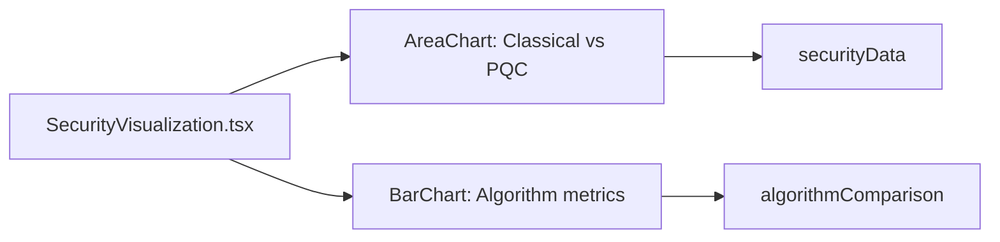

**Diagram sources**
- [security-visualization.tsx](file://src/app/components/security-visualization.tsx#L24-L107)

**Section sources**
- [security-visualization.tsx](file://src/app/components/security-visualization.tsx#L24-L107)

### 3D Scenes and Visualizations
- Purpose: Immersive 3D demos for quantum threat and encryption.
- Libraries: Three.js via @react-three/fiber and @react-three/drei.
- Components:
  - 3D Hero: Rotating cube and glowing sphere with orbit controls.
  - Scene3D: Quantum particles, rotating crypto sphere, encryption rings.

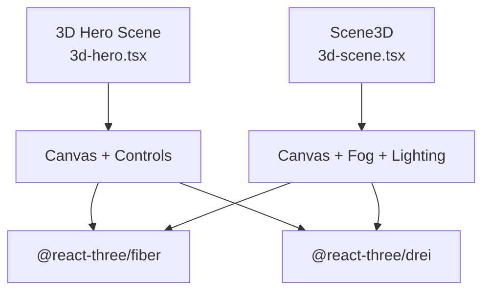

**Diagram sources**
- [3d-hero.tsx](file://src/app/components/3d-hero.tsx#L53-L76)
- [3d-scene.tsx](file://src/app/components/3d-scene.tsx#L125-L151)

**Section sources**
- [3d-hero.tsx](file://src/app/components/3d-hero.tsx#L1-L76)
- [3d-scene.tsx](file://src/app/components/3d-scene.tsx#L1-L151)

### Activity Log
- Purpose: Track recent cryptographic operations with timestamps and statuses.
- Props:
  - activities: Activity[]
- State: None (presentational).
- Behavior:
  - Relative time formatting.
  - Animated list with staggered entries.

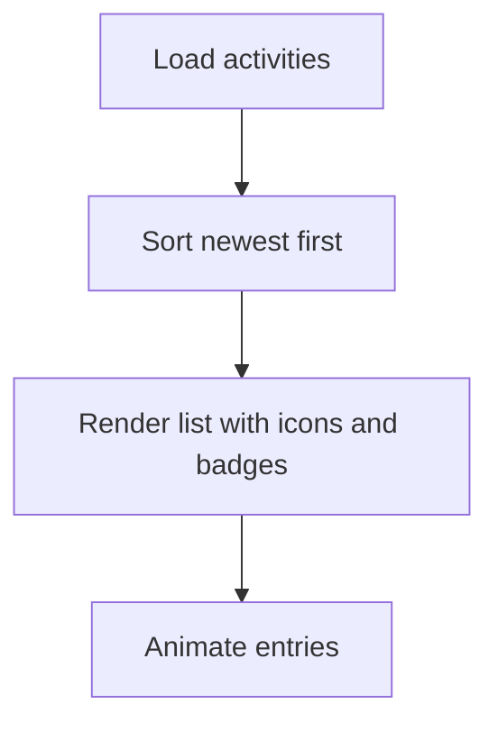

**Diagram sources**
- [activity-log.tsx](file://src/app/components/activity-log.tsx#L40-L117)

**Section sources**
- [activity-log.tsx](file://src/app/components/activity-log.tsx#L15-L117)

### Quantum Simulator
- Purpose: Demonstrate quantum attacks on classical vs post-quantum algorithms.
- Props: None.
- State:
  - isRunning, attacks[], qubits
- Behavior:
  - Starts/stops/pauses simulation.
  - Updates attack progress per algorithm category.

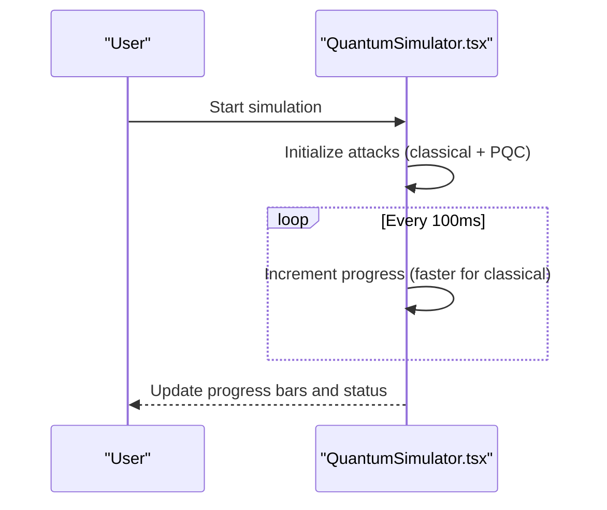

**Diagram sources**
- [quantum-simulator.tsx](file://src/app/components/quantum-simulator.tsx#L17-L316)

**Section sources**
- [quantum-simulator.tsx](file://src/app/components/quantum-simulator.tsx#L17-L316)

## Dependency Analysis
External libraries used across components:
- Three.js ecosystem: @react-three/fiber, @react-three/drei, three
- Data visualization: recharts
- Animation and UX: motion, sonner
- UI primitives: radix-ui packages (tabs, dialogs, progress, etc.)

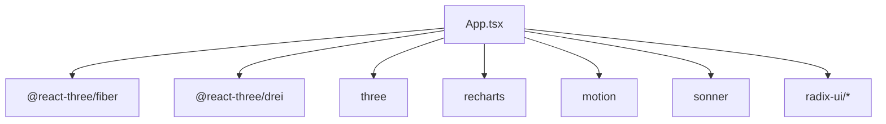

**Diagram sources**
- [package.json](file://package.json#L10-L68)
- [App.tsx](file://src/app/App.tsx#L1-L16)

**Section sources**
- [package.json](file://package.json#L10-L68)

## Performance Considerations
- 3D Rendering
  - Scene complexity: Scene3D uses instanced meshes and a fog effect; keep particle counts reasonable for mobile devices.
  - Auto-rotation and lighting: Prefer static lighting where possible; disable autoRotate in low-power contexts.
  - Memory: Reuse geometries and materials; avoid frequent re-instantiation.

- Real-time Analytics
  - Recharts: Use ResponsiveContainer and throttle updates for large datasets.
  - Large lists: Virtualization or pagination for activity logs and file queues.

- Simulations and Animations
  - Quantum simulator: Debounce or throttle progress updates; cap qubit range for responsiveness.
  - Encryption/file panels: Use minimal DOM updates; batch state changes.

- General
  - Lazy-load heavy components (e.g., 3D scenes) when not in view.
  - Use requestAnimationFrame wisely; avoid layout thrashing.

[No sources needed since this section provides general guidance]

## Troubleshooting Guide
- 3D Scenes not rendering
  - Verify Three.js and fiber/drei versions align with package.json.
  - Ensure Canvas is mounted and has explicit dimensions.

- Charts not appearing
  - Confirm Recharts is installed and ResponsiveContainer has a height.
  - Check data shapes match expected keys.

- Animations stuttering
  - Reduce particle counts or animation complexity.
  - Limit frame updates for simulations.

- Toast notifications not showing
  - Ensure Toaster is rendered at the root level.

**Section sources**
- [package.json](file://package.json#L10-L68)
- [App.tsx](file://src/app/App.tsx#L357-L357)

## Conclusion
The suite combines practical cryptographic workflows with immersive educational experiences. Components are modular, state-isolated where appropriate, and integrated through a central orchestrator. By leveraging Three.js and Recharts, the application delivers compelling visualizations while maintaining a clean separation of concerns. Extending the suite involves adding new algorithm options, integrating real cryptographic libraries, and expanding visualization datasets.

[No sources needed since this section summarizes without analyzing specific files]

## Appendices

### Usage Examples
- Educational demonstration
  - Open the Quantum Simulator tab to visualize quantum attacks on classical vs post-quantum algorithms.
  - Observe the animated 3D quantum visualization and progress bars.

- Real-world scenario
  - Select an algorithm in AlgorithmSelector.
  - Encrypt plaintext in EncryptionPanel; copy or download the ciphertext.
  - Generate keys in KeyManagement; export key pairs as needed.
  - Create a certificate in CertificateManager; export and distribute it.

- Security assessment
  - Use NetworkSecurity to scan and upgrade nodes.
  - Review QuantumThreatMeter for risk posture.
  - Inspect SecurityVisualization for historical and comparative insights.

[No sources needed since this section provides general guidance]

### Extension Guidelines
- Adding a new cryptographic algorithm
  - Extend AlgorithmType and the algorithm registry in AlgorithmSelector.
  - Update EncryptionPanel and KeyManagement to reflect new key sizes and naming conventions.
  - Add algorithm-specific metrics to SecurityVisualization datasets.

- Supporting new visualization types
  - Integrate additional Recharts components or external libraries.
  - Normalize data to fit existing chart interfaces.

- Integrating real cryptographic libraries
  - Replace simulation functions with library-backed implementations.
  - Add error handling and fallbacks for unsupported environments.

[No sources needed since this section provides general guidance]