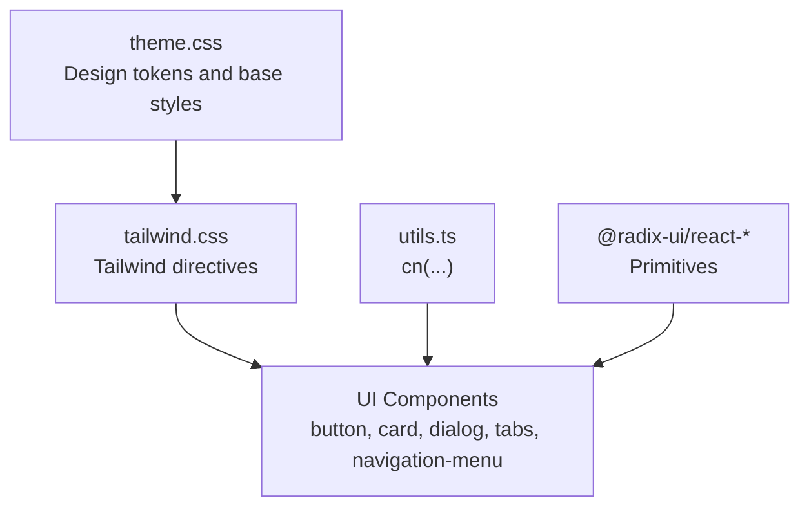
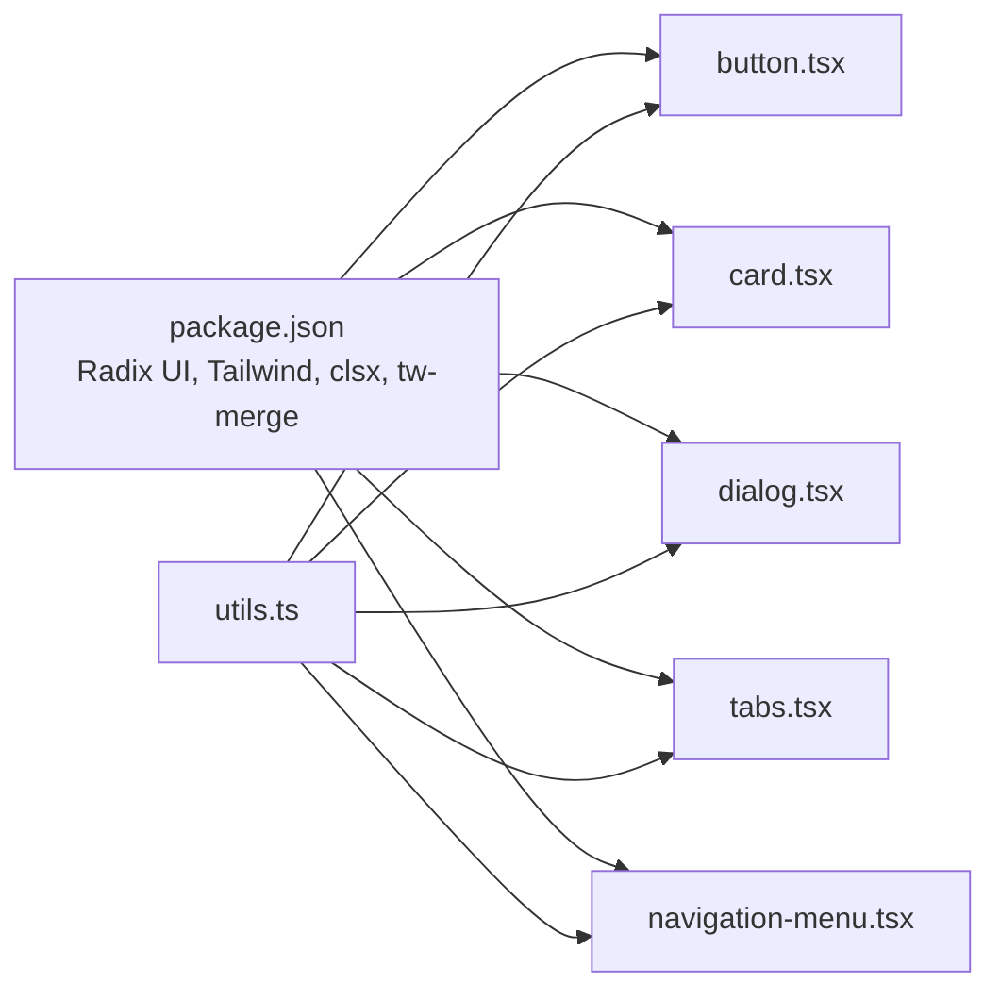

# UI Components

<cite>
**Referenced Files in This Document**
- [README.md](file://README.md)
- [package.json](file://package.json)
- [vite.config.ts](file://vite.config.ts)
- [src/styles/tailwind.css](file://src/styles/tailwind.css)
- [src/styles/theme.css](file://src/styles/theme.css)
- [src/app/components/ui/utils.ts](file://src/app/components/ui/utils.ts)
- [src/app/components/ui/button.tsx](file://src/app/components/ui/button.tsx)
- [src/app/components/ui/card.tsx](file://src/app/components/ui/card.tsx)
- [src/app/components/ui/dialog.tsx](file://src/app/components/ui/dialog.tsx)
- [src/app/components/ui/tabs.tsx](file://src/app/components/ui/tabs.tsx)
- [src/app/components/ui/navigation-menu.tsx](file://src/app/components/ui/navigation-menu.tsx)
- [src/app/components/ui/form.tsx](file://src/app/components/ui/form.tsx)
- [src/app/components/ui/input.tsx](file://src/app/components/ui/input.tsx)
- [src/app/components/ui/textarea.tsx](file://src/app/components/ui/textarea.tsx)
- [src/app/components/ui/select.tsx](file://src/app/components/ui/select.tsx)
- [src/app/components/ui/checkbox.tsx](file://src/app/components/ui/checkbox.tsx)
- [src/app/components/ui/radio-group.tsx](file://src/app/components/ui/radio-group.tsx)
- [src/app/components/ui/switch.tsx](file://src/app/components/ui/switch.tsx)
- [src/app/components/ui/slider.tsx](file://src/app/components/ui/slider.tsx)
- [src/app/components/ui/toggle.tsx](file://src/app/components/ui/toggle.tsx)
- [src/app/components/ui/toggle-group.tsx](file://src/app/components/ui/toggle-group.tsx)
- [src/app/components/ui/badge.tsx](file://src/app/components/ui/badge.tsx)
- [src/app/components/ui/avatar.tsx](file://src/app/components/ui/avatar.tsx)
- [src/app/components/ui/chart.tsx](file://src/app/components/ui/chart.tsx)
- [src/app/components/ui/table.tsx](file://src/app/components/ui/table.tsx)
- [src/app/components/ui/pagination.tsx](file://src/app/components/ui/pagination.tsx)
- [src/app/components/ui/alert.tsx](file://src/app/components/ui/alert.tsx)
- [src/app/components/ui/alert-dialog.tsx](file://src/app/components/ui/alert-dialog.tsx)
- [src/app/components/ui/tooltip.tsx](file://src/app/components/ui/tooltip.tsx)
- [src/app/components/ui/popover.tsx](file://src/app/components/ui/popover.tsx)
- [src/app/components/ui/context-menu.tsx](file://src/app/components/ui/context-menu.tsx)
- [src/app/components/ui/menubar.tsx](file://src/app/components/ui/menubar.tsx)
- [src/app/components/ui/dropdown-menu.tsx](file://src/app/components/ui/dropdown-menu.tsx)
- [src/app/components/ui/calendar.tsx](file://src/app/components/ui/calendar.tsx)
- [src/app/components/ui/progress.tsx](file://src/app/components/ui/progress.tsx)
- [src/app/components/ui/scroll-area.tsx](file://src/app/components/ui/scroll-area.tsx)
- [src/app/components/ui/resizable.tsx](file://src/app/components/ui/resizable.tsx)
- [src/app/components/ui/skeleton.tsx](file://src/app/components/ui/skeleton.tsx)
- [src/app/components/ui/aspect-ratio.tsx](file://src/app/components/ui/aspect-ratio.tsx)
- [src/app/components/ui/breadcrumb.tsx](file://src/app/components/ui/breadcrumb.tsx)
- [src/app/components/ui/separator.tsx](file://src/app/components/ui/separator.tsx)
- [src/app/components/ui/sidebar.tsx](file://src/app/components/ui/sidebar.tsx)
- [src/app/components/ui/sheet.tsx](file://src/app/components/ui/sheet.tsx)
- [src/app/components/ui/drawer.tsx](file://src/app/components/ui/drawer.tsx)
- [src/app/components/ui/carousel.tsx](file://src/app/components/ui/carousel.tsx)
- [src/app/components/ui/hover-card.tsx](file://src/app/components/ui/hover-card.tsx)
- [src/app/components/ui/command.tsx](file://src/app/components/ui/command.tsx)
- [src/app/components/ui/collapsible.tsx](file://src/app/components/ui/collapsible.tsx)
- [src/app/components/ui/accordion.tsx](file://src/app/components/ui/accordion.tsx)
- [src/app/components/ui/input-otp.tsx](file://src/app/components/ui/input-otp.tsx)
- [src/app/components/ui/sonner.tsx](file://src/app/components/ui/sonner.tsx)
- [src/app/components/ui/use-mobile.ts](file://src/app/components/ui/use-mobile.ts)
</cite>

## Table of Contents
1. [Introduction](#introduction)
2. [Project Structure](#project-structure)
3. [Core Components](#core-components)
4. [Architecture Overview](#architecture-overview)
5. [Detailed Component Analysis](#detailed-component-analysis)
6. [Dependency Analysis](#dependency-analysis)
7. [Performance Considerations](#performance-considerations)
8. [Troubleshooting Guide](#troubleshooting-guide)
9. [Conclusion](#conclusion)
10. [Appendices](#appendices)

## Introduction
This document describes the UI Components library used across the Post-Quantum Cryptography Educational Platform. The library is built on Radix UI primitives and styled with Tailwind CSS, emphasizing accessibility, consistency, and educational usability. It includes 20+ reusable components such as buttons, cards, forms, dialogs, tabs, and navigation elements. The design system leverages a cohesive color palette, typography tokens, and spacing units defined in the theme, while maintaining responsive behavior and cross-browser compatibility through modern tooling.

## Project Structure
The UI components live under src/app/components/ui and are complemented by shared styling and utilities:
- UI primitives: src/app/components/ui/*.tsx
- Utilities: src/app/components/ui/utils.ts
- Styles: src/styles/tailwind.css, src/styles/theme.css
- Tooling: vite.config.ts, package.json

```mermaid
graph TB
subgraph "Styles"
TW["tailwind.css"]
TH["theme.css"]
end
subgraph "Utilities"
UT["utils.ts"]
end
subgraph "Components"
BTN["button.tsx"]
CARD["card.tsx"]
DLG["dialog.tsx"]
TABS["tabs.tsx"]
NAV["navigation-menu.tsx"]
FORM["form.tsx"]
INPUT["input.tsx"]
TEXT["textarea.tsx"]
SEL["select.tsx"]
CHK["checkbox.tsx"]
RG["radio-group.tsx"]
SW["switch.tsx"]
SL["slider.tsx"]
TG["toggle.tsx"]
TGG["toggle-group.tsx"]
BADGE["badge.tsx"]
AVA["avatar.tsx"]
CHART["chart.tsx"]
TABLE["table.tsx"]
PAG["pagination.tsx"]
ALERT["alert.tsx"]
ADLG["alert-dialog.tsx"]
TT["tooltip.tsx"]
POP["popover.tsx"]
CMENU["context-menu.tsx"]
MBAR["menubar.tsx"]
DDM["dropdown-menu.tsx"]
CAL["calendar.tsx"]
PROG["progress.tsx"]
SCROLL["scroll-area.tsx"]
RES["resizable.tsx"]
SKEL["skeleton.tsx"]
ASPE["aspect-ratio.tsx"]
BREAD["breadcrumb.tsx"]
SEP["separator.tsx"]
SB["sidebar.tsx"]
SHEET["sheet.tsx"]
DRAW["drawer.tsx"]
CAR["carousel.tsx"]
HCARD["hover-card.tsx"]
CMD["command.tsx"]
COLL["collapsible.tsx"]
ACC["accordion.tsx"]
OTP["input-otp.tsx"]
SNER["sonner.tsx"]
MOBILE["use-mobile.ts"]
end
BTN --> UT
CARD --> UT
DLG --> UT
TABS --> UT
NAV --> UT
FORM --> UT
INPUT --> UT
TEXT --> UT
SEL --> UT
CHK --> UT
RG --> UT
SW --> UT
SL --> UT
TG --> UT
TGG --> UT
BADGE --> UT
AVA --> UT
CHART --> UT
TABLE --> UT
PAG --> UT
ALERT --> UT
ADLG --> UT
TT --> UT
POP --> UT
CMENU --> UT
DDM --> UT
MBAR --> UT
CAL --> UT
PROG --> UT
SCROLL --> UT
RES --> UT
SKEL --> UT
ASPE --> UT
BREAD --> UT
SEP --> UT
SB --> UT
SHEET --> UT
DRAW --> UT
CAR --> UT
HCARD --> UT
CMD --> UT
COLL --> UT
ACC --> UT
OTP --> UT
SNER --> UT
MOBILE --> UT
TW --> TH
```

**Diagram sources**
- [src/styles/tailwind.css](file://src/styles/tailwind.css#L1-L5)
- [src/styles/theme.css](file://src/styles/theme.css#L1-L188)
- [src/app/components/ui/utils.ts](file://src/app/components/ui/utils.ts#L1-L7)
- [src/app/components/ui/button.tsx](file://src/app/components/ui/button.tsx#L1-L58)
- [src/app/components/ui/card.tsx](file://src/app/components/ui/card.tsx#L1-L93)
- [src/app/components/ui/dialog.tsx](file://src/app/components/ui/dialog.tsx#L1-L136)
- [src/app/components/ui/tabs.tsx](file://src/app/components/ui/tabs.tsx#L1-L67)
- [src/app/components/ui/navigation-menu.tsx](file://src/app/components/ui/navigation-menu.tsx#L1-L169)

**Section sources**
- [README.md](file://README.md#L1-L11)
- [package.json](file://package.json#L1-L93)
- [src/styles/tailwind.css](file://src/styles/tailwind.css#L1-L5)
- [src/styles/theme.css](file://src/styles/theme.css#L1-L188)
- [src/app/components/ui/utils.ts](file://src/app/components/ui/utils.ts#L1-L7)

## Core Components
This section outlines the design philosophy and core capabilities of the UI library:
- Accessibility-first: Components use semantic HTML, ARIA attributes, and keyboard navigation patterns via Radix UI.
- Consistency: Shared design tokens (colors, typography, spacing) ensure uniform appearance across components.
- Educational usability: Clear affordances, readable typography, and appropriate contrast ratios support learning scenarios.
- Responsive design: Tailwind utilities and container queries enable adaptive layouts.
- Extensibility: Variants and slots allow customization without breaking the design system.

Key patterns across components:
- Variant system using class-variance-authority for consistent styling.
- Utility function cn(...) for merging Tailwind classes safely.
- Data attributes (data-slot) to identify component parts for styling and testing.
- Radix UI primitives for robust accessibility and behavior.

**Section sources**
- [src/app/components/ui/utils.ts](file://src/app/components/ui/utils.ts#L1-L7)
- [src/styles/theme.css](file://src/styles/theme.css#L1-L188)

## Architecture Overview
The UI library integrates tightly with Tailwind CSS and Radix UI:
- Tailwind CSS compiles design tokens from theme.css into utility classes.
- Radix UI provides accessible, unstyled primitives that components wrap.
- Utilities consolidate class merging and composition.

**Diagram sources**
- [src/styles/theme.css](file://src/styles/theme.css#L1-L188)
- [src/styles/tailwind.css](file://src/styles/tailwind.css#L1-L5)
- [src/app/components/ui/utils.ts](file://src/app/components/ui/utils.ts#L1-L7)

## Detailed Component Analysis

### Buttons
- Purpose: Primary action surfaces with consistent affordance and interaction feedback.
- Variants: default, destructive, outline, secondary, ghost, link.
- Sizes: default, sm, lg, icon.
- Props:
  - className: Additional Tailwind classes.
  - variant: One of the supported variants.
  - size: One of the supported sizes.
  - asChild: Render as a Radix Slot to compose links or other elements.
  - Other native button props (onClick, disabled, aria-*).
- Events: Standard click and keyboard activation.
- Accessibility: Focus ring, disabled state, gradient overlay on press, 3D-like motion.
- Customization: Extend buttonVariants with new variants; adjust tokens in theme.css.

Usage example references:
- [Button usage pattern](file://src/app/components/ui/button.tsx#L37-L56)

**Section sources**
- [src/app/components/ui/button.tsx](file://src/app/components/ui/button.tsx#L1-L58)
- [src/styles/theme.css](file://src/styles/theme.css#L1-L188)

### Cards
- Purpose: Group related content and actions with consistent spacing and borders.
- Composition:
  - Card: Root container.
  - CardHeader/CardTitle/CardDescription/CardAction: Header area with optional action.
  - CardContent/CardFooter: Body and footer areas.
- Props: className for each part; all accept standard div props.
- Accessibility: Semantic grouping; ensure header/content hierarchy.
- Customization: Modify padding, border radius, and background tokens.

Usage example references:
- [Card composition](file://src/app/components/ui/card.tsx#L5-L92)

**Section sources**
- [src/app/components/ui/card.tsx](file://src/app/components/ui/card.tsx#L1-L93)
- [src/styles/theme.css](file://src/styles/theme.css#L1-L188)

### Dialogs
- Purpose: Modal overlays for focused tasks or confirmations.
- Composition:
  - Dialog: Root wrapper.
  - DialogTrigger/DialogPortal/DialogOverlay/DialogContent/DialogClose.
  - DialogHeader/DialogFooter/DialogTitle/DialogDescription.
- Props: className; all accept primitive props.
- Accessibility: Focus trapping, Escape key handling, screen reader labels, backdrop interaction.
- Customization: Adjust animation classes, overlay opacity, and content sizing.

Usage example references:
- [Dialog composition](file://src/app/components/ui/dialog.tsx#L9-L135)

**Section sources**
- [src/app/components/ui/dialog.tsx](file://src/app/components/ui/dialog.tsx#L1-L136)
- [src/styles/theme.css](file://src/styles/theme.css#L1-L188)

### Tabs
- Purpose: Switch between related content sections.
- Composition:
  - Tabs: Root.
  - TabsList: Container for triggers.
  - TabsTrigger: Individual tab selector.
  - TabsContent: Panel content.
- Props: className; supports orientation and activation modes via Radix.
- Accessibility: Keyboard navigation, ARIA controls and labelledby, focus management.
- Customization: Modify trigger states, active indicators, and animations.

Usage example references:
- [Tabs composition](file://src/app/components/ui/tabs.tsx#L8-L66)

**Section sources**
- [src/app/components/ui/tabs.tsx](file://src/app/components/ui/tabs.tsx#L1-L67)
- [src/styles/theme.css](file://src/styles/theme.css#L1-L188)

### Navigation Menu
- Purpose: Hierarchical navigation with viewport-aware dropdowns.
- Composition:
  - NavigationMenu: Root with optional viewport.
  - NavigationMenuList/NavigationMenuItem.
  - NavigationMenuTrigger/NavigationMenuContent/NavigationMenuViewport.
  - NavigationMenuLink/NavigationMenuIndicator.
- Props: className; viewport toggle; trigger children.
- Accessibility: Hover/focus semantics, open/close states, indicator visibility.
- Customization: Adjust motion variants, viewport sizing, and trigger styles.

Usage example references:
- [Navigation menu composition](file://src/app/components/ui/navigation-menu.tsx#L8-L168)

**Section sources**
- [src/app/components/ui/navigation-menu.tsx](file://src/app/components/ui/navigation-menu.tsx#L1-L169)
- [src/styles/theme.css](file://src/styles/theme.css#L1-L188)

### Forms and Inputs
- Input: Text input with consistent focus states and invalid ring.
- Textarea: Multi-line input with similar focus and invalid states.
- Select: Single-select dropdown with accessible options.
- Checkbox/RadioGroup/Switch: Primitive-based selection controls.
- Slider/Toggle/ToggleGroup: Range and binary selection controls.
- Badge: Label or status indicator.
- Avatar: User or entity image with fallback.
- OTP Input: Digit-focused input with paste and navigation behavior.
- Chart/Table/Pagination: Data presentation components.
- Alert/Alert Dialog: Notification and confirmation overlays.
- Tooltip/Popover/Context Menu/Dropdown Menu/Menubar: Popovers and menus.
- Calendar/Progress/Scroll Area/Resizable/Skeleton/Aspect Ratio/Breadcrumb/Separator: Supporting UI.
- Sidebar/Sheet/Drawer: Layout and panel containers.
- Carousel/Hover Card/Command/Collapsible/Accordion: Advanced interactions.
- Sonner: Toast notifications.

Usage example references:
- [Form composition](file://src/app/components/ui/form.tsx)
- [Input composition](file://src/app/components/ui/input.tsx)
- [Textarea composition](file://src/app/components/ui/textarea.tsx)
- [Select composition](file://src/app/components/ui/select.tsx)
- [Checkbox composition](file://src/app/components/ui/checkbox.tsx)
- [RadioGroup composition](file://src/app/components/ui/radio-group.tsx)
- [Switch composition](file://src/app/components/ui/switch.tsx)
- [Slider composition](file://src/app/components/ui/slider.tsx)
- [Toggle composition](file://src/app/components/ui/toggle.tsx)
- [ToggleGroup composition](file://src/app/components/ui/toggle-group.tsx)
- [Badge composition](file://src/app/components/ui/badge.tsx)
- [Avatar composition](file://src/app/components/ui/avatar.tsx)
- [Chart composition](file://src/app/components/ui/chart.tsx)
- [Table composition](file://src/app/components/ui/table.tsx)
- [Pagination composition](file://src/app/components/ui/pagination.tsx)
- [Alert composition](file://src/app/components/ui/alert.tsx)
- [AlertDialog composition](file://src/app/components/ui/alert-dialog.tsx)
- [Tooltip composition](file://src/app/components/ui/tooltip.tsx)
- [Popover composition](file://src/app/components/ui/popover.tsx)
- [ContextMenu composition](file://src/app/components/ui/context-menu.tsx)
- [Menubar composition](file://src/app/components/ui/menubar.tsx)
- [DropdownMenu composition](file://src/app/components/ui/dropdown-menu.tsx)
- [Calendar composition](file://src/app/components/ui/calendar.tsx)
- [Progress composition](file://src/app/components/ui/progress.tsx)
- [ScrollArea composition](file://src/app/components/ui/scroll-area.tsx)
- [Resizable composition](file://src/app/components/ui/resizable.tsx)
- [Skeleton composition](file://src/app/components/ui/skeleton.tsx)
- [AspectRatio composition](file://src/app/components/ui/aspect-ratio.tsx)
- [Breadcrumb composition](file://src/app/components/ui/breadcrumb.tsx)
- [Separator composition](file://src/app/components/ui/separator.tsx)
- [Sidebar composition](file://src/app/components/ui/sidebar.tsx)
- [Sheet composition](file://src/app/components/ui/sheet.tsx)
- [Drawer composition](file://src/app/components/ui/drawer.tsx)
- [Carousel composition](file://src/app/components/ui/carousel.tsx)
- [HoverCard composition](file://src/app/components/ui/hover-card.tsx)
- [Command composition](file://src/app/components/ui/command.tsx)
- [Collapsible composition](file://src/app/components/ui/collapsible.tsx)
- [Accordion composition](file://src/app/components/ui/accordion.tsx)
- [InputOTP composition](file://src/app/components/ui/input-otp.tsx)
- [Sonner composition](file://src/app/components/ui/sonner.tsx)
- [use-mobile composition](file://src/app/components/ui/use-mobile.ts)

**Section sources**
- [src/app/components/ui/form.tsx](file://src/app/components/ui/form.tsx)
- [src/app/components/ui/input.tsx](file://src/app/components/ui/input.tsx)
- [src/app/components/ui/textarea.tsx](file://src/app/components/ui/textarea.tsx)
- [src/app/components/ui/select.tsx](file://src/app/components/ui/select.tsx)
- [src/app/components/ui/checkbox.tsx](file://src/app/components/ui/checkbox.tsx)
- [src/app/components/ui/radio-group.tsx](file://src/app/components/ui/radio-group.tsx)
- [src/app/components/ui/switch.tsx](file://src/app/components/ui/switch.tsx)
- [src/app/components/ui/slider.tsx](file://src/app/components/ui/slider.tsx)
- [src/app/components/ui/toggle.tsx](file://src/app/components/ui/toggle.tsx)
- [src/app/components/ui/toggle-group.tsx](file://src/app/components/ui/toggle-group.tsx)
- [src/app/components/ui/badge.tsx](file://src/app/components/ui/badge.tsx)
- [src/app/components/ui/avatar.tsx](file://src/app/components/ui/avatar.tsx)
- [src/app/components/ui/chart.tsx](file://src/app/components/ui/chart.tsx)
- [src/app/components/ui/table.tsx](file://src/app/components/ui/table.tsx)
- [src/app/components/ui/pagination.tsx](file://src/app/components/ui/pagination.tsx)
- [src/app/components/ui/alert.tsx](file://src/app/components/ui/alert.tsx)
- [src/app/components/ui/alert-dialog.tsx](file://src/app/components/ui/alert-dialog.tsx)
- [src/app/components/ui/tooltip.tsx](file://src/app/components/ui/tooltip.tsx)
- [src/app/components/ui/popover.tsx](file://src/app/components/ui/popover.tsx)
- [src/app/components/ui/context-menu.tsx](file://src/app/components/ui/context-menu.tsx)
- [src/app/components/ui/menubar.tsx](file://src/app/components/ui/menubar.tsx)
- [src/app/components/ui/dropdown-menu.tsx](file://src/app/components/ui/dropdown-menu.tsx)
- [src/app/components/ui/calendar.tsx](file://src/app/components/ui/calendar.tsx)
- [src/app/components/ui/progress.tsx](file://src/app/components/ui/progress.tsx)
- [src/app/components/ui/scroll-area.tsx](file://src/app/components/ui/scroll-area.tsx)
- [src/app/components/ui/resizable.tsx](file://src/app/components/ui/resizable.tsx)
- [src/app/components/ui/skeleton.tsx](file://src/app/components/ui/skeleton.tsx)
- [src/app/components/ui/aspect-ratio.tsx](file://src/app/components/ui/aspect-ratio.tsx)
- [src/app/components/ui/breadcrumb.tsx](file://src/app/components/ui/breadcrumb.tsx)
- [src/app/components/ui/separator.tsx](file://src/app/components/ui/separator.tsx)
- [src/app/components/ui/sidebar.tsx](file://src/app/components/ui/sidebar.tsx)
- [src/app/components/ui/sheet.tsx](file://src/app/components/ui/sheet.tsx)
- [src/app/components/ui/drawer.tsx](file://src/app/components/ui/drawer.tsx)
- [src/app/components/ui/carousel.tsx](file://src/app/components/ui/carousel.tsx)
- [src/app/components/ui/hover-card.tsx](file://src/app/components/ui/hover-card.tsx)
- [src/app/components/ui/command.tsx](file://src/app/components/ui/command.tsx)
- [src/app/components/ui/collapsible.tsx](file://src/app/components/ui/collapsible.tsx)
- [src/app/components/ui/accordion.tsx](file://src/app/components/ui/accordion.tsx)
- [src/app/components/ui/input-otp.tsx](file://src/app/components/ui/input-otp.tsx)
- [src/app/components/ui/sonner.tsx](file://src/app/components/ui/sonner.tsx)
- [src/app/components/ui/use-mobile.ts](file://src/app/components/ui/use-mobile.ts)

## Dependency Analysis
The UI components depend on:
- Radix UI packages for accessible primitives.
- Tailwind CSS for utility classes and animations.
- Class merging utilities for safe composition.
- Theme tokens for consistent colors and spacing.

**Diagram sources**
- [package.json](file://package.json#L10-L68)
- [src/app/components/ui/utils.ts](file://src/app/components/ui/utils.ts#L1-L7)
- [src/app/components/ui/button.tsx](file://src/app/components/ui/button.tsx#L1-L58)
- [src/app/components/ui/card.tsx](file://src/app/components/ui/card.tsx#L1-L93)
- [src/app/components/ui/dialog.tsx](file://src/app/components/ui/dialog.tsx#L1-L136)
- [src/app/components/ui/tabs.tsx](file://src/app/components/ui/tabs.tsx#L1-L67)
- [src/app/components/ui/navigation-menu.tsx](file://src/app/components/ui/navigation-menu.tsx#L1-L169)

**Section sources**
- [package.json](file://package.json#L10-L68)
- [src/app/components/ui/utils.ts](file://src/app/components/ui/utils.ts#L1-L7)

## Performance Considerations
- Prefer variant-based styling to minimize CSS bloat.
- Use container queries and responsive utilities to avoid layout thrashing.
- Keep component trees shallow for dialogs and popovers.
- Leverage CSS transitions sparingly; use hardware-accelerated properties where possible.
- Bundle and tree-shake Radix UI primitives to reduce payload.

## Troubleshooting Guide
Common issues and resolutions:
- Incorrect focus rings or missing focus-visible styles: Verify theme.css focus tokens and ensure components apply focus-visible utilities.
- Dialog content not scrolling: Confirm ScrollArea is used inside DialogContent when needed.
- Dropdown menus clipped by viewport: Use Portal wrappers and ensure z-index stacking contexts are correct.
- Form field invalid states not visible: Apply aria-invalid and ensure destructive ring tokens are present in theme.css.
- Mobile responsiveness: Use container queries and responsive breakpoints; test with use-mobile hook patterns.

**Section sources**
- [src/styles/theme.css](file://src/styles/theme.css#L122-L188)
- [src/app/components/ui/dialog.tsx](file://src/app/components/ui/dialog.tsx#L54-L72)
- [src/app/components/ui/navigation-menu.tsx](file://src/app/components/ui/navigation-menu.tsx#L102-L122)

## Conclusion
The UI Components library provides a robust, accessible, and consistent foundation for the Post-Quantum Cryptography Educational Platform. By combining Radix UI primitives with a carefully curated design system and Tailwind utilities, the library ensures predictable behavior, strong accessibility, and easy extensibility. Adhering to the patterns outlined here will help maintain quality and scalability as new components are added.

## Appendices

### Integration with Tailwind CSS and Theme Tokens
- Tailwind directives load source files and animations.
- Theme CSS defines CSS variables for colors, typography, and radii.
- Base layer applies global resets and typography defaults.

**Section sources**
- [src/styles/tailwind.css](file://src/styles/tailwind.css#L1-L5)
- [src/styles/theme.css](file://src/styles/theme.css#L1-L188)

### Utility Functions
- cn(...) merges Tailwind classes with clsx and tw-merge to prevent conflicts.

**Section sources**
- [src/app/components/ui/utils.ts](file://src/app/components/ui/utils.ts#L1-L7)

### Example Usage References
- Button: [button.tsx](file://src/app/components/ui/button.tsx#L37-L56)
- Card: [card.tsx](file://src/app/components/ui/card.tsx#L5-L92)
- Dialog: [dialog.tsx](file://src/app/components/ui/dialog.tsx#L9-L135)
- Tabs: [tabs.tsx](file://src/app/components/ui/tabs.tsx#L8-L66)
- Navigation Menu: [navigation-menu.tsx](file://src/app/components/ui/navigation-menu.tsx#L8-L168)
- Form/Input/Select/Checkbox/RadioGroup/Switch/Slider/Toggle/ToggleGroup/Badge/Avatar/Chart/Table/Pagination/Alert/AlertDialog/Tooltip/Popover/ContextMenu/Menubar/DropdownMenu/Calendar/Progress/ScrollArea/Resizable/Skeleton/AspectRatio/Breadcrumb/Separator/Sidebar/Sheet/Drawer/Carousel/HoverCard/Command/Collapsible/Accordion/InputOTP/Sonner/use-mobile: [form.tsx](file://src/app/components/ui/form.tsx), [input.tsx](file://src/app/components/ui/input.tsx), [textarea.tsx](file://src/app/components/ui/textarea.tsx), [select.tsx](file://src/app/components/ui/select.tsx), [checkbox.tsx](file://src/app/components/ui/checkbox.tsx), [radio-group.tsx](file://src/app/components/ui/radio-group.tsx), [switch.tsx](file://src/app/components/ui/switch.tsx), [slider.tsx](file://src/app/components/ui/slider.tsx), [toggle.tsx](file://src/app/components/ui/toggle.tsx), [toggle-group.tsx](file://src/app/components/ui/toggle-group.tsx), [badge.tsx](file://src/app/components/ui/badge.tsx), [avatar.tsx](file://src/app/components/ui/avatar.tsx), [chart.tsx](file://src/app/components/ui/chart.tsx), [table.tsx](file://src/app/components/ui/table.tsx), [pagination.tsx](file://src/app/components/ui/pagination.tsx), [alert.tsx](file://src/app/components/ui/alert.tsx), [alert-dialog.tsx](file://src/app/components/ui/alert-dialog.tsx), [tooltip.tsx](file://src/app/components/ui/tooltip.tsx), [popover.tsx](file://src/app/components/ui/popover.tsx), [context-menu.tsx](file://src/app/components/ui/context-menu.tsx), [menubar.tsx](file://src/app/components/ui/menubar.tsx), [dropdown-menu.tsx](file://src/app/components/ui/dropdown-menu.tsx), [calendar.tsx](file://src/app/components/ui/calendar.tsx), [progress.tsx](file://src/app/components/ui/progress.tsx), [scroll-area.tsx](file://src/app/components/ui/scroll-area.tsx), [resizable.tsx](file://src/app/components/ui/resizable.tsx), [skeleton.tsx](file://src/app/components/ui/skeleton.tsx), [aspect-ratio.tsx](file://src/app/components/ui/aspect-ratio.tsx), [breadcrumb.tsx](file://src/app/components/ui/breadcrumb.tsx), [separator.tsx](file://src/app/components/ui/separator.tsx), [sidebar.tsx](file://src/app/components/ui/sidebar.tsx), [sheet.tsx](file://src/app/components/ui/sheet.tsx), [drawer.tsx](file://src/app/components/ui/drawer.tsx), [carousel.tsx](file://src/app/components/ui/carousel.tsx), [hover-card.tsx](file://src/app/components/ui/hover-card.tsx), [command.tsx](file://src/app/components/ui/command.tsx), [collapsible.tsx](file://src/app/components/ui/collapsible.tsx), [accordion.tsx](file://src/app/components/ui/accordion.tsx), [input-otp.tsx](file://src/app/components/ui/input-otp.tsx), [sonner.tsx](file://src/app/components/ui/sonner.tsx), [use-mobile.ts](file://src/app/components/ui/use-mobile.ts)