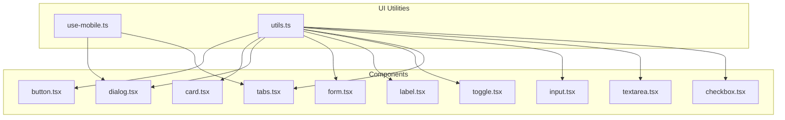
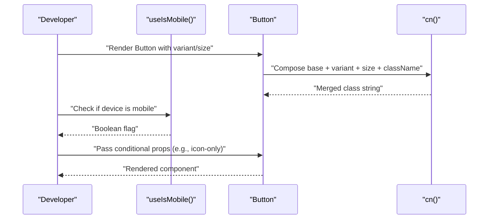
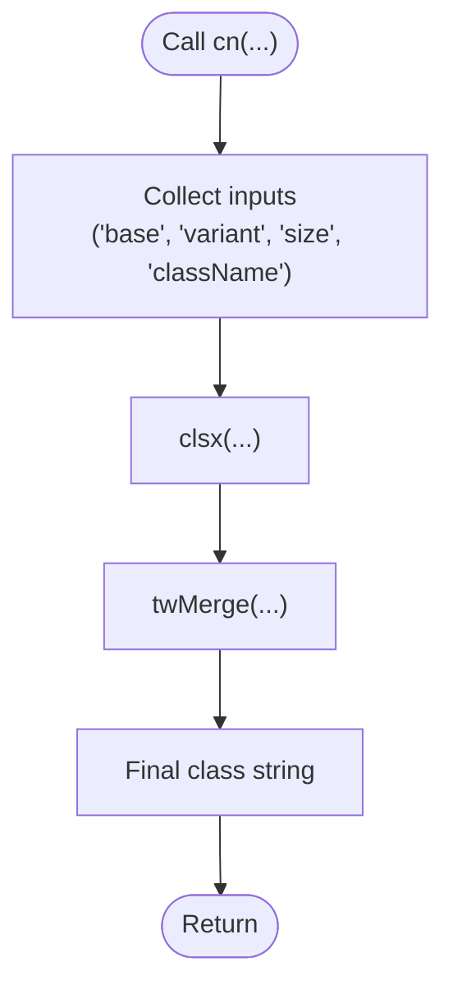
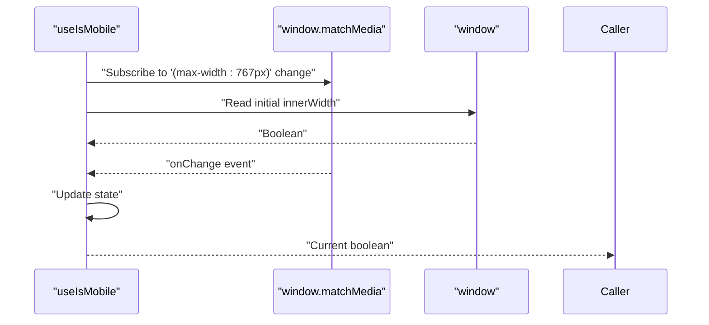
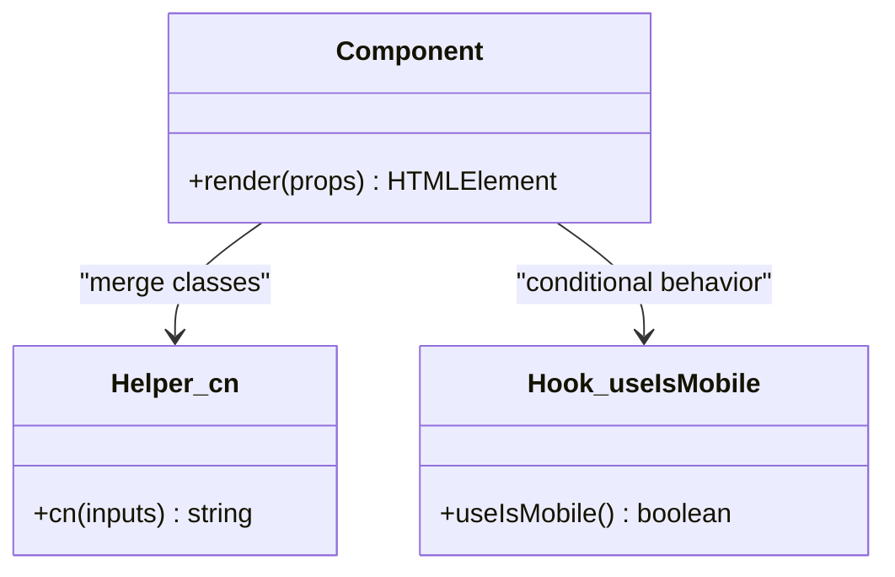
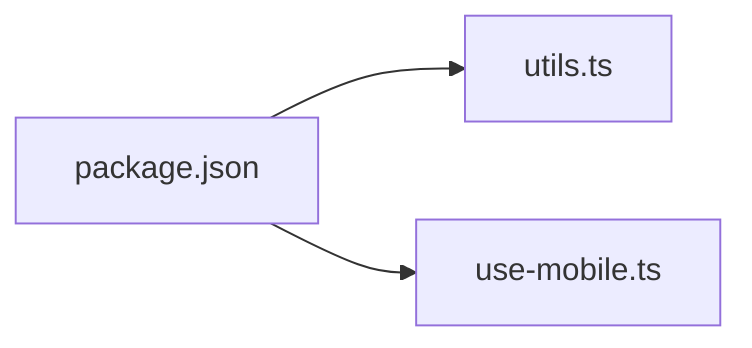

# Utility and Helper Functions

<cite>
**Referenced Files in This Document**
- [use-mobile.ts](file://Design/src/app/components/ui/use-mobile.ts)
- [utils.ts](file://Design/src/app/components/ui/utils.ts)
- [button.tsx](file://Design/src/app/components/ui/button.tsx)
- [card.tsx](file://Design/src/app/components/ui/card.tsx)
- [dialog.tsx](file://Design/src/app/components/ui/dialog.tsx)
- [form.tsx](file://Design/src/app/components/ui/form.tsx)
- [label.tsx](file://Design/src/app/components/ui/label.tsx)
- [toggle.tsx](file://Design/src/app/components/ui/toggle.tsx)
- [tabs.tsx](file://Design/src/app/components/ui/tabs.tsx)
- [input.tsx](file://Design/src/app/components/ui/input.tsx)
- [textarea.tsx](file://Design/src/app/components/ui/textarea.tsx)
- [checkbox.tsx](file://Design/src/app/components/ui/checkbox.tsx)
- [Guidelines.md](file://Design/guidelines/Guidelines.md)
- [package.json](file://Design/package.json)
</cite>

## Table of Contents
1. [Introduction](#introduction)
2. [Project Structure](#project-structure)
3. [Core Components](#core-components)
4. [Architecture Overview](#architecture-overview)
5. [Detailed Component Analysis](#detailed-component-analysis)
6. [Dependency Analysis](#dependency-analysis)
7. [Performance Considerations](#performance-considerations)
8. [Troubleshooting Guide](#troubleshooting-guide)
9. [Conclusion](#conclusion)
10. [Appendices](#appendices)

## Introduction
This document explains the utility and helper functions that underpin the UI Component library. It focuses on:
- Component composition helpers that unify styling and behavior across primitives and specialized components
- Styling helpers that merge Tailwind classes safely and consistently
- Responsive design utilities and hooks that adapt UI behavior to device capabilities
- Accessibility patterns embedded in helpers and components
- Practical usage examples and guidelines for extending the system with new utilities

## Project Structure
The UI utilities live under the shared UI components directory and are consumed by primitive and composite components. The key files are:
- A lightweight styling helper for merging Tailwind classes
- A mobile detection hook for responsive behavior
- Primitive and composite components that demonstrate consistent usage of the helper and responsive patterns

**Diagram sources**
- [use-mobile.ts](file://Design/src/app/components/ui/use-mobile.ts#L1-L22)
- [utils.ts](file://Design/src/app/components/ui/utils.ts#L1-L7)
- [button.tsx](file://Design/src/app/components/ui/button.tsx#L1-L58)
- [card.tsx](file://Design/src/app/components/ui/card.tsx#L1-L93)
- [dialog.tsx](file://Design/src/app/components/ui/dialog.tsx#L1-L136)
- [form.tsx](file://Design/src/app/components/ui/form.tsx#L1-L169)
- [label.tsx](file://Design/src/app/components/ui/label.tsx#L1-L25)
- [toggle.tsx](file://Design/src/app/components/ui/toggle.tsx#L1-L48)
- [tabs.tsx](file://Design/src/app/components/ui/tabs.tsx#L1-L67)
- [input.tsx](file://Design/src/app/components/ui/input.tsx#L1-L22)
- [textarea.tsx](file://Design/src/app/components/ui/textarea.tsx#L1-L19)
- [checkbox.tsx](file://Design/src/app/components/ui/checkbox.tsx#L1-L33)

**Section sources**
- [use-mobile.ts](file://Design/src/app/components/ui/use-mobile.ts#L1-L22)
- [utils.ts](file://Design/src/app/components/ui/utils.ts#L1-L7)

## Core Components
- Styling helper: A single function merges and deduplicates Tailwind classes, ensuring predictable overrides and minimal CSS output.
- Mobile detection hook: Provides a reactive signal for responsive rendering and behavior switching.

These utilities are foundational and used pervasively across components to maintain consistent styling and responsive behavior.

**Section sources**
- [utils.ts](file://Design/src/app/components/ui/utils.ts#L1-L7)
- [use-mobile.ts](file://Design/src/app/components/ui/use-mobile.ts#L1-L22)

## Architecture Overview
The helper architecture follows a unidirectional pattern:
- Components import the styling helper to compose class names
- Components optionally consume the mobile hook to alter layout or behavior on smaller screens
- Components expose consistent data attributes and accessibility props for testing and assistive technologies

**Diagram sources**
- [use-mobile.ts](file://Design/src/app/components/ui/use-mobile.ts#L5-L21)
- [utils.ts](file://Design/src/app/components/ui/utils.ts#L4-L6)
- [button.tsx](file://Design/src/app/components/ui/button.tsx#L37-L56)

## Detailed Component Analysis

### Styling Helper: cn
- Purpose: Merge and deduplicate Tailwind classes while respecting order and specificity
- Usage pattern: Pass base classes, conditional modifiers, and user-provided className to produce a final class string
- Benefits: Prevents duplicate classes, reduces CSS bloat, and simplifies variant composition

**Diagram sources**
- [utils.ts](file://Design/src/app/components/ui/utils.ts#L4-L6)

**Section sources**
- [utils.ts](file://Design/src/app/components/ui/utils.ts#L1-L7)

### Mobile Detection Hook: useIsMobile
- Purpose: Detect mobile viewport width and react to resize changes
- Behavior: Uses a media query listener and window width checks; returns a boolean that flips when crossing the breakpoint
- Breakpoint: Defined as a constant; components can branch behavior accordingly

**Diagram sources**
- [use-mobile.ts](file://Design/src/app/components/ui/use-mobile.ts#L10-L18)

**Section sources**
- [use-mobile.ts](file://Design/src/app/components/ui/use-mobile.ts#L1-L22)

### Component Composition Patterns
Across components, the helper is used to:
- Compose base styles with variant and size classes
- Apply conditional classes based on state or props
- Respect user-provided className overrides

Examples:
- Button: Uses a variant engine and the helper to merge classes
- Card: Merges layout and spacing classes with optional overrides
- Dialog: Applies overlay/content classes via the helper
- Form: Merges label and control classes with accessibility attributes
- Tabs: Merges list/trigger/content classes with responsive behavior
- Inputs: Merges base input styles with focus and invalid states

**Diagram sources**
- [button.tsx](file://Design/src/app/components/ui/button.tsx#L5-L56)
- [card.tsx](file://Design/src/app/components/ui/card.tsx#L5-L92)
- [dialog.tsx](file://Design/src/app/components/ui/dialog.tsx#L36-L72)
- [form.tsx](file://Design/src/app/components/ui/form.tsx#L76-L124)
- [tabs.tsx](file://Design/src/app/components/ui/tabs.tsx#L21-L63)
- [input.tsx](file://Design/src/app/components/ui/input.tsx#L5-L18)
- [textarea.tsx](file://Design/src/app/components/ui/textarea.tsx#L5-L15)
- [checkbox.tsx](file://Design/src/app/components/ui/checkbox.tsx#L9-L29)
- [utils.ts](file://Design/src/app/components/ui/utils.ts#L4-L6)
- [use-mobile.ts](file://Design/src/app/components/ui/use-mobile.ts#L5-L21)

**Section sources**
- [button.tsx](file://Design/src/app/components/ui/button.tsx#L1-L58)
- [card.tsx](file://Design/src/app/components/ui/card.tsx#L1-L93)
- [dialog.tsx](file://Design/src/app/components/ui/dialog.tsx#L1-L136)
- [form.tsx](file://Design/src/app/components/ui/form.tsx#L1-L169)
- [label.tsx](file://Design/src/app/components/ui/label.tsx#L1-L25)
- [toggle.tsx](file://Design/src/app/components/ui/toggle.tsx#L1-L48)
- [tabs.tsx](file://Design/src/app/components/ui/tabs.tsx#L1-L67)
- [input.tsx](file://Design/src/app/components/ui/input.tsx#L1-L22)
- [textarea.tsx](file://Design/src/app/components/ui/textarea.tsx#L1-L19)
- [checkbox.tsx](file://Design/src/app/components/ui/checkbox.tsx#L1-L33)

### Accessibility and Responsive Patterns
- Accessibility: Components consistently set data-slot attributes, aria-invalid, aria-describedby, and focus-visible rings to meet WCAG expectations
- Responsive: Components apply responsive variants and breakpoints; the mobile hook enables runtime adaptation for dialogs, tabs, and other containers

Examples:
- Dialog applies overlay/content classes and a close button with assistive text
- Tabs switches layout and spacing for smaller screens
- Inputs and textareas apply focus and invalid state classes

**Section sources**
- [dialog.tsx](file://Design/src/app/components/ui/dialog.tsx#L36-L72)
- [tabs.tsx](file://Design/src/app/components/ui/tabs.tsx#L21-L63)
- [input.tsx](file://Design/src/app/components/ui/input.tsx#L5-L18)
- [textarea.tsx](file://Design/src/app/components/ui/textarea.tsx#L5-L15)
- [checkbox.tsx](file://Design/src/app/components/ui/checkbox.tsx#L9-L29)

## Dependency Analysis
The UI utilities depend on:
- clsx for conditional class composition
- tailwind-merge for safe merging and deduplication
- Radix UI primitives for accessible component foundations
- Lucide icons for visual indicators

**Diagram sources**
- [package.json](file://Design/package.json#L10-L68)
- [utils.ts](file://Design/src/app/components/ui/utils.ts#L1-L2)
- [use-mobile.ts](file://Design/src/app/components/ui/use-mobile.ts#L1-L3)

**Section sources**
- [package.json](file://Design/package.json#L10-L68)

## Performance Considerations
- Prefer the helper for class composition to avoid redundant CSS and ensure deterministic specificity
- Memoize derived classes when props are static to minimize re-renders
- Use the mobile hook sparingly; cache the result when used in deeply nested trees
- Avoid excessive conditional classes; coalesce related states into concise variants
- Keep variant sets small and focused to reduce CSS output and improve maintainability

## Troubleshooting Guide
- Classes not applying as expected:
  - Verify the order of inputs passed to the helper; later classes override earlier ones
  - Confirm no conflicting Tailwind utilities are present
- Mobile behavior not updating:
  - Ensure the hook is initialized and not memoized incorrectly
  - Check that the media query listener is attached and not removed prematurely
- Accessibility issues:
  - Confirm aria-invalid and aria-describedby are set when form state requires it
  - Ensure focus-visible rings and keyboard operability are preserved

## Conclusion
The utility and helper functions provide a consistent foundation for component composition, styling, and responsiveness. By centralizing class merging and device detection, the system ensures predictable behavior, improved accessibility, and maintainable patterns across the UI library.

## Appendices

### Usage Examples Index
- Button with variants and sizes: [button.tsx](file://Design/src/app/components/ui/button.tsx#L37-L56)
- Card with header/title/description/action/content/footer: [card.tsx](file://Design/src/app/components/ui/card.tsx#L5-L92)
- Dialog with overlay/content/trigger/close: [dialog.tsx](file://Design/src/app/components/ui/dialog.tsx#L36-L72)
- Form label/control/message with accessibility: [form.tsx](file://Design/src/app/components/ui/form.tsx#L90-L157)
- Tabs with list/trigger/content: [tabs.tsx](file://Design/src/app/components/ui/tabs.tsx#L21-L63)
- Inputs with focus and invalid states: [input.tsx](file://Design/src/app/components/ui/input.tsx#L5-L18), [textarea.tsx](file://Design/src/app/components/ui/textarea.tsx#L5-L15)
- Checkbox with indicator: [checkbox.tsx](file://Design/src/app/components/ui/checkbox.tsx#L9-L29)
- Mobile-aware behavior: [use-mobile.ts](file://Design/src/app/components/ui/use-mobile.ts#L5-L21)

### Guidelines Reference
- General guidelines emphasize small files, helper functions, and consistent patterns: [Guidelines.md](file://Design/guidelines/Guidelines.md#L11-L18)