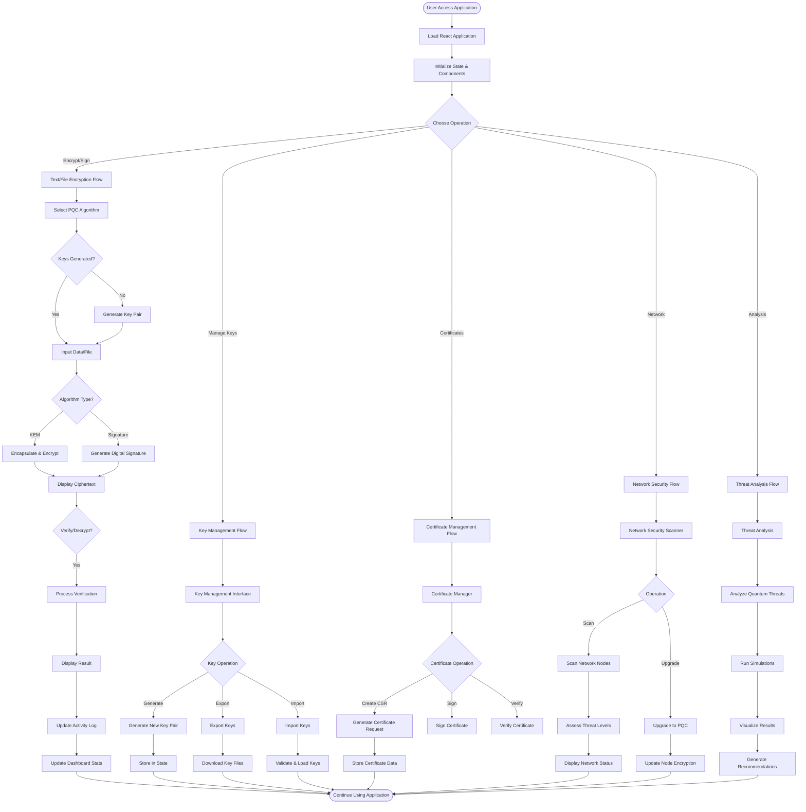
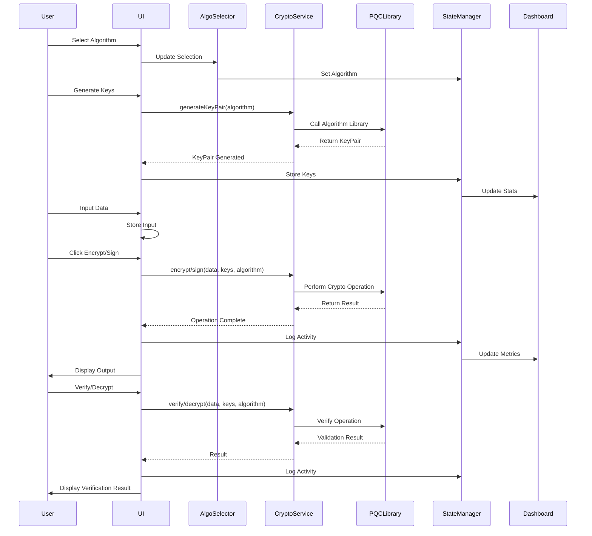
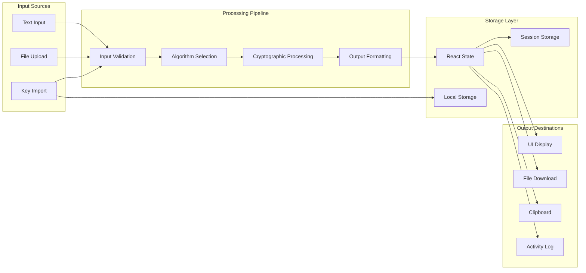
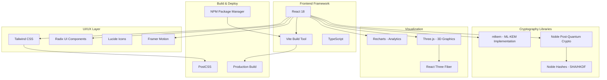

# Post-Quantum Cryptography Suite - Architecture Diagram

## System Architecture Overview

```mermaid
graph TB
    subgraph "Presentation Layer"
        UI[React UI - App.tsx]
        DASH[Dashboard]
        TABS[Tab Navigation System]
    end

    subgraph "Core Modules"
        ENC[Encryption Panel]
        FILE[File Encryption]
        KEY[Key Management]
        CERT[Certificate Manager]
        NET[Network Security]
        SIM[Quantum Simulator]
        VIZ[Security Visualization]
        THREAT[Quantum Threat Meter]
        ACT[Activity Log]
    end

    subgraph "Algorithm Selection Layer"
        ALG[Algorithm Selector]
        KYBER[CRYSTALS-Kyber KEM]
        DIL[CRYSTALS-Dilithium Signatures]
        SPHINCS[SPHINCS+ Signatures]
        NTRU[NTRU KEM]
        SABER[SABER KEM]
        FRODO[FrodoKEM]
    end

    subgraph "Cryptographic Service Layer"
        CRYPTO[CryptoService]
        KEYGEN[Key Generation]
        ENCRYPT[Encryption/Encapsulation]
        DECRYPT[Decryption/Decapsulation]
        SIGN[Digital Signing]
        VERIFY[Signature Verification]
    end

    subgraph "External Libraries"
        MLKEM[mlkem Library]
        NOBLE[Noble Post-Quantum]
        HASH[Noble Hashes]
    end

    subgraph "UI Component Library"
        RADIX[Radix UI Primitives]
        MOTION[Framer Motion]
        CHARTS[Recharts]
        THREE[Three.js/Fiber]
    end

    subgraph "State Management"
        STATE[React State Hooks]
        STATS[Statistics Tracking]
        ACTIVITY[Activity Tracking]
    end

    UI --> DASH
    UI --> TABS
    TABS --> ENC
    TABS --> FILE
    TABS --> KEY
    TABS --> CERT
    TABS --> NET
    TABS --> SIM
    TABS --> VIZ
    TABS --> THREAT
    TABS --> ACT

    ENC --> ALG
    FILE --> ALG
    KEY --> ALG
    CERT --> ALG

    ALG --> KYBER
    ALG --> DIL
    ALG --> SPHINCS
    ALG --> NTRU
    ALG --> SABER
    ALG --> FRODO

    KYBER --> CRYPTO
    DIL --> CRYPTO
    SPHINCS --> CRYPTO
    NTRU --> CRYPTO
    SABER --> CRYPTO
    FRODO --> CRYPTO

    CRYPTO --> KEYGEN
    CRYPTO --> ENCRYPT
    CRYPTO --> DECRYPT
    CRYPTO --> SIGN
    CRYPTO --> VERIFY

    KEYGEN --> MLKEM
    KEYGEN --> NOBLE
    ENCRYPT --> MLKEM
    ENCRYPT --> HASH
    DECRYPT --> MLKEM
    DECRYPT --> HASH
    SIGN --> NOBLE
    VERIFY --> NOBLE

    UI --> RADIX
    VIZ --> CHARTS
    SIM --> THREE
    UI --> MOTION

    ENC --> STATE
    FILE --> STATE
    KEY --> STATE
    STATE --> STATS
    STATE --> ACTIVITY
    STATS --> DASH
    ACTIVITY --> ACT
```

## Detailed Workflow Diagram

## Component Interaction Diagram

## Data Flow Architecture

## Technology Stack Breakdown

---

## Key Features by Module

### 1. Encryption Panel
- Text encryption/decryption
- Digital signature generation
- Signature verification with detailed results
- Support for all PQC algorithms

### 2. File Encryption
- Drag & drop file upload
- Bulk file processing
- File download after encryption
- Progress tracking

### 3. Key Management
- Key pair generation for all algorithms
- Key export (Public/Private/Both)
- Key import and validation
- Key visualization

### 4. Certificate Manager
- CSR generation
- Certificate signing
- Certificate verification
- Certificate export

### 5. Network Security
- Network node scanning
- Threat level assessment
- PQC migration recommendations
- Real-time status monitoring

### 6. Quantum Simulator
- Attack simulation
- Algorithm comparison
- Performance benchmarking

### 7. Security Visualization
- Real-time analytics
- Algorithm performance charts
- Threat trend analysis

### 8. Quantum Threat Meter
- Risk assessment
- Timeline predictions
- Migration urgency indicators

### 9. Activity Log
- Comprehensive audit trail
- Operation timestamps
- Success/failure tracking
- Algorithm usage statistics

---

**Legend:**
- Rectangles: Components/Modules
- Diamonds: Decision Points
- Arrows: Data/Control Flow
- Subgraphs: Logical Groupings
